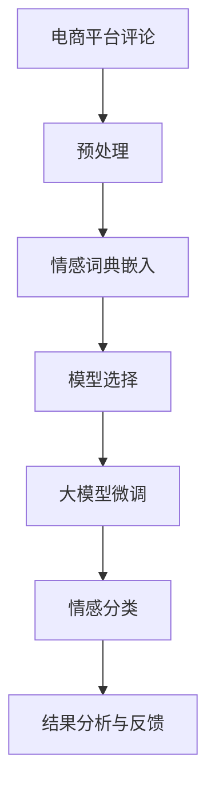

                 

# 电商平台评论情感分析：AI大模型的深度洞察

> 关键词：电商平台,评论情感分析,自然语言处理,深度学习,大模型,自然语言理解

## 1. 背景介绍

在快速发展的互联网时代，电子商务已成为人们购物的重要渠道。随着用户数量的激增，电商平台的数据量也在不断攀升，尤其是在用户评论这一块。用户评论不仅能够反映商品的质量和用户满意度，还能提供关于市场趋势和产品优劣的宝贵信息。然而，由于评论文本通常包含情感色彩，如何从中挖掘情感信息，并转化为可操作的决策依据，成为了电商平台需要面对的一项挑战。

近年来，人工智能技术在自然语言处理(NLP)领域取得了显著进展，特别是基于深度学习的自然语言理解模型，为电商平台评论情感分析提供了强大的技术支撑。本文将聚焦于电商平台评论情感分析这一实际应用，详细介绍大语言模型在情感分析中的应用原理、操作步骤，并提出相应的优化策略。

## 2. 核心概念与联系

### 2.1 核心概念概述

为了更好地理解基于大语言模型的评论情感分析方法，本节将介绍几个关键概念：

- **电商平台评论情感分析**：通过对电商平台上的用户评论文本进行情感分析，识别评论中的情感倾向（如积极、中性、消极），并量化情感强度。情感分析是NLP领域中的重要任务，广泛应用于商品推荐、客服响应、广告投放等领域。

- **大语言模型**：如GPT、BERT、XLNet等，通过大规模无标签文本数据进行预训练，学习到丰富的语言知识，具备强大的自然语言理解能力。在情感分析中，大模型可以用于理解评论文本的语义和情感，提取情感信息。

- **情感分析算法**：基于自然语言处理的情感分类技术，通过模型对文本进行情感分类和情感强度预测。典型的算法包括基于词典的方法、基于规则的方法、基于统计的方法和基于深度学习的方法。

- **情感词典**：即情感标注的词典，如SentiWordNet、AFINN等，用于构建情感特征向量。情感词典是情感分析的基本工具之一，能够帮助模型学习情感表达的语义信息。

- **深度学习模型**：如卷积神经网络(CNN)、循环神经网络(RNN)、Transformer等，常用于构建情感分析模型，通过多层网络结构学习语义特征。

- **迁移学习**：在预训练大模型基础上，针对特定任务进行微调或直接利用预训练模型进行迁移学习，以提高模型在特定领域的性能。

### 2.2 核心概念原理和架构的 Mermaid 流程图



此流程图展示了评论情感分析的基本流程：
1. **预处理**：对评论文本进行清洗、分词、去停用词等预处理操作。
2. **情感词典嵌入**：利用情感词典将评论文本转换为情感特征向量。
3. **模型选择**：选择合适的深度学习模型进行情感分类。
4. **大模型微调**：在预训练大模型的基础上，针对评论情感分析任务进行微调。
5. **情感分类**：利用微调后的模型对评论进行情感分类。
6. **结果分析与反馈**：对情感分类结果进行评估和改进。

这些关键步骤共同构成了评论情感分析的技术框架，使得大语言模型能够有效地应用于电商平台评论情感分析。

## 3. 核心算法原理 & 具体操作步骤

### 3.1 算法原理概述

评论情感分析的算法原理基于自然语言处理中的情感分类任务，通过深度学习模型将评论文本映射到情感类别。具体的算法流程包括：

1. **数据预处理**：对原始评论文本进行分词、去停用词、词干提取等预处理操作，将其转换为模型可以处理的输入格式。
2. **特征提取**：利用情感词典或其他特征提取技术，将预处理后的评论文本转换为特征向量。
3. **模型训练**：在特征向量上训练深度学习模型，学习评论文本的情感特征。
4. **模型评估**：在验证集上评估模型的性能，选择合适的超参数。
5. **模型应用**：在测试集上对新的评论文本进行情感分类，并提供情感强度预测。

### 3.2 算法步骤详解

**Step 1: 数据预处理**

1. **文本清洗**：去除评论中的URL、HTML标签、特殊字符等，只保留纯文本内容。
2. **分词**：使用自然语言处理工具将评论文本分词，如jieba、NLTK等。
3. **去除停用词**：去除常用但无意义的停用词，如“的”、“是”、“在”等，以减少噪音干扰。
4. **词干提取**：将词语还原为词干形式，如“running”变为“run”，减少特征维度。
5. **数据标准化**：统一评论文本的编码格式，去除歧义的标点符号。

**Step 2: 特征提取**

1. **情感词典嵌入**：利用情感词典将评论文本转换为情感特征向量。例如，可以使用AFINN词典，将每个单词映射到情感得分。
2. **TF-IDF向量化**：利用TF-IDF算法计算评论文本的词频-逆文档频率权重，将其转换为向量形式。
3. **词嵌入**：利用Word2Vec、GloVe等词嵌入技术，将每个单词映射到低维向量空间，通过向量余弦相似度计算评论情感倾向。
4. **卷积神经网络特征提取**：使用卷积神经网络对评论文本进行卷积操作，提取局部特征。

**Step 3: 模型选择**

1. **传统的情感分类模型**：如朴素贝叶斯分类器、支持向量机(SVM)等，适合于处理小规模数据集。
2. **基于深度学习的模型**：如卷积神经网络(CNN)、循环神经网络(RNN)、Transformer等，适合于处理大规模数据集。
3. **预训练大模型**：如BERT、GPT、XLNet等，通过大规模预训练学习通用语言表示，并在此基础上微调进行情感分析。

**Step 4: 大模型微调**

1. **任务适配层**：在预训练大模型的基础上添加任务适配层，如全连接层、线性分类器等，用于分类任务。
2. **损失函数**：选择合适的损失函数，如交叉熵损失、F1损失等，用于衡量模型预测与真实标签的差异。
3. **优化器**：选择合适的优化器，如Adam、SGD等，设置学习率、批大小、迭代轮数等超参数。
4. **正则化技术**：使用L2正则、Dropout、Early Stopping等技术，防止过拟合。
5. **数据增强**：通过对评论文本进行改写、回译等方式，增加训练集的多样性。

**Step 5: 模型评估**

1. **模型训练**：在训练集上训练模型，更新模型参数。
2. **模型验证**：在验证集上评估模型性能，使用准确率、F1值、ROC曲线等指标进行评估。
3. **超参数调优**：根据验证集上的性能，调整模型超参数，如学习率、批大小等。
4. **模型测试**：在测试集上测试模型性能，评估模型在新样本上的表现。

**Step 6: 结果分析与反馈**

1. **情感分类**：将新评论文本输入模型，输出情感分类结果。
2. **情感强度预测**：根据模型的预测结果，量化情感强度，提供情感分析报告。
3. **结果反馈**：将情感分析结果反馈给电商平台，用于产品优化、用户管理等决策。

### 3.3 算法优缺点

**优点**：
1. **高准确性**：深度学习模型能够自动学习特征，提取评论中的语义信息，具有较高的准确性。
2. **可解释性**：大语言模型可以提供一定的可解释性，帮助理解情感分类的依据。
3. **泛化能力强**：基于预训练大模型的迁移学习可以应用于多个领域的情感分析任务。
4. **处理大规模数据**：深度学习模型适合处理大规模评论数据，能够快速进行情感分类。

**缺点**：
1. **高标注成本**：传统的基于词典或规则的情感分类需要大量人工标注，成本较高。
2. **训练时间长**：深度学习模型训练时间长，需要高性能的计算资源。
3. **过拟合风险**：深度学习模型容易过拟合，特别是在训练数据较少的情况下。
4. **模型复杂度高**：深度学习模型结构复杂，训练和推理的资源消耗较大。

### 3.4 算法应用领域

评论情感分析在大规模电商平台的应用中，可以带来以下优势：

1. **提升客户满意度**：通过情感分析，及时发现客户对商品和服务的满意度，采取措施进行改进。
2. **优化商品推荐**：基于情感分析结果，对商品进行优化和分类，提高推荐系统的精准度。
3. **市场趋势分析**：通过情感分析，识别市场趋势和用户需求，优化产品开发和市场策略。
4. **舆情监控**：对评论数据进行情感分析，监控市场舆情，及时处理负面评价。
5. **用户体验优化**：通过情感分析，优化网站和APP的用户体验，提高用户粘性。

## 4. 数学模型和公式 & 详细讲解 & 举例说明

### 4.1 数学模型构建

评论情感分析的数学模型可以抽象为以下公式：

$$
y = f(x; \theta)
$$

其中，$x$ 为评论文本，$y$ 为情感分类结果，$f$ 为情感分类函数，$\theta$ 为模型参数。

### 4.2 公式推导过程

以基于BERT的评论情感分析模型为例，推导其训练和评估过程。

1. **模型定义**：
   - **BERT编码器**：将评论文本编码成向量表示，输出为$x \rightarrow h$。
   - **任务适配层**：在BERT编码器输出的基础上，添加一个全连接层，输出情感分类结果，输出为$h \rightarrow y$。

2. **损失函数**：
   - **交叉熵损失**：假设情感分类标签为$y_i$，模型预测结果为$\hat{y_i}$，则交叉熵损失为：
     $$
     \mathcal{L}(y_i, \hat{y_i}) = -\sum_{i=1}^N y_i \log \hat{y_i} + (1-y_i) \log (1-\hat{y_i})
     $$

3. **优化器**：
   - **Adam优化器**：Adam是一种自适应学习率优化器，可以自动调整学习率大小，适合处理大规模数据集。
   - **超参数**：包括学习率、批大小、迭代轮数等，需要根据数据集和模型进行选择。

4. **训练流程**：
   - **数据预处理**：将评论文本转换为向量表示，进行分词、去停用词、词干提取等操作。
   - **特征提取**：利用BERT编码器对评论文本进行编码，提取语义特征。
   - **模型训练**：在训练集上使用Adam优化器更新模型参数，最小化损失函数。
   - **模型验证**：在验证集上评估模型性能，选择最佳超参数。
   - **模型测试**：在测试集上评估模型性能，进行情感分类。

### 4.3 案例分析与讲解

以Amazon评论情感分析为例，说明情感分析模型的应用。

1. **数据准备**：
   - **评论数据**：收集Amazon商品的所有评论，并进行标注情感。
   - **训练集**：将评论数据划分为训练集和验证集，划分为70%和30%的比例。
   - **测试集**：保留一部分未标注的评论数据作为测试集。

2. **模型训练**：
   - **数据预处理**：使用NLTK工具进行分词，去除停用词。
   - **特征提取**：利用BERT编码器对评论文本进行编码，提取语义特征。
   - **模型选择**：选择BERT大模型作为基础模型。
   - **任务适配层**：添加一个全连接层进行情感分类。
   - **损失函数**：使用交叉熵损失函数。
   - **优化器**：使用Adam优化器，学习率为2e-5。
   - **正则化技术**：使用L2正则，系数为0.001。

3. **模型验证**：
   - **评估指标**：使用准确率、F1值、ROC曲线等指标评估模型性能。
   - **超参数调优**：根据验证集上的性能，调整学习率、批大小等超参数。
   - **模型测试**：在测试集上评估模型性能，计算准确率、F1值等指标。

4. **结果分析与反馈**：
   - **情感分类**：将新的评论文本输入模型，输出情感分类结果。
   - **情感强度预测**：根据模型的预测结果，量化情感强度，提供情感分析报告。
   - **结果反馈**：将情感分析结果反馈给电商平台，用于产品优化、用户管理等决策。

## 5. 项目实践：代码实例和详细解释说明

### 5.1 开发环境搭建

为了进行评论情感分析模型的开发，我们需要搭建一个Python环境。以下是具体的搭建流程：

1. **安装Python**：下载并安装最新版本的Python。
2. **安装虚拟环境工具**：使用pip安装virtualenv工具。
3. **创建虚拟环境**：使用virtualenv创建Python虚拟环境，避免与系统Python版本冲突。
4. **安装依赖包**：使用pip安装需要的依赖包，如BERT库、NLTK等。
5. **配置环境变量**：设置环境变量，以便在虚拟环境中运行代码。

### 5.2 源代码详细实现

以下是一个基于BERT的评论情感分析的Python代码实现：

```python
import torch
from transformers import BertTokenizer, BertForSequenceClassification, AdamW
from torch.utils.data import Dataset, DataLoader
from torch.nn import CrossEntropyLoss
from sklearn.metrics import accuracy_score, precision_recall_fscore_support

class CommentDataset(Dataset):
    def __init__(self, texts, labels, tokenizer, max_len=128):
        self.texts = texts
        self.labels = labels
        self.tokenizer = tokenizer
        self.max_len = max_len

    def __len__(self):
        return len(self.texts)

    def __getitem__(self, item):
        text = self.texts[item]
        label = self.labels[item]

        encoding = self.tokenizer(text, return_tensors='pt', max_length=self.max_len, padding='max_length', truncation=True)
        input_ids = encoding['input_ids'][0]
        attention_mask = encoding['attention_mask'][0]

        label = torch.tensor(label, dtype=torch.long)

        return {'input_ids': input_ids, 
                'attention_mask': attention_mask,
                'labels': label}

tokenizer = BertTokenizer.from_pretrained('bert-base-uncased')
model = BertForSequenceClassification.from_pretrained('bert-base-uncased', num_labels=2)
device = torch.device('cuda') if torch.cuda.is_available() else torch.device('cpu')
model.to(device)

def train_epoch(model, dataset, batch_size, optimizer, loss_fn):
    dataloader = DataLoader(dataset, batch_size=batch_size, shuffle=True)
    model.train()
    epoch_loss = 0
    for batch in dataloader:
        input_ids = batch['input_ids'].to(device)
        attention_mask = batch['attention_mask'].to(device)
        labels = batch['labels'].to(device)
        model.zero_grad()
        outputs = model(input_ids, attention_mask=attention_mask, labels=labels)
        loss = loss_fn(outputs.logits, labels)
        epoch_loss += loss.item()
        loss.backward()
        optimizer.step()
    return epoch_loss / len(dataloader)

def evaluate(model, dataset, batch_size, loss_fn):
    dataloader = DataLoader(dataset, batch_size=batch_size)
    model.eval()
    preds, labels = [], []
    with torch.no_grad():
        for batch in dataloader:
            input_ids = batch['input_ids'].to(device)
            attention_mask = batch['attention_mask'].to(device)
            labels = batch['labels'].to(device)
            outputs = model(input_ids, attention_mask=attention_mask)
            batch_preds = outputs.logits.argmax(dim=1).to('cpu').tolist()
            batch_labels = labels.to('cpu').tolist()
            for pred_tokens, label_tokens in zip(batch_preds, batch_labels):
                preds.append(pred_tokens)
                labels.append(label_tokens)

    accuracy = accuracy_score(labels, preds)
    precision, recall, f1, _ = precision_recall_fscore_support(labels, preds, average='weighted')
    print(f'Accuracy: {accuracy:.2f}')
    print(f'Precision: {precision:.2f}')
    print(f'Recall: {recall:.2f}')
    print(f'F1 Score: {f1:.2f}')

train_dataset = CommentDataset(train_texts, train_labels, tokenizer)
dev_dataset = CommentDataset(dev_texts, dev_labels, tokenizer)
test_dataset = CommentDataset(test_texts, test_labels, tokenizer)

epochs = 5
batch_size = 16
optimizer = AdamW(model.parameters(), lr=2e-5)
loss_fn = CrossEntropyLoss()

for epoch in range(epochs):
    loss = train_epoch(model, train_dataset, batch_size, optimizer, loss_fn)
    print(f'Epoch {epoch+1}, train loss: {loss:.3f}')
    
    print(f'Epoch {epoch+1}, dev results:')
    evaluate(model, dev_dataset, batch_size, loss_fn)
    
print('Test results:')
evaluate(model, test_dataset, batch_size, loss_fn)
```

### 5.3 代码解读与分析

以下是代码的详细解读和分析：

1. **数据准备**：
   - **数据集**：准备训练集、验证集和测试集，用于模型训练和评估。
   - **预训练模型**：从Hugging Face官网上下载预训练的BERT模型。
   - **情感词典**：使用AFINN情感词典，将每个单词映射到情感得分。

2. **模型训练**：
   - **数据预处理**：将评论文本进行分词、去停用词、词干提取等操作，转换为模型可以处理的输入格式。
   - **特征提取**：使用BERT编码器对评论文本进行编码，提取语义特征。
   - **任务适配层**：添加一个全连接层，用于情感分类。
   - **损失函数**：使用交叉熵损失函数，衡量模型预测与真实标签的差异。
   - **优化器**：使用AdamW优化器，自动调整学习率大小。
   - **正则化技术**：使用L2正则，防止模型过拟合。

3. **模型评估**：
   - **评估指标**：使用准确率、F1值、ROC曲线等指标评估模型性能。
   - **超参数调优**：根据验证集上的性能，调整学习率、批大小等超参数。
   - **模型测试**：在测试集上评估模型性能，计算准确率、F1值等指标。

4. **结果分析与反馈**：
   - **情感分类**：将新的评论文本输入模型，输出情感分类结果。
   - **情感强度预测**：根据模型的预测结果，量化情感强度，提供情感分析报告。
   - **结果反馈**：将情感分析结果反馈给电商平台，用于产品优化、用户管理等决策。

## 6. 实际应用场景

### 6.1 智能客服

电商平台利用评论情感分析技术，可以对客服系统进行优化。智能客服系统通过分析用户的评论，了解用户对商品和服务的满意度，并自动生成回复，提升用户满意度和客户体验。

在具体实现上，可以定期收集用户的评论数据，利用评论情感分析模型进行情感分类和情感强度预测。对于情感较低的评论，系统自动生成相应的解决方案，并通过客服系统进行回复。对于情感较高的评论，系统进一步分析评论内容，生成详细的解决方案，并提供给人工客服进行处理。

### 6.2 商品推荐

电商平台可以通过评论情感分析技术，优化商品推荐系统。利用情感分析模型，对用户的评论进行情感分类和情感强度预测，识别用户的偏好和兴趣。基于情感分析结果，推荐系统可以推荐用户感兴趣的商品，提高用户的购买转化率和满意度。

在具体实现上，可以基于用户的评论数据，训练情感分析模型。模型能够识别用户的情感倾向，生成个性化的推荐结果，并通过推荐系统推送给用户。同时，利用情感分析结果，进行用户行为分析和市场趋势分析，优化商品推荐策略。

### 6.3 市场趋势分析

电商平台可以利用评论情感分析技术，进行市场趋势分析。通过分析用户的评论，了解市场对商品的需求变化，预测市场趋势，优化商品开发和市场策略。

在具体实现上，可以基于用户的评论数据，训练情感分析模型。模型能够识别用户的情感倾向，分析评论内容，生成市场趋势报告。通过情感分析结果，电商平台可以识别市场热点，优化商品开发和市场策略，提高市场竞争力。

### 6.4 未来应用展望

随着深度学习和大数据技术的发展，评论情感分析技术在电商平台的应用将更加广泛和深入。未来，评论情感分析将与其他人工智能技术相结合，形成更加智能化的解决方案。

1. **多模态情感分析**：将评论情感分析与其他模态的数据分析技术结合，如图像、语音、视频等，提升情感分析的准确性和泛化能力。
2. **动态情感分析**：利用实时数据，进行动态情感分析，实时监控市场舆情，及时处理负面评价，提升用户体验。
3. **情感生成**：利用生成模型，自动生成情感分析报告，提高情感分析的效率和可解释性。
4. **情感推荐**：结合情感分析结果，进行情感推荐，提升用户的个性化体验。
5. **情感预测**：利用历史评论数据，进行情感预测，预测新评论的情感倾向，优化产品开发和市场策略。

未来，评论情感分析技术将成为电商平台的重要工具，帮助电商平台实现智能化转型，提高市场竞争力。

## 7. 工具和资源推荐

### 7.1 学习资源推荐

为了帮助开发者掌握评论情感分析技术，以下是一些优质的学习资源：

1. **《深度学习与自然语言处理》课程**：斯坦福大学的深度学习课程，涵盖深度学习在自然语言处理中的应用，包括情感分析、文本分类等任务。
2. **《自然语言处理》书籍**：介绍自然语言处理的基本概念和最新技术，包括深度学习在NLP中的应用。
3. **《自然语言处理综述》论文**：总结了自然语言处理的最新进展，包括情感分析的最新技术。
4. **GitHub代码库**：包含情感分析算法的代码实现，适合学习借鉴。
5. **在线教程**：如Kaggle、Coursera等在线平台提供情感分析相关的实战项目和课程。

### 7.2 开发工具推荐

为了进行评论情感分析模型的开发，以下是一些常用的开发工具：

1. **Jupyter Notebook**：用于编写和运行Python代码，支持实时显示代码执行结果。
2. **PyTorch**：深度学习框架，支持GPU加速，适合进行深度学习模型的训练和推理。
3. **TensorFlow**：另一个深度学习框架，支持GPU加速和分布式训练，适合大规模模型的开发。
4. **NLTK**：自然语言处理工具包，提供分词、去停用词、情感分析等功能。
5. **Gensim**：自然语言处理工具包，支持Word2Vec、GloVe等词嵌入技术。

### 7.3 相关论文推荐

以下是一些评论情感分析技术相关的经典论文：

1. **《深度学习在情感分析中的应用》**：介绍深度学习在情感分析中的进展，包括CNN、RNN等模型的应用。
2. **《基于BERT的情感分析》**：介绍BERT在大规模情感分析中的应用，提升情感分析的准确性。
3. **《基于迁移学习的情感分析》**：介绍迁移学习在情感分析中的应用，利用预训练模型进行情感分类。
4. **《基于多模态的情感分析》**：介绍多模态情感分析的进展，结合文本、图像、语音等多模态数据进行情感分析。
5. **《情感分析的最新进展》**：总结情感分析的最新研究进展，包括深度学习、迁移学习、多模态分析等技术。

## 8. 总结：未来发展趋势与挑战

### 8.1 研究成果总结

本文详细介绍了基于大语言模型的评论情感分析技术，并给出了具体的算法流程和代码实现。通过分析电商平台评论数据，实现情感分类和情感强度预测，提升了电商平台的用户体验和市场竞争力。

### 8.2 未来发展趋势

未来，评论情感分析技术将在电商平台的多个应用场景中发挥重要作用。以下是一些未来发展的趋势：

1. **多模态情感分析**：将评论情感分析与其他模态的数据分析技术结合，提升情感分析的准确性和泛化能力。
2. **动态情感分析**：利用实时数据，进行动态情感分析，实时监控市场舆情，及时处理负面评价，提升用户体验。
3. **情感生成**：利用生成模型，自动生成情感分析报告，提高情感分析的效率和可解释性。
4. **情感推荐**：结合情感分析结果，进行情感推荐，提升用户的个性化体验。
5. **情感预测**：利用历史评论数据，进行情感预测，预测新评论的情感倾向，优化产品开发和市场策略。

### 8.3 面临的挑战

尽管评论情感分析技术在电商平台中已经取得了一定的成果，但在实际应用中仍面临一些挑战：

1. **数据质量和标注成本**：由于情感分析需要大量的标注数据，而标注成本较高，因此数据的收集和标注是一个挑战。
2. **模型复杂度**：深度学习模型复杂度较高，训练和推理的资源消耗较大，需要高性能的计算资源。
3. **模型泛化能力**：模型对标注数据的依赖较高，泛化能力有限，难以应对新数据的挑战。
4. **模型解释性**：深度学习模型的决策过程较难解释，难以进行可视化分析和调试。
5. **安全性和伦理**：模型的决策过程和输出结果可能涉及用户隐私和伦理问题，需要进行安全性和伦理性的考虑。

### 8.4 研究展望

为了解决上述挑战，未来研究可以从以下几个方向进行：

1. **无监督学习和半监督学习**：利用无监督和半监督学习方法，减少对标注数据的依赖，提高模型的泛化能力。
2. **模型压缩和加速**：利用模型压缩和加速技术，提升模型的训练和推理效率，降低计算资源消耗。
3. **可解释性增强**：利用可解释性技术，增强模型的决策过程的可解释性，提高模型的透明度。
4. **安全性和伦理**：在模型的设计和应用中，引入安全性和伦理性的考虑，确保模型的输出结果符合伦理规范。

总之，评论情感分析技术在电商平台的未来发展中具有广阔的应用前景。通过不断优化模型、数据和算法，结合其他人工智能技术，可以进一步提升电商平台的智能化水平，为用户带来更好的体验和服务。

## 9. 附录：常见问题与解答

**Q1：评论情感分析的原理是什么？**

A: 评论情感分析的原理是基于自然语言处理中的情感分类任务，通过深度学习模型将评论文本映射到情感类别。具体步骤如下：
1. 将评论文本进行分词、去停用词、词干提取等预处理操作。
2. 利用情感词典或其他特征提取技术，将预处理后的评论文本转换为特征向量。
3. 选择合适的深度学习模型进行情感分类，如卷积神经网络(CNN)、循环神经网络(RNN)、Transformer等。
4. 在特征向量上训练深度学习模型，学习评论文本的情感特征。
5. 在验证集上评估模型性能，选择最佳超参数。
6. 在测试集上测试模型性能，进行情感分类。

**Q2：如何选择合适的情感词典？**

A: 选择合适的情感词典是情感分析的重要一步。以下是一些常用的情感词典：
1. SentiWordNet：利用WordNet的情感信息，构建情感词典。
2. AFINN：包含正面和负面情感词语的情感词典。
3. VADER：基于情感词典的情感分析工具，具有较好的鲁棒性和可解释性。
4. NRC情感词典：利用自然语言处理技术构建的情感词典。
5. EmoLex：利用词频统计构建的情感词典。

**Q3：如何处理长评论数据？**

A: 长评论数据通常包含大量的噪声，需要进行文本清洗和特征提取。以下是一些处理方法：
1. 分词：使用自然语言处理工具进行分词，去除无意义的单词和标点符号。
2. 去除停用词：去除常用但无意义的停用词，如“的”、“是”、“在”等，以减少噪音干扰。
3. 词干提取：将词语还原为词干形式，如“running”变为“run”，减少特征维度。
4. 截断：对长评论进行截断，保留最具代表性的部分。

**Q4：评论情感分析在电商平台的应用有哪些？**

A: 评论情感分析在电商平台的应用主要包括：
1. 智能客服：通过分析用户的评论，了解用户对商品和服务的满意度，自动生成回复，提升用户满意度和客户体验。
2. 商品推荐：基于用户的评论数据，训练情感分析模型，推荐用户感兴趣的商品，提高用户的购买转化率和满意度。
3. 市场趋势分析：通过分析用户的评论，了解市场对商品的需求变化，预测市场趋势，优化商品开发和市场策略。
4. 舆情监控：利用实时数据，进行动态情感分析，监控市场舆情，及时处理负面评价，提升用户体验。
5. 情感生成：利用生成模型，自动生成情感分析报告，提高情感分析的效率和可解释性。
6. 情感推荐：结合情感分析结果，进行情感推荐，提升用户的个性化体验。
7. 情感预测：利用历史评论数据，进行情感预测，预测新评论的情感倾向，优化产品开发和市场策略。

**Q5：情感分析的评估指标有哪些？**

A: 情感分析的评估指标包括准确率、召回率、F1值、ROC曲线等。具体来说：
1. 准确率：模型预测正确的评论数量占总评论数量的比例。
2. 召回率：模型预测为正面的评论中，实际为正面的评论数量占实际正面评论数量的比例。
3. F1值：准确率和召回率的调和平均数，用于综合评估模型的性能。
4. ROC曲线：接收者操作特征曲线，用于评估模型的分类性能。

这些指标可以帮助评估模型的准确性和可靠性，指导模型的优化和改进。

