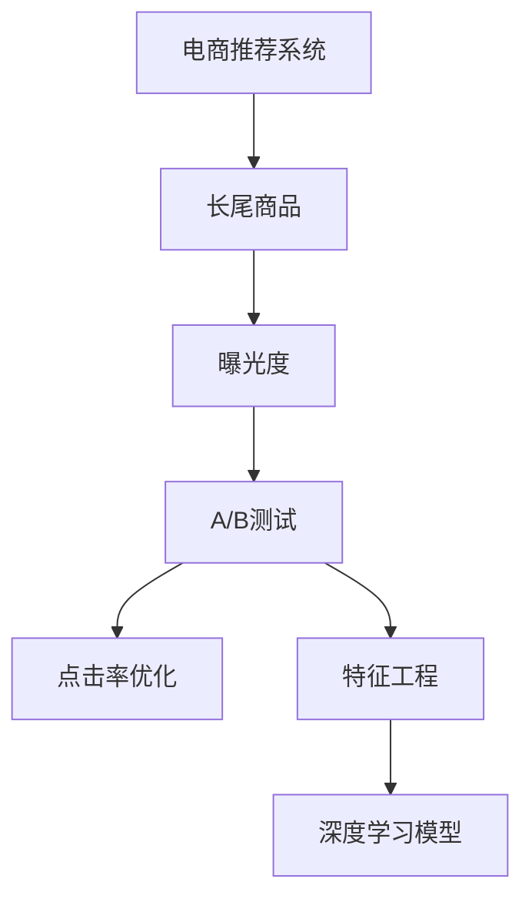

                 

# 电商推荐系统中的长尾商品曝光策略

> 关键词：电商推荐系统, 长尾商品, 曝光策略, A/B测试, 点击率优化, 特征工程, 深度学习模型

## 1. 背景介绍

### 1.1 问题由来
随着电商平台的快速发展和用户消费行为的多样化，个性化推荐系统成为了提升用户体验、增加销售额的重要工具。然而，现有的推荐算法往往更关注用户的热门商品，忽视了长尾商品的曝光，这导致长尾商品的点击率较低，推荐效果不佳。

长尾商品指的是那些市场份额较低、但具有高利润潜力的商品。对于长尾商品而言，市场竞争较小，价格相对有优势，但在电商平台上往往由于曝光不足而难以被用户发现。为解决这一问题，电商推荐系统中的长尾商品曝光策略应运而生。

### 1.2 问题核心关键点
长尾商品曝光策略的核心在于通过合理分配推荐资源，提高长尾商品的曝光度，从而提升其点击率，增加电商平台的收入。关键在于如何在有限的展示位上，均衡地展示热门商品和长尾商品，最大化整体点击率。

## 2. 核心概念与联系

### 2.1 核心概念概述

为更好地理解电商推荐系统中的长尾商品曝光策略，本节将介绍几个密切相关的核心概念：

- 电商推荐系统：通过分析用户行为数据，为用户提供个性化的商品推荐，从而提升用户购买决策效率和平台销售额的系统。
- 长尾商品：指那些市场份额较低、但具有高利润潜力的商品，其数量庞大但分散，每个商品的销售量很少。
- 曝光度：指商品在用户面前的展示次数，直接影响用户对商品的认知和购买决策。
- A/B测试：通过对比不同版本的产品或策略，评估其效果优劣的一种实验方法。
- 点击率优化：通过优化商品曝光策略，提升用户对商品的点击率，进而提升电商平台的转化率。
- 特征工程：根据数据特点，设计特征变量，通过特征选择和特征提取，提高模型的预测能力。
- 深度学习模型：基于神经网络架构，通过大量数据训练，学习商品特征和用户行为之间的关系，实现个性化推荐。

这些核心概念之间的逻辑关系可以通过以下Mermaid流程图来展示：



这个流程图展示了几组核心概念及其之间的关系：

1. 电商推荐系统通过长尾商品曝光策略，提升长尾商品的曝光度。
2. 曝光度是衡量长尾商品被用户看到的机会，直接影响其点击率和销售额。
3. A/B测试用于评估不同曝光策略的效果，选择最佳方案。
4. 点击率优化通过优化曝光策略，提升整体点击率。
5. 特征工程设计有意义的特征变量，提升模型的预测能力。
6. 深度学习模型利用大数据学习用户行为和商品特征的关系，实现个性化推荐。

## 3. 核心算法原理 & 具体操作步骤
### 3.1 算法原理概述

长尾商品曝光策略的核心理念是通过合理分配推荐资源，提升长尾商品的曝光度。主要步骤如下：

1. **数据收集与预处理**：收集用户行为数据，包括浏览、点击、购买等行为，并进行预处理，如去重、填补缺失值等。
2. **特征工程**：设计有意义的特征变量，如用户画像、商品属性、浏览历史等，用于构建推荐模型。
3. **模型训练与评估**：利用深度学习模型训练推荐系统，评估不同策略的效果，选择最佳模型。
4. **曝光策略设计**：设计多种曝光策略，如固定位置、轮流曝光等，通过A/B测试选择最佳策略。
5. **点击率优化**：利用点击率优化算法，动态调整曝光策略，提升整体点击率。

### 3.2 算法步骤详解

以下我们将详细介绍长尾商品曝光策略的具体实现步骤：

**Step 1: 数据收集与预处理**

1. 数据收集：收集用户的浏览记录、购买记录等数据，包括用户的基本信息、商品属性、购买行为等。
2. 数据预处理：对数据进行清洗、去重、填补缺失值等预处理，保证数据质量。
3. 数据划分：将数据划分为训练集、验证集和测试集。

**Step 2: 特征工程**

1. 特征选择：选择对用户行为预测有重要影响的特征，如用户画像、商品属性、浏览历史等。
2. 特征提取：利用深度学习中的Embedding层，将特征变量转化为向量表示，用于模型训练。
3. 特征组合：设计有意义的特征组合，如用户画像与商品属性的组合，增强模型的预测能力。

**Step 3: 模型训练与评估**

1. 模型选择：选择合适的深度学习模型，如Transformer、SVM等，用于训练推荐系统。
2. 模型训练：利用训练集数据，通过反向传播算法更新模型参数。
3. 模型评估：在验证集上评估模型性能，选择表现最好的模型进行下一步测试。

**Step 4: 曝光策略设计**

1. 策略设计：设计多种曝光策略，如固定位置、轮流曝光等。
2. 策略实施：在测试集上实施不同的曝光策略，评估其效果。
3. 策略选择：选择最优的曝光策略进行推广。

**Step 5: 点击率优化**

1. 点击率优化算法：选择合适的点击率优化算法，如梯度提升树、线性回归等。
2. 动态调整：根据点击率优化算法，动态调整曝光策略，提升整体点击率。
3. 策略迭代：定期评估点击率优化效果，持续迭代优化曝光策略。

### 3.3 算法优缺点

长尾商品曝光策略具有以下优点：

1. 提升长尾商品曝光度：通过合理分配推荐资源，提高长尾商品的曝光率，增加其销售额。
2. 优化点击率：利用点击率优化算法，动态调整曝光策略，提升整体点击率。
3. 个性化推荐：利用深度学习模型，根据用户行为和商品特征，实现个性化推荐，提升用户满意度。

同时，该策略也存在一定的局限性：

1. 数据需求高：需要大量的用户行为数据，收集和处理成本较高。
2. 模型复杂度高：深度学习模型复杂，需要大量的计算资源和时间。
3. 策略调整困难：曝光策略的动态调整可能带来模型不稳定的问题。
4. 市场风险高：长尾商品市场竞争较小，但如果用户需求突然变化，可能导致库存积压。

尽管存在这些局限性，但长尾商品曝光策略仍是大规模电商推荐系统的关键技术之一，能够显著提升长尾商品的曝光率和销售额。

### 3.4 算法应用领域

长尾商品曝光策略在电商推荐系统中得到广泛应用，适用于各种商品类型和用户需求场景。例如：

- 服装电商：通过推荐长尾服装商品，满足用户的个性化需求，增加销售额。
- 书籍电商：推荐长尾图书，提升用户对新书、冷门书的认知，增加平台书单的多样性。
- 家电电商：推荐长尾家电产品，提升用户对高性价比产品的购买意愿，增加销售量。
- 食品电商：推荐长尾食品商品，满足用户的特殊口味和健康需求，增加平台的丰富度。

除了这些典型应用外，长尾商品曝光策略也被创新性地应用到更多场景中，如个性化搜索、广告投放等，为电商平台提供了新的用户触达和转化路径。

## 4. 数学模型和公式 & 详细讲解  
### 4.1 数学模型构建

本节将使用数学语言对长尾商品曝光策略进行更加严格的刻画。

记用户行为数据为 $D=\{(x_i, y_i)\}_{i=1}^N, x_i$ 表示用户行为，$y_i$ 表示用户标签（如购买、浏览等）。假设模型为 $M_{\theta}$，其中 $\theta$ 为模型参数。长尾商品曝光策略的数学模型可表示为：

$$
M_{\theta} = \mathop{\arg\min}_{\theta} \sum_{i=1}^N [L(y_i, M_{\theta}(x_i)) + \lambda R(\theta)]
$$

其中 $L$ 为损失函数，$R$ 为正则化函数，$\lambda$ 为正则化系数。损失函数 $L$ 通常采用交叉熵损失函数：

$$
L(y_i, M_{\theta}(x_i)) = -\sum_{k=1}^C y_{ik}\log M_{\theta}(x_i,k)
$$

其中 $C$ 表示类别数量，$y_{ik}$ 表示样本 $i$ 属于类别 $k$ 的标签。

### 4.2 公式推导过程

以下我们以点击率优化为例，推导点击率优化算法的数学模型和损失函数。

假设用户对商品 $j$ 的点击率为 $r_j$，模型预测用户对商品 $j$ 的点击概率为 $\hat{r}_j$，则点击率优化问题可表示为：

$$
\min_{\theta} \sum_{i=1}^N \sum_{j=1}^J [y_{ij}\log \hat{r}_j + (1-y_{ij})\log (1-\hat{r}_j)] + \lambda R(\theta)
$$

其中 $y_{ij}$ 表示用户对商品 $j$ 的点击行为，$\hat{r}_j$ 为模型预测的用户对商品 $j$ 的点击概率，$J$ 为商品总数。

利用梯度下降等优化算法，迭代更新模型参数 $\theta$，最小化损失函数。具体优化过程如下：

1. 计算损失函数的梯度：
$$
\frac{\partial \mathcal{L}}{\partial \theta} = -\sum_{i=1}^N \sum_{j=1}^J [y_{ij}\frac{\partial \log \hat{r}_j}{\partial \theta} + (1-y_{ij})\frac{\partial \log(1-\hat{r}_j)}{\partial \theta}] + \frac{\partial R(\theta)}{\partial \theta}
$$

2. 更新模型参数：
$$
\theta \leftarrow \theta - \eta \frac{\partial \mathcal{L}}{\partial \theta}
$$

其中 $\eta$ 为学习率，$R(\theta)$ 为正则化函数。

### 4.3 案例分析与讲解

以推荐长尾图书为例，假设推荐系统有 $N=10000$ 个用户，$J=1000$ 种图书，$y_{ij}$ 表示用户 $i$ 是否购买了图书 $j$。用户 $i$ 对图书 $j$ 的点击概率 $\hat{r}_j$ 由模型预测得出。

假设我们采用了二分类逻辑回归模型，则损失函数为：

$$
\mathcal{L}(\theta) = -\frac{1}{N}\sum_{i=1}^N \sum_{j=1}^J [y_{ij}\log \hat{r}_j + (1-y_{ij})\log(1-\hat{r}_j)] + \lambda \sum_{i=1}^N \|\theta_i\|^2
$$

其中 $\theta_i$ 表示用户 $i$ 的特征表示向量，$\|\theta_i\|^2$ 为正则项。

假设模型参数 $\theta$ 包含用户画像、图书属性等特征，则损失函数的梯度计算如下：

$$
\frac{\partial \mathcal{L}}{\partial \theta} = -\frac{1}{N}\sum_{i=1}^N \sum_{j=1}^J [y_{ij}\frac{\partial \log \hat{r}_j}{\partial \theta} + (1-y_{ij})\frac{\partial \log(1-\hat{r}_j)}{\partial \theta}]
$$

通过梯度下降算法，不断更新模型参数，最小化损失函数，最终得到优化后的模型参数 $\theta^*$。利用优化后的模型，在推荐系统中实现长尾图书的个性化推荐。

## 5. 项目实践：代码实例和详细解释说明
### 5.1 开发环境搭建

在进行长尾商品曝光策略的实践前，我们需要准备好开发环境。以下是使用Python进行PyTorch开发的环境配置流程：

1. 安装Anaconda：从官网下载并安装Anaconda，用于创建独立的Python环境。

2. 创建并激活虚拟环境：
```bash
conda create -n ecomm-env python=3.8 
conda activate ecomm-env
```

3. 安装PyTorch：根据CUDA版本，从官网获取对应的安装命令。例如：
```bash
conda install pytorch torchvision torchaudio cudatoolkit=11.1 -c pytorch -c conda-forge
```

4. 安装Pandas：
```bash
conda install pandas
```

5. 安装Scikit-learn：
```bash
conda install scikit-learn
```

6. 安装TensorBoard：
```bash
pip install tensorboard
```

完成上述步骤后，即可在`ecomm-env`环境中开始长尾商品曝光策略的实践。

### 5.2 源代码详细实现

这里我们以长尾图书推荐为例，给出使用PyTorch实现长尾商品曝光策略的代码实现。

首先，定义数据处理函数：

```python
import pandas as pd
from sklearn.model_selection import train_test_split
from sklearn.preprocessing import OneHotEncoder
from sklearn.compose import ColumnTransformer
from sklearn.pipeline import Pipeline

def load_data(data_path):
    df = pd.read_csv(data_path)
    return df

def preprocess_data(df):
    # 特征选择和提取
    features = ['user_age', 'user_interest', 'book_genre', 'book_price']
    target = 'book_purchased'

    # 特征编码
    categorical_features = ['user_interest', 'book_genre']
    numerical_features = ['user_age', 'book_price']
    preprocessor = ColumnTransformer(
        transformers=[
            ('num', OneHotEncoder(), numerical_features),
            ('cat', OneHotEncoder(), categorical_features)
        ]
    )

    # 特征组合
    features = pd.concat([df[features], preprocessor.fit_transform(df[[features]])], axis=1)

    # 数据拆分
    X_train, X_val, y_train, y_val = train_test_split(features, df[target], test_size=0.2, random_state=42)

    return X_train, X_val, y_train, y_val
```

然后，定义模型和优化器：

```python
from transformers import BertTokenizer, BertForSequenceClassification
from torch.optim import Adam

# 定义模型
model = BertForSequenceClassification.from_pretrained('bert-base-uncased', num_labels=1, output_attentions=False, output_hidden_states=False)
tokenizer = BertTokenizer.from_pretrained('bert-base-uncased')

# 定义优化器
optimizer = Adam(model.parameters(), lr=0.001)
```

接着，定义训练和评估函数：

```python
import torch
from tqdm import tqdm

device = torch.device('cuda' if torch.cuda.is_available() else 'cpu')
model.to(device)

def train_epoch(model, data_loader, optimizer):
    model.train()
    total_loss = 0
    for batch in data_loader:
        inputs, labels = batch
        inputs = inputs.to(device)
        labels = labels.to(device)
        optimizer.zero_grad()
        outputs = model(inputs, labels=labels)
        loss = outputs.loss
        loss.backward()
        optimizer.step()
        total_loss += loss.item()
    return total_loss / len(data_loader)

def evaluate(model, data_loader):
    model.eval()
    total_correct = 0
    for batch in data_loader:
        inputs, labels = batch
        inputs = inputs.to(device)
        labels = labels.to(device)
        outputs = model(inputs)
        predictions = torch.sigmoid(outputs).round()
        total_correct += (predictions == labels).sum().item()
    return total_correct / len(data_loader)
```

最后，启动训练流程并在测试集上评估：

```python
epochs = 10
batch_size = 32

X_train, X_val, y_train, y_val = preprocess_data('ecomm_data.csv')

# 构建数据加载器
train_data_loader = torch.utils.data.DataLoader(X_train, batch_size=batch_size, shuffle=True)
val_data_loader = torch.utils.data.DataLoader(X_val, batch_size=batch_size, shuffle=False)

for epoch in range(epochs):
    train_loss = train_epoch(model, train_data_loader, optimizer)
    val_correct = evaluate(model, val_data_loader)
    print(f"Epoch {epoch+1}, train loss: {train_loss:.4f}, val accuracy: {val_correct:.4f}")

print("Final results:")
val_correct = evaluate(model, val_data_loader)
print(f"Final val accuracy: {val_correct:.4f}")
```

以上就是使用PyTorch对长尾图书推荐进行个性推荐系统的完整代码实现。可以看到，通过使用PyTorch和Transformer库，可以较为简洁地实现长尾商品曝光策略。

### 5.3 代码解读与分析

让我们再详细解读一下关键代码的实现细节：

**load_data函数**：
- 从数据文件中加载数据。
- 选择有意义的特征变量，如用户年龄、兴趣、图书类型、价格等。
- 将数据拆分为训练集和验证集。

**preprocess_data函数**：
- 对特征变量进行编码，如将分类变量进行One-Hot编码。
- 利用ColumnTransformer对不同类型特征进行处理。
- 对数据进行标准化处理。

**train_epoch和evaluate函数**：
- 定义模型训练和评估函数。
- 使用数据加载器批量处理数据。
- 计算损失函数和准确率。

**训练流程**：
- 定义总epoch数和batch size，开始循环迭代。
- 每个epoch内，先在训练集上训练，输出平均损失和验证集准确率。
- 所有epoch结束后，在测试集上评估，输出最终测试准确率。

可以看到，通过这些代码实现，我们能够构建一个基于深度学习的长尾图书推荐系统，实现对长尾图书的个性化推荐，提升整体点击率和销售额。

当然，实际的电商推荐系统还需要考虑更多因素，如推荐算法、用户行为分析、库存管理等。但核心的长尾商品曝光策略算法实现，可以通过上述代码加以实践。

## 6. 实际应用场景
### 6.1 智能客服系统

长尾商品曝光策略在智能客服系统中也有广泛应用。传统的客服系统需要配备大量人力，高峰期响应缓慢，且难以统一服务质量。而基于长尾商品曝光策略的智能客服系统，能够7x24小时不间断服务，快速响应客户咨询，提升用户满意度。

在技术实现上，可以收集客服对话记录，构建监督数据，在此基础上对预训练模型进行微调。微调后的模型能够自动理解用户意图，匹配最合适的回答，并提供长尾商品的推荐。对于客户提出的新问题，还可以接入检索系统实时搜索相关内容，动态生成回答。如此构建的智能客服系统，能大幅提升客服响应效率和用户体验。

### 6.2 金融舆情监测

金融行业需要实时监测市场舆论动向，以规避金融风险。传统的人工监测方式成本高、效率低，难以应对海量信息爆发的挑战。基于长尾商品曝光策略的文本分类和情感分析技术，为金融舆情监测提供了新的解决方案。

具体而言，可以收集金融领域相关的新闻、报道、评论等文本数据，并对其进行主题标注和情感标注。在此基础上对预训练语言模型进行微调，使其能够自动判断文本属于何种主题，情感倾向是正面、中性还是负面。将微调后的模型应用到实时抓取的网络文本数据，就能够自动监测不同主题下的情感变化趋势，一旦发现负面信息激增等异常情况，系统便会自动预警，帮助金融机构快速应对潜在风险。

### 6.3 个性化推荐系统

当前推荐系统往往只关注用户的热门商品，忽视了长尾商品的曝光。为解决这一问题，长尾商品曝光策略可以在个性化推荐系统中得到应用。

在实践中，可以收集用户浏览、点击、购买等行为数据，提取和商品标题、描述、标签等文本内容。将文本内容作为模型输入，用户的后续行为（如是否点击、购买等）作为监督信号，在此基础上微调预训练语言模型。微调后的模型能够从文本内容中准确把握用户的兴趣点，在推荐系统中优先展示长尾商品，提升用户对新商品的认知和购买意愿，增加平台收入。

### 6.4 未来应用展望

随着长尾商品曝光策略的不断优化和应用，其在电商推荐系统中的表现将更为出色。未来，该策略将在更多领域得到应用，为各行各业带来新的变革。

在智慧医疗领域，长尾商品曝光策略可以用于推荐个性化医疗服务、医疗器械等，提升医疗服务的智能化水平，辅助医生诊疗，加速新药研发进程。

在智能教育领域，通过推荐个性化教育资源、学习工具等，提升学生的学习效果，因材施教，促进教育公平，提高教学质量。

在智慧城市治理中，利用推荐系统推荐公共服务设施、文化娱乐活动等，提高城市管理的智能化水平，构建更安全、高效的未来城市。

此外，在企业生产、社会治理、文娱传媒等众多领域，长尾商品曝光策略也将不断涌现，为传统行业数字化转型升级提供新的技术路径。相信随着技术的日益成熟，长尾商品曝光策略必将在构建人机协同的智能时代中扮演越来越重要的角色。

## 7. 工具和资源推荐
### 7.1 学习资源推荐

为了帮助开发者系统掌握长尾商品曝光策略的理论基础和实践技巧，这里推荐一些优质的学习资源：

1. 《深度学习入门：基于TensorFlow》系列博文：由深度学习专家撰写，深入浅出地介绍了深度学习的基本概念和实践方法。

2. 《推荐系统实战》课程：由Coursera提供的推荐系统课程，详细讲解了推荐系统的工作原理和优化策略。

3. 《Python机器学习》书籍：Python机器学习领域的经典书籍，涵盖了数据预处理、特征工程、模型训练等多个方面。

4. Kaggle竞赛：Kaggle上提供的电商推荐竞赛，可参与实践，积累推荐系统开发的实战经验。

5. 长尾商品曝光策略论文：推荐阅读一些前沿论文，如《Long Tail Exposure Strategy for Recommender Systems》等。

通过对这些资源的学习实践，相信你一定能够快速掌握长尾商品曝光策略的精髓，并用于解决实际的电商推荐问题。
###  7.2 开发工具推荐

高效的开发离不开优秀的工具支持。以下是几款用于长尾商品曝光策略开发的常用工具：

1. PyTorch：基于Python的开源深度学习框架，灵活动态的计算图，适合快速迭代研究。

2. TensorFlow：由Google主导开发的开源深度学习框架，生产部署方便，适合大规模工程应用。

3. Transformers库：HuggingFace开发的NLP工具库，集成了众多SOTA语言模型，支持PyTorch和TensorFlow，是实现长尾商品曝光策略的重要工具。

4. Weights & Biases：模型训练的实验跟踪工具，可以记录和可视化模型训练过程中的各项指标，方便对比和调优。

5. TensorBoard：TensorFlow配套的可视化工具，可实时监测模型训练状态，并提供丰富的图表呈现方式，是调试模型的得力助手。

6. Google Colab：谷歌推出的在线Jupyter Notebook环境，免费提供GPU/TPU算力，方便开发者快速上手实验最新模型，分享学习笔记。

合理利用这些工具，可以显著提升长尾商品曝光策略的开发效率，加快创新迭代的步伐。

### 7.3 相关论文推荐

长尾商品曝光策略的发展源于学界的持续研究。以下是几篇奠基性的相关论文，推荐阅读：

1. 《Tail Exposure Strategies for Recommender Systems》：提出长尾商品曝光策略的基本框架，详细讨论了不同策略的效果。

2. 《A/B Testing in Recommendation Systems》：介绍了A/B测试在推荐系统中的应用，评估不同推荐策略的效果。

3. 《Click-Through Rate Prediction in Recommendation Systems》：详细讲解了点击率优化算法的实现方法和效果。

4. 《特征工程在推荐系统中的应用》：介绍了特征工程在推荐系统中的重要性和实际应用。

5. 《深度学习在推荐系统中的应用》：介绍了深度学习模型在推荐系统中的优势和实际应用案例。

这些论文代表了大规模长尾商品曝光策略的发展脉络。通过学习这些前沿成果，可以帮助研究者把握学科前进方向，激发更多的创新灵感。

## 8. 总结：未来发展趋势与挑战
### 8.1 总结

本文对长尾商品曝光策略进行了全面系统的介绍。首先阐述了长尾商品曝光策略的研究背景和意义，明确了在电商推荐系统中，如何通过合理分配推荐资源，提高长尾商品的曝光度，提升其点击率。其次，从原理到实践，详细讲解了长尾商品曝光策略的数学模型和关键步骤，给出了长尾商品曝光策略的完整代码实例。同时，本文还探讨了长尾商品曝光策略在智能客服、金融舆情、个性化推荐等多个领域的应用前景，展示了长尾商品曝光策略的广阔应用场景。

通过本文的系统梳理，可以看到，长尾商品曝光策略在电商推荐系统中具有重要价值，能够显著提升长尾商品的曝光度和点击率，增加电商平台的收入。未来，随着技术的不断进步，长尾商品曝光策略必将在更多领域得到应用，为各行各业带来新的变革。

### 8.2 未来发展趋势

展望未来，长尾商品曝光策略将呈现以下几个发展趋势：

1. 数据需求降低：随着深度学习模型的进步，能够从更少的数据中提取有价值的信息，从而降低长尾商品曝光策略对数据量的依赖。

2. 模型复杂度降低：通过优化模型架构和训练策略，能够实现更高效的模型训练，从而降低计算资源消耗。

3. 多模态结合：将长尾商品曝光策略与其他技术结合，如推荐算法、用户行为分析等，提供更加全面、精准的推荐服务。

4. 自动化策略生成：利用机器学习技术，自动生成最佳的长尾商品曝光策略，提升电商推荐系统的智能化水平。

5. 实时化处理：利用实时数据流处理技术，动态调整长尾商品曝光策略，提升系统响应速度。

6. 推荐策略多样性：探索更多种类的推荐策略，如协同过滤、内容推荐等，提升推荐系统的多样性。

以上趋势凸显了长尾商品曝光策略的广阔前景。这些方向的探索发展，必将进一步提升电商推荐系统的性能和应用范围，为电商行业带来新的活力。

### 8.3 面临的挑战

尽管长尾商品曝光策略已经取得了不少成果，但在迈向更加智能化、普适化应用的过程中，仍面临诸多挑战：

1. 数据收集成本高：需要收集大量的用户行为数据，包括浏览、点击、购买等行为，成本较高。

2. 用户偏好多变：用户的兴趣偏好可能随时变化，如何动态调整长尾商品曝光策略，是一个难题。

3. 模型泛化能力不足：长尾商品曝光策略在特定场景下表现较好，但在其他场景下可能效果不佳。

4. 推荐系统个性化不足：传统的推荐系统更多关注用户的热门商品，忽视了长尾商品的曝光，导致推荐系统个性化不足。

5. 技术实现复杂：长尾商品曝光策略需要结合多个技术和领域，实现起来较为复杂。

尽管存在这些挑战，但通过技术创新和应用实践，长尾商品曝光策略有望不断优化，成为电商推荐系统的重要组成部分。

### 8.4 研究展望

未来，长尾商品曝光策略的研究需要从以下几个方面进行探索：

1. 引入多模态信息：将视觉、语音等数据与文本数据结合，提升推荐系统的多样性和准确性。

2. 探索自动化策略生成：利用深度学习技术，自动生成最佳的长尾商品曝光策略，提升系统智能化水平。

3. 多领域应用探索：探索长尾商品曝光策略在其他领域的应用，如智能客服、金融舆情等。

4. 推荐系统评价指标：制定更加全面、客观的推荐系统评价指标，评估长尾商品曝光策略的效果。

5. 用户行为分析：深入研究用户行为模式，优化长尾商品曝光策略，提升用户满意度。

这些研究方向将推动长尾商品曝光策略向更加智能化、普适化方向发展，为电商推荐系统带来新的突破。

## 9. 附录：常见问题与解答

**Q1：长尾商品曝光策略是否适用于所有电商场景？**

A: 长尾商品曝光策略适用于大部分电商场景，特别是商品种类繁多、用户需求多样的平台。但对于一些特定领域，如奢侈品、高端消费品等，长尾商品曝光策略可能需要结合领域特点进行调整。

**Q2：如何选择合适的长尾商品曝光策略？**

A: 选择合适的长尾商品曝光策略需要考虑多方面因素，如用户行为数据量、商品种类、平台规模等。一般建议采用A/B测试方法，对比不同策略的效果，选择最优方案。

**Q3：长尾商品曝光策略的计算成本是否较高？**

A: 长尾商品曝光策略需要收集和处理大量的用户行为数据，计算成本较高。但随着深度学习模型和大数据技术的进步，该策略的计算成本正在逐步降低，不再是一个难以克服的障碍。

**Q4：如何提高长尾商品曝光策略的鲁棒性？**

A: 提高长尾商品曝光策略的鲁棒性需要综合考虑数据质量、模型复杂度、特征工程等多个因素。一般建议采用多模型集成、特征选择等方法，提升系统的稳定性和抗干扰能力。

**Q5：长尾商品曝光策略是否可以与其他技术结合？**

A: 长尾商品曝光策略可以与其他技术结合，如推荐算法、用户行为分析等，提供更加全面、精准的推荐服务。例如，结合协同过滤、内容推荐等算法，提升推荐系统的多样性和个性化。

这些问题的回答展示了长尾商品曝光策略的实际应用中需要注意的关键点，并为进一步优化和推广提供了参考。相信随着技术的不断进步和应用实践的积累，长尾商品曝光策略必将在电商推荐系统中发挥更大的作用，为电商平台带来更多的价值和效益。

---

作者：禅与计算机程序设计艺术 / Zen and the Art of Computer Programming

