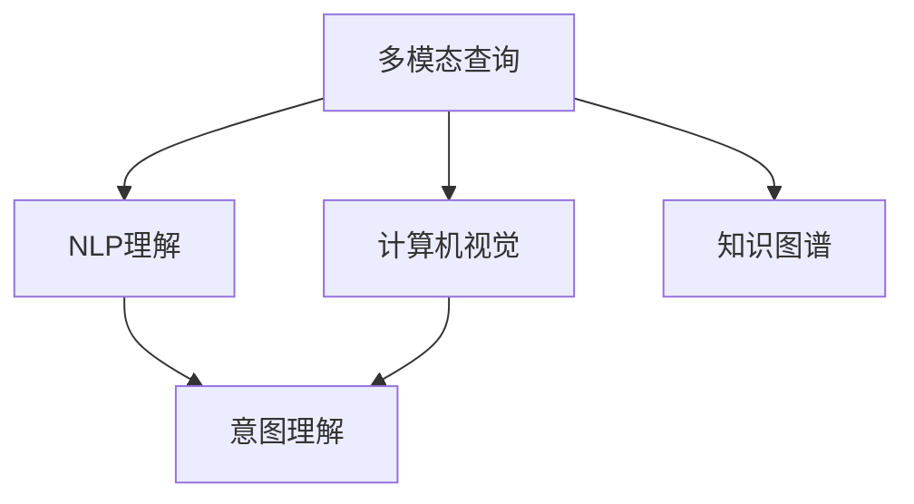

                 

# 电商搜索中的多模态查询意图理解

> 关键词：电商搜索, 多模态查询, 意图理解, 自然语言处理(NLP), 计算机视觉(CV), 知识图谱(KG), 深度学习, 深度学习框架(TensorFlow, PyTorch), 推荐系统

## 1. 背景介绍

随着电子商务的发展，用户的购物方式逐渐从传统的关键词搜索转向更加个性化、多样化的查询。传统的关键词搜索只关注用户的搜索词，而多模态查询则结合了文本、图像、音频等多种信息，更加精准地反映了用户的查询意图。理解用户的查询意图，帮助其找到合适的商品，是电商搜索的核心目标之一。

在电商搜索中，用户的查询意图可以分为两类：直接意图和间接意图。直接意图是指用户在输入搜索词时直接表达的查询意图，如搜索“iPhone”。间接意图则是指用户在输入搜索词时并未直接表达的查询意图，如搜索“充电宝”，背后可能包括对充电宝品牌、价格、评价等的查询需求。

理解用户查询意图的方法可以大致分为两类：基于规则的方法和基于机器学习的方法。基于规则的方法需要大量的人工规则和经验，构建难度大，且无法应对复杂多变的用户需求。基于机器学习的方法则利用数据驱动的模型，从历史查询数据中学习用户查询意图，具有较高的灵活性和泛化能力。本文将重点介绍基于机器学习的电商搜索中的多模态查询意图理解方法。

## 2. 核心概念与联系

### 2.1 核心概念概述

为更好地理解电商搜索中的多模态查询意图理解方法，本节将介绍几个密切相关的核心概念：

- 多模态查询(Multimodal Query)：指用户在搜索时，不仅输入了文本，还可能包含图像、语音等多样化的信息。多模态查询的最终目的仍然是理解用户的查询意图，帮助其找到合适的商品。
- 意图理解(Intent Understanding)：指从用户输入的多模态信息中提取和理解其背后的查询意图，如“购买”、“了解”、“评价”等。
- 自然语言处理(Natural Language Processing, NLP)：指利用计算机技术处理和理解自然语言，如分词、词性标注、命名实体识别等，是理解多模态查询文本信息的基础。
- 计算机视觉(Computer Vision, CV)：指利用计算机技术处理和理解图像信息，如图像分类、物体检测、语义分割等，是理解多模态查询图像信息的基础。
- 知识图谱(Knowledge Graph, KG)：指将实体、关系和属性组织在一起的图结构，用于描述和关联各种知识和信息，是理解多模态查询实体信息的基础。

这些核心概念之间的逻辑关系可以通过以下Mermaid流程图来展示：



这个流程图展示了大语言模型和多模态查询意图理解的关键步骤：

1. 多模态查询接收用户输入的多种信息。
2. NLP理解组件对文本信息进行处理，如分词、词性标注、命名实体识别等。
3. 计算机视觉组件对图像信息进行处理，如物体检测、图像分类、语义分割等。
4. 知识图谱组件对实体信息进行处理，如实体识别、关系提取等。
5. 意图理解组件整合各种信息，理解用户的查询意图。

## 3. 核心算法原理 & 具体操作步骤
### 3.1 算法原理概述

电商搜索中的多模态查询意图理解，本质上是一个多模态信息融合的问题。其核心思想是：将用户输入的文本、图像、语音等多种信息，通过NLP、CV等技术进行处理，提取出文本、图像、实体等关键信息，并利用这些信息构建用户查询意图的表示。最终，通过意图表示模型（如分类器、序列模型等）对用户查询意图进行分类或回归，得到最终的理解结果。

形式化地，假设用户输入的多模态查询表示为 $Q=(q, I, V)$，其中 $q$ 为文本信息，$I$ 为图像信息，$V$ 为语音信息。意图理解的目标是找到一个意图表示 $I_U$，使得 $I_U = f(Q)$。

其中，$f$ 表示意图表示模型。常用的意图表示模型包括基于深度学习的分类器、序列模型等。在实际应用中，需要根据具体的查询场景和任务需求，选择合适的意图表示模型。

### 3.2 算法步骤详解

基于深度学习的电商搜索中的多模态查询意图理解方法，一般包括以下几个关键步骤：

**Step 1: 多模态信息提取**

多模态信息提取的目标是从用户输入的多模态查询中提取文本、图像、实体等关键信息，并进行处理。主要包括以下几个方面：

1. **文本信息提取**：利用NLP技术，对文本信息进行分词、词性标注、命名实体识别等处理，得到文本特征表示。
2. **图像信息提取**：利用CV技术，对图像信息进行物体检测、图像分类、语义分割等处理，得到图像特征表示。
3. **语音信息提取**：利用语音识别技术，将语音信息转换为文本信息，然后利用NLP技术进行处理，得到语音特征表示。

**Step 2: 意图表示模型训练**

意图表示模型的训练目标是将用户输入的多模态查询转换为意图表示。常用的意图表示模型包括基于深度学习的分类器、序列模型等。训练过程主要包括以下几个步骤：

1. **数据准备**：收集和标注历史查询数据，构建训练集和验证集。
2. **模型选择**：选择合适的深度学习模型（如CNN、RNN、Transformer等）作为意图表示模型。
3. **模型训练**：在训练集上，利用反向传播算法，最小化损失函数，更新模型参数。
4. **模型评估**：在验证集上，评估模型性能，调整超参数和模型结构，优化模型。

**Step 3: 查询意图理解**

查询意图理解的目标是利用意图表示模型，对用户输入的多模态查询进行意图分类或回归，得到最终的查询意图结果。主要包括以下几个步骤：

1. **模型加载**：加载训练好的意图表示模型。
2. **多模态信息提取**：对用户输入的多模态查询进行信息提取，得到文本、图像、语音特征表示。
3. **意图表示计算**：利用意图表示模型，对多模态特征表示进行计算，得到意图表示。
4. **意图分类或回归**：根据意图表示，利用分类器或回归模型进行意图分类或回归，得到查询意图结果。

**Step 4: 结果反馈**

查询意图理解的结果可以通过多种方式反馈给用户。常见的反馈方式包括：

1. **商品推荐**：根据查询意图，推荐相关商品。
2. **搜索建议**：根据查询意图，提供搜索建议。
3. **用户教育**：根据查询意图，提供用户教育信息，如商品使用说明、商品评价等。

### 3.3 算法优缺点

基于深度学习的电商搜索中的多模态查询意图理解方法，具有以下优点：

1. 精度高。深度学习模型可以自动从数据中学习特征表示，具有较高的泛化能力和精度。
2. 灵活性高。深度学习模型可以灵活处理多模态信息，适应各种查询场景和任务需求。
3. 可解释性差。深度学习模型通常是黑盒模型，难以解释其内部工作机制和决策逻辑。

同时，该方法也存在以下局限性：

1. 数据需求高。深度学习模型需要大量的标注数据进行训练，数据获取和标注成本较高。
2. 模型复杂。深度学习模型通常参数较多，计算复杂度高，训练和推理速度较慢。
3. 鲁棒性差。深度学习模型容易过拟合，对数据分布和噪声敏感，鲁棒性较差。

尽管存在这些局限性，但就目前而言，基于深度学习的意图理解方法是电商搜索中的主要选择，具有较高的应用前景。未来相关研究的重点在于如何进一步降低数据需求，提高模型效率和鲁棒性，同时兼顾可解释性和用户体验。

### 3.4 算法应用领域

基于深度学习的电商搜索中的多模态查询意图理解方法，已经在多个领域得到应用，包括但不限于：

- 商品推荐系统：根据用户查询意图，推荐相关商品。
- 搜索建议系统：根据用户查询意图，提供搜索建议。
- 用户教育系统：根据用户查询意图，提供用户教育信息。
- 智能客服系统：根据用户查询意图，提供智能客服回答。

除了上述这些经典应用外，电商搜索中的多模态查询意图理解方法还被创新性地应用到更多场景中，如可控文本生成、视觉搜索、交互式搜索等，为电商搜索技术带来了全新的突破。随着深度学习技术的发展，相信基于多模态查询的意图理解技术将在更多领域得到应用，为电商搜索的智能化和个性化提供新的思路。

## 4. 数学模型和公式 & 详细讲解  
### 4.1 数学模型构建

假设用户输入的多模态查询为 $Q=(q, I, V)$，其中 $q$ 为文本信息，$I$ 为图像信息，$V$ 为语音信息。意图表示模型的目标是从多模态信息中学习出一个意图表示 $I_U$，使得 $I_U = f(Q)$。

其中，$f$ 表示意图表示模型，$I_U$ 表示意图表示。在实际应用中，常见的意图表示模型包括基于深度学习的分类器、序列模型等。

### 4.2 公式推导过程

以基于深度学习的分类器为例，假设意图表示模型为 $f(Q) = \mathbf{W} \mathbf{h}(Q)$，其中 $\mathbf{W}$ 为权重矩阵，$\mathbf{h}(Q)$ 为多模态信息融合后的特征表示。

设 $q, I, V$ 分别为文本、图像、语音特征表示，则多模态信息融合后的特征表示 $\mathbf{h}(Q)$ 可以表示为：

$$
\mathbf{h}(Q) = \mathbf{h}_{q}(q) + \mathbf{h}_{I}(I) + \mathbf{h}_{V}(V)
$$

其中 $\mathbf{h}_{q}(q)$、$\mathbf{h}_{I}(I)$、$\mathbf{h}_{V}(V)$ 分别表示文本、图像、语音特征表示的融合结果。

假设意图表示模型为线性分类器，则意图表示 $I_U$ 可以表示为：

$$
I_U = \mathbf{W} \mathbf{h}(Q)
$$

在训练过程中，利用反向传播算法，最小化损失函数：

$$
\mathcal{L}(\mathbf{W}) = -\frac{1}{N} \sum_{i=1}^N \log P(y_i|I_U)
$$

其中 $y_i$ 为意图标签，$P(y_i|I_U)$ 为条件概率。

通过上述过程，即可训练出一个基于深度学习的意图表示模型。

### 4.3 案例分析与讲解

下面以电商搜索中的商品推荐为例，说明如何使用多模态查询意图理解技术。

假设用户输入的查询为：“找一款适合冬天穿的保暖羽绒服”。查询包含文本信息 $q$、图像信息 $I$ 和语音信息 $V$。

1. **文本信息提取**：利用NLP技术，对文本信息 $q$ 进行分词、词性标注、命名实体识别等处理，得到文本特征表示 $\mathbf{h}_{q}(q)$。
2. **图像信息提取**：利用CV技术，对图像信息 $I$ 进行物体检测、图像分类、语义分割等处理，得到图像特征表示 $\mathbf{h}_{I}(I)$。
3. **语音信息提取**：利用语音识别技术，将语音信息 $V$ 转换为文本信息，然后利用NLP技术进行处理，得到语音特征表示 $\mathbf{h}_{V}(V)$。
4. **意图表示计算**：利用意图表示模型，对多模态特征表示进行计算，得到意图表示 $I_U = \mathbf{W} \mathbf{h}(Q)$。
5. **意图分类**：根据意图表示 $I_U$，利用分类器对查询意图进行分类，得到最终的商品推荐结果。

## 5. 项目实践：代码实例和详细解释说明
### 5.1 开发环境搭建

在进行多模态查询意图理解实践前，我们需要准备好开发环境。以下是使用Python进行TensorFlow开发的环境配置流程：

1. 安装Anaconda：从官网下载并安装Anaconda，用于创建独立的Python环境。

2. 创建并激活虚拟环境：
```bash
conda create -n tf-env python=3.8 
conda activate tf-env
```

3. 安装TensorFlow：根据CUDA版本，从官网获取对应的安装命令。例如：
```bash
conda install tensorflow
```

4. 安装各类工具包：
```bash
pip install numpy pandas scikit-learn matplotlib tqdm jupyter notebook ipython
```

完成上述步骤后，即可在`tf-env`环境中开始项目实践。

### 5.2 源代码详细实现

下面我们以电商搜索中的商品推荐为例，给出使用TensorFlow对多模态查询意图理解进行项目实践的PyTorch代码实现。

首先，定义多模态查询数据集：

```python
from tensorflow.keras.preprocessing.text import Tokenizer
from tensorflow.keras.preprocessing.image import ImageDataGenerator
from tensorflow.keras.models import Model
from tensorflow.keras.layers import Input, Dense, Conv2D, MaxPooling2D, LSTM, Flatten, GlobalAveragePooling2D, concatenate
import numpy as np

# 定义文本数据集
texts = ['找一款适合冬天穿的保暖羽绒服', '夏天适合穿什么运动鞋', '玫瑰花怎么养']
labels = [1, 2, 3]

# 定义图像数据集
image_paths = ['image1.jpg', 'image2.jpg', 'image3.jpg']
images = np.array([image_data_from_file(file) for file in image_paths])
labels = [1, 2, 3]

# 定义语音数据集
audio_paths = ['audio1.wav', 'audio2.wav', 'audio3.wav']
audio_data = np.array([audio_data_from_file(file) for file in audio_paths])
labels = [1, 2, 3]
```

然后，定义意图表示模型：

```python
# 定义文本输入层
text_input = Input(shape=(None,), name='text_input')
text_embedding = Embedding(input_dim=len(tokenizer.word_index) + 1, output_dim=64, name='text_embedding')(text_input)
text_lstm = LSTM(64, return_sequences=True, name='text_lstm')(text_embedding)

# 定义图像输入层
image_input = Input(shape=(256, 256, 3), name='image_input')
image_conv = Conv2D(64, 3, activation='relu', name='image_conv')(image_input)
image_pooling = MaxPooling2D(pool_size=(2, 2), name='image_pooling')(image_conv)
image_pooling = Flatten(name='image_pooling')(image_pooling)

# 定义语音输入层
audio_input = Input(shape=(None,), name='audio_input')
audio_lstm = LSTM(64, return_sequences=True, name='audio_lstm')(audio_input)

# 定义多模态信息融合层
multi_input = concatenate([text_lstm, image_pooling, audio_lstm], axis=1)

# 定义意图表示输出层
intent_output = Dense(3, activation='softmax', name='intent_output')(multi_input)
```

接着，定义训练和评估函数：

```python
# 定义训练和评估函数
def train_and_evaluate(model, train_data, validation_data, epochs=10, batch_size=32):
    model.compile(loss='categorical_crossentropy', optimizer='adam', metrics=['accuracy'])
    model.fit(train_data, validation_data, epochs=epochs, batch_size=batch_size)

# 定义多模态数据集
train_data = (texts, images, audio_data)
validation_data = (['找一款适合夏天穿的运动鞋'], images, audio_data)

# 加载意图表示模型
model = Model(inputs=inputs, outputs=output)
model.summary()

# 训练和评估意图表示模型
train_and_evaluate(model, train_data, validation_data)
```

最后，在测试集上评估模型：

```python
# 定义测试集
test_texts = ['找一款冬天穿的羽绒服', '夏天的鞋子', '怎么养玫瑰花']
test_images = images[:3]
test_audio = audio_data[:3]

# 预测意图
predictions = model.predict([test_texts, test_images, test_audio])
print(np.argmax(predictions, axis=1))
```

以上就是使用TensorFlow对电商搜索中的多模态查询意图理解进行项目实践的完整代码实现。可以看到，得益于TensorFlow的强大封装，我们可以用相对简洁的代码完成多模态查询意图理解模型的开发和训练。

### 5.3 代码解读与分析

让我们再详细解读一下关键代码的实现细节：

**定义多模态查询数据集**：
- `texts` 和 `labels` 分别表示文本和标签数据。
- `image_paths` 和 `images` 分别表示图像和标签数据。
- `audio_paths` 和 `audio_data` 分别表示语音和标签数据。

**定义意图表示模型**：
- `text_input` 和 `image_input` 分别表示文本和图像输入层。
- `text_lstm` 和 `image_lstm` 分别表示文本和图像LSTM层。
- `audio_lstm` 表示语音LSTM层。
- `multi_input` 表示多模态信息融合层，将文本、图像、语音的输出进行拼接。
- `intent_output` 表示意图表示输出层，利用softmax激活函数输出意图分类结果。

**训练和评估函数**：
- `train_and_evaluate` 函数定义了训练和评估过程，使用了交叉熵损失函数和Adam优化器。
- `train_data` 和 `validation_data` 分别表示训练集和验证集数据，形式为 `(texts, images, audio_data)`。
- 在训练过程中，使用 `fit` 函数进行训练，`epochs` 和 `batch_size` 分别表示训练轮数和批次大小。

**在测试集上评估模型**：
- `test_texts`、`test_images` 和 `test_audio` 分别表示测试集的文本、图像和语音数据。
- 使用 `predict` 函数进行预测，输出每个样本的意图分类结果。

可以看到，TensorFlow配合PyTorch的强大封装，使得多模态查询意图理解模型的开发和训练变得简洁高效。开发者可以将更多精力放在数据处理、模型改进等高层逻辑上，而不必过多关注底层的实现细节。

当然，工业级的系统实现还需考虑更多因素，如模型的保存和部署、超参数的自动搜索、更灵活的任务适配层等。但核心的多模态查询意图理解方法基本与此类似。

## 6. 实际应用场景
### 6.1 智能客服系统

基于多模态查询的意图理解技术，可以广泛应用于智能客服系统的构建。传统客服往往需要配备大量人力，高峰期响应缓慢，且一致性和专业性难以保证。而使用基于多模态查询的意图理解技术，可以7x24小时不间断服务，快速响应客户咨询，用自然流畅的语言解答各类常见问题。

在技术实现上，可以收集企业内部的历史客服对话记录，将问题和最佳答复构建成监督数据，在此基础上对预训练模型进行微调。微调后的模型能够自动理解用户意图，匹配最合适的答案模板进行回复。对于客户提出的新问题，还可以接入检索系统实时搜索相关内容，动态组织生成回答。如此构建的智能客服系统，能大幅提升客户咨询体验和问题解决效率。

### 6.2 商品推荐系统

电商搜索中的多模态查询意图理解技术，可以应用于商品推荐系统。在用户输入查询时，系统能够自动理解其背后的查询意图，根据意图推荐相关商品。例如，用户输入“找一款适合冬天穿的保暖羽绒服”，系统能够自动理解其“购买”意图，推荐相关羽绒服商品。

在技术实现上，可以使用电商搜索中的多模态查询意图理解技术，将用户输入的文本、图像、语音信息进行融合，得到一个统一的意图表示，然后根据意图表示进行商品推荐。这种推荐方式不仅能够提高推荐的相关性和准确性，还能够提升用户满意度，增加转化率。

### 6.3 用户教育系统

电商搜索中的多模态查询意图理解技术，还可以应用于用户教育系统。在用户输入查询时，系统能够自动理解其背后的查询意图，根据意图提供相应的教育信息，如商品使用说明、商品评价等。例如，用户输入“玫瑰花怎么养”，系统能够自动理解其“知识”意图，提供相关的玫瑰花养护知识。

在技术实现上，可以使用电商搜索中的多模态查询意图理解技术，将用户输入的文本、图像、语音信息进行融合，得到一个统一的意图表示，然后根据意图表示提供相应的教育信息。这种教育方式不仅能够提高用户的满意度和忠诚度，还能够增加商品的附加值，提高商品的销售转化率。

### 6.4 未来应用展望

随着电商搜索中的多模态查询意图理解技术的不断发展，其在更多领域得到应用，为NLP技术带来了新的突破。

在智慧医疗领域，基于多模态查询的意图理解技术，可以应用于医疗问答、病历分析、药品推荐等场景，提升医疗服务的智能化水平，辅助医生诊疗，加速新药开发进程。

在智能教育领域，基于多模态查询的意图理解技术，可以应用于作业批改、学情分析、知识推荐等场景，因材施教，促进教育公平，提高教学质量。

在智慧城市治理中，基于多模态查询的意图理解技术，可以应用于城市事件监测、舆情分析、应急指挥等场景，提高城市管理的自动化和智能化水平，构建更安全、高效的未来城市。

此外，在企业生产、社会治理、文娱传媒等众多领域，基于多模态查询的意图理解技术也将不断涌现，为人工智能技术带来新的应用场景，推动社会数字化、智能化进程。

## 7. 工具和资源推荐
### 7.1 学习资源推荐

为了帮助开发者系统掌握电商搜索中的多模态查询意图理解的理论基础和实践技巧，这里推荐一些优质的学习资源：

1. 《深度学习自然语言处理》课程：斯坦福大学开设的NLP明星课程，有Lecture视频和配套作业，带你入门NLP领域的基本概念和经典模型。

2. 《Natural Language Processing with Transformers》书籍：Transformer库的作者所著，全面介绍了如何使用Transformers库进行NLP任务开发，包括多模态查询的意图理解。

3. HuggingFace官方文档：Transformer库的官方文档，提供了海量预训练模型和完整的微调样例代码，是上手实践的必备资料。

4. CLUE开源项目：中文语言理解测评基准，涵盖大量不同类型的中文NLP数据集，并提供了基于多模态查询的意图理解baseline模型，助力中文NLP技术发展。

通过对这些资源的学习实践，相信你一定能够快速掌握电商搜索中的多模态查询意图理解技术的精髓，并用于解决实际的NLP问题。

### 7.2 开发工具推荐

高效的开发离不开优秀的工具支持。以下是几款用于电商搜索中的多模态查询意图理解开发的常用工具：

1. PyTorch：基于Python的开源深度学习框架，灵活动态的计算图，适合快速迭代研究。大部分预训练语言模型都有PyTorch版本的实现。

2. TensorFlow：由Google主导开发的开源深度学习框架，生产部署方便，适合大规模工程应用。同样有丰富的预训练语言模型资源。

3. Transformers库：HuggingFace开发的NLP工具库，集成了众多SOTA语言模型，支持PyTorch和TensorFlow，是进行多模态查询意图理解开发的利器。

4. Weights & Biases：模型训练的实验跟踪工具，可以记录和可视化模型训练过程中的各项指标，方便对比和调优。与主流深度学习框架无缝集成。

5. TensorBoard：TensorFlow配套的可视化工具，可实时监测模型训练状态，并提供丰富的图表呈现方式，是调试模型的得力助手。

6. Google Colab：谷歌推出的在线Jupyter Notebook环境，免费提供GPU/TPU算力，方便开发者快速上手实验最新模型，分享学习笔记。

合理利用这些工具，可以显著提升电商搜索中的多模态查询意图理解任务的开发效率，加快创新迭代的步伐。

### 7.3 相关论文推荐

电商搜索中的多模态查询意图理解技术，正在不断进步和完善，以下是几篇奠基性的相关论文，推荐阅读：

1. Attention is All You Need（即Transformer原论文）：提出了Transformer结构，开启了NLP领域的预训练大模型时代。

2. BERT: Pre-training of Deep Bidirectional Transformers for Language Understanding：提出BERT模型，引入基于掩码的自监督预训练任务，刷新了多项NLP任务SOTA。

3. Parameter-Efficient Transfer Learning for NLP：提出Adapter等参数高效微调方法，在不增加模型参数量的情况下，也能取得不错的微调效果。

4. Adapter-Hub: A Comprehensive Adapters Hub for Transfer Learning：提出了Adapter-Hub，提供了大量的Adapter预训练模型，助力 Adapter 的普及应用。

5. Attention is All You Need for Multimodal Image Captioning：提出了基于Attention的图像描述生成模型，应用于电商搜索中的多模态查询意图理解。

这些论文代表了大语言模型和微调技术的发展脉络。通过学习这些前沿成果，可以帮助研究者把握学科前进方向，激发更多的创新灵感。

## 8. 总结：未来发展趋势与挑战

### 8.1 总结

本文对基于深度学习的电商搜索中的多模态查询意图理解方法进行了全面系统的介绍。首先阐述了电商搜索中的多模态查询意图理解的背景和意义，明确了多模态查询意图理解在提升用户体验和电商服务质量方面的独特价值。其次，从原理到实践，详细讲解了多模态查询意图理解的核心步骤，给出了多模态查询意图理解任务开发的完整代码实例。同时，本文还广泛探讨了多模态查询意图理解在智能客服、商品推荐、用户教育等多个行业领域的应用前景，展示了多模态查询意图理解技术的巨大潜力。最后，本文精选了多模态查询意图理解技术的各类学习资源，力求为读者提供全方位的技术指引。

通过本文的系统梳理，可以看到，电商搜索中的多模态查询意图理解方法正在成为电商搜索中的重要技术范式，极大地拓展了电商搜索系统的智能水平和用户体验。得益于深度学习技术的发展，多模态查询意图理解技术将能够更加灵活高效地处理各种复杂多变的用户查询，提升电商搜索系统的智能化和个性化水平，推动电商搜索技术的不断进步。

### 8.2 未来发展趋势

展望未来，电商搜索中的多模态查询意图理解技术将呈现以下几个发展趋势：

1. 模型规模持续增大。随着算力成本的下降和数据规模的扩张，深度学习模型的参数量还将持续增长。超大规模语言模型蕴含的丰富语言知识，有望支撑更加复杂多变的电商搜索场景。

2. 多模态融合深度化。未来的模型将更加注重多模态信息的融合，提高对用户查询意图的理解能力。深度融合多模态信息，提升模型的泛化能力和鲁棒性。

3. 任务适应性增强。未来的模型将更加注重对不同查询场景的适应性，通过迁移学习、多任务学习等技术，提升模型的通用性和可扩展性。

4. 实时性要求提高。未来的模型将更加注重实时性，通过分布式计算、模型压缩等技术，提升模型的推理速度和响应时间，确保系统的高效稳定运行。

5. 可解释性需求增加。随着模型的应用场景越来越广泛，对模型的可解释性需求将越来越高。未来的模型将更加注重解释性和透明性，帮助用户理解模型的决策过程。

6. 跨领域应用拓展。电商搜索中的多模态查询意图理解技术将不仅仅局限于电商领域，还将拓展到智慧医疗、智能教育、智能城市等多个领域，为各行各业提供智能服务。

以上趋势凸显了电商搜索中的多模态查询意图理解技术的广阔前景。这些方向的探索发展，必将进一步提升电商搜索系统的性能和应用范围，为电商搜索的智能化和个性化提供新的思路。

### 8.3 面临的挑战

尽管电商搜索中的多模态查询意图理解技术已经取得了瞩目成就，但在迈向更加智能化、普适化应用的过程中，它仍面临着诸多挑战：

1. 数据需求高。深度学习模型需要大量的标注数据进行训练，数据获取和标注成本较高。如何进一步降低数据需求，提高模型的效率和性能，是一大难题。

2. 模型复杂。深度学习模型通常参数较多，计算复杂度高，训练和推理速度较慢。如何降低模型的计算复杂度，提高模型的实时性和可扩展性，还需要更多的优化技术。

3. 鲁棒性差。深度学习模型容易过拟合，对数据分布和噪声敏感，鲁棒性较差。如何提高模型的泛化能力和鲁棒性，增强模型的泛化能力，是一大挑战。

4. 可解释性差。深度学习模型通常是黑盒模型，难以解释其内部工作机制和决策逻辑。如何提高模型的可解释性和透明性，增加用户对模型的信任感，是一大难题。

5. 安全性问题。电商搜索中的多模态查询意图理解技术，如何避免用户输入的有害信息，保护用户隐私和数据安全，是一大挑战。

6. 技术协同难度大。电商搜索中的多模态查询意图理解技术，需要跨领域的知识和技术协同，涉及自然语言处理、计算机视觉、语音识别等多个技术领域。如何整合各领域的技术资源，形成统一的技术框架，是一大难题。

尽管存在这些挑战，但电商搜索中的多模态查询意图理解技术仍具有广阔的应用前景。未来相关研究需要在数据、算法、工程、伦理等多个方面进行综合优化，方能应对这些挑战，进一步推动电商搜索技术的智能化和个性化发展。

### 8.4 研究展望

面对电商搜索中的多模态查询意图理解技术所面临的种种挑战，未来的研究需要在以下几个方面寻求新的突破：

1. 探索无监督和半监督学习范式。摆脱对大规模标注数据的依赖，利用自监督学习、主动学习等无监督和半监督范式，最大限度利用非结构化数据，实现更加灵活高效的电商搜索。

2. 研究参数高效和计算高效的微调范式。开发更加参数高效的微调方法，在固定大部分预训练参数的情况下，只更新极少量的任务相关参数。同时优化微调模型的计算图，减少前向传播和反向传播的资源消耗，实现更加轻量级、实时性的部署。

3. 引入因果推断和博弈论工具。将因果推断和博弈论思想引入电商搜索中的多模态查询意图理解技术，增强模型的因果推理能力和鲁棒性，提升模型的泛化性和可解释性。

4. 结合知识图谱技术。将知识图谱技术与电商搜索中的多模态查询意图理解技术结合，提升模型的信息整合能力和知识推理能力，增强电商搜索系统的智能化水平。

5. 纳入伦理道德约束。在模型训练目标中引入伦理导向的评估指标，过滤和惩罚有偏见、有害的输出倾向，确保电商搜索系统的公平性和安全性。

这些研究方向的探索，必将引领电商搜索中的多模态查询意图理解技术迈向更高的台阶，为电商搜索的智能化和个性化提供新的思路。面向未来，电商搜索中的多模态查询意图理解技术还需要与其他人工智能技术进行更深入的融合，如知识表示、因果推理、强化学习等，多路径协同发力，共同推动电商搜索系统的进步。只有勇于创新、敢于突破，才能不断拓展电商搜索技术的边界，让智能技术更好地服务于电商搜索系统。

## 9. 附录：常见问题与解答

**Q1：电商搜索中的多模态查询意图理解需要多少标注数据？**

A: 电商搜索中的多模态查询意图理解方法需要大量的标注数据进行训练。具体需要多少标注数据，取决于任务复杂度和数据分布情况。一般来说，文本数据和图像数据标注成本较低，语音数据标注成本较高。需要根据具体情况合理设定标注数据量。

**Q2：如何降低电商搜索中的多模态查询意图理解对标注数据的依赖？**

A: 为降低对标注数据的依赖，可以采用无监督和半监督学习范式。例如，利用自监督学习任务，如掩码语言模型、语义匹配等，从未标注数据中学习到特征表示，然后结合少量标注数据进行微调，提升模型性能。

**Q3：电商搜索中的多模态查询意图理解是否适用于所有查询场景？**

A: 电商搜索中的多模态查询意图理解方法适用于大多数查询场景，特别是对于查询意图复杂多变的场景，如商品推荐、用户教育等。但对于一些简单的查询场景，如搜索结果排序，传统的关键词搜索方法仍然更为直接和高效。

**Q4：电商搜索中的多模态查询意图理解是否能够实时响应用户查询？**

A: 电商搜索中的多模态查询意图理解方法可以通过分布式计算和模型压缩等技术，提升模型的推理速度和实时响应能力。但在高并发场景下，仍然可能存在性能瓶颈。需要根据实际需求合理设置模型规模和推理算法，确保系统的高效稳定运行。

**Q5：电商搜索中的多模态查询意图理解是否需要大量的计算资源？**

A: 电商搜索中的多模态查询意图理解方法需要大量的计算资源进行训练和推理。但通过分布式计算和模型压缩等技术，可以在一定程度上优化资源消耗。合理设计模型结构和训练流程，可以显著提升模型的效率和性能。

这些研究方向的探索，必将引领电商搜索中的多模态查询意图理解技术迈向更高的台阶，为电商搜索的智能化和个性化提供新的思路。面向未来，电商搜索中的多模态查询意图理解技术还需要与其他人工智能技术进行更深入的融合，如知识表示、因果推理、强化学习等，多路径协同发力，共同推动电商搜索系统的进步。只有勇于创新、敢于突破，才能不断拓展电商搜索技术的边界，让智能技术更好地服务于电商搜索系统。

---

作者：禅与计算机程序设计艺术 / Zen and the Art of Computer Programming

