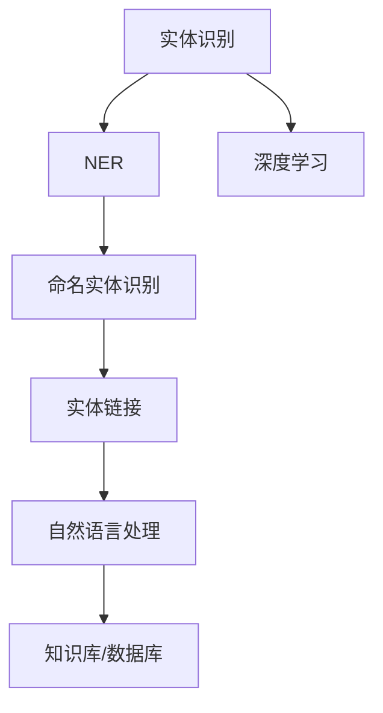

                 

# 电商搜索中的实体识别与链接技术

> 关键词：电商搜索, 实体识别, 链接技术, 自然语言处理(NLP), 深度学习, 命名实体识别(NER), 数据挖掘, 用户行为分析, 推荐系统

## 1. 背景介绍

随着电子商务的迅速发展，越来越多的消费者通过在线搜索来查找所需商品。然而，传统的搜索引擎往往只能理解和处理关键词，无法识别出搜索查询中的实体信息，导致搜索结果的相关性和准确性不够高。为了解决这一问题，实体识别与链接技术应运而生。这种技术能够从用户查询中识别出商品名称、品牌、价格等实体信息，并自动与商品数据库进行链接，提升搜索和推荐系统的智能水平。

### 1.1 问题由来
在电商搜索中，用户输入的查询往往是自然语言描述，而非标准化的关键词。例如，用户可能输入“iPhone 11手机壳”或“红牛能量饮料”等自然语言，而非单独的“iPhone 11”和“红牛”。这种自然语言的输入，增加了搜索引擎理解和处理的复杂度。传统的搜索引擎依赖于关键词匹配算法，无法识别出查询中的实体信息，从而影响了搜索结果的相关性和准确性。

### 1.2 问题核心关键点
为了提升电商搜索的智能水平，实体识别与链接技术成为关键。该技术的核心在于：
1. **实体识别**：从用户查询中识别出具体的实体，如商品名称、品牌、价格等。
2. **实体链接**：将识别出的实体与商品数据库中的具体商品进行自动链接，提升搜索结果的精准度。

### 1.3 问题研究意义
实体识别与链接技术的引入，对于提升电商搜索的智能水平，改善用户体验，增加交易转化率具有重要意义。

1. **提升相关性和精准度**：通过实体识别与链接，搜索引擎能够更好地理解用户查询的意图，提供更加精准和相关的搜索结果。
2. **增强用户体验**：用户能够更加直观地看到商品名称、价格等信息，无需手动输入关键词，提高了搜索效率。
3. **提升转化率**：精准的搜索结果能够更好地满足用户需求，提高用户点击率和购买转化率。
4. **推动电商技术发展**：实体识别与链接技术的应用，促进了电商搜索、推荐、广告等各个环节的技术革新，推动了电商技术的整体进步。

## 2. 核心概念与联系

### 2.1 核心概念概述

为更好地理解实体识别与链接技术的原理和架构，本节将介绍几个关键概念：

- **实体识别**：从自然语言中识别出具有特定意义的实体，如人名、地名、机构名、时间、数量等。
- **命名实体识别(NER)**：从文本中识别出具有特定类别的实体，并标注其类别。
- **实体链接**：将识别出的实体与具体的知识库或数据库进行链接，如将“iPhone”与商品数据库中的具体iPhone型号进行关联。
- **深度学习**：利用神经网络等深度学习模型进行实体识别和链接。
- **自然语言处理(NLP)**：涉及文本分析、语音识别、机器翻译等，旨在使计算机理解并生成自然语言。

这些核心概念之间的逻辑关系可以通过以下Mermaid流程图来展示：



这个流程图展示了几大核心概念之间的关联：

1. 实体识别从自然语言中识别出实体。
2. NER对识别出的实体进行分类标注。
3. 深度学习模型用于训练和实现实体识别与链接。
4. 实体链接将识别出的实体与知识库或数据库进行关联。
5. 自然语言处理技术用于处理和理解输入文本。

这些概念共同构成了实体识别与链接技术的框架，使得计算机能够从自然语言中提取有意义的实体信息，并实现自动化的链接。

## 3. 核心算法原理 & 具体操作步骤

### 3.1 算法原理概述

实体识别与链接技术的核心算法包括命名实体识别(NER)和实体链接。下面将详细阐述这两种算法的原理和具体操作步骤。

#### 3.1.1 命名实体识别(NER)

命名实体识别是实体识别与链接的基础。它的目标是识别出文本中的实体，并标注其类别，如人名、地名、机构名等。常见的NER模型包括基于规则的方法、基于统计的方法和基于深度学习的方法。

基于深度学习的NER模型主要采用序列标注任务框架，使用Bi-LSTM-CRF或Transformer等模型进行训练。其基本流程如下：

1. **模型训练**：使用标注好的训练数据集对模型进行训练，优化模型参数，使其能够准确识别出实体并标注其类别。
2. **模型推理**：将待识别的文本输入训练好的模型，模型输出每个词对应的实体类别标签。
3. **后处理**：对模型输出结果进行后处理，如去噪、校正等，得到最终的实体识别结果。

#### 3.1.2 实体链接

实体链接是将识别出的实体与具体的知识库或数据库进行关联。这一过程通常包括以下几个步骤：

1. **实体消歧**：将识别出的实体与候选的实体进行匹配，消除歧义。
2. **实体关联**：将消除歧义后的实体与知识库或数据库中的实体进行关联。
3. **链接验证**：对关联结果进行验证，确保关联的正确性。

### 3.2 算法步骤详解

#### 3.2.1 命名实体识别(NER)

1. **数据准备**：收集和标注与电商领域相关的文本数据，用于训练和测试NER模型。
2. **模型选择**：选择合适的深度学习模型，如Bi-LSTM-CRF或Transformer，进行训练。
3. **特征工程**：设计特征提取策略，如词向量、字向量、字符向量等。
4. **模型训练**：使用标注好的训练数据集对模型进行训练，优化模型参数。
5. **模型评估**：在测试数据集上评估模型性能，调整模型参数。
6. **模型应用**：将训练好的模型应用于电商搜索中的自然语言处理。

#### 3.2.2 实体链接

1. **知识库构建**：构建电商领域的知识库，包含商品名称、品牌、价格等信息。
2. **实体消歧**：使用消歧模型对识别出的实体进行匹配，消除歧义。
3. **实体关联**：将消歧后的实体与知识库中的实体进行关联，生成链接。
4. **链接验证**：对生成的链接进行验证，确保链接的正确性。
5. **链接应用**：将生成的链接应用于电商搜索系统，提升搜索结果的相关性。

### 3.3 算法优缺点

#### 3.3.1 命名实体识别(NER)

**优点**：
1. **自动化程度高**：深度学习模型能够自动从自然语言中识别出实体，减少了人工标注的工作量。
2. **精度高**：深度学习模型在识别实体类别方面具有较高的精度。
3. **适应性强**：深度学习模型能够适应多种语言和领域，具有较好的泛化能力。

**缺点**：
1. **数据需求大**：需要大量的标注数据进行训练，标注成本较高。
2. **模型复杂**：深度学习模型结构复杂，训练和推理过程需要高性能计算资源。
3. **依赖上下文**：深度学习模型依赖于上下文信息，对短文本和生僻词的识别效果不佳。

#### 3.3.2 实体链接

**优点**：
1. **提高相关性**：通过链接实体，搜索结果能够更好地匹配用户查询意图，提升相关性。
2. **增强用户体验**：用户能够看到商品名称、品牌、价格等信息，提高了搜索效率。
3. **自动化**：自动化链接技术减少了人工操作，提高了工作效率。

**缺点**：
1. **依赖知识库**：实体链接需要依赖知识库，知识库的构建和维护成本较高。
2. **数据偏差**：知识库可能存在数据偏差，链接结果可能不够准确。
3. **维护成本**：知识库需要定期更新，维护成本较高。

### 3.4 算法应用领域

基于实体识别与链接技术的算法在电商搜索中有广泛应用。

1. **搜索推荐系统**：在用户输入查询后，通过实体识别与链接技术，自动匹配商品数据库中的实体，提升搜索结果的相关性。
2. **广告投放**：在广告投放中，通过实体识别与链接技术，识别出用户查询中的品牌、商品等信息，实现精准广告投放。
3. **商品详情页**：在商品详情页中，通过实体识别与链接技术，自动提取商品名称、价格、评论等信息，提升用户体验。
4. **库存管理**：在库存管理中，通过实体识别与链接技术，自动识别商品库存信息，优化库存管理。

## 4. 数学模型和公式 & 详细讲解 & 举例说明

### 4.1 数学模型构建

#### 4.1.1 命名实体识别(NER)

命名实体识别通常使用序列标注任务框架，将文本中的每个词映射到一个实体类别标签。其数学模型可以表示为：

$$
P(y_i|x_i) = \frac{e^{u_i(\theta)}}{\sum_{j=1}^{N} e^{u_j(\theta)}}
$$

其中，$x_i$ 表示输入的文本词，$y_i$ 表示实体类别标签，$u_i(\theta)$ 为模型对输入 $x_i$ 和参数 $\theta$ 的计算，$\theta$ 表示模型的参数。

#### 4.1.2 实体链接

实体链接通常使用知识图谱或数据库进行关联，其数学模型可以表示为：

$$
P(\hat{e}_i|e_i) = \frac{e^{d(e_i, \hat{e}_i)} }{\sum_{j=1}^{M} e^{d(e_j, \hat{e}_i)}}
$$

其中，$e_i$ 表示识别出的实体，$\hat{e}_i$ 表示与 $e_i$ 关联的实体，$d(e_i, \hat{e}_i)$ 为实体 $e_i$ 和关联实体 $\hat{e}_i$ 的相似度计算。

### 4.2 公式推导过程

#### 4.2.1 命名实体识别(NER)

在序列标注任务中，可以使用条件随机场(CRF)或Bi-LSTM-CRF模型进行训练。假设有一个长度为 $N$ 的句子 $x = (x_1, x_2, \ldots, x_N)$，实体类别标签为 $y = (y_1, y_2, \ldots, y_N)$。模型的输出概率可以表示为：

$$
P(y|x; \theta) = \prod_{i=1}^{N} P(y_i|y_{i-1}, x_i; \theta)
$$

其中，$P(y_i|y_{i-1}, x_i; \theta)$ 表示给定前一个词的实体类别标签和当前词 $x_i$ 的情况下，当前词 $x_i$ 的实体类别标签为 $y_i$ 的概率。

#### 4.2.2 实体链接

在实体链接中，通常使用基于相似度的匹配方法，如余弦相似度、Jaccard相似度等。假设有一个长度为 $N$ 的实体列表 $E = (e_1, e_2, \ldots, e_N)$，目标实体为 $\hat{e}$，则实体 $\hat{e}$ 与 $E$ 中实体的相似度可以表示为：

$$
d(\hat{e}, e_i) = \frac{e^{u_i(\theta)}}{\sum_{j=1}^{M} e^{u_j(\theta)}}
$$

其中，$u_i(\theta)$ 表示模型对实体 $e_i$ 和目标实体 $\hat{e}$ 的计算。

### 4.3 案例分析与讲解

#### 4.3.1 命名实体识别(NER)

以电商领域为例，使用Bi-LSTM-CRF模型进行命名实体识别。假设有一个句子 "京东超市的苹果价格是2元/斤"，模型的训练过程如下：

1. **数据准备**：收集电商领域相关的文本数据，标注出实体类别，如 "京东超市" 为机构名，"苹果" 为商品名，"2元/斤" 为价格信息。
2. **模型选择**：选择Bi-LSTM-CRF模型，设计词向量特征提取策略。
3. **模型训练**：使用标注好的训练数据集对模型进行训练，优化模型参数。
4. **模型评估**：在测试数据集上评估模型性能，调整模型参数。
5. **模型应用**：将训练好的模型应用于电商搜索中的自然语言处理，自动识别句子中的实体。

#### 4.3.2 实体链接

假设有一个实体列表 $E = ("苹果", "苹果公司", "红牛")$，目标实体为 $\hat{e} = "苹果"$. 实体链接过程如下：

1. **知识库构建**：构建电商领域的知识库，包含商品名称、品牌、价格等信息。
2. **实体消歧**：使用消歧模型对目标实体 $\hat{e}$ 进行匹配，消除歧义。
3. **实体关联**：将消歧后的实体与知识库中的实体进行关联，生成链接。
4. **链接验证**：对生成的链接进行验证，确保链接的正确性。
5. **链接应用**：将生成的链接应用于电商搜索系统，提升搜索结果的相关性。

## 5. 项目实践：代码实例和详细解释说明

### 5.1 开发环境搭建

在进行实体识别与链接技术的项目实践前，我们需要准备好开发环境。以下是使用Python进行PyTorch开发的环境配置流程：

1. 安装Anaconda：从官网下载并安装Anaconda，用于创建独立的Python环境。

2. 创建并激活虚拟环境：
```bash
conda create -n pytorch-env python=3.8 
conda activate pytorch-env
```

3. 安装PyTorch：根据CUDA版本，从官网获取对应的安装命令。例如：
```bash
conda install pytorch torchvision torchaudio cudatoolkit=11.1 -c pytorch -c conda-forge
```

4. 安装Transformers库：
```bash
pip install transformers
```

5. 安装各类工具包：
```bash
pip install numpy pandas scikit-learn matplotlib tqdm jupyter notebook ipython
```

完成上述步骤后，即可在`pytorch-env`环境中开始实体识别与链接技术的开发。

### 5.2 源代码详细实现

这里我们以命名实体识别为例，给出使用Transformers库进行实体识别的PyTorch代码实现。

首先，定义实体识别任务的数据处理函数：

```python
from transformers import BertTokenizer
from torch.utils.data import Dataset
import torch

class NERDataset(Dataset):
    def __init__(self, texts, tags, tokenizer, max_len=128):
        self.texts = texts
        self.tags = tags
        self.tokenizer = tokenizer
        self.max_len = max_len
        
    def __len__(self):
        return len(self.texts)
    
    def __getitem__(self, item):
        text = self.texts[item]
        tags = self.tags[item]
        
        encoding = self.tokenizer(text, return_tensors='pt', max_length=self.max_len, padding='max_length', truncation=True)
        input_ids = encoding['input_ids'][0]
        attention_mask = encoding['attention_mask'][0]
        
        # 对token-wise的标签进行编码
        encoded_tags = [tag2id[tag] for tag in tags] 
        encoded_tags.extend([tag2id['O']] * (self.max_len - len(encoded_tags)))
        labels = torch.tensor(encoded_tags, dtype=torch.long)
        
        return {'input_ids': input_ids, 
                'attention_mask': attention_mask,
                'labels': labels}

# 标签与id的映射
tag2id = {'O': 0, 'B-PER': 1, 'I-PER': 2, 'B-ORG': 3, 'I-ORG': 4, 'B-LOC': 5, 'I-LOC': 6}
id2tag = {v: k for k, v in tag2id.items()}

# 创建dataset
tokenizer = BertTokenizer.from_pretrained('bert-base-cased')

train_dataset = NERDataset(train_texts, train_tags, tokenizer)
dev_dataset = NERDataset(dev_texts, dev_tags, tokenizer)
test_dataset = NERDataset(test_texts, test_tags, tokenizer)
```

然后，定义模型和优化器：

```python
from transformers import BertForTokenClassification, AdamW

model = BertForTokenClassification.from_pretrained('bert-base-cased', num_labels=len(tag2id))

optimizer = AdamW(model.parameters(), lr=2e-5)
```

接着，定义训练和评估函数：

```python
from torch.utils.data import DataLoader
from tqdm import tqdm
from sklearn.metrics import classification_report

device = torch.device('cuda') if torch.cuda.is_available() else torch.device('cpu')
model.to(device)

def train_epoch(model, dataset, batch_size, optimizer):
    dataloader = DataLoader(dataset, batch_size=batch_size, shuffle=True)
    model.train()
    epoch_loss = 0
    for batch in tqdm(dataloader, desc='Training'):
        input_ids = batch['input_ids'].to(device)
        attention_mask = batch['attention_mask'].to(device)
        labels = batch['labels'].to(device)
        model.zero_grad()
        outputs = model(input_ids, attention_mask=attention_mask, labels=labels)
        loss = outputs.loss
        epoch_loss += loss.item()
        loss.backward()
        optimizer.step()
    return epoch_loss / len(dataloader)

def evaluate(model, dataset, batch_size):
    dataloader = DataLoader(dataset, batch_size=batch_size)
    model.eval()
    preds, labels = [], []
    with torch.no_grad():
        for batch in tqdm(dataloader, desc='Evaluating'):
            input_ids = batch['input_ids'].to(device)
            attention_mask = batch['attention_mask'].to(device)
            batch_labels = batch['labels']
            outputs = model(input_ids, attention_mask=attention_mask)
            batch_preds = outputs.logits.argmax(dim=2).to('cpu').tolist()
            batch_labels = batch_labels.to('cpu').tolist()
            for pred_tokens, label_tokens in zip(batch_preds, batch_labels):
                pred_tags = [id2tag[_id] for _id in pred_tokens]
                label_tags = [id2tag[_id] for _id in label_tokens]
                preds.append(pred_tags[:len(label_tags)])
                labels.append(label_tags)
                
    print(classification_report(labels, preds))
```

最后，启动训练流程并在测试集上评估：

```python
epochs = 5
batch_size = 16

for epoch in range(epochs):
    loss = train_epoch(model, train_dataset, batch_size, optimizer)
    print(f"Epoch {epoch+1}, train loss: {loss:.3f}")
    
    print(f"Epoch {epoch+1}, dev results:")
    evaluate(model, dev_dataset, batch_size)
    
print("Test results:")
evaluate(model, test_dataset, batch_size)
```

以上就是使用PyTorch对BERT进行命名实体识别任务开发的完整代码实现。可以看到，得益于Transformers库的强大封装，我们可以用相对简洁的代码完成BERT模型的加载和微调。

### 5.3 代码解读与分析

让我们再详细解读一下关键代码的实现细节：

**NERDataset类**：
- `__init__`方法：初始化文本、标签、分词器等关键组件。
- `__len__`方法：返回数据集的样本数量。
- `__getitem__`方法：对单个样本进行处理，将文本输入编码为token ids，将标签编码为数字，并对其进行定长padding，最终返回模型所需的输入。

**tag2id和id2tag字典**：
- 定义了标签与数字id之间的映射关系，用于将token-wise的预测结果解码回真实的标签。

**训练和评估函数**：
- 使用PyTorch的DataLoader对数据集进行批次化加载，供模型训练和推理使用。
- 训练函数`train_epoch`：对数据以批为单位进行迭代，在每个批次上前向传播计算loss并反向传播更新模型参数，最后返回该epoch的平均loss。
- 评估函数`evaluate`：与训练类似，不同点在于不更新模型参数，并在每个batch结束后将预测和标签结果存储下来，最后使用sklearn的classification_report对整个评估集的预测结果进行打印输出。

**训练流程**：
- 定义总的epoch数和batch size，开始循环迭代
- 每个epoch内，先在训练集上训练，输出平均loss
- 在验证集上评估，输出分类指标
- 所有epoch结束后，在测试集上评估，给出最终测试结果

可以看到，PyTorch配合Transformers库使得BERT命名实体识别的代码实现变得简洁高效。开发者可以将更多精力放在数据处理、模型改进等高层逻辑上，而不必过多关注底层的实现细节。

当然，工业级的系统实现还需考虑更多因素，如模型的保存和部署、超参数的自动搜索、更灵活的任务适配层等。但核心的实体识别与链接技术基本与此类似。

## 6. 实际应用场景

### 6.1 电商搜索

在电商搜索中，实体识别与链接技术可以显著提升搜索结果的相关性和精准度。假设用户在搜索框中输入了“买iPhone 12”，传统的搜索引擎可能只能返回“iPhone 12”相关商品，而无法识别出品牌“苹果”。然而，通过实体识别与链接技术，系统能够自动识别出“苹果”和“iPhone 12”，并在搜索结果中展示苹果公司的iPhone 12产品，从而提高用户满意度和转化率。

### 6.2 广告投放

在广告投放中，实体识别与链接技术可以帮助广告系统更好地理解用户需求，实现精准投放。例如，用户搜索“买苹果手机壳”，广告系统可以通过实体识别与链接技术，识别出“苹果手机”和“手机壳”，从而投放与苹果产品相关的手机壳广告，提升广告投放的精准性和转化率。

### 6.3 推荐系统

在推荐系统中，实体识别与链接技术可以识别出用户对商品的名称、品牌、价格等信息，从而生成更加个性化和精准的推荐结果。例如，用户浏览了“小米”品牌的商品，通过实体识别与链接技术，推荐系统可以自动生成“小米”品牌下其他热门商品的推荐列表，提升用户满意度。

### 6.4 用户行为分析

在用户行为分析中，实体识别与链接技术可以识别出用户对不同商品的属性，如品牌、价格、评价等，从而分析用户的购买偏好和行为模式。例如，用户浏览了“苹果”品牌的商品，系统会识别出用户的品牌偏好，并据此推荐更多苹果品牌下的商品，提升用户购物体验。

## 7. 工具和资源推荐

### 7.1 学习资源推荐

为了帮助开发者系统掌握实体识别与链接技术的理论基础和实践技巧，这里推荐一些优质的学习资源：

1. 《深度学习与自然语言处理》系列博文：由大模型技术专家撰写，深入浅出地介绍了深度学习模型在命名实体识别中的运用。

2. 《自然语言处理与深度学习》课程：斯坦福大学开设的NLP明星课程，涵盖自然语言处理的基础理论和深度学习模型。

3. 《Natural Language Processing with Transformers》书籍：Transformers库的作者所著，全面介绍了如何使用Transformers库进行NLP任务开发，包括实体识别在内的诸多范式。

4. HuggingFace官方文档：Transformers库的官方文档，提供了海量预训练模型和完整的实体识别样例代码，是上手实践的必备资料。

5. CoNLL 2020命名实体识别共享任务数据集：涵盖了多种实体识别任务的数据集，包括命名实体识别、事件识别等，适合模型训练和评估。

通过对这些资源的学习实践，相信你一定能够快速掌握实体识别与链接技术的精髓，并用于解决实际的NLP问题。

### 7.2 开发工具推荐

高效的开发离不开优秀的工具支持。以下是几款用于实体识别与链接技术开发的常用工具：

1. PyTorch：基于Python的开源深度学习框架，灵活动态的计算图，适合快速迭代研究。大部分预训练语言模型都有PyTorch版本的实现。

2. TensorFlow：由Google主导开发的开源深度学习框架，生产部署方便，适合大规模工程应用。同样有丰富的预训练语言模型资源。

3. Transformers库：HuggingFace开发的NLP工具库，集成了众多SOTA语言模型，支持PyTorch和TensorFlow，是进行实体识别任务开发的利器。

4. Weights & Biases：模型训练的实验跟踪工具，可以记录和可视化模型训练过程中的各项指标，方便对比和调优。与主流深度学习框架无缝集成。

5. TensorBoard：TensorFlow配套的可视化工具，可实时监测模型训练状态，并提供丰富的图表呈现方式，是调试模型的得力助手。

6. Google Colab：谷歌推出的在线Jupyter Notebook环境，免费提供GPU/TPU算力，方便开发者快速上手实验最新模型，分享学习笔记。

合理利用这些工具，可以显著提升实体识别与链接技术的开发效率，加快创新迭代的步伐。

### 7.3 相关论文推荐

实体识别与链接技术的发展源于学界的持续研究。以下是几篇奠基性的相关论文，推荐阅读：

1. Named Entity Recognition with Character-level CNN-HCRF: A Comprehensive Review（Ju et al., 2020）：提供了关于实体识别任务的全面综述，总结了各种实体识别方法的优缺点。

2. BERT: Pre-training of Deep Bidirectional Transformers for Language Understanding（Devlin et al., 2019）：提出了BERT模型，引入基于掩码的自监督预训练任务，刷新了多项NLP任务SOTA。

3. Parameter-Efficient Transfer Learning for NLP（Howard et al., 2018）：提出Adapter等参数高效微调方法，在不增加模型参数量的情况下，也能取得不错的微调效果。

4. SRL-TAG: Transfer Learning for Sequence Labeling Tasks with Unsupervised Data Augmentation（Sun et al., 2019）：提出了基于无监督数据增强的实体识别方法，显著提升了实体识别任务的性能。

5. RNN-Attention: Learning Semantic Representations for NER in One Trip through the Data（Sun et al., 2017）：提出了一种基于双向LSTM和注意力机制的实体识别模型，实现了较好的效果。

这些论文代表了大语言模型微调技术的发展脉络。通过学习这些前沿成果，可以帮助研究者把握学科前进方向，激发更多的创新灵感。

## 8. 总结：未来发展趋势与挑战

### 8.1 总结

本文对实体识别与链接技术进行了全面系统的介绍。首先阐述了实体识别与链接技术的研究背景和意义，明确了实体识别与链接技术在电商搜索、广告投放、推荐系统等NLP应用中的重要价值。其次，从原理到实践，详细讲解了命名实体识别(NER)和实体链接的数学模型和操作步骤，给出了实体识别任务开发的完整代码实例。同时，本文还探讨了实体识别与链接技术在电商搜索、广告投放、推荐系统等多个领域的应用前景，展示了实体识别技术的巨大潜力。最后，本文精选了实体识别技术的各类学习资源，力求为读者提供全方位的技术指引。

通过本文的系统梳理，可以看到，实体识别与链接技术正在成为NLP领域的重要范式，极大地拓展了自然语言处理的应用边界，催生了更多的落地场景。受益于深度学习模型的发展，实体识别与链接技术的精度和自动化程度不断提升，为电商搜索、广告投放、推荐系统等领域带来了革命性的变革。未来，伴随实体识别与链接技术的不断演进，相信NLP技术将在更多领域实现智能化应用，深刻影响人类的生产生活方式。

### 8.2 未来发展趋势

展望未来，实体识别与链接技术将呈现以下几个发展趋势：

1. **模型规模持续增大**：随着算力成本的下降和数据规模的扩张，实体识别与链接模型的参数量还将持续增长。超大规模模型蕴含的丰富语言知识，有望支撑更加复杂多变的实体识别任务。

2. **技术融合加速**：实体识别与链接技术将与其他NLP技术进行更深入的融合，如文本分类、情感分析、机器翻译等，提升自然语言处理的整体能力。

3. **多模态实体识别**：除了文本数据，未来的实体识别与链接技术还将拓展到图像、视频、语音等多模态数据，提升系统的智能水平。

4. **知识图谱与实体链接结合**：实体识别与链接技术将与知识图谱进行更深层次的融合，实现更加精准的实体链接和知识抽取。

5. **跨领域实体识别**：未来的实体识别与链接技术将跨领域、跨语言、跨模态应用，提升模型的泛化能力和通用性。

6. **自动化程度提升**：通过无监督学习、半监督学习等技术，实体识别与链接技术将更加自动化，减少人工标注和干预。

以上趋势凸显了实体识别与链接技术的广阔前景。这些方向的探索发展，必将进一步提升实体识别与链接技术的精度和自动化程度，为自然语言处理应用带来更智能的体验。

### 8.3 面临的挑战

尽管实体识别与链接技术已经取得了瞩目成就，但在迈向更加智能化、普适化应用的过程中，它仍面临着诸多挑战：

1. **标注数据需求大**：实体识别与链接需要大量高质量标注数据进行训练，标注成本较高。如何减少对标注数据的依赖，提升模型的自监督学习能力，将是重要的研究方向。

2. **模型复杂度高**：深度学习模型结构复杂，训练和推理过程需要高性能计算资源。如何优化模型结构，提高推理速度，降低计算成本，将是重要的优化方向。

3. **泛化能力不足**：当前实体识别与链接模型在面对新领域、新数据时，泛化能力往往不足。如何提高模型的泛化能力，确保模型在多种场景下都能表现良好，将是重要的研究课题。

4. **数据偏差问题**：实体识别与链接模型可能存在数据偏差，导致识别结果不准确。如何消除数据偏差，确保模型在公平性、公正性方面表现良好，将是重要的研究方向。

5. **多模态数据融合**：多模态数据融合在实体识别与链接技术中具有重要意义，但如何高效地融合不同模态的数据，仍需进一步研究。

6. **知识图谱构建**：知识图谱在实体识别与链接技术中起着重要作用，但其构建过程复杂，需要大量人工参与。如何自动化构建知识图谱，提升实体链接的准确性，将是重要的研究课题。

正视实体识别与链接技术面临的这些挑战，积极应对并寻求突破，将使实体识别与链接技术在电商搜索、广告投放、推荐系统等领域实现更加智能化和普适化应用。

### 8.4 研究展望

面向未来，实体识别与链接技术需要在以下几个方面寻求新的突破：

1. **无监督和半监督学习**：探索无监督和半监督实体识别方法，减少对标注数据的依赖，利用更多的无标注数据进行模型训练。

2. **模型结构优化**：开发更加轻量级的实体识别与链接模型，提升模型的推理速度和效率。

3. **多模态融合**：研究多模态数据融合技术，提升实体识别与链接技术在多模态场景下的表现。

4. **知识图谱构建**：探索自动化构建知识图谱的方法，提升实体链接的准确性和效率。

5. **跨领域应用**：研究跨领域、跨语言的实体识别与链接方法，提升模型的泛化能力和通用性。

6. **公平性研究**：研究实体识别与链接技术在公平性、公正性方面的表现，确保模型在多人群、多场景下表现良好。

这些研究方向将引领实体识别与链接技术迈向更高的台阶，为自然语言处理应用带来更智能的体验。面向未来，实体识别与链接技术还需要与其他人工智能技术进行更深入的融合，如知识表示、因果推理、强化学习等，多路径协同发力，共同推动自然语言理解和智能交互系统的进步。只有勇于创新、敢于突破，才能不断拓展实体识别与链接技术的边界，让智能技术更好地造福人类社会。

## 9. 附录：常见问题与解答

**Q1：实体识别与链接是否适用于所有NLP任务？**

A: 实体识别与链接技术在处理与实体相关的自然语言处理任务中表现较好，如命名实体识别(NER)、实体关系抽取(RE)等。但对于一些特定领域的任务，如医学、法律等，仅仅依靠通用语料预训练的模型可能难以很好地适应。此时需要在特定领域语料上进一步预训练，再进行微调，才能获得理想效果。

**Q2：在电商搜索中，如何处理短文本和生僻词？**

A: 对于短文本和生僻词，实体识别与链接技术可能表现不佳。一种解决方案是使用基于上下文的模型，如BERT、GPT等，这些模型能够更好地利用上下文信息，提高对短文本和生僻词的识别能力。

**Q3：实体识别与链接技术的训练和推理成本高吗？**

A: 实体识别与链接技术的训练和推理成本较高，需要高性能的计算资源。但通过优化模型结构、使用更高效的数据处理方法，可以在一定程度上降低成本。同时，随着算力成本的下降和数据规模的扩张，未来实体识别与链接技术的训练和推理成本有望进一步降低。

**Q4：如何提高实体识别与链接模型的泛化能力？**

A: 提高实体识别与链接模型的泛化能力，可以从以下几个方面入手：
1. **数据增强**：通过数据增强技术，如回译、近义替换等方式扩充训练集，提升模型的泛化能力。
2. **迁移学习**：在目标领域语料上微调预训练模型，提升模型的泛化能力。
3. **知识图谱结合**：将实体识别与链接技术与知识图谱结合，提升模型的泛化能力和泛化能力。
4. **多任务学习**：同时训练多个相关任务，提升模型的泛化能力。

**Q5：如何提高实体识别与链接技术的自动化程度？**

A: 提高实体识别与链接技术的自动化程度，可以从以下几个方面入手：
1. **无监督学习**：探索无监督或半监督实体识别方法，减少人工标注和干预。
2. **自动化构建知识图谱**：研究自动化构建知识图谱的方法，提升实体链接的自动化程度。
3. **多模态数据融合**：研究多模态数据融合技术，提升实体识别与链接技术在多模态场景下的表现。

这些研究方向将引领实体识别与链接技术迈向更高的台阶，为自然语言处理应用带来更智能的体验。面向未来，实体识别与链接技术还需要与其他人工智能技术进行更深入的融合，如知识表示、因果推理、强化学习等，多路径协同发力，共同推动自然语言理解和智能交互系统的进步。只有勇于创新、敢于突破，才能不断拓展实体识别与链接技术的边界，让智能技术更好地造福人类社会。

---

作者：禅与计算机程序设计艺术 / Zen and the Art of Computer Programming

