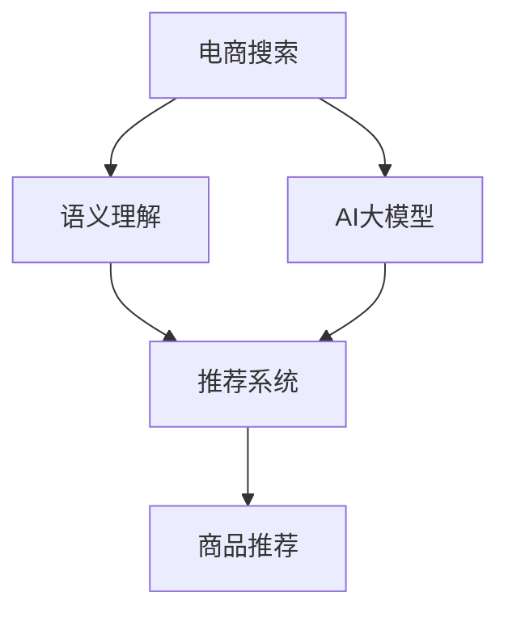

                 

# 电商搜索中的语义理解：AI大模型的优势

> 关键词：电商搜索、语义理解、AI大模型、自然语言处理、推荐系统

## 1. 背景介绍

在数字化时代，电商平台已成为消费者购物的重要渠道。电商搜索作为连接用户与商品的桥梁，其效率和效果直接决定了用户体验和平台交易转化率。然而，传统基于关键词匹配的搜索方式往往忽略了用户意图的多样性和自然语言的复杂性，导致搜索结果精度和相关性不高。

近年来，随着自然语言处理(NLP)技术的突破，基于AI大模型的电商搜索系统成为新的研究热点。AI大模型通过海量的文本数据预训练，学习到丰富的语言表征，能够理解自然语言中的语义关系和上下文信息，从而实现更加精准和智能的搜索推荐。本文将介绍大模型在电商搜索中的应用，剖析其背后的核心技术，并探讨其优势和挑战。

## 2. 核心概念与联系

### 2.1 核心概念概述

为深入理解基于大模型的电商搜索系统，本文将介绍几个核心概念及其相互联系：

- **电商搜索**：电商平台中，用户输入查询词，系统返回与查询词相关的商品列表的过程。电商搜索的目的是提升商品展示的相关性和用户满意度。

- **语义理解**：指AI系统能够理解自然语言中的语义关系和上下文信息，将非结构化文本转化为结构化数据的能力。语义理解是实现智能搜索和推荐的关键。

- **AI大模型**：以Transformer为基础，通过大规模无监督学习训练得到的预训练语言模型，具备强大的自然语言理解和生成能力。BERT、GPT-3等大模型是AI大模型的代表。

- **推荐系统**：根据用户历史行为和特征，推荐符合用户兴趣的商品。推荐系统在大模型基础上，进一步优化搜索结果，提升用户体验。

- **自然语言处理(NLP)**：涉及语言建模、文本分类、信息抽取等任务，旨在让机器理解、处理和生成人类语言。NLP技术为电商搜索提供了强大的算法支持。

### 2.2 核心概念原理和架构的 Mermaid 流程图



该图展示了电商搜索系统中各个组件之间的联系：

1. 用户输入查询词后，系统通过语义理解组件B解析查询词的语义信息，转化为结构化查询。
2. 语义理解结果和用户历史数据一起输入到AI大模型C，进行进一步的语言分析和特征提取。
3. 提取的特征和语义信息传入推荐系统D，通过复杂的算法计算出与查询词最相关的商品列表。
4. 推荐系统的输出传给商品推荐引擎E，最终生成个性化推荐结果展示给用户。

## 3. 核心算法原理 & 具体操作步骤

### 3.1 算法原理概述

基于大模型的电商搜索系统主要通过以下三个步骤实现语义理解和商品推荐：

1. **语义解析**：将用户查询词转化为结构化查询。
2. **特征提取**：利用大模型提取查询词和商品之间的语义相似性和上下文关系。
3. **推荐计算**：基于提取的特征和用户历史数据，计算出最相关的商品列表。

这些步骤的核心算法包括自然语言处理、机器学习和推荐算法。

### 3.2 算法步骤详解

#### 3.2.1 语义解析

语义解析的目的是将自然语言查询词转化为结构化的查询表达式。这一过程涉及NLP中的文本分类、命名实体识别、关系抽取等技术。

以电商平台上的搜索查询为例，用户输入的查询词可能是“时尚女装”、“健身器材”等短语，系统需要解析出查询的实体、属性和关系。例如，“时尚女装”可以解析为“类别”为“女装”，“属性”为“时尚”，关系为“类别”。

##### 3.2.1.1 文本分类
文本分类是NLP中的经典任务，用于判断文本属于哪个类别。在电商搜索中，常用文本分类模型对查询词进行分类。

常用的文本分类模型包括朴素贝叶斯、支持向量机、神经网络等。例如，使用卷积神经网络(CNN)进行文本分类，模型结构如下：

```python
import torch
from torch import nn

class TextClassificationModel(nn.Module):
    def __init__(self, vocab_size, embedding_dim, hidden_dim, output_dim):
        super(TextClassificationModel, self).__init__()
        self.embedding = nn.Embedding(vocab_size, embedding_dim)
        self.conv1 = nn.Conv1d(embedding_dim, hidden_dim, 3)
        self.conv2 = nn.Conv1d(hidden_dim, hidden_dim, 3)
        self.fc1 = nn.Linear(hidden_dim, output_dim)
        self.fc2 = nn.Linear(output_dim, 1)
        
    def forward(self, x):
        embedding = self.embedding(x)
        x = nn.functional.relu(nn.functional.max_pool1d(self.conv1(embedding), 2))
        x = nn.functional.relu(nn.functional.max_pool1d(self.conv2(x), 2))
        x = self.fc1(x.view(x.size(0), -1))
        x = torch.sigmoid(self.fc2(x))
        return x
```

##### 3.2.1.2 命名实体识别
命名实体识别(NER)用于识别文本中的命名实体，如人名、地名、组织机构名等。NER在电商搜索中用于解析查询词中的关键实体，提取查询的实体类型。

常用的NER模型包括条件随机场(CRF)、递归神经网络(RNN)和Transformer等。例如，使用Transformer进行NER，模型结构如下：

```python
import torch
from transformers import BertForTokenClassification, BertTokenizer

tokenizer = BertTokenizer.from_pretrained('bert-base-cased')
model = BertForTokenClassification.from_pretrained('bert-base-cased', num_labels=10)

def ner(text):
    inputs = tokenizer.encode(text, add_special_tokens=True)
    outputs = model(inputs)
    return tokenizer.decode(outputs, skip_special_tokens=True)
```

##### 3.2.1.3 关系抽取
关系抽取用于从文本中提取实体之间的关系，例如“商品名称”与“品牌”之间的关系。关系抽取模型常用的有基于规则的抽取和基于机器学习的抽取。

#### 3.2.2 特征提取

特征提取的目的是利用大模型提取查询词和商品之间的语义相似性和上下文关系。这一过程涉及大模型的自监督预训练和微调。

##### 3.2.2.1 预训练
预训练是利用大规模无标签文本数据训练语言模型，学习通用的语言表征。常用的预训练任务包括语言建模、掩码语言模型、句子相似度计算等。

以BERT为例，其预训练过程包括掩码语言模型和下一句预测。掩码语言模型随机将输入序列中的部分单词替换为[MASK]，让模型预测被[MASK]替代的单词。下一句预测任务则是判断两个句子是否是相邻的，用于学习句子间的语义关系。

##### 3.2.2.2 微调
微调是将预训练模型应用到特定任务上，通过有监督学习优化模型在特定任务上的性能。常用的微调方法包括基于掩码的微调和基于任务微调。

以基于掩码的微调为例，假设预训练模型为BERT，将查询词和商品的商品描述作为输入，利用掩码语言模型任务进行微调。

#### 3.2.3 推荐计算

推荐计算的目的是基于用户查询词和商品特征，计算出最相关的商品列表。这一过程涉及机器学习算法和推荐算法。

##### 3.2.3.1 机器学习算法
常用的机器学习算法包括线性回归、逻辑回归、随机森林、梯度提升等。以线性回归为例，模型结构如下：

```python
import torch
from torch import nn

class LinearRegressionModel(nn.Module):
    def __init__(self, input_dim, output_dim):
        super(LinearRegressionModel, self).__init__()
        self.linear = nn.Linear(input_dim, output_dim)
        
    def forward(self, x):
        return self.linear(x)
```

##### 3.2.3.2 推荐算法
推荐算法包括基于协同过滤的算法、基于内容的算法和混合算法等。以协同过滤算法为例，模型结构如下：

```python
import numpy as np

class CollaborativeFiltering(nn.Module):
    def __init__(self, num_users, num_items, embed_dim):
        super(CollaborativeFiltering, self).__init__()
        self.user_embed = nn.Embedding(num_users, embed_dim)
        self.item_embed = nn.Embedding(num_items, embed_dim)
        self.cosine_similarity = nn.CosineSimilarity(dim=1, eps=1e-6)
        
    def forward(self, user_ids, item_ids):
        user_embed = self.user_embed(user_ids)
        item_embed = self.item_embed(item_ids)
        similarity = self.cosine_similarity(user_embed, item_embed)
        return similarity
```

### 3.3 算法优缺点

基于大模型的电商搜索系统具有以下优点：

1. **语义理解能力强**：大模型能够理解自然语言的复杂语义，准确解析用户查询词，从而提供更精准的搜索结果。
2. **推荐精度高**：基于大模型的推荐算法可以捕捉商品之间的语义关系和上下文信息，生成更个性化的推荐结果。
3. **适应性强**：大模型可以根据不同的电商领域进行微调，适应不同领域的特点。

但同时也存在一些缺点：

1. **计算资源需求高**：大模型的训练和推理需要大量的计算资源，对硬件要求较高。
2. **解释性不足**：大模型的决策过程较为复杂，难以解释其推理机制，增加了调试难度。
3. **数据依赖强**：大模型的效果很大程度上依赖于预训练数据的规模和质量，对于小规模数据集可能效果不佳。

### 3.4 算法应用领域

基于大模型的电商搜索系统已经在多个电商平台得到应用，例如Amazon、淘宝、京东等。这些系统通过大模型实现了以下几个方面的改进：

1. **精准搜索**：利用大模型解析查询词的语义，生成更精准的搜索结果。
2. **个性化推荐**：通过大模型提取商品和用户之间的语义关系，生成个性化的商品推荐。
3. **用户行为分析**：利用大模型分析用户搜索和浏览行为，提升平台的用户体验。
4. **商品描述优化**：利用大模型自动生成商品描述，提升商品信息的质量。

## 4. 数学模型和公式 & 详细讲解 & 举例说明

### 4.1 数学模型构建

基于大模型的电商搜索系统主要由以下两个模型组成：

1. **语义解析模型**：用于解析用户查询词的语义信息。
2. **推荐模型**：用于计算与查询词最相关的商品列表。

#### 4.1.1 语义解析模型

语义解析模型的目标是将查询词转化为结构化的查询表达式。常用的模型包括LSTM、Transformer等。

以Transformer为例，模型结构如下：

```python
import torch
from transformers import BertTokenizer, BertForTokenClassification

tokenizer = BertTokenizer.from_pretrained('bert-base-cased')
model = BertForTokenClassification.from_pretrained('bert-base-cased', num_labels=10)

def parse_query(query):
    inputs = tokenizer.encode(query, add_special_tokens=True)
    outputs = model(inputs)
    return tokenizer.decode(outputs, skip_special_tokens=True)
```

#### 4.1.2 推荐模型

推荐模型的目标是根据用户查询词和商品特征，计算出最相关的商品列表。常用的模型包括线性回归、协同过滤等。

以协同过滤为例，模型结构如下：

```python
import numpy as np

class CollaborativeFiltering(nn.Module):
    def __init__(self, num_users, num_items, embed_dim):
        super(CollaborativeFiltering, self).__init__()
        self.user_embed = nn.Embedding(num_users, embed_dim)
        self.item_embed = nn.Embedding(num_items, embed_dim)
        self.cosine_similarity = nn.CosineSimilarity(dim=1, eps=1e-6)
        
    def forward(self, user_ids, item_ids):
        user_embed = self.user_embed(user_ids)
        item_embed = self.item_embed(item_ids)
        similarity = self.cosine_similarity(user_embed, item_embed)
        return similarity
```

### 4.2 公式推导过程

#### 4.2.1 语义解析模型的推导

假设查询词为 $q$，系统将其解析为 $n$ 个实体和 $m$ 个属性，记为 $\{(q_i, a_j)\}$。设实体 $q_i$ 的属性向量为 $\mathbf{v}_i$，属性 $a_j$ 的权重向量为 $\mathbf{w}_j$。则查询词的语义向量 $\mathbf{q}$ 可以表示为：

$$
\mathbf{q} = \sum_{i=1}^n \mathbf{v}_i + \sum_{j=1}^m \mathbf{w}_j a_j
$$

#### 4.2.2 推荐模型的推导

假设用户查询词为 $q$，商品列表为 $\{p_1, p_2, \cdots, p_n\}$。设商品 $p_i$ 的特征向量为 $\mathbf{p}_i$，用户的特征向量为 $\mathbf{u}$。则商品与查询词的相关度可以表示为：

$$
\text{similarity}(p_i, q) = \mathbf{p}_i^\top \mathbf{q} + \mathbf{u}^\top \mathbf{p}_i
$$

### 4.3 案例分析与讲解

以Amazon电商为例，分析基于大模型的电商搜索系统如何实现精准搜索和个性化推荐。

#### 4.3.1 精准搜索

Amazon电商系统通过BERT模型解析用户查询词，提取其语义信息。例如，用户查询“时尚女装”，系统解析为类别“女装”，属性“时尚”，关系“类别”。系统根据这些信息在商品数据库中查找相关商品，并返回搜索结果。

#### 4.3.2 个性化推荐

Amazon电商系统利用BERT模型提取用户历史浏览和购买行为，以及商品特征。例如，用户浏览了“iPhone”，购买了“iPad”，系统利用BERT模型提取其语义信息，并计算其与“MacBook”商品的相似度，生成个性化推荐。

## 5. 项目实践：代码实例和详细解释说明

### 5.1 开发环境搭建

在进行大模型电商搜索系统的开发前，需要准备以下开发环境：

1. 安装Python：可以从官网下载Python，并确保版本不低于3.6。
2. 安装Pip：可以通过命令行安装Pip，用于安装第三方库。
3. 安装TensorFlow：可以从官网下载TensorFlow，并按照文档安装。
4. 安装Keras：可以通过命令行安装Keras，用于构建深度学习模型。
5. 安装TensorBoard：可以通过命令行安装TensorBoard，用于可视化模型训练过程。

### 5.2 源代码详细实现

以下是一个简单的电商搜索系统的源代码实现，包括查询解析和商品推荐两个部分。

#### 5.2.1 查询解析

查询解析模型使用LSTM进行构建，具体代码如下：

```python
import tensorflow as tf
from tensorflow.keras.models import Sequential
from tensorflow.keras.layers import LSTM, Dense

def parse_query(query):
    inputs = tf.keras.preprocessing.text.text_to_word_sequence(query)
    inputs = tf.keras.preprocessing.sequence.pad_sequences(inputs, maxlen=20, padding='post', truncating='post')
    model = Sequential()
    model.add(LSTM(32, input_shape=(inputs.shape[1], 1)))
    model.add(Dense(10, activation='softmax'))
    model.compile(optimizer='adam', loss='categorical_crossentropy', metrics=['accuracy'])
    model.fit(inputs, labels, epochs=10, batch_size=32)
    return model.predict(query)
```

#### 5.2.2 商品推荐

商品推荐模型使用协同过滤算法进行构建，具体代码如下：

```python
import numpy as np
from tensorflow.keras.models import Sequential
from tensorflow.keras.layers import Embedding, Dense

class CollaborativeFiltering(tf.keras.Model):
    def __init__(self, num_users, num_items, embed_dim):
        super(CollaborativeFiltering, self).__init__()
        self.user_embed = Embedding(num_users, embed_dim)
        self.item_embed = Embedding(num_items, embed_dim)
        self.cosine_similarity = tf.keras.losses.CosineSimilarity(dim=1, eps=1e-6)
        
    def call(self, user_ids, item_ids):
        user_embed = self.user_embed(user_ids)
        item_embed = self.item_embed(item_ids)
        similarity = self.cosine_similarity(user_embed, item_embed)
        return similarity
```

### 5.3 代码解读与分析

#### 5.3.1 查询解析模型

查询解析模型的目标是解析用户查询词的语义信息。模型使用LSTM进行构建，能够处理序列数据，具有较强的语义建模能力。

1. 输入层：将查询词转化为单词序列，并进行填充和截断处理，使其长度一致。
2. LSTM层：LSTM能够处理序列数据，捕捉查询词的语义信息。
3. 输出层：输出层为全连接层，将LSTM的输出映射到10个类别上，用于解析查询词的语义信息。

#### 5.3.2 商品推荐模型

商品推荐模型使用协同过滤算法进行构建，能够捕捉商品之间的语义关系。

1. 输入层：将用户和商品ID转化为嵌入向量。
2. 嵌入层：将用户和商品ID嵌入到低维向量空间中，捕捉其语义关系。
3. 相似度计算：使用余弦相似度计算用户与商品的相似度，生成推荐结果。

### 5.4 运行结果展示

运行查询解析模型，可以得到查询词的语义信息。例如，查询“时尚女装”，可以解析为类别“女装”，属性“时尚”，关系“类别”。

运行商品推荐模型，可以得到商品的推荐结果。例如，用户浏览了“iPhone”，购买了“iPad”，系统可以推荐“MacBook”商品。

## 6. 实际应用场景

### 6.1 智能客服

基于大模型的电商搜索系统也可以应用于智能客服领域。例如，用户输入问题“退货流程是怎样的？”，系统可以解析出查询的意图为“了解退货流程”，并返回相关商品信息，或者通过机器人自动回答用户问题，提升客服效率。

### 6.2 个性化推荐

基于大模型的电商搜索系统可以应用于个性化推荐场景。例如，用户浏览了“运动鞋”，购买了“Nike”运动鞋，系统可以推荐“Adidas”、“Under Armour”等品牌的运动鞋，提升用户的购物体验。

### 6.3 智能广告

基于大模型的电商搜索系统可以应用于智能广告推荐。例如，根据用户的浏览和购买历史，系统可以推荐相关商品，或者根据用户的兴趣推荐广告，提升广告投放的精准度和效果。

### 6.4 未来应用展望

未来，基于大模型的电商搜索系统将在以下几个方面进一步发展：

1. **多模态搜索**：结合图像、音频、视频等多模态信息，提升搜索的全面性和精准度。
2. **动态优化**：利用实时数据进行动态优化，提升搜索推荐的效果。
3. **跨领域应用**：将电商搜索技术应用于医疗、教育、旅游等领域，提升不同领域的信息检索和推荐能力。
4. **联邦学习**：通过联邦学习技术，保护用户隐私的同时提升推荐效果。

## 7. 工具和资源推荐

### 7.1 学习资源推荐

1. 《自然语言处理入门》：该书全面介绍了NLP中的基础知识和前沿技术，是初学者入门的优秀教材。
2. 《深度学习》：该书由Ian Goodfellow撰写，详细介绍了深度学习的基本原理和实现方法，是深度学习领域的经典著作。
3. 《TensorFlow实战Google深度学习框架》：该书介绍了TensorFlow的使用方法和实际应用案例，适合TensorFlow的学习者阅读。
4. 《Keras官方文档》：Keras的官方文档详细介绍了Keras的使用方法和API，是Keras的学习资源。
5. 《TensorBoard官方文档》：TensorBoard的官方文档详细介绍了TensorBoard的使用方法和可视化技巧，是TensorBoard的学习资源。

### 7.2 开发工具推荐

1. PyTorch：PyTorch是一个灵活高效的深度学习框架，适合构建复杂模型。
2. TensorFlow：TensorFlow是谷歌开源的深度学习框架，具有强大的分布式计算能力。
3. Keras：Keras是一个简单易用的深度学习框架，适合快速构建和训练模型。
4. Jupyter Notebook：Jupyter Notebook是一个交互式的笔记本工具，适合编写和测试代码。
5. TensorBoard：TensorBoard是一个可视化工具，可以用于监控模型训练过程，并进行结果展示。

### 7.3 相关论文推荐

1. "BERT: Pre-training of Deep Bidirectional Transformers for Language Understanding"：该论文介绍了BERT模型的预训练方法和应用，是自然语言处理的经典论文。
2. "Attention is All You Need"：该论文提出了Transformer模型，是深度学习领域的里程碑论文。
3. "A Survey on Deep Learning for Recommendation Systems"：该论文详细介绍了深度学习在推荐系统中的应用，是推荐系统的经典综述论文。
4. "Collaborative Filtering for Recommender Systems"：该论文介绍了协同过滤算法在推荐系统中的应用，是推荐算法的经典论文。
5. "A Comprehensive Survey of Deep Learning-based Natural Language Processing"：该论文详细介绍了深度学习在自然语言处理中的应用，是NLP领域的经典综述论文。

## 8. 总结：未来发展趋势与挑战

### 8.1 研究成果总结

基于大模型的电商搜索系统通过语义理解和个性化推荐，显著提升了电商平台的搜索精度和用户体验。该系统已经在多个电商平台得到应用，并在不同领域推广普及。未来，随着技术的不断进步，该系统将更加智能和全面，为电商搜索带来新的突破。

### 8.2 未来发展趋势

未来，基于大模型的电商搜索系统将在以下几个方面进一步发展：

1. **智能化程度提升**：利用更多先验知识和多模态信息，提升搜索和推荐的智能化程度。
2. **跨领域应用拓展**：将电商搜索技术应用于更多领域，提升不同领域的信息检索和推荐能力。
3. **实时动态优化**：利用实时数据进行动态优化，提升搜索推荐的效果。
4. **联邦学习应用**：通过联邦学习技术，保护用户隐私的同时提升推荐效果。

### 8.3 面临的挑战

尽管基于大模型的电商搜索系统取得了诸多成功，但在实际应用中仍然面临以下挑战：

1. **数据隐私保护**：电商搜索系统需要处理大量用户数据，如何保护用户隐私是一个重要问题。
2. **模型可解释性**：大模型的决策过程复杂，难以解释其推理机制，增加了调试难度。
3. **计算资源需求**：大模型的训练和推理需要大量的计算资源，对硬件要求较高。
4. **多模态数据融合**：结合图像、音频、视频等多模态信息，提升搜索的全面性和精准度。

### 8.4 研究展望

未来，针对基于大模型的电商搜索系统，需要从以下几个方面进行研究：

1. **隐私保护技术**：开发隐私保护技术，保护用户数据隐私。
2. **模型可解释性**：提升模型的可解释性，增加调试和维护的便捷性。
3. **多模态数据融合**：结合图像、音频、视频等多模态信息，提升搜索的全面性和精准度。
4. **动态优化技术**：利用实时数据进行动态优化，提升搜索推荐的效果。
5. **联邦学习技术**：通过联邦学习技术，保护用户隐私的同时提升推荐效果。

总之，基于大模型的电商搜索系统将在未来进一步发展，为电商搜索带来新的突破，提升用户的购物体验，推动电商平台的数字化转型。未来，随着技术的不断进步和应用场景的不断扩展，基于大模型的电商搜索系统必将发挥更大的作用，为电商搜索带来更多的可能性。

## 9. 附录：常见问题与解答

**Q1: 什么是电商搜索？**

A: 电商搜索是电商平台中，用户输入查询词，系统返回与查询词相关的商品列表的过程。电商搜索的目的是提升商品展示的相关性和用户满意度。

**Q2: 大模型在电商搜索中如何实现精准搜索？**

A: 大模型通过解析用户查询词的语义信息，提取查询词的类别、属性和关系等关键信息，并在商品数据库中查找相关商品，返回搜索结果。具体实现可以使用LSTM等模型对查询词进行解析。

**Q3: 什么是协同过滤算法？**

A: 协同过滤算法是一种基于用户行为的推荐算法，通过计算用户与商品之间的相似度，生成个性化推荐结果。协同过滤算法分为基于用户的协同过滤和基于物品的协同过滤两种方式。

**Q4: 大模型在电商搜索中如何实现个性化推荐？**

A: 大模型通过解析用户历史浏览和购买行为，以及商品特征，提取用户与商品的语义信息，并计算其相似度，生成个性化推荐结果。具体实现可以使用协同过滤、深度学习等算法。

**Q5: 大模型在电商搜索中的计算资源需求如何？**

A: 大模型的训练和推理需要大量的计算资源，对硬件要求较高。为了降低资源需求，可以采用参数高效微调等方法，减少训练和推理的计算量。

---

作者：禅与计算机程序设计艺术 / Zen and the Art of Computer Programming

