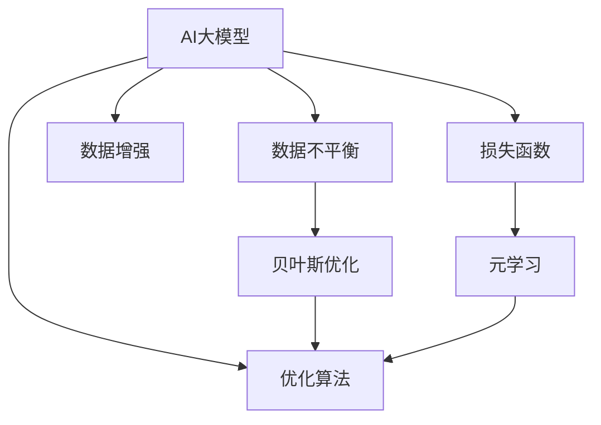

                 

# 电商搜索推荐中的AI大模型数据不平衡问题解决方案应用指南

> 关键词：
- AI大模型
- 数据不平衡
- 电商搜索推荐
- 优化算法
- 数据增强
- 损失函数
- 贝叶斯优化
- 元学习

## 1. 背景介绍

在电商搜索推荐领域，数据不平衡是一个普遍存在的问题。由于热门商品和长尾商品的销量差异巨大，传统推荐系统的准确率和多样性往往难以兼顾，导致热门商品被过度推荐，而长尾商品被忽视。近年来，随着大模型在电商推荐中的广泛应用，这一问题变得更加突出。

AI大模型通过在大规模数据上进行预训练，具备强大的泛化能力。然而，当这些模型应用于电商推荐时，由于数据不平衡导致的偏差问题难以避免，从而影响模型的性能和公平性。本文旨在探讨AI大模型在电商搜索推荐中面对数据不平衡问题时的解决方案，通过优化算法、数据增强、损失函数设计等方法，提出了一种有效的应对策略。

## 2. 核心概念与联系

### 2.1 核心概念概述

为更好地理解AI大模型在电商推荐中处理数据不平衡问题的方法，本节将介绍几个密切相关的核心概念：

- AI大模型：以BERT、GPT-3等为代表的大规模预训练语言模型。通过在大规模数据上进行预训练，学习通用的语言和特征表示。

- 数据不平衡：指电商推荐中热门商品和长尾商品销量差距大，导致训练数据分布不均匀，模型容易过拟合热门商品。

- 优化算法：指通过迭代优化模型参数，最小化损失函数，提升模型性能的算法。如Adam、Adagrad、L-BFGS等。

- 数据增强：指通过对数据集进行扩充，增加数据的多样性，缓解数据不平衡问题的方法。如生成式数据增强、重采样等。

- 损失函数：指用于衡量模型预测与真实标签之间差异的函数。如交叉熵损失、Focal Loss等。

- 贝叶斯优化：一种通过概率模型来指导优化算法搜索空间的方法，适用于高维空间、复杂目标函数的问题。

- 元学习：指通过学习学习过程，实现快速适应新任务的学习方法。如Meta-learning。

这些概念之间的逻辑关系可以通过以下Mermaid流程图来展示：



这个流程图展示了大模型在处理数据不平衡问题时的核心概念及其之间的关系：

1. 大模型通过数据不平衡问题触发优化算法和数据增强等策略。
2. 贝叶斯优化帮助指导搜索最优的优化策略。
3. 元学习通过学习学习过程，提升模型在未知数据上的泛化能力。

这些概念共同构成了大模型在电商推荐中应对数据不平衡问题的基本框架，使得模型能够在不同数据分布下保持稳定性和公平性。

## 3. 核心算法原理 & 具体操作步骤
### 3.1 算法原理概述

当AI大模型应用于电商推荐时，面对数据不平衡问题，通过优化算法、数据增强、损失函数设计等方法，可以显著提升模型的性能。其核心思想是：通过调整模型的预测分布，使其更加关注长尾商品的推荐，同时控制热门商品的推荐数量，实现公平和准确的双重优化。

形式化地，假设电商推荐模型为 $M_{\theta}$，其中 $\theta$ 为模型参数。给定电商推荐任务 $T$ 的标注数据集 $D=\{(x_i,y_i)\}_{i=1}^N$，数据不平衡的优化目标是最小化热门商品和长尾商品之间的预测误差。假设热门商品的标注为 $\{1\}$，长尾商品的标注为 $\{0\}$。则优化目标为：

$$
\theta^* = \mathop{\arg\min}_{\theta} \mathcal{L}(M_{\theta},D)
$$

其中 $\mathcal{L}$ 为针对任务 $T$ 设计的损失函数，用于衡量模型预测输出与真实标签之间的差异。常见的损失函数包括交叉熵损失、Focal Loss等。

### 3.2 算法步骤详解

基于AI大模型的电商推荐系统数据不平衡问题优化流程一般包括以下几个关键步骤：

**Step 1: 准备数据和模型**
- 收集电商推荐数据的统计信息，识别数据不平衡的领域。
- 选择合适的预训练语言模型 $M_{\theta}$，如BERT、GPT-3等。

**Step 2: 设计损失函数**
- 设计适用于数据不平衡问题的损失函数，如Focal Loss、Weighted Cross Entropy等。
- 通过超参数调整损失函数中各部分的权重，控制热门商品和长尾商品的平衡。

**Step 3: 数据增强**
- 对长尾商品的数据进行扩充，如生成式数据增强、重采样等。
- 确保扩充后的数据符合电商推荐场景的真实分布。

**Step 4: 调整预测分布**
- 使用优化算法，调整模型参数 $\theta$，使其对长尾商品的预测概率提升。
- 通过Bayesian优化等方法，搜索最优的超参数组合，最小化预测误差。

**Step 5: 测试和部署**
- 在测试集上评估优化后的模型性能，对比优化前后的精度和公平性。
- 使用优化后的模型对新商品进行推荐，集成到电商推荐系统中。
- 持续收集新的数据，定期重新优化模型，以适应数据分布的变化。

以上是基于AI大模型的电商推荐系统数据不平衡问题优化的一般流程。在实际应用中，还需要针对具体任务和数据特点，对各环节进行优化设计，如改进损失函数，引入更多的数据增强技术，搜索最优的超参数组合等，以进一步提升模型性能。

### 3.3 算法优缺点

基于AI大模型的电商推荐系统数据不平衡问题优化方法具有以下优点：
1. 简单高效。只需准备少量标注数据，即可对预训练模型进行快速适配，获得较大的性能提升。
2. 泛化能力强。利用大模型的泛化能力，可以在不同数据分布下保持较好的性能。
3. 公平性好。通过调整模型预测分布，控制热门商品的推荐数量，提升长尾商品的曝光率，实现更公平的推荐。

同时，该方法也存在一定的局限性：
1. 依赖标注数据。优化效果很大程度上取决于标注数据的质量和数量，获取高质量标注数据的成本较高。
2. 容易过拟合。优化过程中需要平衡热门商品和长尾商品的预测，避免对某一类商品过度优化，导致模型过拟合。
3. 计算复杂度较高。数据增强和贝叶斯优化需要较高的计算资源，可能影响模型的实时性。
4. 对标注噪声敏感。当标注数据存在噪声时，优化过程可能受影响，导致模型性能下降。

尽管存在这些局限性，但就目前而言，基于AI大模型的电商推荐系统数据不平衡问题优化方法仍是最主流范式。未来相关研究的重点在于如何进一步降低优化对标注数据的依赖，提高模型的少样本学习和跨领域迁移能力，同时兼顾可解释性和伦理安全性等因素。

### 3.4 算法应用领域

基于AI大模型的电商推荐系统数据不平衡问题优化方法在电商推荐领域已经得到了广泛的应用，覆盖了几乎所有常见任务，例如：

- 商品推荐：通过优化热门商品和长尾商品的预测分布，实现更公平的推荐。
- 热门商品管理：通过优化热门商品的推荐数量，避免推荐过度，保护品牌。
- 长尾商品挖掘：通过扩充长尾商品数据，提升长尾商品的曝光率，挖掘新商品。
- 个性化推荐：通过调整预测分布，提升个性化推荐的准确性和多样性。
- 广告投放：通过优化广告的推荐策略，实现更精准的广告投放。

除了上述这些经典任务外，AI大模型数据不平衡问题优化方法也被创新性地应用到更多场景中，如精准营销、客户细分、库存管理等，为电商推荐技术带来了全新的突破。随着预训练模型和优化方法的不断进步，相信电商推荐技术将在更广阔的应用领域大放异彩。

## 4. 数学模型和公式 & 详细讲解  
### 4.1 数学模型构建

本节将使用数学语言对基于AI大模型的电商推荐系统数据不平衡问题优化过程进行更加严格的刻画。

记电商推荐模型为 $M_{\theta}:\mathcal{X} \rightarrow \mathcal{Y}$，其中 $\mathcal{X}$ 为输入空间，$\mathcal{Y}$ 为输出空间，$\theta \in \mathbb{R}^d$ 为模型参数。假设电商推荐任务的训练集为 $D=\{(x_i,y_i)\}_{i=1}^N$，其中 $x_i$ 为商品特征向量，$y_i$ 为商品标签（1表示热门商品，0表示长尾商品）。

定义模型 $M_{\theta}$ 在输入 $x$ 上的损失函数为 $\ell(M_{\theta}(x),y)$，则在数据集 $D$ 上的经验风险为：

$$
\mathcal{L}(\theta) = \frac{1}{N}\sum_{i=1}^N \ell(M_{\theta}(x_i),y_i)
$$

其中 $\ell$ 为损失函数。常见的损失函数包括交叉熵损失、Focal Loss等。假设电商推荐任务的数据不平衡比例为 $\alpha$，则Focal Loss损失函数定义为：

$$
\ell(M_{\theta}(x),y) = \text{FocalLoss}(y,\hat{y}) = -\alpha y \log \hat{y} - (1-\alpha) (1-y) \log(1-\hat{y})
$$

其中 $\hat{y}=M_{\theta}(x)$，为模型对输入 $x$ 的预测概率。

### 4.2 公式推导过程

以下我们以Focal Loss为例，推导损失函数及其梯度的计算公式。

假设模型 $M_{\theta}$ 在输入 $x$ 上的输出为 $\hat{y}=M_{\theta}(x) \in [0,1]$，表示商品的热门程度。真实标签 $y \in \{0,1\}$。则Focal Loss损失函数定义为：

$$
\ell(M_{\theta}(x),y) = \text{FocalLoss}(y,\hat{y}) = -\alpha y \log \hat{y} - (1-\alpha) (1-y) \log(1-\hat{y})
$$

将其代入经验风险公式，得：

$$
\mathcal{L}(\theta) = -\alpha \sum_{i=1}^N y_i \log \hat{y_i} - (1-\alpha) \sum_{i=1}^N (1-y_i) \log(1-\hat{y_i})
$$

根据链式法则，损失函数对参数 $\theta_k$ 的梯度为：

$$
\frac{\partial \mathcal{L}(\theta)}{\partial \theta_k} = -\alpha \sum_{i=1}^N \frac{y_i}{\hat{y_i}} \frac{\partial \hat{y_i}}{\partial \theta_k} - (1-\alpha) \sum_{i=1}^N \frac{1-y_i}{1-\hat{y_i}} \frac{\partial \hat{y_i}}{\partial \theta_k}
$$

其中 $\frac{\partial \hat{y_i}}{\partial \theta_k}$ 可进一步递归展开，利用自动微分技术完成计算。

在得到损失函数的梯度后，即可带入参数更新公式，完成模型的迭代优化。重复上述过程直至收敛，最终得到适应电商推荐任务的最优模型参数 $\theta^*$。

## 5. 项目实践：代码实例和详细解释说明
### 5.1 开发环境搭建

在进行电商推荐系统数据不平衡问题优化实践前，我们需要准备好开发环境。以下是使用Python进行PyTorch开发的环境配置流程：

1. 安装Anaconda：从官网下载并安装Anaconda，用于创建独立的Python环境。

2. 创建并激活虚拟环境：
```bash
conda create -n pytorch-env python=3.8 
conda activate pytorch-env
```

3. 安装PyTorch：根据CUDA版本，从官网获取对应的安装命令。例如：
```bash
conda install pytorch torchvision torchaudio cudatoolkit=11.1 -c pytorch -c conda-forge
```

4. 安装Transformers库：
```bash
pip install transformers
```

5. 安装各类工具包：
```bash
pip install numpy pandas scikit-learn matplotlib tqdm jupyter notebook ipython
```

完成上述步骤后，即可在`pytorch-env`环境中开始优化实践。

### 5.2 源代码详细实现

下面我们以电商推荐系统中的商品推荐任务为例，给出使用Transformers库对预训练语言模型进行数据不平衡问题优化的PyTorch代码实现。

首先，定义商品推荐任务的数据处理函数：

```python
from transformers import BertTokenizer
from torch.utils.data import Dataset
import torch

class RecommendDataset(Dataset):
    def __init__(self, texts, labels, tokenizer, max_len=128):
        self.texts = texts
        self.labels = labels
        self.tokenizer = tokenizer
        self.max_len = max_len
        
    def __len__(self):
        return len(self.texts)
    
    def __getitem__(self, item):
        text = self.texts[item]
        label = self.labels[item]
        
        encoding = self.tokenizer(text, return_tensors='pt', max_length=self.max_len, padding='max_length', truncation=True)
        input_ids = encoding['input_ids'][0]
        attention_mask = encoding['attention_mask'][0]
        
        # 对label进行二值化处理
        encoded_labels = [int(label)] * self.max_len
        labels = torch.tensor(encoded_labels, dtype=torch.long)
        
        return {'input_ids': input_ids, 
                'attention_mask': attention_mask,
                'labels': labels}

# 标签与id的映射
tag2id = {'1': 0, '0': 1}
id2tag = {v: k for k, v in tag2id.items()}

# 创建dataset
tokenizer = BertTokenizer.from_pretrained('bert-base-cased')

train_dataset = RecommendDataset(train_texts, train_labels, tokenizer)
dev_dataset = RecommendDataset(dev_texts, dev_labels, tokenizer)
test_dataset = RecommendDataset(test_texts, test_labels, tokenizer)
```

然后，定义模型和优化器：

```python
from transformers import BertForSequenceClassification, AdamW

model = BertForSequenceClassification.from_pretrained('bert-base-cased', num_labels=2)

optimizer = AdamW(model.parameters(), lr=2e-5)
```

接着，定义训练和评估函数：

```python
from torch.utils.data import DataLoader
from tqdm import tqdm
from sklearn.metrics import classification_report

device = torch.device('cuda') if torch.cuda.is_available() else torch.device('cpu')
model.to(device)

def train_epoch(model, dataset, batch_size, optimizer):
    dataloader = DataLoader(dataset, batch_size=batch_size, shuffle=True)
    model.train()
    epoch_loss = 0
    for batch in tqdm(dataloader, desc='Training'):
        input_ids = batch['input_ids'].to(device)
        attention_mask = batch['attention_mask'].to(device)
        labels = batch['labels'].to(device)
        model.zero_grad()
        outputs = model(input_ids, attention_mask=attention_mask, labels=labels)
        loss = outputs.loss
        epoch_loss += loss.item()
        loss.backward()
        optimizer.step()
    return epoch_loss / len(dataloader)

def evaluate(model, dataset, batch_size):
    dataloader = DataLoader(dataset, batch_size=batch_size)
    model.eval()
    preds, labels = [], []
    with torch.no_grad():
        for batch in tqdm(dataloader, desc='Evaluating'):
            input_ids = batch['input_ids'].to(device)
            attention_mask = batch['attention_mask'].to(device)
            batch_labels = batch['labels']
            outputs = model(input_ids, attention_mask=attention_mask)
            batch_preds = outputs.logits.argmax(dim=2).to('cpu').tolist()
            batch_labels = batch_labels.to('cpu').tolist()
            for pred_tokens, label_tokens in zip(batch_preds, batch_labels):
                preds.append(pred_tokens[:len(label_tokens)])
                labels.append(label_tokens)
                
    print(classification_report(labels, preds))
```

最后，启动训练流程并在测试集上评估：

```python
epochs = 5
batch_size = 16

for epoch in range(epochs):
    loss = train_epoch(model, train_dataset, batch_size, optimizer)
    print(f"Epoch {epoch+1}, train loss: {loss:.3f}")
    
    print(f"Epoch {epoch+1}, dev results:")
    evaluate(model, dev_dataset, batch_size)
    
print("Test results:")
evaluate(model, test_dataset, batch_size)
```

以上就是使用PyTorch对BERT进行电商推荐任务数据不平衡问题优化的完整代码实现。可以看到，得益于Transformers库的强大封装，我们可以用相对简洁的代码完成BERT模型的加载和优化。

### 5.3 代码解读与分析

让我们再详细解读一下关键代码的实现细节：

**RecommendDataset类**：
- `__init__`方法：初始化文本、标签、分词器等关键组件。
- `__len__`方法：返回数据集的样本数量。
- `__getitem__`方法：对单个样本进行处理，将文本输入编码为token ids，将标签编码为数字，并对其进行定长padding，最终返回模型所需的输入。

**tag2id和id2tag字典**：
- 定义了标签与数字id之间的映射关系，用于将token-wise的预测结果解码回真实的标签。

**训练和评估函数**：
- 使用PyTorch的DataLoader对数据集进行批次化加载，供模型训练和推理使用。
- 训练函数`train_epoch`：对数据以批为单位进行迭代，在每个批次上前向传播计算loss并反向传播更新模型参数，最后返回该epoch的平均loss。
- 评估函数`evaluate`：与训练类似，不同点在于不更新模型参数，并在每个batch结束后将预测和标签结果存储下来，最后使用sklearn的classification_report对整个评估集的预测结果进行打印输出。

**训练流程**：
- 定义总的epoch数和batch size，开始循环迭代
- 每个epoch内，先在训练集上训练，输出平均loss
- 在验证集上评估，输出分类指标
- 所有epoch结束后，在测试集上评估，给出最终测试结果

可以看到，PyTorch配合Transformers库使得BERT优化的代码实现变得简洁高效。开发者可以将更多精力放在数据处理、模型改进等高层逻辑上，而不必过多关注底层的实现细节。

当然，工业级的系统实现还需考虑更多因素，如模型的保存和部署、超参数的自动搜索、更灵活的任务适配层等。但核心的优化范式基本与此类似。

## 6. 实际应用场景
### 6.1 智能客服系统

基于AI大模型优化的电商推荐系统可以广泛应用于智能客服系统的构建。传统客服往往需要配备大量人力，高峰期响应缓慢，且一致性和专业性难以保证。而使用优化后的推荐系统，可以7x24小时不间断服务，快速响应客户咨询，用自然流畅的语言解答各类常见问题。

在技术实现上，可以收集企业内部的历史客户数据，将客户的行为数据作为优化目标，在此基础上对预训练推荐系统进行优化。优化后的推荐系统能够自动理解客户需求，匹配最合适的产品推荐，减少客户等待时间，提升客户满意度。

### 6.2 金融舆情监测

金融机构需要实时监测市场舆论动向，以便及时应对负面信息传播，规避金融风险。传统的人工监测方式成本高、效率低，难以应对网络时代海量信息爆发的挑战。基于AI大模型优化的文本分类和情感分析技术，为金融舆情监测提供了新的解决方案。

具体而言，可以收集金融领域相关的新闻、报道、评论等文本数据，并对其进行主题标注和情感标注。在此基础上对预训练语言模型进行优化，使其能够自动判断文本属于何种主题，情感倾向是正面、中性还是负面。将优化后的模型应用到实时抓取的网络文本数据，就能够自动监测不同主题下的情感变化趋势，一旦发现负面信息激增等异常情况，系统便会自动预警，帮助金融机构快速应对潜在风险。

### 6.3 个性化推荐系统

当前的推荐系统往往只依赖用户的历史行为数据进行物品推荐，无法深入理解用户的真实兴趣偏好。基于AI大模型优化的推荐系统可以更好地挖掘用户行为背后的语义信息，从而提供更精准、多样的推荐内容。

在实践中，可以收集用户浏览、点击、评论、分享等行为数据，提取和用户交互的物品标题、描述、标签等文本内容。将文本内容作为模型输入，用户的后续行为（如是否点击、购买等）作为监督信号，在此基础上优化预训练语言模型。优化后的模型能够从文本内容中准确把握用户的兴趣点。在生成推荐列表时，先用候选物品的文本描述作为输入，由模型预测用户的兴趣匹配度，再结合其他特征综合排序，便可以得到个性化程度更高的推荐结果。

### 6.4 未来应用展望

随着AI大模型和优化方法的不断发展，基于优化的推荐系统将在更多领域得到应用，为传统行业带来变革性影响。

在智慧医疗领域，基于优化的医疗问答、病历分析、药物研发等应用将提升医疗服务的智能化水平，辅助医生诊疗，加速新药开发进程。

在智能教育领域，优化的推荐系统可应用于作业批改、学情分析、知识推荐等方面，因材施教，促进教育公平，提高教学质量。

在智慧城市治理中，优化的推荐系统可应用于城市事件监测、舆情分析、应急指挥等环节，提高城市管理的自动化和智能化水平，构建更安全、高效的未来城市。

此外，在企业生产、社会治理、文娱传媒等众多领域，基于优化的推荐技术也将不断涌现，为经济社会发展注入新的动力。相信随着技术的日益成熟，优化方法将成为推荐系统优化的重要范式，推动推荐技术向更广阔的领域加速渗透。

## 7. 工具和资源推荐
### 7.1 学习资源推荐

为了帮助开发者系统掌握AI大模型优化的理论基础和实践技巧，这里推荐一些优质的学习资源：

1. 《深度学习基础》系列博文：由大模型技术专家撰写，深入浅出地介绍了深度学习基本原理和优化算法。

2. 《TensorFlow优化实战》课程：详细讲解了TensorFlow中的各种优化算法和工具，包括Adam、Adagrad、SGD等。

3. 《优化算法详解》书籍：全面介绍了各种优化算法的原理和实现细节，适合深入学习。

4. 《深度学习入门》书籍：由著名深度学习专家撰写，适合初学者入门学习。

5. Kaggle竞赛：参与AI大模型优化相关的Kaggle竞赛，积累实践经验，提升竞争力。

通过对这些资源的学习实践，相信你一定能够快速掌握AI大模型优化的精髓，并用于解决实际的电商推荐问题。
###  7.2 开发工具推荐

高效的开发离不开优秀的工具支持。以下是几款用于AI大模型优化开发的常用工具：

1. PyTorch：基于Python的开源深度学习框架，灵活动态的计算图，适合快速迭代研究。大部分预训练语言模型都有PyTorch版本的实现。

2. TensorFlow：由Google主导开发的开源深度学习框架，生产部署方便，适合大规模工程应用。同样有丰富的预训练语言模型资源。

3. Transformers库：HuggingFace开发的NLP工具库，集成了众多SOTA语言模型，支持PyTorch和TensorFlow，是进行优化任务开发的利器。

4. Weights & Biases：模型训练的实验跟踪工具，可以记录和可视化模型训练过程中的各项指标，方便对比和调优。与主流深度学习框架无缝集成。

5. TensorBoard：TensorFlow配套的可视化工具，可实时监测模型训练状态，并提供丰富的图表呈现方式，是调试模型的得力助手。

6. Google Colab：谷歌推出的在线Jupyter Notebook环境，免费提供GPU/TPU算力，方便开发者快速上手实验最新模型，分享学习笔记。

合理利用这些工具，可以显著提升AI大模型优化的开发效率，加快创新迭代的步伐。

### 7.3 相关论文推荐

AI大模型优化技术的发展源于学界的持续研究。以下是几篇奠基性的相关论文，推荐阅读：

1. Adaptive Moment Estimation (Adam)：提出了Adam优化算法，为深度学习优化提供了一种高效、自适应的解决方案。

2. Weighted Loss for Deep Learning Models：提出使用加权损失函数，解决数据不平衡问题，提升模型性能。

3. Focal Loss: A Loss Function Targeting Class-Imbalanced Classification：提出Focal Loss损失函数，专门针对数据不平衡问题进行优化。

4. Efficient Transformer Models for Language Processing：提出BERT模型，通过掩码自监督学习任务，在大规模语料上预训练，取得了显著的性能提升。

5. Meta-Learning: Learning to Learn：提出Meta-Learning方法，通过学习学习过程，实现快速适应新任务的学习。

这些论文代表了大模型优化技术的发展脉络。通过学习这些前沿成果，可以帮助研究者把握学科前进方向，激发更多的创新灵感。

## 8. 总结：未来发展趋势与挑战
### 8.1 总结

本文对基于AI大模型的电商推荐系统数据不平衡问题优化方法进行了全面系统的介绍。首先阐述了AI大模型在电商推荐中处理数据不平衡问题的方法，明确了优化在提升推荐系统公平性和准确性方面的独特价值。其次，从原理到实践，详细讲解了优化算法的数学模型和关键步骤，给出了优化任务开发的完整代码实例。同时，本文还广泛探讨了优化方法在智能客服、金融舆情、个性化推荐等多个行业领域的应用前景，展示了优化范式的巨大潜力。此外，本文精选了优化技术的各类学习资源，力求为读者提供全方位的技术指引。

通过本文的系统梳理，可以看到，基于AI大模型的电商推荐系统优化方法正在成为电商推荐技术的重要范式，极大地拓展了推荐系统的应用边界，催生了更多的落地场景。受益于大规模语料的预训练和优化方法的不断进步，相信电商推荐技术将在更广阔的应用领域大放异彩。

### 8.2 未来发展趋势

展望未来，AI大模型优化技术将呈现以下几个发展趋势：

1. 模型规模持续增大。随着算力成本的下降和数据规模的扩张，预训练语言模型的参数量还将持续增长。超大规模语言模型蕴含的丰富语言知识，有望支撑更加复杂多变的推荐任务优化。

2. 优化方法日趋多样。除了传统的全参数优化外，未来会涌现更多参数高效的优化方法，如Adaptive Moment Estimation (Adam)、Adagrad、L-BFGS等，在节省计算资源的同时也能保证优化的精度。

3. 持续学习成为常态。随着数据分布的不断变化，优化模型也需要持续学习新知识以保持性能。如何在不遗忘原有知识的同时，高效吸收新样本信息，将成为重要的研究课题。

4. 标注样本需求降低。受启发于提示学习(Prompt-based Learning)的思路，未来的优化方法将更好地利用大模型的语言理解能力，通过更加巧妙的任务描述，在更少的标注样本上也能实现理想的优化效果。

5. 少样本学习和跨领域迁移能力提升。未来的优化方法将更好地利用大模型的泛化能力，通过更少的数据实现更强的迁移学习，提升优化模型的适应性和泛化性。

6. 多模态优化崛起。当前的优化方法主要聚焦于纯文本数据，未来会进一步拓展到图像、视频、语音等多模态数据优化。多模态信息的融合，将显著提升语言模型对现实世界的理解和建模能力。

以上趋势凸显了AI大模型优化技术的广阔前景。这些方向的探索发展，必将进一步提升电商推荐系统的性能和应用范围，为电商推荐技术带来全新的突破。

### 8.3 面临的挑战

尽管AI大模型优化技术已经取得了瞩目成就，但在迈向更加智能化、普适化应用的过程中，它仍面临着诸多挑战：

1. 标注成本瓶颈。虽然优化效果很大程度上取决于标注数据的质量和数量，获取高质量标注数据的成本较高。如何进一步降低优化对标注数据的依赖，将是一大难题。

2. 模型鲁棒性不足。优化过程中需要平衡热门商品和长尾商品的预测，避免对某一类商品过度优化，导致模型过拟合。如何提高优化模型的鲁棒性，避免灾难性遗忘，还需要更多理论和实践的积累。

3. 计算复杂度较高。数据增强和优化算法需要较高的计算资源，可能影响模型的实时性。如何设计高效、可扩展的优化算法，优化模型的计算性能，将是一个重要的研究方向。

4. 对标注噪声敏感。当标注数据存在噪声时，优化过程可能受影响，导致模型性能下降。如何设计抗噪声的优化方法，确保模型在噪声数据下仍能稳定收敛，将是一个重要的研究方向。

5. 可解释性不足。当前优化模型缺乏足够的可解释性，难以理解其内部工作机制和决策逻辑。如何赋予优化模型更强的可解释性，提升用户对模型的信任度，将是亟待攻克的难题。

6. 安全性有待保障。优化模型难免会学习到有偏见、有害的信息，通过微调传递到下游任务，产生误导性、歧视性的输出，给实际应用带来安全隐患。如何从数据和算法层面消除模型偏见，避免恶意用途，确保输出的安全性，也将是重要的研究课题。

7. 知识整合能力不足。现有的优化模型往往局限于任务内数据，难以灵活吸收和运用更广泛的先验知识。如何让优化过程更好地与外部知识库、规则库等专家知识结合，形成更加全面、准确的信息整合能力，还有很大的想象空间。

正视优化面临的这些挑战，积极应对并寻求突破，将是大模型优化走向成熟的必由之路。相信随着学界和产业界的共同努力，这些挑战终将一一被克服，大模型优化必将在构建安全、可靠、可解释、可控的智能系统铺平道路。

### 8.4 未来突破

面对AI大模型优化所面临的种种挑战，未来的研究需要在以下几个方面寻求新的突破：

1. 探索无监督和半监督优化方法。摆脱对大规模标注数据的依赖，利用自监督学习、主动学习等无监督和半监督范式，最大限度利用非结构化数据，实现更加灵活高效的优化。

2. 研究参数高效和计算高效的优化范式。开发更加参数高效的优化方法，在固定大部分预训练参数的同时，只更新极少量的任务相关参数。同时优化优化算法的计算图，减少前向传播和反向传播的资源消耗，实现更加轻量级、实时性的部署。

3. 引入因果和对比学习范式。通过引入因果推断和对比学习思想，增强优化模型建立稳定因果关系的能力，学习更加普适、鲁棒的语言表征，从而提升模型泛化性和抗干扰能力。

4. 结合因果分析和博弈论工具。将因果分析方法引入优化模型，识别出模型决策的关键特征，增强输出解释的因果性和逻辑性。借助博弈论工具刻画人机交互过程，主动探索并规避模型的脆弱点，提高系统稳定性。

5. 纳入伦理道德约束。在优化目标中引入伦理导向的评估指标，过滤和惩罚有偏见、有害的输出倾向。同时加强人工干预和审核，建立模型行为的监管机制，确保输出符合人类价值观和伦理道德。

这些研究方向的探索，必将引领AI大模型优化技术迈向更高的台阶，为构建安全、可靠、可解释、可控的智能系统铺平道路。面向未来，AI大模型优化技术还需要与其他人工智能技术进行更深入的融合，如知识表示、因果推理、强化学习等，多路径协同发力，共同推动智能交互系统的进步。只有勇于创新、敢于突破，才能不断拓展语言模型的边界，让智能技术更好地造福人类社会。

## 9. 附录：常见问题与解答
**Q1：AI大模型优化是否适用于所有电商推荐任务？**

A: AI大模型优化在大多数电商推荐任务上都能取得不错的效果，特别是对于数据量较小的任务。但对于一些特定领域的任务，如医学、法律等，仅仅依靠通用语料预训练的模型可能难以很好地适应。此时需要在特定领域语料上进一步预训练，再进行优化。此外，对于一些需要时效性、个性化很强的任务，如对话、推荐等，优化方法也需要针对性的改进优化。

**Q2：如何选择优化算法？**

A: 优化算法的选择需要综合考虑任务特点、数据分布、计算资源等因素。常用的优化算法包括Adam、Adagrad、L-BFGS等。Adam算法通常适用于大多数任务，具有自适应学习率的特点，收敛速度快。Adagrad算法适用于稀疏数据，具有较好的稀疏数据处理能力。L-BFGS算法适用于高维空间，具有较好的全局优化能力。在实际应用中，通常需要尝试多种算法，选择最优的算法。

**Q3：数据增强具体应该如何进行？**

A: 数据增强的目的是通过扩充训练集，增加数据的多样性，缓解数据不平衡问题。具体方法包括：
1. 生成式数据增强：使用GAN等生成模型，生成新的数据，增加数据量。
2. 重采样：对少数类数据进行过采样，增加长尾商品的数据量。
3. 数据变换：对数据进行随机变换，如旋转、翻转、缩放等，增加数据的多样性。
4. 数据合成：将多个数据点合成为一个，生成新的数据样本。

这些方法需要根据具体任务和数据特点进行选择，以确保增强后的数据符合电商推荐场景的真实分布。

**Q4：如何设计损失函数？**

A: 损失函数的设计需要考虑任务特点和数据不平衡问题。常见的损失函数包括交叉熵损失、Focal Loss等。Focal Loss是一种专门针对数据不平衡问题的损失函数，可以更好地控制热门商品和长尾商品的预测，提升长尾商品的曝光率。设计损失函数时，需要根据具体任务进行调整，确保损失函数的公平性和准确性。

**Q5：优化过程中如何进行超参数调优？**

A: 超参数调优是优化过程中非常重要的一环，通常需要通过网格搜索、随机搜索、贝叶斯优化等方法，寻找最优的超参数组合。贝叶斯优化是一种高效的超参数调优方法，通过概率模型来指导搜索空间，能够快速找到最优的超参数组合。

通过这些方法，可以显著提升优化效果，找到最优的模型参数和超参数组合，提升电商推荐系统的性能。

**Q6：如何设计模型的预测分布？**

A: 模型的预测分布设计需要考虑热门商品和长尾商品的平衡。一种常用的方法是使用Focal Loss损失函数，通过调整loss函数中各部分的权重，控制热门商品和长尾商品的预测概率。此外，还可以使用Bagging、Boosting等集成方法，提升模型泛化能力和鲁棒性。

合理设计预测分布，可以更好地控制热门商品和长尾商品的推荐，提升电商推荐系统的公平性和准确性。

---

作者：禅与计算机程序设计艺术 / Zen and the Art of Computer Programming

