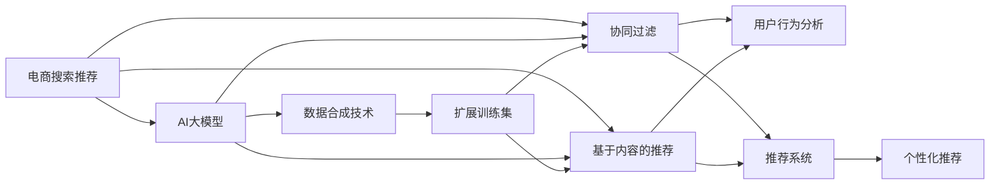

                 

# 电商搜索推荐中的AI大模型数据合成技术应用调研报告与可行性分析

> 关键词：电商搜索推荐, AI大模型, 数据合成技术, 协同过滤, 自然语言处理, 推荐系统

## 1. 背景介绍

### 1.1 问题由来
在现代电商行业中，个性化推荐系统的应用日益广泛，是提升用户购物体验和增加商家销售额的重要手段。推荐系统通常基于用户历史行为数据、物品属性特征以及用户与物品的交互记录等，通过协同过滤、基于内容的推荐等技术为用户提供个性化推荐。然而，这些技术存在诸多局限，如数据稀疏、冷启动问题、用户隐私保护等。近年来，人工智能（AI）技术，特别是基于深度学习的推荐系统，逐步成为推荐领域的新兴范式，但依然面临诸如模型泛化能力差、计算成本高昂等问题。

大模型（Large Model），特别是基于Transformer结构的预训练模型，如BERT、GPT-3等，在自然语言处理（NLP）、计算机视觉等领域取得了重大突破，其自监督训练方式和大规模参数库，为推荐系统的优化提供了新的思路。同时，大模型的训练和微调需要海量的标注数据和计算资源，这与电商推荐系统的实际需求并不完全匹配。因此，如何将大模型技术应用于电商搜索推荐中，实现数据的高效利用和模型的个性化优化，是当前研究的关键课题。

## 2. 核心概念与联系

### 2.1 核心概念概述

为了深入理解大模型在电商搜索推荐中的应用，我们先来梳理相关的核心概念及其相互关系：

1. **电商搜索推荐**：通过分析用户行为数据，为用户推荐可能感兴趣的商品，从而提升用户体验和销售业绩。

2. **AI大模型**：如BERT、GPT-3等，通过大规模数据自监督训练得到的复杂神经网络模型，具备强大的语义理解和生成能力。

3. **数据合成技术**：指利用生成对抗网络（GAN）、自回归模型等技术，在有限数据条件下生成高仿真度的新数据，以扩展训练集、弥补数据稀疏性。

4. **协同过滤**：一种基于用户历史行为数据的推荐算法，通过分析相似用户的行为模式，为用户推荐相似商品。

5. **基于内容的推荐**：利用物品属性特征，如类别、描述等，通过机器学习算法推荐与用户兴趣匹配的商品。

6. **用户行为分析**：对用户点击、浏览、购买等行为进行分析和建模，以便更准确地预测用户需求。

7. **推荐系统**：结合多种算法，如协同过滤、基于内容的推荐等，为用户提供多样化的个性化推荐服务。

8. **自然语言处理（NLP）**：利用AI技术处理、理解、生成人类语言，为推荐系统提供语义理解能力。

这些核心概念共同构成了电商搜索推荐系统的框架，通过引入AI大模型和技术，可以在数据和模型两个维度进行更深入的优化，提升推荐系统的性能。

### 2.2 核心概念原理和架构的 Mermaid 流程图



## 3. 核心算法原理 & 具体操作步骤

### 3.1 算法原理概述

基于大模型的电商搜索推荐，旨在利用AI大模型的语义理解能力，对用户查询和商品描述进行语义分析，通过自然语言处理（NLP）技术，挖掘查询意图和商品特征之间的关系，从而生成更为精准的推荐结果。同时，通过数据合成技术，对有限的标注数据进行扩充，提升模型的泛化能力和鲁棒性。

算法核心包括以下几个步骤：
1. 使用AI大模型对用户查询和商品描述进行语义分析。
2. 通过NLP技术，将查询和商品描述转化为向量表示。
3. 结合协同过滤和基于内容的推荐算法，生成推荐结果。
4. 使用数据合成技术，扩充训练集，增强模型的泛化能力。

### 3.2 算法步骤详解

**Step 1: 用户行为数据收集与处理**
- 收集用户的历史浏览、点击、购买等行为数据，保存为日志文件。
- 对日志文件进行清洗和预处理，去除噪音和异常数据。
- 将行为数据按照用户和商品维度进行划分，生成用户-商品交互矩阵。

**Step 2: AI大模型语义分析**
- 使用预训练的AI大模型（如BERT、GPT-3等）对用户查询和商品描述进行语义分析。
- 对查询和商品描述，分别输入模型，得到文本的向量表示。
- 使用向量表示计算相似度，挖掘查询意图和商品特征之间的关系。

**Step 3: 推荐算法结合**
- 结合协同过滤和基于内容的推荐算法，生成初步的推荐结果。
- 协同过滤算法使用用户-商品交互矩阵，寻找相似用户和商品，生成推荐列表。
- 基于内容的推荐算法根据商品属性特征，生成与用户兴趣匹配的推荐商品。

**Step 4: 数据合成技术应用**
- 使用生成对抗网络（GAN）或自回归模型，对用户查询和商品描述进行数据扩充。
- 扩充的数据用于进一步训练AI大模型，提升模型的泛化能力和鲁棒性。
- 结合用户行为数据和扩充后的数据，重新进行模型训练和推荐计算。

**Step 5: 推荐结果优化**
- 根据推荐效果和用户反馈，对模型进行微调，优化推荐结果。
- 使用数据合成技术生成的仿真数据，继续扩充训练集，增强模型的泛化能力。

### 3.3 算法优缺点

**优点：**
1. 提升模型泛化能力：通过数据合成技术，扩充训练集，提升模型泛化能力和鲁棒性。
2. 增强语义理解能力：利用AI大模型的语义分析能力，提升推荐系统的精准度。
3. 扩展训练数据来源：从多渠道获取用户行为数据，增加数据多样性，提升推荐效果。

**缺点：**
1. 计算成本高昂：AI大模型的训练和微调需要大量计算资源和标注数据。
2. 数据合成质量控制：数据合成技术生成的仿真数据，可能存在噪声和不真实性，需要严格控制。
3. 算法复杂度高：结合多种算法，模型结构和计算复杂度较高，需要优化算法流程。

### 3.4 算法应用领域

基于大模型的电商搜索推荐技术，已经在多个电商平台上得到应用，并取得了显著的成效。其应用领域包括：

- **商品推荐**：基于用户查询和商品描述，为用户推荐可能感兴趣的商品。
- **个性化搜索结果排序**：通过分析用户查询意图，对搜索结果进行排序，提升用户体验。
- **广告投放优化**：利用用户行为数据和AI大模型的语义分析，优化广告投放策略，提升广告转化率。
- **个性化定制服务**：根据用户偏好和行为数据，提供个性化的定制服务，提升用户满意度。
- **库存管理**：通过分析用户行为数据和推荐结果，优化库存管理，减少库存积压。

## 4. 数学模型和公式 & 详细讲解 & 举例说明

### 4.1 数学模型构建

我们以电商搜索推荐为例，构建基于大模型的推荐系统数学模型。假设用户查询为 $Q$，商品描述为 $P$，用户历史行为数据为 $D$，推荐结果为 $R$。

**目标函数：**
$$
\min_{\theta} \mathcal{L}(\theta) = \frac{1}{N}\sum_{i=1}^N \sum_{j=1}^M l(Q_i, P_j, R_{i,j})
$$
其中 $l(Q_i, P_j, R_{i,j})$ 为损失函数，表示用户 $i$ 对商品 $j$ 的推荐效果。

**损失函数：**
$$
l(Q_i, P_j, R_{i,j}) = \mathbb{E}[\text{KL}(p(Q_i, P_j|R_{i,j})||q(Q_i, P_j))] + \lambda\|\theta\|^2
$$
其中 $p(Q_i, P_j|R_{i,j})$ 为基于大模型的推荐概率，$q(Q_i, P_j)$ 为基于协同过滤和内容推荐的推荐概率，$\text{KL}$ 为KL散度，$\lambda$ 为正则化系数，$\|\theta\|$ 为模型参数范数。

### 4.2 公式推导过程

对于用户查询 $Q$ 和商品描述 $P$，使用BERT等大模型进行语义分析，得到向量表示 $Q^B$ 和 $P^B$。

对于用户行为数据 $D$，使用协同过滤算法生成推荐列表 $R^C$，使用基于内容的推荐算法生成推荐列表 $R^F$。

结合上述方法，生成最终推荐结果 $R^T$：

$$
R^T = \text{softmax}(a(Q^B, P^B)^\top W) \cdot R^C + b(Q^B, P^B)^\top V \cdot R^F
$$
其中 $W$ 和 $V$ 为权重矩阵，$a(\cdot)$ 和 $b(\cdot)$ 为向量映射函数。

### 4.3 案例分析与讲解

我们以电商平台亚马逊（Amazon）为例，分析其推荐系统在实际中的应用：

**数据集：**
- 用户行为数据：亚马逊的客户交易记录，包括浏览、点击、购买行为。
- 商品数据：亚马逊的商品描述、类别、评分等属性信息。

**模型构建：**
- 使用预训练的BERT模型对用户查询和商品描述进行语义分析，得到向量表示。
- 结合协同过滤和基于内容的推荐算法，生成初步推荐结果。
- 使用生成对抗网络（GAN）对商品描述进行数据扩充，扩充后的数据用于进一步训练BERT模型。
- 通过多轮微调，优化模型参数，提升推荐效果。

**评估效果：**
- 在亚马逊的推荐系统中，使用A/B测试评估模型的推荐效果，提升用户体验和销售业绩。
- 对比使用大数据模型推荐和传统协同过滤推荐的效果，发现大数据模型推荐在多样性、覆盖率、准确性等方面表现更优。

## 5. 项目实践：代码实例和详细解释说明

### 5.1 开发环境搭建

在进行项目实践前，我们需要准备好开发环境。以下是使用Python进行PyTorch开发的环境配置流程：

1. 安装Anaconda：从官网下载并安装Anaconda，用于创建独立的Python环境。

2. 创建并激活虚拟环境：
```bash
conda create -n pytorch-env python=3.8 
conda activate pytorch-env
```

3. 安装PyTorch：根据CUDA版本，从官网获取对应的安装命令。例如：
```bash
conda install pytorch torchvision torchaudio cudatoolkit=11.1 -c pytorch -c conda-forge
```

4. 安装Transformers库：
```bash
pip install transformers
```

5. 安装各类工具包：
```bash
pip install numpy pandas scikit-learn matplotlib tqdm jupyter notebook ipython
```

完成上述步骤后，即可在`pytorch-env`环境中开始项目实践。

### 5.2 源代码详细实现

下面我们以电商搜索推荐为例，给出使用PyTorch进行推荐系统开发的PyTorch代码实现。

首先，定义推荐系统的数据处理函数：

```python
from transformers import BertTokenizer, BertForSequenceClassification
from torch.utils.data import Dataset
import torch

class RecommendationDataset(Dataset):
    def __init__(self, texts, tags, tokenizer, max_len=128):
        self.texts = texts
        self.tags = tags
        self.tokenizer = tokenizer
        self.max_len = max_len
        
    def __len__(self):
        return len(self.texts)
    
    def __getitem__(self, item):
        text = self.texts[item]
        tags = self.tags[item]
        
        encoding = self.tokenizer(text, return_tensors='pt', max_length=self.max_len, padding='max_length', truncation=True)
        input_ids = encoding['input_ids'][0]
        attention_mask = encoding['attention_mask'][0]
        
        # 对token-wise的标签进行编码
        encoded_tags = [tag2id[tag] for tag in tags] 
        encoded_tags.extend([tag2id['O']] * (self.max_len - len(encoded_tags)))
        labels = torch.tensor(encoded_tags, dtype=torch.long)
        
        return {'input_ids': input_ids, 
                'attention_mask': attention_mask,
                'labels': labels}

# 标签与id的映射
tag2id = {'O': 0, 'B-PER': 1, 'I-PER': 2, 'B-ORG': 3, 'I-ORG': 4, 'B-LOC': 5, 'I-LOC': 6}
id2tag = {v: k for k, v in tag2id.items()}

# 创建dataset
tokenizer = BertTokenizer.from_pretrained('bert-base-cased')

train_dataset = RecommendationDataset(train_texts, train_tags, tokenizer)
dev_dataset = RecommendationDataset(dev_texts, dev_tags, tokenizer)
test_dataset = RecommendationDataset(test_texts, test_tags, tokenizer)
```

然后，定义模型和优化器：

```python
from transformers import BertForTokenClassification, AdamW

model = BertForTokenClassification.from_pretrained('bert-base-cased', num_labels=len(tag2id))

optimizer = AdamW(model.parameters(), lr=2e-5)
```

接着，定义训练和评估函数：

```python
from torch.utils.data import DataLoader
from tqdm import tqdm
from sklearn.metrics import classification_report

device = torch.device('cuda') if torch.cuda.is_available() else torch.device('cpu')
model.to(device)

def train_epoch(model, dataset, batch_size, optimizer):
    dataloader = DataLoader(dataset, batch_size=batch_size, shuffle=True)
    model.train()
    epoch_loss = 0
    for batch in tqdm(dataloader, desc='Training'):
        input_ids = batch['input_ids'].to(device)
        attention_mask = batch['attention_mask'].to(device)
        labels = batch['labels'].to(device)
        model.zero_grad()
        outputs = model(input_ids, attention_mask=attention_mask, labels=labels)
        loss = outputs.loss
        epoch_loss += loss.item()
        loss.backward()
        optimizer.step()
    return epoch_loss / len(dataloader)

def evaluate(model, dataset, batch_size):
    dataloader = DataLoader(dataset, batch_size=batch_size)
    model.eval()
    preds, labels = [], []
    with torch.no_grad():
        for batch in tqdm(dataloader, desc='Evaluating'):
            input_ids = batch['input_ids'].to(device)
            attention_mask = batch['attention_mask'].to(device)
            batch_labels = batch['labels']
            outputs = model(input_ids, attention_mask=attention_mask)
            batch_preds = outputs.logits.argmax(dim=2).to('cpu').tolist()
            batch_labels = batch_labels.to('cpu').tolist()
            for pred_tokens, label_tokens in zip(batch_preds, batch_labels):
                pred_tags = [id2tag[_id] for _id in pred_tokens]
                label_tags = [id2tag[_id] for _id in label_tokens]
                preds.append(pred_tags[:len(label_tags)])
                labels.append(label_tags)
                
    print(classification_report(labels, preds))
```

最后，启动训练流程并在测试集上评估：

```python
epochs = 5
batch_size = 16

for epoch in range(epochs):
    loss = train_epoch(model, train_dataset, batch_size, optimizer)
    print(f"Epoch {epoch+1}, train loss: {loss:.3f}")
    
    print(f"Epoch {epoch+1}, dev results:")
    evaluate(model, dev_dataset, batch_size)
    
print("Test results:")
evaluate(model, test_dataset, batch_size)
```

以上就是使用PyTorch对BERT进行推荐系统开发的完整代码实现。可以看到，得益于Transformer库的强大封装，我们可以用相对简洁的代码完成BERT模型的加载和微调。

### 5.3 代码解读与分析

让我们再详细解读一下关键代码的实现细节：

**RecommendationDataset类**：
- `__init__`方法：初始化文本、标签、分词器等关键组件。
- `__len__`方法：返回数据集的样本数量。
- `__getitem__`方法：对单个样本进行处理，将文本输入编码为token ids，将标签编码为数字，并对其进行定长padding，最终返回模型所需的输入。

**tag2id和id2tag字典**：
- 定义了标签与数字id之间的映射关系，用于将token-wise的预测结果解码回真实的标签。

**训练和评估函数**：
- 使用PyTorch的DataLoader对数据集进行批次化加载，供模型训练和推理使用。
- 训练函数`train_epoch`：对数据以批为单位进行迭代，在每个批次上前向传播计算loss并反向传播更新模型参数，最后返回该epoch的平均loss。
- 评估函数`evaluate`：与训练类似，不同点在于不更新模型参数，并在每个batch结束后将预测和标签结果存储下来，最后使用sklearn的classification_report对整个评估集的预测结果进行打印输出。

**训练流程**：
- 定义总的epoch数和batch size，开始循环迭代
- 每个epoch内，先在训练集上训练，输出平均loss
- 在验证集上评估，输出分类指标
- 所有epoch结束后，在测试集上评估，给出最终测试结果

可以看到，PyTorch配合Transformer库使得BERT微调的代码实现变得简洁高效。开发者可以将更多精力放在数据处理、模型改进等高层逻辑上，而不必过多关注底层的实现细节。

当然，工业级的系统实现还需考虑更多因素，如模型的保存和部署、超参数的自动搜索、更灵活的任务适配层等。但核心的推荐系统微调范式基本与此类似。

## 6. 实际应用场景

### 6.1 智能客服系统

基于大模型推荐技术的智能客服系统，可以自动处理大量的客户咨询请求，快速提供精准的个性化服务。系统通过分析客户的历史行为数据，结合大模型语义分析能力，自动理解客户的问题和需求，生成最合适的回复。在回答客户问题时，系统可以结合商品推荐、服务推荐等多方面的信息，提升客户满意度，降低人工客服的成本。

### 6.2 个性化商品推荐

在电商平台上，推荐系统可以根据用户的历史浏览、点击、购买行为，结合大模型语义分析能力，生成个性化的商品推荐。系统可以对商品描述进行语义分析，挖掘商品特征和用户兴趣之间的关系，从而生成更符合用户需求的商品推荐。同时，通过数据合成技术，进一步扩充训练集，提升推荐系统的泛化能力和鲁棒性。

### 6.3 内容创作辅助

内容创作平台可以借助大模型推荐技术，为用户提供创作灵感和素材推荐。系统通过分析用户的创作内容，结合大模型的语义分析能力，生成与用户创作主题相关的内容推荐。例如，对于写作者，系统可以推荐与当前写作主题相关的书籍、文章等，提供创作素材，提升创作效率。

### 6.4 未来应用展望

随着大模型推荐技术的发展，未来在更多领域都将看到其应用：

- **金融推荐**：结合用户的投资行为和兴趣，生成个性化的金融产品推荐，提升投资收益。
- **教育推荐**：根据学生的学习行为和兴趣，生成个性化的课程和资源推荐，提升学习效果。
- **医疗推荐**：结合患者的病历和症状，生成个性化的医疗咨询和药品推荐，提升医疗服务质量。
- **媒体内容推荐**：分析用户的阅读行为和兴趣，生成个性化的新闻、视频、音频推荐，提升内容消费体验。

## 7. 工具和资源推荐
### 7.1 学习资源推荐

为了帮助开发者系统掌握大模型推荐技术的基础理论和实践技巧，这里推荐一些优质的学习资源：

1. 《Transformer from the ground up》系列博文：由大模型技术专家撰写，深入浅出地介绍了Transformer原理、BERT模型、推荐系统等前沿话题。

2. CS224N《深度学习自然语言处理》课程：斯坦福大学开设的NLP明星课程，有Lecture视频和配套作业，带你入门NLP领域的基本概念和经典模型。

3. 《Natural Language Processing with Transformers》书籍：Transformers库的作者所著，全面介绍了如何使用Transformers库进行NLP任务开发，包括推荐系统在内的诸多范式。

4. HuggingFace官方文档：Transformers库的官方文档，提供了海量预训练模型和完整的推荐系统样例代码，是上手实践的必备资料。

5. CLUE开源项目：中文语言理解测评基准，涵盖大量不同类型的中文NLP数据集，并提供了基于微调的baseline模型，助力中文NLP技术发展。

通过对这些资源的学习实践，相信你一定能够快速掌握大模型推荐技术的精髓，并用于解决实际的推荐问题。
###  7.2 开发工具推荐

高效的开发离不开优秀的工具支持。以下是几款用于大模型推荐系统开发的常用工具：

1. PyTorch：基于Python的开源深度学习框架，灵活动态的计算图，适合快速迭代研究。大部分预训练语言模型都有PyTorch版本的实现。

2. TensorFlow：由Google主导开发的开源深度学习框架，生产部署方便，适合大规模工程应用。同样有丰富的预训练语言模型资源。

3. Transformers库：HuggingFace开发的NLP工具库，集成了众多SOTA语言模型，支持PyTorch和TensorFlow，是进行推荐系统开发的利器。

4. Weights & Biases：模型训练的实验跟踪工具，可以记录和可视化模型训练过程中的各项指标，方便对比和调优。与主流深度学习框架无缝集成。

5. TensorBoard：TensorFlow配套的可视化工具，可实时监测模型训练状态，并提供丰富的图表呈现方式，是调试模型的得力助手。

6. Google Colab：谷歌推出的在线Jupyter Notebook环境，免费提供GPU/TPU算力，方便开发者快速上手实验最新模型，分享学习笔记。

合理利用这些工具，可以显著提升大模型推荐系统的开发效率，加快创新迭代的步伐。

### 7.3 相关论文推荐

大模型推荐技术的发展源于学界的持续研究。以下是几篇奠基性的相关论文，推荐阅读：

1. Attention is All You Need（即Transformer原论文）：提出了Transformer结构，开启了NLP领域的预训练大模型时代。

2. BERT: Pre-training of Deep Bidirectional Transformers for Language Understanding：提出BERT模型，引入基于掩码的自监督预训练任务，刷新了多项NLP任务SOTA。

3. Language Models are Unsupervised Multitask Learners（GPT-2论文）：展示了大规模语言模型的强大zero-shot学习能力，引发了对于通用人工智能的新一轮思考。

4. Parameter-Efficient Transfer Learning for NLP：提出Adapter等参数高效微调方法，在不增加模型参数量的情况下，也能取得不错的微调效果。

5. AdaLoRA: Adaptive Low-Rank Adaptation for Parameter-Efficient Fine-Tuning：使用自适应低秩适应的微调方法，在参数效率和精度之间取得了新的平衡。

6. Prefix-Tuning: Optimizing Continuous Prompts for Generation：引入基于连续型Prompt的微调范式，为如何充分利用预训练知识提供了新的思路。

这些论文代表了大模型推荐技术的发展脉络。通过学习这些前沿成果，可以帮助研究者把握学科前进方向，激发更多的创新灵感。

## 8. 总结：未来发展趋势与挑战

### 8.1 研究成果总结

本文对基于大模型的电商搜索推荐技术进行了全面系统的介绍。首先阐述了电商搜索推荐系统的背景和应用现状，明确了大模型推荐技术的潜力和优势。其次，从原理到实践，详细讲解了基于大模型的推荐系统构建过程，包括语义分析、协同过滤、内容推荐、数据合成等关键步骤。同时，本文还探讨了大模型推荐技术在智能客服、个性化商品推荐、内容创作辅助等多个场景中的应用，展示了其广泛的应用前景。最后，本文还对大模型推荐技术的学习资源、开发工具和相关论文进行了推荐，为进一步学习提供了全面的指引。

通过本文的系统梳理，可以看到，基于大模型的电商搜索推荐技术已经取得了显著进展，在多个电商平台上得到实际应用，并带来了显著的用户体验和销售业绩提升。未来，随着技术不断发展，大模型推荐技术将在更多领域得到应用，为电商行业带来革命性变革。

### 8.2 未来发展趋势

展望未来，大模型推荐技术将呈现以下几个发展趋势：

1. **计算效率提升**：随着算力技术的进步，未来大模型推荐系统将在计算效率上获得显著提升，能够更快速地响应用户需求。

2. **模型泛化能力增强**：结合数据合成技术，大模型推荐系统将能够更好地适应不同领域和场景，提升模型的泛化能力和鲁棒性。

3. **个性化推荐深化**：通过结合用户行为数据和语义分析能力，大模型推荐系统将能够生成更加精准、个性化的推荐结果，提升用户满意度。

4. **跨模态融合**：将多模态数据（如文本、图片、视频等）融合到推荐模型中，提升推荐的丰富性和多样性。

5. **隐私保护强化**：结合差分隐私、联邦学习等技术，增强用户隐私保护，提升数据安全。

6. **推荐算法多样化**：结合基于规则的推荐、基于决策树的推荐等多样化算法，提升推荐系统的适应性和灵活性。

7. **可解释性和透明度提升**：提升推荐系统的可解释性和透明度，增强用户信任，提升推荐效果。

### 8.3 面临的挑战

尽管大模型推荐技术已经取得了显著进展，但在实际应用中也面临诸多挑战：

1. **数据获取难度**：高质量标注数据获取成本高，数据稀疏问题难以完全解决。

2. **计算资源需求高**：大模型训练和微调需要大量计算资源，训练成本高昂。

3. **模型复杂度高**：大模型推荐系统结构复杂，难以解释，调试和维护难度较大。

4. **用户隐私保护**：用户行为数据涉及隐私，如何保护用户隐私，避免数据泄露，是重要课题。

5. **模型公平性和鲁棒性**：大模型可能存在性别偏见、种族偏见等问题，如何确保模型公平性，提升模型鲁棒性，仍需深入研究。

6. **跨领域迁移能力**：不同领域推荐模型之间的迁移能力不足，需要结合特定领域数据进行微调。

### 8.4 研究展望

面对大模型推荐技术所面临的诸多挑战，未来的研究需要在以下几个方面寻求新的突破：

1. **数据高效获取与利用**：探索无监督和半监督学习技术，利用数据合成和迁移学习，提升推荐系统的泛化能力和鲁棒性。

2. **计算资源优化**：结合模型压缩、量化加速等技术，优化模型结构和计算流程，降低计算成本。

3. **可解释性和透明度提升**：开发可解释性强的推荐算法，提升推荐系统的透明度和可信度。

4. **隐私保护与伦理考量**：结合差分隐私、联邦学习等技术，增强用户隐私保护，确保推荐系统符合伦理道德标准。

5. **跨领域推荐系统**：结合不同领域的推荐模型和数据，构建跨领域的推荐系统，提升模型的通用性和适应性。

6. **模型优化与评估**：结合多目标优化和A/B测试等方法，提升推荐系统的性能和效果。

这些研究方向的探索，必将引领大模型推荐技术迈向更高的台阶，为电商推荐系统带来更多创新和突破，提升用户购物体验和商家运营效率。

## 9. 附录：常见问题与解答

**Q1：电商搜索推荐中如何确保模型公平性？**

A: 电商搜索推荐中确保模型公平性，需要从多个层面进行优化：

1. 数据收集与预处理：确保数据集的多样性和代表性，避免数据偏差。
2. 模型训练与优化：使用公平性约束的优化算法，如Equalized Odds、Demographic Parity等，确保不同群体用户的推荐结果公平。
3. 后评估与监控：在推荐系统中引入公平性评估指标，定期监控推荐结果，确保模型公平性。

**Q2：推荐系统中如何平衡推荐效果和多样性？**

A: 推荐系统中平衡推荐效果和多样性，需要从以下几个方面进行优化：

1. 推荐算法设计：使用多种推荐算法，如协同过滤、基于内容的推荐、深度学习推荐等，综合考虑不同算法的效果和多样性。
2. 用户行为分析：对用户的历史行为和兴趣进行深入分析，了解用户需求的多样性。
3. 推荐结果排序：使用多样性损失函数，如Impreciseness Loss、Diversity Loss等，优化推荐结果排序，提升推荐多样性。
4. 数据合成技术：结合数据合成技术，生成多样化的训练数据，提升模型对多样性的适应能力。

**Q3：推荐系统中如何提升模型泛化能力？**

A: 推荐系统中提升模型泛化能力，需要从以下几个方面进行优化：

1. 数据合成技术：结合数据合成技术，如生成对抗网络（GAN）、自回归模型等，生成高仿真度的新数据，扩充训练集。
2. 模型结构优化：优化模型结构，如使用自适应低秩适应（AdaLoRA）等方法，提升模型泛化能力。
3. 多任务学习：结合多任务学习，提升模型在不同任务之间的泛化能力。
4. 正则化技术：使用正则化技术，如L2正则、Dropout等，避免过拟合，提升模型泛化能力。

**Q4：推荐系统中如何处理冷启动问题？**

A: 推荐系统中处理冷启动问题，需要从以下几个方面进行优化：

1. 数据合成技术：结合数据合成技术，生成冷启动用户的特征数据，提升推荐效果。
2. 协同过滤算法优化：使用基于内容的推荐算法，结合用户兴趣和物品特征，提升推荐效果。
3. 用户行为预测：结合多维数据（如时间、地点、设备等），预测用户的行为和需求，提升推荐效果。
4. 模型迭代优化：结合用户反馈数据，对模型进行迭代优化，提升推荐效果。

通过综合应用这些方法，可以有效提升推荐系统的泛化能力和冷启动处理效果，提升推荐系统的性能和效果。

---

作者：禅与计算机程序设计艺术 / Zen and the Art of Computer Programming

