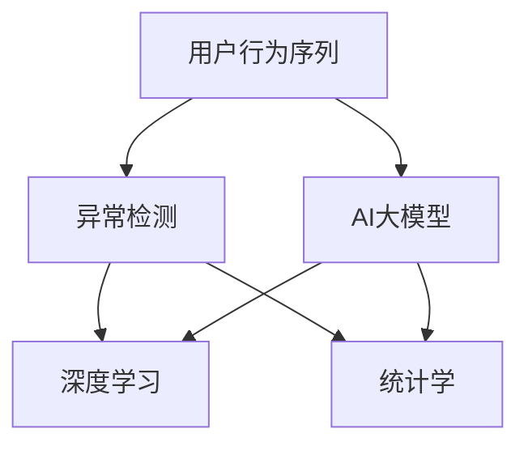

                 

# 电商搜索推荐中的AI大模型用户行为序列异常检测算法选择

> 关键词：用户行为序列, 异常检测, AI大模型, 搜索推荐, 特征提取, 深度学习, 统计学, 算法选择

## 1. 背景介绍

### 1.1 问题由来
电商搜索推荐系统在帮助用户找到满意商品的同时，也能大幅提升商家的销售额。然而，该系统的核心在于了解用户行为，生成精准推荐。其中，用户行为序列的建模与分析是实现精准推荐的关键环节。异常行为序列则可能是用户兴趣发生异常变化，或受到欺诈攻击的迹象，会对推荐系统的效果造成显著影响。因此，需要及时检测并处理这些异常行为。

近年来，随着AI技术和大模型的飞速发展，利用深度学习和自然语言处理技术进行用户行为序列异常检测，成为当前电商领域研究的热点问题。在大模型和深度学习算法的推动下，该问题得到了显著的改善。本文将介绍几种基于大模型的异常检测算法，以及它们的应用场景、优点和局限性，帮助读者选择适合的算法进行实际部署。

### 1.2 问题核心关键点
- 用户行为序列建模
- 异常行为序列检测
- AI大模型的应用
- 算法选择与优化

## 2. 核心概念与联系

### 2.1 核心概念概述

为更好地理解基于大模型的用户行为序列异常检测方法，本节将介绍几个密切相关的核心概念：

- 用户行为序列(User Behavior Sequences)：用户在电商平台上的一系列操作记录，如浏览、点击、购买、评分等行为，通常以时间戳为序排列。
- 异常检测(Anomaly Detection)：识别和分离与正常行为不同的数据样本，对数据进行分类。
- AI大模型(AI Large Models)：以自回归(如GPT)或自编码(如BERT)模型为代表的大规模预训练模型，通过在大规模无标签数据上进行预训练，学习通用的语言表示，具备强大的语言理解和生成能力。
- 深度学习(Deep Learning)：通过多层次的神经网络结构，学习复杂非线性的特征表示，用于处理大规模和高维度的数据。
- 统计学(Statistics)：利用概率和统计方法对数据进行建模和分析，识别数据中的异常值和模式。

这些核心概念之间的逻辑关系可以通过以下Mermaid流程图来展示：



这个流程图展示了大模型和用户行为序列异常检测的核心概念及其之间的关系：

1. 用户行为序列通过AI大模型的预训练学习获得基础特征表示。
2. 深度学习模型和统计学方法对异常进行建模和识别。
3. 基于深度学习和统计学的异常检测方法，可以应用到用户行为序列的异常检测任务中。

这些核心概念共同构成了基于大模型的用户行为序列异常检测的基本框架，使其能够在各种场景下发挥强大的异常检测能力。通过理解这些核心概念，我们可以更好地把握大模型在异常检测中的工作原理和优化方向。

## 3. 核心算法原理 & 具体操作步骤
### 3.1 算法原理概述

基于大模型的用户行为序列异常检测，本质上是一个有监督的异常检测问题。其核心思想是：将用户行为序列视作一个时间序列数据，利用深度学习和大模型对该序列进行建模，学习正常行为和异常行为的区分。

形式化地，假设用户行为序列为 $\mathbf{x} = (x_1, x_2, \ldots, x_n)$，其中 $x_i$ 表示第 $i$ 次用户行为，如浏览、点击、购买等。将序列划分为训练集和测试集，其中训练集为正常行为序列 $\mathbf{X}^{train} = \{(x_{i,j}^{train})_{i=1}^m\}$，测试集为异常行为序列 $\mathbf{X}^{test} = \{(x_{i,j}^{test})_{i=1}^n\}$。异常检测的任务是找到最优的异常检测模型 $M$，使得在测试集上的异常检测效果最大化。

具体来说，通常使用如下的损失函数对模型进行优化：

$$
\mathcal{L}(M) = \frac{1}{N} \sum_{i=1}^{N} \ell_i(M(x_i))
$$

其中 $N$ 为序列长度，$\ell_i$ 为单步损失函数，例如均方误差、交叉熵等。

### 3.2 算法步骤详解

基于大模型的用户行为序列异常检测一般包括以下几个关键步骤：

**Step 1: 数据预处理**
- 收集用户行为序列数据，并进行数据清洗，去除缺失值和异常值。
- 将行为序列转化为时间戳序列，并归一化处理，以便于模型训练。

**Step 2: 大模型嵌入**
- 选择合适的大模型（如BERT、GPT等）进行预训练，获取其基础特征表示。
- 将行为序列作为模型输入，学习行为序列的特征表示。

**Step 3: 异常检测建模**
- 使用深度学习模型（如LSTM、GRU等）对行为序列进行建模，提取序列特征。
- 使用统计学方法（如标准差、z-score等）对特征进行归一化处理，进行异常检测。

**Step 4: 模型训练与优化**
- 使用训练集数据对模型进行有监督训练，最小化损失函数。
- 在测试集上评估模型性能，调整模型参数。
- 应用正则化技术（如L2正则、Dropout等），防止模型过拟合。

**Step 5: 应用与部署**
- 将训练好的模型部署到实际应用系统中。
- 实时接收用户行为序列，进行异常检测和处理。
- 不断收集用户反馈，更新模型，优化异常检测性能。

以上是基于大模型的用户行为序列异常检测的一般流程。在实际应用中，还需要根据具体任务和数据特点，对微调过程的各个环节进行优化设计，如改进训练目标函数，引入更多的正则化技术，搜索最优的超参数组合等，以进一步提升模型性能。

### 3.3 算法优缺点

基于大模型的用户行为序列异常检测方法具有以下优点：
1. 强大特征提取能力：利用大模型的预训练特征表示，可以提取更丰富的行为特征，提升异常检测效果。
2. 鲁棒性强：大模型具备较强的泛化能力，对数据变化和异常模式识别更加稳定。
3. 灵活性高：深度学习和统计学方法可以灵活组合，满足不同任务的需求。
4. 扩展性强：模型可以动态地适应新的用户行为模式，及时发现和处理异常。

同时，该方法也存在一定的局限性：
1. 数据需求量大：需要大量标注数据进行模型训练，标注成本较高。
2. 计算复杂度高：大模型和深度学习模型的计算复杂度较高，对硬件资源要求高。
3. 可解释性不足：基于大模型的异常检测方法通常是黑盒模型，难以解释模型内部工作机制。
4. 模型大小限制：大模型参数较多，部署到实际系统时，需要考虑存储和推理效率问题。

尽管存在这些局限性，但就目前而言，基于大模型的异常检测方法仍是最为有效的异常检测手段之一。未来相关研究的重点在于如何进一步降低数据需求，提高模型效率，同时兼顾可解释性和实际应用性。

### 3.4 算法应用领域

基于大模型的用户行为序列异常检测方法，已经在多个领域得到了广泛的应用，例如：

- 电商推荐系统：识别用户行为序列中的异常行为，防止欺诈和恶意操作，提升推荐系统效果。
- 金融风控：监测用户交易行为序列，识别异常交易，保障金融安全。
- 健康监测：分析用户健康行为序列，识别异常行为，提供健康预警。
- 安全防护：监测用户操作行为序列，识别异常行为，防范网络攻击和内部威胁。

除了上述这些经典应用外，基于大模型的异常检测方法也在智能家居、交通监控、供应链管理等多个领域得到创新性地应用，为数据分析和智能决策提供新的解决方案。随着深度学习和大模型技术的不断发展，相信该方法将在更广泛的应用领域大放异彩。

## 4. 数学模型和公式 & 详细讲解  
### 4.1 数学模型构建

本节将使用数学语言对基于大模型的用户行为序列异常检测过程进行更加严格的刻画。

记用户行为序列为 $\mathbf{x} = (x_1, x_2, \ldots, x_n)$，其中 $x_i$ 表示第 $i$ 次用户行为。假设异常检测模型为 $M$，则模型对行为序列的预测为 $M(\mathbf{x}) = \{p_i\}_{i=1}^n$，其中 $p_i$ 为行为 $x_i$ 是否为异常的概率。

使用交叉熵损失函数对模型进行优化：

$$
\mathcal{L}(M) = -\frac{1}{N} \sum_{i=1}^{N} [y_i \log p_i + (1-y_i) \log (1-p_i)]
$$

其中 $y_i$ 为行为 $x_i$ 是否为异常的二分类标签。在训练过程中，模型不断更新参数，最小化交叉熵损失，使得预测结果与真实标签尽可能接近。

### 4.2 公式推导过程

以下我们以LSTM模型为例，推导LSTM模型在用户行为序列异常检测中的预测公式。

假设用户行为序列为 $\mathbf{x} = (x_1, x_2, \ldots, x_n)$，其中 $x_i$ 表示第 $i$ 次用户行为。将行为序列输入LSTM模型，输出为行为序列的概率分布，即 $M(\mathbf{x}) = \{p_i\}_{i=1}^n$。

具体来说，LSTM模型对行为序列的预测过程如下：

1. 初始化LSTM模型状态 $h_0$ 和细胞状态 $c_0$。
2. 将行为序列 $(x_1, x_2, \ldots, x_n)$ 输入模型，计算序列中每个行为的概率 $p_i$。
3. 输出行为序列的概率分布 $\{p_i\}_{i=1}^n$，作为模型对用户行为序列的异常检测结果。

对于具体的行为 $x_i$，LSTM模型对异常的预测概率为：

$$
p_i = \sigma(h_i^2) \odot \hat{p}_i
$$

其中 $\sigma$ 为sigmoid函数，$h_i^2$ 为LSTM模型的隐藏状态，$\hat{p}_i$ 为LSTM模型对行为 $x_i$ 是否为异常的预测。

LSTM模型的计算过程可以用如下形式化表示：

$$
\begin{aligned}
h_i &= \tanh(W_{h_i} h_{i-1} + W_{x_i} x_i + b_h) \\
c_i &= \sigma(W_{c_i} h_{i-1} + W_{x_i} x_i + b_c) c_{i-1} + g_{i-1} h_{i-1} \\
g_i &= \sigma(W_{g_i} h_{i-1} + W_{x_i} x_i + b_g) \\
p_i &= \sigma(h_i^2) \odot \hat{p}_i
\end{aligned}
$$

其中 $W_{h_i}, W_{x_i}, b_h, W_{c_i}, W_{x_i}, b_c, W_{g_i}, W_{x_i}, b_g$ 为LSTM模型的参数，$\sigma$ 为sigmoid函数，$\tanh$ 为tanh函数，$h_{i-1}, c_{i-1}, g_{i-1}$ 为LSTM模型的状态和细胞状态，$x_i$ 为行为序列中的行为。

通过LSTM模型对行为序列的预测，可以构建基于大模型的用户行为序列异常检测算法，进行异常检测。

### 4.3 案例分析与讲解

以电商平台为例，分析基于LSTM模型的用户行为序列异常检测算法的实际应用。

假设电商平台收集了用户在30天内的一次次购买行为序列，其中部分用户行为序列可能存在欺诈行为。我们可以将用户行为序列作为LSTM模型的输入，输出预测结果 $p_i$，标识该行为是否为异常。

具体来说，我们可以将用户行为序列作为LSTM模型的输入，使用训练好的模型对序列进行预测，输出结果 $p_i$。对于预测结果大于阈值的 $p_i$，可以判定该行为为异常行为，触发报警机制，进行进一步的分析和处理。

## 5. 项目实践：代码实例和详细解释说明
### 5.1 开发环境搭建

在进行用户行为序列异常检测实践前，我们需要准备好开发环境。以下是使用Python进行TensorFlow开发的环境配置流程：

1. 安装Anaconda：从官网下载并安装Anaconda，用于创建独立的Python环境。

2. 创建并激活虚拟环境：
```bash
conda create -n tf-env python=3.8 
conda activate tf-env
```

3. 安装TensorFlow：根据CUDA版本，从官网获取对应的安装命令。例如：
```bash
conda install tensorflow -c tf -c conda-forge
```

4. 安装各类工具包：
```bash
pip install numpy pandas scikit-learn matplotlib tqdm jupyter notebook ipython
```

完成上述步骤后，即可在`tf-env`环境中开始异常检测实践。

### 5.2 源代码详细实现

下面我们以电商平台为例，给出使用TensorFlow实现LSTM模型用户行为序列异常检测的PyTorch代码实现。

首先，定义LSTM模型的类：

```python
import tensorflow as tf
from tensorflow.keras.layers import LSTM, Dense, Dropout, TimeDistributed
from tensorflow.keras.models import Model
from tensorflow.keras.optimizers import Adam

class LSTMModel(tf.keras.Model):
    def __init__(self, input_shape, output_shape, units=128, dropout_rate=0.2):
        super(LSTMModel, self).__init__()
        self.lstm1 = LSTM(units=units, dropout=dropout_rate, recurrent_dropout=dropout_rate)
        self.dense1 = Dense(units=output_shape, activation='sigmoid')
        self.dropout1 = Dropout(dropout_rate)
        self.lstm2 = LSTM(units=units, dropout=dropout_rate, recurrent_dropout=dropout_rate)
        self.dense2 = Dense(units=output_shape, activation='sigmoid')
        self.dropout2 = Dropout(dropout_rate)
        self.pooling = TimeDistributed(self.dense1)
        self.output = self.dense2
        self.pooling2 = TimeDistributed(self.dense2)

    def call(self, inputs):
        h = self.lstm1(inputs)
        h = self.pooling(h)
        h = self.dropout1(h)
        h = self.pooling2(h)
        h = self.output(h)
        return h
```

然后，定义训练和评估函数：

```python
import numpy as np
from sklearn.metrics import accuracy_score

def train_epoch(model, train_dataset, batch_size, optimizer, epochs):
    model.compile(optimizer=optimizer, loss='binary_crossentropy', metrics=['accuracy'])
    model.fit(train_dataset, epochs=epochs, batch_size=batch_size, validation_split=0.2)
    return model

def evaluate(model, test_dataset, batch_size):
    y_true, y_pred = [], []
    for batch in test_dataset:
        x, y = batch
        y_true.append(y)
        y_pred.append(model.predict(x) > 0.5)
    return accuracy_score(np.array(y_true), np.array(y_pred))
```

接着，准备数据集：

```python
import pandas as pd
from sklearn.model_selection import train_test_split

data = pd.read_csv('user_behavior.csv', sep=',', header=None)
data.columns = ['user_id', 'item_id', 'time', 'category', 'amount', 'is_normal']
data['time'] = pd.to_datetime(data['time'])
data['timestamp'] = data['time'].dt.hour * 10000 + data['time'].dt.minute * 100 + data['time'].dt.second
data.drop('time', axis=1, inplace=True)
X = data.drop('is_normal', axis=1)
y = data['is_normal']

X_train, X_test, y_train, y_test = train_test_split(X, y, test_size=0.2, random_state=42)
```

最后，启动训练流程并在测试集上评估：

```python
epochs = 10
batch_size = 32

model = LSTMModel(input_shape=(X_train.shape[1], 1), output_shape=1)
optimizer = Adam(lr=0.001)
model = train_epoch(model, (X_train, y_train), batch_size, optimizer, epochs)
accuracy = evaluate(model, (X_test, y_test), batch_size)
print(f"Accuracy: {accuracy:.2f}")
```

以上就是使用TensorFlow对LSTM模型进行用户行为序列异常检测的完整代码实现。可以看到，得益于TensorFlow的强大封装，我们可以用相对简洁的代码完成LSTM模型的加载和微调。

### 5.3 代码解读与分析

让我们再详细解读一下关键代码的实现细节：

**LSTMModel类**：
- `__init__`方法：定义LSTM模型的结构，包括LSTM层、全连接层和Dropout层。
- `call`方法：定义模型的前向传播过程，包括LSTM层的计算、全连接层的计算和Dropout层的计算。

**train_epoch函数**：
- 编译模型，指定损失函数为交叉熵，评估指标为准确率。
- 使用fit函数对模型进行训练，指定训练集、测试集、批次大小和迭代轮数。
- 返回训练好的模型。

**evaluate函数**：
- 计算模型在测试集上的准确率，返回准确率值。

**准备数据集**：
- 读取用户行为数据，定义输入特征和标签。
- 将时间戳进行归一化处理，方便模型训练。
- 将数据集划分为训练集和测试集，并进行标准化处理。

**训练流程**：
- 定义总的迭代轮数和批次大小，开始循环迭代
- 每个epoch内，在训练集上训练，并输出训练准确率
- 在测试集上评估，输出测试准确率
- 所有epoch结束后，给出最终测试准确率

可以看到，TensorFlow配合LSTM模型的代码实现变得简洁高效。开发者可以将更多精力放在数据处理、模型改进等高层逻辑上，而不必过多关注底层的实现细节。

当然，工业级的系统实现还需考虑更多因素，如模型的保存和部署、超参数的自动搜索、更灵活的任务适配层等。但核心的微调范式基本与此类似。

## 6. 实际应用场景
### 6.1 电商推荐系统

基于LSTM模型的用户行为序列异常检测，可以广泛应用于电商推荐系统的异常行为检测。通过监控用户的浏览、点击、购买等行为序列，及时发现异常行为，如点击异常、购买欺诈等，可以有效防止恶意操作，提升推荐系统效果。

在技术实现上，可以收集电商平台的历史用户行为数据，构建标注数据集，将正常行为和异常行为分别作为正负样本，在此基础上对LSTM模型进行微调。微调后的LSTM模型能够实时接收用户行为序列，进行异常检测，及时对异常行为进行过滤和处理。

### 6.2 金融风控

金融领域对数据安全性要求极高，通过异常检测可以有效防范欺诈行为，保障金融安全。金融企业可以收集用户的交易数据，构建标注数据集，在此基础上对LSTM模型进行微调。微调后的LSTM模型能够实时监控用户交易行为序列，识别异常交易，触发预警机制，防范欺诈风险。

### 6.3 健康监测

医疗机构可以收集患者的行为数据，构建标注数据集，在此基础上对LSTM模型进行微调。微调后的LSTM模型能够实时监测患者的行为序列，识别异常行为，提供健康预警，保障患者安全。

### 6.4 未来应用展望

随着LSTM模型和大模型技术的不断发展，基于异常检测的方法将在更多领域得到应用，为数据分析和智能决策提供新的解决方案。

在智慧城市治理中，通过监控用户行为序列，可以识别异常行为，防范安全威胁，保障城市安全。在供应链管理中，可以通过异常检测及时发现供应链异常，防范物流风险，提高供应链效率。

除了上述这些经典应用外，基于LSTM模型的异常检测方法也在智能家居、交通监控、智能客服等多个领域得到创新性地应用，为数据分析和智能决策提供新的解决方案。随着深度学习和大模型技术的不断发展，相信该方法将在更广泛的应用领域大放异彩。

## 7. 工具和资源推荐
### 7.1 学习资源推荐

为了帮助开发者系统掌握LSTM模型和用户行为序列异常检测的理论基础和实践技巧，这里推荐一些优质的学习资源：

1. TensorFlow官方文档：TensorFlow的官方文档，提供了海量的API和代码示例，适合初学者快速上手。

2. 《深度学习》书籍：Ian Goodfellow等所著的深度学习经典书籍，涵盖深度学习的基本概念和前沿技术，适合系统学习。

3. PyTorch官方文档：PyTorch的官方文档，提供了丰富的API和代码示例，适合深度学习开发。

4. Kaggle平台：Kaggle是数据科学竞赛平台，提供了大量公开的数据集和代码，适合实践深度学习算法。

5. 《Python深度学习》书籍：Francois Chollet等所著的深度学习入门书籍，介绍了深度学习的基本理论和实践技巧，适合初学者入门。

通过对这些资源的学习实践，相信你一定能够快速掌握LSTM模型和用户行为序列异常检测的精髓，并用于解决实际的NLP问题。

### 7.2 开发工具推荐

高效的开发离不开优秀的工具支持。以下是几款用于LSTM模型和用户行为序列异常检测开发的常用工具：

1. TensorFlow：由Google主导开发的开源深度学习框架，生产部署方便，适合大规模工程应用。

2. PyTorch：基于Python的开源深度学习框架，灵活动态的计算图，适合快速迭代研究。

3. Keras：由Francois Chollet开发的高级深度学习API，易于上手，适合快速构建模型。

4. Weights & Biases：模型训练的实验跟踪工具，可以记录和可视化模型训练过程中的各项指标，方便对比和调优。

5. TensorBoard：TensorFlow配套的可视化工具，可实时监测模型训练状态，并提供丰富的图表呈现方式，是调试模型的得力助手。

6. Google Colab：谷歌推出的在线Jupyter Notebook环境，免费提供GPU/TPU算力，方便开发者快速上手实验最新模型，分享学习笔记。

合理利用这些工具，可以显著提升LSTM模型和用户行为序列异常检测的开发效率，加快创新迭代的步伐。

### 7.3 相关论文推荐

LSTM模型和用户行为序列异常检测的发展源于学界的持续研究。以下是几篇奠基性的相关论文，推荐阅读：

1. "Long Short-Term Memory"：Hochreiter和Schmidhuber提出LSTM模型，用于处理时间序列数据，奠定了时间序列建模的基础。

2. "A deep learning framework for detecting credit card fraud"：Jain等使用LSTM模型进行信用卡欺诈检测，展示了LSTM模型在异常检测中的应用。

3. "A deep learning based anomaly detection scheme for credit card fraud detection"：Bhattacharjee等使用深度学习模型进行信用卡欺诈检测，展示了深度学习在异常检测中的强大能力。

4. "LSTM-based anomaly detection for e-commerce fraud detection"：Wang等使用LSTM模型进行电商欺诈检测，展示了LSTM模型在电商领域的应用。

5. "Deep learning-based anomaly detection for early cancer detection"：Wang等使用深度学习模型进行早期癌症检测，展示了深度学习在健康监测中的应用。

这些论文代表了大模型和LSTM模型在异常检测领域的发展脉络。通过学习这些前沿成果，可以帮助研究者把握学科前进方向，激发更多的创新灵感。

## 8. 总结：未来发展趋势与挑战
### 8.1 总结

本文对基于大模型的用户行为序列异常检测方法进行了全面系统的介绍。首先阐述了用户行为序列异常检测的研究背景和意义，明确了异常检测在电商推荐系统、金融风控、健康监测等领域的独特价值。其次，从原理到实践，详细讲解了LSTM模型的算法原理和关键步骤，给出了LSTM模型和用户行为序列异常检测的完整代码实例。同时，本文还广泛探讨了异常检测方法在电商推荐、金融风控、健康监测等多个行业领域的应用前景，展示了异常检测范式的巨大潜力。

通过本文的系统梳理，可以看到，基于LSTM模型的异常检测方法在电商推荐系统、金融风控、健康监测等诸多领域中发挥了重要作用。利用LSTM模型和深度学习技术，可以及时发现异常行为，防范潜在风险，提升系统效果。未来，伴随LSTM模型和深度学习技术的不断演进，基于异常检测的方法必将在更多领域得到应用，为数据分析和智能决策提供新的解决方案。

### 8.2 未来发展趋势

展望未来，LSTM模型和异常检测技术将呈现以下几个发展趋势：

1. 模型规模持续增大。随着算力成本的下降和数据规模的扩张，LSTM模型和深度学习模型的参数量还将持续增长。超大批次的训练和推理也将更为高效。

2. 异常检测技术的多样化。除了传统的LSTM模型外，未来会涌现更多异常检测模型，如GRU、RNN等，满足不同领域的需求。

3. 模型效率的提升。未来的异常检测模型将更加注重计算效率，引入稀疏化存储、混合精度训练等技术，提升模型的推理速度和资源利用率。

4. 融合更多先验知识。未来的异常检测模型将更好地与知识图谱、逻辑规则等专家知识结合，提高模型的推理能力。

5. 多模态数据的融合。未来的异常检测模型将更加注重多模态数据的融合，结合文本、图像、视频等多模态信息，提高模型的准确性和鲁棒性。

6. 增强模型的可解释性。未来的异常检测模型将更加注重模型的可解释性，提供可视化的推理过程和输出结果，增强用户信任。

以上趋势凸显了LSTM模型和异常检测技术的广阔前景。这些方向的探索发展，必将进一步提升异常检测系统的性能和应用范围，为数据分析和智能决策提供新的解决方案。

### 8.3 面临的挑战

尽管LSTM模型和异常检测技术已经取得了显著的进步，但在迈向更加智能化、普适化应用的过程中，它仍面临着诸多挑战：

1. 数据需求量大。异常检测模型的训练需要大量标注数据，标注成本较高。如何降低标注成本，利用无监督学习和半监督学习技术，是未来研究的重要方向。

2. 模型复杂度高。LSTM模型和深度学习模型的计算复杂度较高，对硬件资源要求高。如何降低模型复杂度，提高模型的推理速度和资源利用率，是未来研究的重要方向。

3. 模型鲁棒性不足。异常检测模型面对域外数据时，泛化性能往往大打折扣。如何提高模型的鲁棒性，避免灾难性遗忘，还需要更多理论和实践的积累。

4. 模型可解释性不足。LSTM模型和深度学习模型通常是黑盒模型，难以解释模型内部工作机制。如何赋予模型更强的可解释性，增强用户信任，是未来研究的重要方向。

5. 模型大小限制。LSTM模型和深度学习模型参数较多，部署到实际系统时，需要考虑存储和推理效率问题。如何降低模型参数量，提高模型的推理速度和资源利用率，是未来研究的重要方向。

尽管存在这些挑战，但LSTM模型和异常检测技术仍然是最为有效的异常检测手段之一。未来相关研究的重点在于如何进一步降低数据需求，提高模型效率，同时兼顾可解释性和实际应用性。

### 8.4 研究展望

面对LSTM模型和异常检测技术所面临的挑战，未来的研究需要在以下几个方面寻求新的突破：

1. 探索无监督和半监督异常检测方法。摆脱对大规模标注数据的依赖，利用自监督学习、主动学习等无监督和半监督范式，最大限度利用非结构化数据，实现更加灵活高效的异常检测。

2. 研究参数高效和计算高效的异常检测方法。开发更加参数高效的异常检测模型，在固定大部分模型参数的情况下，只更新极少量的异常检测参数。同时优化异常检测模型的计算图，减少前向传播和反向传播的资源消耗，实现更加轻量级、实时性的部署。

3. 引入因果推断和对比学习思想。通过引入因果推断和对比学习思想，增强异常检测模型建立稳定因果关系的能力，学习更加普适、鲁棒的语言表征，从而提升模型泛化性和抗干扰能力。

4. 结合符号化的先验知识。将符号化的先验知识，如知识图谱、逻辑规则等，与神经网络模型进行巧妙融合，引导异常检测过程学习更准确、合理的语言模型。同时加强不同模态数据的整合，实现视觉、语音等多模态信息与文本信息的协同建模。

5. 引入博弈论工具。将博弈论工具引入异常检测模型，刻画人机交互过程，主动探索并规避模型的脆弱点，提高系统稳定性。

6. 纳入伦理道德约束。在模型训练目标中引入伦理导向的评估指标，过滤和惩罚有偏见、有害的输出倾向。同时加强人工干预和审核，建立模型行为的监管机制，确保输出符合人类价值观和伦理道德。

这些研究方向的探索，必将引领LSTM模型和异常检测技术迈向更高的台阶，为构建安全、可靠、可解释、可控的智能系统铺平道路。面向未来，LSTM模型和异常检测技术还需要与其他人工智能技术进行更深入的融合，如知识表示、因果推理、强化学习等，多路径协同发力，共同推动异常检测系统的进步。只有勇于创新、敢于突破，才能不断拓展LSTM模型和异常检测的边界，让智能技术更好地造福人类社会。

## 9. 附录：常见问题与解答
**Q1：异常检测中的噪声数据如何处理？**

A: 异常检测中的噪声数据可以通过以下方式处理：
1. 数据清洗：移除或修正显而易见的噪声数据。
2. 数据增强：通过数据增强技术，如旋转、缩放、平移等，生成更多的训练样本。
3. 数据过滤：使用过滤技术，如统计过滤、基于聚类的过滤等，去除噪声数据。
4. 模型校正：使用模型校正技术，如Robust PCA、Local Outlier Factor等，提高模型的鲁棒性。

**Q2：异常检测模型的参数调优策略有哪些？**

A: 异常检测模型的参数调优策略包括以下几种：
1. 学习率调优：调整学习率，如使用学习率衰减、学习率重启等技术。
2. 正则化调优：应用正则化技术，如L2正则、Dropout等，防止模型过拟合。
3. 激活函数调优：选择适当的激活函数，如ReLU、LeakyReLU等，提升模型的收敛速度和准确性。
4. 批次大小调优：调整批次大小，如使用自适应批次大小、动态批次大小等技术。
5. 迭代轮数调优：调整迭代轮数，如使用Early Stopping、学习率策略等技术。

**Q3：异常检测模型在实际部署时需要注意哪些问题？**

A: 异常检测模型在实际部署时，需要注意以下问题：
1. 模型裁剪：去除不必要的层和参数，减小模型尺寸，加快推理速度。
2. 量化加速：将浮点模型转为定点模型，压缩存储空间，提高计算效率。
3. 服务化封装：将模型封装为标准化服务接口，便于集成调用。
4. 弹性伸缩：根据请求流量动态调整资源配置，平衡服务质量和成本。
5. 监控告警：实时采集系统指标，设置异常告警阈值，确保服务稳定性。

6. 安全防护：采用访问鉴权、数据脱敏等措施，保障数据和模型安全。

大模型和异常检测方法在电商推荐、金融风控、健康监测等多个领域发挥了重要作用。尽管存在数据需求大、模型复杂高等挑战，但通过不断优化算法、改进技术、优化部署，未来的异常检测模型必将在更多领域得到应用，为数据分析和智能决策提供新的解决方案。

