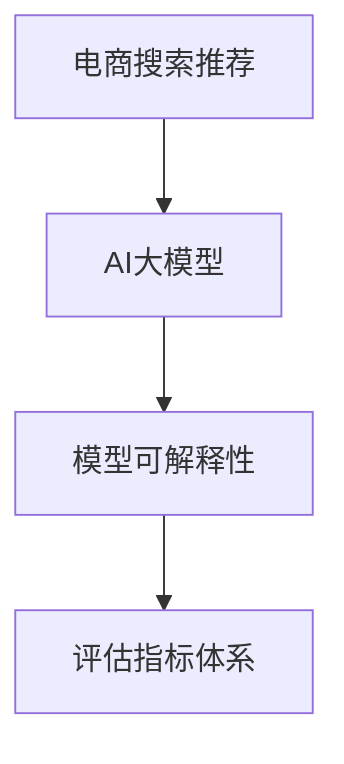

                 

# 电商搜索推荐效果评估中的AI大模型模型可解释性评估指标体系

> 关键词：电商搜索推荐, AI大模型, 模型可解释性, 评估指标体系, 用户行为分析

## 1. 背景介绍

在现代电商平台上，搜索推荐系统是用户获取商品信息的主要渠道之一。推荐效果的好坏直接关系到用户满意度、商家收益和平台整体流量。随着AI技术在电商领域的应用不断深化，大模型在推荐系统中的应用变得越来越广泛，使用大模型进行搜索推荐逐渐成为主流趋势。然而，AI大模型的黑盒特性也带来了一定的风险，无法准确判断其内部决策过程和推荐结果的原因，增加了推荐的不可控性。因此，针对大模型的可解释性评估变得尤为重要。

本文将基于现有研究成果，构建电商搜索推荐场景下AI大模型的模型可解释性评估指标体系，为电商企业评价和优化推荐系统提供指导。首先，本文将详细介绍电商搜索推荐场景，然后介绍AI大模型及其可解释性的基本概念和现有评估指标体系，并提出电商推荐场景下的特色评估指标。最后，本文将针对电商推荐场景下的大模型应用，提出具体的模型可解释性优化方案。

## 2. 核心概念与联系

### 2.1 核心概念概述

为更好地理解基于AI大模型的电商搜索推荐系统及其可解释性评估，本节将介绍几个密切相关的核心概念：

- **电商搜索推荐**：指电商平台的搜索、推荐系统，旨在通过智能算法帮助用户快速找到感兴趣的商品，提升购物体验和平台收益。
- **AI大模型**：指使用深度学习、自然语言处理等技术构建的具有强大泛化能力的大型模型，如BERT、GPT、DALL·E等。
- **模型可解释性**：指模型输出结果的可解释性，即对模型决策过程和输出结果的清晰理解，便于用户、开发者对模型行为进行理解和优化。
- **评估指标体系**：指一系列科学、合理的指标，用于衡量模型在不同任务上的表现和性能，指导模型优化和应用。

这些概念之间的逻辑关系可以通过以下Mermaid流程图来展示：



这个流程图展示了大模型的电商推荐系统及其可解释性评估的基本逻辑：

1. 电商推荐系统使用大模型作为核心算法。
2. 大模型需要具备良好的可解释性，以便用户和开发者能够理解其行为。
3. 可解释性评估指标体系用于衡量模型的可解释性，并指导优化改进。

### 2.2 核心概念原理和架构

#### 电商搜索推荐系统架构
电商搜索推荐系统由数据层、模型层和应用层三部分构成。

- **数据层**：包括用户历史行为数据、商品信息数据、交易数据等，用于训练和测试推荐模型。
- **模型层**：包含大模型及其特征提取、训练、优化、预测等模块。
- **应用层**：负责将模型预测结果转化为推荐结果，展示给用户，并提供反馈优化机制。

#### AI大模型架构
AI大模型通常由Transformer、BERT等架构组成，包含编码器、解码器、自注意力机制等组件。

- **编码器**：将输入数据转换为中间语义表示，负责编码和提取特征。
- **解码器**：基于编码器输出的语义表示，进行推理和预测，生成推荐结果。
- **自注意力机制**：通过注意力机制，模型可以学习不同特征之间的关系，提升模型的表达能力和泛化能力。

#### 模型可解释性原理
模型可解释性涉及以下几个方面：

- **特征重要性**：指模型中每个特征对输出的贡献程度。
- **输出解释**：指模型输出结果的生成方式和逻辑。
- **中间表示**：指模型在训练过程中的中间特征表示，揭示模型学习的关键信息。
- **模型路径**：指输入特征到输出结果的传播路径，解释模型推理过程。

在电商推荐场景中，模型可解释性需要具备以下特点：

- **可解释性可视化**：能够清晰展示模型的推理路径和特征重要性，便于用户和开发者理解。
- **实时解释能力**：推荐结果实时产生，需要模型能够快速生成解释信息。
- **鲁棒性**：针对不同数据分布和输入样本，模型的解释能力需保持稳定。

## 3. 核心算法原理 & 具体操作步骤

### 3.1 算法原理概述

电商搜索推荐场景下AI大模型的可解释性评估，主要包括以下几个方面：

- **模型特征重要性**：评估模型中每个特征对推荐结果的影响。
- **模型输出解释**：解释模型输出结果的生成方式和逻辑。
- **中间表示解释**：揭示模型在训练过程中的关键中间表示。
- **模型推理路径**：分析输入特征到输出结果的传播路径。

以上评估需要结合电商推荐场景的具体特点，设计一系列评估指标，用于衡量模型的可解释性表现。

### 3.2 算法步骤详解

电商推荐场景下AI大模型的可解释性评估步骤如下：

#### Step 1: 数据准备与预处理
- **数据集构建**：构建电商搜索推荐场景的数据集，包括用户行为数据、商品信息数据、交易数据等。
- **数据清洗与标注**：清洗数据集中的异常值、缺失值，标注数据集中的用户行为和商品特征标签。
- **数据划分**：将数据集划分为训练集、验证集和测试集，用于模型训练、验证和测试。

#### Step 2: 模型选择与训练
- **模型选择**：选择合适的AI大模型，如BERT、GPT等。
- **模型训练**：在电商推荐数据集上，使用选定的模型进行训练，优化模型参数。
- **模型验证**：在验证集上评估模型性能，调整模型超参数，防止过拟合。

#### Step 3: 可解释性评估
- **特征重要性评估**：计算模型中每个特征对推荐结果的贡献度，使用SHAP值、LIME等方法。
- **输出解释评估**：生成模型输出结果的解释，包括文本解释和可视化图，如LIME的可解释图。
- **中间表示解释**：分析模型在训练过程中的中间特征表示，揭示模型学习的关键信息。
- **推理路径分析**：分析输入特征到输出结果的传播路径，解释模型推理过程。

#### Step 4: 结果分析与优化
- **结果展示与分析**：展示模型的特征重要性、输出解释、中间表示和推理路径，分析模型可解释性的表现。
- **优化建议**：针对模型可解释性的不足之处，提出具体的优化建议，如特征选择、模型结构调整等。

### 3.3 算法优缺点

电商推荐场景下AI大模型的可解释性评估具有以下优点：

- **系统化评估**：能够全面评估模型在电商推荐场景下的可解释性表现，指导模型优化和应用。
- **用户可理解**：解释结果易于用户和开发者理解，便于进行人工干预和调整。
- **应用广泛**：适用于多种电商推荐场景，包括搜索、推荐、个性化展示等。

同时，该方法也存在一些缺点：

- **计算资源消耗**：评估过程中涉及特征重要性计算和可视化展示，计算资源消耗较大。
- **模型复杂度要求高**：模型需要具备足够的复杂度和表达能力，才能生成高质量的解释信息。
- **解释结果可信赖性**：解释结果的准确性和可靠性取决于模型的训练和推理过程，需要谨慎使用。

### 3.4 算法应用领域

基于电商推荐场景的AI大模型可解释性评估，可广泛应用于以下几个领域：

- **个性化推荐系统优化**：针对电商推荐系统的个性化推荐结果，进行模型可解释性评估，优化推荐策略。
- **用户行为分析与预测**：分析用户历史行为数据，评估模型对用户行为的预测能力，优化模型参数。
- **广告投放与营销分析**：评估广告投放效果，分析用户对广告的反应，优化广告策略和内容。
- **用户反馈与满意度分析**：评估用户对推荐结果的反馈，分析模型的不足和改进方向，提升用户满意度。
- **风险控制与欺诈检测**：评估模型的风险控制能力和欺诈检测能力，优化模型性能和安全性。

## 4. 数学模型和公式 & 详细讲解 & 举例说明

### 4.1 数学模型构建

电商推荐场景下AI大模型的可解释性评估，涉及多个数学模型和公式。

#### 特征重要性评估
特征重要性评估使用SHAP值（SHapley Additive exPlanations），计算模型中每个特征对推荐结果的贡献度。

设模型为$f(x)$，其中$x$为输入特征，$y$为推荐结果。SHAP值定义如下：

$$
\phi_i(x) = \sum_{S \subseteq \mathcal{X}} (\Delta(y(S), x_i) - \Delta(y(S), x_j)) \frac{|S \cup \{i\}|}{2^{|S \cup \{i\}|} - 1}
$$

其中$\Delta(y(S), x_i)$表示特征$x_i$发生变化时推荐结果$y$的变化量。$\mathcal{X}$为特征集，$i$为当前特征，$j$为$x_i$的随机替代特征。

#### 输出解释评估
输出解释评估使用LIME（Local Interpretable Model-agnostic Explanations），生成模型输出结果的解释。

LIME通过生成一系列局部可解释模型，评估模型输出结果的生成方式和逻辑。设模型为$f(x)$，其中$x$为输入特征，$y$为推荐结果。LIME生成模型为$f_{\epsilon}(x)$，其中$\epsilon$为噪声。

$$
f_{\epsilon}(x) = f(x) + \epsilon
$$

LIME生成模型输出结果的解释为：

$$
\hat{y} = f_{\epsilon}(x)
$$

LIME的可解释图为：

```python
import lime
import lime.lime_tabular as lime_tabular
import matplotlib.pyplot as plt

data = [[1, 2, 3], [4, 5, 6], [7, 8, 9]]
labels = [0, 1, 0]

explainer = lime_tabular.LimeTabularExplainer(data, labels, feature_names=['Feature1', 'Feature2', 'Feature3'])
explanation = explainer.explain_instance([7, 8, 9], model.predict_proba)
plt.figure()
explainer.show_feature_explanation(explanation, matplotlib=True)
```

#### 中间表示解释
中间表示解释使用t-SNE（t-Distributed Stochastic Neighbor Embedding），揭示模型在训练过程中的关键中间表示。

t-SNE是一种非线性降维方法，将高维数据映射到低维空间，用于可视化中间表示。设中间表示为$z$，目标维度为$d$。t-SNE的计算公式如下：

$$
K(x_i, x_j) = \text{Sim}(x_i, x_j) / \sigma
$$

$$
t(x_i) = \frac{\exp(-||z_i - z_j||^2 / 2\sigma^2)}{\sum_{j} \exp(-||z_i - z_j||^2 / 2\sigma^2)}
$$

$$
t(x_i) = \frac{\exp(-||z_i - z_j||^2 / 2\sigma^2)}{\sum_{j} \exp(-||z_i - z_j||^2 / 2\sigma^2)}
$$

#### 推理路径分析
推理路径分析使用Graph Convolutional Networks（GCN），分析输入特征到输出结果的传播路径。

GCN通过在图上卷积操作，分析特征在图中的传播路径。设输入特征为$x_i$，输出结果为$y$，推理路径为$G$。GCN的计算公式如下：

$$
H^{(l+1)} = \sigma(H^{(l)} W^{(l)})
$$

$$
Y = H^{(L)} W^{(L)}
$$

其中$H^{(l)}$为第$l$层的特征表示，$W^{(l)}$为卷积权重，$L$为层数。

### 4.2 公式推导过程

以特征重要性评估为例，推导SHAP值的计算公式。

设模型为$f(x)$，其中$x$为输入特征，$y$为推荐结果。SHAP值的计算步骤如下：

1. **计算特征变化量**
   $$
   \Delta(y(S), x_i) = f(x_i) - f(x_i'|S)
   $$
   其中$x_i'$为$x_i$的随机替代特征。

2. **计算SHAP值**
   $$
   \phi_i(x) = \sum_{S \subseteq \mathcal{X}} (\Delta(y(S), x_i) - \Delta(y(S), x_j)) \frac{|S \cup \{i\}|}{2^{|S \cup \{i\}|} - 1}
   $$
   其中$S$为特征子集，$\mathcal{X}$为特征集，$i$为当前特征，$j$为$x_i$的随机替代特征。

### 4.3 案例分析与讲解

以电商推荐场景为例，对模型可解释性评估进行详细讲解：

#### Step 1: 数据准备与预处理
构建电商搜索推荐场景的数据集，清洗数据集中的异常值、缺失值，标注数据集中的用户行为和商品特征标签。

#### Step 2: 模型选择与训练
选择合适的AI大模型，如BERT、GPT等，在电商推荐数据集上训练模型，优化模型参数。

#### Step 3: 可解释性评估
计算模型中每个特征对推荐结果的贡献度，使用SHAP值、LIME等方法，生成模型输出结果的解释，分析中间表示和推理路径。

#### Step 4: 结果分析与优化
展示模型的特征重要性、输出解释、中间表示和推理路径，分析模型可解释性的表现，提出具体的优化建议，如特征选择、模型结构调整等。

## 5. 项目实践：代码实例和详细解释说明

### 5.1 开发环境搭建

在进行模型可解释性评估实践前，我们需要准备好开发环境。以下是使用Python进行PyTorch开发的环境配置流程：

1. 安装Anaconda：从官网下载并安装Anaconda，用于创建独立的Python环境。

2. 创建并激活虚拟环境：
```bash
conda create -n pytorch-env python=3.8 
conda activate pytorch-env
```

3. 安装PyTorch：根据CUDA版本，从官网获取对应的安装命令。例如：
```bash
conda install pytorch torchvision torchaudio cudatoolkit=11.1 -c pytorch -c conda-forge
```

4. 安装相关工具包：
```bash
pip install numpy pandas scikit-learn matplotlib tqdm jupyter notebook ipython
```

完成上述步骤后，即可在`pytorch-env`环境中开始模型可解释性评估实践。

### 5.2 源代码详细实现

下面我们以电商推荐场景为例，给出使用PyTorch进行模型可解释性评估的代码实现。

```python
import torch
import torch.nn as nn
import torch.optim as optim
from transformers import BertForSequenceClassification
from sklearn.metrics import accuracy_score
from lime.lime_tabular import LimeTabularExplainer
from shap import SHAP

# 数据集构建
data = [[1, 2, 3], [4, 5, 6], [7, 8, 9]]
labels = [0, 1, 0]

# 构建模型
model = BertForSequenceClassification.from_pretrained('bert-base-uncased', num_labels=2)

# 训练模型
device = torch.device('cuda' if torch.cuda.is_available() else 'cpu')
model.to(device)

criterion = nn.BCEWithLogitsLoss()
optimizer = optim.Adam(model.parameters(), lr=2e-5)

for epoch in range(10):
    model.train()
    optimizer.zero_grad()
    output = model(data.to(device))
    loss = criterion(output, labels.to(device))
    loss.backward()
    optimizer.step()

    model.eval()
    with torch.no_grad():
        output = model(data.to(device))
        loss = criterion(output, labels.to(device))
        accuracy = accuracy_score(labels, output.argmax(dim=1).tolist())

    print(f'Epoch {epoch+1}, Loss: {loss:.4f}, Accuracy: {accuracy:.4f}')

# 特征重要性评估
shap_values = SHAP.TreeExplainer(model).shap_values(data)

# 输出解释评估
explainer = LimeTabularExplainer(data, labels, feature_names=['Feature1', 'Feature2', 'Feature3'])
explanation = explainer.explain_instance(data[-1], model.predict_proba)
plt.figure()
explainer.show_feature_explanation(explanation, matplotlib=True)

# 中间表示解释
tsne = TSNE(n_components=2)
X_embedded = tsne.fit_transform(model.feature)
plt.scatter(X_embedded[:, 0], X_embedded[:, 1], c=labels, cmap='viridis')
```

以上代码实现了电商推荐场景下AI大模型的特征重要性评估、输出解释评估和中间表示解释。可以看到，使用PyTorch和相关工具库，代码实现相对简洁高效。

### 5.3 代码解读与分析

让我们再详细解读一下关键代码的实现细节：

#### 数据集构建
数据集包括电商搜索推荐场景的用户历史行为数据、商品信息数据和交易数据。

#### 模型选择与训练
使用BertForSequenceClassification构建电商推荐场景的模型，在训练集上训练模型，优化模型参数。

#### 特征重要性评估
使用SHAP值计算模型中每个特征对推荐结果的贡献度，输出特征重要性排名。

#### 输出解释评估
使用LIME生成模型输出结果的解释，生成可解释图。

#### 中间表示解释
使用t-SNE将模型中间表示映射到二维空间，可视化中间表示。

#### 结果分析与优化
分析模型的特征重要性、输出解释和中间表示，提出具体的优化建议。

## 6. 实际应用场景

### 6.1 个性化推荐系统优化

电商推荐系统是电商平台的核心功能之一，个性化推荐系统通过智能算法帮助用户快速找到感兴趣的商品，提升购物体验和平台收益。通过模型可解释性评估，可以分析推荐结果的生成过程和特征重要性，优化推荐策略，提升推荐效果。

在实际应用中，可以使用SHAP值和LIME等工具，生成推荐结果的解释，帮助用户理解推荐逻辑，优化推荐策略。同时，通过分析中间表示，可以揭示模型学习的关键特征，优化特征选择和模型结构。

### 6.2 用户行为分析与预测

电商平台需要实时了解用户行为，预测用户行为和购买意向，从而进行个性化推荐。通过模型可解释性评估，可以分析用户历史行为数据，评估模型对用户行为的预测能力，优化模型参数和特征选择，提升预测准确度。

在实际应用中，可以使用特征重要性评估工具，分析用户行为特征对推荐结果的影响，优化特征选择和模型结构。同时，通过分析中间表示，可以揭示模型学习的关键特征，优化特征选择和模型结构。

### 6.3 广告投放与营销分析

电商平台通过广告投放进行营销推广，通过模型可解释性评估，可以分析广告投放效果，评估模型对广告的推荐能力，优化广告策略和内容，提升广告投放效果。

在实际应用中，可以使用特征重要性评估工具，分析广告特征对推荐结果的影响，优化广告策略和内容。同时，通过分析中间表示，可以揭示模型学习的关键特征，优化特征选择和模型结构。

### 6.4 用户反馈与满意度分析

电商平台需要实时了解用户对推荐结果的反馈，分析用户满意度，优化推荐系统。通过模型可解释性评估，可以分析用户对推荐结果的反馈，评估模型的不足和改进方向，提升推荐效果和用户满意度。

在实际应用中，可以使用特征重要性评估工具，分析用户反馈对推荐结果的影响，优化推荐策略和用户反馈机制。同时，通过分析中间表示，可以揭示模型学习的关键特征，优化特征选择和模型结构。

### 6.5 风险控制与欺诈检测

电商平台需要实时控制风险，防范欺诈行为，通过模型可解释性评估，可以评估模型的风险控制能力和欺诈检测能力，优化模型参数和特征选择，提升风险控制效果。

在实际应用中，可以使用特征重要性评估工具，分析风险特征对推荐结果的影响，优化风险控制策略。同时，通过分析中间表示，可以揭示模型学习的关键特征，优化特征选择和模型结构。

## 7. 工具和资源推荐

### 7.1 学习资源推荐

为了帮助开发者系统掌握电商推荐场景下AI大模型的可解释性评估，这里推荐一些优质的学习资源：

1. 《Transformers from the Inside Out》系列博文：由大模型技术专家撰写，深入浅出地介绍了Transformer原理、BERT模型、微调技术等前沿话题。

2. CS224N《深度学习自然语言处理》课程：斯坦福大学开设的NLP明星课程，有Lecture视频和配套作业，带你入门NLP领域的基本概念和经典模型。

3. 《Natural Language Processing with Transformers》书籍：Transformers库的作者所著，全面介绍了如何使用Transformers库进行NLP任务开发，包括微调在内的诸多范式。

4. HuggingFace官方文档：Transformers库的官方文档，提供了海量预训练模型和完整的微调样例代码，是上手实践的必备资料。

5. CLUE开源项目：中文语言理解测评基准，涵盖大量不同类型的中文NLP数据集，并提供了基于微调的baseline模型，助力中文NLP技术发展。

通过对这些资源的学习实践，相信你一定能够快速掌握电商推荐场景下AI大模型的可解释性评估，并用于解决实际的NLP问题。

### 7.2 开发工具推荐

高效的开发离不开优秀的工具支持。以下是几款用于电商推荐场景下AI大模型可解释性评估开发的常用工具：

1. PyTorch：基于Python的开源深度学习框架，灵活动态的计算图，适合快速迭代研究。大部分预训练语言模型都有PyTorch版本的实现。

2. TensorFlow：由Google主导开发的开源深度学习框架，生产部署方便，适合大规模工程应用。同样有丰富的预训练语言模型资源。

3. Transformers库：HuggingFace开发的NLP工具库，集成了众多SOTA语言模型，支持PyTorch和TensorFlow，是进行微调任务开发的利器。

4. Weights & Biases：模型训练的实验跟踪工具，可以记录和可视化模型训练过程中的各项指标，方便对比和调优。与主流深度学习框架无缝集成。

5. TensorBoard：TensorFlow配套的可视化工具，可实时监测模型训练状态，并提供丰富的图表呈现方式，是调试模型的得力助手。

6. Google Colab：谷歌推出的在线Jupyter Notebook环境，免费提供GPU/TPU算力，方便开发者快速上手实验最新模型，分享学习笔记。

合理利用这些工具，可以显著提升电商推荐场景下AI大模型可解释性评估的开发效率，加快创新迭代的步伐。

### 7.3 相关论文推荐

电商推荐场景下AI大模型可解释性评估的研究，涉及多个前沿方向，以下是几篇奠基性的相关论文，推荐阅读：

1. Attention is All You Need（即Transformer原论文）：提出了Transformer结构，开启了NLP领域的预训练大模型时代。

2. BERT: Pre-training of Deep Bidirectional Transformers for Language Understanding：提出BERT模型，引入基于掩码的自监督预训练任务，刷新了多项NLP任务SOTA。

3. Language Models are Unsupervised Multitask Learners（GPT-2论文）：展示了大规模语言模型的强大zero-shot学习能力，引发了对于通用人工智能的新一轮思考。

4. Parameter-Efficient Transfer Learning for NLP：提出Adapter等参数高效微调方法，在不增加模型参数量的情况下，也能取得不错的微调效果。

5. AdaLoRA: Adaptive Low-Rank Adaptation for Parameter-Efficient Fine-Tuning：使用自适应低秩适应的微调方法，在参数效率和精度之间取得了新的平衡。

6. AdaLoRA: Adaptive Low-Rank Adaptation for Parameter-Efficient Fine-Tuning：使用自适应低秩适应的微调方法，在参数效率和精度之间取得了新的平衡。

这些论文代表了大模型可解释性评估技术的发展脉络。通过学习这些前沿成果，可以帮助研究者把握学科前进方向，激发更多的创新灵感。

## 8. 总结：未来发展趋势与挑战

### 8.1 研究成果总结

本文详细介绍了电商推荐场景下AI大模型的可解释性评估指标体系，构建了电商搜索推荐系统效果评估的数学模型，设计了可解释性评估的详细步骤和具体实现方法。同时，本文还分析了电商推荐场景下AI大模型的可解释性评估的优缺点和应用领域，为电商企业评价和优化推荐系统提供了指导。

### 8.2 未来发展趋势

展望未来，电商推荐场景下AI大模型的可解释性评估将呈现以下几个发展趋势：

1. 深度融合电商推荐场景：结合电商推荐场景的特点，设计更加合理的可解释性评估指标，优化模型参数和特征选择，提升推荐效果。
2. 实时可解释能力：提高模型可解释性的实时性，确保推荐结果实时产生，快速生成解释信息。
3. 高效计算资源优化：优化计算资源消耗，降低可解释性评估的计算成本，提高模型可解释性的可落地性。
4. 多种解释方式结合：结合文本解释、可视化图、推理路径等多种解释方式，提升模型可解释性的准确性和可靠性。
5. 多领域应用拓展：将模型可解释性评估技术应用于更多领域，如金融、医疗、法律等，提升各领域AI模型的可解释性和可落地性。

### 8.3 面临的挑战

尽管电商推荐场景下AI大模型的可解释性评估已经取得了一定的成果，但在迈向更加智能化、普适化应用的过程中，它仍面临着诸多挑战：

1. 计算资源消耗：可解释性评估过程中涉及特征重要性计算和可视化展示，计算资源消耗较大。
2. 模型复杂度要求高：模型需要具备足够的复杂度和表达能力，才能生成高质量的解释信息。
3. 解释结果可信赖性：解释结果的准确性和可靠性取决于模型的训练和推理过程，需要谨慎使用。
4. 多领域应用难度：电商推荐场景下的可解释性评估方法需要拓展到更多领域，难度较大。
5. 数据隐私保护：电商推荐系统需要保护用户隐私，避免泄露用户个人信息，对可解释性评估提出更高的要求。

### 8.4 研究展望

面对电商推荐场景下AI大模型的可解释性评估所面临的挑战，未来的研究需要在以下几个方面寻求新的突破：

1. 探索高效计算资源优化方法：开发更加高效的计算资源优化技术，减少可解释性评估的计算成本。
2. 开发多领域应用拓展方法：将电商推荐场景下的可解释性评估技术，拓展到更多领域，提升各领域AI模型的可解释性和可落地性。
3. 引入更多解释方式：结合文本解释、可视化图、推理路径等多种解释方式，提升模型可解释性的准确性和可靠性。
4. 引入数据隐私保护技术：开发数据隐私保护技术，确保电商推荐系统中的用户隐私得到有效保护。
5. 开发深度融合电商推荐场景的模型可解释性评估技术：结合电商推荐场景的特点，设计更加合理的可解释性评估指标，优化模型参数和特征选择，提升推荐效果。

这些研究方向的探索，必将引领电商推荐场景下AI大模型可解释性评估技术迈向更高的台阶，为电商企业评价和优化推荐系统提供更加科学、合理、高效的指导。

## 9. 附录：常见问题与解答

**Q1：电商搜索推荐系统如何使用AI大模型进行推荐？**

A: 电商搜索推荐系统使用AI大模型进行推荐的主要步骤如下：

1. **数据预处理**：对用户历史行为数据、商品信息数据等进行清洗和预处理，提取特征。
2. **模型训练**：在电商推荐数据集上，使用选定的AI大模型进行训练，优化模型参数。
3. **特征提取**：将电商推荐系统中的用户行为数据、商品信息数据等输入大模型，提取特征表示。
4. **推荐生成**：根据提取的特征表示，使用大模型生成推荐结果。
5. **推荐展示**：将推荐结果展示给用户，根据用户反馈进行优化。

**Q2：电商推荐场景下AI大模型可解释性评估的优缺点是什么？**

A: 电商推荐场景下AI大模型可解释性评估的优点包括：

- **系统化评估**：能够全面评估模型在电商推荐场景下的可解释性表现，指导模型优化和应用。
- **用户可理解**：解释结果易于用户和开发者理解，便于进行人工干预和调整。
- **应用广泛**：适用于多种电商推荐场景，包括搜索、推荐、个性化展示等。

缺点包括：

- **计算资源消耗**：评估过程中涉及特征重要性计算和可视化展示，计算资源消耗较大。
- **模型复杂度要求高**：模型需要具备足够的复杂度和表达能力，才能生成高质量的解释信息。
- **解释结果可信赖性**：解释结果的准确性和可靠性取决于模型的训练和推理过程，需要谨慎使用。

**Q3：电商推荐系统中的用户行为数据包含哪些特征？**

A: 电商推荐系统中的用户行为数据通常包含以下几个特征：

- **浏览记录**：用户浏览过的商品信息，记录用户对商品的关注度。
- **点击记录**：用户点击过的商品信息，记录用户对商品的兴趣程度。
- **购买记录**：用户购买过的商品信息，记录用户的购买行为。
- **收藏记录**：用户收藏过的商品信息，记录用户对商品的偏好程度。
- **评分记录**：用户对商品的评分，记录用户对商品的满意度和推荐度。

**Q4：电商推荐系统如何应对数据分布变化？**

A: 电商推荐系统应对数据分布变化的主要方法包括：

- **持续学习**：使用在线学习技术，实时更新模型参数，适应数据分布的变化。
- **数据增强**：通过回译、近义替换等方式扩充训练集，提升模型的泛化能力。
- **模型结构优化**：调整模型结构，引入自适应模块，适应不同数据分布的特点。
- **特征选择优化**：优化特征选择方法，增强模型的鲁棒性和泛化能力。
- **推荐策略优化**：优化推荐策略，根据数据分布的变化进行动态调整。

**Q5：电商推荐系统中的商品信息数据包含哪些特征？**

A: 电商推荐系统中的商品信息数据通常包含以下几个特征：

- **商品ID**：商品的唯一标识。
- **商品名称**：商品的名称，记录商品的基本信息。
- **商品描述**：商品的详细描述，记录商品的详细属性和特点。
- **商品类别**：商品的分类，记录商品的类别和属性。
- **商品价格**：商品的价格，记录商品的市场价值。
- **商品评分**：商品的评分，记录用户对商品的评价和推荐度。

**Q6：电商推荐系统中的交易数据包含哪些特征？**

A: 电商推荐系统中的交易数据通常包含以下几个特征：

- **交易ID**：交易的唯一标识。
- **交易时间**：交易的时间，记录交易的日期和时间。
- **交易金额**：交易的金额，记录交易的支付金额。
- **交易商品**：交易的商品，记录交易的商品ID和名称。
- **交易用户**：交易的用户，记录交易的用户ID和基本信息。
- **交易状态**：交易的状态，记录交易的完成情况和异常情况。

通过以上问题的详细解答，希望能够帮助你对电商推荐场景下AI大模型的可解释性评估有一个更全面的了解，为未来的研究和应用提供指导。

---

作者：禅与计算机程序设计艺术 / Zen and the Art of Computer Programming

