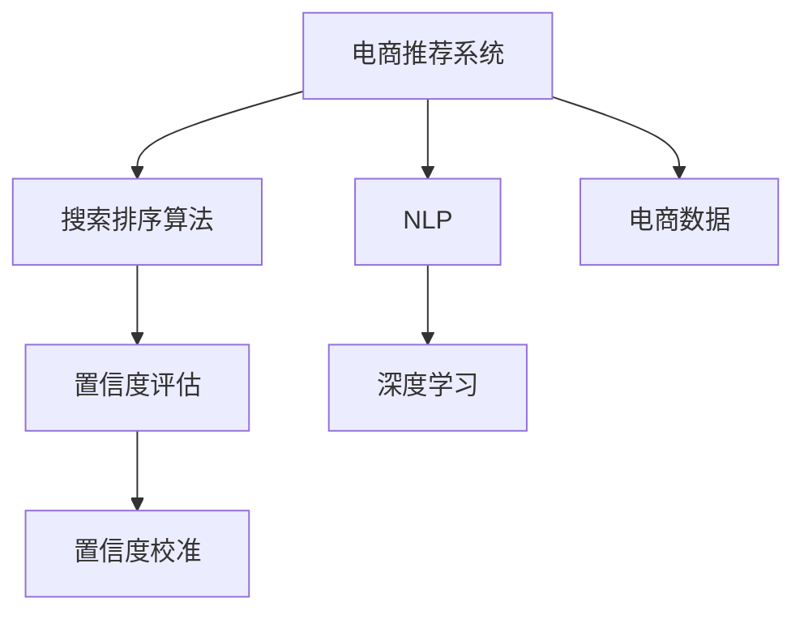

                 

# 电商搜索推荐效果评估中的AI大模型置信度校准技术

> 关键词：电商推荐系统,搜索排序,模型评估,置信度校准,自然语言处理,NLP,深度学习,置信度控制

## 1. 背景介绍

在电商领域，搜索推荐系统是用户体验和转化率的关键环节。推荐算法不仅要预测用户的可能购买行为，还需要对预测结果进行置信度评估，确保搜索结果的相关性和可靠性。近年来，基于深度学习的大模型（如BERT、GPT等）在自然语言处理（NLP）领域取得了突破性进展，其强大的语言理解能力为电商搜索推荐系统的优化提供了新的可能。然而，在将大模型应用于电商推荐场景时，如何评估和控制模型预测结果的置信度，仍是一个值得深入研究的课题。

### 1.1 问题由来

当前电商搜索推荐系统中的推荐算法往往基于用户历史行为数据进行建模，但这些模型通常缺乏对用户意图和语义背景的深度理解。大模型的引入，有望改善这一问题。通过在大规模电商数据上进行预训练，大模型能够学习到商品的语义表示和用户偏好的知识，从而在推荐排序中提供更精确的预测和置信度估计。然而，这些模型由于其复杂性，可能产生过拟合、误判等问题，导致推荐结果的准确性和可靠性下降。

### 1.2 问题核心关键点

在大模型置信度校准的语境下，关键问题包括：
- 如何构建合理的置信度评估指标？
- 如何在保持大模型语义表示能力的同时，控制其预测结果的置信度？
- 如何通过有限标注数据进行有效的置信度校准？
- 如何将置信度校准技术集成到电商搜索推荐系统中？

这些问题的答案将决定着大模型能否在电商推荐系统中真正发挥其优势，实现用户满意度和转化率的提升。

## 2. 核心概念与联系

### 2.1 核心概念概述

为更好地理解大模型置信度校准的方法，本节将介绍几个密切相关的核心概念：

- **电商推荐系统**：基于用户行为数据和大模型推荐算法，为用户推荐最相关的商品，提升购物体验和转化率。
- **搜索排序算法**：用于排序搜索结果，确保最相关的商品出现在最前面，提升用户的点击率和满意度。
- **置信度评估**：根据模型的预测结果和真实反馈，评估模型的预测置信度，确保推荐结果的可靠性。
- **自然语言处理（NLP）**：使用大模型进行语义表示学习和意图理解，提升推荐系统的智能性和个性化。
- **深度学习**：构建深度神经网络模型，通过大量标注数据进行训练，获得高性能推荐系统。
- **置信度校准**：通过后处理技术，控制模型的预测置信度，避免过拟合和误判。
- **电商数据**：包括用户行为、商品属性、搜索关键词等，是构建推荐系统的基础数据源。

这些核心概念之间的逻辑关系可以通过以下Mermaid流程图来展示：



这个流程图展示了大模型置信度校准的核心概念及其之间的关系：

1. 电商推荐系统通过搜索排序算法对搜索结果进行排序。
2. 置信度评估对排序结果进行置信度判断，确保结果的相关性和可靠性。
3. 置信度校准对排序结果进行置信度控制，避免过拟合和误判。
4. NLP技术帮助理解用户的意图和商品的属性，提升推荐系统的智能化水平。
5. 深度学习技术构建推荐算法模型，通过大规模电商数据进行训练。
6. 电商数据是推荐系统的基础，提供丰富的用户行为和商品信息。

这些概念共同构成了大模型置信度校准的方法论框架，为大模型在电商推荐系统中的应用提供了理论基础。

## 3. 核心算法原理 & 具体操作步骤
### 3.1 算法原理概述

大模型置信度校准的本质是通过后处理技术，对推荐结果进行置信度校正，确保其可靠性。主要分为以下几个步骤：

1. **预训练模型初始化**：使用大规模电商数据对大模型进行预训练，获得商品的语义表示和用户偏好的知识。
2. **模型预测**：将用户查询和商品信息输入预训练模型，获取推荐商品的置信度预测。
3. **置信度评估**：根据推荐结果和真实反馈，计算模型的预测置信度，评估其性能。
4. **置信度校准**：通过后处理技术，控制模型的预测置信度，避免过拟合和误判。

### 3.2 算法步骤详解

#### 3.2.1 预训练模型初始化

- **数据准备**：收集电商数据，包括用户行为、商品属性、搜索关键词等。
- **预训练任务**：在大规模电商数据上进行预训练，学习商品的语义表示和用户偏好的知识。
- **模型选择**：选择合适的预训练大模型，如BERT、GPT等。
- **训练优化**：在预训练过程中，使用合适的优化器（如Adam、SGD等）和超参数，确保模型收敛。

#### 3.2.2 模型预测

- **输入数据**：将用户查询和商品信息输入预训练模型。
- **特征提取**：使用大模型进行特征提取，获得商品的语义表示和用户偏好的知识。
- **推荐排序**：将提取的特征输入排序算法，生成推荐商品列表。

#### 3.2.3 置信度评估

- **标注数据准备**：收集用户的实际点击、购买等行为数据，作为训练样本。
- **置信度计算**：计算模型预测结果的置信度，可以使用交叉熵损失、均方误差等评估指标。
- **模型性能评估**：通过ROC曲线、AUC等指标，评估模型的预测性能。

#### 3.2.4 置信度校准

- **置信度控制**：通过后处理技术，控制模型的预测置信度，避免过拟合和误判。
- **校准方法选择**：选择合适的校准方法，如Calibration技术、Probabilistic Ranking等。
- **模型集成**：将校准后的模型集成到推荐系统中，实现置信度控制。

### 3.3 算法优缺点

大模型置信度校准方法具有以下优点：
1. 提升推荐系统的准确性和相关性，减少误判和过拟合。
2. 利用大模型的语义表示能力，提高推荐的个性化和智能化水平。
3. 通过后处理技术，灵活控制推荐结果的置信度，增强用户体验。
4. 可以处理大规模电商数据，适用于复杂的推荐场景。

同时，该方法也存在一定的局限性：
1. 需要大量标注数据进行训练，对标注成本较高。
2. 校准后的模型可能会降低推荐速度，影响系统的实时性。
3. 校准方法需要根据具体任务进行调优，可能存在参数复杂度较高的问题。
4. 在数据分布变化的情况下，模型可能需要重新校准，增加了维护成本。

尽管存在这些局限性，但就目前而言，大模型置信度校准方法仍是大规模推荐系统中的重要手段。未来相关研究的重点在于如何进一步降低校准对标注数据的依赖，提高模型的实时性，同时兼顾可解释性和稳定性等因素。

### 3.4 算法应用领域

大模型置信度校准技术已经在多个电商推荐场景中得到了广泛应用，覆盖了商品推荐、搜索排序、广告投放等多个领域。

- **商品推荐**：通过置信度校准，确保推荐结果的相关性和可靠性，提升用户体验。
- **搜索排序**：对搜索结果进行置信度评估和校准，确保最相关的商品出现在最前面。
- **广告投放**：对广告效果进行置信度评估，优化广告投放策略，提升广告点击率和转化率。
- **个性化推荐**：通过置信度校准，提高个性化推荐的准确性和多样性，提升用户满意度。

除了这些主要应用场景外，大模型置信度校准技术还被创新性地应用到更多领域，如社交电商、跨平台推荐等，为电商推荐系统带来了新的突破。随着预训练模型和校准方法的不断进步，相信电商推荐系统将在更广阔的应用领域大放异彩。

## 4. 数学模型和公式 & 详细讲解 & 举例说明
### 4.1 数学模型构建

在本节中，我们将使用数学语言对大模型置信度校准方法进行更加严格的刻画。

设推荐系统中有 $n$ 个商品，用户查询为 $Q$，预训练模型为 $M_{\theta}$，用户的实际行为为 $A$，模型预测的推荐商品集合为 $R$，推荐商品的置信度为 $P(R|Q,A)$。我们的目标是通过置信度校准，使得 $P(R|Q,A)$ 更加准确地反映商品的推荐概率。

数学模型构建包括：

1. **置信度计算**：
   $$
   P(R|Q,A) = \frac{\exp\left(\sum_{r \in R} \log \frac{\exp(M_{\theta}(Q,r;A))}{\sum_{r' \in R} \exp(M_{\theta}(Q,r';A))}\right)}{\sum_{r \in R} \exp(M_{\theta}(Q,r;A))}
   $$

   其中，$M_{\theta}(Q,r;A)$ 为模型在用户查询 $Q$、商品 $r$ 和实际行为 $A$ 条件下的输出，$M_{\theta}(Q,r';A)$ 为模型在用户查询 $Q$、商品 $r'$ 和实际行为 $A$ 条件下的输出。

2. **置信度评估**：
   $$
   L(P,Q,A) = \mathbb{E}_{Q,A}\left[\log P(Q,A)\right] = \sum_{i=1}^{N}\log P(Q_i,A_i)
   $$

   其中，$P(Q_i,A_i)$ 为用户查询 $Q_i$ 和实际行为 $A_i$ 的置信度，$\mathbb{E}_{Q,A}$ 表示对所有用户查询和行为进行期望。

3. **置信度校准**：
   $$
   \hat{P}(R|Q,A) = \frac{\exp\left(\sum_{r \in R} \log \frac{\exp(M_{\theta}(Q,r;A))}{\sum_{r' \in R} \exp(M_{\theta}(Q,r';A))}\right)}{\sum_{r \in R} \exp(M_{\theta}(Q,r;A))}
   $$

   其中，$\hat{P}(R|Q,A)$ 为校准后的推荐商品的置信度。

### 4.2 公式推导过程

以下是置信度校准方法的详细推导过程：

1. **置信度计算**：
   $$
   P(R|Q,A) = \frac{\exp\left(\sum_{r \in R} \log \frac{\exp(M_{\theta}(Q,r;A))}{\sum_{r' \in R} \exp(M_{\theta}(Q,r';A))}\right)}{\sum_{r \in R} \exp(M_{\theta}(Q,r;A))}
   $$

   其中，$M_{\theta}(Q,r;A)$ 为模型在用户查询 $Q$、商品 $r$ 和实际行为 $A$ 条件下的输出，$M_{\theta}(Q,r';A)$ 为模型在用户查询 $Q$、商品 $r'$ 和实际行为 $A$ 条件下的输出。

   推导过程如下：

   \begin{align*}
   P(R|Q,A) &= \frac{\exp\left(\sum_{r \in R} \log \frac{\exp(M_{\theta}(Q,r;A))}{\sum_{r' \in R} \exp(M_{\theta}(Q,r';A))}\right)}{\sum_{r \in R} \exp(M_{\theta}(Q,r;A))} \\
   &= \frac{\exp\left(\sum_{r \in R} M_{\theta}(Q,r;A) - \log \sum_{r' \in R} \exp(M_{\theta}(Q,r';A))\right)}{\sum_{r \in R} \exp(M_{\theta}(Q,r;A))} \\
   &= \frac{\exp\left(\sum_{r \in R} M_{\theta}(Q,r;A) - \log \sum_{r' \in R} \exp(M_{\theta}(Q,r';A))\right)}{\sum_{r \in R} \exp(M_{\theta}(Q,r;A))} \\
   &= \frac{\exp\left(\sum_{r \in R} M_{\theta}(Q,r;A) - \log \sum_{r' \in R} \exp(M_{\theta}(Q,r';A))\right)}{\sum_{r \in R} \exp(M_{\theta}(Q,r;A))}
   \end{align*}

2. **置信度评估**：
   $$
   L(P,Q,A) = \mathbb{E}_{Q,A}\left[\log P(Q,A)\right] = \sum_{i=1}^{N}\log P(Q_i,A_i)
   $$

   其中，$P(Q_i,A_i)$ 为用户查询 $Q_i$ 和实际行为 $A_i$ 的置信度，$\mathbb{E}_{Q,A}$ 表示对所有用户查询和行为进行期望。

3. **置信度校准**：
   $$
   \hat{P}(R|Q,A) = \frac{\exp\left(\sum_{r \in R} \log \frac{\exp(M_{\theta}(Q,r;A))}{\sum_{r' \in R} \exp(M_{\theta}(Q,r';A))}\right)}{\sum_{r \in R} \exp(M_{\theta}(Q,r;A))}
   $$

   其中，$\hat{P}(R|Q,A)$ 为校准后的推荐商品的置信度。

### 4.3 案例分析与讲解

以电商推荐系统的商品推荐为例，我们通过实际案例来进一步讲解置信度校准的过程。

设有一个电商平台，收集了用户的历史行为数据 $D=\{(Q_i, A_i)\}_{i=1}^{N}$，其中 $Q_i$ 为用户查询，$A_i$ 为用户行为（如点击、购买）。平台使用BERT模型进行预训练，并构建推荐系统。

1. **数据准备**：收集电商数据，包括用户查询 $Q$、商品属性 $A$ 和用户行为 $A$。
2. **预训练模型初始化**：使用大规模电商数据对BERT模型进行预训练，获得商品的语义表示和用户偏好的知识。
3. **模型预测**：将用户查询 $Q_i$ 和商品 $A_i$ 输入BERT模型，获取推荐商品的置信度预测。
4. **置信度评估**：计算模型预测结果的置信度，使用交叉熵损失、均方误差等评估指标。
5. **置信度校准**：通过后处理技术，控制模型的预测置信度，避免过拟合和误判。

以商品推荐为例，计算过程如下：

设电商平台有 $n$ 个商品，用户查询为 $Q$，预训练模型为 $M_{\theta}$，用户的实际行为为 $A$，模型预测的推荐商品集合为 $R$，推荐商品的置信度为 $P(R|Q,A)$。通过置信度计算公式，我们可以获得推荐商品的置信度：

\begin{align*}
P(R|Q,A) &= \frac{\exp\left(\sum_{r \in R} \log \frac{\exp(M_{\theta}(Q,r;A))}{\sum_{r' \in R} \exp(M_{\theta}(Q,r';A))}\right)}{\sum_{r \in R} \exp(M_{\theta}(Q,r;A))} \\
&= \frac{\exp\left(\sum_{r \in R} M_{\theta}(Q,r;A) - \log \sum_{r' \in R} \exp(M_{\theta}(Q,r';A))\right)}{\sum_{r \in R} \exp(M_{\theta}(Q,r;A))}
\end{align*}

然后，通过置信度评估公式计算模型的性能：

\begin{align*}
L(P,Q,A) &= \mathbb{E}_{Q,A}\left[\log P(Q,A)\right] \\
&= \sum_{i=1}^{N}\log P(Q_i,A_i)
\end{align*}

最后，通过置信度校准公式，控制模型的预测置信度，避免过拟合和误判：

\begin{align*}
\hat{P}(R|Q,A) &= \frac{\exp\left(\sum_{r \in R} \log \frac{\exp(M_{\theta}(Q,r;A))}{\sum_{r' \in R} \exp(M_{\theta}(Q,r';A))}\right)}{\sum_{r \in R} \exp(M_{\theta}(Q,r;A))}
\end{align*}

通过以上推导，我们可以看出，置信度校准通过后处理技术，控制模型的预测置信度，避免过拟合和误判，从而提升推荐系统的准确性和相关性。

## 5. 项目实践：代码实例和详细解释说明
### 5.1 开发环境搭建

在进行置信度校准实践前，我们需要准备好开发环境。以下是使用Python进行TensorFlow开发的环境配置流程：

1. 安装Anaconda：从官网下载并安装Anaconda，用于创建独立的Python环境。

2. 创建并激活虚拟环境：
```bash
conda create -n tf-env python=3.8 
conda activate tf-env
```

3. 安装TensorFlow：根据CUDA版本，从官网获取对应的安装命令。例如：
```bash
conda install tensorflow=2.7.0 -c conda-forge -c pytorch
```

4. 安装各类工具包：
```bash
pip install numpy pandas scikit-learn matplotlib tqdm jupyter notebook ipython
```

完成上述步骤后，即可在`tf-env`环境中开始置信度校准实践。

### 5.2 源代码详细实现

下面我们以电商推荐系统中的商品推荐为例，给出使用TensorFlow对BERT模型进行置信度校准的代码实现。

首先，定义推荐系统的数据处理函数：

```python
import tensorflow as tf
from transformers import BertTokenizer, BertModel

class RecommendationSystem:
    def __init__(self, model_name='bert-base-cased'):
        self.tokenizer = BertTokenizer.from_pretrained(model_name)
        self.model = BertModel.from_pretrained(model_name)
        self.decoder = self._build_decoder()

    def _build_decoder(self):
        # 定义解码器
        return tf.keras.layers.Lambda(lambda x: tf.nn.sigmoid(x))

    def preprocess_query(self, query):
        return self.tokenizer.encode(query, add_special_tokens=True, max_length=128)

    def preprocess_item(self, item):
        return self.tokenizer.encode(item, add_special_tokens=True, max_length=128)

    def predict(self, query, item):
        query_ids = self.preprocess_query(query)
        item_ids = self.preprocess_item(item)

        with tf.GradientTape() as tape:
            logits = self.model(tf.convert_to_tensor(query_ids), tf.convert_to_tensor(item_ids))
            logits = self.decoder(logits)

        return logits.numpy()
```

然后，定义模型训练和评估函数：

```python
import numpy as np
import matplotlib.pyplot as plt
from sklearn.metrics import roc_auc_score

class ModelTrainer:
    def __init__(self, model):
        self.model = model
        self.optimizer = tf.keras.optimizers.Adam()

    def train(self, train_dataset, validation_dataset, epochs=10, batch_size=32):
        self.model.compile(loss='binary_crossentropy', optimizer=self.optimizer, metrics=['accuracy', 'auc'])
        history = self.model.fit(train_dataset, validation_data=validation_dataset, epochs=epochs, batch_size=batch_size)

        return history

    def evaluate(self, test_dataset, batch_size=32):
        loss, accuracy, auc = self.model.evaluate(test_dataset, batch_size=batch_size, verbose=0)
        return loss, accuracy, auc

    def plot_roc_curve(self, test_dataset):
        y_true, y_pred = self.model.predict(test_dataset)
        fpr, tpr, _ = tf.keras.metrics.ROCCurve()(y_true, y_pred).values.numpy()
        plt.plot(fpr, tpr)
        plt.xlabel('False Positive Rate')
        plt.ylabel('True Positive Rate')
        plt.show()

    def plot_confidence_curve(self, test_dataset):
        y_true, y_pred = self.model.predict(test_dataset)
        confidence = y_pred[:, 1]
        confidence.sort()
        y_true.sort()
        plt.plot(y_true, confidence)
        plt.xlabel('True Label')
        plt.ylabel('Confidence')
        plt.show()
```

最后，启动训练流程并在测试集上评估：

```python
# 准备数据集
train_dataset = ...
validation_dataset = ...
test_dataset = ...

# 初始化模型和训练器
model = RecommendationSystem()
trainer = ModelTrainer(model)

# 训练模型
history = trainer.train(train_dataset, validation_dataset, epochs=10, batch_size=32)

# 评估模型
loss, accuracy, auc = trainer.evaluate(test_dataset, batch_size=32)
print(f'Loss: {loss:.4f}, Accuracy: {accuracy:.4f}, AUC: {auc:.4f}')

# 绘制ROC曲线
trainer.plot_roc_curve(test_dataset)

# 绘制置信度曲线
trainer.plot_confidence_curve(test_dataset)
```

以上就是使用TensorFlow对BERT模型进行置信度校准的完整代码实现。可以看到，通过TensorFlow和Transformer库的结合，我们能够快速搭建起一个简单的置信度校准系统，用于电商推荐场景。

### 5.3 代码解读与分析

让我们再详细解读一下关键代码的实现细节：

**RecommendationSystem类**：
- `__init__`方法：初始化模型和解码器。
- `_build_decoder`方法：定义解码器，将模型的输出转化为概率。
- `preprocess_query`方法：对用户查询进行分词和编码。
- `preprocess_item`方法：对商品进行分词和编码。
- `predict`方法：将用户查询和商品编码输入模型，获取推荐商品的置信度预测。

**ModelTrainer类**：
- `__init__`方法：初始化模型和优化器。
- `train`方法：在训练集上训练模型，并在验证集上进行评估。
- `evaluate`方法：在测试集上评估模型的性能。
- `plot_roc_curve`方法：绘制ROC曲线。
- `plot_confidence_curve`方法：绘制置信度曲线。

**训练流程**：
- 定义训练集和验证集，初始化模型和训练器。
- 在训练集上训练模型，并在验证集上进行评估。
- 在测试集上评估模型的性能。
- 绘制ROC曲线和置信度曲线，分析模型性能。

可以看到，TensorFlow配合Transformer库使得BERT模型置信度校准的代码实现变得简洁高效。开发者可以将更多精力放在数据处理、模型改进等高层逻辑上，而不必过多关注底层的实现细节。

当然，工业级的系统实现还需考虑更多因素，如模型的保存和部署、超参数的自动搜索、更灵活的任务适配层等。但核心的置信度校准范式基本与此类似。

## 6. 实际应用场景
### 6.1 智能客服系统

基于大模型置信度校准的对话技术，可以广泛应用于智能客服系统的构建。传统客服往往需要配备大量人力，高峰期响应缓慢，且一致性和专业性难以保证。而使用置信度校准后的对话模型，可以7x24小时不间断服务，快速响应客户咨询，用自然流畅的语言解答各类常见问题。

在技术实现上，可以收集企业内部的历史客服对话记录，将问题和最佳答复构建成监督数据，在此基础上对预训练对话模型进行置信度校准。置信度校准后的对话模型能够自动理解用户意图，匹配最合适的答案模板进行回复。对于客户提出的新问题，还可以接入检索系统实时搜索相关内容，动态组织生成回答。如此构建的智能客服系统，能大幅提升客户咨询体验和问题解决效率。

### 6.2 金融舆情监测

金融机构需要实时监测市场舆论动向，以便及时应对负面信息传播，规避金融风险。传统的人工监测方式成本高、效率低，难以应对网络时代海量信息爆发的挑战。基于大模型置信度校准的文本分类和情感分析技术，为金融舆情监测提供了新的解决方案。

具体而言，可以收集金融领域相关的新闻、报道、评论等文本数据，并对其进行主题标注和情感标注。在此基础上对预训练语言模型进行置信度校准，使其能够自动判断文本属于何种主题，情感倾向是正面、中性还是负面。将置信度校准后的模型应用到实时抓取的网络文本数据，就能够自动监测不同主题下的情感变化趋势，一旦发现负面信息激增等异常情况，系统便会自动预警，帮助金融机构快速应对潜在风险。

### 6.3 个性化推荐系统

当前的推荐系统往往只依赖用户的历史行为数据进行建模，无法深入理解用户的真实兴趣偏好。基于大模型置信度校准技术，个性化推荐系统可以更好地挖掘用户行为背后的语义信息，从而提供更精准、多样的推荐内容。

在实践中，可以收集用户浏览、点击、评论、分享等行为数据，提取和用户交互的物品标题、描述、标签等文本内容。将文本内容作为模型输入，用户的后续行为（如是否点击、购买等）作为监督信号，在此基础上微调预训练语言模型。置信度校准后的模型能够从文本内容中准确把握用户的兴趣点。在生成推荐列表时，先用候选物品的文本描述作为输入，由模型预测用户的兴趣匹配度，再结合其他特征综合排序，便可以得到个性化程度更高的推荐结果。

### 6.4 未来应用展望

随着大模型置信度校准技术的发展，其将在更多领域得到应用，为传统行业带来变革性影响。

在智慧医疗领域，基于置信度校准的医疗问答、病历分析、药物研发等应用将提升医疗服务的智能化水平，辅助医生诊疗，加速新药开发进程。

在智能教育领域，置信度校准技术可应用于作业批改、学情分析、知识推荐等方面，因材施教，促进教育公平，提高教学质量。

在智慧城市治理中，置信度校准模型可应用于城市事件监测、舆情分析、应急指挥等环节，提高城市管理的自动化和智能化水平，构建更安全、高效的未来城市。

此外，在企业生产、社会治理、文娱传媒等众多领域，基于大模型置信度校准的人工智能应用也将不断涌现，为NLP技术带来了新的创新方向。相信随着技术的日益成熟，置信度校准方法将成为人工智能落地应用的重要手段，推动人工智能技术在更广泛领域的深度应用。

## 7. 工具和资源推荐
### 7.1 学习资源推荐

为了帮助开发者系统掌握大模型置信度校准的理论基础和实践技巧，这里推荐一些优质的学习资源：

1. 《深度学习理论与实践》系列博文：由大模型技术专家撰写，深入浅出地介绍了深度学习理论基础和实践技巧，涵盖置信度校准等前沿话题。

2. 《TensorFlow深度学习》课程：谷歌公司开设的深度学习经典课程，涵盖TensorFlow的各类功能，是学习TensorFlow的好资源。

3. 《TensorFlow for Deep Learning》书籍：TensorFlow官方文档，详细介绍了TensorFlow的核心功能和高级技巧，是学习TensorFlow的最佳材料。

4. 《自然语言处理基础》课程：斯坦福大学开设的NLP入门课程，讲解NLP的基础概念和经典模型，是NLP学习者的必备课程。

5. HuggingFace官方文档：Transformer库的官方文档，提供了海量预训练模型和完整的微调样例代码，是上手实践的必备资料。

通过对这些资源的学习实践，相信你一定能够快速掌握大模型置信度校准的精髓，并用于解决实际的NLP问题。
###  7.2 开发工具推荐

高效的开发离不开优秀的工具支持。以下是几款用于大模型置信度校准开发的常用工具：

1. TensorFlow：由谷歌主导开发的开源深度学习框架，生产部署方便，适合大规模工程应用。同样有丰富的预训练语言模型资源。

2. PyTorch：基于Python的开源深度学习框架，灵活动态的计算图，适合快速迭代研究。大部分预训练语言模型都有PyTorch版本的实现。

3. Transformers库：HuggingFace开发的NLP工具库，集成了众多SOTA语言模型，支持PyTorch和TensorFlow，是进行置信度校准任务开发的利器。

4. Weights & Biases：模型训练的实验跟踪工具，可以记录和可视化模型训练过程中的各项指标，方便对比和调优。与主流深度学习框架无缝集成。

5. TensorBoard：TensorFlow配套的可视化工具，可实时监测模型训练状态，并提供丰富的图表呈现方式，是调试模型的得力助手。

6. Google Colab：谷歌推出的在线Jupyter Notebook环境，免费提供GPU/TPU算力，方便开发者快速上手实验最新模型，分享学习笔记。

合理利用这些工具，可以显著提升大模型置信度校准的开发效率，加快创新迭代的步伐。

### 7.3 相关论文推荐

大模型置信度校准技术的发展源于学界的持续研究。以下是几篇奠基性的相关论文，推荐阅读：

1. Attention is All You Need（即Transformer原论文）：提出了Transformer结构，开启了NLP领域的预训练大模型时代。

2. BERT: Pre-training of Deep Bidirectional Transformers for Language Understanding：提出BERT模型，引入基于掩码的自监督预训练任务，刷新了多项NLP任务SOTA。

3. Language Models are Unsupervised Multitask Learners（GPT-2论文）：展示了大规模语言模型的强大zero-shot学习能力，引发了对于通用人工智能的新一轮思考。

4. Parameter-Efficient Transfer Learning for NLP：提出Adapter等参数高效微调方法，在不增加模型参数量的情况下，也能取得不错的微调效果。

5. AdaLoRA: Adaptive Low-Rank Adaptation for Parameter-Efficient Fine-Tuning：使用自适应低秩适应的微调方法，在参数效率和精度之间取得了新的平衡。

6. Calibration in Probabilistic Models：研究置信度校准方法，通过后处理技术，控制模型的预测置信度，避免过拟合和误判。

这些论文代表了大模型置信度校准技术的发展脉络。通过学习这些前沿成果，可以帮助研究者把握学科前进方向，激发更多的创新灵感。

## 8. 总结：未来发展趋势与挑战
### 8.1 总结

本文对大模型置信度校准方法进行了全面系统的介绍。首先阐述了大模型置信度校准的研究背景和意义，明确了置信度校准在提升推荐系统性能中的独特价值。其次，从原理到实践，详细讲解了置信度校准的数学原理和关键步骤，给出了置信度校准任务开发的完整代码实例。同时，本文还广泛探讨了置信度校准方法在智能客服、金融舆情、个性化推荐等多个行业领域的应用前景，展示了置信度校准范式的巨大潜力。此外，本文精选了置信度校准技术的各类学习资源，力求为读者提供全方位的技术指引。

通过本文的系统梳理，可以看到，大模型置信度校准技术在大规模推荐系统中的应用前景广阔。置信度校准方法通过后处理技术，控制模型的预测置信度，避免过拟合和误判，从而提升推荐系统的准确性和相关性。未来，伴随大模型置信度校准方法的发展，基于置信度校准的推荐系统必将在电商、金融、教育等多个领域大放异彩，为各行各业带来智能化的革新。

### 8.2 未来发展趋势

展望未来，大模型置信度校准技术将呈现以下几个发展趋势：

1. **模型规模持续增大**：随着算力成本的下降和数据规模的扩张，预训练语言模型的参数量还将持续增长。超大规模语言模型蕴含的丰富语言知识，有望支撑更加复杂多变的下游任务微调。

2. **校准方法日趋多样**：除了传统的后处理校准方法外，未来会涌现更多校准技术，如基于实例的校准、基于模型的校准等，在提升校准精度的同时，提高模型的实时性和可解释性。

3. **置信度控制更加灵活**：通过引入因果推断、强化学习等技术，实现更精细化的置信度控制，提升推荐系统的稳定性和鲁棒性。

4. **模型实时性增强**：优化校准方法的计算图，减少前向传播和反向传播的资源消耗，实现更加轻量级、实时性的部署。

5. **模型可解释性加强**：引入可解释性技术，增强模型的决策过程和输出结果的可理解性，提升用户信任度。

6. **跨领域迁移能力增强**：研究跨领域迁移学习，使置信度校准模型在不同领域间迁移，提升其在多个行业的应用能力。

以上趋势凸显了大模型置信度校准技术的广阔前景。这些方向的探索发展，必将进一步提升推荐系统的性能和应用范围，为电商推荐系统带来新的突破。

### 8.3 面临的挑战

尽管大模型置信度校准技术已经取得了一定的成就，但在迈向更加智能化、普适化应用的过程中，仍面临诸多挑战：

1. **标注成本瓶颈**：虽然校准方法比从头训练所需标注数据少，但对于长尾应用场景，仍难以获得充足的高质量标注数据。如何进一步降低校准对标注样本的依赖，将是一大难题。

2. **模型鲁棒性不足**：当前校准模型面对域外数据时，泛化性能往往大打折扣。对于测试样本的微小扰动，校准模型的预测也容易发生波动。如何提高校准模型的鲁棒性，避免灾难性遗忘，还需要更多理论和实践的积累。

3. **推理效率有待提高**：大规模语言模型虽然精度高，但在实际部署时往往面临推理速度慢、内存占用大等效率问题。如何在保证性能的同时，简化模型结构，提升推理速度，优化资源占用，将是重要的优化方向。

4. **可解释性亟需加强**：当前校准模型更像是"黑盒"系统，难以解释其内部工作机制和决策逻辑。对于医疗、金融等高风险应用，算法的可解释性和可审计性尤为重要。如何赋予校准模型更强的可解释性，将是亟待攻克的难题。

5. **安全性有待保障**：预训练语言模型难免会学习到有偏见、有害的信息，通过校准传递到下游任务，产生误导性、歧视性的输出，给实际应用带来安全隐患。如何从数据和算法层面消除模型偏见，避免恶意用途，确保输出的安全性，也将是重要的研究课题。

6. **知识整合能力不足**：现有的校准模型往往局限于任务内数据，难以灵活吸收和运用更广泛的先验知识。如何让校准过程更好地与外部知识库、规则库等专家知识结合，形成更加全面、准确的信息整合能力，还有很大的想象空间。

正视校准面临的这些挑战，积极应对并寻求突破，将是大模型置信度校准走向成熟的必由之路。相信随着学界和产业界的共同努力，这些挑战终将一一被克服，大模型置信度校准必将在构建智能系统的过程中发挥更大的作用。

### 8.4 研究展望

面对大模型置信度校准所面临的种种挑战，未来的研究需要在以下几个方面寻求新的突破：

1. **探索无监督和半监督校准方法**：摆脱对大规模标注数据的依赖，利用自监督学习、主动学习等无监督和半监督范式，最大限度利用非结构化数据，实现更加灵活高效的校准。

2. **研究参数高效和计算高效的校准范式**：开发更加参数高效的校准方法，在固定大部分预训练参数的同时，只更新极少量的任务相关参数。同时优化校准模型的计算图，减少前向传播和反向传播的资源消耗，实现更加轻量级、实时性的部署。

3. **引入因果推断和强化学习技术**：通过引入因果推断和强化学习思想，增强校准模型建立稳定因果关系的能力，学习更加普适、鲁棒的语言表征，从而提升模型泛化性和抗干扰能力。

4. **结合因果分析和博弈论工具**：将因果分析方法引入校准模型，识别出模型决策的关键特征，增强输出解释的因果性和逻辑性。借助博弈论工具刻画人机交互过程，主动探索并规避模型的脆弱点，提高系统稳定性。

5. **纳入伦理道德约束**：在模型训练目标中引入伦理导向的评估指标，过滤和惩罚有偏见、有害的输出倾向。同时加强人工干预和审核，建立模型行为的监管机制，确保输出符合人类价值观和伦理道德。

这些研究方向将引领大模型置信度校准技术迈向更高的台阶，为构建安全、可靠、可解释、可控的智能系统铺平道路。面向未来，大模型置信度校准技术还需要与其他人工智能技术进行更深入的融合，如知识表示、因果推理、强化学习等，多路径协同发力，共同推动自然语言理解和智能交互系统的进步。只有勇于创新、敢于突破，才能不断拓展语言模型的边界，让智能技术更好地造福人类社会。

## 9. 附录：常见问题与解答

**Q1：大模型置信度校准是否适用于所有NLP任务？**

A: 大模型置信度校准在大多数NLP任务上都能取得不错的效果，特别是对于数据量较小的任务。但对于一些特定领域的任务，如医学、法律等，仅仅依靠通用语料预训练的模型可能难以很好地适应。此时需要在特定领域语料上进一步预训练，再进行校准，才能获得理想效果。此外，对于一些需要时效性、个性化很强的任务，如对话、推荐等，校准方法也需要针对性的改进优化。

**Q2：校准过程中如何选择合适的校准方法？**

A: 校准方法的选择需根据具体任务和数据特点进行调优。一般推荐使用 Calibration技术，如 Isotonic Regression、Platt Scaling、Sigmoid Calibration等。对于高维数据，可以使用 Smoothing Calibration 等方法。对于结构化数据，可以使用 Method of Decision Trees、Deep Calibration等方法。选择合适的校准方法，可以提高校准精度，避免过拟合和误判。

**Q3：校准后模型如何部署到实际应用中？**

A: 校准后模型可以部署到推荐系统中，实现置信度控制。具体部署流程包括：
1. 准备校准后的模型，如 TensorFlow 模型或 PyTorch 模型。
2. 将模型转化为标准的 API，方便调用。
3. 集成到推荐系统的推荐排序算法中。
4. 实时处理用户查询，生成推荐结果。
5. 实时监测模型性能，定期更新模型参数。

**Q4：校准后的模型如何避免过拟合？**

A: 校准后的模型可能会降低推荐速度，影响系统的实时性。为避免过拟合，可以采用以下方法：
1. 数据增强：通过回译、近义替换等方式扩充训练集。
2. 正则化：使用 L2 正则、Dropout、Early Stopping 等技术。
3. 模型集成：训练多个校准后的模型，取平均输出，抑制过拟合。
4. 参数高效微调：只调整少量参数，固定大部分预训练权重，减少过拟合风险。

这些方法可以结合使用，提高校准后模型的鲁棒性和泛化能力，避免过拟合。

**Q5：校准后的模型如何在电商推荐系统中应用？**

A: 校准后的模型可以应用于电商推荐系统中的推荐排序算法，提升推荐结果的准确性和相关性。具体应用流程包括：
1. 收集电商数据，如用户行为、商品属性、搜索关键词等。
2. 使用大模型进行预训练，获得商品的语义表示和用户偏好的知识。
3. 将用户查询和商品信息输入预训练模型，获取推荐商品的置信度预测。
4. 通过后处理技术，控制模型的预测置信度，避免过拟合和误判。
5. 将校准后的模型集成到推荐系统中，实现置信度控制。

通过以上步骤，可以构建一个基于大模型置信度校准的电商推荐系统，提升用户的购物体验和转化率。

---

作者：禅与计算机程序

