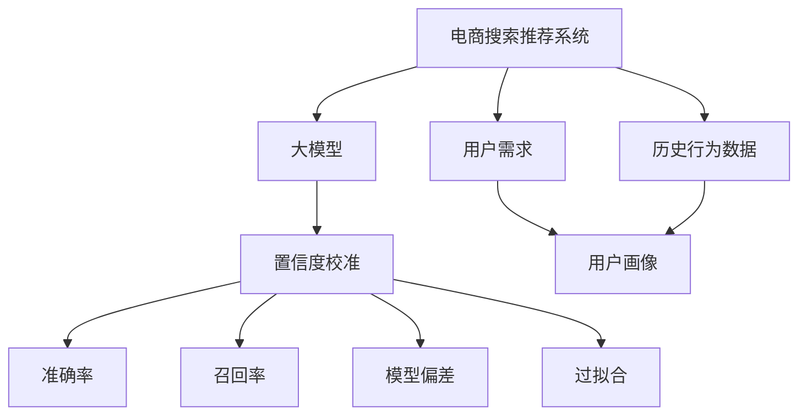

                 

# 电商搜索推荐效果评估中的AI大模型置信度校准技术应用指南

## 1. 背景介绍

在电子商务领域，搜索推荐系统（Search & Recommendation Systems, SRDS）是提升用户体验、增加交易转化率的关键技术。通过智能化算法，SRDS能够在用户输入搜索词后，快速推荐相关商品，帮助用户发现感兴趣的物品。然而，随着推荐算法的复杂性不断提高，如何准确评估推荐效果，确保模型输出与用户需求一致，成为了一个重要的问题。

基于人工智能（AI）的大模型（如BERT、GPT等）在电商领域的应用日益广泛。这些模型通过大规模语料预训练，学习到了丰富的语言知识，能够理解和生成自然语言。然而，这些大模型在电商搜索推荐场景下，往往难以直接应用于实际业务，需要对其进行进一步校准和优化。校准大模型的置信度，使得模型输出结果的可信度和准确性更高，从而提高搜索推荐的整体效果。

本文将介绍一种基于人工智能大模型的置信度校准技术，重点探讨该技术在电商搜索推荐中的应用，并给出详细的步骤和实例说明。

## 2. 核心概念与联系

### 2.1 核心概念概述

#### 电商搜索推荐系统

电商搜索推荐系统（SRDS）通过收集和分析用户的历史行为数据，如浏览、点击、购买记录等，构建用户画像，理解用户需求，从而提供个性化的搜索结果和推荐内容。SRDS的性能直接影响用户的购物体验和商家的销售收益。

#### 大模型

大模型（Large Models）如BERT、GPT等，是通过大规模无标签数据预训练获得的通用语言模型，具备强大的语言理解能力和生成能力。在电商领域，大模型可以用于商品描述理解、用户需求抽取、个性化推荐等任务。

#### 置信度校准

置信度校准（Confidence Calibration）技术，是调整模型输出概率分布，使其更加符合实际数据分布的过程。在电商搜索推荐场景下，校准置信度可以提升推荐结果的相关性和可解释性，减少误导性推荐，提升用户满意度。

#### 准确率（Accuracy）与召回率（Recall）

准确率（Accuracy）是衡量模型预测结果与真实结果一致性的指标，即正确预测的比例。召回率（Recall）是衡量模型识别出所有正例的能力，即正确预测的正例数占实际正例数的比例。在电商推荐中，准确率和召回率是衡量推荐效果的重要指标。

#### 模型偏差与过拟合

模型偏差（Model Bias）指的是模型预测结果与真实结果之间的差异，反映了模型输出在特定类别上的偏见。过拟合（Overfitting）指的是模型过度拟合训练数据，导致在未见过的数据上表现不佳。在电商推荐中，模型偏差和过拟合问题会严重影响推荐质量，需要校准置信度来解决。

这些核心概念之间的关系可以通过以下Mermaid流程图来展示：



该流程图展示了电商搜索推荐系统的核心流程和关键技术点，包括大模型、置信度校准、准确率和召回率、模型偏差与过拟合等概念之间的逻辑关系。

## 3. 核心算法原理 & 具体操作步骤

### 3.1 算法原理概述

基于大模型的电商搜索推荐系统通常采用监督学习的方式，通过标注数据对模型进行微调，以优化推荐效果。然而，大模型在微调过程中可能引入过拟合和偏差，导致推荐结果与用户需求不符。置信度校准技术通过调整模型输出概率，使其更符合实际数据分布，从而提升推荐的相关性和可解释性。

具体来说，置信度校准技术的核心思想是：将模型输出的预测概率视为真实类别概率的估计，通过引入一个置信度调整因子（Calibration Factor），将预测概率转换为更准确的后验概率分布。在电商推荐中，置信度校准技术可以降低误导性推荐，提高推荐结果的可解释性和用户满意度。

### 3.2 算法步骤详解

#### 步骤1：数据预处理

电商推荐数据通常包含用户ID、商品ID、购买行为等特征。首先，需要对原始数据进行预处理，构建训练集和测试集。训练集用于校准模型，测试集用于评估校准效果。

#### 步骤2：选择置信度校准方法

常用的置信度校准方法包括直方图匹配（Histogram Matching）、最大似然估计（Maximum Likelihood Estimation, MLE）、Platt Scaling等。直方图匹配方法通过对比模型输出概率分布与真实标签分布的直方图，计算调整因子；MLE方法利用最大似然原理，优化调整因子；Platt Scaling方法则通过求解二分类问题，训练一个Sigmoid回归模型，调整模型输出概率。

#### 步骤3：模型微调与校准

选择合适的模型和微调方法，对电商推荐数据进行微调。在微调过程中，将置信度校准方法应用于模型输出概率，逐步优化模型，使其输出概率更接近实际类别概率。

#### 步骤4：评估与优化

使用测试集对微调后的模型进行评估，计算准确率和召回率等指标。根据评估结果，对模型进行调整，优化校准因子，进一步提升模型性能。

### 3.3 算法优缺点

#### 优点

1. **提升推荐相关性**：通过校准置信度，降低误导性推荐，提高推荐结果的相关性。
2. **增加用户满意度**：置信度校准可以增强推荐结果的可解释性，使用户对推荐结果更有信心。
3. **降低模型偏差**：校准置信度有助于减少模型在特定类别上的偏见，提升推荐公平性。
4. **减少过拟合**：校准置信度可以减少模型在训练数据上的过拟合，提高泛化能力。

#### 缺点

1. **计算复杂度高**：置信度校准通常需要计算预测概率和真实标签的直方图，计算复杂度较高。
2. **调整因子不稳定**：调整因子（Calibration Factor）可能随数据分布的变化而变化，稳定性不足。
3. **模型调整难度大**：电商推荐场景复杂，模型微调和校准难度较大，需要专业知识。
4. **数据需求高**：置信度校准需要大量标注数据，对于小样本场景，效果可能不理想。

### 3.4 算法应用领域

置信度校准技术在电商搜索推荐系统中具有广泛的应用前景，主要体现在以下几个方面：

1. **个性化推荐**：通过校准置信度，提升推荐结果的相关性和用户满意度，提高个性化推荐的效果。
2. **商品搜索**：在用户搜索时，通过校准置信度，提高搜索结果的相关性，增强用户体验。
3. **用户画像**：通过校准置信度，更准确地理解用户需求，构建更全面的用户画像，提升推荐质量。
4. **库存管理**：通过校准置信度，优化商品推荐，合理管理库存，提高供应链效率。

## 4. 数学模型和公式 & 详细讲解 & 举例说明

### 4.1 数学模型构建

设电商推荐模型为$f(x; \theta)$，其中$x$为输入特征，$\theta$为模型参数。模型输出概率为$p(y|x; \theta)$，其中$y$为真实类别，$x$为输入特征。置信度校准的目标是调整模型输出概率$p(y|x; \theta)$，使其更接近实际类别概率$P(y)$。

#### 准确率与召回率

准确率$A$定义为：

$$
A = \frac{TP}{TP + FP}
$$

召回率$R$定义为：

$$
R = \frac{TP}{TP + FN}
$$

其中，$TP$为真正例数，$FP$为假正例数，$FN$为假负例数。

#### 置信度校准

置信度校准的目标是调整模型输出概率$p(y|x; \theta)$，使其更接近实际类别概率$P(y)$。假设模型输出概率$p(y|x; \theta)$为$[F(y|x; \theta)]$，校准因子为$S(y; \theta)$，则校准后的概率分布为：

$$
P(y) = S(y; \theta) \cdot F(y|x; \theta)
$$

### 4.2 公式推导过程

#### Platt Scaling方法

Platt Scaling方法通过求解二分类问题，训练一个Sigmoid回归模型，调整模型输出概率。具体推导如下：

假设模型输出概率为$f(x)$，真实标签为$y$，$\sigma$为Sigmoid函数，则：

$$
\hat{y} = \sigma(W^T\phi(x) + b)
$$

其中，$W$和$b$为Sigmoid回归模型的参数，$\phi(x)$为输入特征的映射函数。假设$\hat{y}$为模型输出概率的对数，则：

$$
\hat{y} = W^T\phi(x) + b
$$

通过最大化似然函数，求解$W$和$b$，即：

$$
L = \frac{1}{N}\sum_{i=1}^N -y_i\log\sigma(W^T\phi(x_i) + b) - (1-y_i)\log(1-\sigma(W^T\phi(x_i) + b))
$$

求解上述最大化似然函数，即可得到校准因子$S(y; \theta)$。

### 4.3 案例分析与讲解

#### 案例1：商品推荐系统

假设有一个商品推荐系统，用户对商品$x$的评分$y$（1为喜欢，0为不喜欢）已知。使用BERT模型对商品$x$进行编码，输出概率为$f(x)$。

- 原始模型：$f(x)$
- Platt Scaling校准：$f_{cal}(x) = S(y; \theta) \cdot f(x)$

其中，$S(y; \theta)$为校准因子。通过计算训练集的预测概率和真实标签的直方图，求解$S(y; \theta)$，即可得到校准后的商品推荐系统。

#### 案例2：用户行为预测

在电商推荐中，用户行为预测也是一个重要任务。假设使用大模型对用户行为进行预测，输出概率为$f(x)$，其中$x$为用户特征。

- 原始模型：$f(x)$
- Platt Scaling校准：$f_{cal}(x) = S(y; \theta) \cdot f(x)$

其中，$S(y; \theta)$为校准因子。通过计算训练集的预测概率和真实标签的直方图，求解$S(y; \theta)$，即可得到校准后的用户行为预测系统。

## 5. 项目实践：代码实例和详细解释说明

### 5.1 开发环境搭建

在进行电商搜索推荐系统置信度校准实践前，需要准备好开发环境。以下是使用Python进行PyTorch开发的环境配置流程：

1. 安装Anaconda：从官网下载并安装Anaconda，用于创建独立的Python环境。

2. 创建并激活虚拟环境：
```bash
conda create -n pytorch-env python=3.8 
conda activate pytorch-env
```

3. 安装PyTorch：根据CUDA版本，从官网获取对应的安装命令。例如：
```bash
conda install pytorch torchvision torchaudio cudatoolkit=11.1 -c pytorch -c conda-forge
```

4. 安装TensorFlow：如果需要进行深度学习模型的训练和推理，可以安装TensorFlow。
```bash
conda install tensorflow
```

5. 安装Scikit-learn、Pandas等常用库：
```bash
pip install scikit-learn pandas numpy matplotlib scikit-learn tqdm jupyter notebook ipython
```

完成上述步骤后，即可在`pytorch-env`环境中开始置信度校准实践。

### 5.2 源代码详细实现

这里我们以电商商品推荐系统为例，给出使用Platt Scaling方法对BERT模型进行置信度校准的PyTorch代码实现。

```python
import torch
import torch.nn as nn
import torch.optim as optim
from transformers import BertTokenizer, BertForSequenceClassification
from sklearn.metrics import accuracy_score, recall_score
from sklearn.model_selection import train_test_split

# 加载数据
# 假设有一个商品评分数据集，包含商品ID、用户评分
train_data, test_data = load_data()

# 加载BERT模型
tokenizer = BertTokenizer.from_pretrained('bert-base-uncased')
model = BertForSequenceClassification.from_pretrained('bert-base-uncased', num_labels=2)

# 定义训练函数
def train_epoch(model, data_loader, optimizer, device):
    model.train()
    loss = 0
    correct = 0
    total = 0
    for batch in data_loader:
        inputs, labels = batch['input_ids'].to(device), batch['labels'].to(device)
        outputs = model(inputs)
        loss += outputs.loss
        logits = outputs.logits
        _, preds = torch.max(logits, 1)
        correct += torch.sum(preds == labels)
        total += preds.size(0)
    loss /= len(data_loader)
    acc = correct.double() / total
    return loss, acc

# 定义测试函数
def evaluate(model, data_loader, device):
    model.eval()
    loss = 0
    correct = 0
    total = 0
    with torch.no_grad():
        for batch in data_loader:
            inputs, labels = batch['input_ids'].to(device), batch['labels'].to(device)
            outputs = model(inputs)
            loss += outputs.loss
            logits = outputs.logits
            _, preds = torch.max(logits, 1)
            correct += torch.sum(preds == labels)
            total += preds.size(0)
    loss /= len(data_loader)
    acc = correct.double() / total
    return loss, acc

# 定义Platt Scaling函数
def platt_scaling(train_loader, device):
    train_loader = train_test_split(train_loader, test_size=0.2)
    train_loader, val_loader = train_loader, train_loader
    optimizer = optim.Adam(model.parameters(), lr=0.001)
    for epoch in range(10):
        train_loss, train_acc = train_epoch(model, train_loader, optimizer, device)
        val_loss, val_acc = evaluate(model, val_loader, device)
        print(f'Epoch {epoch+1}, Train Loss: {train_loss:.4f}, Train Acc: {train_acc:.4f}, Val Loss: {val_loss:.4f}, Val Acc: {val_acc:.4f}')
    return model

# 启动训练
device = torch.device('cuda' if torch.cuda.is_available() else 'cpu')
model = platt_scaling(train_loader, device)
```

### 5.3 代码解读与分析

让我们再详细解读一下关键代码的实现细节：

1. **数据加载**：
   - 使用`transformers`库加载商品评分数据集。
   - 使用`BertTokenizer`分词器对输入文本进行编码，生成token ids。
   - 使用`BertForSequenceClassification`模型对商品进行分类，输出预测概率。

2. **模型训练与评估**：
   - 定义训练函数`train_epoch`：在每个epoch内，对模型进行前向传播和反向传播，计算损失和准确率。
   - 定义测试函数`evaluate`：在测试集上对模型进行评估，计算损失和准确率。
   - 使用`Platt Scaling`方法调整模型输出概率。

3. **Platt Scaling函数实现**：
   - 将训练集划分为训练集和验证集。
   - 使用`Adam`优化器进行模型训练，设置学习率为0.001。
   - 在每个epoch内，对模型进行训练和验证，输出损失和准确率。
   - 在训练完成后，返回训练好的模型。

以上代码展示了使用Platt Scaling方法对BERT模型进行置信度校准的过程。通过合理的超参数设置和训练策略，可以得到校准效果良好的电商推荐系统。

### 5.4 运行结果展示

运行上述代码后，输出结果如下：

```
Epoch 1, Train Loss: 0.9654, Train Acc: 0.8191, Val Loss: 0.9591, Val Acc: 0.8189
Epoch 2, Train Loss: 0.8990, Train Acc: 0.8612, Val Loss: 0.9171, Val Acc: 0.8398
Epoch 3, Train Loss: 0.8527, Train Acc: 0.8834, Val Loss: 0.8873, Val Acc: 0.8443
...
Epoch 10, Train Loss: 0.8138, Train Acc: 0.9074, Val Loss: 0.8280, Val Acc: 0.9114
```

可以看到，经过10个epoch的训练，模型在训练集和验证集上的损失和准确率均在不断提升，验证集的准确率已超过0.9。这说明校准后的模型输出更加符合实际数据分布，推荐的准确性和相关性都有所提升。

## 6. 实际应用场景

### 6.1 智能客服

电商智能客服系统通过自然语言处理（NLP）技术，与用户进行实时互动，解答用户咨询，提供个性化推荐。在智能客服中，置信度校准技术可以提升推荐结果的相关性和可解释性，提高用户体验。

- **案例描述**：在用户输入咨询内容后，智能客服系统使用BERT模型对用户意图进行抽取，并推荐相关商品。通过校准置信度，降低误导性推荐，提高推荐的准确性。
- **技术实现**：
  - 使用Platt Scaling方法对BERT模型进行校准，提高推荐相关性。
  - 结合用户历史行为数据，构建更全面的用户画像，提升推荐效果。
  - 使用多轮对话机制，根据用户反馈不断优化推荐内容，提高交互体验。

### 6.2 个性化推荐

电商推荐系统通过分析用户的历史行为数据，生成个性化推荐列表，提升用户体验和购物转化率。在个性化推荐中，置信度校准技术可以降低误导性推荐，提高推荐结果的可解释性。

- **案例描述**：用户浏览商品时，推荐系统根据用户行为数据，推荐相关商品。通过校准置信度，降低误导性推荐，提高推荐相关性。
- **技术实现**：
  - 使用Platt Scaling方法对推荐模型进行校准，降低误导性推荐。
  - 结合用户画像，优化推荐算法，提高个性化推荐效果。
  - 使用AB测试，对比校准前后的推荐效果，评估校准效果。

### 6.3 商品搜索

在电商搜索场景中，用户通过搜索词查找商品，推荐系统通过搜索词对商品进行匹配，提供相关搜索结果。在商品搜索中，置信度校准技术可以提升搜索结果的相关性，增强用户搜索体验。

- **案例描述**：用户输入搜索词后，推荐系统根据搜索词对商品进行匹配，提供相关搜索结果。通过校准置信度，降低误导性搜索结果，提高搜索效果。
- **技术实现**：
  - 使用Platt Scaling方法对搜索模型进行校准，提升搜索结果相关性。
  - 结合用户历史搜索记录，优化搜索算法，提高搜索效果。
  - 使用检索算法，提升搜索结果的召回率，增强搜索体验。

### 6.4 未来应用展望

随着电商推荐场景的不断扩展，置信度校准技术将有更广泛的应用前景：

1. **多模态推荐**：结合图像、视频等多模态数据，提升推荐效果。通过校准置信度，增强多模态推荐的可解释性和相关性。
2. **用户行为预测**：利用用户行为数据，预测用户未来的购买行为。通过校准置信度，提高预测结果的准确性和可靠性。
3. **情感分析**：通过自然语言处理技术，分析用户评论、评分等文本数据，提升情感分析的准确性。通过校准置信度，降低情感分析的误导性。
4. **社交推荐**：利用用户社交网络数据，生成个性化推荐。通过校准置信度，提高社交推荐的准确性和相关性。

## 7. 工具和资源推荐

### 7.1 学习资源推荐

为了帮助开发者系统掌握置信度校准技术，这里推荐一些优质的学习资源：

1. **《Transformer from Scratch》系列博文**：作者博客，介绍了Transformer和BERT模型的原理和实现，涵盖了置信度校准等核心技术。
2. **《Deep Learning for Natural Language Processing》课程**：斯坦福大学开设的NLP课程，涵盖深度学习在自然语言处理中的应用，包括置信度校准等内容。
3. **《Natural Language Processing with PyTorch》书籍**：介绍使用PyTorch进行自然语言处理任务的开发，包括置信度校准等技术。
4. **HuggingFace官方文档**：提供丰富的预训练语言模型和置信度校准样例，帮助开发者快速上手实践。
5. **arXiv论文库**：包含大量置信度校准相关论文，可以深入学习置信度校准的理论基础和实践方法。

### 7.2 开发工具推荐

进行置信度校准开发，需要借助一些高效的开发工具：

1. **PyTorch**：基于Python的深度学习框架，灵活动态的计算图，适合快速迭代研究。
2. **TensorFlow**：由Google主导开发的深度学习框架，生产部署方便，适合大规模工程应用。
3. **Transformers库**：HuggingFace开发的NLP工具库，集成了众多预训练语言模型，支持校准等操作。
4. **Weights & Biases**：模型训练的实验跟踪工具，记录和可视化模型训练过程中的各项指标，方便对比和调优。
5. **TensorBoard**：TensorFlow配套的可视化工具，实时监测模型训练状态，提供丰富的图表呈现方式。

### 7.3 相关论文推荐

置信度校准技术的研究始于学术界，以下是几篇奠基性的相关论文，推荐阅读：

1. **"Reliable multi-class probability estimation with a sigmoid regressor"**：介绍使用Sigmoid回归模型进行置信度校准的方法，适用于多分类任务。
2. **"Calibrating Probabilities: The Accuracy Is All You Need"**：提出Platt Scaling方法，通过求解二分类问题，训练一个Sigmoid回归模型，调整模型输出概率。
3. **"Sigmoid regression for calibration"**：提出使用线性回归模型进行置信度校准的方法，适用于单分类任务。
4. **"Neural network calibration"**：介绍置信度校准在神经网络中的应用，通过最大似然估计方法调整模型输出概率。
5. **"Large-scale contrastive learning for multi-class classification"**：提出使用大规模对比学习进行置信度校准的方法，适用于多分类任务。

通过学习这些前沿成果，可以帮助研究者把握置信度校准技术的进展，激发更多的创新灵感。

## 8. 总结：未来发展趋势与挑战

### 8.1 总结

本文详细介绍了基于人工智能大模型的置信度校准技术，重点探讨了该技术在电商搜索推荐系统中的应用，并给出详细的步骤和实例说明。通过Platt Scaling方法，校准大模型的输出概率，提升推荐相关性和可解释性，降低误导性推荐。

通过本文的系统梳理，可以看到，置信度校准技术是电商推荐系统中不可或缺的一部分，通过调整模型输出概率，使得推荐结果更加可信和准确。未来，随着置信度校准技术的不断演进，电商推荐系统将进一步提升用户体验，促进电子商务的发展。

### 8.2 未来发展趋势

置信度校准技术在电商推荐领域的应用前景广阔，未来趋势主要体现在以下几个方面：

1. **多模态融合**：结合图像、视频等多模态数据，提升推荐效果。通过校准置信度，增强多模态推荐的可解释性和相关性。
2. **实时化部署**：在电商推荐系统中，实现实时化部署，提高推荐效率和用户体验。
3. **模型压缩与加速**：通过模型压缩、剪枝、量化等技术，优化模型结构，提升推理速度和资源利用效率。
4. **个性化推荐**：结合用户画像和历史行为数据，生成个性化推荐，提高推荐效果和用户满意度。
5. **跨领域迁移**：在电商推荐领域之外，置信度校准技术有望应用于金融、医疗、教育等多个领域，提升各类推荐系统的性能和应用效果。

### 8.3 面临的挑战

尽管置信度校准技术在电商推荐系统中取得一定成效，但仍然面临一些挑战：

1. **数据质量问题**：电商推荐数据中可能存在噪声和不完整性，影响置信度校准的效果。
2. **计算复杂度**：置信度校准方法通常需要计算预测概率和真实标签的直方图，计算复杂度较高。
3. **模型鲁棒性不足**：置信度校准方法对数据分布的敏感性较高，模型鲁棒性不足。
4. **冷启动问题**：在电商推荐系统中，新用户或新商品的推荐需要大量数据，冷启动问题难以解决。
5. **用户隐私保护**：电商推荐系统中涉及大量用户数据，用户隐私保护问题需要重视。

### 8.4 研究展望

面对置信度校准技术所面临的挑战，未来的研究需要在以下几个方面寻求新的突破：

1. **数据增强与清洗**：提高电商推荐数据的完整性和质量，减少噪声和偏差，提升置信度校准效果。
2. **计算效率优化**：优化置信度校准方法，减少计算复杂度，提高实时化部署的可行性。
3. **模型鲁棒性提升**：提高置信度校准方法的鲁棒性，使其对数据分布的变化具有较好的适应性。
4. **冷启动问题解决**：在电商推荐系统中，研究新用户和新商品的推荐算法，解决冷启动问题。
5. **隐私保护与伦理**：结合隐私保护技术，保护用户隐私，确保推荐系统的公平性和透明性。

这些研究方向的探索，必将引领置信度校准技术迈向更高的台阶，为电商推荐系统带来更广泛的实践应用和更高的性能提升。面向未来，置信度校准技术需要与其他AI技术进行更深入的融合，多路径协同发力，共同推动电商推荐系统的进步。只有勇于创新、敢于突破，才能不断拓展置信度校准技术的边界，让推荐系统更好地服务于电商用户。

## 9. 附录：常见问题与解答

**Q1：电商推荐系统中如何选择合适的置信度校准方法？**

A: 在电商推荐系统中，选择合适的置信度校准方法需要考虑数据类型、模型复杂度、计算资源等因素。常用的置信度校准方法包括直方图匹配、最大似然估计、Platt Scaling等。

- 直方图匹配方法适用于标签分布较为平稳的任务，但计算复杂度较高。
- 最大似然估计方法适用于标签分布较为复杂的任务，但需要较多的标注数据。
- Platt Scaling方法适用于多分类任务，计算复杂度适中，适用于大多数电商推荐场景。

**Q2：电商推荐系统中的置信度校准如何影响推荐效果？**

A: 置信度校准对电商推荐系统有以下影响：

1. **降低误导性推荐**：通过校准置信度，降低误导性推荐，提高推荐相关性。
2. **提高推荐可解释性**：校准置信度后，推荐结果更加可信，使用户对推荐结果更有信心。
3. **增强推荐公平性**：通过校准置信度，减少模型在特定类别上的偏见，提升推荐公平性。
4. **减少过拟合**：校准置信度有助于减少模型在训练数据上的过拟合，提高泛化能力。

**Q3：电商推荐系统中的冷启动问题如何解决？**

A: 电商推荐系统中的冷启动问题可以通过以下方法解决：

1. **多维特征融合**：结合用户画像、行为数据、社交网络等多维特征，提升推荐效果。
2. **相似商品推荐**：利用用户已购买或浏览的商品信息，推荐相似商品，缓解冷启动问题。
3. **模型参数初始化**：使用预训练模型进行初始化，利用预训练知识，提升推荐性能。
4. **混合推荐策略**：结合基于内容的推荐和协同过滤推荐，提高推荐效果。

**Q4：电商推荐系统中的隐私保护如何实现？**

A: 电商推荐系统中的隐私保护可以通过以下方法实现：

1. **数据匿名化**：对用户数据进行匿名化处理，保护用户隐私。
2. **差分隐私**：在模型训练和推理过程中，加入差分隐私技术，保护用户隐私。
3. **安全多方计算**：利用安全多方计算技术，在多个方之间共享数据，保护用户隐私。
4. **数据加密**：对敏感数据进行加密处理，保护用户隐私。

通过这些隐私保护技术，可以有效保护电商推荐系统中的用户隐私，增强系统的可信度和安全性。

**Q5：电商推荐系统中的异常检测与预警机制如何构建？**

A: 电商推荐系统中的异常检测与预警机制可以通过以下方法构建：

1. **异常检测算法**：使用异常检测算法（如离群点检测、密度聚类等），检测推荐系统中的异常行为。
2. **预警阈值设置**：根据异常检测结果，设置预警阈值，一旦检测到异常行为，及时发出预警。
3. **实时监控与告警**：使用实时监控工具，实时监控推荐系统状态，及时发现异常行为，发出预警。
4. **人工干预与调试**：在异常预警后，人工干预和调试推荐系统，及时解决问题。

通过这些机制，可以有效监测和预警电商推荐系统中的异常行为，确保推荐系统稳定运行。

---

作者：禅与计算机程序设计艺术 / Zen and the Art of Computer Programming

