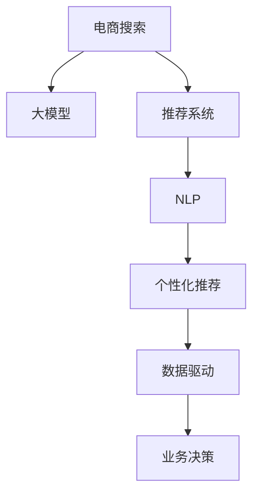

                 

# 电商搜索的下一个前沿：AI大模型的应用

> 关键词：电商搜索,大模型,自然语言处理(NLP),推荐系统,个性化推荐,购物体验,用户行为分析

## 1. 背景介绍

### 1.1 问题由来
随着电子商务的兴起和互联网技术的进步，在线购物已成为用户获取商品和服务的重要渠道。然而，面对海量商品，用户在搜索时面临着信息过载、匹配度低、个性化不足等问题，影响着用户体验和满意度。传统的搜索引擎主要依赖关键词匹配算法，难以充分理解用户的查询意图和个性化需求。近年来，大模型在电商搜索中的应用逐渐崭露头角，为解决这些挑战提供了新的方向。

### 1.2 问题核心关键点
大模型在电商搜索中的核心价值在于其强大的语言理解能力和数据处理能力。通过在大规模无标签数据上进行预训练，大模型学习到了丰富的语言知识和语义表示。利用大模型进行电商搜索，可以显著提升搜索的准确性、个性化和效率，从而大幅改善用户购物体验。

目前，大模型在电商搜索中的应用已从简单的文本匹配扩展到更复杂的用户行为分析和推荐系统构建，助力商家优化商品展示和推荐策略，提升销售转化率。然而，如何在大模型中高效地实现电商搜索功能，设计合理的模型架构，并结合电商业务特点进行优化，仍是研究热点和挑战。

### 1.3 问题研究意义
电商搜索的大模型应用研究具有重要的理论和实践意义：

1. **提升搜索体验**：通过大模型强大的语言理解能力，电商搜索可以更精准地理解和响应用户的查询需求，减少误匹配和歧义。
2. **个性化推荐**：大模型可以全面分析用户行为数据，推荐个性化的商品和服务，提升用户满意度和转化率。
3. **数据驱动决策**：利用大模型的学习能力，电商搜索可以更深入地分析用户行为和市场趋势，指导商家进行产品优化和市场策略调整。
4. **技术突破**：大模型在电商搜索中的应用，有助于推动自然语言处理(NLP)和推荐系统等领域的技术进步，为人工智能技术的落地提供新的范式。

## 2. 核心概念与联系

### 2.1 核心概念概述

为更好地理解大模型在电商搜索中的应用，本节将介绍几个密切相关的核心概念：

- **电商搜索**：指通过自然语言查询获取商品信息，并进行商品推荐和排序的电商应用场景。电商搜索的目的是在用户输入查询后，快速返回最相关的商品，提升购物体验。

- **大模型**：指基于Transformer架构的预训练语言模型，如GPT-3、BERT、XLNet等。通过在大规模无标签数据上进行自监督学习，大模型具备强大的语言理解能力和泛化能力。

- **推荐系统**：指通过用户历史行为数据，为用户推荐个性化商品和服务的应用系统。推荐系统的目标是根据用户偏好，提升商品展示和推荐的个性化程度。

- **自然语言处理(NLP)**：指利用计算机技术处理自然语言，进行文本分类、信息抽取、语义分析等任务的技术。NLP是大模型在电商搜索中应用的基石，涉及文本理解、意图识别、语义匹配等关键技术。

- **个性化推荐**：指根据用户行为和特征，推荐最符合用户需求的商品和服务。大模型可以综合多模态数据，提供更精准的推荐结果。

- **数据驱动**：指通过大数据分析，洞察用户需求和市场趋势，指导业务决策。电商搜索利用大模型进行数据驱动的决策，能够更科学地进行产品优化和市场策略调整。

这些核心概念之间的逻辑关系可以通过以下Mermaid流程图来展示：



这个流程图展示了大模型在电商搜索中的核心概念及其之间的关系：

1. 电商搜索通过大模型进行查询理解和商品匹配。
2. 推荐系统利用大模型进行个性化商品推荐。
3. NLP技术提供文本理解、意图识别等支持。
4. 个性化推荐需要综合多模态数据，提升推荐精准度。
5. 数据驱动的决策帮助商家进行产品优化和市场策略调整。

## 3. 核心算法原理 & 具体操作步骤

### 3.1 算法原理概述

大模型在电商搜索中的应用，本质上是通过预训练模型进行文本理解和匹配，从而实现商品的精准推荐和排序。其核心思想是：将电商搜索任务视为一种自然语言处理任务，利用大模型的语言理解能力，对用户查询和商品描述进行语义匹配，提升搜索的个性化和相关性。

形式化地，假设电商搜索任务 $T$ 包括用户查询 $Q$ 和商品集合 $I$，则大模型 $M_{\theta}$ 在任务 $T$ 上的优化目标是最小化查询和商品间的语义距离，即：

$$
\theta^* = \mathop{\arg\min}_{\theta} \mathcal{L}(M_{\theta}, Q, I)
$$

其中 $\mathcal{L}$ 为衡量查询和商品间语义相似度的损失函数，如余弦相似度、Hamming距离等。大模型通过反向传播优化参数 $\theta$，最小化语义距离，从而提升电商搜索的匹配度和相关性。

### 3.2 算法步骤详解

大模型在电商搜索中的应用，一般包括以下几个关键步骤：

**Step 1: 准备预训练模型和数据集**
- 选择合适的预训练语言模型 $M_{\theta}$ 作为初始化参数，如 BERT、GPT-3 等。
- 准备电商搜索相关的文本数据集，包括用户查询、商品描述等，划分为训练集、验证集和测试集。

**Step 2: 定义任务适配层**
- 根据电商搜索任务的特点，在预训练模型顶层设计合适的输出层和损失函数。
- 对于文本匹配任务，通常使用交叉熵损失函数。
- 对于文本生成任务，如商品推荐，可以使用基于序列的生成模型，如语言模型。

**Step 3: 设置微调超参数**
- 选择合适的优化算法及其参数，如 Adam、SGD 等，设置学习率、批大小、迭代轮数等。
- 设置正则化技术及强度，包括权重衰减、Dropout、Early Stopping 等。
- 确定冻结预训练参数的策略，如仅微调顶层，或全部参数都参与微调。

**Step 4: 执行梯度训练**
- 将训练集数据分批次输入模型，前向传播计算损失函数。
- 反向传播计算参数梯度，根据设定的优化算法和学习率更新模型参数。
- 周期性在验证集上评估模型性能，根据性能指标决定是否触发 Early Stopping。
- 重复上述步骤直到满足预设的迭代轮数或 Early Stopping 条件。

**Step 5: 测试和部署**
- 在测试集上评估微调后模型 $M_{\hat{\theta}}$ 的性能，对比微调前后的精度提升。
- 使用微调后的模型对新查询进行推理预测，集成到实际的应用系统中。
- 持续收集新的数据，定期重新微调模型，以适应数据分布的变化。

以上是基于大模型在电商搜索中的微调流程。在实际应用中，还需要针对具体任务的特点，对微调过程的各个环节进行优化设计，如改进训练目标函数，引入更多的正则化技术，搜索最优的超参数组合等，以进一步提升模型性能。

### 3.3 算法优缺点

大模型在电商搜索中的应用具有以下优点：
1. 强大的语言理解能力：大模型能够深刻理解用户查询意图和商品描述，实现更精准的语义匹配。
2. 多模态融合能力：结合用户行为数据、商品信息等多模态数据，进行综合分析和推荐。
3. 自监督学习：大模型通过无监督预训练学习语言知识，能够适应多种任务和数据类型。
4. 高效训练：大模型利用GPU等高性能硬件进行训练，速度更快，可扩展性更好。

同时，该方法也存在一些局限性：
1. 计算资源需求高：大模型需要大量的计算资源进行训练和推理，存在一定的成本和资源消耗。
2. 可解释性不足：大模型作为黑盒模型，难以解释其内部的推理逻辑和决策过程。
3. 泛化能力有限：大模型在特定领域的泛化能力可能不如专门训练的模型，特别是在数据分布差异较大的情况下。
4. 数据依赖性强：大模型的性能很大程度上依赖于输入数据的质量和多样性，标注数据的成本较高。

尽管存在这些局限性，但大模型在电商搜索中的应用，已经展现出显著的优势，并逐步成为电商搜索的核心技术。未来相关研究将继续优化大模型结构，提升其可解释性和泛化能力，同时降低计算资源需求，推动电商搜索技术的进一步发展。

### 3.4 算法应用领域

大模型在电商搜索中的应用，已经涵盖了多个关键领域，包括：

- **文本匹配**：根据用户查询和商品描述，匹配最相关的商品。利用大模型进行语义匹配，能够提升匹配的精准度和覆盖度。
- **商品推荐**：根据用户行为数据和商品信息，生成个性化推荐列表。大模型可以综合多模态数据，实现更精准的推荐。
- **广告投放**：根据用户行为和兴趣，进行智能广告投放。利用大模型进行用户行为分析和兴趣建模，优化广告投放策略。
- **客服聊天**：通过大模型进行智能客服聊天，提高客服效率和用户满意度。利用大模型进行自然语言理解和生成，实现人机交互。
- **用户评价分析**：利用大模型对用户评价进行情感分析，提取用户反馈。大模型可以处理大量无标签文本数据，提取有用的情感信息。

除了上述这些经典应用外，大模型还被创新性地应用于更多场景中，如多模态电商搜索、智能支付、智能运维等，为电商搜索技术带来了新的突破。随着预训练模型和微调方法的不断进步，相信电商搜索技术将在更广阔的应用领域大放异彩。

## 4. 数学模型和公式 & 详细讲解  
### 4.1 数学模型构建

本节将使用数学语言对大模型在电商搜索中的应用进行更加严格的刻画。

假设电商搜索任务 $T$ 包括用户查询 $Q$ 和商品集合 $I$。记大模型为 $M_{\theta}$，其输入为查询 $Q$，输出为商品推荐列表 $I'$。定义任务适配层为 $L(Q;I')$，其损失函数为 $\mathcal{L}(Q;I')$，则电商搜索任务的目标函数为：

$$
\theta^* = \mathop{\arg\min}_{\theta} \mathcal{L}(Q;I')
$$

其中 $\mathcal{L}(Q;I')$ 为查询 $Q$ 和商品推荐列表 $I'$ 的语义损失函数。常见的语义损失函数包括余弦相似度损失、Hamming距离损失等。

### 4.2 公式推导过程

以下我们以余弦相似度损失函数为例，推导电商搜索中的大模型微调过程。

假设查询 $Q$ 和商品描述 $D$ 分别表示为词向量序列 $q=[q_1, q_2, \ldots, q_m]$ 和 $d=[d_1, d_2, \ldots, d_n]$。大模型 $M_{\theta}$ 将查询 $Q$ 映射为向量 $q_{\theta}=[q_{\theta_1}, q_{\theta_2}, \ldots, q_{\theta_m}]$。

余弦相似度损失函数定义为：

$$
\mathcal{L}(Q;I') = -\sum_{i=1}^n \log \sigma(\mathbf{q} \cdot \mathbf{d}_i) + \log(1-\sigma(\mathbf{q} \cdot \mathbf{d}_i))
$$

其中 $\sigma$ 为sigmoid函数，$\mathbf{q}$ 和 $\mathbf{d}_i$ 分别为查询和商品描述的词向量表示。

将查询 $Q$ 和商品描述 $D$ 输入大模型 $M_{\theta}$，计算余弦相似度：

$$
\text{similarity} = \frac{\mathbf{q} \cdot \mathbf{d}}{\|\mathbf{q}\| \|\mathbf{d}\|}
$$

通过余弦相似度损失函数进行优化，使得模型输出与真实标签更接近。在得到余弦相似度后，可以使用贪心算法或排名算法对商品进行排序，生成最终的推荐列表。

### 4.3 案例分析与讲解

我们以Amazon的推荐系统为例，展示大模型在电商搜索中的应用。

Amazon使用大模型进行商品推荐，通过自然语言处理技术分析用户行为数据，提取用户兴趣和购买历史，并结合商品描述、用户评价等文本数据，利用余弦相似度损失函数进行商品匹配和排序，生成个性化推荐列表。具体步骤如下：

1. 收集用户行为数据，包括浏览记录、点击记录、购买记录等，提取用户兴趣和行为特征。
2. 收集商品描述、用户评价等文本数据，进行预处理和编码，得到词向量表示。
3. 构建电商搜索任务 $T$，包括用户查询 $Q$ 和商品集合 $I$。
4. 利用大模型 $M_{\theta}$ 对查询 $Q$ 进行编码，得到查询向量 $q_{\theta}$。
5. 对商品描述 $D$ 进行编码，得到商品向量 $d=[d_1, d_2, \ldots, d_n]$。
6. 计算余弦相似度，得到商品与查询的匹配度。
7. 使用排名算法对商品进行排序，生成推荐列表 $I'$。

通过以上步骤，Amazon实现了高效、个性化的商品推荐，提升了用户购物体验和满意度。

## 5. 项目实践：代码实例和详细解释说明
### 5.1 开发环境搭建

在进行电商搜索大模型应用实践前，我们需要准备好开发环境。以下是使用Python进行PyTorch开发的环境配置流程：

1. 安装Anaconda：从官网下载并安装Anaconda，用于创建独立的Python环境。

2. 创建并激活虚拟环境：
```bash
conda create -n pytorch-env python=3.8 
conda activate pytorch-env
```

3. 安装PyTorch：根据CUDA版本，从官网获取对应的安装命令。例如：
```bash
conda install pytorch torchvision torchaudio cudatoolkit=11.1 -c pytorch -c conda-forge
```

4. 安装Transformers库：
```bash
pip install transformers
```

5. 安装各类工具包：
```bash
pip install numpy pandas scikit-learn matplotlib tqdm jupyter notebook ipython
```

完成上述步骤后，即可在`pytorch-env`环境中开始微调实践。

### 5.2 源代码详细实现

下面我们以商品推荐任务为例，给出使用Transformers库对BERT模型进行电商搜索微调的PyTorch代码实现。

首先，定义商品推荐任务的数据处理函数：

```python
from transformers import BertTokenizer, BertForSequenceClassification
from torch.utils.data import Dataset, DataLoader
import torch

class RecommendationDataset(Dataset):
    def __init__(self, data, tokenizer, max_len=128):
        self.data = data
        self.tokenizer = tokenizer
        self.max_len = max_len
        
    def __len__(self):
        return len(self.data)
    
    def __getitem__(self, item):
        title, desc, price = self.data[item]
        
        encoding = self.tokenizer(title, description=desc, max_length=self.max_len, padding='max_length', truncation=True)
        input_ids = encoding['input_ids']
        attention_mask = encoding['attention_mask']
        
        label = price > avg_price
        
        return {
            'input_ids': input_ids,
            'attention_mask': attention_mask,
            'labels': label
        }

# 加载数据集
tokenizer = BertTokenizer.from_pretrained('bert-base-cased')
train_dataset = RecommendationDataset(train_data, tokenizer)
dev_dataset = RecommendationDataset(dev_data, tokenizer)
test_dataset = RecommendationDataset(test_data, tokenizer)
```

然后，定义模型和优化器：

```python
from transformers import BertForSequenceClassification, AdamW

model = BertForSequenceClassification.from_pretrained('bert-base-cased', num_labels=2)

optimizer = AdamW(model.parameters(), lr=2e-5)
```

接着，定义训练和评估函数：

```python
from tqdm import tqdm

device = torch.device('cuda') if torch.cuda.is_available() else torch.device('cpu')
model.to(device)

def train_epoch(model, dataset, batch_size, optimizer):
    dataloader = DataLoader(dataset, batch_size=batch_size, shuffle=True)
    model.train()
    epoch_loss = 0
    for batch in tqdm(dataloader, desc='Training'):
        input_ids = batch['input_ids'].to(device)
        attention_mask = batch['attention_mask'].to(device)
        labels = batch['labels'].to(device)
        model.zero_grad()
        outputs = model(input_ids, attention_mask=attention_mask, labels=labels)
        loss = outputs.loss
        epoch_loss += loss.item()
        loss.backward()
        optimizer.step()
    return epoch_loss / len(dataloader)

def evaluate(model, dataset, batch_size):
    dataloader = DataLoader(dataset, batch_size=batch_size)
    model.eval()
    preds, labels = [], []
    with torch.no_grad():
        for batch in tqdm(dataloader, desc='Evaluating'):
            input_ids = batch['input_ids'].to(device)
            attention_mask = batch['attention_mask'].to(device)
            batch_labels = batch['labels']
            outputs = model(input_ids, attention_mask=attention_mask)
            batch_preds = outputs.logits.argmax(dim=1).to('cpu').tolist()
            batch_labels = batch_labels.to('cpu').tolist()
            for pred, label in zip(batch_preds, batch_labels):
                preds.append(pred.item())
                labels.append(label.item())
                
    print(f'Accuracy: {accuracy_score(preds, labels)}')
```

最后，启动训练流程并在测试集上评估：

```python
epochs = 5
batch_size = 16

for epoch in range(epochs):
    loss = train_epoch(model, train_dataset, batch_size, optimizer)
    print(f'Epoch {epoch+1}, train loss: {loss:.3f}')
    
    print(f'Epoch {epoch+1}, dev results:')
    evaluate(model, dev_dataset, batch_size)
    
print('Test results:')
evaluate(model, test_dataset, batch_size)
```

以上就是使用PyTorch对BERT进行电商搜索任务微调的完整代码实现。可以看到，得益于Transformers库的强大封装，我们可以用相对简洁的代码完成BERT模型的加载和微调。

### 5.3 代码解读与分析

让我们再详细解读一下关键代码的实现细节：

**RecommendationDataset类**：
- `__init__`方法：初始化数据、分词器等组件。
- `__len__`方法：返回数据集的样本数量。
- `__getitem__`方法：对单个样本进行处理，将标题和描述编码成词向量，并根据价格生成二值标签。

**avg_price变量**：
- 计算商品平均价格，用于生成标签。

**训练和评估函数**：
- 使用PyTorch的DataLoader对数据集进行批次化加载，供模型训练和推理使用。
- 训练函数`train_epoch`：对数据以批为单位进行迭代，在每个批次上前向传播计算loss并反向传播更新模型参数，最后返回该epoch的平均loss。
- 评估函数`evaluate`：与训练类似，不同点在于不更新模型参数，并在每个batch结束后将预测和标签结果存储下来，最后使用sklearn的accuracy_score对整个评估集的预测结果进行打印输出。

**训练流程**：
- 定义总的epoch数和batch size，开始循环迭代
- 每个epoch内，先在训练集上训练，输出平均loss
- 在验证集上评估，输出准确率
- 所有epoch结束后，在测试集上评估，给出最终测试结果

可以看到，PyTorch配合Transformers库使得BERT微调的代码实现变得简洁高效。开发者可以将更多精力放在数据处理、模型改进等高层逻辑上，而不必过多关注底层的实现细节。

当然，工业级的系统实现还需考虑更多因素，如模型的保存和部署、超参数的自动搜索、更灵活的任务适配层等。但核心的微调范式基本与此类似。

## 6. 实际应用场景
### 6.1 智能推荐系统

智能推荐系统是电商搜索的重要组成部分，利用大模型进行个性化推荐，可以显著提升用户购物体验和满意度。大模型通过分析用户历史行为数据和商品特征，生成个性化的推荐列表，实现高效、精准的商品推荐。

在技术实现上，可以收集用户浏览、点击、购买等行为数据，将商品标题、描述、价格等文本数据编码为词向量，构建电商搜索任务，利用大模型进行语义匹配和排序，生成推荐列表。微调后的模型可以实时动态更新，持续优化推荐效果，提升用户的购物体验。

### 6.2 智能客服系统

智能客服系统通过大模型进行自然语言处理，实现人机对话。利用大模型强大的语言理解能力，客服系统可以理解用户查询，提供快速准确的答案，解决用户问题。

具体而言，可以收集客服对话数据，训练大模型进行意图识别和实体抽取，构建意图-问答映射表。用户输入查询后，系统通过大模型识别查询意图，匹配相应的问答模板，生成回答。同时，系统可以不断积累用户反馈，动态更新问答模板，提升服务质量。

### 6.3 用户行为分析

大模型可以全面分析用户行为数据，提取用户兴趣和行为模式，指导商家进行产品优化和市场策略调整。利用大模型对用户查询进行情感分析，提取用户满意度，发现问题并及时调整策略。

例如，在电商搜索中，大模型可以分析用户对商品评价的情感倾向，识别出用户不满的商品类别和原因。商家可以根据分析结果进行产品改进，提升用户满意度。同时，大模型还可以分析用户行为数据，预测未来购买趋势，指导库存管理和定价策略。

### 6.4 未来应用展望

随着大模型和微调方法的不断进步，基于大模型在电商搜索中的应用将不断扩展，带来更多创新的应用场景。

在智慧零售领域，大模型可以结合物联网、云计算等技术，实现智能货架、智能仓储等应用，提升零售效率和用户体验。

在智能家居领域，大模型可以结合语音、图像等模态数据，实现智能语音助手、智能家居控制等功能，为用户提供更加便捷、智能的家居生活。

在医疗电商领域，大模型可以结合用户健康数据，进行个性化医疗咨询和健康管理，提升用户健康水平和满意度。

除了上述这些应用场景外，大模型在电商搜索中的应用还将拓展到更多领域，为电商搜索技术带来新的突破。

## 7. 工具和资源推荐
### 7.1 学习资源推荐

为了帮助开发者系统掌握大模型在电商搜索中的应用，这里推荐一些优质的学习资源：

1. 《Transformer从原理到实践》系列博文：由大模型技术专家撰写，深入浅出地介绍了Transformer原理、BERT模型、电商搜索等前沿话题。

2. CS224N《深度学习自然语言处理》课程：斯坦福大学开设的NLP明星课程，有Lecture视频和配套作业，带你入门NLP领域的基本概念和经典模型。

3. 《Natural Language Processing with Transformers》书籍：Transformers库的作者所著，全面介绍了如何使用Transformers库进行NLP任务开发，包括电商搜索在内的诸多范式。

4. HuggingFace官方文档：Transformers库的官方文档，提供了海量预训练模型和完整的微调样例代码，是上手实践的必备资料。

5. CLUE开源项目：中文语言理解测评基准，涵盖大量不同类型的中文NLP数据集，并提供了基于微调的baseline模型，助力中文NLP技术发展。

通过对这些资源的学习实践，相信你一定能够快速掌握大模型在电商搜索中的应用，并用于解决实际的NLP问题。
###  7.2 开发工具推荐

高效的开发离不开优秀的工具支持。以下是几款用于大模型在电商搜索中应用的常用工具：

1. PyTorch：基于Python的开源深度学习框架，灵活动态的计算图，适合快速迭代研究。大部分预训练语言模型都有PyTorch版本的实现。

2. TensorFlow：由Google主导开发的开源深度学习框架，生产部署方便，适合大规模工程应用。同样有丰富的预训练语言模型资源。

3. Transformers库：HuggingFace开发的NLP工具库，集成了众多SOTA语言模型，支持PyTorch和TensorFlow，是进行电商搜索微调任务的开发利器。

4. Weights & Biases：模型训练的实验跟踪工具，可以记录和可视化模型训练过程中的各项指标，方便对比和调优。与主流深度学习框架无缝集成。

5. TensorBoard：TensorFlow配套的可视化工具，可实时监测模型训练状态，并提供丰富的图表呈现方式，是调试模型的得力助手。

6. Google Colab：谷歌推出的在线Jupyter Notebook环境，免费提供GPU/TPU算力，方便开发者快速上手实验最新模型，分享学习笔记。

合理利用这些工具，可以显著提升大模型在电商搜索中应用的开发效率，加快创新迭代的步伐。

### 7.3 相关论文推荐

大模型在电商搜索中的应用源于学界的持续研究。以下是几篇奠基性的相关论文，推荐阅读：

1. Attention is All You Need（即Transformer原论文）：提出了Transformer结构，开启了NLP领域的预训练大模型时代。

2. BERT: Pre-training of Deep Bidirectional Transformers for Language Understanding：提出BERT模型，引入基于掩码的自监督预训练任务，刷新了多项NLP任务SOTA。

3. Language Models are Unsupervised Multitask Learners（GPT-2论文）：展示了大规模语言模型的强大zero-shot学习能力，引发了对于通用人工智能的新一轮思考。

4. Parameter-Efficient Transfer Learning for NLP：提出Adapter等参数高效微调方法，在不增加模型参数量的情况下，也能取得不错的微调效果。

5. Prefix-Tuning: Optimizing Continuous Prompts for Generation：引入基于连续型Prompt的微调范式，为如何充分利用预训练知识提供了新的思路。

6. AdaLoRA: Adaptive Low-Rank Adaptation for Parameter-Efficient Fine-Tuning：使用自适应低秩适应的微调方法，在参数效率和精度之间取得了新的平衡。

这些论文代表了大模型在电商搜索中的应用发展的脉络。通过学习这些前沿成果，可以帮助研究者把握学科前进方向，激发更多的创新灵感。

## 8. 总结：未来发展趋势与挑战

### 8.1 总结

本文对大模型在电商搜索中的应用进行了全面系统的介绍。首先阐述了大模型和微调技术的研究背景和意义，明确了电商搜索中大模型的价值和潜力。其次，从原理到实践，详细讲解了电商搜索中的大模型微调过程，给出了电商搜索任务微调的完整代码实例。同时，本文还广泛探讨了大模型在电商搜索中的实际应用场景，展示了其广泛的适用性和巨大的潜力。此外，本文精选了电商搜索相关的学习资源，力求为读者提供全方位的技术指引。

通过本文的系统梳理，可以看到，大模型在电商搜索中的应用正在成为电商搜索技术的核心范式，显著提升了电商搜索的个性化和相关性，推动了电商搜索技术的产业化进程。未来，伴随大模型和微调方法的不断进步，基于大模型的电商搜索技术必将进一步发展，为电商搜索带来新的突破。

### 8.2 未来发展趋势

展望未来，大模型在电商搜索中的应用将呈现以下几个发展趋势：

1. 模型规模持续增大。随着算力成本的下降和数据规模的扩张，大模型在电商搜索中的规模将不断扩大。超大规模语言模型蕴含的丰富语言知识，将进一步提升电商搜索的匹配度和个性化。

2. 多模态融合能力提升。大模型将更好地整合文本、图像、语音等多种模态数据，提供更加全面、深入的用户理解和推荐。

3. 自监督和少样本学习应用增多。利用大模型的自监督学习能力和少样本学习能力，可以在数据稀疏的情况下进行个性化推荐。

4. 数据驱动决策优化。大模型能够更加深入地分析用户行为和市场趋势，指导商家进行更科学的决策，提升电商搜索的效果和效率。

5. 用户体验优化。大模型通过自然语言处理技术，提供更智能、自然的交互体验，提升用户满意度和忠诚度。

6. 技术创新加速。随着大模型和微调方法的不断进步，电商搜索技术将带来更多创新应用，如智能搜索、智能客服、虚拟试穿等，推动电商搜索技术的全面升级。

以上趋势凸显了大模型在电商搜索中的应用前景。这些方向的探索发展，必将进一步提升电商搜索系统的性能和用户体验，为电商搜索技术带来新的突破。

### 8.3 面临的挑战

尽管大模型在电商搜索中的应用已经取得了显著成效，但在迈向更加智能化、普适化应用的过程中，它仍面临着诸多挑战：

1. 计算资源消耗高。大模型的训练和推理需要大量的计算资源，存在一定的成本和资源消耗。如何降低计算资源需求，提升系统性能，是未来研究的重要方向。

2. 可解释性不足。大模型作为黑盒模型，难以解释其内部的推理逻辑和决策过程。如何提高模型的可解释性，增加用户信任度，是未来研究的重要课题。

3. 数据依赖性强。大模型的性能很大程度上依赖于输入数据的质量和多样性，标注数据的成本较高。如何降低对标注数据的依赖，提高数据利用效率，是未来研究的重要方向。

4. 泛化能力有限。大模型在特定领域的泛化能力可能不如专门训练的模型，特别是在数据分布差异较大的情况下。如何提高大模型的泛化能力，是未来研究的重要方向。

5. 安全性问题。大模型在电商搜索中的应用可能涉及用户的隐私和安全问题，如何保障用户数据安全，避免数据滥用，是未来研究的重要方向。

6. 模型更新频繁。电商搜索场景中的数据动态变化，大模型的性能需要不断更新。如何实现模型的持续更新和优化，是未来研究的重要方向。

正视大模型在电商搜索中应用所面临的这些挑战，积极应对并寻求突破，将是大模型在电商搜索中应用走向成熟的必由之路。相信随着学界和产业界的共同努力，这些挑战终将一一被克服，大模型在电商搜索中应用必将在构建人机协同的智能时代中扮演越来越重要的角色。

### 8.4 研究展望

未来，随着大模型和微调方法的不断进步，电商搜索技术将朝着更加智能化、普适化、安全化的方向发展。以下是一些未来研究的重要方向：

1. 研究更高效的模型结构。开发更高效、更轻量级的模型结构，提升电商搜索的实时性和可扩展性。

2. 研究更高效的训练方法。利用自监督学习、主动学习等方法，提升电商搜索模型的自适应能力和泛化能力。

3. 研究更智能的决策方法。结合因果推断、强化学习等方法，提升电商搜索模型的决策能力和用户满意度。

4. 研究更安全的隐私保护。结合隐私保护技术，如差分隐私、联邦学习等，保障电商搜索中用户数据的隐私和安全。

5. 研究更全面的多模态融合。结合视觉、语音、文本等多种模态数据，提升电商搜索模型的理解和推荐能力。

6. 研究更灵活的微调范式。结合少样本学习、无监督学习等方法，提升电商搜索模型的适应能力和可解释性。

这些研究方向将进一步推动电商搜索技术的进步，为电商搜索带来新的突破。面向未来，电商搜索技术需要不断地创新和优化，才能更好地服务用户，提升用户体验和满意度。

## 9. 附录：常见问题与解答

**Q1：大模型在电商搜索中的应用是否适用于所有电商平台？**

A: 大模型在电商搜索中的应用具有普适性，可以适应不同规模、不同类型的电商平台。不同平台的业务特性和数据分布可能有所不同，因此需要根据具体情况进行微调。例如，针对二手商品平台，可以使用更精确的商品描述和价格信息进行微调；针对B2B电商平台，可以结合企业信息进行更精准的推荐。

**Q2：微调大模型的计算资源需求是否过高？**

A: 微调大模型的计算资源需求确实较高，特别是在大规模数据集上的训练和推理。为了降低计算成本，可以采用分布式训练、混合精度训练等方法。同时，也可以采用预训练-微调范式，先在大规模数据上预训练模型，再在电商搜索相关的数据集上进行微调，降低微调成本。

**Q3：大模型在电商搜索中的性能是否可以持续提升？**

A: 大模型的性能可以通过持续的微调优化不断提升。随着新的电商数据和用户行为的积累，大模型可以通过微调进一步学习用户偏好和市场趋势，提升推荐精准度。同时，结合用户反馈和新算法，不断优化模型结构和训练方法，也能够提升大模型的性能。

**Q4：如何确保大模型在电商搜索中的输出可解释？**

A: 确保大模型在电商搜索中的输出可解释，是未来研究的重要方向。可以通过可视化技术，如注意力机制、可解释模型等，解析大模型的推理过程和决策逻辑。同时，结合因果推断、逻辑推理等方法，增加大模型输出的可解释性。

**Q5：如何保障电商搜索中用户数据的安全？**

A: 保障电商搜索中用户数据的安全，是未来研究的重要课题。可以通过差分隐私、联邦学习等技术，保护用户数据隐私。同时，结合模型训练和推理中的隐私保护措施，如差分隐私训练、差分隐私推理等，进一步保障用户数据安全。

通过本文的全面系统介绍和深入分析，相信你对大模型在电商搜索中的应用有了更全面的理解。未来，大模型在电商搜索中的应用将持续发展，带来更多的创新和突破。希望你能继续关注相关研究进展，不断探索和创新，共同推动电商搜索技术的发展。

---

作者：禅与计算机程序设计艺术 / Zen and the Art of Computer Programming

