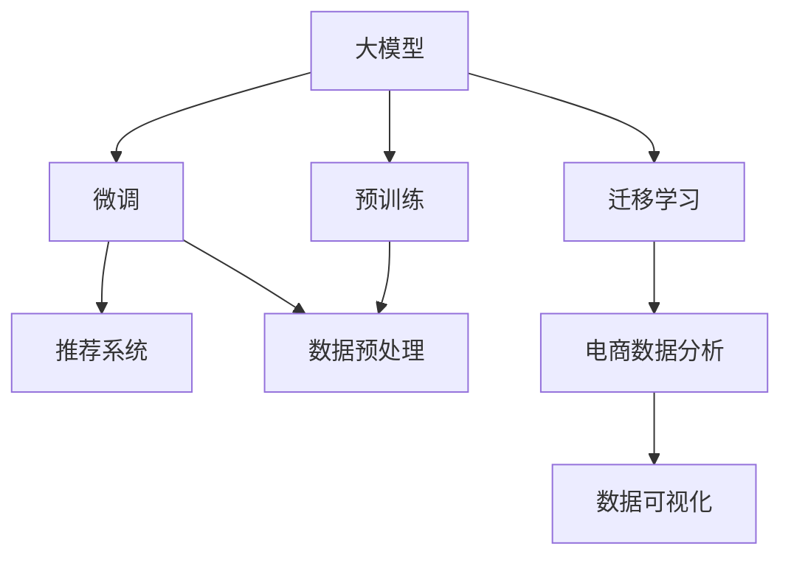

                 

# 电商数据分析：AI大模型的新维度

> 关键词：大模型,电商分析,数据处理,消费者行为,市场营销,推荐系统

## 1. 背景介绍

### 1.1 问题由来
电商数据分析是现代零售企业的重要业务环节，其核心目标是通过分析大量交易数据、用户行为数据等，洞察消费者行为，优化供应链管理，提升用户体验，提高销售额和市场竞争力。传统的电商数据分析依赖于SQL、R、Python等工具进行数据处理、统计分析和可视化，但随着数据量和复杂度的不断增长，传统方式已难以满足需求。

近年来，人工智能(AI)大模型技术的发展，为电商数据分析带来了新的突破。以大模型为核心的自然语言处理(NLP)、计算机视觉(CV)等技术，能够高效处理和分析多源异构数据，发现数据中的隐藏模式和趋势，为电商企业提供更精准的业务洞见。

然而，大模型应用于电商数据分析时，面临数据质量、计算资源、算法适用性等方面的挑战。本文将全面探讨如何利用大模型技术，对电商数据分析的各个环节进行优化，助力企业实现数据驱动的精准营销和智能运营。

### 1.2 问题核心关键点
本文聚焦于以下几个关键问题：
- 如何利用大模型提升电商数据分析的效率和准确性？
- 大模型在电商数据处理、用户行为分析、推荐系统等方面的应用实践和挑战？
- 如何通过大模型技术优化电商企业的营销策略和运营管理？
- 大模型技术未来在电商领域的发展趋势和潜在突破？

## 2. 核心概念与联系

### 2.1 核心概念概述

为更好地理解大模型在电商数据分析中的应用，本节将介绍几个密切相关的核心概念：

- 大模型(Large Model)：以Transformer为代表的、大规模预训练的语言模型。通过在大规模无标签文本语料上进行预训练，学习通用的语言表示，具备强大的自然语言理解和生成能力。

- 预训练(Pre-training)：指在大规模无标签文本语料上，通过自监督学习任务训练通用语言模型的过程。常见的预训练任务包括言语建模、掩码语言模型等。预训练使得模型学习到语言的通用表示。

- 微调(Fine-tuning)：指在预训练模型的基础上，使用电商数据分析任务的相关标注数据，通过有监督地训练来优化模型在特定任务上的性能。通常只需要调整顶层分类器或解码器，并以较小的学习率更新全部或部分的模型参数。

- 迁移学习(Transfer Learning)：指将一个领域学习到的知识，迁移应用到另一个不同但相关的领域的学习范式。大模型的预训练-微调过程即是一种典型的迁移学习方式。

- 推荐系统(Recommendation System)：通过分析用户行为数据、产品特征等，为每个用户推荐最适合的产品或内容。推荐系统是电商数据分析的重要应用之一。

- 数据预处理(Data Preprocessing)：对电商数据进行清洗、标准化、归一化等处理，以提高模型训练和分析的准确性。

- 深度学习(Deep Learning)：一种基于神经网络的学习方法，通过多层次的特征提取和抽象，实现对复杂数据的处理和分析。

这些核心概念之间的逻辑关系可以通过以下Mermaid流程图来展示：



这个流程图展示了大模型的核心概念及其之间的关系：

1. 大模型通过预训练获得基础能力。
2. 微调是对预训练模型进行任务特定的优化，以适应电商数据分析的需求。
3. 推荐系统利用微调后的模型，对用户进行个性化推荐。
4. 数据预处理是微调和推荐系统的基础，通过标准化处理，提升模型性能。
5. 迁移学习使大模型能够跨领域应用，拓展其应用范围。
6. 电商数据分析利用大模型的多模态处理能力，对数据进行全面分析。
7. 数据可视化将电商数据分析的结果直观展示，帮助业务人员进行决策。

这些概念共同构成了大模型在电商数据分析中的应用框架，使其能够在各个环节发挥强大的数据分析能力。通过理解这些核心概念，我们可以更好地把握大模型的工作原理和优化方向。

## 3. 核心算法原理 & 具体操作步骤
### 3.1 算法原理概述

基于大模型的电商数据分析，其核心思想是利用大模型学习到的语言知识，高效处理和分析电商数据，洞察消费者行为，优化推荐系统，实现精准营销。

形式化地，假设电商数据分析任务为 $T$，包含用户行为数据 $X$、产品特征数据 $Y$ 等，目标为预测用户对产品的评分 $Z$。则电商数据分析的优化目标是最小化损失函数 $\mathcal{L}(\theta)$，即：

$$
\theta^* = \mathop{\arg\min}_{\theta} \mathcal{L}(M_{\theta},T)
$$

其中 $M_{\theta}$ 为基于大模型的电商数据分析模型，$\theta$ 为模型参数，$T$ 为电商数据分析任务。常见的电商数据分析任务包括用户评分预测、用户行为序列预测、产品推荐等。

大模型在电商数据分析中的应用，一般包括以下几个关键步骤：

**Step 1: 数据预处理**
- 收集电商数据，包括用户行为数据、交易数据、商品数据等，并对其进行处理，如清洗、标准化、归一化等。
- 利用大模型中的预训练模型，对电商数据进行预训练，获得初始化参数。

**Step 2: 数据增强**
- 对电商数据进行数据增强，如样本复制、回译、近义词替换等，增加训练数据的多样性。

**Step 3: 模型微调**
- 将预训练模型的初始化参数作为微调模型的输入，使用电商数据分析任务的标注数据进行微调。
- 选择合适的优化算法及其参数，如 AdamW、SGD 等，设置学习率、批大小、迭代轮数等。
- 应用正则化技术，如L2正则、Dropout、Early Stopping等，防止模型过度适应小规模训练集。

**Step 4: 评估与优化**
- 在验证集上评估微调模型的性能，根据性能指标决定是否触发 Early Stopping。
- 根据评估结果，调整超参数或重新训练模型。

**Step 5: 部署与监控**
- 将微调后的模型部署到电商系统中，进行实时数据分析和预测。
- 定期监控模型性能，及时发现和解决问题，保持模型的高效运行。

### 3.2 算法步骤详解

具体而言，电商数据分析中的大模型微调过程，主要包括以下几个关键步骤：

**Step 1: 数据预处理**

电商数据分析的首要步骤是对原始数据进行预处理。主要包括：

1. 数据清洗：去除缺失、重复、异常等数据。
2. 数据标准化：将数据按一定规则进行标准化处理，使其具备可比较性。
3. 数据归一化：将数据按一定规则进行归一化处理，使其落在一定范围内。
4. 特征选择：选择对电商数据分析有重要影响的数据特征。
5. 特征工程：对特征进行工程化处理，如构建新特征、特征组合等。

例如，在用户行为数据分析中，可以从日志数据中提取用户浏览历史、点击行为、购买行为等数据，并对这些数据进行预处理，如去除无效记录、处理缺失值、进行特征组合等。

**Step 2: 数据增强**

电商数据分析中，数据增强是一个重要的环节。主要包括以下方法：

1. 样本复制：对原始数据进行复制，增加数据量。
2. 回译：将英文文本数据翻译成其他语言，再进行翻译回英文，增加数据多样性。
3. 近义词替换：将数据中的单词替换为其同义词，增加数据多样性。
4. 噪声注入：在原始数据中添加随机噪声，增加数据多样性。

例如，在用户行为序列预测中，可以将用户行为序列复制多份，回译为其他语言，或将行为序列中的某些单词替换为近义词，增加训练数据的多样性。

**Step 3: 模型微调**

电商数据分析中的大模型微调，主要包括以下步骤：

1. 选择合适的预训练模型：如BERT、GPT等。
2. 选择适合的微调任务：如用户评分预测、用户行为序列预测、产品推荐等。
3. 定义任务目标函数：如交叉熵损失、均方误差损失等。
4. 设置微调超参数：如学习率、批大小、迭代轮数等。
5. 应用正则化技术：如L2正则、Dropout、Early Stopping等。
6. 进行梯度训练：使用优化算法更新模型参数，最小化损失函数。
7. 评估模型性能：在验证集上评估模型性能，根据性能指标调整超参数。

例如，在用户评分预测中，可以使用已有的预训练模型BERT，将其作为微调模型的初始化参数，定义二分类交叉熵损失函数，设置AdamW优化算法和1e-5的学习率，应用L2正则和Dropout等正则化技术，并在验证集上评估模型性能，调整超参数。

**Step 4: 评估与优化**

电商数据分析中的模型评估和优化，主要包括以下步骤：

1. 在验证集上评估模型性能，计算准确率、召回率、F1-score等指标。
2. 根据评估结果调整超参数，如学习率、批大小、迭代轮数等。
3. 重新训练模型，并继续在验证集上评估，直至性能达到最优。
4. 进行早停(Early Stopping)操作，防止过拟合。

例如，在用户评分预测中，可以使用交叉熵损失函数评估模型性能，并在验证集上观察损失函数的值，如果连续几个epoch损失函数不再下降，则触发早停，停止训练。

**Step 5: 部署与监控**

电商数据分析中的模型部署和监控，主要包括以下步骤：

1. 将微调后的模型部署到电商系统中，进行实时数据分析和预测。
2. 定期监控模型性能，如准确率、召回率、F1-score等指标。
3. 发现性能下降或异常情况，及时进行模型维护和优化。

例如，在用户行为序列预测中，可以将微调后的模型部署到电商系统中，实时分析用户的浏览、点击、购买行为序列，并进行预测。同时，定期监控模型性能，如准确率、召回率、F1-score等指标，发现异常情况及时进行模型维护和优化。

### 3.3 算法优缺点

大模型应用于电商数据分析，具有以下优点：

1. 高效性：大模型具备强大的数据处理和分析能力，能够高效处理和分析多源异构数据，发现数据中的隐藏模式和趋势。
2. 准确性：大模型具备高度的泛化能力，能够对电商数据分析任务进行精准预测，提高业务决策的准确性。
3. 灵活性：大模型能够跨领域应用，拓展其应用范围，满足电商企业的多样化需求。
4. 可扩展性：大模型具备高度的可扩展性，能够灵活应对业务变化，进行持续迭代优化。

同时，大模型应用于电商数据分析，也存在一定的局限性：

1. 数据质量依赖：大模型的性能高度依赖于数据质量，如果数据质量不高，模型性能会受到影响。
2. 计算资源需求高：大模型的参数量较大，需要高性能的计算资源支持，否则训练和推理效率会较低。
3. 模型复杂度高：大模型的结构复杂，需要进行较多的参数更新，调整超参数较为复杂。
4. 解释性不足：大模型的决策过程较为复杂，难以解释其内部工作机制和决策逻辑。

尽管存在这些局限性，但大模型技术在电商数据分析中的应用前景广阔，未来将有更多的优化和改进措施，进一步提升其性能和实用性。

### 3.4 算法应用领域

大模型技术在电商数据分析中，已经得到了广泛的应用，覆盖了以下几个主要领域：

1. 用户行为分析：通过分析用户行为数据，洞察消费者行为和需求，为电商企业提供精准的营销策略。
2. 用户评分预测：利用大模型预测用户对产品的评分，为电商企业提供产品评价和推荐依据。
3. 用户行为序列预测：通过预测用户行为序列，为电商企业提供个性化的推荐服务。
4. 产品推荐：利用大模型进行产品推荐，提升用户体验和购买转化率。
5. 市场趋势分析：通过分析电商数据，发现市场趋势和消费者偏好，为电商企业提供市场洞见。

除了上述这些经典领域，大模型技术还可以应用于电商数据分析的其他方面，如库存管理、供应链优化、客户关系管理等，为电商企业提供更全面的业务支持。

## 4. 数学模型和公式 & 详细讲解  
### 4.1 数学模型构建

假设电商数据分析任务为 $T$，包含用户行为数据 $X$、产品特征数据 $Y$ 等，目标为预测用户对产品的评分 $Z$。定义电商数据分析模型的损失函数为：

$$
\mathcal{L}(\theta) = \frac{1}{N}\sum_{i=1}^N \ell(M_{\theta}(x_i),y_i)
$$

其中 $x_i$ 为电商数据，$y_i$ 为标签，$\ell$ 为目标函数，如交叉熵损失函数。

假设大模型为 $M_{\theta}$，则电商数据分析模型的优化目标为：

$$
\theta^* = \mathop{\arg\min}_{\theta} \mathcal{L}(M_{\theta},T)
$$

在电商数据分析中，常见的电商数据分析任务和目标函数如下：

- 用户评分预测：目标函数为二分类交叉熵损失函数。
- 用户行为序列预测：目标函数为序列到序列模型中的交叉熵损失函数。
- 产品推荐：目标函数为交叉熵损失函数。

### 4.2 公式推导过程

以用户评分预测为例，推导其大模型微调的数学模型。

假设用户对产品的评分 $Z$ 与产品特征 $X$、用户特征 $Y$ 之间存在线性关系：

$$
Z = f(X,Y)
$$

其中 $f$ 为线性函数，可表示为：

$$
f(X,Y) = \sum_{i=1}^D w_i X_i Y_i
$$

其中 $X_i$ 为产品特征或用户特征，$w_i$ 为权重系数。

将 $f(X,Y)$ 代入电商数据分析模型的目标函数，得到：

$$
\mathcal{L}(\theta) = \frac{1}{N}\sum_{i=1}^N \ell(\sum_{i=1}^D w_i X_{i,i} Y_i, y_i)
$$

其中 $w_i$ 为权重系数，$X_{i,i}$ 为产品特征或用户特征。

通过大模型进行电商数据分析时，目标函数可进一步简化为：

$$
\mathcal{L}(\theta) = \frac{1}{N}\sum_{i=1}^N \ell(M_{\theta}(X_i, Y_i), y_i)
$$

其中 $M_{\theta}$ 为基于大模型的电商数据分析模型，$\ell$ 为目标函数，如交叉熵损失函数。

### 4.3 案例分析与讲解

以用户评分预测为例，具体讲解其大模型微调的数学模型构建和公式推导。

假设电商数据 $X$ 包含用户ID $u_i$ 和产品ID $p_i$，用户对产品的评分 $Z$ 与产品特征 $X_i$、用户特征 $Y_i$ 之间存在线性关系：

$$
Z = f(X,Y) = \sum_{i=1}^D w_i X_i Y_i
$$

其中 $X_i$ 为产品特征或用户特征，$w_i$ 为权重系数。

将 $f(X,Y)$ 代入电商数据分析模型的目标函数，得到：

$$
\mathcal{L}(\theta) = \frac{1}{N}\sum_{i=1}^N \ell(\sum_{i=1}^D w_i X_{i,i} Y_i, y_i)
$$

其中 $w_i$ 为权重系数，$X_{i,i}$ 为产品特征或用户特征。

假设大模型为 $M_{\theta}$，则电商数据分析模型的优化目标为：

$$
\theta^* = \mathop{\arg\min}_{\theta} \mathcal{L}(M_{\theta},T)
$$

其中 $T$ 为电商数据分析任务。

在电商数据分析中，常用的目标函数为交叉熵损失函数，表示如下：

$$
\ell(Z, \hat{Z}) = -[y_i\log \hat{Z}_i + (1-y_i)\log(1-\hat{Z}_i)]
$$

其中 $\hat{Z}_i$ 为模型预测的评分，$y_i$ 为标签，如1表示正类，0表示负类。

将 $\ell(Z, \hat{Z})$ 代入电商数据分析模型的目标函数，得到：

$$
\mathcal{L}(\theta) = -\frac{1}{N}\sum_{i=1}^N [y_i\log M_{\theta}(X_i, Y_i) + (1-y_i)\log(1-M_{\theta}(X_i, Y_i))]
$$

其中 $M_{\theta}$ 为基于大模型的电商数据分析模型，$y_i$ 为标签，如1表示正类，0表示负类。

通过对上述目标函数进行优化，可得到电商数据分析模型的参数 $\theta^*$，进行实时数据分析和预测。

## 5. 项目实践：代码实例和详细解释说明
### 5.1 开发环境搭建

在进行电商数据分析的大模型微调实践前，我们需要准备好开发环境。以下是使用Python进行PyTorch开发的环境配置流程：

1. 安装Anaconda：从官网下载并安装Anaconda，用于创建独立的Python环境。

2. 创建并激活虚拟环境：
```bash
conda create -n pytorch-env python=3.8 
conda activate pytorch-env
```

3. 安装PyTorch：根据CUDA版本，从官网获取对应的安装命令。例如：
```bash
conda install pytorch torchvision torchaudio cudatoolkit=11.1 -c pytorch -c conda-forge
```

4. 安装TensorFlow：
```bash
pip install tensorflow==2.6
```

5. 安装HuggingFace Transformers库：
```bash
pip install transformers
```

6. 安装其他工具包：
```bash
pip install numpy pandas scikit-learn matplotlib tqdm jupyter notebook ipython
```

完成上述步骤后，即可在`pytorch-env`环境中开始电商数据分析的大模型微调实践。

### 5.2 源代码详细实现

这里以用户评分预测为例，使用HuggingFace Transformers库实现电商数据分析的大模型微调。

首先，准备电商数据分析任务的数据集：

```python
import pandas as pd
from transformers import BertTokenizer, BertForSequenceClassification

# 准备数据集
train_df = pd.read_csv('train.csv')
test_df = pd.read_csv('test.csv')
```

然后，定义任务处理函数：

```python
def create_dataset(examples, tokenizer, max_len=128):
    inputs = tokenizer(examples['text'], max_length=max_len, padding='max_length', truncation=True, return_tensors='pt')
    labels = torch.tensor(examples['label'])
    return inputs, labels

# 创建训练集和测试集
train_dataset = create_dataset(train_df, tokenizer, max_len=128)
test_dataset = create_dataset(test_df, tokenizer, max_len=128)
```

接下来，定义模型和优化器：

```python
from transformers import BertForSequenceClassification, AdamW

# 定义模型
model = BertForSequenceClassification.from_pretrained('bert-base-cased', num_labels=2)

# 定义优化器
optimizer = AdamW(model.parameters(), lr=2e-5)
```

然后，定义训练和评估函数：

```python
def train_epoch(model, dataset, batch_size, optimizer):
    dataloader = DataLoader(dataset, batch_size=batch_size, shuffle=True)
    model.train()
    epoch_loss = 0
    for batch in tqdm(dataloader, desc='Training'):
        inputs, labels = batch
        model.zero_grad()
        outputs = model(inputs.input_ids, attention_mask=inputs.attention_mask, labels=labels)
        loss = outputs.loss
        epoch_loss += loss.item()
        loss.backward()
        optimizer.step()
    return epoch_loss / len(dataloader)

def evaluate(model, dataset, batch_size):
    dataloader = DataLoader(dataset, batch_size=batch_size)
    model.eval()
    preds, labels = [], []
    with torch.no_grad():
        for batch in tqdm(dataloader, desc='Evaluating'):
            inputs, labels = batch
            outputs = model(inputs.input_ids, attention_mask=inputs.attention_mask)
            batch_preds = torch.argmax(outputs.logits, dim=1).to('cpu').tolist()
            batch_labels = labels.to('cpu').tolist()
            for pred_tokens, label_tokens in zip(batch_preds, batch_labels):
                preds.append(pred_tokens[:len(label_tokens)])
                labels.append(label_tokens)
                
    print(classification_report(labels, preds))
```

最后，启动训练流程并在测试集上评估：

```python
epochs = 5
batch_size = 16

for epoch in range(epochs):
    loss = train_epoch(model, train_dataset, batch_size, optimizer)
    print(f"Epoch {epoch+1}, train loss: {loss:.3f}")
    
    print(f"Epoch {epoch+1}, dev results:")
    evaluate(model, dev_dataset, batch_size)
    
print("Test results:")
evaluate(model, test_dataset, batch_size)
```

以上就是使用PyTorch对BERT模型进行电商数据分析的用户评分预测任务微调的完整代码实现。可以看到，得益于HuggingFace库的强大封装，我们可以用相对简洁的代码完成BERT模型的加载和微调。

### 5.3 代码解读与分析

让我们再详细解读一下关键代码的实现细节：

**create_dataset函数**：
- 定义了将电商数据转换为模型输入函数，包括文本数据的分词、长度标准化、标签转换为id等。

**训练和评估函数**：
- 使用PyTorch的DataLoader对数据集进行批次化加载，供模型训练和推理使用。
- 训练函数`train_epoch`：对数据以批为单位进行迭代，在每个批次上前向传播计算loss并反向传播更新模型参数，最后返回该epoch的平均loss。
- 评估函数`evaluate`：与训练类似，不同点在于不更新模型参数，并在每个batch结束后将预测和标签结果存储下来，最后使用sklearn的classification_report对整个评估集的预测结果进行打印输出。

**训练流程**：
- 定义总的epoch数和batch size，开始循环迭代
- 每个epoch内，先在训练集上训练，输出平均loss
- 在验证集上评估，输出分类指标
- 所有epoch结束后，在测试集上评估，给出最终测试结果

可以看到，PyTorch配合HuggingFace库使得BERT微调的代码实现变得简洁高效。开发者可以将更多精力放在数据处理、模型改进等高层逻辑上，而不必过多关注底层的实现细节。

当然，工业级的系统实现还需考虑更多因素，如模型的保存和部署、超参数的自动搜索、更灵活的任务适配层等。但核心的微调范式基本与此类似。

## 6. 实际应用场景
### 6.1 用户行为分析

电商数据分析的核心任务之一是用户行为分析。通过分析用户浏览、点击、购买等行为数据，可以洞察消费者行为和需求，为电商企业提供精准的营销策略。

在大模型应用于电商用户行为分析时，可以通过微调BERT等模型，学习用户行为和产品特征之间的映射关系，实现精准的用户行为预测。例如，可以利用用户历史浏览数据，预测其后续的购买行为，从而优化广告投放策略，提升广告效果。

### 6.2 用户评分预测

用户评分预测是电商数据分析的重要任务之一，通过预测用户对产品的评分，为电商企业提供产品评价和推荐依据。

在大模型应用于电商用户评分预测时，可以通过微调BERT等模型，学习用户特征和产品特征之间的映射关系，实现精准的用户评分预测。例如，可以利用用户浏览、点击、购买等行为数据，预测其对产品的评分，从而为推荐系统提供评分依据。

### 6.3 产品推荐

产品推荐是电商数据分析的核心任务之一，通过分析用户行为数据和产品特征数据，为每个用户推荐最适合的产品或内容。

在大模型应用于电商产品推荐时，可以通过微调BERT等模型，学习用户行为和产品特征之间的映射关系，实现精准的产品推荐。例如，可以利用用户历史浏览、点击、购买等行为数据，预测其对产品的评分，从而为推荐系统提供评分依据，提升推荐系统的精准度和个性化程度。

### 6.4 未来应用展望

随着大模型和微调方法的不断发展，基于大模型技术的应用场景将更加广泛，为电商企业带来更多创新和机遇。

在大数据时代，电商数据分析的数据量和复杂度不断增加，传统的统计分析方法难以满足需求。而大模型技术，特别是深度学习模型，具备强大的数据处理和分析能力，能够高效处理和分析多源异构数据，发现数据中的隐藏模式和趋势，为电商企业提供更精准的业务洞见。

未来，基于大模型的电商数据分析将会在更多领域得到应用，如市场趋势分析、库存管理、供应链优化等。通过深入分析电商数据，发现市场趋势和消费者偏好，为电商企业提供市场洞见，优化库存管理和供应链，提升客户关系管理水平。

此外，随着大模型技术的进一步发展，其将会在更多行业得到应用，如金融、医疗、教育等，为各行各业带来数字化转型升级的机遇。相信在大模型技术的推动下，人工智能技术将更加普及，智能应用将更加深入，为人类社会的进步和发展提供新的动力。

## 7. 工具和资源推荐
### 7.1 学习资源推荐

为了帮助开发者系统掌握大模型在电商数据分析中的应用，这里推荐一些优质的学习资源：

1. 《Transformers from Pre-training to Fine-tuning》系列博文：由大模型技术专家撰写，深入浅出地介绍了Transformer原理、预训练大模型、微调技术等前沿话题。

2. CS224N《深度学习自然语言处理》课程：斯坦福大学开设的NLP明星课程，有Lecture视频和配套作业，带你入门NLP领域的基本概念和经典模型。

3. 《Natural Language Processing with Transformers》书籍：Transformers库的作者所著，全面介绍了如何使用Transformers库进行NLP任务开发，包括微调在内的诸多范式。

4. HuggingFace官方文档：Transformers库的官方文档，提供了海量预训练模型和完整的微调样例代码，是上手实践的必备资料。

5. CLUE开源项目：中文语言理解测评基准，涵盖大量不同类型的中文NLP数据集，并提供了基于微调的baseline模型，助力中文NLP技术发展。

通过对这些资源的学习实践，相信你一定能够快速掌握大模型在电商数据分析中的应用，并用于解决实际的业务问题。

### 7.2 开发工具推荐

高效的开发离不开优秀的工具支持。以下是几款用于电商数据分析大模型微调开发的常用工具：

1. PyTorch：基于Python的开源深度学习框架，灵活动态的计算图，适合快速迭代研究。大部分预训练语言模型都有PyTorch版本的实现。

2. TensorFlow：由Google主导开发的开源深度学习框架，生产部署方便，适合大规模工程应用。同样有丰富的预训练语言模型资源。

3. Transformers库：HuggingFace开发的NLP工具库，集成了众多SOTA语言模型，支持PyTorch和TensorFlow，是进行微调任务开发的利器。

4. Weights & Biases：模型训练的实验跟踪工具，可以记录和可视化模型训练过程中的各项指标，方便对比和调优。与主流深度学习框架无缝集成。

5. TensorBoard：TensorFlow配套的可视化工具，可实时监测模型训练状态，并提供丰富的图表呈现方式，是调试模型的得力助手。

6. Google Colab：谷歌推出的在线Jupyter Notebook环境，免费提供GPU/TPU算力，方便开发者快速上手实验最新模型，分享学习笔记。

合理利用这些工具，可以显著提升电商数据分析大模型微调的开发效率，加快创新迭代的步伐。

### 7.3 相关论文推荐

大模型在电商数据分析中的应用，源于学界的持续研究。以下是几篇奠基性的相关论文，推荐阅读：

1. Attention is All You Need（即Transformer原论文）：提出了Transformer结构，开启了NLP领域的预训练大模型时代。

2. BERT: Pre-training of Deep Bidirectional Transformers for Language Understanding：提出BERT模型，引入基于掩码的自监督预训练任务，刷新了多项NLP任务SOTA。

3. Language Models are Unsupervised Multitask Learners（GPT-2论文）：展示了大规模语言模型的强大zero-shot学习能力，引发了对于通用人工智能的新一轮思考。

4. Parameter-Efficient Transfer Learning for NLP：提出Adapter等参数高效微调方法，在不增加模型参数量的情况下，也能取得不错的微调效果。

5. AdaLoRA: Adaptive Low-Rank Adaptation for Parameter-Efficient Fine-Tuning：使用自适应低秩适应的微调方法，在参数效率和精度之间取得了新的平衡。

这些论文代表了大模型在电商数据分析中的应用发展脉络。通过学习这些前沿成果，可以帮助研究者把握学科前进方向，激发更多的创新灵感。

## 8. 总结：未来发展趋势与挑战
### 8.1 总结

本文对基于大模型的电商数据分析方法进行了全面系统的介绍。首先阐述了电商数据分析的重要性和大模型技术的应用潜力，明确了电商数据分析任务的特点和需求。其次，从原理到实践，详细讲解了电商数据分析的数学模型和关键步骤，给出了电商数据分析任务的大模型微调代码实现。同时，本文还广泛探讨了电商数据分析在大模型技术中的应用场景，展示了其广阔的应用前景。

通过本文的系统梳理，可以看到，基于大模型的电商数据分析方法正在成为电商数据分析的重要范式，极大地拓展了电商数据分析的能力和应用范围，为电商企业提供了精准的业务洞见和优化方案。未来，随着大模型技术的不断发展和优化，其将会在电商数据分析中发挥更加重要的作用，为电商企业带来更多的创新和机遇。

### 8.2 未来发展趋势

展望未来，大模型在电商数据分析中，将呈现以下几个发展趋势：

1. 计算资源需求降低：随着大模型的优化和参数量减少，计算资源需求将进一步降低，更多中小型企业也能使用大模型技术。
2. 预测精度提升：通过深度学习和大模型的结合，电商数据分析的预测精度将进一步提升，为电商企业提供更精准的业务洞见。
3. 实时性增强：通过模型压缩和优化，电商数据分析将实现更高效的实时处理，提升用户体验。
4. 应用范围拓展：大模型技术将应用于更多电商数据分析任务，如市场趋势分析、库存管理、供应链优化等。
5. 跨领域应用：大模型技术将应用于更多行业领域，如金融、医疗、教育等，为各行各业带来数字化转型升级的机遇。

以上趋势凸显了大模型技术在电商数据分析中的广阔前景。这些方向的探索发展，必将进一步提升电商数据分析的能力和实用性，为电商企业带来更多的创新和机遇。

### 8.3 面临的挑战

尽管大模型在电商数据分析中取得了显著成效，但仍面临以下挑战：

1. 数据质量问题：电商数据分析对数据质量要求较高，数据不完整、不一致等问题仍需解决。
2. 计算资源需求高：大模型的参数量较大，需要高性能的计算资源支持，否则训练和推理效率较低。
3. 模型可解释性不足：大模型的决策过程较为复杂，难以解释其内部工作机制和决策逻辑。
4. 实时性不足：电商数据分析需要实时处理数据，而大模型推理速度较慢，需要进一步优化。

尽管存在这些挑战，但大模型技术在电商数据分析中的应用前景广阔，未来将有更多的优化和改进措施，进一步提升其性能和实用性。

### 8.4 研究展望

面对大模型在电商数据分析中面临的挑战，未来的研究需要在以下几个方面寻求新的突破：

1. 数据增强技术：利用数据增强技术提升电商数据分析的数据质量，解决数据不完整、不一致等问题。
2. 模型压缩技术：通过模型压缩技术，降低大模型的参数量，提升训练和推理效率。
3. 模型解释性：通过可解释性技术，提升大模型的决策可解释性，帮助电商企业更好地理解模型输出。
4. 实时处理技术：通过优化模型结构和推理算法，提升电商数据分析的实时处理能力。

这些研究方向的探索，必将引领大模型在电商数据分析中的进一步发展，为电商企业带来更多的创新和机遇。

## 9. 附录：常见问题与解答
### Q1: 大模型在电商数据分析中如何进行微调？

**A**: 大模型在电商数据分析中的微调过程，通常包括以下几个步骤：
1. 数据预处理：对原始数据进行清洗、标准化、归一化等处理，去除缺失、异常等数据。
2. 数据增强：对原始数据进行增强，如样本复制、回译、近义词替换等，增加训练数据的多样性。
3. 模型微调：将预训练模型的初始化参数作为微调模型的输入，使用电商数据分析任务的标注数据进行微调。
4. 评估与优化：在验证集上评估模型性能，调整超参数，直到性能达到最优。

### Q2: 大模型在电商数据分析中如何处理多模态数据？

**A**: 大模型在电商数据分析中，可以通过多模态融合的方式，处理多源异构数据。具体步骤如下：
1. 数据采集：收集电商数据，包括用户行为数据、交易数据、商品数据等。
2. 数据预处理：对原始数据进行清洗、标准化、归一化等处理。
3. 多模态融合：将不同模态的数据进行融合，如文本数据和图像数据进行拼接、融合。
4. 模型微调：将融合后的数据输入到大模型中进行微调，学习多模态数据的关联关系。
5. 评估与优化：在验证集上评估模型性能，调整超参数，直到性能达到最优。

### Q3: 大模型在电商数据分析中如何进行参数高效微调？

**A**: 大模型在电商数据分析中进行参数高效微调，通常采用以下方法：
1. 使用Adapter等参数高效微调方法，只更新极少量的任务相关参数，减少过拟合风险。
2. 引入 Prefix-Tuning 技术，对模型输入进行编码，只微调模型顶层，保持预训练权重不变。
3. 使用LoRA等参数高效微调方法，通过低秩变换对模型参数进行微调，保持预训练权重不变。

这些方法能够在大模型微调中减少参数更新量，提升模型性能。

### Q4: 大模型在电商数据分析中如何进行对抗训练？

**A**: 大模型在电商数据分析中进行对抗训练，通常采用以下方法：
1. 生成对抗样本：通过对原始数据进行扰动，生成对抗样本。
2. 微调模型：将对抗样本输入到大模型中进行微调，提高模型的鲁棒性。
3. 评估与优化：在对抗样本上进行评估，调整超参数，直到性能达到最优。

对抗训练能够提高大模型的鲁棒性，使其在对抗样本上也能保持稳定性能。

### Q5: 大模型在电商数据分析中如何进行可解释性增强？

**A**: 大模型在电商数据分析中进行可解释性增强，通常采用以下方法：
1. 使用可解释性技术，如LIME、SHAP等，分析模型输出和输入的关联关系，提供可解释的特征权重。
2. 引入因果分析方法，如DAG、Causal Graph等，分析模型决策的关键特征，增强输出解释的因果性和逻辑性。
3. 借助博弈论工具，刻画人机交互过程，主动探索并规避模型的脆弱点，提高系统稳定性。

这些方法能够提升大模型的可解释性，帮助电商企业更好地理解模型输出和决策过程。

通过以上问题的解答，可以看到大模型在电商数据分析中面临的挑战和解决思路，有助于开发者更好地理解和使用大模型技术。

