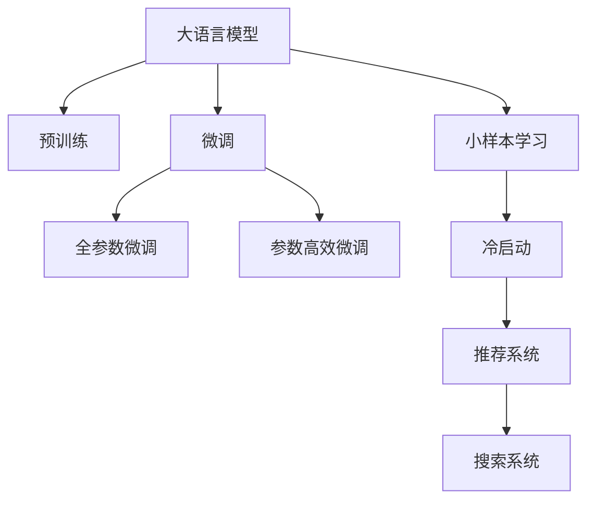

                 

# 电商行业中的小样本学习：大模型在冷启动问题中的应用

## 1. 背景介绍

### 1.1 问题由来

在电商行业，新用户的冷启动问题是一个常见但棘手的挑战。新用户加入电商平台时，通常没有历史购买数据和浏览记录，无法直接进行个性化推荐和搜索。传统的方法如召回和协同过滤，依赖大量的历史数据进行训练，难以快速适应用户行为。

大模型（如BERT、GPT等）在自然语言处理（NLP）领域已经取得了显著的突破。通过在大规模文本数据上进行预训练，大模型能够学习到丰富的语言知识和常识，并在下游任务上微调获得优异的性能。然而，在电商行业，如何利用大模型在少样本数据下的表现，进行快速高效的推荐和搜索，是一个值得深入探索的问题。

### 1.2 问题核心关键点

解决电商行业的冷启动问题，需要大模型能够快速学习新用户的行为模式，并基于有限的交互数据进行个性化推荐和搜索。大模型在少样本学习下的表现，即在小规模数据上的泛化能力，成为关键的研究方向。

具体来说，需要研究：
- 如何在电商场景下，有效利用大模型的预训练知识和微调机制，快速适应新用户的购买和浏览行为。
- 如何在有限的交互数据下，通过模型微调，获取最优的推荐和搜索结果。
- 如何设计合适的任务适配层和损失函数，优化大模型的微调效果。

## 2. 核心概念与联系

### 2.1 核心概念概述

为更好地理解大模型在电商行业中的应用，本节将介绍几个密切相关的核心概念：

- **大语言模型（Large Language Model, LLM）**：以BERT、GPT等模型为代表的大规模预训练语言模型。通过在大规模无标签文本语料上进行预训练，学习通用的语言表示，具备强大的语言理解和生成能力。
- **预训练（Pre-training）**：指在大规模无标签文本语料上，通过自监督学习任务训练通用语言模型的过程。常见的预训练任务包括掩码语言模型、下位语言模型等。
- **微调（Fine-tuning）**：指在预训练模型的基础上，使用下游任务的少量标注数据，通过有监督地训练来优化模型在特定任务上的性能。
- **小样本学习（Few-shot Learning）**：指在只有少量标注样本的情况下，模型能够快速适应新任务的学习方法。
- **冷启动（Cold-start）**：指在无历史数据的情况下，如何利用有限的信息快速适应用户行为的问题。
- **推荐系统（Recommendation System）**：利用用户的历史行为数据和个性化特征，推荐用户可能感兴趣的商品或内容。
- **搜索系统（Search System）**：帮助用户高效地检索商品或服务，解决用户的信息获取需求。

这些核心概念之间的逻辑关系可以通过以下Mermaid流程图来展示：



这个流程图展示了大语言模型的核心概念及其之间的关系：

1. 大语言模型通过预训练获得基础能力。
2. 微调是对预训练模型进行任务特定的优化，可以分为全参数微调和参数高效微调（PEFT）。
3. 小样本学习是一种在少样本数据下进行快速学习的方法。
4. 冷启动问题关注在无历史数据情况下，如何快速适应用户行为。
5. 推荐系统利用用户行为数据，为用户推荐商品或服务。
6. 搜索系统帮助用户高效地检索所需信息。

这些概念共同构成了大语言模型在电商行业中的应用框架，使其能够在推荐和搜索等任务中发挥强大的语言理解和生成能力。

## 3. 核心算法原理 & 具体操作步骤
### 3.1 算法原理概述

基于大语言模型的电商推荐和搜索系统，本质上是一个小样本学习过程。其核心思想是：利用大模型的预训练知识，通过微调机制，在有限的用户交互数据上，快速学习用户的购买和浏览行为，实现个性化推荐和搜索。

形式化地，假设预训练模型为 $M_{\theta}$，其中 $\theta$ 为预训练得到的模型参数。给定电商推荐/搜索任务的标注数据集 $D=\{(x_i, y_i)\}_{i=1}^N$，其中 $x_i$ 表示用户行为，如浏览记录、购买记录，$y_i$ 表示推荐结果或搜索结果。微调的目标是找到新的模型参数 $\hat{\theta}$，使得：

$$
\hat{\theta}=\mathop{\arg\min}_{\theta} \mathcal{L}(M_{\theta},D)
$$

其中 $\mathcal{L}$ 为针对任务 $T$ 设计的损失函数，用于衡量模型预测输出与真实标签之间的差异。常见的损失函数包括交叉熵损失、均方误差损失等。

通过梯度下降等优化算法，微调过程不断更新模型参数 $\theta$，最小化损失函数 $\mathcal{L}$，使得模型输出逼近真实标签。由于 $\theta$ 已经通过预训练获得了较好的初始化，因此即便在有限的数据集 $D$ 上进行微调，也能较快收敛到理想的模型参数 $\hat{\theta}$。

### 3.2 算法步骤详解

基于小样本学习的大语言模型电商推荐和搜索系统一般包括以下几个关键步骤：

**Step 1: 准备预训练模型和数据集**
- 选择合适的预训练语言模型 $M_{\theta}$ 作为初始化参数，如 BERT、GPT 等。
- 准备电商推荐/搜索任务的标注数据集 $D$，划分为训练集、验证集和测试集。一般要求标注数据与预训练数据的分布不要差异过大。

**Step 2: 添加任务适配层**
- 根据任务类型，在预训练模型顶层设计合适的输出层和损失函数。
- 对于推荐任务，通常在顶层添加输出层和交叉熵损失函数。
- 对于搜索任务，通常使用语言模型的解码器输出概率分布，并以负对数似然为损失函数。

**Step 3: 设置微调超参数**
- 选择合适的优化算法及其参数，如 AdamW、SGD 等，设置学习率、批大小、迭代轮数等。
- 设置正则化技术及强度，包括权重衰减、Dropout、Early Stopping等。
- 确定冻结预训练参数的策略，如仅微调顶层，或全部参数都参与微调。

**Step 4: 执行梯度训练**
- 将训练集数据分批次输入模型，前向传播计算损失函数。
- 反向传播计算参数梯度，根据设定的优化算法和学习率更新模型参数。
- 周期性在验证集上评估模型性能，根据性能指标决定是否触发 Early Stopping。
- 重复上述步骤直到满足预设的迭代轮数或 Early Stopping 条件。

**Step 5: 测试和部署**
- 在测试集上评估微调后模型 $M_{\hat{\theta}}$ 的性能，对比微调前后的精度提升。
- 使用微调后的模型对新样本进行推理预测，集成到实际的应用系统中。
- 持续收集新的数据，定期重新微调模型，以适应数据分布的变化。

以上是基于小样本学习的大语言模型电商推荐和搜索系统的一般流程。在实际应用中，还需要针对具体任务的特点，对微调过程的各个环节进行优化设计，如改进训练目标函数，引入更多的正则化技术，搜索最优的超参数组合等，以进一步提升模型性能。

### 3.3 算法优缺点

基于小样本学习的大语言模型电商推荐和搜索系统具有以下优点：
1. 简单高效。只需准备少量标注数据，即可对预训练模型进行快速适配，获得较大的性能提升。
2. 通用适用。适用于各种电商推荐和搜索任务，包括商品推荐、相关商品推荐、搜索排序等，设计简单的任务适配层即可实现微调。
3. 参数高效。利用参数高效微调技术，在固定大部分预训练权重不变的情况下，仍可取得不错的微调效果。
4. 效果显著。在学术界和工业界的诸多任务上，基于微调的方法已经刷新了最先进的性能指标。

同时，该方法也存在一定的局限性：
1. 依赖标注数据。微调的效果很大程度上取决于标注数据的质量和数量，获取高质量标注数据的成本较高。
2. 迁移能力有限。当目标任务与预训练数据的分布差异较大时，微调的性能提升有限。
3. 负面效果传递。预训练模型的固有偏见、有害信息等，可能通过微调传递到下游任务，造成负面影响。
4. 可解释性不足。微调模型的决策过程通常缺乏可解释性，难以对其推理逻辑进行分析和调试。

尽管存在这些局限性，但就目前而言，基于小样本学习的微调方法仍是大语言模型应用的主流范式。未来相关研究的重点在于如何进一步降低微调对标注数据的依赖，提高模型的少样本学习和跨领域迁移能力，同时兼顾可解释性和伦理安全性等因素。

### 3.4 算法应用领域

基于大语言模型的电商推荐和搜索系统，已经在电商推荐、商品匹配、个性化搜索等多个场景上取得了优异的效果，成为电商技术落地应用的重要手段。

- **商品推荐系统**：通过微调模型，预测用户对商品序列的兴趣程度，生成个性化推荐列表。通常使用掩码语言模型作为推荐模型，进行物品-序列对齐。
- **相关商品推荐系统**：预测用户可能对当前浏览商品的相关商品感兴趣，提升用户浏览和购买体验。通过微调模型，学习物品-物品之间的关系，生成推荐序列。
- **个性化搜索系统**：帮助用户快速找到所需商品，通过微调模型，对用户搜索意图进行语义理解，返回最相关的搜索结果。

除了上述这些经典应用外，大语言模型微调技术还创新性地应用到更多场景中，如可控文本生成、智能客服、智能广告等，为电商行业带来了新的变革。

## 4. 数学模型和公式 & 详细讲解 & 举例说明
### 4.1 数学模型构建

本节将使用数学语言对基于小样本学习的大语言模型电商推荐和搜索系统进行更加严格的刻画。

记预训练语言模型为 $M_{\theta}$，其中 $\theta$ 为预训练得到的模型参数。假设电商推荐/搜索任务的训练集为 $D=\{(x_i,y_i)\}_{i=1}^N, x_i \in \mathcal{X}, y_i \in \mathcal{Y}$。

定义模型 $M_{\theta}$ 在数据样本 $(x,y)$ 上的损失函数为 $\ell(M_{\theta}(x),y)$，则在数据集 $D$ 上的经验风险为：

$$
\mathcal{L}(\theta) = \frac{1}{N} \sum_{i=1}^N \ell(M_{\theta}(x_i),y_i)
$$

微调的优化目标是最小化经验风险，即找到最优参数：

$$
\theta^* = \mathop{\arg\min}_{\theta} \mathcal{L}(\theta)
$$

在实践中，我们通常使用基于梯度的优化算法（如SGD、Adam等）来近似求解上述最优化问题。设 $\eta$ 为学习率，$\lambda$ 为正则化系数，则参数的更新公式为：

$$
\theta \leftarrow \theta - \eta \nabla_{\theta}\mathcal{L}(\theta) - \eta\lambda\theta
$$

其中 $\nabla_{\theta}\mathcal{L}(\theta)$ 为损失函数对参数 $\theta$ 的梯度，可通过反向传播算法高效计算。

### 4.2 公式推导过程

以下我们以商品推荐任务为例，推导交叉熵损失函数及其梯度的计算公式。

假设模型 $M_{\theta}$ 在输入 $x$ 上的输出为 $\hat{y}=M_{\theta}(x) \in [0,1]$，表示用户对物品序列 $\{x_1, x_2, ..., x_k\}$ 的兴趣程度。真实标签 $y \in \{0,1\}^k$。则二分类交叉熵损失函数定义为：

$$
\ell(M_{\theta}(x),y) = -\sum_{i=1}^k y_i\log \hat{y}_i
$$

将其代入经验风险公式，得：

$$
\mathcal{L}(\theta) = -\frac{1}{N}\sum_{i=1}^N \sum_{j=1}^k y_{i,j}\log M_{\theta}(x_{i,j})
$$

根据链式法则，损失函数对参数 $\theta_k$ 的梯度为：

$$
\frac{\partial \mathcal{L}(\theta)}{\partial \theta_k} = -\frac{1}{N}\sum_{i=1}^N \sum_{j=1}^k \frac{y_{i,j}}{M_{\theta}(x_{i,j})} \frac{\partial M_{\theta}(x_{i,j})}{\partial \theta_k}
$$

其中 $\frac{\partial M_{\theta}(x_{i,j})}{\partial \theta_k}$ 可进一步递归展开，利用自动微分技术完成计算。

在得到损失函数的梯度后，即可带入参数更新公式，完成模型的迭代优化。重复上述过程直至收敛，最终得到适应电商推荐任务的最优模型参数 $\theta^*$。

## 5. 项目实践：代码实例和详细解释说明
### 5.1 开发环境搭建

在进行推荐和搜索系统开发前，我们需要准备好开发环境。以下是使用Python进行PyTorch开发的环境配置流程：

1. 安装Anaconda：从官网下载并安装Anaconda，用于创建独立的Python环境。

2. 创建并激活虚拟环境：
```bash
conda create -n pytorch-env python=3.8 
conda activate pytorch-env
```

3. 安装PyTorch：根据CUDA版本，从官网获取对应的安装命令。例如：
```bash
conda install pytorch torchvision torchaudio cudatoolkit=11.1 -c pytorch -c conda-forge
```

4. 安装Transformers库：
```bash
pip install transformers
```

5. 安装各类工具包：
```bash
pip install numpy pandas scikit-learn matplotlib tqdm jupyter notebook ipython
```

完成上述步骤后，即可在`pytorch-env`环境中开始推荐和搜索系统开发。

### 5.2 源代码详细实现

下面我们以商品推荐任务为例，给出使用Transformers库对BERT模型进行商品推荐微调的PyTorch代码实现。

首先，定义推荐任务的数据处理函数：

```python
from transformers import BertTokenizer
from torch.utils.data import Dataset
import torch

class RecommendationDataset(Dataset):
    def __init__(self, item_ids, user_ids, text, seq_lens, labels):
        self.item_ids = item_ids
        self.user_ids = user_ids
        self.text = text
        self.seq_lens = seq_lens
        self.labels = labels
        
    def __len__(self):
        return len(self.item_ids)
    
    def __getitem__(self, item):
        item_id = self.item_ids[item]
        user_id = self.user_ids[item]
        text = self.text[item]
        seq_len = self.seq_lens[item]
        label = self.labels[item]
        
        encoding = self.tokenizer(text, return_tensors='pt', max_length=self.seq_len, padding='max_length', truncation=True)
        input_ids = encoding['input_ids'][0]
        attention_mask = encoding['attention_mask'][0]
        
        return {'input_ids': input_ids, 
                'attention_mask': attention_mask,
                'item_id': item_id,
                'user_id': user_id,
                'labels': label}
```

然后，定义模型和优化器：

```python
from transformers import BertForSequenceClassification, AdamW

model = BertForSequenceClassification.from_pretrained('bert-base-cased', num_labels=1)

optimizer = AdamW(model.parameters(), lr=2e-5)
```

接着，定义训练和评估函数：

```python
from torch.utils.data import DataLoader
from tqdm import tqdm
from sklearn.metrics import roc_auc_score

device = torch.device('cuda') if torch.cuda.is_available() else torch.device('cpu')
model.to(device)

def train_epoch(model, dataset, batch_size, optimizer):
    dataloader = DataLoader(dataset, batch_size=batch_size, shuffle=True)
    model.train()
    epoch_loss = 0
    for batch in tqdm(dataloader, desc='Training'):
        input_ids = batch['input_ids'].to(device)
        attention_mask = batch['attention_mask'].to(device)
        labels = batch['labels'].to(device)
        model.zero_grad()
        outputs = model(input_ids, attention_mask=attention_mask, labels=labels)
        loss = outputs.loss
        epoch_loss += loss.item()
        loss.backward()
        optimizer.step()
    return epoch_loss / len(dataloader)

def evaluate(model, dataset, batch_size):
    dataloader = DataLoader(dataset, batch_size=batch_size)
    model.eval()
    preds, labels = [], []
    with torch.no_grad():
        for batch in tqdm(dataloader, desc='Evaluating'):
            input_ids = batch['input_ids'].to(device)
            attention_mask = batch['attention_mask'].to(device)
            labels = batch['labels'].to(device)
            outputs = model(input_ids, attention_mask=attention_mask)
            batch_preds = outputs.logits.sigmoid().tolist()
            batch_labels = labels.to('cpu').tolist()
            for pred, label in zip(batch_preds, batch_labels):
                preds.append(pred)
                labels.append(label)
                
    auc = roc_auc_score(labels, preds)
    print(f"ROC AUC Score: {auc:.4f}")
```

最后，启动训练流程并在测试集上评估：

```python
epochs = 5
batch_size = 16

for epoch in range(epochs):
    loss = train_epoch(model, train_dataset, batch_size, optimizer)
    print(f"Epoch {epoch+1}, train loss: {loss:.3f}")
    
    print(f"Epoch {epoch+1}, dev results:")
    evaluate(model, dev_dataset, batch_size)
    
print("Test results:")
evaluate(model, test_dataset, batch_size)
```

以上就是使用PyTorch对BERT进行商品推荐任务微调的完整代码实现。可以看到，得益于Transformers库的强大封装，我们可以用相对简洁的代码完成BERT模型的加载和微调。

### 5.3 代码解读与分析

让我们再详细解读一下关键代码的实现细节：

**RecommendationDataset类**：
- `__init__`方法：初始化训练样本的数据，包括物品ID、用户ID、文本、序列长度和标签。
- `__len__`方法：返回数据集的样本数量。
- `__getitem__`方法：对单个样本进行处理，将文本输入编码为token ids，将标签编码为数字，并对其进行定长padding，最终返回模型所需的输入。

**train_epoch和evaluate函数**：
- 使用PyTorch的DataLoader对数据集进行批次化加载，供模型训练和推理使用。
- 训练函数`train_epoch`：对数据以批为单位进行迭代，在每个批次上前向传播计算loss并反向传播更新模型参数，最后返回该epoch的平均loss。
- 评估函数`evaluate`：与训练类似，不同点在于不更新模型参数，并在每个batch结束后将预测和标签结果存储下来，最后使用sklearn的roc_auc_score计算AUC值。

**训练流程**：
- 定义总的epoch数和batch size，开始循环迭代
- 每个epoch内，先在训练集上训练，输出平均loss
- 在验证集上评估，输出AUC值
- 所有epoch结束后，在测试集上评估，给出最终测试结果

可以看到，PyTorch配合Transformers库使得BERT微调的代码实现变得简洁高效。开发者可以将更多精力放在数据处理、模型改进等高层逻辑上，而不必过多关注底层的实现细节。

当然，工业级的系统实现还需考虑更多因素，如模型的保存和部署、超参数的自动搜索、更灵活的任务适配层等。但核心的微调范式基本与此类似。

## 6. 实际应用场景
### 6.1 智能客服系统

基于大语言模型微调的对话技术，可以广泛应用于智能客服系统的构建。传统客服往往需要配备大量人力，高峰期响应缓慢，且一致性和专业性难以保证。而使用微调后的对话模型，可以7x24小时不间断服务，快速响应客户咨询，用自然流畅的语言解答各类常见问题。

在技术实现上，可以收集企业内部的历史客服对话记录，将问题和最佳答复构建成监督数据，在此基础上对预训练对话模型进行微调。微调后的对话模型能够自动理解用户意图，匹配最合适的答案模板进行回复。对于客户提出的新问题，还可以接入检索系统实时搜索相关内容，动态组织生成回答。如此构建的智能客服系统，能大幅提升客户咨询体验和问题解决效率。

### 6.2 金融舆情监测

金融机构需要实时监测市场舆论动向，以便及时应对负面信息传播，规避金融风险。传统的人工监测方式成本高、效率低，难以应对网络时代海量信息爆发的挑战。基于大语言模型微调的文本分类和情感分析技术，为金融舆情监测提供了新的解决方案。

具体而言，可以收集金融领域相关的新闻、报道、评论等文本数据，并对其进行主题标注和情感标注。在此基础上对预训练语言模型进行微调，使其能够自动判断文本属于何种主题，情感倾向是正面、中性还是负面。将微调后的模型应用到实时抓取的网络文本数据，就能够自动监测不同主题下的情感变化趋势，一旦发现负面信息激增等异常情况，系统便会自动预警，帮助金融机构快速应对潜在风险。

### 6.3 个性化推荐系统

当前的推荐系统往往只依赖用户的历史行为数据进行物品推荐，无法深入理解用户的真实兴趣偏好。基于大语言模型微调技术，个性化推荐系统可以更好地挖掘用户行为背后的语义信息，从而提供更精准、多样的推荐内容。

在实践中，可以收集用户浏览、点击、评论、分享等行为数据，提取和用户交互的物品标题、描述、标签等文本内容。将文本内容作为模型输入，用户的后续行为（如是否点击、购买等）作为监督信号，在此基础上微调预训练语言模型。微调后的模型能够从文本内容中准确把握用户的兴趣点。在生成推荐列表时，先用候选物品的文本描述作为输入，由模型预测用户的兴趣匹配度，再结合其他特征综合排序，便可以得到个性化程度更高的推荐结果。

### 6.4 未来应用展望

随着大语言模型微调技术的发展，基于微调范式将在更多领域得到应用，为传统行业带来变革性影响。

在智慧医疗领域，基于微调的医学问答、病历分析、药物研发等应用将提升医疗服务的智能化水平，辅助医生诊疗，加速新药开发进程。

在智能教育领域，微调技术可应用于作业批改、学情分析、知识推荐等方面，因材施教，促进教育公平，提高教学质量。

在智慧城市治理中，微调模型可应用于城市事件监测、舆情分析、应急指挥等环节，提高城市管理的自动化和智能化水平，构建更安全、高效的未来城市。

此外，在企业生产、社会治理、文娱传媒等众多领域，基于大模型微调的人工智能应用也将不断涌现，为经济社会发展注入新的动力。相信随着技术的日益成熟，微调方法将成为人工智能落地应用的重要范式，推动人工智能技术在各个垂直行业的规模化应用。

## 7. 工具和资源推荐
### 7.1 学习资源推荐

为了帮助开发者系统掌握大语言模型微调的理论基础和实践技巧，这里推荐一些优质的学习资源：

1. 《Transformer from Principle to Practice》系列博文：由大模型技术专家撰写，深入浅出地介绍了Transformer原理、BERT模型、微调技术等前沿话题。

2. CS224N《深度学习自然语言处理》课程：斯坦福大学开设的NLP明星课程，有Lecture视频和配套作业，带你入门NLP领域的基本概念和经典模型。

3. 《Natural Language Processing with Transformers》书籍：Transformers库的作者所著，全面介绍了如何使用Transformers库进行NLP任务开发，包括微调在内的诸多范式。

4. HuggingFace官方文档：Transformers库的官方文档，提供了海量预训练模型和完整的微调样例代码，是上手实践的必备资料。

5. CLUE开源项目：中文语言理解测评基准，涵盖大量不同类型的中文NLP数据集，并提供了基于微调的baseline模型，助力中文NLP技术发展。

通过对这些资源的学习实践，相信你一定能够快速掌握大语言模型微调的精髓，并用于解决实际的NLP问题。
###  7.2 开发工具推荐

高效的开发离不开优秀的工具支持。以下是几款用于大语言模型微调开发的常用工具：

1. PyTorch：基于Python的开源深度学习框架，灵活动态的计算图，适合快速迭代研究。大部分预训练语言模型都有PyTorch版本的实现。

2. TensorFlow：由Google主导开发的开源深度学习框架，生产部署方便，适合大规模工程应用。同样有丰富的预训练语言模型资源。

3. Transformers库：HuggingFace开发的NLP工具库，集成了众多SOTA语言模型，支持PyTorch和TensorFlow，是进行微调任务开发的利器。

4. Weights & Biases：模型训练的实验跟踪工具，可以记录和可视化模型训练过程中的各项指标，方便对比和调优。与主流深度学习框架无缝集成。

5. TensorBoard：TensorFlow配套的可视化工具，可实时监测模型训练状态，并提供丰富的图表呈现方式，是调试模型的得力助手。

6. Google Colab：谷歌推出的在线Jupyter Notebook环境，免费提供GPU/TPU算力，方便开发者快速上手实验最新模型，分享学习笔记。

合理利用这些工具，可以显著提升大语言模型微调任务的开发效率，加快创新迭代的步伐。

### 7.3 相关论文推荐

大语言模型和微调技术的发展源于学界的持续研究。以下是几篇奠基性的相关论文，推荐阅读：

1. Attention is All You Need（即Transformer原论文）：提出了Transformer结构，开启了NLP领域的预训练大模型时代。

2. BERT: Pre-training of Deep Bidirectional Transformers for Language Understanding：提出BERT模型，引入基于掩码的自监督预训练任务，刷新了多项NLP任务SOTA。

3. Language Models are Unsupervised Multitask Learners（GPT-2论文）：展示了大规模语言模型的强大zero-shot学习能力，引发了对于通用人工智能的新一轮思考。

4. Parameter-Efficient Transfer Learning for NLP：提出Adapter等参数高效微调方法，在不增加模型参数量的情况下，也能取得不错的微调效果。

5. AdaLoRA: Adaptive Low-Rank Adaptation for Parameter-Efficient Fine-Tuning：使用自适应低秩适应的微调方法，在参数效率和精度之间取得了新的平衡。

这些论文代表了大语言模型微调技术的发展脉络。通过学习这些前沿成果，可以帮助研究者把握学科前进方向，激发更多的创新灵感。

## 8. 总结：未来发展趋势与挑战
### 8.1 总结

本文对基于小样本学习的大语言模型电商推荐和搜索系统进行了全面系统的介绍。首先阐述了电商行业的冷启动问题和大模型在少样本学习下的应用前景，明确了小样本学习在大模型微调中的独特价值。其次，从原理到实践，详细讲解了小样本学习下大模型的微调过程，给出了微调任务开发的完整代码实例。同时，本文还广泛探讨了小样本学习在大语言模型中的应用场景，展示了其巨大的潜力。此外，本文精选了小样本学习的各类学习资源，力求为读者提供全方位的技术指引。

通过本文的系统梳理，可以看到，基于小样本学习的大语言模型微调方法在电商推荐和搜索等任务中表现优异，具有简单高效、通用适用、参数高效等优点，能够快速适应新用户的购买和浏览行为，提升电商平台的个性化推荐和搜索效果。未来，随着技术的不断进步，小样本学习还将拓展到更多领域，如金融舆情监测、智能客服、个性化推荐等，为各行各业带来更智能、更高效、更个性化的解决方案。

### 8.2 未来发展趋势

展望未来，小样本学习技术将呈现以下几个发展趋势：

1. 模型规模持续增大。随着算力成本的下降和数据规模的扩张，预训练语言模型的参数量还将持续增长。超大规模语言模型蕴含的丰富语言知识，有望支撑更加复杂多变的下游任务微调。

2. 小样本学习技术日益成熟。未来的研究将更多关注如何设计更高效的小样本学习算法，减少对标注数据的依赖，提高模型在少样本数据上的泛化能力。

3. 多模态小样本学习兴起。当前的小样本学习主要聚焦于纯文本数据，未来会拓展到图像、视频、语音等多模态数据的小样本学习。多模态信息的融合，将显著提升语言模型对现实世界的理解和建模能力。

4. 小样本学习与大模型的深度结合。通过引入大模型的预训练知识，小样本学习模型将能够更好地捕捉长尾、罕见事件，提升在极端数据条件下的性能。

5. 小样本学习的多任务学习。将多个小样本学习任务结合，通过迁移学习等方法，提升模型在不同任务上的泛化能力。

6. 小样本学习在低资源场景中的应用。针对资源受限环境，探索轻量级的小样本学习模型，降低计算和内存需求。

以上趋势凸显了小样本学习技术的广阔前景。这些方向的探索发展，必将进一步提升小样本学习在多领域的应用效果，为智能系统带来更多的创新潜力。

### 8.3 面临的挑战

尽管小样本学习技术已经取得了显著进展，但在迈向更加智能化、普适化应用的过程中，它仍面临着诸多挑战：

1. 标注成本瓶颈。尽管小样本学习能够在少量标注数据下取得优异效果，但获取高质量标注数据的成本仍然较高，限制了其在某些场景中的应用。

2. 模型鲁棒性不足。小样本学习模型在面对噪声数据和长尾数据时，泛化能力较弱，需要进一步提升模型的鲁棒性和泛化能力。

3. 计算效率低下。大模型的计算复杂度较高，小样本学习模型往往需要较长的训练时间，难以满足实时应用的需求。

4. 可解释性不足。小样本学习模型通常难以解释其内部决策过程，难以满足一些高风险领域（如金融、医疗等）对模型可解释性的要求。

5. 数据隐私问题。小样本学习模型可能通过用户数据进行微调，存在数据隐私泄露的风险，需要加强数据保护和隐私管理。

6. 模型偏见。小样本学习模型可能继承预训练模型的偏见，带来潜在的偏见和歧视风险，需要进一步优化模型的公平性和公正性。

尽管存在这些挑战，但小样本学习技术以其高效、灵活的优势，在未来智能系统中仍将发挥重要作用。研究者需要积极应对并寻求突破，以进一步提升小样本学习模型的性能和应用范围。

### 8.4 研究展望

面对小样本学习所面临的种种挑战，未来的研究需要在以下几个方面寻求新的突破：

1. 探索无监督和半监督小样本学习方法。摆脱对大规模标注数据的依赖，利用自监督学习、主动学习等无监督和半监督范式，最大限度利用非结构化数据，实现更加灵活高效的小样本学习。

2. 研究参数高效和计算高效的小样本学习范式。开发更加参数高效的小样本学习算法，在固定大部分预训练参数的同时，只更新极少量的任务相关参数。同时优化小样本学习模型的计算图，减少前向传播和反向传播的资源消耗，实现更加轻量级、实时性的部署。

3. 融合因果和对比学习范式。通过引入因果推断和对比学习思想，增强小样本学习模型建立稳定因果关系的能力，学习更加普适、鲁棒的语言表征，从而提升模型泛化性和抗干扰能力。

4. 引入更多先验知识。将符号化的先验知识，如知识图谱、逻辑规则等，与神经网络模型进行巧妙融合，引导小样本学习过程学习更准确、合理的语言模型。同时加强不同模态数据的整合，实现视觉、语音等多模态信息与文本信息的协同建模。

5. 结合因果分析和博弈论工具。将因果分析方法引入小样本学习模型，识别出模型决策的关键特征，增强输出解释的因果性和逻辑性。借助博弈论工具刻画人机交互过程，主动探索并规避模型的脆弱点，提高系统稳定性。

6. 纳入伦理道德约束。在小样本学习模型的训练目标中引入伦理导向的评估指标，过滤和惩罚有偏见、有害的输出倾向。同时加强人工干预和审核，建立模型行为的监管机制，确保输出符合人类价值观和伦理道德。

这些研究方向的探索，必将引领小样本学习技术迈向更高的台阶，为构建安全、可靠、可解释、可控的智能系统铺平道路。面向未来，小样本学习技术还需要与其他人工智能技术进行更深入的融合，如知识表示、因果推理、强化学习等，多路径协同发力，共同推动自然语言理解和智能交互系统的进步。只有勇于创新、敢于突破，才能不断拓展小样本学习模型的边界，让智能技术更好地造福人类社会。

## 9. 附录：常见问题与解答

**Q1：电商推荐系统如何利用大模型进行个性化推荐？**

A: 电商推荐系统利用大模型的预训练知识，通过微调机制，在有限的用户交互数据上，快速学习用户的购买和浏览行为，实现个性化推荐。具体步骤如下：
1. 收集用户的历史浏览和购买记录，将记录转换为文本形式。
2. 使用大模型的预训练模型对文本进行编码，提取特征表示。
3. 通过微调机制，优化模型参数，使得模型能够学习到用户兴趣的表示。
4. 在推荐时，将用户输入的新查询转换为文本，输入到大模型中，得到用户的兴趣表示。
5. 将用户兴趣表示与商品特征表示进行匹配，计算相似度，推荐最相关的商品。

**Q2：小样本学习在大模型电商推荐中如何避免过拟合？**

A: 小样本学习在大模型电商推荐中，由于数据量较少，容易过拟合。以下是几种常见的避免过拟合的方法：
1. 数据增强：通过数据增强技术，如数据扩充、随机化等，增加训练数据的多样性。
2. 正则化：使用L2正则、Dropout等正则化技术，防止模型过拟合。
3. 早停机制：通过早停机制，在验证集上的性能不再提升时停止训练，避免过拟合。
4. 参数高效微调：只更新一小部分模型参数，如 Adapter、Prefix等，避免全参数微调带来的过拟合风险。

**Q3：大模型电商推荐系统的性能如何评估？**

A: 大模型电商推荐系统的性能评估通常使用以下指标：
1. 点击率（CTR）：衡量推荐商品被用户点击的概率，反映推荐效果。
2. 转化率（CVR）：衡量推荐商品被用户购买或使用的概率，反映推荐的效果。
3. 平均评分（AR）：衡量用户对推荐商品的平均评分，反映推荐的质量。
4. 覆盖率（CR）：衡量推荐商品覆盖用户行为的概率，反映推荐的全面性。

**Q4：小样本学习如何处理长尾数据？**

A: 长尾数据是指在数据集中，少数数据项占比远大于多数数据项的情况。小样本学习处理长尾数据的方法包括：
1. 采样：通过欠采样或重采样技术，平衡长尾数据和多数数据的比例。
2. 注意力机制：使用注意力机制，对长尾数据给予更多的关注，提高其重要性。
3. 多任务学习：将长尾数据和多数数据结合，通过多任务学习提升模型在长尾数据上的性能。

**Q5：如何评估小样本学习在大模型推荐系统中的效果？**

A: 小样本学习在大模型推荐系统中的效果评估，通常包括以下步骤：
1. 数据准备：收集和预处理用户历史行为数据，标注数据集。
2. 模型微调：使用小样本学习算法对大模型进行微调，学习用户兴趣表示。
3. 评估指标：使用CTR、CVR、AR等指标评估推荐效果，使用CR评估推荐覆盖面。
4. A/B测试：将微调后的推荐系统与基线系统进行对比，评估推荐效果提升。
5. 用户反馈：收集用户对推荐结果的反馈，进一步优化推荐算法。

**Q6：小样本学习在大模型推荐系统中的优势和劣势？**

A: 小样本学习在大模型推荐系统中的优势包括：
1. 快速适应新用户：小样本学习可以快速适应新用户的行为，减少用户历史数据的依赖。
2. 高效计算：小样本学习算法计算复杂度较低，能够快速训练模型。
3. 泛化能力强：小样本学习算法在少量数据下也能取得不错的效果。

劣势包括：
1. 数据依赖：小样本学习对标注数据的质量和数量要求较高，获取高质量标注数据的成本较高。
2. 鲁棒性不足：小样本学习模型在面对噪声数据和长尾数据时，泛化能力较弱。
3. 可解释性不足：小样本学习模型的决策过程难以解释，难以满足一些高风险领域对模型可解释性的要求。

总之，小样本学习技术在大模型推荐系统中具有快速适应、高效计算等优势，但也存在数据依赖、鲁棒性不足等挑战，需要进一步优化和完善。

---

作者：禅与计算机程序设计艺术 / Zen and the Art of Computer Programming

