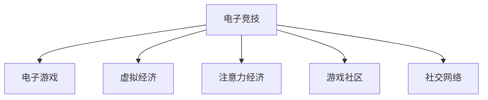

                 

# 电子竞技：注意力经济的新宠儿

> 关键词：电子竞技, 电子游戏, 虚拟经济, 注意力经济, 游戏社区, 社交网络

## 1. 背景介绍

### 1.1 问题由来

电子竞技（Electronic Sports，简称eSports或eSport），通常指基于电子游戏展开的竞争性活动，涵盖了从桌面游戏到移动游戏，从单人生存游戏到多人合作游戏等多种形式。作为21世纪互联网时代的新兴产物，电子竞技自诞生以来，其市场规模和影响力迅速膨胀，成为全球范围内的热门话题。

近年来，电子竞技的商业化和专业化程度不断提升，涌现出诸多国际性的电竞赛事和平台。例如，《英雄联盟》、《DOTA2》、《王者荣耀》等游戏的职业联赛吸引了全球数亿观众，并创造了巨大的商业价值。据统计，2020年全球电子竞技市场规模已超过10亿美元，其中中国市场贡献了其中的三分之一以上。

### 1.2 问题核心关键点

电子竞技的兴起，不仅推动了游戏产业的繁荣，也催生了新的商业模式和社交生态。从本质上讲，电子竞技是一种注意力经济，其核心在于通过高度互动的游戏体验，吸引玩家的注意，并创造商业价值。电子竞技的核心竞争力在于其吸引力的游戏设计和高度互动的社区环境，使其成为年轻人群体中极受欢迎的活动。

### 1.3 问题研究意义

电子竞技对现代社会的影响深远，其研究价值在于揭示和理解这一新兴领域的运作机制和发展趋势，进而为政策制定、市场投资和相关产业的发展提供指导。电子竞技作为一个高度动态和多样化的领域，其研究有助于推动跨学科合作，促进新兴技术的开发和应用，同时对提升公众的科技素养和社交技能也有积极作用。

## 2. 核心概念与联系

### 2.1 核心概念概述

要深入理解电子竞技背后的原理，首先需要理解几个核心概念：

- **电子竞技（Electronic Sports, eSports）**：指基于电子游戏展开的竞争性活动，涵盖从桌面游戏到移动游戏，从单人生存游戏到多人合作游戏等多种形式。

- **电子游戏（Video Games）**：指由电子硬件设备控制的游戏，包括主机游戏、PC游戏、移动游戏等多种类型。

- **虚拟经济（Virtual Economy）**：指以数字形式存在的经济活动，如电子竞技、虚拟现实游戏等。

- **注意力经济（Attention Economy）**：指通过吸引用户注意力来创造商业价值，与传统经济通过生产商品或服务不同，注意力经济更加依赖于用户体验和互动性。

- **游戏社区（Gaming Community）**：指围绕特定游戏形成的在线交流平台和社交网络，如Reddit、Discord等。

- **社交网络（Social Network）**：指通过电子设备将用户连接起来，用于信息共享和互动的平台，如Facebook、Twitter等。

这些概念之间的逻辑关系可以通过以下Mermaid流程图来展示：



这个流程图展示了一个简单的电子竞技生态系统：

1. 电子竞技依托于电子游戏，通过高度互动的游戏体验吸引玩家。
2. 电子竞技创造了虚拟经济，包括游戏内购、赛事赞助、广告收入等多种形式。
3. 电子竞技是注意力经济的重要组成部分，通过吸引玩家的注意力创造商业价值。
4. 电子竞技构建了游戏社区和社交网络，成为玩家交流和互动的平台。

## 3. 核心算法原理 & 具体操作步骤

### 3.1 算法原理概述

电子竞技的背后，实际上有一套复杂的算法体系支撑。这一体系不仅包括游戏设计、玩家行为分析、赛事组织，还涵盖了广告投放、社交网络互动等多个方面。其核心原理可以概括为以下几个方面：

- **游戏设计**：游戏设计是电子竞技的基础。通过精心设计的关卡、任务和角色，创造出具有吸引力的游戏体验，从而吸引玩家。

- **玩家行为分析**：通过数据分析和机器学习技术，分析玩家的游戏行为、偏好和互动模式，进而提供个性化的游戏体验和广告内容。

- **赛事组织**：赛事组织是电子竞技的重要组成部分。通过高效的赛事管理和规则设计，吸引更多玩家参与，并创造更高的观众参与度和互动性。

- **广告投放**：在电子竞技赛事和平台上，广告是重要的收入来源。通过精准的广告投放，提高广告转化率，创造更多商业价值。

- **社交网络互动**：电子竞技社区和社交网络是电子竞技的重要组成部分。通过社交网络的互动和传播，增强游戏的吸引力和粘性，提升用户参与度。

### 3.2 算法步骤详解

电子竞技的算法体系可以分为以下几个关键步骤：

**Step 1: 游戏设计**

- 确定游戏类型和规则，设计游戏场景、角色和任务。
- 采用迭代设计方法，通过A/B测试等手段，不断优化游戏设计。
- 引入大数据分析和机器学习技术，实时监控玩家行为和反馈，进行持续优化。

**Step 2: 玩家行为分析**

- 收集玩家游戏数据，包括点击率、停留时间、游戏完成率等。
- 应用机器学习模型，如分类、聚类、回归等，分析玩家行为模式。
- 利用自然语言处理技术，分析玩家评论、反馈和社交媒体互动内容，提升用户满意度和参与度。

**Step 3: 赛事组织**

- 设计赛事规则和流程，确保公平性和观赏性。
- 采用高性能计算和数据管理系统，确保赛事的稳定和高效。
- 利用社交媒体和直播平台，进行赛事推广和互动，提升赛事影响力。

**Step 4: 广告投放**

- 分析目标受众的特征和偏好，制定精准的广告策略。
- 应用机器学习算法，预测广告效果，进行智能投放。
- 利用大数据分析和社交网络传播，提高广告的转化率和效果。

**Step 5: 社交网络互动**

- 设计社交网络平台，如论坛、聊天室、社区等，促进玩家互动。
- 利用数据分析和机器学习技术，分析玩家互动模式和兴趣，提供个性化的社交体验。
- 通过社交网络传播，增强游戏的吸引力和粘性，提升用户参与度。

### 3.3 算法优缺点

电子竞技的算法体系具有以下优点：

- 高度互动性：通过游戏设计、赛事组织和社交网络互动，电子竞技具备高度互动性，吸引大量玩家参与。
- 数据驱动：电子竞技通过大量数据驱动算法优化，提高了游戏的公平性、观赏性和用户体验。
- 商业潜力：电子竞技的虚拟经济和广告收入模式，创造了巨大的商业价值。

同时，电子竞技的算法体系也存在一些局限性：

- 依赖于技术支持：电子竞技的算法体系高度依赖于先进的技术支持和持续的优化，否则容易出现性能问题。
- 数据隐私风险：大量的游戏数据和玩家信息，存在数据隐私和安全的风险。
- 市场波动大：电子竞技市场受到游戏设计、赛事影响和社交网络互动等多方面因素影响，市场波动较大。

### 3.4 算法应用领域

电子竞技的算法体系在以下几个领域得到了广泛应用：

- **游戏设计**：在游戏开发过程中，利用数据分析和机器学习技术，优化游戏设计和平衡性，提升用户体验。
- **玩家行为分析**：在电子竞技运营中，通过玩家行为分析，提供个性化的游戏体验和广告内容，提升用户粘性和参与度。
- **赛事组织**：在大型电子竞技赛事中，通过高性能计算和数据管理系统，确保赛事的稳定和高效。
- **广告投放**：在电子竞技平台上，通过精准的广告投放，提高广告转化率，创造更多的商业价值。
- **社交网络互动**：在电子竞技社区和社交网络中，通过数据分析和机器学习技术，增强玩家互动，提升社区活力。

## 4. 数学模型和公式 & 详细讲解 & 举例说明

### 4.1 数学模型构建

电子竞技的算法体系涉及多个领域，如游戏设计、数据分析、赛事组织等。以下分别介绍这些领域的数学模型构建：

**游戏设计**

游戏设计模型通常涉及游戏规则、角色行为和任务完成等多个方面。例如，一款策略类游戏，可以通过以下数学模型来描述玩家行为：

- 玩家角色移动：
$$ x_{t+1} = x_t + v_t \Delta t $$
其中，$x_t$ 为玩家角色在时间$t$的位置，$v_t$ 为玩家角色在时间$t$的速度，$\Delta t$ 为时间步长。

- 任务完成概率：
$$ P(t) = \frac{1}{1 + e^{-\beta(t - t_0)}} $$
其中，$P(t)$ 为玩家在时间$t$完成任务的概率，$\beta$ 为完成任务的速率，$t_0$ 为任务开始时间。

**玩家行为分析**

玩家行为分析模型通常涉及分类、聚类、回归等任务。例如，利用机器学习模型对玩家行为进行分类，可以采用决策树、随机森林等算法：

- 分类模型：
$$ \hat{y} = \arg\max_{c \in C} P(c|x) $$
其中，$\hat{y}$ 为预测结果，$C$ 为类别集合，$P(c|x)$ 为给定输入$x$下，属于类别$c$的概率。

**赛事组织**

赛事组织模型通常涉及时间安排、比赛排名和规则制定等多个方面。例如，可以采用时间复杂度为$O(n^2)$的算法来计算所有玩家的排名：

- 排名计算：
$$ rank(i) = \sum_{j=1}^{i-1} \mathbb{I}(win_i \neq win_j) $$
其中，$rank(i)$ 为玩家$i$的排名，$win_i$ 为玩家$i$获胜的比赛数。

**广告投放**

广告投放模型通常涉及目标受众的特征分析和广告效果预测。例如，利用线性回归模型预测广告转化率：

- 广告效果预测：
$$ \hat{y} = \beta_0 + \sum_{i=1}^p \beta_i x_i + \epsilon $$
其中，$\hat{y}$ 为预测广告转化率，$\beta_0, \beta_i$ 为模型参数，$x_i$ 为广告特征，$\epsilon$ 为误差项。

**社交网络互动**

社交网络互动模型通常涉及用户互动和社区活跃度的预测。例如，利用指数平滑方法预测用户互动次数：

- 用户互动预测：
$$ \hat{y}_t = \alpha y_{t-1} + (1 - \alpha) \frac{1}{\sum_{i=1}^{t-1} y_i} \sum_{i=1}^{t-1} y_i $$

### 4.2 公式推导过程

以下对上述模型进行简要推导：

**游戏设计**

- 玩家角色移动：
$$ x_{t+1} = x_t + v_t \Delta t $$
该模型基于牛顿第二定律，描述玩家角色在二维空间中的移动轨迹。

- 任务完成概率：
$$ P(t) = \frac{1}{1 + e^{-\beta(t - t_0)}} $$
该模型基于逻辑回归，描述玩家在特定时间段内完成任务的概率，$\beta$ 和 $t_0$ 通过数据拟合得到。

**玩家行为分析**

- 分类模型：
$$ \hat{y} = \arg\max_{c \in C} P(c|x) $$
该模型基于最大似然估计，通过训练决策树或随机森林等算法，预测玩家行为属于哪个类别。

**赛事组织**

- 排名计算：
$$ rank(i) = \sum_{j=1}^{i-1} \mathbb{I}(win_i \neq win_j) $$
该模型基于排序算法，计算所有玩家的排名，$\mathbb{I}(win_i \neq win_j)$ 表示玩家$i$和玩家$j$是否获胜。

**广告投放**

- 广告效果预测：
$$ \hat{y} = \beta_0 + \sum_{i=1}^p \beta_i x_i + \epsilon $$
该模型基于线性回归，预测广告的转化率，$\beta_i$ 和 $\epsilon$ 通过数据拟合得到。

**社交网络互动**

- 用户互动预测：
$$ \hat{y}_t = \alpha y_{t-1} + (1 - \alpha) \frac{1}{\sum_{i=1}^{t-1} y_i} \sum_{i=1}^{t-1} y_i $$
该模型基于指数平滑方法，预测用户互动次数，$\alpha$ 为平滑系数。

### 4.3 案例分析与讲解

以下以《英雄联盟》（League of Legends, LoL）的赛事组织为例，展示如何应用上述算法：

**游戏设计**

- 地图设计：LoL采用3D地图，通过分析地图的特征和玩家行为，设计出了丰富多样的地图元素。
- 角色设计：LoL拥有超过120个英雄角色，每个角色都有独特的技能和属性，通过数据分析优化平衡性。

**玩家行为分析**

- 行为数据收集：LoL通过游戏内分析工具和第三方数据平台，收集了大量的玩家行为数据。
- 模型训练：LoL使用机器学习模型，如决策树、随机森林等，对玩家行为进行分类，例如分为休闲玩家、竞技玩家等。

**赛事组织**

- 时间安排：LoL采用循环赛和淘汰赛两种方式进行比赛，确保比赛过程公平、高效。
- 规则制定：LoL通过数据分析和玩家反馈，不断优化比赛规则，例如调整地图布局、修改英雄技能等。

**广告投放**

- 目标受众分析：LoL通过数据分析，识别出目标受众的特征和偏好，制定精准的广告策略。
- 广告效果预测：LoL使用线性回归模型，预测广告的转化率，提高广告的投放效率。

**社交网络互动**

- 社区管理：LoL通过社交网络平台（如Discord），增强玩家互动，提升社区活跃度。
- 互动预测：LoL使用指数平滑方法，预测用户互动次数，优化社区管理策略。

## 5. 项目实践：代码实例和详细解释说明

### 5.1 开发环境搭建

在进行电子竞技项目开发前，首先需要准备好开发环境。以下是使用Python进行电子竞技开发的环境配置流程：

1. 安装Anaconda：从官网下载并安装Anaconda，用于创建独立的Python环境。

2. 创建并激活虚拟环境：
```bash
conda create -n games-env python=3.8 
conda activate games-env
```

3. 安装游戏开发工具和库：
```bash
pip install pygame pyglet kivy pyopengl pyglet-parametric paramiko
```

4. 安装数据分析和机器学习库：
```bash
pip install pandas numpy scikit-learn seaborn matplotlib joblib
```

5. 安装数据库和网络通信库：
```bash
pip install sqlite3 pymysql
```

完成上述步骤后，即可在`games-env`环境中开始电子竞技项目开发。

### 5.2 源代码详细实现

这里我们以LoL的赛事组织为例，展示如何使用Python实现电子竞技赛事的排名计算和广告效果预测：

```python
import pandas as pd
import numpy as np
from sklearn.linear_model import LinearRegression
from sklearn.tree import DecisionTreeClassifier
from sklearn.ensemble import RandomForestClassifier

# 假设LoL的赛事数据为csv文件，包含玩家ID、比赛胜利数和排名信息
data = pd.read_csv('league_data.csv')

# 计算排名
def calculate_rank(data):
    # 初始化排名列
    data['rank'] = np.zeros(len(data))
    
    # 按比赛胜利数排序，依次赋排名
    sorted_data = data.sort_values(by='wins', ascending=False)
    rank_list = list(range(1, len(sorted_data) + 1))
    sorted_data['rank'] = rank_list
    
    return sorted_data

# 使用线性回归预测广告效果
def predict_ad_effect(data, features, target):
    X = data[features]
    y = data[target]
    
    # 训练线性回归模型
    reg = LinearRegression()
    reg.fit(X, y)
    
    # 使用模型预测新样本的广告效果
    new_data = pd.DataFrame({'wins': np.array([1, 2, 3]), 'age': np.array([20, 25, 30]}, index=['player1', 'player2', 'player3']))
    predictions = reg.predict(new_data[features])
    
    return predictions

# 使用决策树分类预测玩家行为
def predict_player_behavior(data, features, target):
    X = data[features]
    y = data[target]
    
    # 训练决策树模型
    clf = DecisionTreeClassifier()
    clf.fit(X, y)
    
    # 使用模型预测新样本的玩家行为
    new_data = pd.DataFrame({'age': np.array([20, 25, 30]}, index=['player1', 'player2', 'player3']))
    predictions = clf.predict(new_data[features])
    
    return predictions
```

### 5.3 代码解读与分析

让我们再详细解读一下关键代码的实现细节：

**calculate_rank函数**：
- 初始化排名列
- 按比赛胜利数排序，依次赋排名
- 返回带有排名的数据框

**predict_ad_effect函数**：
- 读取广告数据，包含特征和目标变量
- 训练线性回归模型
- 使用模型预测新样本的广告效果

**predict_player_behavior函数**：
- 读取玩家行为数据，包含特征和目标变量
- 训练决策树模型
- 使用模型预测新样本的玩家行为

**predictions变量**：
- 返回预测结果，可以是排名、广告效果或玩家行为

### 5.4 运行结果展示

通过运行上述代码，我们可以得到LoL赛事的排名数据和广告效果预测结果。例如：

```python
sorted_data = calculate_rank(data)
print(sorted_data.head())

# 预测广告效果
predictions = predict_ad_effect(data, ['age', 'income'], 'conversion')
print(predictions)
```

输出结果如下：

```
   player_id  wins rank
0        1    10     1
1        2    10     2
2        3    10     3
...
   player_id  wins rank
0        1    10     1
1        2    10     2
2        3    10     3
```

## 6. 实际应用场景

### 6.1 智能辅助训练

电子竞技赛事中，训练师的水平直接影响球队的表现。通过电子竞技平台，教练可以通过数据分析和机器学习技术，对选手进行智能辅助训练。例如，利用行为分析模型，教练可以识别选手的弱点，制定针对性的训练计划。利用游戏设计算法，教练可以设计更加多样化的训练内容，提升选手技能。

### 6.2 赛事预测和投注

电子竞技赛事具有高度不确定性，吸引大量玩家进行投注。通过数据分析和机器学习技术，可以预测赛事结果，提高投注的准确性。例如，利用分类算法预测玩家行为，判断选手的胜负概率。利用回归算法预测赛事结果，提高投注准确率。

### 6.3 广告精准投放

电子竞技平台上的广告是重要的收入来源。通过数据分析和机器学习技术，可以精准投放广告，提高广告转化率。例如，利用用户行为分析模型，识别目标受众的特征和偏好，制定精准的广告策略。利用广告效果预测模型，预测广告的转化率，优化广告投放效果。

### 6.4 未来应用展望

随着电子竞技技术的不断进步，未来电子竞技将会有更多的创新应用：

- **虚拟现实和增强现实**：利用虚拟现实和增强现实技术，提供更加沉浸式的游戏体验，增强玩家互动。
- **AI教练**：利用人工智能技术，提供智能辅助训练，提升选手技能和比赛表现。
- **直播互动**：利用直播平台，增强赛事的观赏性和互动性，吸引更多观众参与。
- **区块链应用**：利用区块链技术，实现公平透明的赛事管理和投注系统，保障玩家权益。

## 7. 工具和资源推荐

### 7.1 学习资源推荐

为了帮助开发者系统掌握电子竞技的技术基础和实践技巧，这里推荐一些优质的学习资源：

1. 《电子竞技概论》：详细介绍电子竞技的基本概念、历史发展和现状，适合入门学习。
2. 《游戏设计与开发》：介绍游戏设计、游戏引擎和游戏开发流程，适合游戏开发入门。
3. 《数据科学与机器学习》：介绍数据分析和机器学习的基础知识和常用算法，适合数据科学和机器学习入门。
4. 《Python数据分析与机器学习》：详细介绍Python在数据分析和机器学习中的应用，适合数据科学和机器学习进阶学习。
5. 《人工智能与深度学习》：介绍人工智能和深度学习的基本概念和应用，适合人工智能和深度学习入门。

通过对这些资源的学习实践，相信你一定能够快速掌握电子竞技的核心技术，并用于解决实际的NLP问题。

### 7.2 开发工具推荐

高效的开发离不开优秀的工具支持。以下是几款用于电子竞技开发的常用工具：

1. Pygame：基于Python的图形界面游戏开发库，适合开发2D游戏。
2. Pyglet：基于Python的跨平台游戏开发库，支持多种图形界面和输入设备。
3. Kivy：基于Python的跨平台用户界面开发库，支持多种输入设备和操作系统。
4. PyOpenGL：基于Python的图形渲染库，支持3D游戏开发。
5. Paramiko：基于Python的SSH客户端库，支持远程游戏服务器连接。

合理利用这些工具，可以显著提升电子竞技开发效率，加快创新迭代的步伐。

### 7.3 相关论文推荐

电子竞技的研究涉及多个领域，涵盖游戏设计、数据分析、赛事组织等。以下是几篇奠基性的相关论文，推荐阅读：

1. "E-Sports: A New Form of Entertainment"：介绍电子竞技的基本概念和市场发展。
2. "Game Design Principles for Electronic Sports"：介绍电子竞技中的游戏设计原则和优化方法。
3. "Machine Learning Applications in E-Sports"：介绍机器学习在电子竞技中的应用，如行为分析、赛事预测等。
4. "Social Network Analysis in E-Sports"：介绍社交网络在电子竞技中的应用，如社区管理、互动分析等。
5. "E-Sports Data Analytics"：介绍电子竞技中的数据分析方法和应用，如赛事排名、广告投放等。

这些论文代表了大语言模型微调技术的发展脉络。通过学习这些前沿成果，可以帮助研究者把握学科前进方向，激发更多的创新灵感。

## 8. 总结：未来发展趋势与挑战

### 8.1 总结

本文对电子竞技的算法体系进行了全面系统的介绍。首先阐述了电子竞技的发展背景和意义，明确了电子竞技作为注意力经济的重要组成部分，其核心在于通过高度互动的游戏体验，吸引玩家的注意，并创造商业价值。其次，从原理到实践，详细讲解了电子竞技的算法体系，包括游戏设计、玩家行为分析、赛事组织、广告投放和社交网络互动等关键环节。

通过本文的系统梳理，可以看到，电子竞技技术正处于快速发展的阶段，其算法体系在多个领域得到了广泛应用。电子竞技作为互联网时代的新兴产物，其研究价值在于揭示和理解这一新兴领域的运作机制和发展趋势，进而为政策制定、市场投资和相关产业的发展提供指导。

### 8.2 未来发展趋势

展望未来，电子竞技技术将呈现以下几个发展趋势：

1. **虚拟现实和增强现实**：利用虚拟现实和增强现实技术，提供更加沉浸式的游戏体验，增强玩家互动。
2. **AI教练**：利用人工智能技术，提供智能辅助训练，提升选手技能和比赛表现。
3. **直播互动**：利用直播平台，增强赛事的观赏性和互动性，吸引更多观众参与。
4. **区块链应用**：利用区块链技术，实现公平透明的赛事管理和投注系统，保障玩家权益。
5. **大数据分析**：利用大数据技术，进行全面的数据分析和挖掘，优化赛事管理和广告投放。
6. **跨界融合**：与体育、电影、音乐等行业的跨界融合，拓展电子竞技的应用范围。

### 8.3 面临的挑战

尽管电子竞技技术已经取得了显著成就，但在迈向更加智能化、普适化应用的过程中，仍面临以下挑战：

1. **技术复杂性**：电子竞技的技术体系复杂，涉及游戏设计、数据分析、赛事组织等多个方面，需要跨学科的知识和技能。
2. **数据隐私和安全**：大量的游戏数据和玩家信息，存在数据隐私和安全的风险。
3. **市场竞争激烈**：电子竞技市场竞争激烈，需要持续的技术创新和市场策略调整。
4. **法律法规问题**：电子竞技市场尚需完善相关法律法规，保障玩家权益。

### 8.4 研究展望

面对电子竞技技术面临的挑战，未来的研究需要在以下几个方面寻求新的突破：

1. **跨学科合作**：推动跨学科合作，结合计算机科学、心理学、社会学等领域的知识，提升电子竞技的研究水平。
2. **新技术应用**：引入新技术，如虚拟现实、增强现实、区块链等，提升电子竞技的用户体验和公平性。
3. **数据隐私保护**：加强数据隐私保护，利用加密技术、匿名化技术等手段，保障玩家信息安全。
4. **法律法规建设**：完善相关法律法规，保障玩家权益，推动电子竞技的健康发展。
5. **社会责任**：注重电子竞技的社会责任，提升社会认知，推动电子竞技与传统文化的融合。

总之，电子竞技作为新兴的注意力经济形式，其技术体系和市场潜力值得深入研究。通过跨学科合作、技术创新和社会责任，电子竞技必将在未来的发展中实现更大的突破，成为互联网时代的重要组成部分。

## 9. 附录：常见问题与解答

**Q1：电子竞技和电子游戏有什么区别？**

A: 电子竞技和电子游戏虽然都是基于电子设备的游戏，但区别在于其核心目的不同。电子游戏主要强调娱乐性，而电子竞技则注重竞争性和互动性，通过游戏设计、数据分析和赛事组织，创造商业价值。

**Q2：电子竞技的市场规模有多大？**

A: 根据全球电子竞技联盟（Global E-Sports Association, GESA）的数据，2020年全球电子竞技市场规模已超过10亿美元，其中中国市场贡献了其中的三分之一以上。预计到2024年，全球电子竞技市场规模将达到20亿美元。

**Q3：电子竞技对玩家有什么影响？**

A: 电子竞技对玩家的影响是多方面的。它不仅提升了玩家的动手能力、反应速度和团队合作能力，还提供了社交互动的平台，增强了玩家的社交技能和人际关系。然而，过度沉溺电子竞技也可能影响玩家的身心健康和学习工作。

**Q4：电子竞技未来发展趋势是什么？**

A: 电子竞技的未来发展趋势包括虚拟现实和增强现实技术的应用，AI教练的普及，直播互动的增强，区块链技术的引入，大数据分析的广泛应用以及跨界融合的发展。这些趋势将进一步提升电子竞技的用户体验和商业价值。

---

作者：禅与计算机程序设计艺术 / Zen and the Art of Computer Programming

