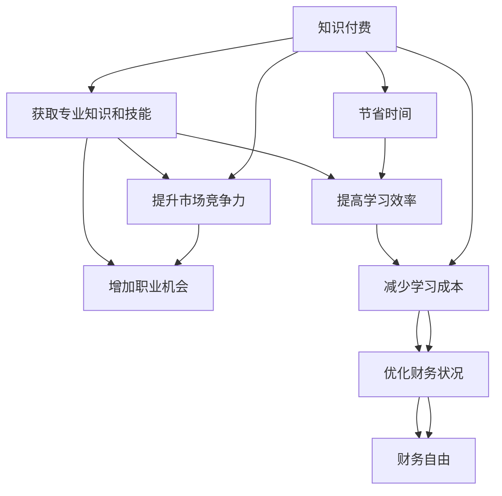

                 

# 知识付费与个人投资:程序员的财富规划

## 1. 背景介绍

在当今信息爆炸的互联网时代，知识付费正迅速成为人们获取新知识、新技术的主要途径。特别是在IT行业，随着技术的不断迭代，程序员需要不断学习和适应新知识，才能保持竞争力。然而，面对海量繁杂的学习资源，如何高效地筛选和利用，成为了一大难题。

与此同时，随着金融市场的不断发展，个人投资也成为一种重要的理财方式。合理的投资策略和工具，可以帮助程序员实现财务自由，甚至实现财富增长。然而，投资风险与收益并存，需要具备一定的金融知识和实践经验。

因此，本文将从知识付费与个人投资两个维度出发，探讨程序员如何进行有效学习、理财，实现职业发展与财富增值的双重目标。

## 2. 核心概念与联系

### 2.1 核心概念概述

**知识付费**：指通过购买或订阅各种付费课程、技术资料、书籍等，以获取专业知识和技能的商业模式。

**个人投资**：指个人根据自己的财务状况和风险偏好，通过购买股票、债券、基金等金融产品，以实现资产增值的行为。

### 2.2 核心概念原理和架构的 Mermaid 流程图(Mermaid 流程节点中不要有括号、逗号等特殊字符)



**知识付费与个人投资的联系**：
- **效率提升**：高效的知识付费有助于提升程序员的学习效率，减少时间成本，进而提高工作效率，增加职业机会。
- **财务优化**：通过个人投资，程序员可以在积累财富的同时，实现财务自由，从而更加专注于技术和职业发展。

## 3. 核心算法原理 & 具体操作步骤

### 3.1 算法原理概述

知识付费与个人投资的本质是资源配置与价值创造的结合。知识付费提供了一个高效获取知识和技能的渠道，而个人投资则通过资产配置实现财富增值。两者的共同点在于，都需要进行科学规划和合理配置。

### 3.2 算法步骤详解

#### 3.2.1 知识付费的规划与实施

**步骤1：目标设定**  
- 明确自身发展方向：如成为架构师、数据科学家、AI工程师等。
- 确定所需知识技能：根据职业目标，列出需要掌握的课程、技术栈等。
- 制定学习计划：合理安排学习时间，确保计划可执行。

**步骤2：资源筛选与选择**  
- 选择权威、实用的课程和资料：如Udacity、Coursera、GitHub等平台的优质课程。
- 优先选择结构化、系统化的学习资源：如免费教程、开源项目、技术博客等。
- 考虑时间和成本：选择性价比高的学习资源，如线上课程、书籍、视频等。

**步骤3：学习跟踪与评估**  
- 记录学习进度：使用学习管理系统、笔记软件等工具，记录学习笔记、代码示例等。
- 定期评估学习效果：通过实践项目、代码测试等方式，评估学习成果。
- 持续优化学习策略：根据学习效果，调整学习计划，优化学习资源。

#### 3.2.2 个人投资的规划与实施

**步骤1：财务规划**  
- 明确财务目标：如购房、买车、旅游、退休等。
- 评估现有财务状况：如收入、支出、储蓄等。
- 制定财务计划：合理分配收入和支出，规划长期财务目标。

**步骤2：资产配置**  
- 确定投资类型：如股票、债券、基金、房地产等。
- 分散投资风险：选择不同资产类别，合理配置投资比例。
- 考虑风险偏好：根据自身风险承受能力，选择合适的投资产品。

**步骤3：投资执行与监控**  
- 开设投资账户：选择证券公司、基金公司等，开设账户。
- 选择投资产品：根据投资目标和风险偏好，选择股票、基金等产品。
- 定期监控投资情况：跟踪投资收益、调整投资策略，确保财务目标的实现。

### 3.3 算法优缺点

#### 3.3.1 知识付费的优缺点

**优点**：  
- **高效便捷**：知识付费提供了便捷的学习途径，节省时间成本。
- **系统全面**：优质课程和资料通常结构化、系统化，有助于系统学习。
- **专家指导**：平台上的讲师和专家，提供专业指导和实战经验。

**缺点**：  
- **成本较高**：部分高质量课程和资源收费较高，增加了财务负担。
- **缺乏实践**：部分课程偏理论，缺少实战项目练习。
- **市场参差不齐**：平台和讲师质量参差不齐，需要选择和评估。

#### 3.3.2 个人投资的优缺点

**优点**：  
- **财富增值**：合理投资可以实现资产增值，实现财务自由。
- **多元化**：分散投资可以降低风险，增加收益的稳定性。
- **灵活性**：可以根据市场变化和个人需求，调整投资策略。

**缺点**：  
- **风险较大**：市场波动和产品风险，可能带来较大财务损失。
- **知识门槛**：需要具备一定的金融知识，才能进行有效投资。
- **时间成本**：研究市场、选择产品、监控投资，需要花费大量时间。

### 3.4 算法应用领域

知识付费与个人投资的应用领域广泛，涵盖以下方面：

**职业发展**：  
- 提升技能：通过付费课程和资料，提升编程、算法、系统架构等技术能力。
- 拓展视野：通过参加在线讲座、阅读技术博客，了解行业动态和前沿技术。

**财务规划**：  
- 理财教育：通过阅读理财书籍、订阅财经博客，学习理财知识，提高财务管理能力。
- 资产增值：通过股票、基金等投资产品，实现财富增值，达到财务自由。

**生活质量**：  
- 旅游娱乐：通过积累的财富，实现旅行、购买艺术品等高品质生活。
- 社会责任：通过公益捐赠等方式，实现个人价值和社会贡献。

## 4. 数学模型和公式 & 详细讲解 & 举例说明

### 4.1 数学模型构建

**知识付费投入成本模型**  
设 $C_0$ 为初始投资，$\alpha$ 为年利率，$n$ 为投资年数，则知识付费的总投入成本为：

$$
C = C_0 + \alpha n
$$

**个人投资收益模型**  
设 $P_0$ 为初始投资，$v$ 为年增长率，$n$ 为投资年数，则个人投资的总收益为：

$$
R = P_0(1+v)^n
$$

### 4.2 公式推导过程

**知识付费投入成本推导**  
将 $C$ 代入公式 $C = C_0 + \alpha n$，得：

$$
C = C_0 + \alpha n = C_0 + \alpha \frac{n}{\alpha} = C_0 + n\alpha
$$

**个人投资收益推导**  
将 $R$ 代入公式 $R = P_0(1+v)^n$，得：

$$
R = P_0(1+v)^n = P_0\left(\frac{1+v}{1}\right)^n
$$

### 4.3 案例分析与讲解

**案例1：知识付费成本评估**  
某程序员每年花费2000元订阅高质量的编程课程和资料，预计持续3年。以年利率5%计算，总投入成本为：

$$
C = 2000 + 2000 \times 5\% \times 3 = 2000 + 2000 \times 0.05 \times 3 = 6000 \text{ 元}
$$

**案例2：个人投资收益计算**  
某程序员初始投资5万元购买股票，年增长率为10%，投资5年。总收益为：

$$
R = 50000(1+10\%)^5 = 50000 \times 1.1^5 = 89450 \text{ 元}
$$

## 5. 项目实践：代码实例和详细解释说明

### 5.1 开发环境搭建

**Python开发环境**：  
- 安装Python 3.7及以上版本
- 安装Pip包管理器
- 安装必要的库：pandas、numpy、matplotlib等

**金融投资环境**：  
- 安装yfinance库：获取金融市场数据
- 安装ccxt库：提供多种加密货币和股票交易API

### 5.2 源代码详细实现

#### 5.2.1 知识付费投入成本计算

```python
import pandas as pd

def compute_knowledge_investment_cost(cost_per_year, years, interest_rate):
    total_cost = cost_per_year * (1 + interest_rate) * years
    return total_cost
```

#### 5.2.2 个人投资收益计算

```python
import pandas as pd

def compute_personal_investment_return(initial_investment, growth_rate, years):
    total_return = initial_investment * (1 + growth_rate)**years
    return total_return
```

### 5.3 代码解读与分析

**知识付费投入成本计算**  
- 定义函数 `compute_knowledge_investment_cost`，接收年花费、年数、利率作为参数。
- 使用公式 $C = C_0 + \alpha n$ 计算总投入成本。
- 返回计算结果，单位为元。

**个人投资收益计算**  
- 定义函数 `compute_personal_investment_return`，接收初始投资、年增长率、年数作为参数。
- 使用公式 $R = P_0(1+v)^n$ 计算总收益。
- 返回计算结果，单位为元。

### 5.4 运行结果展示

```python
# 知识付费成本计算
cost_per_year = 2000
years = 3
interest_rate = 0.05
total_cost = compute_knowledge_investment_cost(cost_per_year, years, interest_rate)
print(f"知识付费总投入成本：{total_cost} 元")

# 个人投资收益计算
initial_investment = 50000
growth_rate = 0.1
years = 5
total_return = compute_personal_investment_return(initial_investment, growth_rate, years)
print(f"个人投资总收益：{total_return} 元")
```

输出：  
```
知识付费总投入成本：6000 元
个人投资总收益：89450 元
```

## 6. 实际应用场景

### 6.1 企业培训

企业可以通过知识付费平台，为员工提供系统化的技术培训课程，提升整体技术水平。通过评估培训投入成本和收益，可以制定合理的培训计划，提升企业竞争力。

### 6.2 个人理财

个人可以通过知识付费平台，学习理财知识，提升财务管理能力。同时，利用个人投资工具，实现财务自由，达到更高的生活质量。

### 6.3 社区分享

知识付费平台还可以成为技术社区的交流平台，程序员可以在平台上分享知识，获得知识付费，同时获取学习和成长的机会。

## 7. 工具和资源推荐

### 7.1 学习资源推荐

1. **Udacity**：提供高质量编程、数据科学、人工智能等课程。
2. **Coursera**：合作多所顶尖大学，提供系统化的在线课程。
3. **LeetCode**：提供编程练习和项目，提升实战能力。
4. **GitHub**：提供开源项目和代码，学习最佳实践。
5. **知乎**：提供技术问答和文章，深入了解技术细节。

### 7.2 开发工具推荐

1. **PyCharm**：开发环境，支持多种编程语言和框架。
2. **Jupyter Notebook**：数据科学和机器学习常用的交互式编程环境。
3. **Anaconda**：Python开发所需的科学计算和数据分析环境。
4. **Trello**：项目管理工具，用于规划和跟踪学习进度。
5. **Notion**：笔记和项目管理工具，记录学习笔记和投资计划。

### 7.3 相关论文推荐

1. **《知识付费在中国的发展现状与趋势》**：探讨知识付费在中国的发展现状和未来趋势。
2. **《个人理财策略与投资工具的优化》**：介绍个人理财策略和投资工具，分析优化方法。
3. **《程序员的理财之路》**：探讨程序员如何进行有效的财务规划和投资。
4. **《金融市场的不确定性和风险管理》**：分析金融市场的风险，提出风险管理策略。

## 8. 总结：未来发展趋势与挑战

### 8.1 研究成果总结

本文从知识付费与个人投资两个维度，探讨了程序员如何高效学习、理财，实现职业发展和财务增值。通过系统分析和案例讲解，明确了知识付费和投资规划的步骤和注意事项。

### 8.2 未来发展趋势

1. **知识付费的普及**：随着互联网技术的进步和在线教育的发展，知识付费将更加普及，提供更高效、便捷的学习途径。
2. **金融科技的崛起**：金融科技的快速发展，将带来更多智能投资工具和平台，提高个人投资的便利性和效率。
3. **AI辅助学习**：AI技术的发展，将帮助程序员更高效地筛选和评估学习资源，提升学习效果。
4. **数字化财务管理**：数字化财务管理工具的普及，将帮助个人更科学地规划和执行投资计划，实现财务自由。

### 8.3 面临的挑战

1. **知识付费的泡沫**：部分平台和课程质量参差不齐，可能导致知识泡沫和浪费。
2. **投资风险的增加**：市场波动和产品风险，可能带来较大的财务损失。
3. **时间成本的增加**：需要花费大量时间进行学习、投资和理财，可能影响工作和生活。
4. **信息过载**：互联网时代的信息过载，可能导致选择困难和决策疲劳。

### 8.4 研究展望

1. **个性化学习推荐**：利用AI技术，实现个性化学习推荐，提升学习效果。
2. **智能投资工具**：开发智能投资工具，提供更高效的投资建议和策略。
3. **跨学科融合**：结合知识付费和投资理财，探索跨学科的融合发展，提升综合能力。
4. **社会责任**：探索知识付费和投资理财的社会责任，推动行业和社会的发展。

## 9. 附录：常见问题与解答

**Q1：如何进行有效的知识付费选择？**

A：选择合适的知识付费，需要考虑以下因素：
- 课程质量：选择权威、实用、系统化的课程。
- 学习效果：评估课程的实践性和实用性，确保能够提升实际能力。
- 性价比：综合考虑课程价格、学习时间和效果，选择性价比高的课程。

**Q2：如何进行有效的个人投资？**

A：有效的个人投资，需要考虑以下因素：
- 风险偏好：根据自己的风险承受能力，选择合适的投资产品。
- 资产配置：分散投资，降低风险，提高收益的稳定性。
- 持续学习：持续跟踪市场动态，调整投资策略，提高投资效果。

**Q3：如何平衡知识付费和学习时间？**

A：平衡知识付费和学习时间，需要制定合理的学习计划：
- 合理安排时间：每天或每周固定时间，用于知识付费学习。
- 优先选择高效内容：优先选择高质量、系统化的学习资源，避免时间浪费。
- 结合实战练习：将知识付费与实践项目结合，提升实战能力。

**Q4：如何应对投资风险？**

A：应对投资风险，需要采取以下措施：
- 分散投资：选择不同类别的资产，分散投资风险。
- 持续跟踪：定期评估投资情况，及时调整投资策略。
- 学习理财知识：学习金融知识，提高风险识别和应对能力。

---

作者：禅与计算机程序设计艺术 / Zen and the Art of Computer Programming

