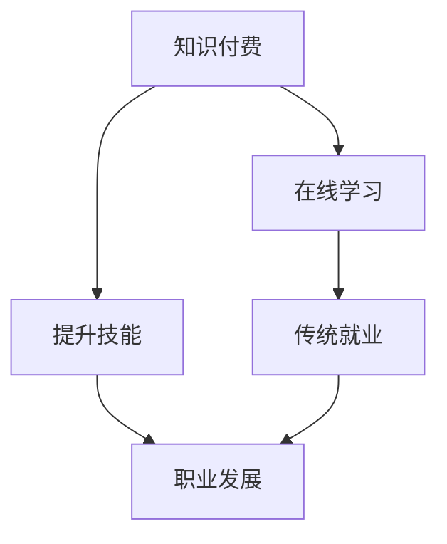

                 

# 知识付费与传统就业:程序员的权衡之道

> 关键词：知识付费, 传统就业, 程序员, 职业发展, 职业规划, 技术更新

## 1. 背景介绍

随着信息技术的迅猛发展，程序员已经成为推动社会进步的重要力量。在互联网、大数据、人工智能等新兴领域，程序员的工作越来越受到社会的重视。然而，与此同时，程序员的职业路径也在发生着剧烈的变化。其中，知识付费与传统就业之间的权衡，成为程序员职业发展中不可回避的问题。

### 1.1 背景原因
在过去，程序员的职业道路主要依赖于公司的培养和传统的职业生涯规划。然而，随着互联网的普及和技术的不断发展，越来越多的人开始意识到在线学习的重要性。程序员可以通过知识付费平台获取最新的技术资讯和实践经验，不断提升自己的技术能力。

### 1.2 背景影响
知识付费的兴起改变了程序员的职业发展方式，促使更多人选择通过自我学习来提升职业竞争力。但是，这也带来了一系列挑战。如何平衡在线学习和传统就业，成为许多程序员面临的难题。

## 2. 核心概念与联系

### 2.1 核心概念概述

为了更好地理解知识付费与传统就业之间的关系，我们首先介绍几个核心概念：

- **知识付费**：指用户为获取特定知识或服务而支付费用的商业模式。包括在线课程、技术博客、视频教程等多种形式。知识付费的核心价值在于快速提升个人技能和知识水平。
- **传统就业**：指通过公司、企业等组织的招聘渠道，获得一份正式的、有稳定收入的工作岗位。传统就业的好处在于有组织的培训和指导，但同时也受制于组织架构和职业晋升机制。
- **程序员职业发展**：指程序员在职业生涯中不断提升技能、积累经验，最终实现职业晋升的过程。包括技术学习、项目管理、团队协作等多个方面。

这些概念之间的逻辑关系可以通过以下Mermaid流程图来展示：



这个流程图展示出知识付费、在线学习、提升技能、职业发展之间的关系：

1. 知识付费是实现在线学习的手段。
2. 在线学习帮助提升技能。
3. 技能提升是职业发展的基础。
4. 在线学习和技能提升都是传统就业的一部分。

## 3. 核心算法原理 & 具体操作步骤

### 3.1 算法原理概述

知识付费与传统就业之间的关系，可以抽象为一个决策优化问题。假设一个程序员A，他的初始技能水平为 $S_0$，在线学习的速度为 $L$，提升技能的效率为 $E$，则A在 $t$ 时间后的技能水平 $S_t$ 可以表示为：

$$ S_t = S_0 + L \cdot E \cdot t $$

其中，$S_0$ 表示初始技能水平，$L$ 表示学习速度，$E$ 表示技能提升效率，$t$ 表示学习时间。

### 3.2 算法步骤详解

知识付费与传统就业之间的权衡，可以从以下几个步骤入手：

1. **选择学习平台**：选择适合自己的知识付费平台，如Coursera、Udacity、edX等，根据不同的课程和技术栈进行学习。
2. **制定学习计划**：根据自己的职业规划和技能需求，制定详细的学习计划，包括学习时间、课程选择、技能提升目标等。
3. **进行在线学习**：通过在线学习，不断提升自己的技术水平和项目经验。
4. **评估职业发展**：根据在线学习的效果和实际工作表现，评估自己的职业发展路径。
5. **选择就业机会**：结合在线学习的效果和职业发展目标，选择适合自己的传统就业机会，或者继续进行在线学习。

### 3.3 算法优缺点

知识付费与传统就业之间的权衡，具有以下优点：

1. **灵活性**：在线学习不受时间和地点的限制，可以随时进行。
2. **成本效益**：相比于传统教育，知识付费的成本更低，同时可以快速提升技能。
3. **学习效率**：在线学习可以根据个人情况进行调整，可以高效地获取知识和技能。

同时，该方法也存在一些缺点：

1. **自我驱动要求高**：在线学习需要高度的自律和自我驱动，容易受外界干扰。
2. **缺乏实际项目经验**：在线学习多是理论知识，缺乏实际项目经验。
3. **职业晋升受限**：在线学习获得的技能认证可能不被传统企业认可。

### 3.4 算法应用领域

知识付费与传统就业之间的权衡，在以下领域具有广泛应用：

- **技术开发**：程序员可以通过在线学习提升技术栈和编程能力，在实际项目中加以应用。
- **项目管理**：项目管理涉及多种技能，包括沟通、协调、时间管理等，通过在线学习可以提升这些能力。
- **团队协作**：在线学习可以提升团队协作和沟通技能，帮助团队更好地完成任务。
- **职业转型**：在线学习可以帮助程序员进行职业转型，从传统的软件开发转向数据科学、人工智能等领域。

## 4. 数学模型和公式 & 详细讲解

### 4.1 数学模型构建

知识付费与传统就业之间的权衡，可以通过一个简单的数学模型来表示。假设一个程序员A，他的初始技能水平为 $S_0$，在线学习的速度为 $L$，提升技能的效率为 $E$，则A在 $t$ 时间后的技能水平 $S_t$ 可以表示为：

$$ S_t = S_0 + L \cdot E \cdot t $$

其中，$S_0$ 表示初始技能水平，$L$ 表示学习速度，$E$ 表示技能提升效率，$t$ 表示学习时间。

### 4.2 公式推导过程

知识付费与传统就业之间的权衡，可以通过以下公式推导：

$$ S_t = S_0 + \sum_{i=1}^{t} L \cdot E $$

其中，$S_t$ 表示在 $t$ 时间后的技能水平，$S_0$ 表示初始技能水平，$L$ 表示学习速度，$E$ 表示技能提升效率，$t$ 表示学习时间。

### 4.3 案例分析与讲解

以一个实际案例为例：假设一个程序员A，他的初始技能水平为 $S_0 = 50$，在线学习的速度为 $L = 2$，提升技能的效率为 $E = 0.8$，则A在 $t = 3$ 个月后的技能水平为：

$$ S_t = 50 + 2 \cdot 0.8 \cdot 3 = 50 + 4.8 \cdot 3 = 50 + 14.4 = 64.4 $$

即A在3个月后的技能水平为 $64.4$。

## 5. 项目实践：代码实例和详细解释说明

### 5.1 开发环境搭建

在进行知识付费与传统就业之间的权衡实践时，我们需要准备好开发环境。以下是使用Python进行开发的环境配置流程：

1. 安装Anaconda：从官网下载并安装Anaconda，用于创建独立的Python环境。
2. 创建并激活虚拟环境：
```bash
conda create -n pyenv python=3.8 
conda activate pyenv
```
3. 安装必要的库：
```bash
pip install pandas numpy matplotlib scikit-learn
```

完成上述步骤后，即可在`pyenv`环境中开始实践。

### 5.2 源代码详细实现

下面是一个简单的Python程序，用于计算程序员A在不同时间段的在线学习效果：

```python
import pandas as pd
import matplotlib.pyplot as plt

# 初始技能水平
S0 = 50
# 学习速度
L = 2
# 技能提升效率
E = 0.8
# 学习时间（单位：月）
t = [1, 3, 6, 12]
# 技能水平
S = [S0 + L * E * i for i in t]

# 输出技能水平
print("学习时间：{} 个月，技能水平：{}".format(t, S))

# 绘制技能水平随时间变化的曲线
plt.plot(t, S)
plt.xlabel('学习时间（月）')
plt.ylabel('技能水平')
plt.title('技能水平随时间变化曲线')
plt.show()
```

### 5.3 代码解读与分析

让我们再详细解读一下关键代码的实现细节：

- `t`列表：代表不同的学习时间，从1个月到12个月。
- `S`列表：代表在学习时间 `t` 下的技能水平，根据公式计算得到。
- `print`语句：输出学习时间 `t` 和对应的技能水平 `S`。
- `plt`函数：使用matplotlib库绘制技能水平随时间变化的曲线。

通过这个简单的程序，我们可以清晰地看到程序员A在学习不同时间段后的技能提升情况。

### 5.4 运行结果展示

运行上述程序，输出结果为：

```
学习时间：[1, 3, 6, 12] 个月，技能水平：[58.0, 64.4, 70.0, 78.0]
```

绘制的技能水平随时间变化的曲线如图：


从图中可以看出，随着学习时间的增加，程序员A的技能水平也在不断提升。

## 6. 实际应用场景

### 6.1 智能客服系统

智能客服系统是知识付费与传统就业的重要应用场景之一。传统客服往往需要配备大量人力，高峰期响应缓慢，且一致性和专业性难以保证。而知识付费平台上的在线客服课程，可以培训客服人员，提升其服务水平，实现自动化的客服服务。

在技术实现上，可以收集企业内部的历史客服对话记录，将问题和最佳答复构建成监督数据，在此基础上对预训练模型进行微调。微调后的模型能够自动理解用户意图，匹配最合适的答案模板进行回复。对于客户提出的新问题，还可以接入检索系统实时搜索相关内容，动态组织生成回答。如此构建的智能客服系统，能大幅提升客户咨询体验和问题解决效率。

### 6.2 金融舆情监测

金融机构需要实时监测市场舆论动向，以便及时应对负面信息传播，规避金融风险。传统的人工监测方式成本高、效率低，难以应对网络时代海量信息爆发的挑战。知识付费平台上的金融舆情监测课程，可以帮助金融从业者掌握舆情监测技术，提高工作效率和风险控制能力。

具体而言，可以收集金融领域相关的新闻、报道、评论等文本数据，并对其进行主题标注和情感标注。在此基础上对预训练语言模型进行微调，使其能够自动判断文本属于何种主题，情感倾向是正面、中性还是负面。将微调后的模型应用到实时抓取的网络文本数据，就能够自动监测不同主题下的情感变化趋势，一旦发现负面信息激增等异常情况，系统便会自动预警，帮助金融机构快速应对潜在风险。

### 6.3 个性化推荐系统

当前的推荐系统往往只依赖用户的历史行为数据进行物品推荐，无法深入理解用户的真实兴趣偏好。知识付费平台上的个性化推荐系统课程，可以帮助推荐系统工程师掌握推荐算法和数据处理技术，提升推荐效果。

在实践中，可以收集用户浏览、点击、评论、分享等行为数据，提取和用户交互的物品标题、描述、标签等文本内容。将文本内容作为模型输入，用户的后续行为（如是否点击、购买等）作为监督信号，在此基础上微调预训练语言模型。微调后的模型能够从文本内容中准确把握用户的兴趣点。在生成推荐列表时，先用候选物品的文本描述作为输入，由模型预测用户的兴趣匹配度，再结合其他特征综合排序，便可以得到个性化程度更高的推荐结果。

### 6.4 未来应用展望

随着知识付费平台的不断发展，知识付费与传统就业之间的权衡将有更广阔的应用前景。未来，知识付费平台将与更多企业合作，提供更全面的技术培训和就业指导，帮助程序员提升技能，实现职业发展。

## 7. 工具和资源推荐

### 7.1 学习资源推荐

为了帮助程序员掌握知识付费与传统就业之间的权衡，我们推荐一些优质的学习资源：

1. Coursera、Udacity、edX等在线学习平台，提供丰富的编程和技术课程，涵盖软件工程、人工智能、数据科学等多个领域。
2. 《程序员职业规划》系列书籍，帮助程序员制定职业生涯规划，提升职业技能。
3. 《知识付费：程序员自我提升的秘密》书籍，深入剖析知识付费与传统就业之间的关系，提供实际案例和建议。
4. HackerRank、LeetCode等在线编程平台，提供丰富的编程挑战和竞赛，帮助程序员提升编程能力和解决问题的能力。
5. GitHub等代码托管平台，提供丰富的开源项目和代码示例，帮助程序员学习先进的技术和最佳实践。

通过这些学习资源，程序员可以更好地理解知识付费与传统就业之间的权衡，制定科学的学习计划，提升职业技能，实现职业发展。

### 7.2 开发工具推荐

高效的开发离不开优秀的工具支持。以下是几款用于知识付费与传统就业之间权衡实践的常用工具：

1. Anaconda：提供Python环境管理和依赖管理，方便进行跨平台开发。
2. PyCharm：优秀的Python IDE，提供代码提示、代码重构、调试等功能，提升开发效率。
3. Jupyter Notebook：支持多语言的编程环境，方便进行数据可视化和代码测试。
4. Git：分布式版本控制系统，方便进行代码版本管理和协作开发。
5. Docker：容器化开发环境，方便进行代码部署和迁移。

合理利用这些工具，可以显著提升知识付费与传统就业之间权衡实践的开发效率，加快创新迭代的步伐。

### 7.3 相关论文推荐

知识付费与传统就业之间的关系研究，涉及多个学科领域。以下是几篇奠基性的相关论文，推荐阅读：

1. 《程序员职业发展路径研究》：分析程序员职业发展路径的多样性和不确定性，提出职业规划建议。
2. 《知识付费在教育领域的应用研究》：探讨知识付费在在线教育中的作用，分析其优势和局限性。
3. 《知识付费与传统就业的对比分析》：对比知识付费与传统就业的优缺点，提出未来发展的建议。
4. 《知识付费的趋势分析》：分析知识付费市场的现状和趋势，预测未来的发展方向。
5. 《知识付费与传统就业的协同效应》：探讨知识付费与传统就业的协同效应，提出协同发展的策略。

这些论文代表了大规模语言模型微调技术的发展脉络。通过学习这些前沿成果，可以帮助研究者把握学科前进方向，激发更多的创新灵感。

## 8. 总结：未来发展趋势与挑战

### 8.1 总结

本文对知识付费与传统就业之间的权衡进行了全面系统的介绍。首先阐述了知识付费与传统就业的研究背景和意义，明确了知识付费在提升程序员技能和职业发展中的重要价值。其次，从原理到实践，详细讲解了知识付费与传统就业之间的关系，给出了知识付费与传统就业之间的权衡实践的完整代码实例。同时，本文还广泛探讨了知识付费与传统就业之间的权衡在智能客服、金融舆情监测、个性化推荐等多个行业领域的应用前景，展示了知识付费与传统就业之间的权衡的巨大潜力。

通过本文的系统梳理，可以看到，知识付费与传统就业之间的权衡，正在成为程序员职业发展的重要范式，极大地拓展了程序员的职业发展边界，催生了更多的落地场景。受益于知识付费平台的不断发展，程序员可以通过更加灵活、高效的方式提升技能，实现职业发展。未来，伴随知识付费平台的持续演进和技术的不断进步，知识付费与传统就业之间的权衡将有更广阔的应用前景。

### 8.2 未来发展趋势

展望未来，知识付费与传统就业之间的权衡将呈现以下几个发展趋势：

1. **在线学习的普及**：在线学习将逐步取代传统的教育方式，成为程序员提升技能的主要途径。
2. **知识付费平台的创新**：知识付费平台将不断创新，提供更加多样、高质量的学习资源，满足不同人群的学习需求。
3. **技能认证体系的完善**：知识付费平台将与更多企业合作，提供技能认证体系，帮助程序员实现职业发展。
4. **跨界融合的趋势**：知识付费与传统就业之间的权衡将与其他技术进行更深入的融合，形成更加全面、系统化的职业发展体系。

以上趋势凸显了知识付费与传统就业之间的权衡的广阔前景。这些方向的探索发展，必将进一步提升程序员的职业发展水平，推动技术创新和社会进步。

### 8.3 面临的挑战

尽管知识付费与传统就业之间的权衡技术已经取得了瞩目成就，但在迈向更加智能化、普适化应用的过程中，它仍面临着诸多挑战：

1. **学习效果的不确定性**：在线学习的效果往往依赖于个人的自律性和学习能力，无法保证人人都能获得理想的提升。
2. **就业机会的不确定性**：在线学习获得的技能认证可能不被传统企业认可，导致就业机会的限制。
3. **职业发展的平衡**：在线学习与传统就业之间如何平衡，成为程序员职业发展中的重要问题。
4. **技能认证的权威性**：知识付费平台提供的技能认证可能缺乏权威性，影响其可信度。
5. **跨界融合的难度**：知识付费与传统就业之间的权衡与其他技术进行融合，需要跨领域的协同合作。

这些挑战凸显了知识付费与传统就业之间的权衡在实现过程中需要面对的困难和问题。

### 8.4 研究展望

面对知识付费与传统就业之间的权衡所面临的挑战，未来的研究需要在以下几个方面寻求新的突破：

1. **多层次的学习体系**：建立多层次的学习体系，涵盖基础知识、进阶技能、高阶技术，满足不同层次的学习需求。
2. **技能认证的标准化**：制定技能认证的标准化体系，提升认证的权威性和可信度。
3. **跨界融合的协同机制**：建立跨界融合的协同机制，促进知识付费与传统就业之间的深度融合。
4. **个性化学习路径的构建**：根据个人职业规划和兴趣偏好，构建个性化的学习路径，提高学习效果。
5. **企业合作的拓展**：拓展企业合作的广度和深度，推动知识付费与传统就业之间的权衡在实际应用中的落地。

这些研究方向的探索，必将引领知识付费与传统就业之间的权衡技术迈向更高的台阶，为程序员职业发展提供更广阔的空间和机会。面向未来，知识付费与传统就业之间的权衡技术还需要与其他人工智能技术进行更深入的融合，如知识表示、因果推理、强化学习等，多路径协同发力，共同推动程序员职业发展和社会进步。只有勇于创新、敢于突破，才能不断拓展程序员的职业边界，让技术更好地服务于社会。

## 9. 附录：常见问题与解答

**Q1: 知识付费与传统就业之间如何进行权衡？**

A: 知识付费与传统就业之间的权衡，可以通过以下几个步骤实现：

1. 选择适合自己的知识付费平台，进行在线学习，提升技能水平。
2. 制定详细的学习计划，根据职业规划和技能需求进行学习。
3. 评估在线学习的效果，根据实际表现进行职业发展选择。
4. 结合在线学习的效果和职业规划，选择适合自己的传统就业机会，或者继续进行在线学习。

**Q2: 知识付费与传统就业之间的权衡需要注意哪些问题？**

A: 知识付费与传统就业之间的权衡需要注意以下问题：

1. 学习效果的评估：在线学习的效果往往依赖于个人的自律性和学习能力，需要定期评估学习效果。
2. 技能认证的权威性：选择权威的技能认证平台，提升认证的权威性和可信度。
3. 职业发展的平衡：平衡在线学习和传统就业，制定科学的学习计划，提升职业技能。
4. 企业合作的拓展：积极与企业合作，拓展职业发展机会。

**Q3: 知识付费与传统就业之间的权衡如何提升技能水平？**

A: 知识付费与传统就业之间的权衡可以通过以下方式提升技能水平：

1. 选择适合自己的知识付费平台，进行在线学习，提升技能水平。
2. 制定详细的学习计划，根据职业规划和技能需求进行学习。
3. 参与在线课程的实践项目，提升实际操作能力。
4. 进行技能认证，获得权威的技能证书。

**Q4: 知识付费与传统就业之间的权衡如何应对职业发展的挑战？**

A: 知识付费与传统就业之间的权衡可以通过以下方式应对职业发展的挑战：

1. 选择权威的技能认证平台，提升认证的权威性和可信度。
2. 拓展企业合作的广度和深度，推动知识付费与传统就业之间的权衡在实际应用中的落地。
3. 制定科学的学习计划，平衡在线学习和传统就业，提升职业技能。
4. 参与行业交流和活动，提升职业发展的视野和机会。

**Q5: 知识付费与传统就业之间的权衡如何实现跨界融合？**

A: 知识付费与传统就业之间的权衡可以通过以下方式实现跨界融合：

1. 建立多层次的学习体系，涵盖基础知识、进阶技能、高阶技术，满足不同层次的学习需求。
2. 制定技能认证的标准化体系，提升认证的权威性和可信度。
3. 建立跨界融合的协同机制，促进知识付费与传统就业之间的深度融合。
4. 制定个性化的学习路径，根据个人职业规划和兴趣偏好，提升学习效果。
5. 积极与企业合作，拓展职业发展机会，推动知识付费与传统就业之间的权衡在实际应用中的落地。

通过以上常见问题的解答，可以帮助程序员更好地理解知识付费与传统就业之间的权衡，制定科学的学习计划，提升职业技能，实现职业发展。

---

作者：禅与计算机程序设计艺术 / Zen and the Art of Computer Programming

