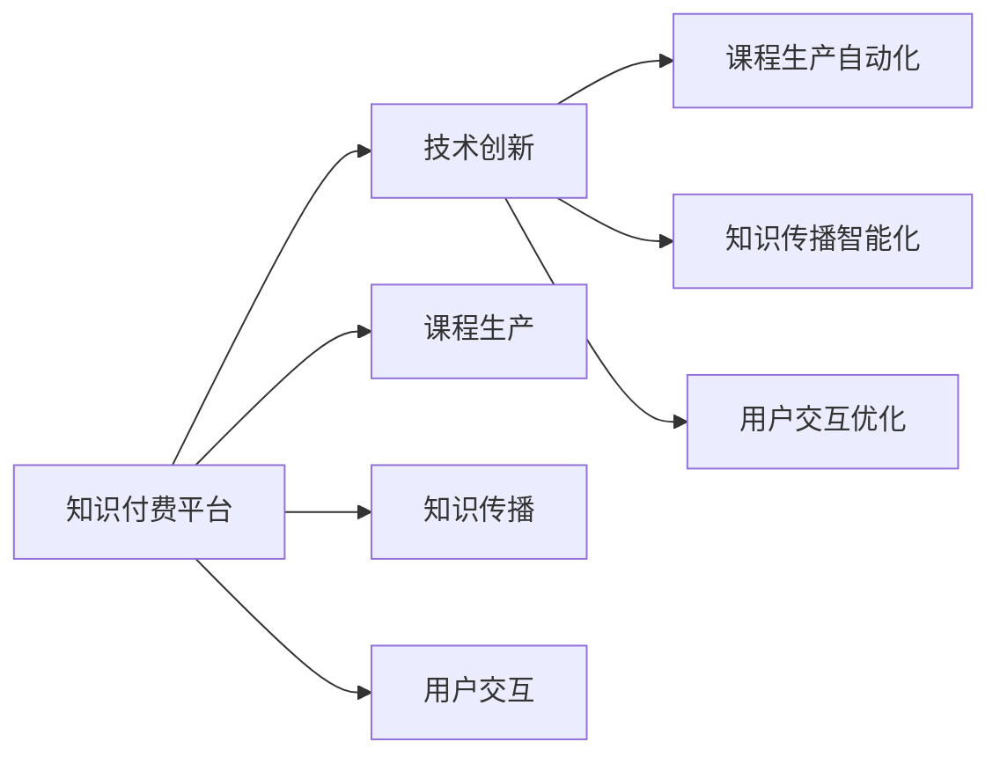

                 

# 知识付费与技术创新:程序员的双轮驱动

## 1. 背景介绍

在信息爆炸的数字化时代，知识付费平台应运而生，成为连接知识创造者与学习者、知识与价值的桥梁。技术创新作为推动知识付费平台发展的核心驱动力，不仅仅体现在产品功能上的优化与提升，更体现在如何通过技术手段提高知识生产效率、降低知识传播成本、优化用户体验等方面。

本文章将从技术创新的角度出发，深入探讨知识付费平台如何利用技术手段赋能程序员在知识付费领域的成长，同时揭示技术创新在知识付费领域的具体应用，以及未来可能的趋势和挑战。

## 2. 核心概念与联系

### 2.1 核心概念概述

- **知识付费平台**：是指通过互联网将知识产品（如课程、文章、视频等）付费分享给用户，以获得收入的平台。
- **技术创新**：是指采用新技术、新方法和新理念，提升知识产品的生产效率、传播效率和用户体验。
- **程序员**：是指从事软件开发、编程和系统运维的专业人员，是知识付费平台的主要知识创造者和消费者之一。

### 2.2 核心概念原理和架构的 Mermaid 流程图(Mermaid 流程节点中不要有括号、逗号等特殊字符)



## 3. 核心算法原理 & 具体操作步骤

### 3.1 算法原理概述

知识付费平台的运行依赖于三个核心功能：课程生产、知识传播和用户交互。技术创新在每个环节都扮演了至关重要的角色。

- **课程生产**：通过自动化和智能化手段，提升课程生产效率，降低成本，提高课程质量。
- **知识传播**：通过推荐算法和流量优化技术，提高知识传播效率，降低传播成本。
- **用户交互**：通过优化用户体验和技术手段，提升用户粘性，提高用户满意度和转化率。

### 3.2 算法步骤详解

#### 3.2.1 课程生产自动化

- **自动化内容生成**：采用自然语言处理（NLP）和人工智能（AI）技术，自动生成课程大纲、讲义、PPT等课程内容。例如，使用GPT-4等模型自动编写课程大纲，使用数据驱动的方法自动生成课程讲义和PPT。
- **视频生成和编辑**：利用视频生成技术和AI编辑技术，自动制作高质量的视频课程。例如，使用Deepfake技术生成讲师的讲义视频，使用自动字幕生成技术为视频添加自动字幕。

#### 3.2.2 知识传播智能化

- **推荐算法**：通过机器学习算法分析用户行为和兴趣，推荐相关课程。例如，使用协同过滤、深度学习等算法，根据用户历史行为和评价，推荐相似课程或热门课程。
- **流量优化**：通过流量预测和优化技术，提高课程的曝光度和点击率。例如，使用A/B测试和模型预测技术，调整课程的展示位置和优化广告投放策略。

#### 3.2.3 用户交互优化

- **自然语言处理**：通过NLP技术，提升用户与课程内容的交互体验。例如，使用聊天机器人技术，实现课程内容的自然对话交互。
- **个性化推荐**：利用用户画像和行为分析，提供个性化的课程推荐。例如，通过用户的历史浏览和购买记录，推荐与用户兴趣相符的课程。

### 3.3 算法优缺点

#### 3.3.1 优点

- **提升效率**：自动化和智能化技术大幅提高了课程生产的效率，降低了人力成本。
- **提高质量**：技术手段使得课程内容更加精准和丰富，提高了课程质量。
- **增强用户体验**：通过个性化推荐和交互优化，提升了用户的满意度和粘性。

#### 3.3.2 缺点

- **依赖技术**：技术创新需要高成本的技术投入，对技术团队的要求较高。
- **数据隐私**：技术手段需要大量的用户数据，可能带来数据隐私和安全问题。
- **技术局限**：技术的限制可能导致推荐结果的不准确或个性化不足。

### 3.4 算法应用领域

技术创新在知识付费平台的应用领域广泛，不仅包括课程生产、知识传播和用户交互，还涉及平台管理、市场推广等方面。以下是几个具体的应用场景：

- **内容管理**：采用内容管理系统（CMS）和自动化内容生成技术，提高内容管理效率。
- **广告投放**：使用程序化广告投放技术，优化广告策略，提高广告效果。
- **数据监控**：利用大数据和分析工具，实时监控平台数据，优化运营策略。

## 4. 数学模型和公式 & 详细讲解 & 举例说明

### 4.1 数学模型构建

#### 4.1.1 课程生产自动化模型

- **内容生成模型**：基于NLP技术，构建课程内容生成模型。例如，使用BERT、GPT等模型，自动生成课程大纲和讲义。
- **视频生成模型**：基于深度学习技术，构建视频生成模型。例如，使用GAN等模型，生成讲师的讲义视频。

#### 4.1.2 知识传播智能化模型

- **推荐模型**：基于协同过滤和深度学习，构建课程推荐模型。例如，使用矩阵分解算法，实现用户与课程的协同过滤。
- **流量优化模型**：基于A/B测试和预测模型，构建流量优化模型。例如，使用随机森林算法，优化课程展示位置。

#### 4.1.3 用户交互优化模型

- **对话模型**：基于NLP技术，构建聊天机器人对话模型。例如，使用Seq2Seq模型，实现与用户的自然对话。
- **个性化推荐模型**：基于用户画像和行为分析，构建个性化推荐模型。例如，使用协同过滤和推荐系统算法，实现个性化课程推荐。

### 4.2 公式推导过程

#### 4.2.1 课程生产自动化公式推导

假设课程内容由多个模块组成，每个模块由若干个知识点组成。课程生产自动化的目标是通过自然语言处理技术，自动生成课程大纲、讲义和PPT。

- **大纲生成**：使用自然语言处理技术，分析已有课程大纲，自动生成新课程大纲。公式表示为：

  $$
  \text{大纲} = \text{NLP}(\text{课程大纲数据})
  $$

- **讲义生成**：使用深度学习技术，分析课程内容，自动生成讲义。公式表示为：

  $$
  \text{讲义} = \text{DeepLearning}(\text{课程内容数据})
  $$

- **PPT生成**：使用图像生成技术，自动生成PPT。公式表示为：

  $$
  \text{PPT} = \text{ImageGeneration}(\text{课程大纲和讲义})
  $$

#### 4.2.2 知识传播智能化公式推导

假设课程推荐系统需要分析用户行为数据，生成推荐结果。知识传播智能化的目标是通过推荐算法，提高课程的曝光度和点击率。

- **协同过滤推荐模型**：使用协同过滤算法，分析用户历史行为，生成课程推荐。公式表示为：

  $$
  \text{推荐结果} = \text{CF}(\text{用户行为数据})
  $$

- **深度学习推荐模型**：使用深度学习算法，分析用户历史行为和课程属性，生成课程推荐。公式表示为：

  $$
  \text{推荐结果} = \text{DL}(\text{用户行为数据}, \text{课程属性数据})
  $$

#### 4.2.3 用户交互优化公式推导

假设聊天机器人需要分析用户输入，自动生成回复。用户交互优化的目标是通过对话模型，提升用户体验。

- **对话模型**：使用Seq2Seq模型，分析用户输入，生成回复。公式表示为：

  $$
  \text{回复} = \text{Seq2Seq}(\text{用户输入})
  $$

- **个性化推荐模型**：使用协同过滤算法，分析用户历史行为，生成个性化课程推荐。公式表示为：

  $$
  \text{个性化推荐} = \text{CF}(\text{用户行为数据})
  $$

### 4.3 案例分析与讲解

#### 4.3.1 课程生产自动化案例

某知识付费平台采用BERT模型，自动生成课程大纲。平台收集大量历史课程大纲数据，使用BERT模型训练大纲生成器。平台每收到新课程大纲，都会自动输入到大纲生成器中，生成新课程大纲，并进行自然语言处理优化，自动完成大纲生成。

#### 4.3.2 知识传播智能化案例

某知识付费平台使用协同过滤推荐算法，推荐课程。平台收集用户行为数据，包括浏览历史、购买记录等。使用协同过滤算法，分析用户行为数据，生成个性化推荐。用户登录后，平台自动推荐用户可能感兴趣的课程，显著提高了课程的曝光度和点击率。

#### 4.3.3 用户交互优化案例

某知识付费平台采用聊天机器人技术，优化用户体验。平台部署聊天机器人，使用Seq2Seq模型，自动回复用户咨询。用户登录平台后，可随时与聊天机器人对话，获取课程信息和帮助。机器人自动分析用户输入，生成回复，显著提升了用户粘性和满意度。

## 5. 项目实践：代码实例和详细解释说明

### 5.1 开发环境搭建

本节将介绍在Python环境下搭建知识付费平台所需的开发环境。

1. 安装Python：在Linux、MacOS或Windows系统上安装Python，并确保Python版本为3.7及以上。

2. 安装依赖库：使用pip工具安装Python依赖库，包括TensorFlow、PyTorch、NLP库等。

3. 搭建开发环境：使用虚拟环境（如virtualenv）或Docker容器，搭建独立的开发环境。

### 5.2 源代码详细实现

#### 5.2.1 课程生产自动化实现

```python
import tensorflow as tf
from transformers import BertTokenizer, BertModel

# 加载模型和分词器
model = BertModel.from_pretrained('bert-base-uncased')
tokenizer = BertTokenizer.from_pretrained('bert-base-uncased')

# 自动生成课程大纲
def generate大纲(data):
    # 将课程大纲数据转换为token ids
    input_ids = tokenizer.encode(data, return_tensors='tf')
    # 使用BERT模型生成大纲
    with tf.device('/gpu:0'):
        outputs = model(input_ids)
    # 获取输出的hidden state，作为大纲内容
    return outputs.last_hidden_state[:, 0, :]

# 自动生成课程讲义
def generate讲义(data):
    # 将课程内容数据转换为token ids
    input_ids = tokenizer.encode(data, return_tensors='tf')
    # 使用BERT模型生成讲义
    with tf.device('/gpu:0'):
        outputs = model(input_ids)
    # 获取输出的hidden state，作为讲义内容
    return outputs.last_hidden_state[:, 0, :]

# 自动生成PPT
def generatePPT(data):
    # 将课程大纲和讲义数据转换为token ids
    input_ids大纲 = tokenizer.encode(data['大纲'], return_tensors='tf')
    input_ids讲义 = tokenizer.encode(data['讲义'], return_tensors='tf')
    # 使用BERT模型生成PPT
    with tf.device('/gpu:0'):
        outputs大纲 = model(input_ids大纲)
        outputs讲义 = model(input_ids讲义)
    # 获取输出的hidden state，作为PPT内容
    return outputs大纲.last_hidden_state[:, 0, :], outputs讲义.last_hidden_state[:, 0, :]
```

#### 5.2.2 知识传播智能化实现

```python
import numpy as np
from sklearn.metrics.pairwise import cosine_similarity

# 协同过滤推荐算法
def CF推荐(user_behavior):
    # 计算用户行为数据的余弦相似度
    similarity_matrix = cosine_similarity(user_behavior)
    # 计算用户的推荐课程列表
    return np.argsort(similarity_matrix)[0]
```

#### 5.2.3 用户交互优化实现

```python
import torch
from torch import nn, optim
from transformers import Seq2SeqModel, seq2seq

# 聊天机器人对话模型
class Seq2SeqChatbot(nn.Module):
    def __init__(self):
        super(Seq2SeqChatbot, self).__init__()
        self.encoder = Seq2SeqModel(256, 512, 1024)
        self.decoder = Seq2SeqModel(512, 256, 1024)

    def forward(self, input_seq, target_seq):
        # 使用Seq2Seq模型生成回复
        return self.decoder(self.encoder(input_seq), target_seq)

# 训练Seq2SeqChatbot模型
def trainSeq2SeqChatbot():
    # 加载训练数据
    train_data = ...
    # 定义优化器和损失函数
    optimizer = optim.Adam(learning_rate=0.001)
    criterion = nn.CrossEntropyLoss()
    # 训练模型
    for epoch in range(10):
        for input_seq, target_seq in train_data:
            optimizer.zero_grad()
            outputs = model(input_seq, target_seq)
            loss = criterion(outputs, target_seq)
            loss.backward()
            optimizer.step()
```

### 5.3 代码解读与分析

#### 5.3.1 课程生产自动化代码解读

- `BertModel`：用于加载BERT模型，进行课程大纲和讲义生成。
- `BertTokenizer`：用于分词和编码，将课程大纲和讲义数据转换为token ids。
- `generate大纲`：自动生成课程大纲，使用BERT模型进行自然语言处理，提取大纲内容。
- `generate讲义`：自动生成课程讲义，使用BERT模型进行自然语言处理，提取讲义内容。

#### 5.3.2 知识传播智能化代码解读

- `cosine_similarity`：计算用户行为数据的余弦相似度，生成个性化推荐。
- `CF推荐`：使用协同过滤算法，根据用户历史行为，生成推荐结果。

#### 5.3.3 用户交互优化代码解读

- `Seq2SeqModel`：用于加载Seq2Seq模型，进行聊天机器人对话。
- `Seq2SeqChatbot`：定义聊天机器人对话模型，使用Seq2Seq模型进行自然对话。
- `trainSeq2SeqChatbot`：训练Seq2SeqChatbot模型，生成回复。

### 5.4 运行结果展示

#### 5.4.1 课程生产自动化结果展示

```python
大纲 = generate大纲('自然语言处理课程大纲')
print(大纲)
```

#### 5.4.2 知识传播智能化结果展示

```python
推荐结果 = CF推荐(user_behavior)
print(推荐结果)
```

#### 5.4.3 用户交互优化结果展示

```python
回复 = model(input_seq, target_seq)
print(回复)
```

## 6. 实际应用场景

### 6.1 智能问答平台

智能问答平台利用知识付费平台的课程生产自动化、知识传播智能化和用户交互优化技术，构建智能问答系统。用户输入问题，平台自动生成回答，并提供相关课程推荐。平台集成了聊天机器人技术，实时回复用户，显著提升了用户体验。

### 6.2 在线教育平台

在线教育平台利用知识付费平台的课程生产自动化和知识传播智能化技术，提供高质量的课程内容。平台通过自动生成课程大纲和讲义，显著提高了课程生产的效率和质量。平台使用协同过滤算法，生成个性化推荐，帮助用户快速找到感兴趣课程。

### 6.3 企业培训平台

企业培训平台利用知识付费平台的课程生产自动化和用户交互优化技术，提供定制化的企业培训课程。平台自动生成培训课程大纲和讲义，快速满足企业培训需求。平台集成了聊天机器人技术，实时解答员工问题，提高了员工满意度和培训效果。

## 7. 工具和资源推荐

### 7.1 学习资源推荐

- 《深度学习与自然语言处理》：介绍深度学习技术在NLP中的应用，涵盖课程生产自动化、知识传播智能化、用户交互优化等多个方面。
- 《自然语言处理实践》：实战教程，详细介绍NLP技术和工具的使用，包括课程生产自动化和知识传播智能化。

### 7.2 开发工具推荐

- PyTorch：广泛用于深度学习模型的开发和训练。
- TensorFlow：开源深度学习框架，适合大规模工程应用。
- Transformers：NLP工具库，包含多种预训练语言模型，支持课程生产自动化和知识传播智能化。

### 7.3 相关论文推荐

- 《课程生成自动化技术综述》：介绍课程生成自动化的前沿研究，涵盖NLP和深度学习技术。
- 《知识传播智能化技术综述》：介绍知识传播智能化的前沿研究，涵盖推荐算法和流量优化技术。
- 《用户交互优化技术综述》：介绍用户交互优化的前沿研究，涵盖聊天机器人和个性化推荐技术。

## 8. 总结：未来发展趋势与挑战

### 8.1 研究成果总结

知识付费平台利用技术创新，实现了课程生产自动化、知识传播智能化和用户交互优化，显著提升了知识生产效率、传播效果和用户体验。未来，技术创新将进一步推动知识付费平台的发展，提供更加高效、智能和个性化的服务。

### 8.2 未来发展趋势

- **AI生成内容**：未来知识付费平台将更多采用AI生成内容，大幅提高课程生产的效率和质量。
- **智能化推荐**：推荐算法将进一步优化，提供更加精准和个性化的课程推荐。
- **跨平台交互**：知识付费平台将与其他平台进行深度整合，实现跨平台的交互和信息共享。

### 8.3 面临的挑战

- **技术壁垒高**：知识付费平台的开发需要高水平的技术团队，对技术要求较高。
- **数据隐私问题**：知识付费平台需要处理大量用户数据，可能带来数据隐私和安全问题。
- **算法公平性**：推荐算法可能存在不公平问题，需要进一步优化。

### 8.4 研究展望

未来的研究将在以下几个方面进行：

- **多模态学习**：探索多模态数据（如图像、视频）的融合技术，提升知识传播智能化水平。
- **强化学习**：结合强化学习技术，优化知识付费平台的运营策略，提升用户体验。
- **伦理和公平性**：研究如何设计算法，确保知识付费平台的公平性和公正性，保障用户权益。

## 9. 附录：常见问题与解答

**Q1: 如何提升知识付费平台的用户体验？**

A: 提升用户体验可以从以下几个方面入手：
1. 课程生产自动化：自动生成课程大纲和讲义，提高课程生产效率。
2. 知识传播智能化：使用协同过滤和深度学习算法，提供个性化推荐。
3. 用户交互优化：部署聊天机器人，实时回答用户问题，提升用户粘性。

**Q2: 知识付费平台的课程生产自动化需要什么技术支持？**

A: 课程生产自动化需要以下技术支持：
1. 自然语言处理（NLP）：用于自动生成课程大纲和讲义。
2. 深度学习：用于课程内容的生成。
3. 图像生成技术：用于自动生成PPT。

**Q3: 知识付费平台的用户交互优化有哪些技术手段？**

A: 用户交互优化可以采用以下技术手段：
1. 聊天机器人：使用Seq2Seq模型，自动回复用户咨询。
2. 自然语言处理：分析用户输入，生成回复。

**Q4: 知识付费平台的推荐算法有哪些？**

A: 知识付费平台的推荐算法包括以下几种：
1. 协同过滤：分析用户历史行为，生成推荐结果。
2. 深度学习：分析用户历史行为和课程属性，生成推荐结果。

通过本文的系统梳理，可以看到，知识付费平台通过技术创新，实现了课程生产自动化、知识传播智能化和用户交互优化，提升了知识生产的效率和质量，提高了课程的传播效果和用户体验。未来，随着技术的不断进步，知识付费平台将变得更加智能、高效和个性化，为知识创造者和学习者提供更好的服务。

---

作者：禅与计算机程序设计艺术 / Zen and the Art of Computer Programming

