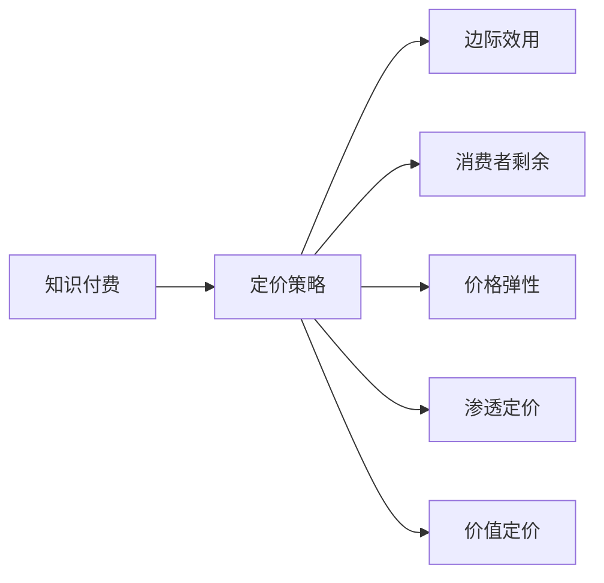

                 

## 1. 背景介绍

在知识付费浪潮的推动下，越来越多的内容生产者开始探索通过互联网平台进行内容变现。然而，如何确定合适的定价策略，以实现商业模式的最大化，是内容生产者不得不面对的一个难题。本文将探讨知识付费产品的定价策略，从经济学角度出发，结合行为经济学和心理学原理，深入分析不同定价策略的影响，并提出相应的策略建议。

## 2. 核心概念与联系

### 2.1 核心概念概述

1. **知识付费**：通过互联网平台，用户为获取知识、技能或信息而支付费用的商业模式。
2. **定价策略**：确定商品或服务价格，以达到特定目标（如增加收益、吸引用户等）的策略。
3. **边际效用**：消费者对额外一单位商品的消费所带来的额外满足感。
4. **消费者剩余**：消费者对商品支付的意愿与实际支付价格之差。
5. **价格弹性**：价格变化对需求量的影响程度。
6. **渗透定价**：以较低的价格吸引大量用户，逐步提高价格以实现盈利。
7. **价值定价**：根据商品或服务的实际价值来定价。

这些概念之间相互关联，共同构成了知识付费产品定价的基础框架。

### 2.2 核心概念原理和架构的 Mermaid 流程图



## 3. 核心算法原理 & 具体操作步骤

### 3.1 算法原理概述

知识付费产品的定价策略主要基于以下几个经济学和心理学原理：

1. **边际效用递减规律**：消费者对额外一单位商品的消费所带来的额外满足感会随着消费量的增加而减少。
2. **锚定效应**：消费者对于价格的感知受到初始价格的影响，较高的初始价格会让消费者认为较低的价格更有吸引力。
3. **价值感理论**：消费者对于商品或服务的定价感知与其感知的价值相关，高价值感知会导致更高的支付意愿。

### 3.2 算法步骤详解

1. **需求分析**：
   - 分析目标用户群体的需求特征，包括对知识、技能或信息的偏好、支付能力等。
   - 使用市场调研和用户反馈来确定潜在用户对不同价格点的反应。

2. **定价模型构建**：
   - 构建基于边际效用递减和锚定效应的定价模型，以确定不同价格点的用户需求和消费行为。
   - 使用价值感理论来设定产品或服务的价值基准，以引导用户对价格的心理接受度。

3. **价格测试与调整**：
   - 进行价格测试，设定多个价格点，观察用户响应和购买行为。
   - 根据测试结果调整价格策略，以最大化收益和用户满意度。

### 3.3 算法优缺点

**优点**：
- 基于经济学和心理学原理，能够更科学地确定价格，提升用户满意度和平台收益。
- 能够灵活应对市场需求变化，动态调整价格策略。

**缺点**：
- 价格调整需要耗费一定的时间和资源。
- 对市场和用户行为预测的准确性依赖较高。

### 3.4 算法应用领域

知识付费产品的定价策略可以广泛应用于各种类型的在线课程、电子书、专业咨询等知识产品的定价决策。

## 4. 数学模型和公式 & 详细讲解 & 举例说明

### 4.1 数学模型构建

设知识付费产品为 $X$，用户支付价格为 $P$，用户对该产品的需求量为 $D$，则需求函数可以表示为：

$$
D(P) = f(P)
$$

其中，$f(P)$ 是需求函数的映射关系，$P$ 为用户支付的价格。

### 4.2 公式推导过程

根据边际效用递减规律，用户对产品 $X$ 的需求量 $D$ 随价格 $P$ 的增加而减少，可以表示为：

$$
D(P) = D_0 - kP
$$

其中，$D_0$ 为价格为 $0$ 时的需求量，$k$ 为边际效用系数，反映了价格变化对需求量的影响程度。

### 4.3 案例分析与讲解

假设某知识付费产品的需求函数为 $D(P) = 1000 - 2P$，价格从 $5$ 元增加到 $10$ 元，计算需求量变化：

1. 当 $P = 5$ 时，$D(5) = 1000 - 2 \times 5 = 990$
2. 当 $P = 10$ 时，$D(10) = 1000 - 2 \times 10 = 980$

需求量从 $990$ 降至 $980$，反映了边际效用递减的规律。

## 5. 项目实践：代码实例和详细解释说明

### 5.1 开发环境搭建

为了进行定价策略的模拟分析，我们需要搭建一个基于Python的定价模型开发环境。具体步骤如下：

1. 安装Python和相关库，如NumPy、Pandas等。
2. 使用Jupyter Notebook或其他Python IDE创建项目文件夹。
3. 编写定价策略的Python代码。

### 5.2 源代码详细实现

以下是基于边际效用递减规律的定价模型示例代码：

```python
import numpy as np
import matplotlib.pyplot as plt

# 定义需求函数
def demand_func(P):
    return 1000 - 2 * P

# 计算不同价格点的需求量
P_values = np.arange(0, 20, 1)
D_values = [demand_func(p) for p in P_values]

# 绘制需求曲线
plt.plot(P_values, D_values)
plt.xlabel('Price')
plt.ylabel('Demand')
plt.title('Demand Curve for Knowledge Product')
plt.show()
```

### 5.3 代码解读与分析

上述代码定义了需求函数 `demand_func(P)`，并计算了不同价格 $P$ 下的需求量 $D$，最后绘制了需求曲线。通过需求曲线的斜率，可以直观地观察边际效用递减规律。

### 5.4 运行结果展示

运行上述代码，将得到以下需求曲线图：


### 6. 实际应用场景

#### 6.1 在线课程定价

在线课程定价是知识付费中最常见的应用场景之一。通过分析用户对不同课程的需求量和支付意愿，可以制定合理的定价策略。

1. **基础课程定价**：
   - 提供基础入门课程，价格设定在较低水平，吸引大量用户。
   - 随着用户对课程价值的感知增加，逐步提高价格，以实现利润最大化。

2. **进阶课程定价**：
   - 对于进阶课程，根据用户反馈和市场调研，设定较高的价格，以体现课程的深度和难度。

3. **定制化服务定价**：
   - 针对有特殊需求的用户，提供定制化的咨询服务，定价更高。

#### 6.2 电子书定价

电子书定价策略同样基于边际效用递减规律。根据用户的购买行为和反馈，逐步调整价格，以实现最大化收益。

1. **免费试用版**：
   - 提供免费试用版电子书，用户可以通过阅读样章决定是否购买完整版。
   - 根据试用版用户的反馈，调整完整版的定价和内容。

2. **阶梯定价**：
   - 采用阶梯定价策略，如基础版、进阶版、豪华版，根据用户需求提供不同层次的内容和服务。

#### 6.3 专业咨询定价

专业咨询定价需要考虑用户对服务价值的感知。通过以下步骤确定合理价格：

1. **需求调研**：
   - 收集目标用户对咨询服务的需求和支付意愿。
   - 根据用户调研结果，设定不同服务层次的价格。

2. **定价模型**：
   - 构建基于用户需求和支付意愿的定价模型。
   - 根据模型预测不同价格点的用户需求，确定最优价格。

### 6.4 未来应用展望

未来，随着大数据和人工智能技术的发展，知识付费产品的定价策略将更加精准和灵活。通过机器学习算法，分析用户行为和市场趋势，自动调整价格策略，以实现最优收益。

## 7. 工具和资源推荐

### 7.1 学习资源推荐

1. **《经济学原理》**：
   - 经典经济学教材，介绍了供需模型和消费者行为理论，为定价策略提供理论基础。

2. **《行为经济学》**：
   - 介绍行为经济学中的各种心理因素对消费者决策的影响，帮助理解用户行为。

3. **Coursera和edX等在线课程**：
   - 提供丰富的经济学和心理学课程，帮助深入理解定价策略的理论基础和应用。

### 7.2 开发工具推荐

1. **Python**：
   - 语言简单易用，支持科学计算和数据分析，是定价模型开发的首选工具。

2. **Jupyter Notebook**：
   - 支持代码和数学公式的混合展示，方便进行定价策略的模拟分析和优化。

3. **Excel和Tableau**：
   - 支持数据可视化和报表分析，方便进行市场调研和用户反馈的统计分析。

### 7.3 相关论文推荐

1. **《定价策略分析》**：
   - 介绍定价策略的理论基础和实践方法，帮助理解不同类型的定价策略。

2. **《行为经济学在定价中的应用》**：
   - 探讨心理学和行为经济学在定价策略中的应用，提供实际案例分析。

3. **《大数据与定价策略》**：
   - 研究大数据技术在定价策略中的应用，提供数据驱动的定价优化方法。

## 8. 总结：未来发展趋势与挑战

### 8.1 研究成果总结

本文从经济学和心理学的角度，探讨了知识付费产品的定价策略，结合实际应用场景，提供了具体的定价建议。通过边际效用递减规律和锚定效应，制定了合理的定价模型，并通过市场调研和用户反馈不断优化定价策略。

### 8.2 未来发展趋势

1. **数据驱动定价**：
   - 利用大数据和人工智能技术，实时调整定价策略，提高定价的精准性和灵活性。

2. **个性化定价**：
   - 根据用户行为和支付意愿，提供个性化的定价方案，提高用户满意度和平台收益。

3. **动态定价**：
   - 根据市场需求和竞争态势，动态调整定价策略，优化资源配置，提升竞争优势。

### 8.3 面临的挑战

1. **市场预测准确性**：
   - 如何准确预测市场需求和用户行为，是定价策略成功实施的关键。

2. **用户行为分析**：
   - 如何深入理解用户行为特征，以制定更有效的定价策略。

3. **定价策略的执行**：
   - 如何在不同的市场和用户群体中，灵活实施定价策略，实现最大收益。

### 8.4 研究展望

1. **跨学科研究**：
   - 结合经济学、心理学、计算机科学等多学科知识，深入研究定价策略的原理和应用。

2. **机器学习应用**：
   - 利用机器学习算法，自动化定价决策过程，提高定价策略的效率和效果。

3. **用户反馈机制**：
   - 建立有效的用户反馈机制，及时调整定价策略，提升用户满意度和平台收益。

## 9. 附录：常见问题与解答

### Q1: 如何确定知识付费产品的定价？

**A1:** 确定知识付费产品的定价需要综合考虑用户需求、成本和竞争态势。可以通过市场调研和用户反馈，结合经济学和心理学原理，制定合理的定价模型，并根据实际效果不断优化。

### Q2: 价格调整对用户需求有何影响？

**A2:** 根据边际效用递减规律，价格调整对用户需求有显著影响。过高或过低的价格都会影响用户的购买行为。因此，需要进行充分的市场调研和用户测试，确定最优的价格点。

### Q3: 如何制定差异化定价策略？

**A3:** 制定差异化定价策略需要考虑不同用户群体的需求和支付意愿。可以通过市场细分和用户画像分析，针对不同用户群体提供差异化的定价方案，满足多样化需求。

### Q4: 如何提高知识付费产品的用户满意度？

**A4:** 提高用户满意度需要综合考虑产品质量、服务体验和价格因素。通过不断优化产品内容和交付方式，结合科学定价策略，提升用户对知识付费产品的感知价值。

### Q5: 如何利用大数据和人工智能进行定价优化？

**A5:** 利用大数据和人工智能技术，可以实时监测市场动态和用户行为，优化定价策略。例如，通过用户行为分析，预测用户对价格的接受度，动态调整定价策略。

---

作者：禅与计算机程序设计艺术 / Zen and the Art of Computer Programming

