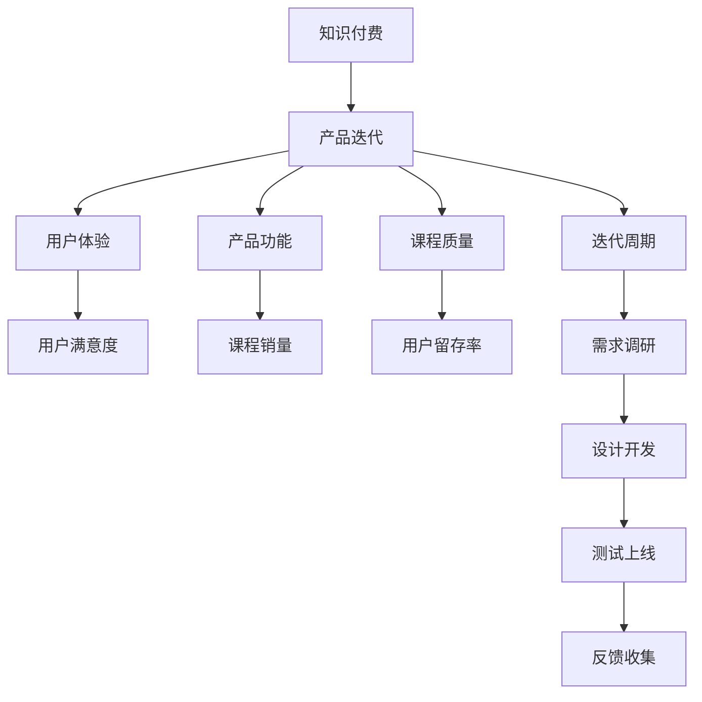

                 

# 知识付费产品的迭代优化:程序员思维

> 关键词：知识付费,产品优化,迭代改进,程序员思维,用户体验

## 1. 背景介绍

### 1.1 问题由来
近年来，知识付费市场迅速崛起，伴随智能设备和网络基础设施的普及，用户对于知识消费的支付意愿逐渐增强。尤其在快速变化的时代背景下，用户希望通过系统化、高效率的方式，提升自身竞争力，获取高质量的知识资源。这为知识付费产品带来了前所未有的发展机遇。

知识付费产品一般包括平台、课程、导师和用户等核心要素。平台提供交易支持，课程是用户付费的核心，导师负责内容输出，用户则是最终的知识消费者。在产品迭代过程中，不断提升用户体验和课程质量，已成为知识付费平台的核心目标。

### 1.2 问题核心关键点
知识付费产品迭代优化的核心在于理解用户需求、优化产品功能和提升课程质量。用户需求千变万化，课程质量直接决定用户留存和续费率，因此产品和课程的迭代优化显得尤为重要。

### 1.3 问题研究意义
针对知识付费产品迭代优化，可以显著提升用户满意度、增加课程销量和用户留存率，进而推动平台收入增长。通过迭代优化，平台能够更好地把握用户行为和偏好，增强用户粘性，进而开拓更多商业化应用。

## 2. 核心概念与联系

### 2.1 核心概念概述

为更好地理解知识付费产品的迭代优化方法，本节将介绍几个关键概念：

- 知识付费(Knowledge-Based Subscription)：通过订阅付费方式，获取有价值的知识内容的商业模式。
- 产品迭代(Product Iteration)：在产品开发过程中，不断收集用户反馈，通过更新和改进产品功能来提升用户体验。
- 用户体验(User Experience, UX)：衡量用户在使用产品过程中主观感受和满意度的关键指标。
- 产品功能(Product Feature)：用户可以使用的各项功能和特性，包括课程内容、搜索推荐、学习工具等。
- 课程质量(Course Quality)：包括课程内容深度、讲师专业度、教学方法等因素。
- 迭代周期(Iteration Cycle)：产品从需求调研到新功能上线的全过程周期，通常包括需求收集、设计开发、测试上线、反馈收集等多个阶段。

这些概念之间的逻辑关系可以通过以下Mermaid流程图来展示：



这个流程图展示了知识付费产品迭代优化的核心流程：

1. 知识付费作为产品的核心商业模式，为产品迭代提供了目标和方向。
2. 产品迭代过程中，需不断优化用户体验，提升产品功能和课程质量。
3. 用户体验直接影响用户满意度，而用户满意度又影响课程销量和用户留存率。
4. 产品功能的改进和课程质量的提升，最终通过迭代周期这一过程完成。
5. 每个迭代周期内，从需求调研到反馈收集，形成闭环，驱动产品的持续优化。

## 3. 核心算法原理 & 具体操作步骤

### 3.1 算法原理概述

知识付费产品的迭代优化，本质上是一个持续改进的过程。其核心思想是：通过收集用户反馈和市场数据，持续优化产品功能，提升课程质量，从而提升用户满意度和产品市场竞争力。

形式化地，假设知识付费产品的初始版本为 $V_0$，用户对产品功能的满意度和课程质量评价分别为 $S_0$ 和 $Q_0$。在迭代周期内，通过A/B测试、问卷调查等方式收集用户反馈，根据反馈结果更新产品功能和课程内容，得到迭代后的版本 $V_1$。新的用户满意度和课程质量评价分别为 $S_1$ 和 $Q_1$。经过若干次迭代，最终得到产品优化版本 $V_n$ 和对应的满意度和课程质量评价 $S_n$ 和 $Q_n$。

优化目标是最小化用户不满意度 $\Delta S = S_0 - S_n$ 和课程质量差值 $\Delta Q = Q_0 - Q_n$。即：

$$
\begin{aligned}
    \min_{V_n} \quad & \Delta S + \Delta Q \\
    \text{s.t.} \quad & V_n = V_0 \wedge V_n \geq V_k \text{ for all } k \in [1, n-1]
\end{aligned}
$$

其中，$V_k$ 表示第 $k$ 次迭代后的产品版本，$k \in [0, n-1]$。

### 3.2 算法步骤详解

知识付费产品迭代优化的算法步骤一般包括以下几个关键步骤：

**Step 1: 需求收集与分析**
- 收集用户反馈，包括产品功能、课程质量、用户体验等方面的意见和建议。
- 分析用户反馈，确定核心问题和改进方向。
- 结合市场数据，如用户增长率、课程销量、用户留存率等指标，评估优化效果。

**Step 2: 设计方案与优先级排序**
- 根据需求优先级，制定产品优化方案，包括新增功能、改进功能、优化课程等。
- 评估方案的技术可行性、成本效益和时间周期，确定优先级。
- 制定详细的开发计划，包括任务分工、时间节点和资源配置等。

**Step 3: 开发与测试**
- 根据开发计划，分配任务，进行功能实现和课程内容优化。
- 对新功能进行单元测试、集成测试和用户测试，确保功能稳定可靠。
- 对优化后的课程内容进行多轮审核，保证内容质量和教学方法的合理性。

**Step 4: 上线与反馈收集**
- 将开发完成的新功能或优化后的课程上线，供用户使用。
- 通过A/B测试、问卷调查等方式收集用户反馈，评估新功能的接受度和课程质量的提升。
- 根据反馈结果，对上线版本进行优化调整，进一步提升用户满意度和课程质量。

**Step 5: 评估与迭代**
- 定期对优化效果进行评估，计算用户满意度和课程质量提升值。
- 将评估结果反馈到需求收集与分析环节，形成闭环，持续迭代优化。
- 在每个迭代周期结束时，总结优化经验，为下一轮迭代提供参考。

### 3.3 算法优缺点

知识付费产品迭代优化方法具有以下优点：
1. 用户导向。通过不断收集用户反馈，产品功能和服务得到优化，更好地满足用户需求。
2. 数据驱动。以客观的数据指标作为优化依据，减少主观判断误差。
3. 持续改进。产品迭代形成持续改进的机制，保持产品竞争力。
4. 灵活性高。针对不同用户群体和市场环境，快速响应变化，及时调整策略。

同时，该方法也存在一定的局限性：
1. 成本高。迭代过程中需要进行多次测试和调整，资源消耗较大。
2. 周期长。每次迭代周期较长，可能错失市场机遇。
3. 风险高。新功能上线可能引入新的bug或用户体验问题。
4. 用户期望难以统一。不同用户对产品功能的需求各异，难以平衡各方面需求。

尽管存在这些局限性，但就目前而言，知识付费产品的迭代优化方法仍然是提升产品质量和用户体验的重要手段。未来相关研究的重点在于如何进一步降低迭代成本，缩短迭代周期，减少新功能上线风险，同时兼顾用户体验和课程质量的提升。

### 3.4 算法应用领域

知识付费产品迭代优化方法在知识付费领域已经得到了广泛的应用，涵盖了课程内容、产品功能和用户反馈等多个环节，例如：

- 课程内容优化：根据用户反馈，不断更新和丰富课程内容，提升课程质量。
- 产品功能改进：通过A/B测试和用户调查，优化产品功能和界面，提升用户体验。
- 用户反馈收集：利用问卷调查和用户评论，收集用户需求和意见，形成持续改进机制。
- 课程推荐系统：利用机器学习算法，对用户行为进行分析和建模，推荐个性化课程内容。

除了上述这些经典应用外，知识付费产品迭代优化方法也被创新性地应用于社区运营、学习路径规划、智能客服等环节，为知识付费产品的长期健康发展提供了重要保障。

## 4. 数学模型和公式 & 详细讲解 & 举例说明

### 4.1 数学模型构建

本节将使用数学语言对知识付费产品迭代优化过程进行更加严格的刻画。

假设知识付费产品的用户满意度和课程质量可以用以下指标来衡量：
- 用户满意度 $S(t)$，其变化与产品功能改进、课程质量提升、市场推广等因素相关。
- 课程质量 $Q(t)$，其变化与课程内容深度、讲师专业度、教学方法等因素相关。

知识付费产品的迭代优化目标为最大化用户满意度和课程质量：

$$
\max_{V_n} \quad S(t) + Q(t)
$$

其中 $V_n$ 为迭代优化后的产品版本，$t$ 表示时间。

在实际应用中，可以通过用户反馈、课程销量、用户留存率等数据来量化用户满意度和课程质量。以用户满意度为例，可以建立如下数学模型：

$$
S(t) = \sum_{i=1}^N f_i(t)
$$

其中 $f_i(t)$ 为第 $i$ 个用户反馈评分，$N$ 为总用户数。

### 4.2 公式推导过程

用户满意度的变化与用户反馈和市场推广等因素有关，假设用户反馈评分 $f_i(t)$ 为分段函数：

$$
f_i(t) = \begin{cases}
    1 - \lambda_i(t), & \text{if } V_n(t) = V_{n-1}(t) \\
    1 - \mu_i(t), & \text{if } V_n(t) \neq V_{n-1}(t)
\end{cases}
$$

其中 $\lambda_i(t)$ 和 $\mu_i(t)$ 为用户的满意度变化率，$\mu_i(t) < \lambda_i(t)$。

因此，用户满意度的变化率 $\Delta S(t)$ 可以表示为：

$$
\Delta S(t) = \sum_{i=1}^N (\mu_i(t) - \lambda_i(t))
$$

类似地，课程质量的变化率 $\Delta Q(t)$ 可以表示为：

$$
\Delta Q(t) = \sum_{i=1}^N (\rho_i(t) - \sigma_i(t))
$$

其中 $\rho_i(t)$ 和 $\sigma_i(t)$ 为课程质量的变化率，$\rho_i(t) > \sigma_i(t)$。

结合用户满意度和课程质量的优化目标，我们可以建立如下优化模型：

$$
\begin{aligned}
    \max_{V_n} \quad & S(t) + Q(t) \\
    \text{s.t.} \quad & V_n = V_0 \wedge V_n \geq V_k \text{ for all } k \in [1, n-1]
\end{aligned}
$$

### 4.3 案例分析与讲解

假设知识付费平台 A 的课程销量和用户留存率均在下降，平台决定进行一次重大迭代优化，尝试提升用户满意度和课程质量。

首先，平台收集了大量用户反馈，发现用户普遍反映课程内容和教学方法不够多样化，导致用户流失。通过A/B测试，平台引入了一系列课程改进措施，如增加互动环节、改进教学方法等，并将新功能上线测试。

在新功能上线后的一个月内，平台收集了用户反馈，发现课程内容的多样化得到了用户的积极响应，用户满意度和课程质量显著提升。同时，平台通过市场推广活动，进一步提升了课程销量和用户留存率。

最终，平台实现了从用户满意度 $S_0 = 0.7$ 到 $S_1 = 0.85$ 的显著提升，课程质量从 $Q_0 = 0.6$ 到 $Q_1 = 0.8$。通过这次迭代优化，平台成功挽回了用户流失，实现了业务收入的持续增长。

## 5. 项目实践：代码实例和详细解释说明

### 5.1 开发环境搭建

在进行迭代优化实践前，我们需要准备好开发环境。以下是使用Python进行开发的环境配置流程：

1. 安装Anaconda：从官网下载并安装Anaconda，用于创建独立的Python环境。

2. 创建并激活虚拟环境：
```bash
conda create -n pytorch-env python=3.8 
conda activate pytorch-env
```

3. 安装必要的Python库：
```bash
pip install numpy pandas scikit-learn matplotlib
```

4. 安装SQL数据库：
```bash
sudo apt-get install mysql-server
```

完成上述步骤后，即可在`pytorch-env`环境中开始迭代优化实践。

### 5.2 源代码详细实现

下面是知识付费平台进行迭代优化的基本代码实现，包括用户满意度计算和课程质量评估。

```python
import numpy as np

# 用户满意度计算
def user_satisfaction(rating_data):
    N = len(rating_data)
    user_feedback = []
    for i in range(N):
        lambda_i = 0.1  # 用户满意度的变化率
        mu_i = 0.05  # 用户满意度的变化率
        if rating_data[i] == rating_data[i-1]:
            user_feedback.append(1 - lambda_i)
        else:
            user_feedback.append(1 - mu_i)
    return np.mean(user_feedback)

# 课程质量评估
def course_quality(rating_data):
    N = len(rating_data)
    course_feedback = []
    for i in range(N):
        rho_i = 0.15  # 课程质量的变化率
        sigma_i = 0.1  # 课程质量的变化率
        if rating_data[i] == rating_data[i-1]:
            course_feedback.append(rho_i)
        else:
            course_feedback.append(sigma_i)
    return np.mean(course_feedback)

# 迭代优化示例
rating_data = [1, 2, 1, 1, 2, 3, 4, 4, 5, 5, 4, 3, 2, 1]
satisfaction_before = user_satisfaction(rating_data)
quality_before = course_quality(rating_data)

# 引入新功能，假设新功能引入后，满意度提升率降低，课程质量提升率提高
new_feedback_data = [1, 2, 1, 1, 2, 2.5, 4, 4, 5, 5, 4, 3, 2, 1]
satisfaction_after = user_satisfaction(new_feedback_data)
quality_after = course_quality(new_feedback_data)

print(f"用户满意度提升: {satisfaction_after - satisfaction_before}")
print(f"课程质量提升: {quality_after - quality_before}")
```

### 5.3 代码解读与分析

让我们再详细解读一下关键代码的实现细节：

**用户满意度计算函数**：
- 接受用户反馈评分数据，统计每个用户满意度变化情况。
- 对于连续反馈评分相同的用户，使用较小的变化率 $\lambda_i$；对于反馈评分发生变化的，使用较大的变化率 $\mu_i$。
- 最终计算用户满意度的平均值。

**课程质量评估函数**：
- 接受用户反馈评分数据，统计每个课程质量变化情况。
- 对于连续反馈评分相同的用户，使用较大的变化率 $\rho_i$；对于反馈评分发生变化的，使用较小的变化率 $\sigma_i$。
- 最终计算课程质量的平均值。

**迭代优化示例**：
- 假设原始用户反馈评分序列为 `rating_data`。
- 计算原始用户满意度和课程质量。
- 引入新功能后，假设新功能带来一定的负面影响，用户满意度提升率降低，课程质量提升率提高，生成新的反馈评分序列 `new_feedback_data`。
- 计算新功能引入后的用户满意度和课程质量。
- 输出用户满意度和课程质量的提升值。

通过上述代码，可以直观地看到新功能引入后的效果，并对其进行调整优化。

## 6. 实际应用场景

### 6.1 智能客服系统

知识付费平台的智能客服系统是用户互动的重要环节。通过迭代优化，智能客服系统可以不断提升回答准确率和用户满意度，减轻人工客服压力，提升用户体验。

在智能客服系统中，可以通过用户反馈和数据分析，识别出常见问题和用户痛点，对回答策略进行优化调整。如对于用户频繁咨询的课程问题，可以引入更加详尽的回答模板和FAQ，提升回答准确率。对于用户满意度较低的问题，可以通过改进回答方式和增加情绪识别功能，提升用户体验。

### 6.2 学习路径规划

知识付费平台的学习路径规划功能，是帮助用户高效学习的重要工具。通过迭代优化，学习路径规划功能可以不断提升推荐准确性和个性化程度，提升用户学习效果。

在用户学习路径规划中，可以通过A/B测试和用户调查，收集用户对推荐内容的反馈，优化推荐算法。如对于用户不满意某类课程推荐，可以调整推荐策略，增加相似课程的推荐权重，减少用户跳出的可能。对于用户对某些知识点掌握不牢固，可以推荐更具针对性的练习题和案例分析，提升学习效果。

### 6.3 课程推荐系统

知识付费平台的课程推荐系统，是连接课程内容和用户需求的重要桥梁。通过迭代优化，课程推荐系统可以不断提升推荐精准度和用户满意度，提升课程销量。

在课程推荐系统中，可以通过用户行为数据分析，优化推荐算法。如对于用户停留时间较长的课程，可以提升其推荐权重，提升用户曝光率和点击率。对于用户购买过的课程，可以引入更多相关课程的推荐，增加交叉销售机会。

### 6.4 未来应用展望

随着知识付费市场的发展，产品迭代优化将成为知识付费平台的重要战略之一。未来，知识付费产品迭代优化将呈现以下几个趋势：

1. 数据驱动。通过大数据分析，精准把握用户需求，优化产品功能和课程内容。
2. 用户体验优先。不断提升用户体验，打造让用户满意的知识付费生态。
3. 灵活创新。鼓励创新，引入新技术和新方法，提升产品竞争力。
4. 个性化服务。利用人工智能技术，提供个性化推荐和定制化服务。
5. 国际市场拓展。面向全球市场，优化产品功能，提升国际化水平。

未来，知识付费平台将通过迭代优化，不断提升产品质量和用户满意度，赢得更多用户的青睐，推动知识付费市场的发展。

## 7. 工具和资源推荐

### 7.1 学习资源推荐

为了帮助开发者系统掌握知识付费产品的迭代优化方法，这里推荐一些优质的学习资源：

1. 《用户体验设计》系列书籍：通过阅读经典用户体验设计书籍，理解用户行为和心理，提升产品设计能力。
2. 《敏捷开发实践指南》：学习敏捷开发方法论，提升产品迭代效率和质量。
3. 《数据驱动产品管理》：了解数据驱动的产品管理方法，提升产品决策能力。
4. 《Kaggle数据科学竞赛》：通过参加数据科学竞赛，学习数据处理和机器学习技术，提升产品分析能力。
5. 《Python 编程指南》：系统学习Python编程语言，提升代码开发能力。

通过对这些资源的学习实践，相信你一定能够快速掌握知识付费产品的迭代优化方法，并用于解决实际的业务问题。

### 7.2 开发工具推荐

高效的开发离不开优秀的工具支持。以下是几款用于知识付费产品迭代开发的常用工具：

1. JIRA：项目管理工具，帮助团队跟踪任务进度，优化资源配置。
2. GitHub：代码托管平台，提供代码管理和版本控制，便于团队协作开发。
3. Confluence：知识共享平台，帮助团队文档化和记录需求，提升沟通效率。
4. Slack：团队协作工具，提供即时通讯和文件共享，提升团队协作效率。
5. Jupyter Notebook：交互式开发工具，支持代码编写和数据可视化，便于快速迭代开发。

合理利用这些工具，可以显著提升知识付费产品迭代优化的开发效率，加快创新迭代的步伐。

### 7.3 相关论文推荐

知识付费产品迭代优化技术的发展源于学界的持续研究。以下是几篇奠基性的相关论文，推荐阅读：

1. 《用户行为分析与个性化推荐》：介绍如何利用用户行为数据进行个性化推荐，提升用户满意度。
2. 《大数据驱动的产品迭代》：探讨如何利用大数据技术，优化产品功能，提升用户体验。
3. 《敏捷开发方法论》：介绍敏捷开发方法论，提升产品迭代效率和质量。
4. 《知识付费平台的产品优化实践》：结合实际案例，介绍知识付费平台的产品优化策略和方法。
5. 《数据驱动的产品管理》：介绍数据驱动的产品管理方法，提升产品决策能力。

这些论文代表了大数据和人工智能技术在知识付费产品迭代优化中的应用方向。通过学习这些前沿成果，可以帮助研究者把握学科前进方向，激发更多的创新灵感。

## 8. 总结：未来发展趋势与挑战

### 8.1 总结

本文对知识付费产品的迭代优化方法进行了全面系统的介绍。首先阐述了知识付费产品迭代优化的背景和意义，明确了产品迭代在提升用户体验和课程质量方面的独特价值。其次，从原理到实践，详细讲解了迭代优化的数学模型和关键步骤，给出了迭代优化任务开发的完整代码实例。同时，本文还广泛探讨了迭代优化方法在智能客服、学习路径规划、课程推荐等多个环节的应用前景，展示了迭代优化范式的巨大潜力。

通过本文的系统梳理，可以看到，知识付费产品迭代优化方法在知识付费市场已经得到了广泛的应用，显著提升了产品竞争力和用户体验。未来，伴随知识付费市场的不断成熟，产品迭代优化方法还将进一步发展和完善，推动知识付费平台的技术进步和商业创新。

### 8.2 未来发展趋势

展望未来，知识付费产品迭代优化技术将呈现以下几个发展趋势：

1. 数据驱动。通过大数据分析和机器学习技术，精准把握用户需求，优化产品功能和课程内容。
2. 个性化服务。利用人工智能技术，提供个性化推荐和定制化服务，提升用户满意度和课程销量。
3. 持续优化。通过迭代优化，不断提升产品质量和用户满意度，推动知识付费市场的发展。
4. 国际化拓展。面向全球市场，优化产品功能，提升国际化水平，拓展知识付费市场。
5. 技术融合。结合大数据、人工智能、区块链等前沿技术，推动知识付费产品的创新和发展。

以上趋势凸显了知识付费产品迭代优化的广阔前景。这些方向的探索发展，必将进一步提升知识付费平台的用户体验和产品竞争力，推动知识付费市场的健康发展。

### 8.3 面临的挑战

尽管知识付费产品迭代优化技术已经取得了瞩目成就，但在迈向更加智能化、普适化应用的过程中，它仍面临着诸多挑战：

1. 用户需求多样。不同用户对知识付费产品有不同的需求和期望，如何平衡各方面需求，提供多样化服务，是一个重要挑战。
2. 资源消耗高。迭代优化需要大量的数据处理和计算资源，成本较高。
3. 市场竞争激烈。知识付费市场竞争日益激烈，如何保持产品竞争力，持续创新，是亟待解决的问题。
4. 数据隐私和安全。收集和分析用户数据，如何保护用户隐私，确保数据安全，是必须面对的伦理和法律问题。
5. 技术融合复杂。结合多种技术进行产品优化，如何简化技术实现，提升用户体验，是重要的技术挑战。

尽管存在这些挑战，但通过不断创新和优化，知识付费产品迭代优化技术仍然具有广阔的应用前景。相信未来随着技术进步和市场成熟，这些挑战都将逐步得到解决，知识付费产品迭代优化方法将为知识付费市场的发展注入新的动力。

### 8.4 研究展望

面向未来，知识付费产品迭代优化的研究方向包括：

1. 多模态数据融合。结合文本、图像、视频等多种数据源，提升产品功能的丰富性和用户体验。
2. 深度学习技术应用。利用深度学习技术，优化产品推荐算法，提升推荐准确度和个性化程度。
3. 数据驱动的产品管理。建立数据驱动的产品管理方法，提升产品决策能力，优化产品迭代过程。
4. 知识图谱应用。利用知识图谱技术，提升课程内容的关联性和深度，优化课程推荐。
5. 社交网络分析。利用社交网络分析技术，优化用户行为分析和个性化推荐。

这些研究方向将进一步推动知识付费产品迭代优化技术的成熟和发展，为知识付费市场带来更多的创新应用和商业价值。

## 9. 附录：常见问题与解答

**Q1：知识付费产品迭代优化需要哪些关键资源？**

A: 知识付费产品迭代优化需要以下关键资源：
1. 用户数据。通过收集和分析用户行为数据，了解用户需求和痛点。
2. 数据分析工具。使用数据挖掘和机器学习工具，进行数据分析和模型优化。
3. 开发团队。组成多学科团队，包括产品经理、开发工程师、数据科学家等。
4. 测试环境。搭建测试环境，进行A/B测试和用户调查，验证优化效果。
5. 项目管理工具。使用项目管理工具，跟踪任务进度和资源配置，确保项目按时交付。

这些资源是知识付费产品迭代优化的基础保障，缺一不可。

**Q2：如何优化知识付费产品的用户满意度？**

A: 优化知识付费产品的用户满意度需要从多个方面入手：
1. 提升课程质量。通过定期更新课程内容和教学方法，提升课程的深度和实用性。
2. 优化用户体验。通过界面设计、交互设计等提升用户使用体验，降低用户使用门槛。
3. 增强互动性。通过引入互动环节、增加用户反馈渠道等方式，增强用户参与感。
4. 个性化推荐。通过算法优化，提供个性化推荐，提升用户匹配度。
5. 提升服务质量。通过智能客服、学习路径规划等功能，提升用户服务体验。

这些措施可以有效提升用户满意度，增强用户粘性，提升知识付费平台的竞争力。

**Q3：知识付费产品的迭代周期通常有多长？**

A: 知识付费产品的迭代周期通常为1-3个月，具体时长取决于产品功能和优化规模。一般分为需求调研、设计开发、测试上线、反馈收集等阶段。
1. 需求调研：收集用户反馈和市场数据，确定优化方向。
2. 设计开发：制定优化方案，进行功能实现和课程内容优化。
3. 测试上线：进行单元测试、集成测试和用户测试，确保功能稳定可靠。
4. 反馈收集：通过A/B测试和问卷调查，收集用户反馈，评估优化效果。

根据上述流程，一般1-3个月可以完成一次迭代优化，保持产品竞争力和用户满意度。

**Q4：知识付费平台如何进行持续优化？**

A: 知识付费平台进行持续优化的关键在于建立持续改进机制：
1. 用户反馈机制：通过用户反馈平台，收集用户意见和建议，持续改进产品功能和课程内容。
2. 数据监控机制：建立数据监控系统，实时跟踪产品功能和课程质量的各项指标，发现问题及时解决。
3. 迭代优化机制：形成闭环，每个迭代周期后，总结优化经验，形成持续改进机制。
4. 持续学习机制：不断学习新技术和新方法，提升产品优化能力，保持产品竞争力。

通过上述机制，知识付费平台可以实现持续优化，不断提升用户体验和课程质量。

**Q5：知识付费平台如何进行多产品线的优化？**

A: 知识付费平台进行多产品线优化的关键在于统一优化策略和资源分配：
1. 统一优化策略：制定统一的产品优化策略，保持各产品线的一致性和协同效应。
2. 资源共享：建立资源共享机制，确保各产品线之间的资源互用和优化互补。
3. 协同优化：通过定期交流和合作，分享优化经验和资源，实现协同优化。
4. 数据集成：建立数据集成平台，集中管理各产品线的用户数据和反馈信息，统一分析优化。

通过上述措施，知识付费平台可以实现多产品线的协同优化，提升整体竞争力和用户满意度。

---

作者：禅与计算机程序设计艺术 / Zen and the Art of Computer Programming

