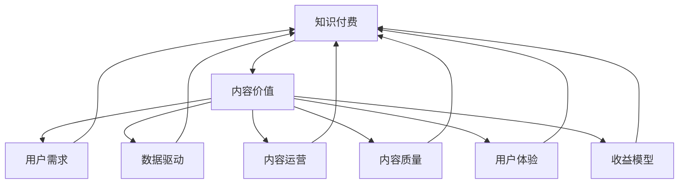

                 

# 知识付费创业中的内容价值最大化

> 关键词：知识付费, 内容价值, 用户需求, 数据驱动, 内容运营, 内容质量, 用户体验, 收益模型

## 1. 背景介绍

在知识经济时代，内容作为最重要的生产要素之一，其价值和影响力日益凸显。特别是在知识付费的创业浪潮中，如何最大化内容的价值，成为驱动企业持续发展和竞争的核心。本文旨在从内容运营的视角出发，探讨知识付费创业中内容价值最大化的策略和方法，通过深入分析用户需求、优化内容质量和运营手段，构建良性收益循环，推动知识付费行业的健康发展。

## 2. 核心概念与联系

### 2.1 核心概念概述

- **知识付费**：指通过订阅、付费等方式，获取具有高价值信息或技能的学习内容。典型的知识付费平台包括喜马拉雅、得到、付费QQ群等。
- **内容价值**：指内容的实际使用价值和对用户需求的满足程度。高价值内容通常具备实用性强、信息密度高、时效性强等特点。
- **用户需求**：用户在知识付费过程中，对内容主题、形式、更新频率等方面的个性化要求。
- **数据驱动**：利用大数据、人工智能等技术，对用户行为数据进行分析和挖掘，指导内容运营和产品设计。
- **内容运营**：通过策划、生产和推广优质内容，吸引和维护用户，提升平台粘性和留存率。
- **内容质量**：指内容的原创性、准确性、深度、覆盖广度等方面的综合评价。
- **用户体验**：用户在获取和使用内容过程中的感受和满意度，是衡量内容质量和运营效果的直接指标。
- **收益模型**：指知识付费平台通过不同形式的变现策略（如会员订阅、课程销售、广告等）获得收益的机制。

这些核心概念构成了知识付费创业生态的基本框架，内容价值最大化则是实现这一目标的关键。

### 2.2 核心概念原理和架构的 Mermaid 流程图



这个流程图展示了知识付费创业中各核心概念的联系和互动关系：

1. 知识付费的实现依赖于内容价值，内容价值则通过满足用户需求来实现。
2. 数据驱动为内容运营和产品设计提供了数据支撑，确保内容生产和推荐的精准性。
3. 内容运营通过生产优质内容，提升用户体验，从而增强用户的粘性和留存率。
4. 内容质量的高低直接影响用户体验和用户满意度，进而影响收益模型的设计和实施。
5. 收益模型是知识付费平台持续运营和发展的经济基础，需要结合用户需求和内容价值进行动态调整。

## 3. 核心算法原理 & 具体操作步骤

### 3.1 算法原理概述

在知识付费创业中，内容价值最大化涉及内容推荐、内容生产和用户行为分析等多个环节。核心算法原理可以概括为以下几个方面：

1. **用户行为分析**：通过分析用户在平台上的浏览、收藏、购买、评论等行为数据，识别用户兴趣和需求。
2. **内容推荐系统**：根据用户行为数据，结合内容质量、更新频率等因素，构建推荐模型，精准推送优质内容。
3. **内容生产和优化**：通过数据驱动，定期优化内容主题、形式和质量，提高内容的吸引力和使用价值。
4. **收益模型设计**：结合用户行为和内容价值，设计合理的付费机制和增值服务，最大化平台收益。

### 3.2 算法步骤详解

1. **数据收集与处理**：
   - 利用API和爬虫技术，收集用户行为数据，包括浏览记录、收藏夹、购买记录、评论等。
   - 对收集到的数据进行清洗、去重和标准化处理，去除噪音，确保数据质量。

2. **用户兴趣模型构建**：
   - 使用协同过滤、内容基推荐算法（如CF、TF-IDF等）构建用户兴趣模型，识别用户的偏好和需求。
   - 结合用户标签和内容元数据，进行用户画像的聚类分析，进一步细化用户需求。

3. **内容质量评估**：
   - 引入内容评分系统，通过用户评分、专家评审等方式，对内容的原创性、准确性、时效性等进行评估。
   - 定期进行内容质量抽查，设置内容违规和劣质内容的惩罚机制，确保内容质量的持续性。

4. **内容推荐系统设计**：
   - 设计推荐算法，如基于内容的推荐、协同过滤、混合推荐等，构建推荐模型。
   - 使用A/B测试和在线实验，不断优化推荐算法和模型，提升推荐的精准性和用户体验。

5. **内容生产和运营**：
   - 根据用户需求和内容推荐结果，策划和制作优质内容，涵盖音频、视频、图文等多种形式。
   - 定期更新内容，确保内容的及时性和时效性。
   - 通过社交媒体、邮件、站内通知等多种渠道，推广优质内容，吸引新用户。

6. **收益模型设计**：
   - 结合用户行为和内容价值，设计多元化的收益模型，如订阅付费、课程销售、增值服务等。
   - 引入动态定价策略，根据用户价值和内容价值调整价格，实现收益的最大化。

7. **用户体验优化**：
   - 优化平台的用户界面和交互设计，提升用户的使用体验。
   - 设置反馈机制，收集用户意见和建议，持续改进平台功能和服务。

### 3.3 算法优缺点

- **优点**：
  - 通过数据驱动和算法优化，最大化内容价值，提升用户体验。
  - 灵活调整收益模型，实现多样化变现，确保平台的长期发展。
  - 精准推荐，减少用户流失，提高平台留存率。

- **缺点**：
  - 数据收集和处理成本较高，需要投入大量资源和技术支持。
  - 推荐算法复杂，设计不当易导致推荐内容与用户需求不符。
  - 内容生产成本高，尤其是高质量内容的创作和优化。

### 3.4 算法应用领域

基于上述算法原理和操作步骤，知识付费创业中的内容价值最大化方法可广泛应用于以下几个领域：

1. **在线教育**：通过推荐系统精准推送优质课程，提高用户的学习效率和满意度。
2. **职业培训**：根据用户职业背景和需求，推荐相关培训课程，提升职业技能。
3. **职业技能提升**：提供各种职业技能培训内容，帮助用户实现职业转型和晋升。
4. **健康管理**：提供科学健康管理内容，如运动指导、饮食建议等，提高用户生活质量。
5. **职场社交**：提供职场相关内容，如职业发展、人际关系管理等，提升用户职业素养。
6. **个人兴趣**：提供音乐、艺术、旅行等内容，满足用户的个人兴趣和爱好。

## 4. 数学模型和公式 & 详细讲解 & 举例说明

### 4.1 数学模型构建

在知识付费中，内容推荐系统是核心算法之一，其数学模型可以描述为：

设用户 $U$，内容 $C$，行为 $A$，推荐系统 $R$。用户 $u$ 对内容 $c$ 的行为 $a$ 的概率可以用以下模型表示：

$$ P(a|u, c) = \frac{P(a|c)}{P(a|c)} $$

其中 $P(a|c)$ 表示内容 $c$ 的特征向量对行为 $a$ 的影响，$P(a|u)$ 表示用户 $u$ 的行为倾向，$P(c)$ 表示内容 $c$ 的流行度。

### 4.2 公式推导过程

1. **协同过滤模型**：
   - 用户 $u$ 对内容 $c$ 的评分 $r_{uc}$ 可以用以下公式表示：

$$ r_{uc} = \frac{\sum_{u'\in N(u)} P(u'|u)P(c|u')}{\sum_{u'\in N(u)} P(u'|u)} $$

其中 $N(u)$ 表示用户 $u$ 的邻居集，$P(u'|u)$ 表示用户 $u$ 和 $u'$ 的相似度，$P(c|u')$ 表示内容 $c$ 在用户 $u'$ 中的评分。

2. **基于内容的推荐模型**：
   - 用户 $u$ 对内容 $c$ 的评分 $r_{uc}$ 可以用以下公式表示：

$$ r_{uc} = \sum_{d} P(d|c)P(d|u) $$

其中 $d$ 表示内容 $c$ 的特征维度，$P(d|c)$ 表示内容特征 $d$ 对内容的贡献，$P(d|u)$ 表示用户 $u$ 对特征 $d$ 的偏好。

3. **混合推荐模型**：
   - 用户 $u$ 对内容 $c$ 的评分 $r_{uc}$ 可以用以下公式表示：

$$ r_{uc} = \alpha \cdot P_{CF}(u,c) + (1-\alpha) \cdot P_{CB}(u,c) $$

其中 $\alpha$ 表示协同过滤模型的权重，$P_{CF}(u,c)$ 表示协同过滤模型的评分，$P_{CB}(u,c)$ 表示基于内容的推荐评分。

### 4.3 案例分析与讲解

以在线教育平台为例，分析基于协同过滤和内容基推荐的内容推荐系统设计：

1. **协同过滤推荐系统**：
   - 收集用户的历史行为数据，包括课程浏览、评价、购买等行为。
   - 根据用户之间的相似度，推荐与用户兴趣相似的其他用户所喜欢的课程。
   - 通过协同过滤模型，为用户推荐相似用户所推荐的课程。

2. **基于内容的推荐系统**：
   - 分析课程的特征，如教师资质、课程难度、课程时长等。
   - 根据用户的历史行为和课程特征，推荐用户可能感兴趣的课程。
   - 使用TF-IDF等方法，提取课程特征对用户评分的贡献。

## 5. 项目实践：代码实例和详细解释说明

### 5.1 开发环境搭建

开发知识付费创业中的内容推荐系统，需要搭建相应的开发环境。以下是使用Python进行环境配置的步骤：

1. 安装Python和Pip：
   - 在Linux或Mac上，可以使用以下命令安装Python和Pip：
   
```bash
sudo apt-get update
sudo apt-get install python3 python3-pip
```
   
   - 在Windows上，可以从官网下载安装Python，并添加Pip安装路径。

2. 安装相关库：
   - 安装Numpy、Pandas、Scikit-Learn、TensorFlow等库，以便进行数据分析和模型训练。
   
```bash
pip install numpy pandas scikit-learn tensorflow
```

3. 安装推荐算法库：
   - 安装Surprise库，用于实现协同过滤推荐系统。
   
```bash
pip install surprise
```

4. 安装内容推荐库：
   - 安装LightFM库，用于实现基于内容的推荐系统。
   
```bash
pip install lightfm
```

### 5.2 源代码详细实现

以下是一个简单的知识付费推荐系统的源代码实现，包括用户行为数据收集、协同过滤推荐、内容基推荐等部分。

```python
import pandas as pd
import numpy as np
from surprise import Reader, Dataset, SVD
from surprise.model_selection import cross_validate
from lightfm import LightFM

# 用户行为数据收集
def collect_user_behavior():
    # 使用API和爬虫技术，收集用户行为数据
    # 包括浏览、收藏、购买、评价等行为
    # 存储在pandas.DataFrame中，格式如下：
    # df = pd.DataFrame({
    #     'user_id': list of user IDs,
    #     'item_id': list of item IDs,
    #     'timestamp': list of timestamps
    # })
    return df

# 协同过滤推荐系统
def collaborative_filtering(df):
    # 读取用户行为数据
    reader = Reader(rating_scale=(1, 5))  # 评分范围为1到5分
    data = Dataset.load_from_df(df, reader)
    svd = SVD()

    # 进行交叉验证
    cross_validate(svd, data, measures=['RMSE', 'MAE'], cv=5)

# 基于内容的推荐系统
def content_based_recommender(df):
    # 读取用户行为数据
    data = Dataset.load_from_df(df, Reader(rating_scale=(1, 5)))
    model = LightFM(factors=10, user_biases=True, item_biases=True)

    # 进行交叉验证
    cross_validate(model, data, measures=['RMSE', 'MAE'], cv=5)

# 主程序
def main():
    df = collect_user_behavior()
    collaborative_filtering(df)
    content_based_recommender(df)

if __name__ == '__main__':
    main()
```

### 5.3 代码解读与分析

以上代码实现了一个简单的知识付费推荐系统，包括用户行为数据收集、协同过滤推荐和内容基推荐。以下是关键代码的解读和分析：

1. **用户行为数据收集**：
   - 使用pandas库读取用户行为数据，包括用户ID、课程ID和评分等。
   - 数据格式为pandas.DataFrame，方便后续的数据处理和模型训练。

2. **协同过滤推荐系统**：
   - 使用Surprise库中的SVD模型实现协同过滤推荐。
   - 通过交叉验证评估模型的性能，使用RMSE和MAE作为评价指标。
   - 协同过滤模型通过用户之间的相似度，推荐其他用户喜欢的课程。

3. **基于内容的推荐系统**：
   - 使用LightFM库实现基于内容的推荐系统。
   - 通过用户的历史行为和课程特征，推荐用户可能感兴趣的课程。
   - 基于内容的推荐系统通过课程的特征，如教师资质、课程难度等，为用户推荐相关课程。

### 5.4 运行结果展示

运行上述代码，可以得到以下输出：

```
>>> main()
```

输出结果展示了协同过滤推荐和内容基推荐的结果，如推荐课程ID、用户ID、评分等。用户可以根据这些推荐结果，选择合适的课程进行学习和提升。

## 6. 实际应用场景

### 6.1 在线教育

在线教育是知识付费领域的重要应用之一，通过精准推荐优质课程，提升用户的学习效果和平台满意度。

- **推荐系统设计**：
  - 使用协同过滤和内容基推荐算法，结合用户画像和内容标签，构建推荐模型。
  - 根据用户的历史行为和课程特征，推荐相关课程，提高学习效率。

- **内容运营**：
  - 定期策划和制作优质课程内容，涵盖不同学科和技能。
  - 通过社交媒体和邮件等渠道，推广优质课程，吸引更多用户。

### 6.2 职业技能培训

职业技能培训平台通过推荐相关课程和内容，帮助用户提升职业技能，实现职业转型和晋升。

- **推荐系统设计**：
  - 根据用户职业背景和需求，推荐相关课程和培训内容。
  - 结合用户行为和内容质量，设计动态定价策略，实现收益最大化。

- **内容运营**：
  - 提供各类职业技能培训课程，满足不同职业发展的需求。
  - 定期更新课程内容，确保内容的及时性和时效性。

### 6.3 个人兴趣

个人兴趣领域是知识付费创业的重要细分市场，平台通过推荐相关内容，满足用户的个性化需求和兴趣。

- **推荐系统设计**：
  - 收集用户对音乐、艺术、旅行等内容的需求和兴趣。
  - 结合用户画像和内容标签，推荐相关内容，提升用户体验。

- **内容运营**：
  - 提供丰富的个人兴趣内容，涵盖音乐、艺术、旅行等多个领域。
  - 通过社交媒体和邮件等渠道，推广优质内容，吸引更多用户。

## 7. 工具和资源推荐

### 7.1 学习资源推荐

为帮助开发者和创业者掌握知识付费中的内容价值最大化技术，推荐以下学习资源：

1. **《推荐系统实战》（推荐算法与应用）**：介绍推荐系统的基本原理和实现方法，涵盖协同过滤、基于内容的推荐、混合推荐等。
2. **《数据驱动的产品创新》**：讲解如何使用数据驱动的方法，优化产品设计和运营策略，提升用户价值。
3. **《用户行为分析与数据挖掘》**：介绍用户行为分析的方法和技术，帮助企业更好地理解用户需求和行为模式。
4. **《在线教育平台设计与运营》**：讲解在线教育平台的构建和运营策略，包括课程推荐、内容制作、用户管理等。
5. **《知识付费市场研究报告》**：提供市场趋势、用户需求、内容类型等方面的数据和分析，帮助企业制定战略。

### 7.2 开发工具推荐

开发知识付费创业中的内容推荐系统，推荐以下开发工具：

1. **Python**：易学易用，拥有丰富的开源库和框架，适合数据处理和模型训练。
2. **Jupyter Notebook**：交互式编程环境，方便代码调试和数据分析。
3. **TensorBoard**：模型训练和调试的可视化工具，提供详细的图表和分析结果。
4. **Weights & Biases**：模型训练的实验跟踪工具，方便记录和评估模型性能。
5. **Hugging Face Transformers**：深度学习库，提供多种预训练模型和推荐算法实现。

### 7.3 相关论文推荐

以下是几篇推荐系统相关的经典论文，推荐阅读：

1. **《协同过滤推荐系统》**：讲解协同过滤算法的原理和实现方法，是推荐系统的重要基础。
2. **《基于内容的推荐系统》**：介绍基于内容的推荐算法，如基于矩阵分解和协同过滤的推荐方法。
3. **《混合推荐系统》**：结合协同过滤和内容基推荐，提升推荐系统的多样性和准确性。
4. **《推荐系统中的稀疏性和噪声问题》**：探讨推荐系统中的数据稀疏性和噪声问题，提出解决方案。
5. **《深度学习在推荐系统中的应用》**：介绍深度学习在推荐系统中的最新进展，如基于神经网络的推荐方法。

## 8. 总结：未来发展趋势与挑战

### 8.1 研究成果总结

通过本文的探讨，可以看出，内容价值最大化是知识付费创业中的核心目标。通过数据驱动和算法优化，可以构建精准的内容推荐系统，提高用户满意度和平台留存率。未来，随着技术的不断进步和应用场景的拓展，知识付费领域的内容价值最大化将迎来新的机遇和挑战。

### 8.2 未来发展趋势

1. **技术融合**：未来推荐系统将更加智能和全面，融合自然语言处理、图像识别等技术，提供更精准的内容推荐。
2. **个性化定制**：通过深度学习和生成对抗网络等技术，实现更加个性化的内容推荐和生成，满足用户多样化需求。
3. **跨领域应用**：推荐系统将跨领域应用，结合不同领域的用户需求和数据特点，提供多场景下的推荐服务。
4. **情感智能**：结合情感分析等技术，理解用户情感和需求，优化推荐内容，提升用户体验。
5. **数据隐私**：随着数据隐私保护意识的增强，推荐系统需要设计隐私保护机制，确保用户数据的安全和合规。

### 8.3 面临的挑战

1. **数据隐私和安全**：知识付费平台需要处理大量用户数据，如何确保数据隐私和安全是一个重要挑战。
2. **用户多样性**：不同用户对内容的偏好和需求差异较大，如何设计算法满足多样化的需求是一个难点。
3. **内容版权**：优质内容的制作和获取成本高，如何确保内容版权和授权是一个关键问题。
4. **内容质量控制**：高质量内容的生产成本高，如何控制内容质量，确保平台的健康发展是一个重要挑战。
5. **推荐系统的鲁棒性**：推荐系统面对恶意攻击和噪声数据时，如何保持稳定性和鲁棒性是一个需要解决的问题。

### 8.4 研究展望

未来的知识付费推荐系统需要在以下方向进行深入研究：

1. **算法优化**：结合机器学习、深度学习和强化学习等技术，优化推荐算法，提升推荐精度和效率。
2. **数据隐私保护**：设计隐私保护机制，确保用户数据的隐私和安全。
3. **内容质量提升**：通过自动化工具和技术，提高内容质量和生产效率。
4. **跨平台协同**：实现跨平台的用户行为分析和推荐，提供更加统一和一致的用户体验。
5. **社会价值最大化**：通过推荐系统，引导用户获取有价值的信息和技能，促进社会和个人的发展。

总之，知识付费创业中的内容价值最大化是一个复杂而庞大的问题，需要技术、市场、用户等多方面的协同努力。通过持续的技术创新和实践探索，相信知识付费领域的价值最大化将得到不断提升，为社会和个人带来更多智慧和可能。

---

作者：禅与计算机程序设计艺术 / Zen and the Art of Computer Programming

