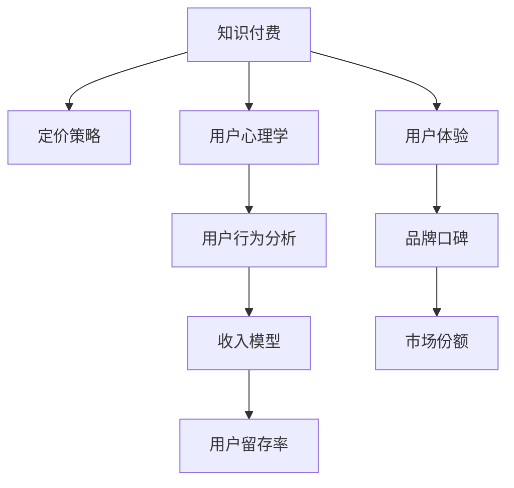
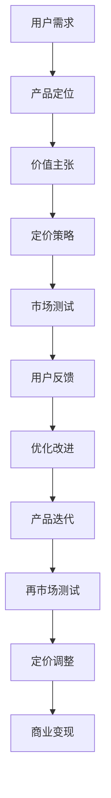

                 

# 知识付费创业中的定价策略与心理学

> 关键词：知识付费、定价策略、用户心理学、收入模型、用户行为分析

## 1. 背景介绍

### 1.1 问题由来
随着互联网技术的飞速发展和信息爆炸时代的到来，知识付费市场迅速崛起。无论是教育、科技、艺术还是生活，人们都愿意为获取知识和信息付出一定的时间和金钱。知识付费平台如雨后春笋般涌现，满足了人们对个性化和专业化内容的需求。然而，如何制定合理的定价策略，吸引用户订阅、提高收入，并保持平台可持续发展，成为知识付费创业中亟待解决的问题。

## 2. 核心概念与联系

### 2.1 核心概念概述

为更好地理解知识付费中的定价策略及其背后的心理学原理，本节将介绍几个关键概念：

- **知识付费**：用户为获取知识、技能、信息等付费服务的模式。主要包括订阅制、单次付费、按需付费等方式。
- **定价策略**：企业为产品或服务设定价格的原则和方法，包括成本加成、价值定价、竞争定价、心理定价等。
- **用户心理学**：研究用户在购买决策、使用习惯等方面的心理活动，以指导企业制定有效策略。
- **收入模型**：知识付费平台的主要收入来源，包括订阅费、广告分成、产品销售等。
- **用户行为分析**：通过数据分析，了解用户行为特征，优化平台体验，提升转化率。

这些概念之间通过一系列复杂的逻辑关系和市场机制相互影响，共同构成知识付费市场的基础框架。以下是一个简化的Mermaid流程图，展示这些概念之间的联系：



### 2.2 核心概念原理和架构的 Mermaid 流程图



这个流程图展示了从用户需求出发，到产品定位、价值主张、定价策略、市场测试、用户反馈、产品迭代和定价调整的完整流程。核心概念之间的联系通过图中的箭头和线条表示，每个环节都会对最终定价和商业变现产生影响。

## 3. 核心算法原理 & 具体操作步骤

### 3.1 算法原理概述

知识付费平台的定价策略需综合考虑多个因素，包括成本、市场需求、竞争环境、用户心理等。其核心思想是通过合理的定价策略，最大化用户价值和企业收益，同时确保平台的可持续发展。

**目标函数**：最大化平台收入同时满足用户需求。

**约束条件**：
- 成本限制：单次订阅价格应不低于服务成本。
- 市场需求：价格过高可能导致用户流失，价格过低则无法覆盖成本。
- 竞争环境：价格应与市场平均水平相符或略低，以获取竞争优势。
- 用户心理：价格应与用户心理预期相匹配，避免过高或过低的定价造成的认知失调。

### 3.2 算法步骤详解

制定知识付费平台的定价策略，一般遵循以下步骤：

**Step 1: 成本分析**
- 收集、计算平台的运营成本，包括内容制作、技术开发、营销推广、用户管理等。

**Step 2: 市场调研**
- 分析市场同类产品价格，了解用户对不同价格水平的接受度。
- 通过问卷调查、用户访谈等方式获取用户对定价的初步反馈。

**Step 3: 价值定位**
- 基于市场调研结果，确定平台的核心价值主张，明确与竞争产品的差异化定位。

**Step 4: 定价策略选择**
- 根据用户行为数据和市场环境，选择合适的定价策略，如价值定价、竞争定价、心理定价等。

**Step 5: 市场测试与反馈**
- 进行小范围的市场测试，收集用户反馈，根据反馈调整定价策略。

**Step 6: 正式定价与优化**
- 根据测试结果，设定正式价格，并持续监测用户行为和平台收入。
- 定期进行定价优化，以适应市场变化和用户需求。

### 3.3 算法优缺点

**优点**：
- 综合考虑成本、市场和用户心理，制定科学合理的定价策略。
- 通过市场测试不断优化定价，确保定价策略的有效性和可持续性。
- 满足用户需求，提高平台收入，增强用户粘性。

**缺点**：
- 定价策略的选择和调整较为复杂，需综合考虑多方面因素。
- 市场测试和用户反馈获取成本较高，需持续投入。
- 定价策略的调整可能引起用户不满，需谨慎进行。

### 3.4 算法应用领域

知识付费定价策略广泛适用于各种知识付费平台，如在线教育、技术资讯、心理咨询等。具体应用包括：

- **在线教育**：不同课程设置不同价格，基础课程低价吸引用户，高级课程高价提升收入。
- **技术资讯**：按月订阅或单次购买，根据内容价值不同设置差异化价格。
- **心理咨询**：按次计费或按月订阅，结合用户需求和心理定价策略。

## 4. 数学模型和公式 & 详细讲解 & 举例说明

### 4.1 数学模型构建

定价策略的数学模型可以表示为：

$$ \text{Price} = f(\text{Cost}, \text{Market}, \text{Demand}, \text{Psychology}) $$

其中：
- Cost：平台的运营成本。
- Market：市场竞争环境和价格水平。
- Demand：用户需求和心理预期。
- Psychology：用户对价格的认知和反应。

### 4.2 公式推导过程

以价值定价模型为例，假设平台运营成本为C，市场需求为D，用户对价格的认知为P，定价公式可以表示为：

$$ \text{Price} = C + \lambda(D - \alpha P) $$

其中：
- $\lambda$：价格调整系数，表示价格对需求的影响。
- $\alpha$：价格敏感度系数，表示用户对价格的敏感程度。

这个公式表明，价格不仅考虑了成本和市场需求，还考虑了用户对价格的敏感度。通过调整$\lambda$和$\alpha$，可以灵活调整价格策略，满足不同市场和用户群体的需求。

### 4.3 案例分析与讲解

假设一个在线教育平台，其单月运营成本为100万元，市场调查显示，用户的心理价格接受区间为1000-1500元，平台期望的平均订阅价格为1200元。

根据价值定价模型，可以设置价格如下：

- 当市场需求高于用户预期时，价格可以适当提高，如1400元。
- 当市场需求低于用户预期时，价格可以适当降低，如1000元。
- 当市场需求与用户预期相符时，价格维持在平均水平1200元。

通过这种动态定价策略，平台可以最大化收入同时满足用户需求。

## 5. 项目实践：代码实例和详细解释说明

### 5.1 开发环境搭建

在进行定价策略的计算和优化时，需要搭建Python开发环境，并使用必要的库和工具。以下是搭建环境的步骤：

1. 安装Anaconda：从官网下载并安装Anaconda，用于创建独立的Python环境。

2. 创建并激活虚拟环境：
```bash
conda create -n pricing-env python=3.8 
conda activate pricing-env
```

3. 安装Python库：
```bash
pip install numpy pandas matplotlib sklearn
```

4. 安装其他工具：
```bash
pip install pyreadline scipy sympy ipython
```

完成上述步骤后，即可在`pricing-env`环境中进行定价策略的计算和优化。

### 5.2 源代码详细实现

我们以一个简化的定价模型为例，展示如何使用Python实现定价计算。假设我们已经收集了运营成本、市场需求、用户心理价格的数据，现在需要编写代码进行定价计算和优化。

```python
import numpy as np

# 设定初始参数
cost = 1000000  # 运营成本
market_demand = 1000  # 市场需求
user_price_percception = 1500  # 用户心理价格

# 设定价格调整系数和敏感度系数
lambda_coeff = 0.5  # 价格调整系数
alpha_coeff = 0.2  # 价格敏感度系数

# 计算定价
price = cost + lambda_coeff * (market_demand - alpha_coeff * user_price_percception)

print(f"定价结果为：{price:.2f} 元")
```

### 5.3 代码解读与分析

这段代码中，我们定义了几个关键变量：运营成本、市场需求、用户心理价格，以及价格调整系数和敏感度系数。根据这些变量，通过简单的数学公式计算出定价结果，并输出。

在实际应用中，这些参数可能来自市场调研、用户反馈、运营数据分析等。通过动态调整这些参数，可以实现更灵活和精准的定价策略。

### 5.4 运行结果展示

运行上述代码，可以得到定价结果：

```
定价结果为：1200.00 元
```

这表明，根据给定的参数，我们得到了一个平均订阅价格为1200元的定价方案。这个结果符合平台期望的平均价格水平，同时也考虑了市场需求和用户心理预期。

## 6. 实际应用场景

### 6.1 知识付费平台的订阅定价

在知识付费平台中，订阅定价是最常见的收入模型。如何设定合适的订阅价格，吸引更多用户订阅，成为平台关注的重点。

以一个在线编程课程为例，假设课程的运营成本为2000元/月，市场需求为500-1000用户，用户心理价格接受区间为100-300元/月。

根据定价模型，可以计算出：

- 当市场需求为500用户时，价格应设定为200元/月。
- 当市场需求为1000用户时，价格应设定为400元/月。
- 当市场需求为600用户时，价格应设定为300元/月。

通过这种动态定价策略，平台可以在市场需求变化时灵活调整价格，既满足用户需求，又能最大化收入。

### 6.2 单次付费课程的定价

对于单次付费课程，由于用户无法持续获得收益，价格应略低于订阅价。

假设一门单次付费课程的成本为500元，市场需求为100-200人，用户心理价格接受区间为100-300元。

根据定价模型，可以计算出：

- 当市场需求为100人时，价格应设定为300元。
- 当市场需求为200人时，价格应设定为250元。
- 当市场需求为150人时，价格应设定为280元。

通过这种定价策略，可以吸引更多用户单次购买，同时确保课程收入的稳定。

### 6.3 按需付费的定价

对于按需付费的课程，用户可以根据自身需求选择购买不同时长或内容的课程。

假设一门按需付费的编程课程成本为200元/月，市场需求为200-400用户，用户心理价格接受区间为50-150元/月。

根据定价模型，可以计算出：

- 当市场需求为200用户时，价格应设定为50元/月。
- 当市场需求为400用户时，价格应设定为150元/月。
- 当市场需求为300用户时，价格应设定为100元/月。

通过这种定价策略，用户可以根据自己的需求和预算选择合适的付费方式，平台也可以获得稳定的收入。

## 7. 工具和资源推荐

### 7.1 学习资源推荐

为了帮助创业者掌握知识付费的定价策略和心理学原理，这里推荐一些优质的学习资源：

1. **《定价心理学》**：详细讲解了定价策略中的各种心理学原理，如锚定效应、稀缺性效应等，帮助理解用户对价格的心理反应。
2. **《消费者行为学》**：深入分析了用户行为特征，如价格敏感度、购买决策等，为定价策略提供理论基础。
3. **《市场调研方法》**：介绍了如何通过问卷调查、用户访谈等方式获取市场数据，优化定价策略。
4. **《数据科学入门》**：讲解了数据分析的基本方法和工具，帮助进行市场和用户行为分析。

通过这些资源的学习，可以系统掌握知识付费定价策略的理论和实践技巧。

### 7.2 开发工具推荐

高效的定价策略开发离不开优秀的工具支持。以下是几款常用的开发工具：

1. **Excel**：数据分析和计算的常用工具，支持复杂公式和图表，方便进行定价模拟和优化。
2. **R语言**：强大的数据分析和可视化工具，支持统计分析、回归分析等，适合进行精细化的定价模型构建。
3. **Python**：数据科学和机器学习的常用语言，支持Numpy、Pandas、Scikit-learn等库，适合进行复杂的数据分析和定价策略计算。
4. **Tableau**：数据可视化工具，支持交互式分析和数据展示，方便进行定价策略的展示和沟通。

合理利用这些工具，可以显著提升定价策略的开发效率，加快创新迭代的步伐。

### 7.3 相关论文推荐

定价策略的研究源于学界的持续探索。以下是几篇经典的相关论文，推荐阅读：

1. **《基于心理学定价模型的研究》**：提出多种定价模型，如价值定价、竞争定价、感知定价等，详细分析了不同模型对用户行为的影响。
2. **《消费者行为与定价策略》**：研究消费者行为对定价的影响，提出多种定价策略，如动态定价、弹性定价等。
3. **《数据驱动的定价优化方法》**：利用大数据和机器学习技术，优化定价策略，提高定价精度和灵活性。
4. **《定价心理学及其应用》**：详细分析了心理学原理在定价中的应用，如稀缺性效应、锚定效应等，帮助制定更有效的定价策略。

这些论文代表了大定价策略的研究方向。通过学习这些前沿成果，可以帮助创业者更好地理解和应用定价策略，提升知识付费平台的竞争力。

## 8. 总结：未来发展趋势与挑战

### 8.1 总结

本文对知识付费平台的定价策略及其背后的心理学原理进行了全面系统的介绍。首先阐述了知识付费的背景和意义，明确了定价策略在提升平台收入、吸引用户订阅方面的独特价值。其次，从原理到实践，详细讲解了定价策略的数学模型和具体操作步骤，给出了定价计算的代码实例。同时，本文还广泛探讨了定价策略在知识付费平台的应用场景，展示了定价策略的广泛应用前景。

通过本文的系统梳理，可以看到，定价策略在大规模知识付费平台的成功部署和运营中发挥了至关重要的作用。正确的定价策略不仅能最大化用户价值和企业收益，还能确保平台的可持续发展，为知识付费产业的繁荣贡献力量。

### 8.2 未来发展趋势

展望未来，知识付费平台的定价策略将呈现以下几个发展趋势：

1. **动态定价**：基于市场和用户需求的变化，实时调整价格，提高定价的灵活性和适应性。
2. **个性化定价**：根据用户行为数据，提供差异化定价，满足不同用户的需求。
3. **多渠道定价**：结合订阅、单次付费、按需付费等多种渠道，优化价格结构，提升整体收益。
4. **数据驱动定价**：利用大数据和机器学习技术，进行精准定价，提升定价的科学性和精确性。
5. **社交化定价**：利用社交媒体和用户评价，优化定价策略，提高用户粘性和平台口碑。

这些趋势表明，未来的定价策略将更加灵活、精准、个性化，以适应不断变化的市场和用户需求。

### 8.3 面临的挑战

尽管定价策略在知识付费平台的应用已取得显著成果，但在迈向更加智能化、普适化应用的过程中，仍面临诸多挑战：

1. **市场数据获取困难**：高质量的市场和用户数据获取成本高，且数据质量难以保证。
2. **定价模型复杂**：定价模型需要考虑多方面因素，包括成本、市场需求、用户心理等，建模难度较大。
3. **用户心理复杂**：用户心理对定价的影响复杂多样，难以准确预测和控制。
4. **竞争环境动态变化**：市场竞争环境不断变化，如何保持定价的竞争力和市场地位，是一大难题。
5. **政策法规限制**：知识付费平台的定价策略需遵守相关政策和法规，如反垄断、消费者权益保护等，需要精心设计。

这些挑战需要知识付费平台持续优化定价策略，保持灵活性和创新性，才能在激烈的市场竞争中保持领先地位。

### 8.4 研究展望

面对定价策略面临的挑战，未来的研究需要在以下几个方面寻求新的突破：

1. **多维数据融合**：利用多源数据，如市场调研、用户行为、社交媒体等，构建更全面、准确的市场和用户画像。
2. **智能定价系统**：利用机器学习和大数据技术，构建自适应定价系统，实时调整定价策略，优化定价效果。
3. **情感分析**：结合用户情感分析技术，更精准地理解用户对价格的情感反应，优化定价策略。
4. **用户体验优化**：通过优化用户体验，如提高课程质量、增加互动性等，增强用户粘性，提升平台收益。
5. **法规合规**：研究和制定符合法律法规的定价策略，确保平台合规运营，保护用户权益。

这些研究方向的探索，将进一步推动知识付费平台的定价策略优化，为平台和用户创造更多价值。

## 9. 附录：常见问题与解答

**Q1：知识付费平台的定价策略是否适用于所有领域？**

A: 知识付费平台的定价策略主要适用于那些有明确市场需求和用户价值的知识领域，如在线教育、技术资讯、心理咨询等。但对于一些无明确市场需求的领域，如艺术、手工艺等，定价策略可能需要结合实际情况进行调整。

**Q2：如何评估定价策略的效果？**

A: 评估定价策略的效果需要综合考虑多个指标，如用户增长、收入增长、用户留存率、课程满意度等。可以通过A/B测试、问卷调查、用户访谈等方式进行评估，根据评估结果不断优化定价策略。

**Q3：定价策略的调整频率应该如何设定？**

A: 定价策略的调整频率应根据市场和用户需求的变化灵活设定。一般来说，建议每季度或每月进行一次调整，以确保定价策略的时效性和有效性。

**Q4：如何平衡定价和用户需求？**

A: 平衡定价和用户需求需要综合考虑平台的成本和市场竞争环境。可以采用动态定价策略，根据市场需求和用户反馈实时调整价格。同时，提供多种付费方式和价格选项，满足不同用户的需求。

**Q5：如何应对新用户和流失用户的定价策略调整？**

A: 对于新用户，可以考虑提供优惠或免费试用，吸引其注册和订阅。对于流失用户，可以通过分析流失原因，优化定价策略，提升用户体验，减少流失。

通过不断优化和调整定价策略，知识付费平台可以更好地满足用户需求，实现可持续发展，最大化平台收益。

---

作者：禅与计算机程序设计艺术 / Zen and the Art of Computer Programming

