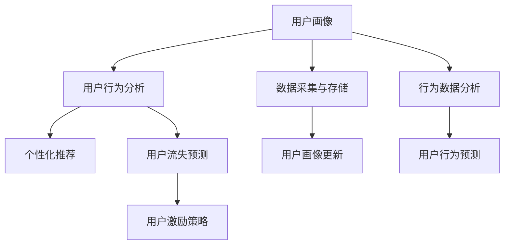

                 

# 知识付费创业中的用户生命周期管理

## 1. 背景介绍

### 1.1 问题由来

随着互联网和移动设备的普及，用户对知识的需求日益增长，知识付费作为一种新兴的互联网商业模式应运而生。知识付费平台，如喜马拉雅、得到、微信读书等，通过提供专业化的课程、文章、播客等知识内容，帮助用户节省时间、提升技能、满足求知欲。

然而，知识付费市场的竞争日益激烈，用户获取知识的渠道和方式越来越多样化，用户对知识内容的质量、时效性和个性化要求也更高。面对这种市场趋势，知识付费创业企业需要更加精细化地管理用户生命周期，以提升用户粘性和平台价值。

### 1.2 问题核心关键点

用户生命周期管理(User Lifecycle Management, ULM)是指对用户从潜在客户到最终流失的全生命周期进行全面管理，以提升用户价值、增加用户留存率。对于知识付费创业企业，有效管理用户生命周期可以帮助企业更好地了解用户需求、优化产品服务、提升用户体验，从而实现商业价值的最大化。

具体而言，核心关键点包括：

1. **用户画像**：准确描述目标用户群体的特征，如年龄、性别、职业、兴趣等，以便进行精准的市场细分和定位。
2. **用户获取**：通过多渠道营销活动吸引潜在用户注册和试用，建立用户与平台的初步联系。
3. **用户转化**：通过良好的产品体验、优质的内容推荐，将潜在用户转化为付费用户，提升用户转化率。
4. **用户留存**：通过持续的用户互动、定期内容更新、个性化推荐等手段，增加用户粘性，减少用户流失。
5. **用户流失**：对流失用户进行分析，挖掘原因，优化产品和服务，减少用户流失。
6. **用户价值**：评估用户的生命周期价值，制定相应的激励措施，最大化用户终身价值。

### 1.3 问题研究意义

用户生命周期管理是知识付费创业企业成功的关键。通过系统化地管理用户生命周期，企业能够：

1. **提升用户满意度**：根据用户需求提供个性化的知识内容和服务，提升用户体验，增强用户粘性。
2. **增加用户留存率**：通过精准的推荐和互动，减少用户流失，提高用户留存率。
3. **优化资源配置**：根据用户生命周期阶段进行资源优化配置，如内容制作、营销活动等，提高运营效率。
4. **创造长期价值**：通过用户生命周期管理的精细化运营，最大化用户终生价值，推动企业长期发展。
5. **市场竞争优势**：通过有效的用户管理，建立竞争优势，提高市场份额。

## 2. 核心概念与联系

### 2.1 核心概念概述

用户生命周期管理（ULM）是通过系统地分析和优化用户的行为模式，提升用户价值和平台收益的过程。在知识付费领域， ULMP涉及多个核心概念：

1. **用户画像**：根据用户行为数据构建用户特征模型，描述用户群体的属性和行为特征。
2. **用户行为分析**：通过数据挖掘和统计分析，理解用户的行为模式和需求。
3. **个性化推荐**：根据用户画像和行为数据，生成个性化的内容推荐，提升用户满意度。
4. **用户流失预测**：通过模型预测用户流失风险，及时采取干预措施。
5. **用户激励策略**：制定精准的用户激励措施，提升用户活跃度和转化率。

这些概念通过以下逻辑框架紧密联系起来：



用户画像和用户行为分析是基础，个性化推荐和用户激励策略是手段，用户流失预测则是预防和干预的依据。通过上述流程，知识付费创业企业能够系统化地管理用户生命周期，提升用户价值和平台收益。

## 3. 核心算法原理 & 具体操作步骤

### 3.1 算法原理概述

用户生命周期管理的核心算法包括用户画像构建、用户行为分析、个性化推荐、用户流失预测和用户激励策略等。这些算法共同构成了一个闭环的用户管理流程，旨在通过精准的数据分析和智能算法，提升用户生命周期价值。

以个性化推荐算法为例，其核心思想是通过用户历史行为数据，预测用户对新内容的需求，然后推荐最符合用户兴趣的内容。常见的个性化推荐算法包括协同过滤、基于内容的推荐、深度学习推荐等。

### 3.2 算法步骤详解

以下是用户生命周期管理的关键算法步骤：

**Step 1: 数据采集与存储**
- 通过网站、应用等渠道收集用户行为数据，如浏览历史、购买记录、搜索关键词等。
- 将数据存储在数据库中，便于后续分析和处理。

**Step 2: 用户画像构建**
- 使用机器学习算法对用户行为数据进行特征提取，生成用户画像。
- 用户画像包括用户基本信息、兴趣偏好、行为模式等。

**Step 3: 用户行为分析**
- 通过统计分析和数据挖掘，理解用户行为模式和需求。
- 如发现用户对某一类内容的偏好，可以优化内容推荐策略。

**Step 4: 个性化推荐**
- 根据用户画像和行为数据，生成个性化的内容推荐。
- 可以使用协同过滤、基于内容的推荐、深度学习推荐等算法。

**Step 5: 用户流失预测**
- 构建用户流失预测模型，评估用户流失风险。
- 通过早期预警和干预措施，减少用户流失。

**Step 6: 用户激励策略**
- 根据用户行为数据和流失预测结果，制定精准的用户激励措施。
- 如折扣优惠、积分奖励、专属内容等。

**Step 7: 用户画像更新**
- 定期更新用户画像，以反映用户行为的最新变化。
- 使用最新数据重新训练推荐模型，提高推荐精度。

### 3.3 算法优缺点

用户生命周期管理的优点在于：
1. 提升用户体验：通过个性化推荐，满足用户个性化需求，提升满意度。
2. 增加用户留存率：通过流失预测和激励策略，减少用户流失，提高用户留存率。
3. 优化资源配置：根据用户生命周期阶段进行资源优化配置，提高运营效率。
4. 最大化用户价值：通过精细化管理，最大化用户终生价值，推动企业长期发展。

但用户生命周期管理也存在以下局限性：
1. 数据依赖性高：需要大量的用户行为数据，数据质量对算法效果影响较大。
2. 算法复杂度高：个性化推荐和用户流失预测等算法复杂度高，计算成本大。
3. 用户隐私问题：用户行为数据的采集和使用可能引发用户隐私问题。
4. 策略难以动态调整：用户激励策略需要定期调整，以应对市场变化，但动态调整的难度较大。

### 3.4 算法应用领域

用户生命周期管理在知识付费创业中具有广泛的应用场景，包括：

1. **课程推荐**：根据用户历史浏览和购买记录，推荐相关的课程。
2. **社区互动**：根据用户行为数据，推荐相关的话题和讨论，增加用户粘性。
3. **广告投放**：根据用户画像和行为数据，精准投放广告，提升转化率。
4. **活动策划**：根据用户行为和流失预测，策划个性化活动，提升用户参与度。
5. **用户留存**：通过流失预警和激励策略，减少用户流失，提升用户留存率。
6. **内容生产**：根据用户需求和兴趣，指导内容制作，提升内容质量和吸引力。

## 4. 数学模型和公式 & 详细讲解 & 举例说明

### 4.1 数学模型构建

用户生命周期管理的数学模型主要包括以下几个部分：

1. **用户画像构建**：
   - 特征选择：选择影响用户行为的关键特征，如浏览时间、购买频率、评价评分等。
   - 特征工程：对原始数据进行预处理和特征转换，生成更具有区分度的特征。
   - 建模算法：使用聚类、分类等算法构建用户画像。

2. **用户行为分析**：
   - 时间序列分析：使用ARIMA、LSTM等模型分析用户行为时间序列。
   - 关联规则挖掘：使用Apriori、FP-growth等算法挖掘用户行为关联规则。

3. **个性化推荐**：
   - 协同过滤：构建用户-物品矩阵，推荐与用户兴趣最相似的物品。
   - 基于内容的推荐：根据物品特征，推荐与用户兴趣相似的物品。
   - 深度学习推荐：使用DNN、CNN等深度神经网络进行推荐。

4. **用户流失预测**：
   - 分类模型：使用逻辑回归、随机森林、神经网络等分类模型预测用户流失。
   - 时间序列预测：使用ARIMA、LSTM等模型预测用户流失概率。

5. **用户激励策略**：
   - 用户价值评估：使用RFM模型（Recency, Frequency, Monetary）评估用户价值。
   - 激励策略优化：使用优化算法（如GA、遗传算法）优化用户激励策略。

### 4.2 公式推导过程

以用户流失预测为例，假设用户流失率为 $\theta$，则预测模型可以表示为：

$$
P(\text{流失}) = \sigma(\eta(X))
$$

其中，$X$ 为影响用户流失的特征向量，$\eta$ 为线性变换，$\sigma$ 为 sigmoid 函数。

具体推导过程如下：

1. **特征工程**：将原始数据 $X$ 进行归一化、标准化等预处理，生成特征向量。
2. **线性变换**：将特征向量 $X$ 输入线性模型 $\eta(X)$，得到线性变换结果。
3. **Sigmoid变换**：将线性变换结果输入 sigmoid 函数，得到 $[0,1]$ 范围内的预测结果 $P(\text{流失})$。

### 4.3 案例分析与讲解

假设某知识付费平台的用户行为数据如下：

| 用户ID | 浏览时间(h) | 购买次数 | 评价评分 |
| --- | --- | --- | --- |
| 1 | 20 | 3 | 4 |
| 2 | 30 | 1 | 5 |
| 3 | 10 | 2 | 3 |
| ...

可以使用以下步骤进行用户画像构建和用户流失预测：

1. **特征选择**：选择浏览时间、购买次数、评价评分作为影响用户流失的关键特征。
2. **特征工程**：对用户ID进行独热编码，将评价评分进行归一化处理。
3. **建模算法**：使用随机森林算法构建用户流失预测模型。
4. **模型训练**：使用历史用户数据训练模型，生成用户流失预测概率。
5. **结果分析**：根据预测结果，对高流失风险用户进行干预措施，如个性化推荐、用户激励等。

## 5. 项目实践：代码实例和详细解释说明

### 5.1 开发环境搭建

在进行用户生命周期管理的项目实践中，需要搭建相应的开发环境：

1. **选择开发语言和框架**：可以选择Python语言，搭配Pandas、NumPy、Scikit-learn等数据科学库。
2. **安装依赖包**：安装TensorFlow、Keras、scikit-learn等常用库。
3. **数据准备**：准备好用户行为数据集，包括用户ID、浏览时间、购买次数、评价评分等。

### 5.2 源代码详细实现

以下是一个基于TensorFlow的用户流失预测模型的实现示例：

```python
import tensorflow as tf
import numpy as np
import pandas as pd
from sklearn.model_selection import train_test_split
from sklearn.preprocessing import OneHotEncoder, StandardScaler
from sklearn.ensemble import RandomForestClassifier

# 加载数据
data = pd.read_csv('user_data.csv')

# 特征选择
features = ['浏览时间', '购买次数', '评价评分']
X = data[features]
y = data['流失状态']

# 特征工程
encoder = OneHotEncoder()
X_encoded = encoder.fit_transform(X)
scaler = StandardScaler()
X_scaled = scaler.fit_transform(X_encoded.toarray())

# 数据划分
X_train, X_test, y_train, y_test = train_test_split(X_scaled, y, test_size=0.2, random_state=42)

# 模型构建
model = tf.keras.Sequential([
    tf.keras.layers.Dense(64, activation='relu', input_shape=(X_scaled.shape[1],)),
    tf.keras.layers.Dense(32, activation='relu'),
    tf.keras.layers.Dense(1, activation='sigmoid')
])

# 编译模型
model.compile(optimizer='adam', loss='binary_crossentropy', metrics=['accuracy'])

# 训练模型
model.fit(X_train, y_train, epochs=10, batch_size=32, validation_data=(X_test, y_test))

# 预测结果
y_pred = model.predict(X_test)

# 模型评估
print(classification_report(y_test, y_pred.round()))
```

### 5.3 代码解读与分析

上述代码实现了基于TensorFlow的用户流失预测模型。其中关键步骤包括：

1. **数据准备**：从CSV文件中加载用户行为数据，并选择要使用的特征。
2. **特征工程**：对特征进行独热编码和归一化处理，生成模型输入。
3. **模型构建**：构建包含两个全连接层的神经网络，并使用Sigmoid激活函数输出预测结果。
4. **模型训练**：使用训练集数据训练模型，验证集用于评估模型性能。
5. **模型预测**：使用测试集数据进行预测，输出预测结果。
6. **模型评估**：使用分类报告评估模型预测效果。

## 6. 实际应用场景

### 6.1 课程推荐

知识付费平台可以基于用户历史行为数据，使用协同过滤或基于内容的推荐算法，为每个用户生成个性化的课程推荐列表。例如，用户浏览了某个领域的课程，平台可以根据用户兴趣推荐其他相关课程，增加用户粘性。

### 6.2 社区互动

平台可以通过分析用户的行为数据，推荐用户感兴趣的话题和讨论，增加用户互动。例如，用户经常浏览某个话题的讨论，平台可以推荐其他相关话题，促进社区活跃度。

### 6.3 广告投放

平台可以根据用户画像和行为数据，精准投放广告。例如，用户浏览了某一课程广告，平台可以投放相关课程的广告，提升转化率。

### 6.4 活动策划

平台可以通过分析用户行为和流失预测，策划个性化的活动，增加用户参与度。例如，对高流失风险用户发送专属活动邀请，提升用户留存率。

## 7. 工具和资源推荐

### 7.1 学习资源推荐

1. **《用户行为分析》书籍**：系统介绍用户行为分析的方法和工具，如Google Analytics、Tableau等。
2. **《个性化推荐系统》书籍**：详细讲解协同过滤、基于内容的推荐、深度学习推荐等算法。
3. **《数据挖掘与统计分析》课程**：介绍数据挖掘和统计分析的基本方法，如时间序列分析、关联规则挖掘等。
4. **Kaggle平台**：提供丰富的用户行为数据集和竞赛，有助于实践用户生命周期管理。

### 7.2 开发工具推荐

1. **TensorFlow**：强大的深度学习框架，支持神经网络建模和优化。
2. **Keras**：简单易用的深度学习库，可以快速搭建深度神经网络模型。
3. **scikit-learn**：Python数据科学库，包含丰富的机器学习算法和工具。
4. **PySpark**：分布式计算框架，适合处理大规模数据集。

### 7.3 相关论文推荐

1. **《基于用户画像的个性化推荐系统研究》**：详细分析用户画像在推荐系统中的应用。
2. **《用户流失预测研究综述》**：综述用户流失预测的研究现状和未来方向。
3. **《用户行为数据分析与挖掘》**：介绍用户行为分析的方法和工具，如数据挖掘、统计分析等。
4. **《个性化推荐算法与实践》**：介绍协同过滤、基于内容的推荐、深度学习推荐等算法，并给出实际应用案例。

## 8. 总结：未来发展趋势与挑战

### 8.1 研究成果总结

用户生命周期管理在知识付费创业中具有重要的应用价值。通过系统化地管理用户生命周期，企业能够提升用户体验、增加用户留存率、优化资源配置、最大化用户价值。

### 8.2 未来发展趋势

未来，用户生命周期管理将呈现以下几个发展趋势：

1. **深度学习应用**：深度学习算法在用户行为分析、个性化推荐等方面的应用将更加广泛。
2. **多模态融合**：用户行为数据不仅仅包括文本数据，还包括图片、视频、语音等多模态数据，多模态数据的融合将提升推荐效果。
3. **实时分析**：实时分析用户行为数据，动态调整推荐策略和激励措施，提升用户满意度和留存率。
4. **跨平台协同**：跨平台协同分析用户行为数据，提升平台整体的用户价值。
5. **隐私保护**：加强用户隐私保护，通过匿名化、数据加密等手段，保护用户数据安全。

### 8.3 面临的挑战

用户生命周期管理在实践中仍面临诸多挑战：

1. **数据质量问题**：用户行为数据的质量和完整性对算法效果有重要影响。
2. **模型复杂性**：深度学习模型的复杂性导致模型训练和优化困难。
3. **隐私保护**：用户隐私保护问题需要得到更多关注，避免数据泄露和滥用。
4. **策略动态调整**：用户激励策略需要根据市场变化和用户行为进行动态调整，调整的难度较大。
5. **算法可解释性**：用户激励策略需要具备可解释性，让用户理解推荐结果和激励措施的来源。

### 8.4 研究展望

未来，用户生命周期管理的重点方向包括：

1. **实时分析和动态调整**：通过实时分析用户行为数据，动态调整推荐策略和激励措施，提升用户体验和留存率。
2. **多模态融合和跨平台协同**：通过多模态数据融合和跨平台协同分析，提升推荐效果和平台整体的用户价值。
3. **隐私保护和数据安全**：加强用户隐私保护和数据安全，确保用户数据不被滥用。
4. **算法可解释性**：提高算法的可解释性，使用户理解推荐结果和激励措施的来源。
5. **用户行为预测和预测模型优化**：通过用户行为预测模型，提升对用户流失和行为的预测精度，优化用户激励策略。

## 9. 附录：常见问题与解答

**Q1: 用户生命周期管理中的数据如何采集和处理？**

A: 用户生命周期管理中的数据可以通过网站、应用等渠道进行采集，如浏览历史、购买记录、评价评分等。数据处理过程中，需要确保数据的质量和完整性，对数据进行预处理和特征工程，生成更具有区分度的特征，以便后续建模和分析。

**Q2: 如何评估用户生命周期管理的有效性？**

A: 用户生命周期管理的有效性可以通过用户留存率、用户活跃度、用户价值等指标进行评估。具体而言，可以使用RFM模型（Recency, Frequency, Monetary）评估用户价值，使用用户流失预测模型评估流失风险，使用个性化推荐算法提升用户满意度。

**Q3: 在用户生命周期管理中如何处理用户隐私问题？**

A: 在用户生命周期管理中，处理用户隐私问题至关重要。可以采取以下措施：
1. 数据匿名化：对用户数据进行匿名化处理，去除个人识别信息。
2. 数据加密：对用户数据进行加密存储和传输，确保数据安全。
3. 用户同意：在数据采集和处理过程中，获取用户同意，尊重用户隐私权。

**Q4: 如何根据用户生命周期管理的数据进行个性化推荐？**

A: 根据用户生命周期管理的数据进行个性化推荐，可以使用协同过滤、基于内容的推荐、深度学习推荐等算法。具体步骤包括：
1. 特征选择：选择影响用户行为的关键特征，如浏览时间、购买次数、评价评分等。
2. 特征工程：对原始数据进行预处理和特征转换，生成更具有区分度的特征。
3. 建模算法：使用协同过滤、基于内容的推荐、深度学习推荐等算法构建推荐模型。
4. 模型训练：使用历史用户数据训练模型，生成推荐结果。
5. 结果评估：使用分类报告等指标评估推荐效果，并根据评估结果进行优化。

通过以上步骤，可以在知识付费创业中实现有效的用户生命周期管理，提升用户价值和平台收益。

