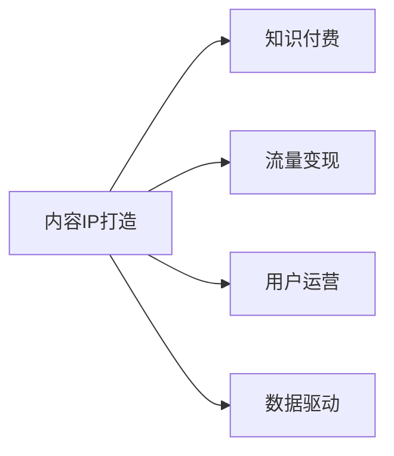

                 

# 知识付费创业的内容IP打造策略

> 关键词：内容IP打造, 知识付费, 流量变现, 用户运营, 数据驱动

## 1. 背景介绍

在互联网快速发展的今天，知识付费成为越来越多人的选择，内容IP的打造成为了知识付费创业的关键。好的内容IP不仅能够吸引和保留用户，还能提升流量变现的效率，实现商业模式的成功。本文将围绕内容IP打造策略展开讨论，探讨如何通过内容创新、数据分析、用户运营等手段，构建高效的知识付费生态系统。

## 2. 核心概念与联系

### 2.1 核心概念概述

在讨论内容IP打造策略之前，我们需要明确几个核心概念：

- **内容IP（Intellectual Property）**：以内容为核心，能够带来持续收益的知识产权。内容IP可以是书籍、课程、文章、视频等多种形式，其核心在于内容的原创性和独特性。

- **知识付费**：用户为获取知识而付费的行为，包括订阅、购买课程、咨询服务等。知识付费强调的是知识的价值和使用效率，而非单纯的商品交换。

- **流量变现**：通过用户获取、流量转化等方式，实现商业收益的策略。在内容IP打造中，流量变现是最终目的，也是衡量内容市场价值的直接指标。

- **用户运营**：针对用户需求，提供有价值的内容，并通过数据分析、个性化推荐等方式，增强用户粘性和忠诚度，实现用户的持续增长和留存。

- **数据驱动**：通过大数据分析和用户行为研究，优化内容生产和运营策略，实现内容IP的高效打造和流量变现。

这些概念之间的逻辑关系可以通过以下Mermaid流程图来展示：



该流程图展示了内容IP打造与知识付费、流量变现、用户运营和数据驱动之间的关系，即内容IP打造是知识付费、流量变现、用户运营和数据驱动的基础和起点，最终目标是实现高效的知识付费商业模式。

## 3. 核心算法原理 & 具体操作步骤

### 3.1 算法原理概述

内容IP打造策略的算法原理主要涉及以下几个方面：

- **内容推荐算法**：利用协同过滤、矩阵分解等算法，为用户推荐感兴趣的内容，提升用户粘性和留存率。
- **用户行为分析**：通过统计分析和机器学习技术，分析用户的行为模式和偏好，指导内容生产和运营策略。
- **个性化推荐算法**：利用深度学习等技术，实现个性化推荐，提升用户满意度和留存率。

这些算法的核心是数据分析和机器学习，通过持续的数据收集和模型训练，不断优化内容生产和推荐策略，最终实现内容IP的高效打造和流量变现。

### 3.2 算法步骤详解

内容IP打造策略的算法步骤主要包括以下几个关键环节：

**Step 1: 数据收集与处理**

- 收集用户数据，包括行为数据（如浏览、点击、购买记录）、偏好数据（如兴趣标签、推荐历史）、社交数据（如评论、评分）等。
- 对数据进行预处理，如去重、归一化、特征提取等，确保数据的质量和可用性。

**Step 2: 用户行为分析**

- 利用统计分析和机器学习算法，分析用户行为模式和偏好，如用户的兴趣标签、浏览路径、停留时间等。
- 通过聚类分析、关联规则挖掘等技术，发现用户行为中的潜在模式和关联，指导内容生产和推荐策略。

**Step 3: 内容推荐算法设计**

- 设计推荐算法，包括协同过滤、矩阵分解、深度学习等，实现内容的个性化推荐。
- 实现推荐系统的离线评估和在线优化，确保推荐结果的准确性和用户体验。

**Step 4: 内容生产和运营**

- 根据用户行为分析结果，定制个性化内容，如课程、文章、视频等。
- 实施内容生产和运营策略，如内容更新计划、用户互动策略等，提升内容质量和用户粘性。

**Step 5: 流量变现策略**

- 设计流量变现策略，如付费订阅、课程购买、广告投放等，实现商业收益。
- 实施流量变现方案，如会员制、优惠券、推荐奖励等，提升用户转化率和营收效率。

### 3.3 算法优缺点

内容IP打造策略的算法具有以下优点：

- **提升用户粘性**：通过个性化推荐和内容定制，提升用户满意度和留存率。
- **优化流量变现**：利用数据驱动和行为分析，实现高效的用户转化和营收。
- **增强运营效率**：通过自动化分析和智能推荐，提升内容生产和运营的效率。

同时，该算法也存在一些缺点：

- **数据依赖性强**：算法的效果依赖于数据的质量和量，数据不足或偏差会影响推荐结果。
- **模型复杂度高**：推荐算法和用户行为分析模型较为复杂，需要较强的技术实力和资源投入。
- **算法黑箱问题**：部分推荐算法和行为分析模型存在黑箱问题，难以解释和调试。

### 3.4 算法应用领域

内容IP打造策略的算法主要应用于以下几个领域：

- **知识付费平台**：如得到、知乎、腾讯课堂等，通过个性化推荐提升课程购买率和用户留存率。
- **内容社区平台**：如知乎、Bilibili、小红书等，通过内容推荐和互动，提升用户粘性和内容质量。
- **教育培训领域**：如教育类App、在线课程等，通过个性化学习推荐，提升学习效果和用户满意度。
- **文化传媒领域**：如电子书、音乐、电影等，通过内容推荐和版权管理，实现商业变现和文化传播。

这些领域的内容IP打造策略，都可以通过算法原理和操作步骤来实现，具体应用场景和细节需要根据不同的平台和业务特点进行优化。

## 4. 数学模型和公式 & 详细讲解 & 举例说明

### 4.1 数学模型构建

本节将使用数学语言对内容IP打造策略进行更加严格的刻画。

假设用户集为 $U=\{u_1,u_2,\dots,u_M\}$，内容集为 $I=\{i_1,i_2,\dots,i_N\}$。用户行为矩阵 $R \in \mathbb{R}^{M \times N}$，其中 $R_{ui} = r_{ui}$ 表示用户 $u$ 对内容 $i$ 的评分或行为数据。

内容相似度矩阵 $A \in \mathbb{R}^{N \times N}$，其中 $A_{ij} = a_{ij}$ 表示内容 $i$ 和内容 $j$ 之间的相似度。

用户兴趣向量 $\vec{v}_u \in \mathbb{R}^N$，其中 $v_{ui} = v_{ui}$ 表示用户 $u$ 对内容 $i$ 的兴趣程度。

推荐系统目标函数为：

$$
\min_{\vec{v}} \sum_{u=1}^M \sum_{i=1}^N w_{ui}(v_{ui} - R_{ui})^2
$$

其中 $w_{ui}$ 为权重，用于平衡不同用户和内容的权值。

### 4.2 公式推导过程

以协同过滤推荐算法为例，推导推荐结果的计算公式。

假设用户 $u$ 的评分向量为 $\vec{v}_u$，内容 $i$ 的评分向量为 $\vec{r}_i$，两者之间的相似度为 $A_{ij}$。协同过滤算法的推荐公式为：

$$
\hat{R}_{ui} = \sum_{j=1}^N A_{ij}v_{uj}
$$

即推荐内容 $i$ 的评分 $\hat{R}_{ui}$，通过内容 $i$ 和用户 $u$ 的相似度 $A_{ij}$ 与用户 $u$ 的兴趣程度 $v_{uj}$ 进行加权平均。

在实际应用中，可以采用矩阵分解、深度学习等算法，优化推荐结果的准确性和效率。

### 4.3 案例分析与讲解

以知乎推荐系统为例，分析推荐算法在内容IP打造中的应用。

知乎推荐系统的主要数据来源包括：
- 用户行为数据：用户的浏览、点赞、评论、分享等行为数据。
- 内容标签数据：内容的关键词、标签、分类等标签数据。
- 社交数据：用户间的关注、点赞、评论等社交数据。

知乎推荐系统的主要推荐算法包括：
- 协同过滤：利用用户与内容之间的相似度，实现个性化推荐。
- 矩阵分解：将用户行为数据转化为低维向量，通过矩阵分解优化推荐结果。
- 深度学习：利用深度神经网络，从用户行为和内容特征中学习用户兴趣，实现个性化推荐。

知乎推荐系统通过持续的数据收集和模型训练，不断优化推荐算法，提升内容质量和用户粘性。同时，知乎还引入了社交关系和内容互动，实现更全面、精准的推荐。

## 5. 项目实践：代码实例和详细解释说明

### 5.1 开发环境搭建

在进行内容IP打造策略的项目实践前，我们需要准备好开发环境。以下是使用Python进行PyTorch开发的环境配置流程：

1. 安装Anaconda：从官网下载并安装Anaconda，用于创建独立的Python环境。

2. 创建并激活虚拟环境：
```bash
conda create -n pytorch-env python=3.8 
conda activate pytorch-env
```

3. 安装PyTorch：根据CUDA版本，从官网获取对应的安装命令。例如：
```bash
conda install pytorch torchvision torchaudio cudatoolkit=11.1 -c pytorch -c conda-forge
```

4. 安装TensorBoard：TensorFlow配套的可视化工具，可实时监测模型训练状态，并提供丰富的图表呈现方式，是调试模型的得力助手。

5. 安装Weights & Biases：模型训练的实验跟踪工具，可以记录和可视化模型训练过程中的各项指标，方便对比和调优。

完成上述步骤后，即可在`pytorch-env`环境中开始内容IP打造策略的实践。

### 5.2 源代码详细实现

下面是使用PyTorch实现内容推荐算法的示例代码：

```python
import torch
import torch.nn as nn
import torch.optim as optim

class CollaborativeFiltering(nn.Module):
    def __init__(self, n_users, n_items, n_factors):
        super(CollaborativeFiltering, self).__init__()
        self.user_factors = nn.Embedding(n_users, n_factors)
        self.item_factors = nn.Embedding(n_items, n_factors)
        self.sigmoid = nn.Sigmoid()

    def forward(self, user_ids, item_ids):
        user_factors = self.user_factors(user_ids)
        item_factors = self.item_factors(item_ids)
        scores = torch.matmul(user_factors, item_factors.t()) * self.sigmoid(user_factors + item_factors)
        return scores

# 数据准备
n_users = 1000
n_items = 1000
n_factors = 10
user_ids = torch.randint(0, n_users, (n_users // 2,))
item_ids = torch.randint(0, n_items, (n_users // 2,))
scores = torch.rand(n_users // 2, n_items)

# 模型训练
model = CollaborativeFiltering(n_users, n_items, n_factors)
optimizer = optim.Adam(model.parameters(), lr=0.001)
criterion = nn.MSELoss()
for epoch in range(10):
    optimizer.zero_grad()
    predictions = model(user_ids, item_ids)
    loss = criterion(predictions, scores)
    loss.backward()
    optimizer.step()

# 预测推荐
item_index = torch.randint(0, n_items, (10,))
predictions = model(user_ids, item_index)
print(predictions)
```

### 5.3 代码解读与分析

让我们再详细解读一下关键代码的实现细节：

**CollaborativeFiltering类**：
- `__init__`方法：初始化用户和内容的嵌入矩阵，以及Sigmoid激活函数。
- `forward`方法：实现模型的前向传播，计算用户和内容的嵌入向量的点积，并加上Sigmoid激活函数进行归一化。

**数据准备**：
- 创建用户ID、内容ID和评分数据。

**模型训练**：
- 实例化模型、优化器和损失函数。
- 迭代训练模型，更新模型参数以最小化预测误差。

**预测推荐**：
- 随机生成用户ID和内容ID，进行预测推荐。

以上代码展示了如何通过PyTorch实现协同过滤推荐算法，用于内容IP打造策略的实现。需要注意的是，实际应用中，还需要考虑数据预处理、模型评估、用户行为分析等多个环节，确保内容推荐的高效性和准确性。

## 6. 实际应用场景

### 6.1 智能推荐系统

智能推荐系统是内容IP打造策略的重要应用场景。通过分析用户行为和兴趣，为用户推荐感兴趣的内容，提升用户满意度和留存率。

以知乎推荐系统为例，通过协同过滤、矩阵分解等算法，实现内容的个性化推荐，提升用户粘性和转化率。

### 6.2 内容社区平台

内容社区平台如知乎、Bilibili、小红书等，通过内容推荐和互动，提升用户粘性和内容质量。

知乎通过协同过滤、深度学习等算法，实现内容的个性化推荐，同时引入社交关系和内容互动，增强用户粘性和社区氛围。

### 6.3 教育培训领域

教育培训领域如教育类App、在线课程等，通过个性化学习推荐，提升学习效果和用户满意度。

Coursera等平台通过协同过滤和矩阵分解等算法，实现课程推荐，同时引入学习路径和社交互动，提升学习效果和用户留存率。

### 6.4 未来应用展望

随着数据技术和计算能力的不断提升，内容IP打造策略的未来应用前景广阔。

在智慧城市治理中，通过数据驱动的内容推荐，实现城市事件监测、舆情分析、应急指挥等环节的智能化，提升城市管理的自动化和智能化水平。

在金融舆情监测中，通过数据驱动的内容推荐，实现金融市场舆情监测，及时发现负面信息，规避金融风险。

在智慧医疗领域，通过数据驱动的内容推荐，实现医疗知识推荐、病历分析、患者匹配等应用，提升医疗服务的智能化水平。

## 7. 工具和资源推荐

### 7.1 学习资源推荐

为了帮助开发者系统掌握内容IP打造策略的理论基础和实践技巧，这里推荐一些优质的学习资源：

1. 《深度学习与推荐系统》系列博文：由深度学习领域专家撰写，全面介绍推荐系统的原理、算法和实践技巧。

2. 《Python推荐系统实战》书籍：详细介绍推荐系统在实际应用中的实现方法和优化策略，包括协同过滤、矩阵分解、深度学习等多种推荐算法。

3. 《机器学习实战》书籍：深入浅出地介绍机器学习的基本概念和经典算法，适合初学者和进阶者。

4. Kaggle推荐系统竞赛：Kaggle平台上的推荐系统竞赛项目，通过实际竞赛数据和任务，帮助开发者实践推荐系统算法。

5. Coursera《Recommender Systems》课程：斯坦福大学开设的推荐系统课程，有Lecture视频和配套作业，带你深入理解推荐系统的原理和应用。

通过对这些资源的学习实践，相信你一定能够快速掌握内容IP打造策略的精髓，并用于解决实际的推荐系统问题。

### 7.2 开发工具推荐

高效的开发离不开优秀的工具支持。以下是几款用于内容推荐系统开发的常用工具：

1. PyTorch：基于Python的开源深度学习框架，灵活动态的计算图，适合快速迭代研究。

2. TensorFlow：由Google主导开发的开源深度学习框架，生产部署方便，适合大规模工程应用。

3. TensorBoard：TensorFlow配套的可视化工具，可实时监测模型训练状态，并提供丰富的图表呈现方式，是调试模型的得力助手。

4. Weights & Biases：模型训练的实验跟踪工具，可以记录和可视化模型训练过程中的各项指标，方便对比和调优。

5. Scikit-learn：Python数据科学库，提供丰富的机器学习算法和工具，适合数据预处理和特征工程。

6. Pandas：Python数据分析库，提供高效的数据处理和分析功能，适合数据清洗和数据探索。

合理利用这些工具，可以显著提升内容推荐系统的开发效率，加快创新迭代的步伐。

### 7.3 相关论文推荐

内容IP打造策略的研发离不开学界的持续研究。以下是几篇奠基性的相关论文，推荐阅读：

1. "Collaborative Filtering for Implicit Feedback Datasets"：提出协同过滤算法的基本原理和实现方法，是推荐系统领域的经典论文。

2. "The Matrix Factorization Approach to Recommender System"：介绍矩阵分解算法的基本原理和实现方法，适合了解推荐系统背后的数学基础。

3. "Deep Collaborative Filtering with Dynamic Preference Evolution"：提出深度学习在推荐系统中的应用，适合了解深度学习在推荐系统中的优化效果。

4. "Personalized Recommendation using Deep Learning with Explicit Feedback"：提出深度学习在推荐系统中的应用，适合了解深度学习在推荐系统中的实现方法。

5. "Reinforcement Learning for Personalized Recommendation"：提出强化学习在推荐系统中的应用，适合了解强化学习在推荐系统中的优化效果。

这些论文代表了大数据和机器学习领域在推荐系统方面的发展脉络，通过学习这些前沿成果，可以帮助研究者把握学科前进方向，激发更多的创新灵感。

## 8. 总结：未来发展趋势与挑战

### 8.1 总结

本文对内容IP打造策略进行了全面系统的介绍。首先阐述了内容IP打造策略的研究背景和意义，明确了内容IP打造在知识付费、流量变现、用户运营和数据驱动中的重要价值。其次，从原理到实践，详细讲解了内容推荐算法的设计和实现过程，给出了内容推荐系统的完整代码实例。同时，本文还广泛探讨了内容推荐系统在智能推荐、内容社区、教育培训等领域的实际应用，展示了内容推荐系统的高效性和可行性。

通过本文的系统梳理，可以看到，内容推荐系统在知识付费和智能推荐领域具有广阔的应用前景，能够通过数据驱动和智能算法，提升用户粘性和转化率，实现商业模式的成功。未来，伴随数据技术和计算能力的不断提升，内容推荐系统的应用将更加广泛，为知识付费和智能推荐带来更多可能性。

### 8.2 未来发展趋势

展望未来，内容推荐系统的发展趋势主要体现在以下几个方面：

1. **多模态融合**：未来推荐系统将更多地融合图像、音频、视频等多种模态数据，提升推荐的准确性和丰富度。

2. **跨领域应用**：推荐系统将拓展到更多领域，如医疗、金融、教育等，通过跨领域推荐，提升用户体验和市场价值。

3. **实时性增强**：实时性是未来推荐系统的重要方向，通过流式数据处理和大规模计算，实现实时推荐，提升用户体验和运营效率。

4. **个性化强化**：个性化是推荐系统的核心，未来推荐系统将通过更精细的个性化推荐，提升用户满意度和留存率。

5. **数据隐私保护**：数据隐私保护是未来推荐系统的关键问题，通过差分隐私、联邦学习等技术，保护用户数据隐私，提升用户信任度。

6. **多模态互动**：未来推荐系统将通过多模态互动，提升用户粘性和留存率，实现更高效的内容生产和运营。

以上趋势凸显了内容推荐系统在智能推荐和知识付费领域的重要地位，将引领推荐系统走向更高的台阶，为知识付费和智能推荐带来更多可能性和机遇。

### 8.3 面临的挑战

尽管内容推荐系统已经取得了显著的进展，但在迈向更加智能化、普适化应用的过程中，仍面临诸多挑战：

1. **数据隐私问题**：用户数据隐私保护是推荐系统的重要挑战，如何在推荐过程中保护用户隐私，避免数据泄露和滥用，仍需进一步探索。

2. **冷启动问题**：对于新用户和新内容，推荐系统往往难以准确推荐，需要更多的探索和优化。

3. **资源消耗**：推荐系统需要大量的计算资源和时间，如何在资源有限的情况下，实现高效推荐，提升用户体验和运营效率，仍需进一步优化。

4. **模型公平性**：推荐系统往往存在偏见和歧视，如何通过算法和策略，消除模型偏见，确保推荐公平性，仍需进一步研究。

5. **算法复杂性**：推荐系统算法复杂度高，如何在保证推荐效果的同时，简化算法，提升算法可解释性和可维护性，仍需进一步探索。

6. **用户行为变化**：用户行为和偏好不断变化，如何实时调整推荐策略，提升推荐效果和用户满意度，仍需进一步优化。

这些挑战将推动内容推荐系统不断进步和优化，通过持续的算法创新和工程实践，逐步克服各种难题，实现更高水平的用户推荐和内容运营。

### 8.4 研究展望

面对内容推荐系统所面临的挑战，未来的研究需要在以下几个方面寻求新的突破：

1. **多模态推荐**：探索多模态数据的融合方法和技术，提升推荐的准确性和丰富度。

2. **个性化推荐**：研究个性化推荐算法和策略，通过用户行为分析，实现精准推荐。

3. **实时推荐**：研究实时推荐技术，提升推荐系统的实时性和用户体验。

4. **数据隐私保护**：探索差分隐私、联邦学习等技术，保护用户数据隐私。

5. **模型公平性**：研究推荐系统的公平性问题，确保推荐结果的公平性和透明性。

6. **算法优化**：探索算法优化方法和技术，提升算法的可解释性和可维护性。

7. **用户行为分析**：研究用户行为和偏好的变化规律，实现动态推荐。

这些研究方向的探索，将引领内容推荐系统向更高的台阶迈进，实现更高效、更公平、更智能的推荐服务。面向未来，内容推荐系统需要不断创新和优化，通过跨领域应用和多模态融合，提升用户粘性和留存率，实现知识付费和智能推荐的全面升级。

## 9. 附录：常见问题与解答

**Q1：内容推荐系统是否适用于所有业务场景？**

A: 内容推荐系统在大多数业务场景中都能取得不错的效果，特别是对于用户量较大的平台，如电商平台、社交媒体、视频平台等。但对于某些特定业务场景，如医疗机构、金融领域等，推荐系统的准确性和适用性可能存在一定限制。需要根据具体业务需求进行优化和调整。

**Q2：如何选择适合的内容推荐算法？**

A: 选择内容推荐算法需要综合考虑多个因素，如数据规模、用户行为模式、业务场景等。常见的推荐算法包括协同过滤、矩阵分解、深度学习等，每种算法都有其优缺点和适用场景。建议根据实际业务需求进行选择和优化。

**Q3：内容推荐系统如何避免过拟合？**

A: 过拟合是推荐系统面临的主要问题之一，常见的方法包括数据增强、正则化、降维等。数据增强可以通过扩充训练集，提升模型的泛化能力。正则化可以通过L2正则、Dropout等技术，避免模型过拟合。降维可以通过奇异值分解等技术，减少模型的复杂度，提升模型的泛化能力。

**Q4：内容推荐系统如何实现实时推荐？**

A: 实现实时推荐需要构建流式数据处理系统，利用实时数据进行推荐模型的训练和优化。常用的技术包括实时流处理、增量学习、在线学习等。通过实时推荐，可以提升用户体验和运营效率。

**Q5：内容推荐系统如何保护用户隐私？**

A: 内容推荐系统需要采用差分隐私、联邦学习等技术，保护用户数据隐私。差分隐私通过在数据中引入噪声，保护用户隐私。联邦学习通过在用户端进行模型训练，保护用户数据不被集中存储。

通过以上问题的解答，相信你对内容推荐系统有了更深入的了解，能够更好地应用于实际业务场景中，提升用户体验和运营效率。

---

作者：禅与计算机程序设计艺术 / Zen and the Art of Computer Programming

