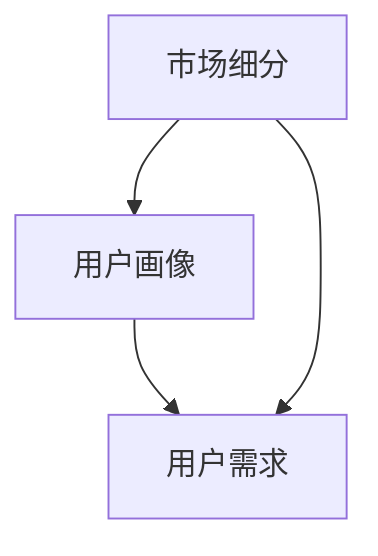

                 

# 知识付费创业的用户群体细分

## 1. 背景介绍

在知识付费的浪潮中，创业者们试图通过优质内容吸引用户，提升个人和组织的专业影响力，并实现商业变现。然而，面对复杂多变的用户需求，如何精准定位用户群体，成为决定创业成功与否的关键。本文将从市场细分、用户画像、用户需求三个方面，深入剖析知识付费创业的用户群体细分策略，帮助创业者更好地制定市场定位和营销策略。

## 2. 核心概念与联系

### 2.1 核心概念概述

- **市场细分(Market Segmentation)**：将一个整体市场划分为若干具有相似特征的子市场，每个子市场称为一个细分市场。市场细分是了解目标用户需求、设计产品功能和制定营销策略的基础。

- **用户画像(User Persona)**：基于目标用户的基本特征、行为习惯、兴趣偏好等构建的用户形象模型，用于指导产品设计和营销活动，提升用户体验和满意度。

- **用户需求(User Needs)**：用户在特定场景下产生的需求，可以分为显性需求和隐性需求。深入分析用户需求，有助于提供更精准的产品功能和服务。

这三个概念之间存在紧密联系：市场细分是用户画像和用户需求分析的基础；用户画像描绘了细分市场中具体用户群体的特征；而用户需求则是市场细分和用户画像落地的最终目标，驱动产品功能和营销策略的制定。

### 2.2 核心概念原理和架构的 Mermaid 流程图



## 3. 核心算法原理 & 具体操作步骤

### 3.1 算法原理概述

知识付费创业用户群体的细分，本质上是一个以用户数据为输入，通过聚类、分类等算法实现市场分群和用户画像构建的过程。主要涉及以下算法：

- **聚类算法(Clustering Algorithm)**：如K-means、层次聚类、DBSCAN等，用于将用户群体划分到不同子群体中，使得同一子群体的用户具有相似特征。
- **分类算法(Classification Algorithm)**：如逻辑回归、决策树、随机森林、支持向量机等，用于构建用户画像，预测用户行为和偏好。
- **关联规则算法(Association Rule Algorithm)**：如Apriori、FP-growth等，用于发现用户行为之间的关联规则，提升个性化推荐和营销效果。

### 3.2 算法步骤详解

#### 3.2.1 数据收集与预处理

1. **数据来源**：用户注册信息、行为数据（如购买记录、浏览历史、评论反馈等）、社交网络数据（如微博、微信公众号互动等）。
2. **数据清洗**：处理缺失值、异常值、重复数据等，确保数据的准确性和一致性。
3. **数据转换**：将原始数据转换为算法可以处理的格式，如文本数据进行分词、情感分析等处理。

#### 3.2.2 聚类分析

1. **特征选择**：选择与用户需求相关的特征，如年龄、性别、兴趣标签、阅读时长等。
2. **聚类算法**：使用K-means算法对用户进行聚类，得到若干个用户群体。
3. **聚类结果验证**：通过分析聚类中心和簇内样本的特征分布，评估聚类效果。

#### 3.2.3 用户画像构建

1. **特征提取**：对每个用户群体进行特征提取，如年龄、职业、收入水平等。
2. **模型训练**：选择分类算法，如随机森林，训练用户画像模型，预测用户行为和偏好。
3. **画像评估**：通过准确率、召回率、F1-score等指标评估用户画像模型的性能。

#### 3.2.4 关联规则分析

1. **关联规则挖掘**：使用Apriori算法挖掘用户行为之间的关联规则，如购买书籍、参加课程之间的关系。
2. **规则应用**：将挖掘出的关联规则用于个性化推荐和营销策略制定。

### 3.3 算法优缺点

#### 3.3.1 优点

1. **数据驱动**：基于用户数据的细分和画像构建，使得市场定位和产品设计更加科学。
2. **精准营销**：通过个性化推荐和细分市场定位，提高用户转化率和满意度。
3. **动态调整**：市场和用户需求是动态变化的，通过持续的数据分析和算法优化，能够及时调整营销策略。

#### 3.3.2 缺点

1. **数据隐私**：用户数据的收集和处理涉及隐私问题，需要遵守相关法律法规。
2. **算法复杂度**：数据量大、特征多时，算法计算复杂度增加，可能导致性能瓶颈。
3. **数据质量影响**：用户数据的准确性和完整性直接影响细分和画像结果的可靠性。

### 3.4 算法应用领域

知识付费创业用户群体的细分算法，广泛应用于以下领域：

- **个性化推荐系统**：根据用户画像和关联规则，向用户推荐相关课程、书籍等。
- **用户行为分析**：通过聚类和分类算法，分析用户行为模式，指导产品迭代和功能优化。
- **市场细分与营销**：识别不同用户群体的需求和偏好，制定精准的营销策略。
- **用户体验优化**：通过用户画像构建，提升个性化服务体验，增强用户粘性。

## 4. 数学模型和公式 & 详细讲解

### 4.1 数学模型构建

用户群体的细分模型可以表示为：

$$
M = (U, A, P, R)
$$

其中：
- $U$ 表示用户集合。
- $A$ 表示用户特征集合，如年龄、性别、职业、兴趣等。
- $P$ 表示聚类模型，用于将用户划分为若干个簇。
- $R$ 表示关联规则模型，用于发现用户行为之间的关联。

### 4.2 公式推导过程

#### 4.2.1 聚类模型

假设用户特征向量为 $x_i = [a_{i1}, a_{i2}, ..., a_{in}]$，其中 $a_{ik}$ 表示用户 $i$ 的第 $k$ 个特征。聚类算法可以表示为：

$$
\begin{aligned}
&\text{输入：} U=\{x_i\} \\
&\text{输出：} \{C_j\} \\
&\text{算法步骤：} \\
&\quad \text{1. 选择聚类算法} \\
&\quad \text{2. 确定聚类数} \\
&\quad \text{3. 计算聚类中心} \\
&\quad \text{4. 分配样本到簇} \\
&\quad \text{5. 调整聚类中心} \\
&\quad \text{6. 重复3-5步骤直至收敛}
\end{aligned}
$$

#### 4.2.2 分类模型

以随机森林为例，其算法流程如下：

$$
\begin{aligned}
&\text{输入：} U=\{x_i\}, P=\{C_j\} \\
&\text{输出：} \{\hat{y}_i\} \\
&\text{算法步骤：} \\
&\quad \text{1. 选择特征子集} \\
&\quad \text{2. 生成决策树} \\
&\quad \text{3. 集成多个决策树}
\end{aligned}
$$

其中 $\hat{y}_i$ 表示用户 $i$ 的分类结果。

#### 4.2.3 关联规则模型

以Apriori算法为例，其核心步骤如下：

$$
\begin{aligned}
&\text{输入：} U=\{x_i\}, R=\{\text{规则}\} \\
&\text{输出：} R^* \\
&\text{算法步骤：} \\
&\quad \text{1. 扫描交易数据库} \\
&\quad \text{2. 生成频繁项集} \\
&\quad \text{3. 生成关联规则}
\end{aligned}
$$

其中 $R^*$ 表示最终的关联规则集合。

### 4.3 案例分析与讲解

假设某知识付费平台收集了用户注册信息、购买记录和浏览历史，使用K-means算法对用户进行聚类，得到三个用户群体。进一步使用随机森林对每个用户群体进行分类，构建用户画像。最后使用Apriori算法挖掘用户行为关联规则，发现购买书籍和参加课程之间的关联。

通过以上步骤，平台可以针对不同用户群体制定精准的个性化推荐和营销策略，提升用户体验和转化率。

## 5. 项目实践：代码实例和详细解释说明

### 5.1 开发环境搭建

- **Python环境**：安装Python 3.x，建议使用Anaconda创建虚拟环境。
- **数据处理库**：安装pandas、numpy、scikit-learn等库。
- **机器学习库**：安装scikit-learn、TensorFlow、PyTorch等库。
- **可视化工具**：安装matplotlib、seaborn等库。

### 5.2 源代码详细实现

以下是使用Python实现用户群体细分的代码示例：

```python
import pandas as pd
from sklearn.cluster import KMeans
from sklearn.ensemble import RandomForestClassifier
from mlxtend.frequent_patterns import apriori, association_rules

# 读取用户数据
df = pd.read_csv('user_data.csv')

# 特征选择
features = df[['age', 'gender', 'interest']]

# 聚类分析
kmeans = KMeans(n_clusters=3, random_state=42)
clusters = kmeans.fit_predict(features)

# 用户画像构建
rf = RandomForestClassifier(n_estimators=100, random_state=42)
rf.fit(features, df['label'])

# 关联规则分析
fp = apriori(df, min_support=0.05, use_colnames=True)
rules = association_rules(fp, metric='lift', min_threshold=1.5)

# 输出聚类结果和用户画像
print(clusters)
print(rf.predict_proba(features))
```

### 5.3 代码解读与分析

#### 5.3.1 数据读取与预处理

使用pandas库读取用户数据，并进行特征选择和数据清洗。

#### 5.3.2 聚类分析

使用K-means算法对用户进行聚类，确定每个用户的群体。

#### 5.3.3 用户画像构建

使用随机森林算法对每个用户群体进行分类，得到用户画像。

#### 5.3.4 关联规则分析

使用Apriori算法挖掘用户行为关联规则，发现潜在的需求和偏好。

### 5.4 运行结果展示

运行上述代码，可以得到聚类结果、用户画像和关联规则输出。通过分析这些结果，平台可以制定更加精准的市场定位和营销策略。

## 6. 实际应用场景

### 6.1 在线教育平台

在线教育平台可以根据用户的学习行为、课程评价、购买记录等数据，进行用户群体细分。根据不同用户群体的学习需求，推荐适合的课程和资料，提升学习效果。同时，平台还可以针对不同群体设计个性化营销策略，提高用户转化率和粘性。

### 6.2 职业培训平台

职业培训平台可以通过用户的学习历史、技能掌握情况、职业规划等数据，进行用户群体细分。根据不同用户的需求，推荐适合的培训课程，提高培训效果。平台还可以根据用户画像进行精准营销，推广优质课程和资源。

### 6.3 智能投顾平台

智能投顾平台可以通过用户投资行为、风险偏好、财务状况等数据，进行用户群体细分。根据不同用户群体的投资需求，推荐适合的投资组合和理财方案。平台还可以根据用户画像进行精准营销，提高用户信任度和粘性。

### 6.4 未来应用展望

随着数据科学的不断进步，知识付费创业用户群体的细分将更加精准和智能。未来，人工智能和大数据技术将进一步融合，通过深度学习算法和自然语言处理技术，实现对用户情感和偏好的深度分析，提升用户体验和满意度。同时，区块链和分布式存储技术的应用，也将带来数据安全和隐私保护的创新解决方案，保障用户数据的安全性和隐私性。

## 7. 工具和资源推荐

### 7.1 学习资源推荐

- **机器学习课程**：Coursera、edX、Udacity等平台的机器学习课程，系统学习机器学习算法和模型。
- **数据分析工具**：DataCamp、Kaggle等平台的数据分析工具和竞赛，提升数据分析和建模能力。
- **知识付费平台**：得到、喜马拉雅、知乎等平台的付费内容，学习行业前沿知识和案例。

### 7.2 开发工具推荐

- **Python开发环境**：Anaconda、Jupyter Notebook等工具，支持Python代码开发和可视化。
- **数据处理库**：pandas、numpy、scikit-learn等库，支持数据读取、清洗、分析和可视化。
- **机器学习库**：TensorFlow、PyTorch等库，支持深度学习算法的实现。

### 7.3 相关论文推荐

- **聚类算法**：J. MacKay, "Bayesian Interpolation", Computation and Neural Systems, 4(3), 1992.
- **分类算法**：J. Breiman, "Random Forests", Machine Learning, 45(1), 2001.
- **关联规则算法**：R. Agrawal and R. Srikant, "Fast Algorithms for Mining Association Rules in Large Databases", Proceedings of the 13th International Conference on Data Engineering (ICDE '98).

## 8. 总结：未来发展趋势与挑战

### 8.1 研究成果总结

本文从市场细分、用户画像、用户需求三个方面，详细剖析了知识付费创业用户群体细分的策略和方法。通过聚类、分类、关联规则等算法，实现对用户群体的精准划分和画像构建。结合实际应用场景，展示了知识付费创业的广阔前景和潜在价值。

### 8.2 未来发展趋势

未来，知识付费创业用户群体细分将呈现出以下几个趋势：

1. **自动化和智能化**：随着机器学习和大数据技术的发展，用户群体细分将更加自动化和智能化，提升效率和准确性。
2. **多维度细分**：除了用户基本信息外，还会引入更多维度的数据，如行为数据、社交网络数据等，实现更全面和深入的用户细分。
3. **动态调整**：市场和用户需求是动态变化的，通过持续的数据分析和算法优化，能够及时调整细分策略，保持市场竞争力。

### 8.3 面临的挑战

尽管用户群体细分方法在知识付费创业中发挥了重要作用，但仍面临以下挑战：

1. **数据隐私**：用户数据的收集和处理涉及隐私问题，需要遵守相关法律法规。
2. **算法复杂度**：数据量大、特征多时，算法计算复杂度增加，可能导致性能瓶颈。
3. **数据质量影响**：用户数据的准确性和完整性直接影响细分和画像结果的可靠性。

### 8.4 研究展望

未来，用户群体细分研究将在以下几个方面取得突破：

1. **隐私保护技术**：引入区块链和分布式存储技术，保护用户数据隐私。
2. **算法优化**：开发更加高效和可解释的算法，提升细分的准确性和效率。
3. **跨领域应用**：将用户群体细分技术应用于更多领域，如电商、医疗、金融等，提升业务效果。

## 9. 附录：常见问题与解答

### 9.1 问题一：用户数据如何收集和处理？

**解答**：用户数据的收集可以通过问卷调查、行为追踪、社交网络分析等方式进行。数据处理包括清洗、转换、归一化等步骤，确保数据的质量和一致性。

### 9.2 问题二：如何选择聚类算法和分类算法？

**解答**：聚类算法可以根据数据特征选择，如K-means适用于欧式空间的数据，层次聚类适用于有层次关系的数据。分类算法可以根据数据类型和模型要求选择，如随机森林适用于处理高维数据和非线性关系的数据。

### 9.3 问题三：如何评估聚类和分类模型的性能？

**解答**：聚类模型的评估可以使用轮廓系数、Calinski-Harabasz指数等指标。分类模型的评估可以使用准确率、召回率、F1-score等指标。

### 9.4 问题四：如何利用关联规则进行推荐？

**解答**：通过挖掘用户行为之间的关联规则，可以发现潜在的需求和偏好，进行个性化推荐。例如，发现用户喜欢某类书籍的同时，也购买了某类课程，可以推荐相关课程。

### 9.5 问题五：用户群体细分在知识付费创业中有何价值？

**解答**：用户群体细分可以提升用户转化率和满意度，优化产品功能和营销策略，提高市场竞争力和用户粘性。同时，精准的用户画像也可以帮助平台更好地了解用户需求，进行内容创新和业务拓展。

---

作者：禅与计算机程序设计艺术 / Zen and the Art of Computer Programming

