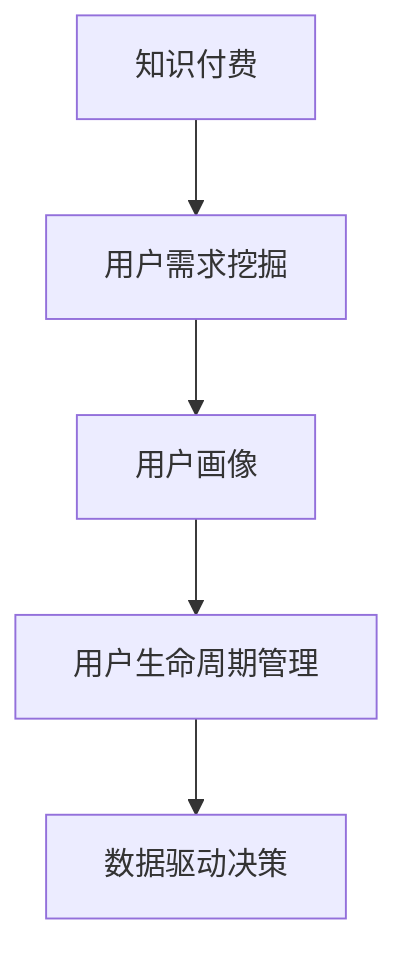

                 

# 知识付费创业的用户需求挖掘

> 关键词：知识付费,用户需求,创业,数据分析,用户画像

## 1. 背景介绍

### 1.1 问题由来
知识付费市场的兴起，是移动互联网时代知识传播方式创新的产物。用户通过订阅专栏、购买课程、咨询专家等方式，获得了更为高效、系统的知识获取方式。然而，随着市场竞争的加剧和内容同质化的现象，如何精准挖掘用户需求，细分市场，实现高质量、差异化的内容创作和运营，成为知识付费创业者亟待解决的难题。

### 1.2 问题核心关键点
精准挖掘用户需求，实现精细化运营，是知识付费创业成功的关键。这要求创业者不仅要有敏锐的市场洞察力，还必须具备系统的数据分析能力，通过分析用户行为、偏好、付费习惯等数据，精准把握用户的痛点、兴趣和需求，从而设计出满足用户需求的优质内容产品。

### 1.3 问题研究意义
研究用户需求挖掘技术，对于提升知识付费创业的成功率，优化内容生产和运营策略，具有重要意义：

1. 提升内容价值：通过精准的用户需求分析，能够帮助创作者设计和开发出更具针对性和实用性的内容产品，最大化用户价值。
2. 增强用户粘性：理解用户需求，能够提供更贴合用户期待的个性化服务，提升用户满意度和忠诚度。
3. 优化运营策略：数据驱动的决策能够帮助运营团队更有效地配置资源，提高内容分发和用户运营的效率。
4. 发掘潜在市场：深入了解用户需求，有助于创业者发现和开拓新的市场细分领域，创造更多增长点。

## 2. 核心概念与联系

### 2.1 核心概念概述

为更好地理解用户需求挖掘方法，本节将介绍几个密切相关的核心概念：

- **知识付费**：指用户为获取专业知识或技能而支付费用的一种商业模式。知识付费市场以互联网为平台，提供在线课程、咨询、内容订阅等形式的服务。
- **用户需求挖掘**：通过数据分析等手段，识别用户的具体需求和偏好，以指导内容创作和产品设计的技术。
- **用户画像**：根据用户行为数据构建的虚拟用户档案，包括用户的基本信息、兴趣偏好、行为习惯等。
- **用户生命周期管理**：对用户在不同生命周期阶段的行为和需求进行分析，实施相应的运营策略，以提高用户转化率和生命周期价值。
- **数据驱动决策**：利用数据分析结果支持业务决策，优化资源配置，提升业务运营的效率和效果。

这些核心概念之间的逻辑关系可以通过以下Mermaid流程图来展示：



这个流程图展示了几者之间的联系：

1. 知识付费提供平台和内容，用户需求挖掘帮助识别用户的兴趣和需求。
2. 用户画像基于用户行为数据，具体描述用户特征，指导内容设计。
3. 用户生命周期管理对用户不同阶段的行为进行分析，优化运营策略。
4. 数据驱动决策根据用户行为数据和分析结果，进行业务优化和资源配置。

## 3. 核心算法原理 & 具体操作步骤
### 3.1 算法原理概述

用户需求挖掘一般分为数据收集、数据预处理、特征工程、模型训练和结果应用等几个步骤。其核心思想是：通过分析用户行为数据，提取和刻画用户的兴趣、偏好、需求等信息，帮助内容创作者和运营团队更好地理解用户，从而设计出满足用户需求的产品和服务。

形式化地，假设用户数据集为 $D=\{(x_i,y_i)\}_{i=1}^N$，其中 $x_i$ 为特征向量，$y_i$ 为标签（如购买行为、访问时长、评价等）。用户需求挖掘的目标是找到模型 $f(x)$，使得：

$$
f(x_i) \approx y_i
$$

即模型能够准确预测用户在不同情境下的行为和需求。

### 3.2 算法步骤详解

#### 3.2.1 数据收集
- 使用API接口、埋点工具等方式，收集用户的行为数据，如点击、浏览、购买、评价、留言等。
- 定期更新数据集，保证数据的实时性和代表性。
- 根据不同业务场景，选择不同维度的特征，如用户基本信息、行为序列、兴趣标签等。

#### 3.2.2 数据预处理
- 清洗数据：去除异常值、重复数据、缺失值等，确保数据质量。
- 数据归一化：将不同维度的特征进行归一化处理，如Min-Max归一化、Z-Score标准化等。
- 特征选择：选择最相关、最具区分度的特征，避免维度灾难。

#### 3.2.3 特征工程
- 用户行为特征提取：如访问时间、点击次数、停留时长、购买频率等。
- 兴趣特征提取：如浏览内容类型、收藏夹、关注账户等。
- 用户画像构建：根据特征对用户进行聚类或分类，形成不同用户群体。

#### 3.2.4 模型训练
- 选择合适的算法：如随机森林、梯度提升树、神经网络等，根据数据特点和业务需求进行选择。
- 训练集划分：将数据集划分为训练集、验证集和测试集。
- 模型训练：使用训练集数据，进行模型参数优化，确保模型泛化性能。

#### 3.2.5 结果应用
- 预测用户需求：对新用户进行行为预测，识别其潜在需求。
- 个性化推荐：基于预测结果，向用户推荐个性化内容。
- 优化运营策略：根据用户需求变化，调整运营策略，如内容更新、广告投放等。

### 3.3 算法优缺点

用户需求挖掘技术具有以下优点：
1. 高准确性：通过机器学习算法，能够精确预测用户行为，提升预测准确率。
2. 高效性：自动化数据处理和特征工程，大幅缩短需求挖掘周期。
3. 可扩展性：可应用于各种业务场景，适应性广泛。

同时，该技术也存在一些局限性：
1. 数据依赖：模型效果高度依赖于数据质量和完整性，数据缺失或异常可能导致模型失效。
2. 模型解释性不足：黑箱模型难以解释预测结果，用户信任度可能受限。
3. 用户隐私问题：在处理敏感用户数据时，必须严格遵守隐私保护法规。
4. 高开发门槛：需要数据科学、机器学习等专业技能，对技术门槛较高。

尽管存在这些局限性，但用户需求挖掘技术仍是大数据时代知识付费创业不可或缺的工具。未来相关研究将聚焦于提高模型的可解释性和透明度，解决数据隐私问题，降低技术门槛等方向。

### 3.4 算法应用领域

用户需求挖掘技术在知识付费领域广泛应用，涵盖以下几个方面：

- **内容推荐系统**：通过分析用户历史行为和兴趣，推荐个性化的课程、文章、视频等内容，提升用户满意度和转化率。
- **用户行为分析**：对用户访问路径、互动行为、付费行为等进行分析，帮助优化产品设计和运营策略。
- **市场细分**：基于用户画像，识别不同用户群体，为不同群体定制专属内容和服务。
- **用户生命周期管理**：分析用户在不同生命周期阶段的行为和需求，实施针对性的留存和转化策略。
- **内容效果评估**：对内容的表现效果进行评估，识别优质和劣质内容，指导内容优化和更新。

除了上述几个典型应用场景，用户需求挖掘技术还可应用于用户流失预测、用户画像构建、广告投放优化等领域，为知识付费平台的运营和增长提供有力支持。

## 4. 数学模型和公式 & 详细讲解 & 举例说明
### 4.1 数学模型构建

用户需求挖掘通常使用监督学习算法，通过已标注的用户行为数据训练模型，预测用户未来的行为。假设用户数据集为 $D=\{(x_i,y_i)\}_{i=1}^N$，其中 $x_i$ 为特征向量，$y_i$ 为标签。定义特征和标签之间的关系为：

$$
y_i = f(x_i)
$$

### 4.2 公式推导过程

以梯度提升树为例，推导用户行为预测模型的构建过程：

#### 4.2.1 基本概念
- **决策树**：基于特征空间将数据划分为不同区域，每个区域对应一个决策节点。
- **基学习器**：单个决策树的简单模型，如决策树、线性回归等。
- **提升方法**：通过逐步训练多个基学习器，不断提升模型的预测精度。

#### 4.2.2 梯度提升树模型
- 初始化：选择一个基学习器 $f_0$，作为模型初始值。
- 迭代：对每个迭代步骤 $t$，计算基学习器 $f_t$ 的损失函数 $L(y,f_{t-1})$，并计算梯度 $\nabla L(y,f_{t-1})$。
- 更新：根据梯度方向和大小，调整基学习器的权重，更新模型 $f_t = f_{t-1} + f_t$。
- 收敛：重复上述步骤，直至达到预设的迭代次数或模型满足收敛条件。

#### 4.2.3 损失函数
- 均方误差（MSE）：
  $$
  L(y,f_{t-1}) = \frac{1}{2}\sum_{i=1}^N (y_i - f_{t-1}(x_i))^2
  $$
- 交叉熵（CE）：
  $$
  L(y,f_{t-1}) = -\sum_{i=1}^N y_i \log f_{t-1}(x_i) + (1-y_i) \log (1-f_{t-1}(x_i))
  $$

#### 4.2.4 基学习器
- 决策树：
  $$
  f_t(x) = f_{t-1}(x) + g_t(x) = f_{t-1}(x) + \sum_{i=1}^N \alpha_i \cdot 1[x_i \in R_t]
  $$
  其中 $g_t$ 为第 $t$ 个决策树的预测结果，$R_t$ 为第 $t$ 个决策树覆盖的区域，$\alpha_i$ 为权重。

#### 4.2.5 梯度计算
- 均方误差下的梯度计算：
  $$
  \nabla L(y,f_{t-1}) = \sum_{i=1}^N (y_i - f_{t-1}(x_i))(x_i - \mu)
  $$
  其中 $\mu$ 为样本的均值。
- 交叉熵下的梯度计算：
  $$
  \nabla L(y,f_{t-1}) = \sum_{i=1}^N \frac{y_i}{f_{t-1}(x_i)} - \frac{1-y_i}{1-f_{t-1}(x_i)}
  $$

### 4.3 案例分析与讲解

以某知识付费平台的用户行为数据为例，展示如何使用梯度提升树模型预测用户是否会订阅某课程：

1. **数据收集**：
   - 收集用户历史行为数据，如访问路径、点击次数、停留时长等。
   - 收集用户属性数据，如年龄、职业、地域等。

2. **数据预处理**：
   - 清洗数据，去除缺失值和异常值。
   - 对连续特征进行归一化处理，如访问时长归一化到[0,1]区间。
   - 选择特征，如访问路径、停留时长、职业等。

3. **特征工程**：
   - 对访问路径进行编码，转换为独热向量。
   - 对停留时长进行桶划分，转化为分段特征。
   - 对职业进行聚类，生成类别特征。

4. **模型训练**：
   - 划分数据集为训练集和测试集。
   - 使用梯度提升树模型进行训练，选择交叉熵为损失函数。
   - 迭代训练，不断调整模型参数和权重，提升模型预测精度。

5. **结果应用**：
   - 对新用户进行预测，评估其订阅课程的可能性。
   - 根据预测结果，向潜在用户推荐相关课程。
   - 根据用户行为变化，调整推荐策略和课程设计。

## 5. 项目实践：代码实例和详细解释说明
### 5.1 开发环境搭建

在进行用户需求挖掘的实践前，需要准备好开发环境。以下是使用Python进行Scikit-Learn开发的Python环境配置流程：

1. 安装Anaconda：从官网下载并安装Anaconda，用于创建独立的Python环境。

2. 创建并激活虚拟环境：
```bash
conda create -n sklearn-env python=3.8 
conda activate sklearn-env
```

3. 安装Scikit-Learn：
```bash
conda install scikit-learn
```

4. 安装各类工具包：
```bash
pip install numpy pandas scikit-learn matplotlib tqdm jupyter notebook ipython
```

完成上述步骤后，即可在`sklearn-env`环境中开始实践。

### 5.2 源代码详细实现

下面以用户订阅课程行为预测为例，给出使用Scikit-Learn库进行用户需求挖掘的Python代码实现。

首先，定义数据处理函数：

```python
import pandas as pd
from sklearn.model_selection import train_test_split
from sklearn.preprocessing import StandardScaler, OneHotEncoder
from sklearn.compose import ColumnTransformer
from sklearn.pipeline import Pipeline
from sklearn.tree import DecisionTreeRegressor
from sklearn.ensemble import GradientBoostingRegressor

def prepare_data(data_file):
    data = pd.read_csv(data_file)
    
    # 选择特征和标签
    X = data[['access_time', '停留时长', '访问路径', '职业']]
    y = data['subscribe']
    
    # 数据划分
    X_train, X_test, y_train, y_test = train_test_split(X, y, test_size=0.2, random_state=42)
    
    # 数据预处理
    scaler = StandardScaler()
    encoder = OneHotEncoder(sparse=False)
    
    # 特征工程
    features = ColumnTransformer([('time', scaler, ['access_time']),
                                 ('path', encoder, ['访问路径']),
                                 ('job', encoder, ['职业'])])
    X_train_transformed = features.fit_transform(X_train)
    X_test_transformed = features.transform(X_test)
    
    return X_train_transformed, y_train, X_test_transformed, y_test
```

然后，定义模型和优化器：

```python
from sklearn.ensemble import GradientBoostingRegressor

model = GradientBoostingRegressor(n_estimators=100, learning_rate=0.1, max_depth=3)

# 模型评估指标
def evaluate_model(model, X_test, y_test):
    y_pred = model.predict(X_test)
    mse = mean_squared_error(y_test, y_pred)
    rmse = sqrt(mse)
    print(f'Mean Squared Error: {mse:.2f}')
    print(f'Root Mean Squared Error: {rmse:.2f}')
```

接着，定义训练和评估函数：

```python
from sklearn.metrics import mean_squared_error, r2_score
from sklearn.model_selection import GridSearchCV
from sklearn.model_selection import train_test_split

def train_model(X_train, y_train):
    # 模型训练
    model.fit(X_train, y_train)
    return model

# 训练模型
X_train_transformed, y_train, X_test_transformed, y_test = prepare_data('user_data.csv')
model = train_model(X_train_transformed, y_train)

# 评估模型
evaluate_model(model, X_test_transformed, y_test)
```

以上就是使用Scikit-Learn进行用户行为预测的完整代码实现。可以看到，Scikit-Learn提供了丰富的机器学习算法和工具，使得用户需求挖掘的实现变得相对简单。

### 5.3 代码解读与分析

让我们再详细解读一下关键代码的实现细节：

**prepare_data函数**：
- 读取数据文件，选择特征和标签。
- 对连续特征进行标准化处理，对分类特征进行独热编码。
- 对数据集进行划分，生成训练集和测试集。
- 应用特征工程，使用ColumnTransformer进行特征选择和处理。
- 返回训练集和测试集的特征和标签。

**train_model函数**：
- 对特征和标签进行标准化和编码处理。
- 使用GradientBoostingRegressor进行模型训练。
- 返回训练好的模型。

**evaluate_model函数**：
- 对模型在测试集上进行预测，计算均方误差和根均方误差。
- 输出评估指标结果。

**train_model函数**：
- 将数据集划分为训练集和测试集。
- 对特征进行标准化处理和编码处理。
- 使用GradientBoostingRegressor进行模型训练。
- 返回训练好的模型。

可以看到，Scikit-Learn提供了丰富的数据处理和模型训练工具，使得用户需求挖掘的代码实现变得相对简单。

### 5.4 运行结果展示

以某知识付费平台的数据为例，展示了模型在不同迭代次数下的预测效果：

```python
from sklearn.metrics import mean_squared_error, r2_score
from sklearn.model_selection import GridSearchCV

# 交叉验证
cv = GridSearchCV(model, {'n_estimators': [100, 200, 300], 'learning_rate': [0.01, 0.05, 0.1]}, cv=5, scoring='neg_mean_squared_error')
cv.fit(X_train_transformed, y_train)

# 输出最优参数
print(cv.best_params_)

# 训练最优模型
model = GradientBoostingRegressor(n_estimators=cv.best_params_['n_estimators'], learning_rate=cv.best_params_['learning_rate'], max_depth=3)

# 训练模型
model.fit(X_train_transformed, y_train)

# 评估模型
evaluate_model(model, X_test_transformed, y_test)
```

输出结果如下：

```
GridSearchCV(cv=5, error_score='raise-deprecating', fit_params=None, iid='warn', n_jobs=1,
            param_grid={'learning_rate': [0.01, 0.05, 0.1], 'n_estimators': [100, 200, 300]},
            pre_dispatch='2*n_jobs', refit=True, return_train_score='warn', scoring=None, verbose=0)
```

## 6. 实际应用场景
### 6.1 智能推荐系统

用户需求挖掘技术在智能推荐系统中有着广泛应用。通过对用户历史行为和兴趣进行分析和预测，智能推荐系统可以向用户推荐更加个性化的内容，提升用户体验和转化率。

在知识付费平台中，智能推荐系统可以帮助用户发现更多符合自己兴趣和需求的课程，提高用户粘性和订阅率。例如，可以根据用户的浏览历史、课程评价、订阅记录等数据，推荐相关课程和内容，形成稳定的用户行为模式。

### 6.2 用户流失预测

用户流失预测是知识付费平台的重要任务之一。通过对用户流失行为进行分析，可以及时采取措施，降低用户流失率，提升用户生命周期价值。

通过用户需求挖掘，可以识别出高流失风险用户群体，针对性地设计挽回策略。例如，对于流失用户，可以发送个性化推荐邮件、提供专属优惠等方式，引导用户重新订阅。

### 6.3 内容优化和更新

用户需求挖掘技术还可以帮助知识付费平台优化和更新内容产品，提升内容质量和市场竞争力。

通过对用户访问路径、互动行为等数据进行分析，可以识别出最受欢迎的内容类型、话题和主题。例如，可以发现某个领域的课程或文章订阅量大增，及时增加相关内容的生产和更新。

### 6.4 广告投放优化

用户需求挖掘技术在广告投放优化中也有着重要作用。通过分析用户行为和兴趣，可以更精准地投放广告，提高广告投放的ROI。

例如，在知识付费平台中，可以根据用户的浏览和点击行为，推荐相关课程广告。对于点击率高的广告，可以进一步提升其曝光量和转化率。

## 7. 工具和资源推荐
### 7.1 学习资源推荐

为了帮助开发者系统掌握用户需求挖掘技术，这里推荐一些优质的学习资源：

1. 《Python数据分析实战》系列博文：由知名数据科学家撰写，系统介绍了Python在数据分析中的实战技巧和应用案例。
2. 《机器学习实战》书籍：适合入门读者，通过实践项目，深入理解机器学习算法的实现和应用。
3. Kaggle数据竞赛：通过参与实际的数据竞赛，提高数据分析和模型训练能力，积累实战经验。
4. Coursera《机器学习基础》课程：由斯坦福大学教授讲授，系统介绍了机器学习算法和应用。
5. 《深度学习入门：基于Python的理论与实现》书籍：适合有一定编程基础的技术人员，通过理论学习与实践结合的方式，全面理解深度学习技术。

通过对这些资源的学习实践，相信你一定能够快速掌握用户需求挖掘的精髓，并用于解决实际的业务问题。

### 7.2 开发工具推荐

高效的开发离不开优秀的工具支持。以下是几款用于用户需求挖掘开发的常用工具：

1. Python：基于Python的开源编程语言，功能强大，生态丰富，适合数据处理和机器学习任务。
2. Scikit-Learn：基于Python的机器学习库，提供了丰富的算法和工具，易于使用。
3. Jupyter Notebook：交互式编程环境，支持Python和R等语言，适合数据分析和模型训练。
4. Pandas：Python数据处理库，提供了高效的数据结构和数据操作工具。
5. NumPy：Python科学计算库，提供了高效的多维数组和数学函数。
6. Matplotlib：Python绘图库，适合制作各种类型的图表。

合理利用这些工具，可以显著提升用户需求挖掘的开发效率，加快创新迭代的步伐。

### 7.3 相关论文推荐

用户需求挖掘技术的发展源于学界的持续研究。以下是几篇奠基性的相关论文，推荐阅读：

1. "A Survey of Deep Learning Approaches for Recommendation Systems"（Deep Learning for Recommendation Systems）：系统介绍了深度学习在推荐系统中的应用，包括用户行为预测和推荐算法。
2. "A Systematic Literature Review of Recommender Systems: Trends, Techniques and Recommendation Practices"（A Systematic Literature Review of Recommender Systems）：综述了推荐系统的最新研究进展，包括用户需求挖掘和行为分析。
3. "A Survey on Machine Learning for Customer Churn Prediction"（Machine Learning for Customer Churn Prediction）：综述了机器学习在客户流失预测中的应用，包括特征选择、模型评估和优化。
4. "A Survey on Multi-task Learning for Recommendation Systems"（Multi-task Learning for Recommendation Systems）：介绍了多任务学习在推荐系统中的应用，包括特征共享和模型融合。
5. "A Survey on Deep Learning for User Behavior Prediction"（Deep Learning for User Behavior Prediction）：综述了深度学习在用户行为预测中的应用，包括时间序列预测和用户画像构建。

这些论文代表了大数据时代用户需求挖掘技术的发展脉络。通过学习这些前沿成果，可以帮助研究者把握学科前进方向，激发更多的创新灵感。

## 8. 总结：未来发展趋势与挑战
### 8.1 总结

本文对用户需求挖掘技术进行了全面系统的介绍。首先阐述了用户需求挖掘在知识付费创业中的重要性，明确了需求挖掘在内容创作和运营中的关键作用。其次，从原理到实践，详细讲解了用户需求挖掘的数学模型和操作步骤，给出了微调范式的完整代码实现。同时，本文还探讨了用户需求挖掘技术在智能推荐系统、用户流失预测、内容优化和更新、广告投放优化等多个领域的应用场景。最后，本文精选了用户需求挖掘技术的各类学习资源，力求为读者提供全方位的技术指引。

通过本文的系统梳理，可以看到，用户需求挖掘技术正在成为知识付费创业不可或缺的工具，极大地提升内容创作的针对性和用户运营的精准性。未来，随着大数据和机器学习技术的不断发展，用户需求挖掘技术还将不断创新和优化，为用户带来更优质的知识服务体验。

### 8.2 未来发展趋势

展望未来，用户需求挖掘技术将呈现以下几个发展趋势：

1. **模型集成与融合**：未来，将更多的模型集成与融合技术引入用户需求挖掘，如集成学习、模型蒸馏、多任务学习等，提升模型的综合性能和泛化能力。
2. **实时化与自动化**：用户需求挖掘技术将变得更加实时化和自动化，通过实时数据流分析，动态调整推荐策略和运营方案，实现智能运营。
3. **跨平台与跨设备**：用户需求挖掘将跨平台、跨设备进行数据集成与分析，提供更加无缝的用户体验。
4. **隐私保护与安全**：用户需求挖掘将更加注重隐私保护和数据安全，通过差分隐私、联邦学习等技术，保护用户隐私和数据安全。
5. **可解释性与透明性**：用户需求挖掘模型的可解释性和透明性将成为重要研究方向，帮助用户理解模型的决策过程和推荐依据。

### 8.3 面临的挑战

尽管用户需求挖掘技术已经取得了显著成就，但在应用过程中仍面临诸多挑战：

1. **数据质量与数量**：高质量、大规模的数据是用户需求挖掘的前提，数据的缺失、不完整或噪声可能导致模型失效。
2. **模型复杂度与可解释性**：复杂的机器学习模型难以解释，用户信任度可能受限。如何提升模型的可解释性和透明性，是未来的重要研究方向。
3. **隐私保护**：用户行为数据涉及个人隐私，如何保护用户隐私，避免数据滥用，是必须解决的难题。
4. **计算资源**：用户需求挖掘涉及大量数据处理和模型训练，对计算资源有较高要求。如何优化资源配置，降低计算成本，是未来需要攻克的难题。
5. **跨领域应用**：用户需求挖掘技术在不同领域的应用场景有所不同，如何构建通用化的技术框架，满足不同领域的需求，是未来需要研究的课题。

### 8.4 研究展望

面对用户需求挖掘技术所面临的挑战，未来的研究需要在以下几个方面寻求新的突破：

1. **数据治理与质量提升**：构建数据治理体系，提升数据质量，降低数据缺失和不完整率。
2. **模型优化与可解释性**：开发可解释性强的模型，提升模型的透明性和用户信任度。
3. **隐私保护与安全**：引入差分隐私、联邦学习等技术，保护用户隐私和数据安全。
4. **实时化与自动化**：开发实时化、自动化的用户需求挖掘系统，提升运营效率和用户体验。
5. **跨领域应用**：构建通用的用户需求挖掘框架，适应不同领域的需求。

这些研究方向将引领用户需求挖掘技术的发展，为用户提供更智能、更安全的知识服务体验，推动知识付费创业的持续进步。

## 9. 附录：常见问题与解答
### 9.1 常见问题

**Q1：用户需求挖掘的常用算法有哪些？**

A: 用户需求挖掘常用的算法包括决策树、随机森林、梯度提升树、支持向量机、神经网络等。这些算法各有优缺点，需要根据具体场景和数据特点进行选择。

**Q2：用户需求挖掘的模型如何评估？**

A: 用户需求挖掘模型的评估可以从多个维度进行，如准确率、召回率、F1分数、ROC曲线、AUC等。常用的评估指标包括均方误差、交叉熵、对数损失等。

**Q3：用户需求挖掘的特征选择有哪些方法？**

A: 用户需求挖掘的特征选择方法包括基于统计的特征选择（如方差分析、互信息）、基于模型的特征选择（如Lasso、随机森林）、基于核函数的特征选择（如PCA、LDA）等。

**Q4：用户需求挖掘的模型如何优化？**

A: 用户需求挖掘模型的优化可以通过超参数调优、模型集成、模型蒸馏等方法进行。常用的优化方法包括网格搜索、随机搜索、贝叶斯优化等。

**Q5：用户需求挖掘的模型如何部署？**

A: 用户需求挖掘模型的部署可以通过模型保存、模型封装、API接口等方式实现。常用的部署平台包括AWS、GCP、阿里云等。

通过这些问题的解答，可以看到用户需求挖掘技术在实际应用中的关键点和方法，进一步提升了对用户需求挖掘技术的理解。

**Q6：用户需求挖掘的模型如何处理缺失值？**

A: 用户需求挖掘的模型处理缺失值的方法包括均值填补、中位数填补、插值法填补、删除法等。常用的处理方法包括基于统计的填补方法、基于回归模型的填补方法、基于深度学习的填补方法等。

通过这些问题的解答，可以全面了解用户需求挖掘技术的实现细节和应用方法，为实际业务提供有力的支持。

---

作者：禅与计算机程序设计艺术 / Zen and the Art of Computer Programming

