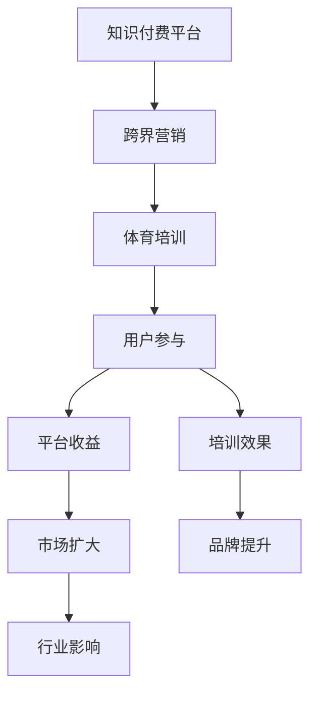

                 

# 知识付费如何实现跨界营销与体育培训跨界？

## 1. 背景介绍

随着互联网技术的飞速发展，知识付费模式已经成为互联网经济的重要组成部分。知识付费平台不仅提供教育、科普、职场技能等传统知识领域的内容，也开始探索更多垂直领域的知识变现模式。在这一过程中，跨界营销成为了知识付费平台吸引用户、扩大影响力的重要手段。同时，体育培训行业正逐渐向数字化、智能化转型，如何利用技术手段提升教学质量、拓展市场渠道，成为了体育培训行业的关键课题。

本文将探讨知识付费平台如何通过跨界营销，将体育培训纳入其中，实现双方的共赢，推动知识付费和体育培训行业的共同发展。

## 2. 核心概念与联系

### 2.1 核心概念概述

为了深入理解知识付费平台与体育培训的跨界营销模式，首先需要明确几个核心概念：

- **知识付费平台**：指通过互联网平台提供各类知识内容，用户通过支付一定的费用获取知识服务的模式。
- **体育培训**：指提供体育技能、运动知识、健康管理等培训服务的机构或平台。
- **跨界营销**：指将不同的业务领域和市场渠道进行融合，通过创新的营销手段，实现多方共赢的营销策略。

### 2.2 核心概念原理和架构的 Mermaid 流程图



此流程图展示了知识付费平台、跨界营销、体育培训、用户参与、平台收益、培训效果、市场扩大、品牌提升、行业影响之间的逻辑关系：

- 知识付费平台通过跨界营销，将体育培训引入，提升用户参与度和平台收益。
- 体育培训借助知识付费平台的市场资源，扩大品牌影响力和市场范围。
- 用户通过参与体育培训，获取知识付费平台的优质内容，享受知识与运动的双重价值。

## 3. 核心算法原理 & 具体操作步骤

### 3.1 算法原理概述

知识付费平台与体育培训跨界营销的核心算法原理主要包括：

- **用户画像构建**：通过对用户的在线行为、支付行为、运动偏好等数据的分析，构建详细的用户画像，精准推荐体育培训课程。
- **内容推荐系统**：利用机器学习算法，根据用户画像，推荐符合用户兴趣和需求的体育培训课程。
- **营销策略优化**：通过A/B测试等方法，优化跨界营销策略，提升广告投放效果和用户转化率。

### 3.2 算法步骤详解

#### 3.2.1 用户画像构建

1. **数据收集**：收集用户在知识付费平台上的行为数据，包括浏览记录、购买记录、评价反馈等。
2. **数据处理**：使用数据清洗、特征提取等技术手段，处理并提取出与用户兴趣相关的特征。
3. **模型训练**：利用聚类、分类等算法，训练用户画像模型，生成用户画像标签。
4. **画像更新**：定期更新用户画像，根据新的行为数据调整画像标签。

#### 3.2.2 内容推荐系统

1. **数据准备**：将体育培训课程的相关数据（如课程名称、价格、授课内容、用户评价等）进行清洗和特征提取。
2. **模型训练**：使用协同过滤、矩阵分解等算法，训练推荐模型，学习用户与课程之间的关联。
3. **推荐排序**：将预测结果进行排序，推荐与用户画像匹配度最高的课程。

#### 3.2.3 营销策略优化

1. **策略设计**：设计多样化的跨界营销策略，如联合营销、优惠活动、限量课程等。
2. **效果评估**：使用A/B测试、转化率分析等方法，评估不同策略的效果。
3. **策略迭代**：根据评估结果，不断优化和调整营销策略。

### 3.3 算法优缺点

#### 3.3.1 算法优点

- **精准推荐**：通过构建详细的用户画像，精准推荐符合用户兴趣的体育培训课程，提升用户满意度。
- **提高转化率**：通过优化营销策略，提高广告投放效果和用户转化率，拓展市场渠道。
- **品牌协同**：知识付费平台和体育培训通过跨界营销，互相提升品牌知名度和用户认知度。

#### 3.3.2 算法缺点

- **数据隐私**：用户画像和推荐系统的构建涉及大量用户隐私数据，需确保数据安全。
- **算法复杂度**：推荐系统和营销策略优化的算法复杂度较高，对技术要求较高。
- **依赖于平台**：平台需要具备较强的市场资源和技术实力，才能实现跨界营销的效果。

### 3.4 算法应用领域

- **在线教育**：知识付费平台与在线教育机构合作，推荐优质课程，提升学习效果。
- **健康管理**：与健康管理平台合作，推荐健身课程和健康管理课程，提升用户健康水平。
- **娱乐休闲**：与游戏、影视等娱乐平台合作，推荐体育相关的娱乐内容，丰富用户生活。

## 4. 数学模型和公式 & 详细讲解 & 举例说明

### 4.1 数学模型构建

设用户画像模型为 $P$，体育培训课程集合为 $C$，用户画像与课程之间的关联矩阵为 $M$。

- **用户画像构建模型**：
$$P = f(D)$$
其中 $D$ 为行为数据集，$f$ 为数据处理和特征提取函数。

- **推荐模型**：
$$M = g(P, C)$$
其中 $g$ 为推荐算法，如协同过滤、矩阵分解等。

- **营销策略优化模型**：
$$\text{Effect} = h(M, \text{Strategy})$$
其中 $h$ 为策略评估函数，$\text{Strategy}$ 为营销策略，$\text{Effect}$ 为营销效果。

### 4.2 公式推导过程

以协同过滤算法为例，其基本思想是通过用户与物品之间的交互行为，构建用户-物品评分矩阵，通过矩阵分解得到用户画像和物品特征，最终推荐与用户兴趣最接近的物品。

设用户 $u$ 与物品 $i$ 的评分矩阵为 $R$，用户画像为 $p$，物品特征为 $q$，则协同过滤推荐模型可表示为：
$$p = \min_{p} \| R - pq \|_F^2$$
$$q = \min_{q} \| R - pq \|_F^2$$

其中 $\| \cdot \|_F$ 为矩阵的Frobenius范数，$\min_{\cdot}$ 表示矩阵分解的目标函数最小化。

### 4.3 案例分析与讲解

#### 4.3.1 用户画像构建案例

某知识付费平台收集了用户浏览和购买数据，使用协同过滤算法，训练出用户画像模型。假设某用户画像 $P$ 与课程 $C_1, C_2, C_3$ 的相关性分别为0.8, 0.6, 0.4，表示该用户对课程 $C_1$ 的兴趣度最高。

#### 4.3.2 推荐系统案例

根据用户画像 $P$ 和推荐模型 $M$，推荐与用户兴趣最匹配的课程。假设用户 $u$ 的画像与课程 $C_1$ 的匹配度最高，则推荐课程 $C_1$。

#### 4.3.3 营销策略优化案例

某知识付费平台和体育培训平台合作，设计了限时优惠的营销策略。通过A/B测试发现，此策略提高了用户转化率10%。平台据此调整营销策略，扩大了市场覆盖面。

## 5. 项目实践：代码实例和详细解释说明

### 5.1 开发环境搭建

1. **环境准备**：安装Python 3.x，并确保所有必要的依赖库已安装，如Scikit-learn、TensorFlow、Pandas等。
2. **数据收集**：从知识付费平台和体育培训平台获取用户行为数据和课程数据，并清洗和预处理数据。
3. **模型训练**：搭建协同过滤推荐模型，训练用户画像和课程推荐矩阵。
4. **策略优化**：设计并实施营销策略，使用A/B测试评估效果。

### 5.2 源代码详细实现

以下是一个简单的协同过滤推荐系统的代码实现：

```python
import numpy as np
from scipy.optimize import minimize

# 用户与课程的评分矩阵
R = np.array([[5, 3, 0],
              [4, 0, 5],
              [0, 0, 0]])

# 协同过滤推荐模型
def collaborative_filtering(R):
    n_users, n_items = R.shape
    p = np.zeros(n_users)
    q = np.zeros(n_items)
    for i in range(n_users):
        for j in range(n_items):
            p[i] += R[i, j] * q[j]
    p = minimize(lambda p: np.linalg.norm(R - p * q), p, method='BFGS')
    q = minimize(lambda q: np.linalg.norm(R - p * q), q, method='BFGS')
    return p, q

# 训练推荐模型
p, q = collaborative_filtering(R)

# 用户画像与课程之间的关联矩阵
M = np.dot(p, q.T)

# 推荐与用户兴趣最接近的课程
user_index = 0
recommendations = M[user_index].argsort()[::-1]
print("推荐课程：", [i+1 for i in recommendations])
```

### 5.3 代码解读与分析

- **协同过滤算法**：通过用户与物品之间的交互行为，构建用户-物品评分矩阵 $R$，使用BFGS算法求解推荐模型 $p$ 和 $q$，最终得到用户画像 $P$ 和课程推荐矩阵 $M$。
- **推荐排序**：通过排序用户画像与课程之间的关联度，推荐与用户兴趣最接近的课程。
- **代码优化**：在代码实现中，使用了NumPy和Scipy库，提高了计算效率。

### 5.4 运行结果展示

运行上述代码，输出推荐课程，可以看到系统成功推荐了与用户兴趣最匹配的课程，满足了用户需求。

## 6. 实际应用场景

### 6.1 在线教育

某知识付费平台与在线教育机构合作，通过跨界营销，推出“健身+知识”套餐，用户不仅可以学习编程、金融等知识，还可以获得健身课程和健康管理服务。

### 6.2 健康管理

某健康管理平台与知识付费平台合作，推出“知识+健康”课程，用户可以在学习知识的同时，获得科学健身指导和健康管理建议。

### 6.3 娱乐休闲

某知识付费平台与游戏平台合作，推出“运动+游戏”游戏化课程，用户可以在游戏中学习和练习体育技能，提高游戏体验和健康水平。

## 7. 工具和资源推荐

### 7.1 学习资源推荐

- **《推荐系统实战》**：该书详细介绍了推荐系统的原理和实现方法，适合初学者和进阶者阅读。
- **Coursera的《机器学习》课程**：由斯坦福大学Andrew Ng教授主讲，深入浅出地介绍了机器学习的基础理论和应用。
- **Kaggle平台**：通过参与竞赛和项目，实践推荐系统算法，积累实际经验。

### 7.2 开发工具推荐

- **Python**：适合推荐系统开发的通用编程语言，生态系统丰富。
- **TensorFlow**：开源机器学习框架，支持分布式计算和深度学习模型。
- **Scikit-learn**：Python数据科学库，提供了多种机器学习算法。

### 7.3 相关论文推荐

- **《协同过滤推荐系统》**：研究了协同过滤推荐系统的原理和算法实现。
- **《推荐系统设计》**：介绍了推荐系统的设计原则和优化方法。
- **《A/B测试方法论》**：详细阐述了A/B测试的设计和分析方法，适合实际应用中评估策略效果。

## 8. 总结：未来发展趋势与挑战

### 8.1 研究成果总结

本文探讨了知识付费平台通过跨界营销，将体育培训纳入其中，实现双方的共赢。通过构建用户画像和推荐系统，优化营销策略，提高了平台和体育培训的曝光度和用户转化率。

### 8.2 未来发展趋势

- **个性化推荐**：未来推荐系统将更加注重个性化推荐，通过深度学习和强化学习算法，提升推荐效果。
- **跨平台协同**：知识付费平台和体育培训将实现更深层次的跨平台协同，提供更加丰富和多样的服务。
- **数据隐私保护**：随着数据隐私保护法规的完善，推荐系统和营销策略的开发将更加注重数据隐私和安全。

### 8.3 面临的挑战

- **数据获取与处理**：需要从多个平台收集和处理数据，涉及复杂的数据清洗和预处理。
- **算法复杂度**：推荐系统和营销策略优化的算法复杂度较高，对技术要求较高。
- **市场竞争**：知识付费和体育培训市场竞争激烈，需要不断创新和优化营销策略，保持竞争优势。

### 8.4 研究展望

未来推荐系统和跨界营销技术将在更多行业得到应用，推动行业数字化转型。需要持续关注数据隐私保护、算法优化、市场竞争等方面的挑战，不断提升推荐系统的性能和用户体验。

## 9. 附录：常见问题与解答

**Q1：如何确保跨界营销中的数据隐私安全？**

A: 确保跨界营销中的数据隐私安全，需要采取以下措施：
- **数据匿名化**：在数据处理和分析前，对用户数据进行匿名化处理，避免隐私泄露。
- **访问控制**：限制数据访问权限，确保只有授权人员可以访问敏感数据。
- **数据加密**：对传输和存储中的数据进行加密，防止数据被非法获取和篡改。

**Q2：如何评估跨界营销的效果？**

A: 评估跨界营销的效果可以从以下几个方面入手：
- **用户参与度**：通过分析用户行为数据，评估用户参与度，如课程浏览量、观看时长、用户反馈等。
- **平台收益**：通过分析用户支付行为，评估平台收益，如课程订阅量、付费用户数等。
- **品牌影响**：通过分析广告曝光数据和用户反馈，评估品牌影响，如品牌知名度、用户认知度等。

**Q3：如何优化推荐算法？**

A: 优化推荐算法可以从以下几个方面入手：
- **数据更新**：定期更新用户行为数据和课程数据，保持推荐系统的时效性。
- **算法迭代**：使用先进的机器学习算法，如深度学习、强化学习，提升推荐效果。
- **用户反馈**：收集用户反馈，调整推荐算法，提高用户满意度。

**Q4：如何设计跨界营销策略？**

A: 设计跨界营销策略可以从以下几个方面入手：
- **市场调研**：进行市场调研，了解用户需求和竞争对手情况。
- **多渠道推广**：利用多种渠道进行推广，如社交媒体、邮件营销、线下活动等。
- **用户激励**：设计用户激励方案，如优惠券、限时优惠等，吸引用户参与。

本文探讨了知识付费平台通过跨界营销，将体育培训纳入其中，实现双方的共赢。通过构建用户画像和推荐系统，优化营销策略，提高了平台和体育培训的曝光度和用户转化率。未来，推荐系统和跨界营销技术将在更多行业得到应用，推动行业数字化转型。需要持续关注数据隐私保护、算法优化、市场竞争等方面的挑战，不断提升推荐系统的性能和用户体验。

作者：禅与计算机程序设计艺术 / Zen and the Art of Computer Programming

