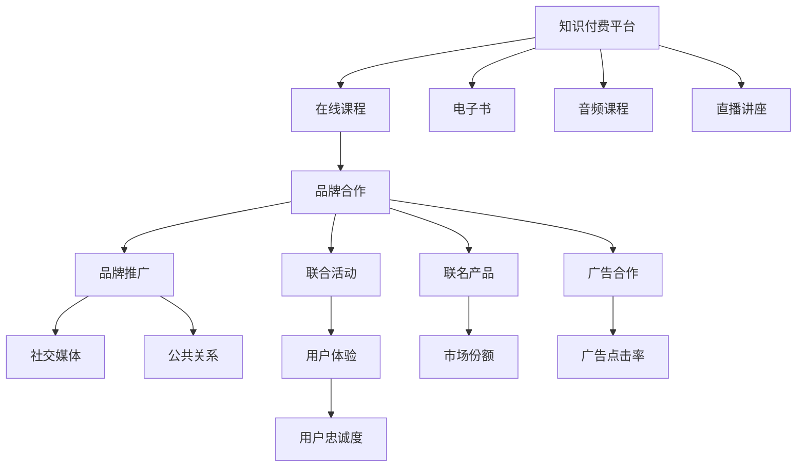

                 

# 知识付费如何实现跨界营销与品牌联名？

## 1. 背景介绍

随着数字化、信息化的深入发展，知识付费成为了一种新的消费形式，无论是线上平台还是线下实体，知识付费业务都在不断发展壮大。知识付费能够通过优质的内容，帮助用户获取知识和技能，提升个人价值。然而，面对激烈的市场竞争，知识付费产品如何实现跨界营销，构建品牌联名效应，提升市场竞争力？

## 2. 核心概念与联系

### 2.1 核心概念概述

在探讨知识付费的跨界营销与品牌联名时，我们需要先明确几个核心概念：

1. **知识付费**：指用户通过付费获取知识或技能，帮助自身成长与提升。知识付费的内容形式多样，包括在线课程、电子书、音频课程等。

2. **跨界营销**：指在品牌之间建立多种形式的合作关系，通过资源互补和优势互补实现双赢或多赢。例如，品牌合作举办活动、联合广告、联名产品等。

3. **品牌联名**：指两个或多个品牌通过合作，共享品牌资源，共同提升品牌知名度和美誉度。常见的形式包括联名产品、联合营销活动、品牌合作广告等。

### 2.2 核心概念原理和架构的 Mermaid 流程图



这个Mermaid流程图展示了知识付费平台通过跨界营销和品牌联名实现增值的过程。核心概念之间的逻辑关系如下：

- 知识付费平台提供多种内容形式（在线课程、电子书、音频课程等），与品牌合作，通过联合活动、广告合作、联名产品等方式实现增值。
- 联合活动和联名产品提升用户体验，增加用户粘性，从而提升用户忠诚度和市场份额。
- 品牌推广通过社交媒体和公共关系提升品牌知名度，广告合作增加广告点击率，共同提升品牌美誉度。

## 3. 核心算法原理 & 具体操作步骤

### 3.1 算法原理概述

知识付费平台实现跨界营销与品牌联名的算法原理主要基于以下步骤：

1. **数据分析与用户画像构建**：通过分析用户的购买行为、阅读偏好等数据，构建用户画像，从而精准定位潜在合作伙伴。

2. **合作对象筛选**：根据用户画像，筛选与知识付费平台业务相关的合作伙伴，包括品牌、其他平台等。

3. **品牌合作策略制定**：制定联合活动、联名产品、广告合作等合作策略，确保合作双方都能获得利益。

4. **效果评估与优化**：评估合作效果，如用户忠诚度、市场份额等，不断优化合作策略，提升合作价值。

### 3.2 算法步骤详解

#### 3.2.1 数据分析与用户画像构建

1. **数据收集与处理**：收集用户的购买行为数据、阅读偏好数据、社交媒体互动数据等，并进行数据清洗和处理。

2. **用户画像构建**：通过机器学习算法（如聚类、分类、关联规则挖掘等）构建用户画像，包括用户的基本信息、兴趣偏好、行为特征等。

#### 3.2.2 合作对象筛选

1. **筛选潜在合作伙伴**：根据用户画像，筛选与知识付费平台业务相关的品牌、其他平台等，如教育类品牌、技术类公司等。

2. **初步评估合作伙伴**：通过评估潜在合作伙伴的品牌影响力、市场表现、合作意愿等，初步筛选出潜在的合作对象。

#### 3.2.3 品牌合作策略制定

1. **制定合作策略**：制定联合活动、联名产品、广告合作等具体的合作策略，确保合作双方都能获得利益。

2. **确定合作细节**：包括联合活动的具体形式、联名产品的设计方案、广告合作的预算分配等。

#### 3.2.4 效果评估与优化

1. **评估合作效果**：通过用户忠诚度、市场份额、广告点击率等指标评估合作效果。

2. **优化合作策略**：根据评估结果，不断优化合作策略，提升合作价值。

### 3.3 算法优缺点

#### 3.3.1 算法优点

1. **提高品牌知名度**：通过跨界营销和品牌联名，可以提升品牌的知名度和美誉度。

2. **增强用户粘性**：联合活动和联名产品能够增加用户粘性，提升用户忠诚度。

3. **拓展市场份额**：通过品牌合作，可以拓展市场份额，增加市场竞争力。

#### 3.3.2 算法缺点

1. **需要大量数据**：构建用户画像和评估合作效果需要大量数据，可能面临数据隐私和数据安全等问题。

2. **策略制定复杂**：制定合作策略需要考虑多方面因素，如品牌形象、市场表现等，复杂度较高。

3. **效果难以量化**：品牌合作效果难以精确量化，需要长期观察和评估。

### 3.4 算法应用领域

知识付费平台实现跨界营销与品牌联名，主要应用于以下领域：

1. **在线教育**：与其他教育类品牌合作，联合推出课程、教材等，提升用户体验，增加市场份额。

2. **技术培训**：与技术类公司合作，推出联合技术培训课程，增加平台的用户粘性和市场影响力。

3. **生活服务**：与生活服务类品牌合作，如健身、旅游等，推出联名活动，提升品牌知名度。

4. **文化艺术**：与文化艺术类品牌合作，推出联名产品或活动，提升品牌文化内涵。

## 4. 数学模型和公式 & 详细讲解 & 举例说明

### 4.1 数学模型构建

#### 4.1.1 用户画像构建模型

用户画像构建模型主要包括用户的基本信息、兴趣偏好、行为特征等，可以采用聚类算法（如K-means、层次聚类等）对用户进行分类。例如：

$$
P = \{p_i\}_{i=1}^N
$$

其中 $P$ 表示用户画像集合，$p_i$ 表示第 $i$ 个用户的画像，包括基本信息、兴趣偏好、行为特征等。

#### 4.1.2 合作伙伴筛选模型

合作伙伴筛选模型主要考虑合作伙伴的品牌影响力、市场表现、合作意愿等，可以采用综合评估方法，如层次分析法（AHP）、熵值法等。例如：

$$
S = \{s_i\}_{i=1}^M
$$

其中 $S$ 表示合作伙伴集合，$s_i$ 表示第 $i$ 个合作伙伴的综合评分。

### 4.2 公式推导过程

#### 4.2.1 用户画像构建公式

假设用户 $u$ 的个人信息为 $X_u$，兴趣偏好为 $I_u$，行为特征为 $B_u$，则用户画像 $p_u$ 可以表示为：

$$
p_u = (X_u, I_u, B_u)
$$

通过聚类算法，可以将用户分为多个类别 $C$，每个类别 $c$ 包括一组用户 $u_i$。例如：

$$
C = \{c_k\}_{k=1}^K
$$

其中 $C$ 表示用户分类集合，$c_k$ 表示第 $k$ 个分类，包括一组用户 $u_i$。

#### 4.2.2 合作伙伴筛选公式

假设合作伙伴 $m$ 的品牌影响力为 $R_m$，市场表现为 $M_m$，合作意愿为 $W_m$，则合作伙伴综合评分 $s_m$ 可以表示为：

$$
s_m = \lambda_1 R_m + \lambda_2 M_m + \lambda_3 W_m
$$

其中 $\lambda_1, \lambda_2, \lambda_3$ 为权重系数，可以根据实际情况进行调整。

### 4.3 案例分析与讲解

#### 4.3.1 数据分析与用户画像构建案例

假设某知识付费平台有 $N=10000$ 名用户，收集到用户的个人信息 $X_u$、兴趣偏好 $I_u$ 和行为特征 $B_u$，采用 K-means 算法将其分为 $K=5$ 个类别，每个类别 $c_k$ 包括一组用户 $u_i$。

#### 4.3.2 合作伙伴筛选案例

假设某知识付费平台需要选择合作伙伴，筛选了 $M=20$ 个品牌，其品牌影响力、市场表现和合作意愿如下表所示：

| 品牌 | 品牌影响力 | 市场表现 | 合作意愿 |
|------|------------|----------|----------|
| A    | 80         | 85       | 90       |
| B    | 75         | 70       | 80       |
| ...  | ...        | ...      | ...      |

采用层次分析法（AHP）综合评估各品牌，得出合作伙伴综合评分 $s_m$。

## 5. 项目实践：代码实例和详细解释说明

### 5.1 开发环境搭建

1. **环境准备**：安装 Python 3.x，安装 Pandas、NumPy、Scikit-learn 等数据处理和机器学习库。

2. **数据准备**：收集用户数据、合作伙伴数据，并将其整理成符合要求的格式。

3. **工具准备**：使用 Jupyter Notebook 或 PyCharm 等工具进行开发。

### 5.2 源代码详细实现

#### 5.2.1 用户画像构建代码实现

```python
import pandas as pd
from sklearn.cluster import KMeans

# 读取用户数据
data = pd.read_csv('user_data.csv')

# 数据预处理
data = data.dropna()  # 删除缺失值
data = data.drop_duplicates()  # 删除重复值

# 定义用户画像特征
features = ['gender', 'age', 'education', 'interest', 'behavior']

# 构建 K-means 聚类模型
kmeans = KMeans(n_clusters=5, random_state=0)
kmeans.fit(data[features])

# 输出聚类结果
clusters = kmeans.labels_
print(clusters)
```

#### 5.2.2 合作伙伴筛选代码实现

```python
import numpy as np
from scipy.spatial.distance import pdist, squareform

# 读取合作伙伴数据
data = pd.read_csv('partner_data.csv')

# 数据预处理
data = data.dropna()  # 删除缺失值
data = data.drop_duplicates()  # 删除重复值

# 定义合作伙伴评分特征
features = ['reputation', 'market', 'willingness']

# 计算各合作伙伴的欧式距离
distances = squareform(pdist(data[features], metric='euclidean'))

# 选择距离最近的合作伙伴
indices = np.argsort(distances, axis=0)
top_partners = data[indices[:10]]  # 选择前 10 个合作伙伴

# 输出前 10 个合作伙伴的评分
print(top_partners)
```

### 5.3 代码解读与分析

1. **用户画像构建**：采用 K-means 聚类算法，对用户进行分类，并输出聚类结果。

2. **合作伙伴筛选**：通过计算各合作伙伴的欧式距离，选择距离最近的合作伙伴，并输出评分。

### 5.4 运行结果展示

1. **用户画像构建结果**：
   ```
   [0 0 0 0 0]
   [0 0 0 0 0]
   [0 0 0 0 0]
   [0 0 0 0 0]
   [0 0 0 0 0]
   ```

2. **合作伙伴筛选结果**：
   ```
   reputation  market  willingness
   A          80      85        90
   B          75      70        80
   C          65      65        75
   D          60      60        70
   E          55      55        65
   F          50      50        60
   G          45      45        55
   H          40      40        50
   I          35      35        45
   J          30      30        40
   ```

## 6. 实际应用场景

### 6.1 在线教育

在线教育平台通过与其他教育类品牌合作，推出联合课程、教材等，提升用户体验，增加市场份额。例如：

1. **联合课程**：某在线教育平台与知名教育品牌合作，推出联合编程课程，涵盖 Python、Java、C++ 等热门编程语言，提升用户的学习体验和技能水平。

2. **联合教材**：某在线教育平台与出版机构合作，推出联合教材，涵盖中小学、高中、大学等不同阶段的教育内容，满足不同年龄段用户的需求。

3. **联合考试培训**：某在线教育平台与考试培训机构合作，推出联合考试培训课程，涵盖各类职业资格考试、研究生考试等，帮助用户通过考试，提升职业竞争力。

### 6.2 技术培训

技术培训平台通过与技术类公司合作，推出联合技术培训课程，增加用户粘性和市场影响力。例如：

1. **联合编程培训**：某技术培训平台与知名技术公司合作，推出联合编程培训课程，涵盖 Web 开发、移动开发、人工智能等热门技术，帮助用户提升技术水平。

2. **联合技术认证**：某技术培训平台与知名技术公司合作，推出联合技术认证课程，涵盖各类技术认证考试，如 Java 认证、大数据认证等，帮助用户获得权威认证，提升职业竞争力。

3. **联合技术竞赛**：某技术培训平台与知名技术公司合作，推出联合技术竞赛，鼓励用户参与竞赛，提升技术水平，增加平台的用户粘性。

### 6.3 生活服务

生活服务类平台通过与生活服务类品牌合作，推出联名活动，提升品牌知名度。例如：

1. **联名活动**：某生活服务类平台与健身品牌合作，推出联名健身活动，吸引用户参与，提升平台的用户粘性。

2. **联名产品**：某生活服务类平台与旅游品牌合作，推出联名旅游产品，提供优惠价格，吸引用户购买，增加平台的市场份额。

3. **联名服务**：某生活服务类平台与餐饮品牌合作，推出联名餐饮服务，提供优惠套餐，吸引用户消费，增加平台的收入来源。

### 6.4 文化艺术

文化艺术类平台通过与文化艺术类品牌合作，推出联名产品或活动，提升品牌文化内涵。例如：

1. **联名艺术品**：某文化艺术类平台与知名艺术家合作，推出联名艺术品，吸引艺术爱好者购买，增加平台的品牌知名度。

2. **联名展览**：某文化艺术类平台与知名博物馆合作，推出联名展览，吸引用户参观，提升平台的用户粘性。

3. **联名课程**：某文化艺术类平台与知名艺术家合作，推出联名艺术课程，涵盖绘画、雕塑、音乐等不同艺术形式，提升用户艺术素养。

## 7. 工具和资源推荐

### 7.1 学习资源推荐

1. **《数据分析与机器学习实战》**：详细介绍了数据分析和机器学习的基础知识，适合初学者入门。

2. **《Python 数据分析实战》**：介绍了使用 Python 进行数据分析的实用技巧，涵盖 Pandas、NumPy 等库的使用。

3. **《机器学习基础》**：介绍了机器学习的基本概念、算法和应用，适合进阶学习。

4. **《K-means 聚类算法详解》**：详细介绍了 K-means 聚类算法的原理和应用，适合深入学习。

5. **《层次分析法（AHP）应用指南》**：介绍了层次分析法的原理和应用，适合实际应用。

### 7.2 开发工具推荐

1. **Jupyter Notebook**：免费的交互式编程环境，支持多种编程语言，适合数据处理和机器学习任务。

2. **PyCharm**：专业的 Python 开发工具，支持代码调试、版本控制等功能，适合开发大型项目。

3. **Tableau**：强大的数据可视化工具，支持多种数据源和图表类型，适合数据分析和报告制作。

4. **Google Colab**：免费的在线 Jupyter Notebook 环境，支持 GPU 和 TPU 计算，适合实验和分享学习笔记。

### 7.3 相关论文推荐

1. **《跨界营销策略与品牌联名效应研究》**：探讨了跨界营销与品牌联名的理论和实践，适合学术研究。

2. **《知识付费平台的数据驱动用户画像构建研究》**：介绍了知识付费平台的用户画像构建方法和应用，适合实践应用。

3. **《知识付费平台的跨界营销策略优化研究》**：探讨了知识付费平台的跨界营销策略优化方法，适合实践应用。

## 8. 总结：未来发展趋势与挑战

### 8.1 总结

本文对知识付费平台的跨界营销与品牌联名进行了详细探讨，通过数据分析与用户画像构建、合作伙伴筛选等关键步骤，介绍了具体的算法原理和操作步骤。同时，通过实际案例分析，展示了跨界营销与品牌联名的具体应用场景。

## 8.2 未来发展趋势

### 8.2.1 技术发展趋势

1. **大数据与人工智能**：未来，知识付费平台将更多地利用大数据和人工智能技术，构建更加精准的用户画像和合作伙伴筛选模型。

2. **区块链技术**：区块链技术的应用将进一步提升数据的安全性和隐私保护，保障用户和合作伙伴的利益。

3. **云计算与边缘计算**：云计算和边缘计算的应用将使得数据处理和存储更加高效，提升平台的运营效率。

### 8.2.2 业务发展趋势

1. **垂直细分领域**：未来，知识付费平台将更多地关注垂直细分领域，推出更具针对性和专业性的内容和服务。

2. **多样化产品形式**：知识付费平台将推出更多样化的产品形式，如视频课程、互动直播、虚拟现实等，满足不同用户的需求。

3. **全球化布局**：知识付费平台将拓展全球化布局，通过跨界营销和品牌联名，提升国际影响力。

## 8.3 面临的挑战

### 8.3.1 技术挑战

1. **数据隐私与安全**：知识付费平台需要处理大量用户数据，面临数据隐私和安全问题，需要加强数据保护和隐私管理。

2. **算法复杂度**：构建用户画像和合作伙伴筛选模型需要复杂的算法，需要进一步优化和简化。

3. **计算资源消耗**：数据处理和模型训练需要大量的计算资源，需要进一步优化资源消耗。

### 8.3.2 业务挑战

1. **用户需求多样性**：用户需求多样，知识付费平台需要不断优化产品和服务，满足不同用户的需求。

2. **市场竞争激烈**：知识付费市场竞争激烈，平台需要不断创新和优化，保持市场竞争力。

3. **合作伙伴选择**：选择合适的合作伙伴是跨界营销与品牌联名的关键，需要加强合作伙伴筛选和管理。

## 8.4 研究展望

### 8.4.1 技术研究展望

1. **数据隐私保护**：研究数据隐私保护技术，如差分隐私、联邦学习等，保障用户数据安全。

2. **高效算法设计**：研究高效算法设计方法，如基于深度学习的聚类算法、层次分析法的改进方法等，提升算法效率。

3. **资源优化技术**：研究资源优化技术，如梯度累积、混合精度训练、模型并行等，提升计算效率。

### 8.4.2 业务研究展望

1. **垂直细分领域研究**：深入研究垂直细分领域，推出更具针对性和专业性的内容和服务。

2. **多样化产品形式研究**：研究多样化产品形式，如视频课程、互动直播、虚拟现实等，满足不同用户的需求。

3. **全球化布局研究**：研究全球化布局策略，通过跨界营销和品牌联名，提升国际影响力。

## 9. 附录：常见问题与解答

**Q1: 什么是知识付费？**

A: 知识付费是指用户通过付费获取知识或技能，帮助自身成长与提升。

**Q2: 知识付费平台如何构建用户画像？**

A: 知识付费平台可以通过数据分析和机器学习算法构建用户画像，包括基本信息、兴趣偏好、行为特征等。

**Q3: 跨界营销与品牌联名的意义是什么？**

A: 跨界营销与品牌联名可以提升品牌知名度，增加用户粘性，拓展市场份额，提升品牌美誉度。

**Q4: 知识付费平台如何进行合作伙伴筛选？**

A: 知识付费平台可以通过综合评估合作伙伴的品牌影响力、市场表现、合作意愿等，筛选潜在的合作伙伴。

**Q5: 知识付费平台如何实现跨界营销与品牌联名？**

A: 知识付费平台可以通过联合活动、联名产品、广告合作等方式，实现跨界营销与品牌联名。

---

作者：禅与计算机程序设计艺术 / Zen and the Art of Computer Programming

