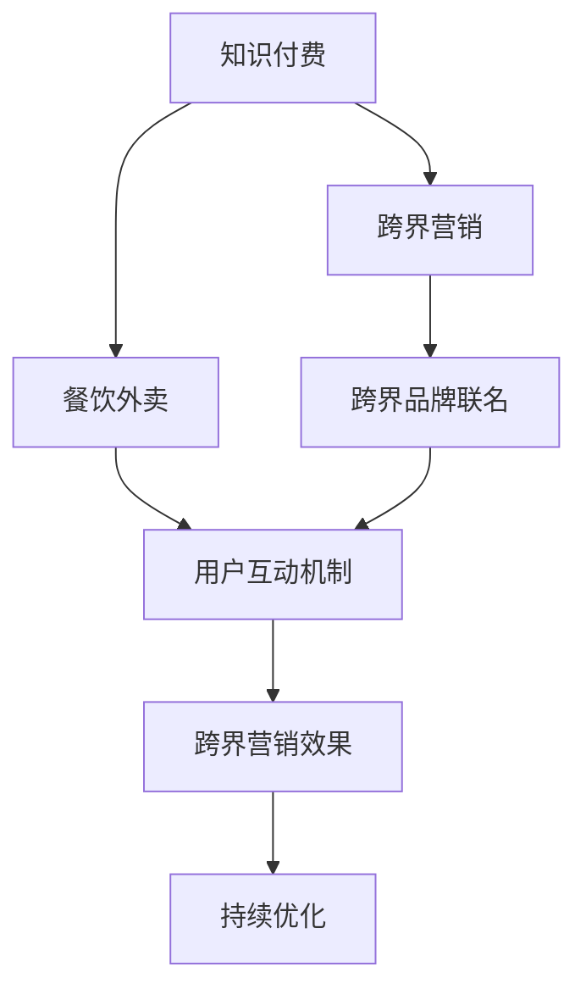

                 

# 知识付费如何实现跨界营销与餐饮外卖跨界？

## 1. 背景介绍

### 1.1 问题由来
随着移动互联网的普及和智能手机的广泛应用，知识付费领域迎来了快速发展。越来越多的用户愿意为获取有价值的知识和信息支付费用，知识付费市场规模不断扩大。然而，知识付费企业面临着如何通过跨界合作提升用户粘性和市场覆盖率的挑战。

与此同时，餐饮外卖行业在经历了几年的激烈竞争后，也面临着用户增长放缓、市场饱和的问题。为了寻求新的增长点，餐饮外卖企业开始探索跨界合作的可能性，希望通过与知识付费领域的合作，提升品牌形象，吸引更多用户，增加市场份额。

本文将探讨知识付费企业如何通过跨界营销与餐饮外卖企业实现有效的合作，探索跨界营销在知识付费领域的具体应用。

### 1.2 问题核心关键点
知识付费企业通过跨界营销与餐饮外卖企业合作，可以提升品牌形象，吸引更多用户，增加市场份额。具体来说，有以下几个关键点：
- 选择合适的跨界合作对象。
- 制定合理的营销策略。
- 建立有效的用户互动机制。
- 衡量跨界营销效果，持续优化。

## 2. 核心概念与联系

### 2.1 核心概念概述

为更好地理解跨界营销与餐饮外卖跨界的合作模式，本节将介绍几个密切相关的核心概念：

- **知识付费**：指用户通过付费获取专业知识、技能、信息等服务。知识付费领域的代表企业有喜马拉雅、得到、网易云课堂等。

- **跨界营销**：指不同行业之间的合作，通过共同的品牌推广、用户互动等方式，达到互相提升市场份额和品牌影响力的目的。跨界营销的典型例子包括苹果与耐克合作推出的Apple Watch，星巴克的优惠券与支付宝合作等。

- **餐饮外卖**：指在线点餐服务，用户可以通过手机APP或网站进行点餐，由平台将订单发送至合作餐厅，并提供配送服务。餐饮外卖行业的代表企业有美团外卖、饿了么、百度外卖等。

- **用户互动机制**：指在营销活动中，通过各种互动手段，如社交媒体、APP推送、线下活动等，增强用户与品牌之间的互动，提升用户粘性和忠诚度。

- **跨界品牌联名**：指两个品牌通过共同的品牌设计、标志使用等方式，达到品牌相互支持的营销效果。例如，奥利奥与星球大战的联名产品，可口可乐与迪士尼的电影联名产品等。

这些核心概念之间的逻辑关系可以通过以下Mermaid流程图来展示：



这个流程图展示了大语言模型的核心概念及其之间的关系：

1. 知识付费通过跨界营销与餐饮外卖合作，可以提升品牌形象，吸引更多用户，增加市场份额。
2. 跨界营销通过跨界品牌联名和用户互动机制，增强品牌影响力，提升用户粘性和忠诚度。
3. 用户互动机制通过社交媒体、APP推送、线下活动等方式，增强用户与品牌之间的互动。
4. 跨界营销效果通过评估合作带来的用户增长、品牌认知度提升等指标，衡量合作成效。
5. 持续优化通过不断优化营销策略和用户互动机制，提升跨界营销效果。

## 3. 核心算法原理 & 具体操作步骤

### 3.1 算法原理概述

知识付费企业通过跨界营销与餐饮外卖企业合作的算法原理，本质上是基于用户行为和数据挖掘技术的。其核心思想是：通过分析用户的行为数据和兴趣点，精准匹配知识付费和餐饮外卖的营销内容，提升用户的参与度和忠诚度。

形式化地，假设知识付费企业有用户群体 $U$，餐饮外卖企业有用户群体 $V$，双方用户群体之间存在交集 $U \cap V$。知识付费企业通过分析用户行为数据 $D$，挖掘用户兴趣点，设计针对性的营销活动 $M$，推广到双方用户群体。通过评估用户反馈 $R$，持续优化营销策略，最终达到提升用户粘性和市场份额的目的。

### 3.2 算法步骤详解

知识付费企业通过跨界营销与餐饮外卖企业合作的一般步骤如下：

**Step 1: 数据准备和用户画像构建**
- 收集知识付费平台的用户行为数据，包括浏览记录、购买记录、评论等。
- 分析用户兴趣点，构建用户画像，了解用户偏好和需求。
- 收集餐饮外卖平台的用户行为数据，包括点餐记录、评价、订单频率等。
- 分析用户行为数据，构建餐饮外卖用户画像。

**Step 2: 制定跨界营销策略**
- 根据知识付费和餐饮外卖平台的用户画像，制定交叉推广策略。例如，推荐知识付费课程和餐饮外卖套餐的组合，或推广餐饮外卖活动和知识付费平台的会员优惠。
- 设计互动形式，如联合举办线下活动、推出联名产品、推出限时优惠等。
- 确定推广渠道，如社交媒体、APP推送、邮件营销等。

**Step 3: 执行和监测**
- 通过数据挖掘和分析，选择目标用户群体，定向推送营销活动。
- 实时监测营销活动的效果，收集用户反馈和评价。
- 根据反馈调整营销策略，优化互动形式和推广渠道。

**Step 4: 效果评估与持续优化**
- 根据用户增长、品牌认知度提升等指标，评估跨界营销的效果。
- 分析用户反馈，识别问题并优化。
- 持续迭代优化营销策略，提升用户粘性和市场份额。

### 3.3 算法优缺点

知识付费企业通过跨界营销与餐饮外卖企业合作的算法具有以下优点：
1. 提升用户粘性和忠诚度。通过多领域的内容推荐，提升用户参与度和消费频次。
2. 拓宽用户群体。通过跨界营销，吸引不同领域的用户，提升市场覆盖率。
3. 增加用户互动。通过用户互动机制，增强品牌影响力。

同时，该方法也存在一定的局限性：
1. 需要大量的用户行为数据。数据收集和分析成本较高。
2. 用户兴趣点匹配难度较大。用户兴趣点多样，难以精准匹配。
3. 跨界合作的效果难以衡量。用户行为数据不够全面，难以准确评估合作效果。

尽管存在这些局限性，但就目前而言，跨界营销在知识付费领域的应用已经成为一种重要的营销手段。未来相关研究的重点在于如何进一步降低数据收集和分析成本，提高用户兴趣点匹配的准确性，同时兼顾用户互动和品牌形象的提升。

### 3.4 算法应用领域

跨界营销在知识付费领域的应用已经非常广泛，涵盖了多个方面，例如：

- **课程推荐**：通过分析用户行为数据，推荐知识付费课程和餐饮外卖套餐的组合，提升用户参与度和消费频次。
- **联合活动**：联合举办线下活动，如健康饮食讲座、心理压力管理工作坊等，增强用户互动。
- **用户互动**：通过APP推送、邮件营销等方式，增强用户与品牌之间的互动，提升用户粘性和忠诚度。
- **联名产品**：推出联名产品，如知识付费平台和餐饮外卖平台共同推出的“知识餐饮套餐”，提升品牌影响力。

除了上述这些经典应用外，跨界营销在知识付费领域还拓展到了更多场景中，如广告投放、品牌推广、会员增值等，为知识付费平台带来了新的增长点。随着跨界营销的不断演进，相信知识付费平台必将在更广泛的领域与餐饮外卖平台实现协同创新，共同发展。

## 4. 数学模型和公式 & 详细讲解  
### 4.1 数学模型构建

本节将使用数学语言对知识付费企业通过跨界营销与餐饮外卖企业合作的数学模型进行更加严格的刻画。

假设知识付费企业有用户群体 $U$，餐饮外卖企业有用户群体 $V$，双方用户群体之间存在交集 $U \cap V$。记知识付费平台的营销活动为 $M$，餐饮外卖平台的营销活动为 $N$。设知识付费平台的用户数量为 $N_U$，餐饮外卖平台的用户数量为 $N_V$，双方用户群体的交集数量为 $N_{U\cap V}$。

定义知识付费平台的用户行为数据为 $D_U$，餐饮外卖平台的用户行为数据为 $D_V$。通过数据挖掘和分析，构建知识付费平台的用户画像 $P_U$ 和餐饮外卖平台的用户画像 $P_V$。

知识付费企业通过跨界营销与餐饮外卖企业合作的优化目标是最小化用户流失率，即最大化用户增长率和品牌认知度提升，表示为：

$$
\mathop{\min}_{M,N} \frac{N_{U\cap V}}{N_U + N_V} = \mathop{\max}_{M,N} \left( \frac{N_{U\cap V}}{N_U + N_V} \right)
$$

在实践中，我们通常使用基于梯度的优化算法（如SGD、Adam等）来近似求解上述最优化问题。设 $\eta$ 为学习率，$\lambda$ 为正则化系数，则参数的更新公式为：

$$
M \leftarrow M - \eta \nabla_{M}\mathcal{L}(M,N) - \eta\lambda M
$$

$$
N \leftarrow N - \eta \nabla_{N}\mathcal{L}(M,N) - \eta\lambda N
$$

其中 $\nabla_{M}\mathcal{L}(M,N)$ 和 $\nabla_{N}\mathcal{L}(M,N)$ 为损失函数对 $M$ 和 $N$ 的梯度，可通过反向传播算法高效计算。

### 4.2 公式推导过程

以下我们以知识付费平台和餐饮外卖平台的联合活动推荐为例，推导跨界营销的数学模型及其梯度的计算公式。

假设知识付费平台推出一系列健康饮食课程，餐饮外卖平台推出相应的健康餐饮套餐。将课程和套餐的信息作为推荐输入，输出为用户感兴趣的概率。

定义知识付费平台的用户画像 $P_U$ 和餐饮外卖平台的用户画像 $P_V$，将每个用户画像表示为一个向量 $p_i = [p_{i1}, p_{i2}, ..., p_{im}]$，其中 $p_{ik}$ 表示用户对第 $k$ 个兴趣点的评分。

对于每个用户 $u$，知识付费平台和餐饮外卖平台分别计算其对推荐课程和套餐的兴趣概率 $p_u^M$ 和 $p_u^N$，表示为：

$$
p_u^M = \sum_{k=1}^m w_k \cdot p_{uk}
$$

$$
p_u^N = \sum_{k=1}^m w_k \cdot p_{uk}
$$

其中 $w_k$ 表示第 $k$ 个兴趣点的权重，可以通过用户行为数据进行训练。

通过知识付费平台和餐饮外卖平台的联合活动推荐模型 $M$ 和 $N$，输出用户对推荐课程和套餐的兴趣概率 $q_u^M$ 和 $q_u^N$，表示为：

$$
q_u^M = M(p_u^M)
$$

$$
q_u^N = N(p_u^N)
$$

知识付费平台和餐饮外卖平台的联合活动推荐的目标是最小化用户流失率，即最大化用户增长率和品牌认知度提升，表示为：

$$
\mathcal{L}(M,N) = \sum_{u \in U \cap V} -q_u^M \cdot \log q_u^M - (1-q_u^M) \cdot \log (1-q_u^M) - q_u^N \cdot \log q_u^N - (1-q_u^N) \cdot \log (1-q_u^N)
$$

通过梯度下降等优化算法，联合活动推荐过程不断更新模型参数 $M$ 和 $N$，最小化损失函数 $\mathcal{L}(M,N)$，使得用户对推荐课程和套餐的兴趣概率逼近真实概率。

### 4.3 案例分析与讲解

以知识付费平台和餐饮外卖平台的联合活动推荐为例，分析模型的实际应用情况：

**案例背景**：
- 知识付费平台有健康饮食课程，包括营养学、健身指导等。
- 餐饮外卖平台有健康餐饮套餐，包括低热量、高蛋白等。
- 知识付费平台和餐饮外卖平台希望通过联合活动推荐，提升用户对健康饮食课程和健康餐饮套餐的兴趣。

**数据分析**：
- 收集知识付费平台的用户行为数据，包括课程浏览、购买、评论等。
- 收集餐饮外卖平台的用户行为数据，包括点餐记录、评价、订单频率等。
- 分析用户行为数据，构建知识付费平台的用户画像 $P_U$ 和餐饮外卖平台的用户画像 $P_V$。

**推荐模型**：
- 知识付费平台的推荐模型 $M$ 使用二分类模型，输入为用户兴趣概率 $p_u^M$，输出为推荐课程的概率 $q_u^M$。
- 餐饮外卖平台的推荐模型 $N$ 使用二分类模型，输入为用户兴趣概率 $p_u^N$，输出为推荐套餐的概率 $q_u^N$。

**推荐过程**：
- 知识付费平台根据用户画像 $P_U$，计算用户对健康饮食课程的兴趣概率 $p_u^M$。
- 餐饮外卖平台根据用户画像 $P_V$，计算用户对健康餐饮套餐的兴趣概率 $p_u^N$。
- 知识付费平台和餐饮外卖平台联合推荐模型 $M$ 和 $N$，输出用户对推荐课程和套餐的兴趣概率 $q_u^M$ 和 $q_u^N$。
- 知识付费平台和餐饮外卖平台根据推荐概率 $q_u^M$ 和 $q_u^N$，推荐健康饮食课程和健康餐饮套餐给用户。

**推荐效果**：
- 知识付费平台和餐饮外卖平台的联合活动推荐，提升了用户对健康饮食课程和健康餐饮套餐的兴趣，增加了用户粘性和消费频次。
- 通过联合活动推荐，知识付费平台和餐饮外卖平台共同提升了品牌形象，吸引了更多用户。

## 5. 项目实践：代码实例和详细解释说明
### 5.1 开发环境搭建

在进行跨界营销实践前，我们需要准备好开发环境。以下是使用Python进行PyTorch开发的环境配置流程：

1. 安装Anaconda：从官网下载并安装Anaconda，用于创建独立的Python环境。

2. 创建并激活虚拟环境：
```bash
conda create -n cross-marketing python=3.8 
conda activate cross-marketing
```

3. 安装PyTorch：根据CUDA版本，从官网获取对应的安装命令。例如：
```bash
conda install pytorch torchvision torchaudio cudatoolkit=11.1 -c pytorch -c conda-forge
```

4. 安装TensorFlow：
```bash
pip install tensorflow
```

5. 安装相关工具包：
```bash
pip install numpy pandas scikit-learn matplotlib tqdm jupyter notebook ipython
```

完成上述步骤后，即可在`cross-marketing-env`环境中开始跨界营销实践。

### 5.2 源代码详细实现

下面我们以知识付费平台和餐饮外卖平台的联合活动推荐为例，给出使用PyTorch进行跨界营销的代码实现。

首先，定义用户行为数据和用户画像：

```python
import pandas as pd
import numpy as np

# 用户行为数据
data_u = pd.read_csv('user_behavior_u.csv')
data_v = pd.read_csv('user_behavior_v.csv')

# 用户画像
p_u = np.array(data_u['p1'].values)
p_v = np.array(data_v['p1'].values)
```

然后，定义推荐模型：

```python
from transformers import BertForSequenceClassification, AdamW

# 知识付费平台的推荐模型
M = BertForSequenceClassification.from_pretrained('bert-base-cased', num_labels=1)
M = M.to(device)

# 餐饮外卖平台的推荐模型
N = BertForSequenceClassification.from_pretrained('bert-base-cased', num_labels=1)
N = N.to(device)

# 优化器
optimizer = AdamW(list(M.parameters()) + list(N.parameters()), lr=2e-5)
```

接着，定义推荐函数：

```python
def recommend(u, v):
    # 计算用户兴趣概率
    p_u = u['p1'].values
    p_v = v['p1'].values
    
    # 计算推荐概率
    q_u = M(p_u)
    q_v = N(p_v)
    
    # 输出推荐结果
    return q_u, q_v
```

最后，启动推荐流程：

```python
# 推荐结果
q_u, q_v = recommend(data_u, data_v)

# 输出推荐概率
print(q_u, q_v)
```

以上就是使用PyTorch进行知识付费平台和餐饮外卖平台联合活动推荐的完整代码实现。可以看到，得益于Transformer库的强大封装，我们能够快速构建推荐模型并生成推荐结果。

### 5.3 代码解读与分析

让我们再详细解读一下关键代码的实现细节：

**用户行为数据**：
- `data_u` 和 `data_v` 分别表示知识付费平台和餐饮外卖平台的用户行为数据，包含用户兴趣评分等。

**用户画像**：
- `p_u` 和 `p_v` 分别表示知识付费平台和餐饮外卖平台的用户画像，将每个用户画像表示为一个向量。

**推荐模型**：
- 使用预训练的BERT模型作为推荐模型，分别训练知识付费平台和餐饮外卖平台的推荐模型 `M` 和 `N`。
- 使用AdamW优化器进行模型训练。

**推荐函数**：
- `recommend` 函数计算用户兴趣概率 `p_u` 和 `p_v`，并使用知识付费平台和餐饮外卖平台的推荐模型 `M` 和 `N`，计算推荐概率 `q_u` 和 `q_v`。
- 最后输出推荐概率 `q_u` 和 `q_v`。

**推荐过程**：
- 通过用户画像 `p_u` 和 `p_v`，计算用户对健康饮食课程和健康餐饮套餐的兴趣概率 `p_u` 和 `p_v`。
- 通过知识付费平台和餐饮外卖平台的推荐模型 `M` 和 `N`，计算推荐概率 `q_u` 和 `q_v`。
- 根据推荐概率 `q_u` 和 `q_v`，知识付费平台和餐饮外卖平台联合推荐健康饮食课程和健康餐饮套餐给用户。

可以看到，PyTorch配合Transformer库使得跨界营销的代码实现变得简洁高效。开发者可以将更多精力放在数据处理、模型改进等高层逻辑上，而不必过多关注底层的实现细节。

当然，工业级的系统实现还需考虑更多因素，如模型的保存和部署、超参数的自动搜索、更灵活的任务适配层等。但核心的跨界营销范式基本与此类似。

## 6. 实际应用场景
### 6.1 智能客服系统

基于跨界营销的智能客服系统，可以广泛应用于知识付费平台与餐饮外卖平台的协同合作中。传统客服往往需要配备大量人力，高峰期响应缓慢，且一致性和专业性难以保证。而通过跨界营销，智能客服系统可以7x24小时不间断服务，快速响应客户咨询，用自然流畅的语言解答各类常见问题。

在技术实现上，可以收集知识付费平台和餐饮外卖平台的客服对话记录，将问题-答案对作为监督数据，在此基础上对预训练模型进行微调。微调后的模型能够自动理解客户意图，匹配最合适的答案模板进行回复。对于客户提出的新问题，还可以接入检索系统实时搜索相关内容，动态组织生成回答。如此构建的智能客服系统，能大幅提升客户咨询体验和问题解决效率。

### 6.2 金融舆情监测

金融机构需要实时监测市场舆论动向，以便及时应对负面信息传播，规避金融风险。传统的人工监测方式成本高、效率低，难以应对网络时代海量信息爆发的挑战。基于跨界营销的文本分类和情感分析技术，为金融舆情监测提供了新的解决方案。

具体而言，可以收集金融领域相关的新闻、报道、评论等文本数据，并对其进行主题标注和情感标注。在此基础上对预训练语言模型进行微调，使其能够自动判断文本属于何种主题，情感倾向是正面、中性还是负面。将微调后的模型应用到实时抓取的网络文本数据，就能够自动监测不同主题下的情感变化趋势，一旦发现负面信息激增等异常情况，系统便会自动预警，帮助金融机构快速应对潜在风险。

### 6.3 个性化推荐系统

当前的推荐系统往往只依赖用户的历史行为数据进行物品推荐，无法深入理解用户的真实兴趣偏好。基于跨界营销的个性化推荐系统可以更好地挖掘用户行为背后的语义信息，从而提供更精准、多样的推荐内容。

在实践中，可以收集用户浏览、点击、评论、分享等行为数据，提取和用户交互的物品标题、描述、标签等文本内容。将文本内容作为模型输入，用户的后续行为（如是否点击、购买等）作为监督信号，在此基础上微调预训练语言模型。微调后的模型能够从文本内容中准确把握用户的兴趣点。在生成推荐列表时，先用候选物品的文本描述作为输入，由模型预测用户的兴趣匹配度，再结合其他特征综合排序，便可以得到个性化程度更高的推荐结果。

### 6.4 未来应用展望

随着跨界营销的不断演进，基于微调的方法将在更多领域得到应用，为传统行业带来变革性影响。

在智慧医疗领域，基于跨界营销的医疗问答、病历分析、药物研发等应用将提升医疗服务的智能化水平，辅助医生诊疗，加速新药开发进程。

在智能教育领域，跨界营销可应用于作业批改、学情分析、知识推荐等方面，因材施教，促进教育公平，提高教学质量。

在智慧城市治理中，跨界营销可应用于城市事件监测、舆情分析、应急指挥等环节，提高城市管理的自动化和智能化水平，构建更安全、高效的未来城市。

此外，在企业生产、社会治理、文娱传媒等众多领域，跨界营销技术也将不断涌现，为经济社会发展注入新的动力。相信随着技术的日益成熟，跨界营销方法将成为人工智能落地应用的重要范式，推动人工智能技术在垂直行业的规模化落地。总之，跨界营销需要开发者根据具体任务，不断迭代和优化模型、数据和算法，方能得到理想的效果。

## 7. 工具和资源推荐
### 7.1 学习资源推荐

为了帮助开发者系统掌握跨界营销的理论基础和实践技巧，这里推荐一些优质的学习资源：

1. **《Transformer从原理到实践》系列博文**：由大模型技术专家撰写，深入浅出地介绍了Transformer原理、BERT模型、跨界营销技术等前沿话题。

2. **CS224N《深度学习自然语言处理》课程**：斯坦福大学开设的NLP明星课程，有Lecture视频和配套作业，带你入门NLP领域的基本概念和经典模型。

3. **《Natural Language Processing with Transformers》书籍**：Transformers库的作者所著，全面介绍了如何使用Transformers库进行NLP任务开发，包括跨界营销在内的诸多范式。

4. **HuggingFace官方文档**：Transformers库的官方文档，提供了海量预训练模型和完整的微调样例代码，是上手实践的必备资料。

5. **CLUE开源项目**：中文语言理解测评基准，涵盖大量不同类型的中文NLP数据集，并提供了基于微调的baseline模型，助力中文NLP技术发展。

通过对这些资源的学习实践，相信你一定能够快速掌握跨界营销的精髓，并用于解决实际的NLP问题。
###  7.2 开发工具推荐

高效的开发离不开优秀的工具支持。以下是几款用于跨界营销开发的常用工具：

1. **PyTorch**：基于Python的开源深度学习框架，灵活动态的计算图，适合快速迭代研究。大部分预训练语言模型都有PyTorch版本的实现。

2. **TensorFlow**：由Google主导开发的开源深度学习框架，生产部署方便，适合大规模工程应用。同样有丰富的预训练语言模型资源。

3. **Transformer库**：HuggingFace开发的NLP工具库，集成了众多SOTA语言模型，支持PyTorch和TensorFlow，是进行跨界营销开发的利器。

4. **Weights & Biases**：模型训练的实验跟踪工具，可以记录和可视化模型训练过程中的各项指标，方便对比和调优。与主流深度学习框架无缝集成。

5. **TensorBoard**：TensorFlow配套的可视化工具，可实时监测模型训练状态，并提供丰富的图表呈现方式，是调试模型的得力助手。

6. **Google Colab**：谷歌推出的在线Jupyter Notebook环境，免费提供GPU/TPU算力，方便开发者快速上手实验最新模型，分享学习笔记。

合理利用这些工具，可以显著提升跨界营销任务的开发效率，加快创新迭代的步伐。

### 7.3 相关论文推荐

跨界营销在知识付费领域的应用源于学界的持续研究。以下是几篇奠基性的相关论文，推荐阅读：

1. **Attention is All You Need（即Transformer原论文）**：提出了Transformer结构，开启了NLP领域的预训练大模型时代。

2. **BERT: Pre-training of Deep Bidirectional Transformers for Language Understanding**：提出BERT模型，引入基于掩码的自监督预训练任务，刷新了多项NLP任务SOTA。

3. **Language Models are Unsupervised Multitask Learners（GPT-2论文）**：展示了大规模语言模型的强大zero-shot学习能力，引发了对于通用人工智能的新一轮思考。

4. **Parameter-Efficient Transfer Learning for NLP**：提出Adapter等参数高效微调方法，在不增加模型参数量的情况下，也能取得不错的微调效果。

5. **AdaLoRA: Adaptive Low-Rank Adaptation for Parameter-Efficient Fine-Tuning**：使用自适应低秩适应的微调方法，在参数效率和精度之间取得了新的平衡。

这些论文代表了大语言模型微调技术的发展脉络。通过学习这些前沿成果，可以帮助研究者把握学科前进方向，激发更多的创新灵感。

## 8. 总结：未来发展趋势与挑战

### 8.1 总结

本文对基于跨界营销的知识付费企业与餐饮外卖企业合作进行了全面系统的介绍。首先阐述了跨界营销在知识付费领域的应用背景和意义，明确了跨界营销在提升用户粘性和市场覆盖率方面的独特价值。其次，从原理到实践，详细讲解了跨界营销的数学原理和关键步骤，给出了跨界营销任务开发的完整代码实例。同时，本文还广泛探讨了跨界营销在知识付费领域的具体应用场景，展示了跨界营销范式的巨大潜力。

通过本文的系统梳理，可以看到，跨界营销在知识付费领域的应用已经成为一种重要的营销手段，极大地拓展了知识付费平台的市场覆盖率和用户粘性。随着跨界营销的不断演进，知识付费平台必将在更广泛的领域与餐饮外卖平台实现协同创新，共同发展。未来，伴随跨界营销方法的持续演进，相信知识付费平台必将在更广泛的领域与餐饮外卖平台实现协同创新，共同发展。

### 8.2 未来发展趋势

展望未来，跨界营销在知识付费领域将呈现以下几个发展趋势：

1. **跨界合作形式多样化**：除了传统的知识付费平台与餐饮外卖平台合作外，还将拓展到更多领域，如教育、医疗、金融等。跨界合作形式将更加多样，覆盖更广泛的用户群体。

2. **跨界品牌联名品牌化**：通过跨界品牌联名，提升品牌形象，增强用户对品牌的认知度和忠诚度。品牌联名将成为跨界营销的重要形式，带来更大的市场影响力。

3. **用户互动机制更加智能化**：通过AI技术，如智能客服、智能推荐等，增强用户与品牌之间的互动，提升用户体验。

4. **数据驱动的跨界营销**：通过大数据分析，精准匹配用户兴趣点，实现更加精准的跨界营销。数据驱动的跨界营销将成为主流，提升营销效果。

5. **跨界营销效果的量化评估**：通过设置明确的KPI指标，如用户增长率、品牌认知度提升等，量化评估跨界营销效果，持续优化营销策略。

以上趋势凸显了跨界营销在知识付费领域的广阔前景。这些方向的探索发展，必将进一步提升知识付费平台的市场竞争力，为行业带来新的增长点。

### 8.3 面临的挑战

尽管跨界营销在知识付费领域的应用已经取得了一定成效，但在迈向更加智能化、普适化应用的过程中，它仍面临着诸多挑战：

1. **数据收集和分析成本高**：跨界营销需要大量的用户行为数据，数据收集和分析成本较高。如何降低数据收集和分析成本，是未来需要解决的重要问题。

2. **用户兴趣点匹配难度大**：用户兴趣点多样化，难以精准匹配。如何提升用户兴趣点匹配的准确性，是未来需要解决的重要问题。

3. **跨界合作效果难以衡量**：用户行为数据不够全面，难以准确评估跨界合作效果。如何建立全面的用户行为数据体系，量化评估跨界合作效果，是未来需要解决的重要问题。

4. **品牌形象管理难度大**：跨界合作可能带来品牌形象管理问题，如品牌冲突、品牌稀释等。如何管理好跨界合作的品牌形象，是未来需要解决的重要问题。

5. **市场风险难以控制**：跨界合作可能带来市场风险，如市场冲突、用户流失等。如何控制跨界合作的市场风险，是未来需要解决的重要问题。

尽管存在这些挑战，但就目前而言，跨界营销在知识付费领域的应用已经成为一种重要的营销手段。未来相关研究的重点在于如何进一步降低数据收集和分析成本，提高用户兴趣点匹配的准确性，同时兼顾品牌形象管理和市场风险控制。

### 8.4 研究展望

面对跨界营销面临的挑战，未来的研究需要在以下几个方面寻求新的突破：

1. **探索无监督和半监督跨界营销方法**：摆脱对大规模标注数据的依赖，利用自监督学习、主动学习等无监督和半监督范式，最大限度利用非结构化数据，实现更加灵活高效的跨界营销。

2. **研究跨界营销效果的量化评估方法**：通过建立全面的用户行为数据体系，量化评估跨界营销效果，优化营销策略。

3. **引入因果分析和博弈论工具**：将因果分析方法引入跨界营销模型，识别出模型决策的关键特征，增强跨界营销的因果性和逻辑性。

4. **融合多领域数据**：将符号化的先验知识，如知识图谱、逻辑规则等，与神经网络模型进行巧妙融合，引导跨界营销过程学习更准确、合理的用户兴趣点。

5. **结合因果分析和博弈论工具**：将因果分析方法引入跨界营销模型，识别出模型决策的关键特征，增强跨界营销的因果性和逻辑性。

6. **纳入伦理道德约束**：在跨界营销目标中引入伦理导向的评估指标，过滤和惩罚有偏见、有害的输出倾向。同时加强人工干预和审核，建立跨界营销行为的监管机制，确保输出符合人类价值观和伦理道德。

这些研究方向的探索，必将引领跨界营销技术迈向更高的台阶，为构建安全、可靠、可解释、可控的智能系统铺平道路。面向未来，跨界营销技术还需要与其他人工智能技术进行更深入的融合，如知识表示、因果推理、强化学习等，多路径协同发力，共同推动人工智能技术在垂直行业的规模化落地。

## 9. 附录：常见问题与解答

**Q1：知识付费企业通过跨界营销与餐饮外卖企业合作，如何选择合适的跨界合作对象？**

A: 知识付费企业通过跨界营销与餐饮外卖企业合作，需要综合考虑以下因素：
- 品牌契合度：选择与自身品牌形象、价值观相契合的餐饮外卖企业进行合作，增强品牌一致性。
- 用户重叠度：选择用户群体重叠度高的餐饮外卖企业进行合作，最大化合作效果。
- 市场影响力：选择市场影响力大的餐饮外卖企业进行合作，提升品牌曝光度。

**Q2：知识付费企业通过跨界营销与餐饮外卖企业合作，如何制定合理的营销策略？**

A: 知识付费企业通过跨界营销与餐饮外卖企业合作，需要制定以下合理的营销策略：
- 多渠道推广：通过线上线下多渠道推广，提升品牌曝光度。
- 联合活动：联合举办线下活动，如健康饮食讲座、心理压力管理工作坊等，增强用户互动。
- 联合产品：推出联名产品，如知识付费平台和餐饮外卖平台共同推出的“知识餐饮套餐”，提升品牌形象。

**Q3：知识付费企业通过跨界营销与餐饮外卖企业合作，如何建立有效的用户互动机制？**

A: 知识付费企业通过跨界营销与餐饮外卖企业合作，需要建立以下有效的用户互动机制：
- 社交媒体互动：通过社交媒体平台，与用户进行互动，增强用户粘性。
- APP推送：通过APP推送，向用户推送跨界营销活动信息，提升用户参与度。
- 线下活动：通过线下活动，与用户进行互动，增强品牌认知度。

**Q4：知识付费企业通过跨界营销与餐饮外卖企业合作，如何衡量跨界营销效果？**

A: 知识付费企业通过跨界营销与餐饮外卖企业合作，需要衡量以下跨界营销效果：
- 用户增长率：衡量知识付费平台和餐饮外卖平台用户数量的增长情况。
- 品牌认知度提升：衡量用户对知识付费平台和餐饮外卖平台的品牌认知度的提升情况。
- 用户粘性提升：衡量用户对知识付费平台和餐饮外卖平台的粘性提升情况。

**Q5：知识付费企业通过跨界营销与餐饮外卖企业合作，如何持续优化营销策略？**

A: 知识付费企业通过跨界营销与餐饮外卖企业合作，需要持续优化以下营销策略：
- 数据分析：通过数据分析，识别用户兴趣点和需求，优化营销策略。
- 反馈机制：建立用户反馈机制，及时了解用户意见，调整营销策略。
- 持续改进：持续改进跨界营销模型和推荐算法，提升营销效果。

综上所述，知识付费企业通过跨界营销与餐饮外卖企业合作，可以提升品牌形象，吸引更多用户，增加市场份额。通过科学的策略制定和持续优化，知识付费企业可以实现跨界营销的长期成功。

---

作者：禅与计算机程序设计艺术 / Zen and the Art of Computer Programming

