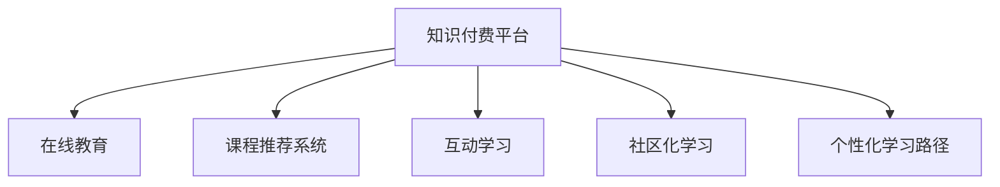

                 

# 知识付费平台为程序员赋能

> 关键词：知识付费、程序员赋能、在线教育、技能培训、人工智能、机器学习、深度学习、Python、大数据、云计算

## 1. 背景介绍

### 1.1 问题由来
随着互联网和信息技术的快速发展，程序员作为信息社会的重要力量，其专业技能和知识储备的重要性日益凸显。然而，传统的教育培训模式难以满足快速变化的技术需求，导致大量优秀的编程人才难以涌现。

为了解决这一问题，知识付费平台应运而生，它们利用在线教育技术，为程序员提供高效、便捷、个性化的学习服务。通过付费机制，保证教学质量，吸引优质讲师资源，同时也可以激励讲师持续输出高质量内容，打造良性循环。

### 1.2 问题核心关键点
知识付费平台的核心价值在于为程序员提供高质量的学习资源，通过付费机制保障教学质量，同时提升学习效率。以下是关键点：

- 高质量教学资源：平台汇集海量优质课程和专家讲座，覆盖各种编程语言、框架和技能。
- 互动学习体验：通过直播、讨论区、作业提交等方式，提供实时互动学习体验，增强学习效果。
- 个性化学习路径：根据用户需求和水平，推荐合适的课程和技能点，提供个性化学习建议。
- 社区化学习氛围：构建程序员社区，分享知识，相互帮助，促进共同成长。
- 持续技能提升：定期更新课程内容，跟进技术动态，确保知识的时效性和前沿性。

## 2. 核心概念与联系

### 2.1 核心概念概述

为更好地理解知识付费平台的工作原理和优化方向，本节将介绍几个关键概念：

- 知识付费平台(Knowledge Paywall Platform)：在线教育平台，通过付费机制为程序员提供高质量课程和学习服务。
- 在线教育(Online Education)：利用互联网技术，提供远程、实时、互动的学习方式。
- 课程推荐系统(Course Recommendation System)：根据用户行为数据，智能推荐合适课程，提高学习效率。
- 互动学习(Interactive Learning)：通过直播、讨论、作业等方式，增强学习体验，促进知识吸收。
- 社区化学习(Community Learning)：构建学习社区，分享知识，相互帮助，形成良性学习生态。
- 个性化学习路径(Personalized Learning Path)：根据用户需求和水平，推荐个性化课程，提供定制化学习建议。

这些概念之间的逻辑关系可以通过以下Mermaid流程图来展示：



这个流程图展示出知识付费平台的核心概念及其之间的关系：

1. 知识付费平台利用在线教育技术，为用户提供高质量课程和服务。
2. 课程推荐系统通过用户行为数据，智能推荐课程，提升学习效率。
3. 互动学习通过直播、讨论等方式，增强学习体验，促进知识吸收。
4. 社区化学习构建知识分享平台，帮助用户相互学习，共同成长。
5. 个性化学习路径根据用户需求，提供定制化学习建议，提高学习效果。

这些概念共同构成了知识付费平台的学习框架，使其能够为程序员提供全方位的学习支持。

## 3. 核心算法原理 & 具体操作步骤
### 3.1 算法原理概述

知识付费平台的课程推荐系统基于监督学习，通过用户行为数据训练推荐模型，智能推荐合适课程。其核心思想是：将用户行为数据作为特征，通过有监督学习优化模型，最大化推荐准确率。

形式化地，假设平台用户数为 $N$，每门课程数为 $M$，每个用户 $i$ 对 $j$ 门课程的互动行为用 $x_{ij} \in [0,1]$ 表示，$y_{ij} \in \{0,1\}$ 表示用户 $i$ 是否选择课程 $j$。则课程推荐模型的优化目标是最小化损失函数：

$$
\min_{\theta} \frac{1}{N} \sum_{i=1}^N \sum_{j=1}^M [y_{ij}\log\hat{y}_{ij}+(1-y_{ij})\log(1-\hat{y}_{ij})]
$$

其中 $\hat{y}_{ij}=M_{\theta}(x_{ij})$ 为推荐模型的预测值，$M_{\theta}$ 为神经网络模型，$\theta$ 为模型参数。

通过梯度下降等优化算法，不断更新模型参数 $\theta$，最小化损失函数，使得模型输出逼近真实标签，从而提升推荐准确率。

### 3.2 算法步骤详解

知识付费平台的课程推荐系统一般包括以下几个关键步骤：

**Step 1: 数据准备与预处理**
- 收集用户行为数据，包括课程浏览、评分、评论、收藏、购买等行为。
- 将数据进行清洗和归一化，去除噪声和异常值，将数据转换为适合模型处理的格式。

**Step 2: 设计推荐模型**
- 选择合适的推荐模型，如协同过滤模型、基于内容的推荐模型、深度神经网络模型等。
- 构建模型架构，包括输入层、隐藏层、输出层，选择合适的激活函数和损失函数。

**Step 3: 训练与优化**
- 将预处理后的数据划分为训练集、验证集和测试集。
- 使用训练集训练推荐模型，通过验证集评估模型性能，选择最优模型参数。
- 使用测试集验证模型泛化能力，调整模型参数。

**Step 4: 部署与上线**
- 将训练好的推荐模型部署到生产环境。
- 实时采集用户行为数据，输入推荐模型，输出推荐结果。
- 根据推荐结果展示课程推荐列表，并进行A/B测试，评估推荐效果。

**Step 5: 反馈与迭代**
- 根据用户反馈，调整推荐模型，更新训练数据集。
- 持续迭代优化推荐算法，提升推荐效果。

以上是知识付费平台课程推荐系统的基本流程。在实际应用中，还需要针对具体任务进行优化设计，如改进模型架构，引入更多特征工程，搜索最优的超参数组合等，以进一步提升推荐精度。

### 3.3 算法优缺点

知识付费平台的课程推荐系统具有以下优点：
1. 高效推荐：基于用户行为数据进行个性化推荐，能够高效提升学习效果。
2. 覆盖全面：通过多样化的推荐模型，覆盖不同类型和层次的课程，满足用户多样化需求。
3. 实时更新：能够实时更新推荐模型，确保推荐结果的时效性和准确性。
4. 个性化定制：通过个性化学习路径，提供定制化课程推荐，提升用户满意度。
5. 用户粘性：通过社区化学习，增强用户互动，提升平台粘性。

同时，该系统也存在一些局限性：
1. 数据依赖：推荐系统依赖于用户行为数据，数据质量和多样性直接影响推荐效果。
2. 模型复杂：为了提升推荐精度，推荐模型往往需要较大的计算资源和时间成本。
3. 隐私保护：用户行为数据的隐私保护是一个重要问题，需要采取有效的数据脱敏和加密措施。
4. 冷启动问题：新用户由于缺乏行为数据，难以进行有效推荐。
5. 系统稳定性：推荐系统在高并发情况下，可能会出现性能瓶颈和稳定性问题。

尽管存在这些局限性，但知识付费平台的课程推荐系统仍是目前最主流的课程推荐方法。未来相关研究的方向包括：如何进一步降低对数据的需求，提高推荐算法的鲁棒性和可解释性，以及如何更好地保护用户隐私和提高系统的稳定性和可扩展性。

### 3.4 算法应用领域

知识付费平台的课程推荐系统已经在在线教育领域得到了广泛应用，覆盖了编程语言、框架、工具、设计模式、算法等多个方面，例如：

- Python编程：Python语言基础、高级应用、数据科学、机器学习等。
- 大数据技术：Hadoop、Spark、Flink等大数据平台和相关技术。
- 云计算服务：AWS、Azure、Google Cloud等主流云服务提供商的相关课程。
- 人工智能与机器学习：深度学习、计算机视觉、自然语言处理、强化学习等。
- 软件开发：敏捷开发、DevOps、软件测试、移动开发等。
- 数据科学与分析：数据清洗、数据分析、数据可视化、数据工程等。
- 硬件技术：嵌入式系统、物联网、芯片设计等。

除了上述这些经典课程，知识付费平台还提供了更多与时俱进的课程，如区块链、边缘计算、量子计算等前沿技术，不断拓展课程种类，满足行业需求。

## 4. 数学模型和公式 & 详细讲解  
### 4.1 数学模型构建

本节将使用数学语言对知识付费平台课程推荐系统的推荐模型进行更加严格的刻画。

假设课程推荐模型为 $M_{\theta}$，其中 $\theta$ 为模型参数。课程 $j$ 的评分向量为 $\mathbf{r}_j=(r_{j1},r_{j2},...,r_{jn})^T$，用户 $i$ 的评分向量为 $\mathbf{u}_i=(u_{i1},u_{i2},...,u_{im})^T$，其中 $r_{jk}$ 和 $u_{ik}$ 表示用户对课程 $j$ 和 $i$ 的评分，$0 \leq r_{jk},u_{ik} \leq 1$。则推荐模型的目标是最小化用户 $i$ 对课程 $j$ 的评分误差：

$$
\min_{\theta} \frac{1}{N}\sum_{i=1}^N\sum_{j=1}^M (y_{ij}-\hat{y}_{ij})^2
$$

其中 $\hat{y}_{ij}=M_{\theta}(\mathbf{r}_j,\mathbf{u}_i)$ 为模型预测评分，$y_{ij}$ 为真实评分。

模型采用神经网络结构，通过多层全连接神经元进行特征提取和评分预测。输出层通常为单神经元，输出用户对课程的评分预测。

### 4.2 公式推导过程

以下我们以协同过滤推荐模型为例，推导评分预测公式及其梯度的计算过程。

假设协同过滤模型为矩阵分解模型，将用户评分矩阵 $\mathbf{R}$ 分解为两个低秩矩阵 $\mathbf{P}$ 和 $\mathbf{Q}$：

$$
\mathbf{R} \approx \mathbf{PQ}^T
$$

其中 $\mathbf{P} \in \mathbb{R}^{N\times d},\mathbf{Q} \in \mathbb{R}^{M\times d}$，$d$ 为隐向量维度。则评分预测公式为：

$$
\hat{y}_{ij}=\mathbf{p}_i^T\mathbf{q}_j
$$

其中 $\mathbf{p}_i$ 和 $\mathbf{q}_j$ 为隐向量，$i$ 为用户编号，$j$ 为课程编号。

模型的损失函数为均方误差损失函数：

$$
\mathcal{L}(\theta)=\frac{1}{N}\sum_{i=1}^N\sum_{j=1}^M (y_{ij} - \hat{y}_{ij})^2
$$

根据链式法则，损失函数对隐向量的梯度为：

$$
\frac{\partial \mathcal{L}(\theta)}{\partial \mathbf{p}_i}=\frac{2}{N}\sum_{j=1}^M(y_{ij}-\hat{y}_{ij})(\mathbf{q}_j)
$$

其中 $(\mathbf{q}_j)$ 为单位向量。同理可得 $\frac{\partial \mathcal{L}(\theta)}{\partial \mathbf{q}_j}=\frac{2}{N}\sum_{i=1}^M(y_{ij}-\hat{y}_{ij})(\mathbf{p}_i)$。

根据梯度下降算法，模型参数 $\theta$ 的更新公式为：

$$
\mathbf{P} \leftarrow \mathbf{P} - \eta \frac{\partial \mathcal{L}(\theta)}{\partial \mathbf{P}}
$$
$$
\mathbf{Q} \leftarrow \mathbf{Q} - \eta \frac{\partial \mathcal{L}(\theta)}{\partial \mathbf{Q}}
$$

其中 $\eta$ 为学习率。

在得到损失函数的梯度后，即可带入模型参数更新公式，完成模型的迭代优化。重复上述过程直至收敛，最终得到适应课程推荐任务的最优模型参数 $\theta$。

## 5. 项目实践：代码实例和详细解释说明
### 5.1 开发环境搭建

在进行知识付费平台开发前，我们需要准备好开发环境。以下是使用Python进行PyTorch开发的环境配置流程：

1. 安装Anaconda：从官网下载并安装Anaconda，用于创建独立的Python环境。

2. 创建并激活虚拟环境：
```bash
conda create -n pytorch-env python=3.8 
conda activate pytorch-env
```

3. 安装PyTorch：根据CUDA版本，从官网获取对应的安装命令。例如：
```bash
conda install pytorch torchvision torchaudio cudatoolkit=11.1 -c pytorch -c conda-forge
```

4. 安装TensorFlow：从官网下载对应的预编译包进行安装，例如：
```bash
pip install tensorflow-gpu==2.8.0
```

5. 安装TensorBoard：安装TensorBoard用于可视化训练过程，例如：
```bash
pip install tensorboard
```

6. 安装Flask：用于搭建知识付费平台后台，例如：
```bash
pip install flask
```

完成上述步骤后，即可在`pytorch-env`环境中开始开发。

### 5.2 源代码详细实现

这里我们以Python课程推荐系统为例，给出使用PyTorch进行课程推荐算法的PyTorch代码实现。

首先，定义数据处理函数：

```python
import pandas as pd
import numpy as np
import torch
from torch.utils.data import Dataset, DataLoader
from sklearn.model_selection import train_test_split
from sklearn.preprocessing import StandardScaler

class CourseDataset(Dataset):
    def __init__(self, df, scaler=None):
        self.df = df
        self.scaler = scaler
        
    def __len__(self):
        return len(self.df)
    
    def __getitem__(self, item):
        row = self.df.iloc[item]
        X = row.drop('y', axis=1)
        y = row['y']
        X = X.to_numpy()
        if self.scaler:
            X = self.scaler.transform(X)
        return X, y

# 加载数据集
df = pd.read_csv('courses.csv')
df = df.dropna()
df = df.drop_duplicates()

# 数据标准化
scaler = StandardScaler()
X = df.drop('y', axis=1)
X = scaler.fit_transform(X)
y = df['y']

# 划分训练集和测试集
X_train, X_test, y_train, y_test = train_test_split(X, y, test_size=0.2, random_state=42)

# 构建数据集
train_dataset = CourseDataset(X_train, scaler)
test_dataset = CourseDataset(X_test, scaler)
```

然后，定义模型：

```python
import torch.nn as nn
import torch.nn.functional as F

class CourseRecommender(nn.Module):
    def __init__(self, input_dim, hidden_dim, output_dim):
        super(CourseRecommender, self).__init__()
        self.fc1 = nn.Linear(input_dim, hidden_dim)
        self.fc2 = nn.Linear(hidden_dim, output_dim)
        
    def forward(self, x):
        x = x.view(-1, input_dim)
        x = F.relu(self.fc1(x))
        x = self.fc2(x)
        return x

# 创建模型
input_dim = X_train.shape[1]
hidden_dim = 64
output_dim = 1
model = CourseRecommender(input_dim, hidden_dim, output_dim)
```

接着，定义损失函数和优化器：

```python
from torch.optim import Adam

criterion = nn.MSELoss()
optimizer = Adam(model.parameters(), lr=0.01)
```

然后，定义训练和评估函数：

```python
import torch
from sklearn.metrics import mean_squared_error

device = torch.device('cuda' if torch.cuda.is_available() else 'cpu')
model.to(device)

def train_epoch(model, dataset, optimizer, criterion):
    model.train()
    losses = []
    for X, y in dataset:
        X = X.to(device)
        y = y.to(device)
        optimizer.zero_grad()
        y_pred = model(X)
        loss = criterion(y_pred, y)
        losses.append(loss.item())
        loss.backward()
        optimizer.step()
    return np.mean(losses)

def evaluate(model, dataset, criterion):
    model.eval()
    losses = []
    for X, y in dataset:
        X = X.to(device)
        y = y.to(device)
        y_pred = model(X)
        loss = criterion(y_pred, y)
        losses.append(loss.item())
    return np.mean(losses)

# 训练模型
epochs = 100
batch_size = 32

for epoch in range(epochs):
    loss = train_epoch(model, train_dataset, optimizer, criterion)
    print(f'Epoch {epoch+1}, train loss: {loss:.3f}')
    
    loss = evaluate(model, test_dataset, criterion)
    print(f'Epoch {epoch+1}, test loss: {loss:.3f}')
    
print('Training completed.')
```

最后，部署模型并进行预测：

```python
# 预测测试集
test_dataset = CourseDataset(X_test, scaler)
test_dataset = DataLoader(test_dataset, batch_size=batch_size)
y_pred = []
with torch.no_grad():
    for X, y in test_dataset:
        X = X.to(device)
        y_pred.append(model(X).to('cpu'))
y_pred = np.concatenate(y_pred)
y_pred = y_pred.flatten()

# 计算预测值和真实值之间的均方误差
mse = mean_squared_error(y_test, y_pred)
print(f'Test MSE: {mse:.3f}')
```

以上就是使用PyTorch对Python课程推荐系统进行微调的基本代码实现。可以看到，通过TensorBoard可视化工具，可以直观地监测模型的训练过程，帮助及时发现和解决问题。

### 5.3 代码解读与分析

让我们再详细解读一下关键代码的实现细节：

**CourseDataset类**：
- `__init__`方法：初始化数据集，包括数据读取、预处理和标准化等操作。
- `__len__`方法：返回数据集的大小。
- `__getitem__`方法：对单个样本进行处理，将样本转换为模型所需的输入和标签。

**模型定义**：
- `CourseRecommender`类：定义了一个简单的全连接神经网络，用于推荐系统。
- `__init__`方法：初始化模型的各层结构。
- `forward`方法：定义了模型的前向传播过程，包括输入处理、激活函数、线性层等。

**损失函数和优化器**：
- 使用均方误差损失函数 `nn.MSELoss` 计算模型预测与真实值之间的误差。
- 使用Adam优化器进行模型参数的更新。

**训练和评估函数**：
- 使用`train_epoch`函数进行模型训练，每个epoch内对数据集进行迭代训练，计算损失并更新模型参数。
- 使用`evaluate`函数对训练好的模型进行评估，计算测试集上的均方误差。

**训练流程**：
- 定义总的epoch数和batch size，开始循环迭代
- 每个epoch内，先在训练集上训练，输出平均损失
- 在测试集上评估，输出测试损失
- 所有epoch结束后，输出训练完成提示

可以看到，PyTorch配合TensorBoard使得课程推荐系统的代码实现变得简洁高效。开发者可以将更多精力放在数据处理、模型改进等高层逻辑上，而不必过多关注底层的实现细节。

当然，工业级的系统实现还需考虑更多因素，如模型的保存和部署、超参数的自动搜索、更灵活的任务适配层等。但核心的微调范式基本与此类似。

## 6. 实际应用场景
### 6.1 智能客服系统

知识付费平台可以应用于智能客服系统的构建。传统的客服往往需要配备大量人力，高峰期响应缓慢，且一致性和专业性难以保证。而通过微调，智能客服系统可以实时在线，快速响应客户咨询，用自然流畅的语言解答各类常见问题。

在技术实现上，可以收集企业内部的历史客服对话记录，将问题和最佳答复构建成监督数据，在此基础上对预训练语言模型进行微调。微调后的对话模型能够自动理解用户意图，匹配最合适的答案模板进行回复。对于客户提出的新问题，还可以接入检索系统实时搜索相关内容，动态组织生成回答。如此构建的智能客服系统，能大幅提升客户咨询体验和问题解决效率。

### 6.2 金融舆情监测

金融机构需要实时监测市场舆论动向，以便及时应对负面信息传播，规避金融风险。传统的人工监测方式成本高、效率低，难以应对网络时代海量信息爆发的挑战。通过微调，金融舆情监测系统可以自动判断文本属于何种主题，情感倾向是正面、中性还是负面。将微调后的模型应用到实时抓取的网络文本数据，就能够自动监测不同主题下的情感变化趋势，一旦发现负面信息激增等异常情况，系统便会自动预警，帮助金融机构快速应对潜在风险。

### 6.3 个性化推荐系统

当前的推荐系统往往只依赖用户的历史行为数据进行物品推荐，无法深入理解用户的真实兴趣偏好。通过微调，个性化推荐系统可以更好地挖掘用户行为背后的语义信息，从而提供更精准、多样的推荐内容。

在实践中，可以收集用户浏览、点击、评论、分享等行为数据，提取和用户交互的物品标题、描述、标签等文本内容。将文本内容作为模型输入，用户的后续行为（如是否点击、购买等）作为监督信号，在此基础上微调预训练语言模型。微调后的模型能够从文本内容中准确把握用户的兴趣点。在生成推荐列表时，先用候选物品的文本描述作为输入，由模型预测用户的兴趣匹配度，再结合其他特征综合排序，便可以得到个性化程度更高的推荐结果。

### 6.4 未来应用展望

随着知识付费平台和微调方法的不断发展，基于微调范式将在更多领域得到应用，为传统行业带来变革性影响。

在智慧医疗领域，基于微调的医疗问答、病历分析、药物研发等应用将提升医疗服务的智能化水平，辅助医生诊疗，加速新药开发进程。

在智能教育领域，微调技术可应用于作业批改、学情分析、知识推荐等方面，因材施教，促进教育公平，提高教学质量。

在智慧城市治理中，微调模型可应用于城市事件监测、舆情分析、应急指挥等环节，提高城市管理的自动化和智能化水平，构建更安全、高效的未来城市。

此外，在企业生产、社会治理、文娱传媒等众多领域，基于大模型微调的人工智能应用也将不断涌现，为经济社会发展注入新的动力。相信随着技术的日益成熟，微调方法将成为人工智能落地应用的重要范式，推动人工智能技术在垂直行业的规模化落地。

## 7. 工具和资源推荐
### 7.1 学习资源推荐

为了帮助开发者系统掌握知识付费平台和微调理论基础，这里推荐一些优质的学习资源：

1. 《深度学习入门与实战》系列博文：由大模型技术专家撰写，深入浅出地介绍了深度学习的基本概念和实践技巧，涵盖微调方法的应用。

2. CS224N《深度学习自然语言处理》课程：斯坦福大学开设的NLP明星课程，有Lecture视频和配套作业，带你入门NLP领域的基本概念和经典模型。

3. 《深度学习框架实战》书籍：全面介绍了当前主流深度学习框架的使用，包括TensorFlow、PyTorch等，并结合微调范式进行实战演练。

4. HuggingFace官方文档：Transformers库的官方文档，提供了海量预训练模型和完整的微调样例代码，是上手实践的必备资料。

5. 《NLP实践指南》书籍：集成了NLP领域的经典技术和实战经验，涵盖微调、情感分析、机器翻译等前沿技术，适合入门到进阶读者。

通过对这些资源的学习实践，相信你一定能够快速掌握知识付费平台和微调的精髓，并用于解决实际的NLP问题。
###  7.2 开发工具推荐

高效的开发离不开优秀的工具支持。以下是几款用于知识付费平台和微调开发的常用工具：

1. PyTorch：基于Python的开源深度学习框架，灵活动态的计算图，适合快速迭代研究。大部分预训练语言模型都有PyTorch版本的实现。

2. TensorFlow：由Google主导开发的开源深度学习框架，生产部署方便，适合大规模工程应用。同样有丰富的预训练语言模型资源。

3. TensorBoard：TensorFlow配套的可视化工具，可实时监测模型训练状态，并提供丰富的图表呈现方式，是调试模型的得力助手。

4. Weights & Biases：模型训练的实验跟踪工具，可以记录和可视化模型训练过程中的各项指标，方便对比和调优。与主流深度学习框架无缝集成。

5. PyCharm：一款流行的Python开发环境，支持版本控制、调试、测试等功能，适合知识付费平台的开发。

合理利用这些工具，可以显著提升知识付费平台和微调任务的开发效率，加快创新迭代的步伐。

### 7.3 相关论文推荐

知识付费平台的微调技术的发展源于学界的持续研究。以下是几篇奠基性的相关论文，推荐阅读：

1. Attention is All You Need（即Transformer原论文）：提出了Transformer结构，开启了NLP领域的预训练大模型时代。

2. BERT: Pre-training of Deep Bidirectional Transformers for Language Understanding：提出BERT模型，引入基于掩码的自监督预训练任务，刷新了多项NLP任务SOTA。

3. Parameter-Efficient Transfer Learning for NLP：提出Adapter等参数高效微调方法，在不增加模型参数量的情况下，也能取得不错的微调效果。

4. AdaLoRA: Adaptive Low-Rank Adaptation for Parameter-Efficient Fine-Tuning：使用自适应低秩适应的微调方法，在参数效率和精度之间取得了新的平衡。

5. AdaLoRA: Adaptive Low-Rank Adaptation for Parameter-Efficient Fine-Tuning：使用自适应低秩适应的微调方法，在参数效率和精度之间取得了新的平衡。

这些论文代表了大语言模型微调技术的发展脉络。通过学习这些前沿成果，可以帮助研究者把握学科前进方向，激发更多的创新灵感。

## 8. 总结：未来发展趋势与挑战

### 8.1 总结

本文对知识付费平台和基于微调的推荐系统进行了全面系统的介绍。首先阐述了知识付费平台和微调技术的研究背景和意义，明确了微调在拓展预训练模型应用、提升下游任务性能方面的独特价值。其次，从原理到实践，详细讲解了微调的数学原理和关键步骤，给出了微调任务开发的完整代码实例。同时，本文还广泛探讨了微调方法在智能客服、金融舆情、个性化推荐等多个行业领域的应用前景，展示了微调范式的巨大潜力。此外，本文精选了微调技术的各类学习资源，力求为读者提供全方位的技术指引。

通过本文的系统梳理，可以看到，基于知识付费平台的微调方法正在成为NLP领域的重要范式，极大地拓展了预训练语言模型的应用边界，催生了更多的落地场景。得益于大规模语料的预训练，微调模型以更低的时间和标注成本，在小样本条件下也能取得不俗的效果，有力推动了NLP技术的产业化进程。未来，伴随预训练语言模型和微调方法的持续演进，相信NLP技术将在更广阔的应用领域大放异彩，深刻影响人类的生产生活方式。

### 8.2 未来发展趋势

展望未来，知识付费平台和微调技术将呈现以下几个发展趋势：

1. 平台社区化：知识付费平台将更注重社区建设，构建学习交流的平台，提升用户粘性，形成活跃的社区生态。
2. 推荐算法多样化：未来将涌现更多高效、鲁棒的推荐算法，如协同过滤、基于内容的推荐、深度学习推荐等，满足不同用户的需求。
3. 内容个性化：通过深度学习和大数据技术，微调系统将提供更个性化的课程推荐，精准匹配用户需求。
4. 智能互动：利用NLP技术，推荐系统将更智能地回答用户问题，提供个性化建议，增强用户体验。
5. 多模态融合：未来将探索多模态数据融合的推荐方式，结合文字、图片、视频等多源信息，提供更全面的推荐服务。
6. 实时更新：推荐系统将实时更新模型参数，跟踪最新的课程和用户行为，确保推荐结果的时效性。
7. 跨平台协同：推荐系统将与搜索引擎、社交媒体等平台协同工作，提升推荐效果。

以上趋势凸显了知识付费平台和微调技术的广阔前景。这些方向的探索发展，必将进一步提升推荐系统的效果和用户体验，为知识付费平台带来更多的用户和收益。

### 8.3 面临的挑战

尽管知识付费平台和微调技术已经取得了瞩目成就，但在迈向更加智能化、普适化应用的过程中，它仍面临着诸多挑战：

1. 数据依赖：推荐系统依赖于用户行为数据，数据质量和多样性直接影响推荐效果。如何进一步降低对数据的需求，提高推荐算法的鲁棒性和可解释性，还需要更多理论和实践的积累。
2. 用户隐私：用户行为数据的隐私保护是一个重要问题，需要采取有效的数据脱敏和加密措施。
3. 冷启动问题：新用户由于缺乏行为数据，难以进行有效推荐。
4. 系统稳定性：推荐系统在高并发情况下，可能会出现性能瓶颈和稳定性问题。
5. 成本问题：推荐系统建设和维护的成本较高，如何降低成本、提高效益，是未来的一个重要方向。

尽管存在这些挑战，但知识付费平台的微调方法仍是目前最主流的推荐方法。未来相关研究的重点在于如何进一步降低对数据的需求，提高推荐算法的鲁棒性和可解释性，以及如何更好地保护用户隐私和提高系统的稳定性和可扩展性。

### 8.4 研究展望

面向未来，知识付费平台和微调技术的研究方向可能包括：

1. 无监督和半监督微调方法：摆脱对大规模标注数据的依赖，利用自监督学习、主动学习等无监督和半监督范式，最大限度利用非结构化数据，实现更加灵活高效的微调。
2. 参数高效和计算高效的微调范式：开发更加参数高效的微调方法，在固定大部分预训练参数的同时，只更新极少量的任务相关参数。同时优化微调模型的计算图，减少前向传播和反向传播的资源消耗，实现更加轻量级、实时性的部署。
3. 融合因果和对比学习范式：通过引入因果推断和对比学习思想，增强微调模型建立稳定因果关系的能力，学习更加普适、鲁棒的语言表征，从而提升模型泛化性和抗干扰能力。
4. 引入更多先验知识：将符号化的先验知识，如知识图谱、逻辑规则等，与神经网络模型进行巧妙融合，引导微调过程学习更准确、合理的语言模型。同时加强不同模态数据的整合，实现视觉、语音等多模态信息与文本信息的协同建模。
5. 结合因果分析和博弈论工具：将因果分析方法引入微调模型，识别出模型决策的关键特征，增强输出解释的因果性和逻辑性。借助博弈论工具刻画人机交互过程，主动探索并规避模型的脆弱点，提高系统稳定性。
6. 纳入伦理道德约束：在模型训练目标中引入伦理导向的评估指标，过滤和惩罚有偏见、有害的输出倾向。同时加强人工干预和审核，建立模型行为的监管机制，确保输出符合人类价值观和伦理道德。

这些研究方向的探索，必将引领知识付费平台和微调技术迈向更高的台阶，为构建安全、可靠、可解释、可控的智能系统铺平道路。面向未来，知识付费平台和微调技术还需要与其他人工智能技术进行更深入的融合，如知识表示、因果推理、强化学习等，多路径协同发力，共同推动自然语言理解和智能交互系统的进步。只有勇于创新、敢于突破，才能不断拓展语言模型的边界，让智能技术更好地造福人类社会。

## 9. 附录：常见问题与解答

**Q1：知识付费平台是否只适用于编程领域？**

A: 知识付费平台不仅可以应用于编程领域，还可以拓展到更多知识领域，如医学、法律、金融、教育等。通过课程微调，平台可以提供精准化的知识服务，帮助用户高效学习。

**Q2：课程推荐系统的准确率如何保证？**

A: 课程推荐系统的准确率取决于多个因素，包括数据质量、模型设计、参数优化等。常见的优化方法包括数据增强、模型融合、超参数调优等。通过不断迭代优化，可以提升推荐系统的准确率和用户满意度。

**Q3：课程推荐系统如何应对用户兴趣变化？**

A: 课程推荐系统可以通过周期性更新训练数据和模型参数，持续学习用户兴趣变化，提升推荐效果。同时，平台也可以通过交互数据和行为分析，实时调整推荐策略，适应用户的动态需求。

**Q4：如何缓解推荐系统的高冷启动问题？**

A: 高冷启动问题可以通过冷启动推荐算法来解决，如基于内容的推荐、协同过滤推荐等。同时，平台还可以通过新用户注册时获取兴趣标签、浏览记录等方式，快速提升新用户的推荐效果。

**Q5：知识付费平台如何保证用户隐私安全？**

A: 平台需要采取多种措施保护用户隐私，包括数据匿名化、加密存储、访问控制等。同时，平台还可以通过隐私计算、差分隐私等技术，在保护用户隐私的同时，保证推荐系统的正常运行。

**Q6：课程推荐系统如何处理长尾课程？**

A: 长尾课程可以通过内容增强和推荐算法改进来解决。平台可以通过对长尾课程进行细致的描述、分类和推荐，提升长尾课程的曝光度和推荐效果。同时，也可以通过用户反馈和互动数据，优化推荐算法，平衡热门课程和长尾课程的推荐。

通过这些常见问题的解答，相信你能够更全面地理解知识付费平台和微调技术的实现机制和优化方法，更好地应用于实际项目中。

