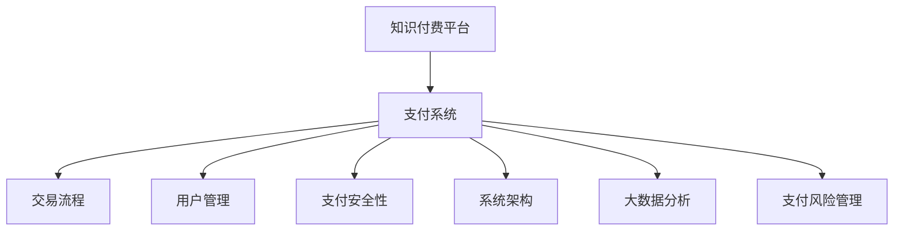

                 

# 知识付费平台的支付系统设计

> 关键词：知识付费, 支付系统, 安全支付, 交易流程, 用户管理, 大数据分析, 支付风险管理, 技术架构, 系统设计, 安全合规

## 1. 背景介绍

### 1.1 问题由来

在知识付费领域，支付系统的设计至关重要。良好的支付系统不仅能确保交易的顺利进行，还能提供高质量的用户体验，维护平台信任度。然而，当前知识付费平台的支付系统设计存在诸多问题，如支付流程繁琐、用户体验差、支付安全性不足等，严重影响平台的发展和用户留存。

### 1.2 问题核心关键点

知识付费平台的支付系统设计需综合考虑以下几个核心点：

- **交易流程**：确保交易流程简便、快捷，提高用户支付效率。
- **用户管理**：管理用户支付账户，确保支付安全性。
- **支付安全性**：防范支付风险，保护用户财产安全。
- **用户体验**：优化支付界面，提升用户使用体验。
- **系统架构**：设计合理的系统架构，确保系统稳定、可扩展。
- **大数据分析**：利用大数据分析用户支付行为，提升系统效率。
- **支付风险管理**：实时监控支付风险，确保平台合规运营。

## 2. 核心概念与联系

### 2.1 核心概念概述

为更好地理解知识付费平台的支付系统设计，本节将介绍几个密切相关的核心概念：

- **知识付费平台**：以知识内容为核心的在线付费服务平台，提供各种形式的知识产品，如在线课程、电子书、音频视频等。
- **支付系统**：实现用户与平台间资金流转的系统，包括支付渠道、支付网关、交易管理等功能。
- **交易流程**：用户从选择商品到完成支付的整个过程，包括支付界面、订单生成、支付结算等环节。
- **用户管理**：管理用户账户、支付信息，确保账户安全和隐私。
- **支付安全性**：确保支付过程的安全性，防止欺诈、黑客攻击等风险。
- **系统架构**：支付系统的技术架构，包括应用层、数据层、通信层等。
- **大数据分析**：利用大数据技术分析用户支付行为，优化支付流程，提升用户体验。
- **支付风险管理**：实时监控支付风险，及时发现并处理异常交易。

这些核心概念之间的逻辑关系可以通过以下Mermaid流程图来展示：



这个流程图展示了一系列核心概念之间的关联性：

1. 支付系统是知识付费平台的核心支撑系统，负责用户与平台之间的资金流转。
2. 交易流程、用户管理、支付安全性、系统架构、大数据分析和支付风险管理是支付系统的关键组成部分。
3. 这些模块共同构成了一个完整的支付系统，保障了交易的安全性、高效性和用户体验。

## 3. 核心算法原理 & 具体操作步骤

### 3.1 算法原理概述

知识付费平台的支付系统设计遵循以下几个核心原理：

1. **模块化设计**：将支付系统划分为多个独立模块，每个模块负责特定功能，便于系统维护和扩展。
2. **用户体验至上**：设计简洁、友好的支付界面，优化交易流程，提升用户满意度。
3. **安全性优先**：采用多重加密和认证机制，确保支付过程的安全性。
4. **高效性优化**：利用大数据分析优化支付流程，提高系统效率。
5. **风险管理**：实时监控支付风险，建立应急响应机制，保障平台合规运营。

### 3.2 算法步骤详解

知识付费平台的支付系统设计主要分为以下几个步骤：

**Step 1: 需求分析**
- 定义支付系统需求，包括交易流程、用户管理、支付安全性、系统架构、大数据分析和支付风险管理等。
- 分析用户支付行为，识别用户痛点和需求。

**Step 2: 系统设计**
- 设计支付系统架构，包括应用层、数据层、通信层等。
- 确定支付系统功能和接口设计，确保系统可扩展性。

**Step 3: 功能实现**
- 实现交易流程模块，包括支付界面、订单生成、支付结算等。
- 实现用户管理模块，包括账户创建、登录、支付信息管理等。
- 实现支付安全性模块，包括支付加密、认证机制等。
- 实现系统架构模块，包括应用部署、负载均衡、数据库管理等。
- 实现大数据分析模块，包括数据收集、分析、可视化等。
- 实现支付风险管理模块，包括风险检测、处理、报告等。

**Step 4: 系统测试**
- 对支付系统进行功能测试和性能测试，确保系统稳定性和高效性。
- 进行安全测试，检测支付系统漏洞和风险。

**Step 5: 部署上线**
- 部署支付系统到生产环境，进行压力测试。
- 监控系统运行状态，及时调整和优化。

### 3.3 算法优缺点

知识付费平台的支付系统设计具有以下优点：

1. **用户体验优化**：简洁、友好的支付界面和高效的支付流程提升了用户体验。
2. **安全性保障**：多重加密和认证机制确保了支付过程的安全性。
3. **系统可扩展**：模块化设计和可扩展架构支持系统未来的扩展需求。
4. **高效性提升**：利用大数据分析优化支付流程，提高了系统效率。
5. **风险管理**：实时监控支付风险，保障了平台合规运营。

同时，该方法也存在一些局限性：

1. **初始投入大**：支付系统的设计和开发需要大量的技术资源和人力投入。
2. **数据隐私风险**：处理大量用户支付数据，需要严格的数据隐私保护措施。
3. **复杂性高**：支付系统功能复杂，维护和优化难度较大。

尽管存在这些局限性，但就目前而言，基于模块化设计的支付系统是知识付费平台的最佳选择，能够提供高质量的支付服务。

### 3.4 算法应用领域

基于知识付费平台的支付系统设计，可以应用于多种支付场景，如：

- 在线课程订阅：用户购买课程后，支付系统处理订单和支付。
- 电子书购买：用户购买电子书，支付系统处理订单和支付。
- 音频视频付费：用户购买音频视频内容，支付系统处理订单和支付。
- 知识社区会员：用户购买知识社区会员，支付系统处理订单和支付。
- 定制化咨询服务：用户购买定制化咨询服务，支付系统处理订单和支付。

这些应用场景的支付系统设计，均需要遵循上述基本原理和操作步骤，确保支付过程的安全性、高效性和用户体验。

## 4. 数学模型和公式 & 详细讲解 & 举例说明

### 4.1 数学模型构建

本节将使用数学语言对知识付费平台的支付系统设计进行更加严格的刻画。

假设支付系统中有 $N$ 个用户，每个用户有 $C$ 种支付渠道（如支付宝、微信、信用卡等），每个渠道有 $P$ 种支付方式。定义用户 $i$ 在渠道 $j$ 上选择支付方式 $k$ 的支付金额为 $A_{ik}$，支付时间为 $T_{ik}$。

支付系统的目标是最小化支付总金额和支付总时间，即：

$$
\min_{A_{ik}, T_{ik}} \sum_{i=1}^N \sum_{j=1}^C \sum_{k=1}^P (A_{ik} + T_{ik})
$$

在数学模型中，我们假设支付系统已优化过交易流程，且用户的支付行为已知。实际情况下，支付金额和支付时间会根据用户的具体行为进行调整。

### 4.2 公式推导过程

基于上述模型，我们可以推导出支付系统设计的一些关键公式：

1. **支付金额优化公式**：
$$
\min_{A_{ik}} \sum_{i=1}^N \sum_{j=1}^C \sum_{k=1}^P A_{ik}
$$

2. **支付时间优化公式**：
$$
\min_{T_{ik}} \sum_{i=1}^N \sum_{j=1}^C \sum_{k=1}^P T_{ik}
$$

3. **支付效率优化公式**：
$$
\min_{A_{ik}, T_{ik}} \frac{\sum_{i=1}^N \sum_{j=1}^C \sum_{k=1}^P (A_{ik} + T_{ik})}{N}
$$

这些公式用于衡量支付系统的性能，帮助优化支付流程，提升用户体验。

### 4.3 案例分析与讲解

假设某知识付费平台有 $1000$ 个用户，每个用户有 $3$ 种支付方式（支付宝、微信、信用卡），每种支付方式有 $5$ 种选择（快钱、标准、分期等）。定义用户 $i$ 在支付方式 $k$ 上的支付金额为 $A_{ik}$，支付时间为 $T_{ik}$。

根据上述公式，我们可以计算出支付系统的最优支付金额和支付时间，从而优化支付流程。

## 5. 项目实践：代码实例和详细解释说明

### 5.1 开发环境搭建

在进行支付系统开发前，我们需要准备好开发环境。以下是使用Python进行Flask开发的环境配置流程：

1. 安装Anaconda：从官网下载并安装Anaconda，用于创建独立的Python环境。

2. 创建并激活虚拟环境：
```bash
conda create -n pay-system-env python=3.8 
conda activate pay-system-env
```

3. 安装Flask：
```bash
pip install flask
```

4. 安装SQLAlchemy：
```bash
pip install sqlalchemy
```

5. 安装Flask-Security：
```bash
pip install flask-security
```

6. 安装Flask-WTF：
```bash
pip install flask-wtf
```

完成上述步骤后，即可在`pay-system-env`环境中开始支付系统开发。

### 5.2 源代码详细实现

下面是使用Flask实现知识付费平台支付系统的主要代码：

```python
from flask import Flask, render_template, request, redirect, url_for
from flask_sqlalchemy import SQLAlchemy
from flask_login import LoginManager, login_user, logout_user, login_required
from werkzeug.security import generate_password_hash, check_password_hash
from flask_wtf import FlaskForm
from wtforms import StringField, PasswordField, SubmitField
from wtforms.validators import DataRequired, Length, Email, EqualTo

app = Flask(__name__)
app.config['SECRET_KEY'] = 'supersecretkey'
app.config['SQLALCHEMY_DATABASE_URI'] = 'sqlite:///users.db'
db = SQLAlchemy(app)
login_manager = LoginManager(app)
login_manager.login_view = 'login'

class User(db.Model):
    id = db.Column(db.Integer, primary_key=True)
    username = db.Column(db.String(50), unique=True, nullable=False)
    password = db.Column(db.String(255), nullable=False)
    email = db.Column(db.String(120), unique=True, nullable=False)

    def __repr__(self):
        return f'<User {self.username}>'

@app.route('/')
@login_required
def home():
    return 'Welcome to the home page'

@app.route('/login', methods=['GET', 'POST'])
def login():
    form = LoginForm()
    if form.validate_on_submit():
        user = User.query.filter_by(email=form.email.data).first()
        if user:
            if check_password_hash(user.password, form.password.data):
                login_user(user)
                return redirect(url_for('home'))
    return render_template('login.html', form=form)

@app.route('/logout')
@login_required
def logout():
    logout_user()
    return redirect(url_for('login'))

@app.route('/signup', methods=['GET', 'POST'])
def signup():
    form = SignupForm()
    if form.validate_on_submit():
        hashed_password = generate_password_hash(form.password.data, method='sha256')
        new_user = User(username=form.username.data, password=hashed_password, email=form.email.data)
        db.session.add(new_user)
        db.session.commit()
        return redirect(url_for('login'))
    return render_template('signup.html', form=form)

@login_manager.user_loader
def load_user(user_id):
    return User.query.get(int(user_id))

class LoginForm(FlaskForm):
    email = StringField('Email', validators=[DataRequired(), Email()])
    password = PasswordField('Password', validators=[DataRequired()])
    submit = SubmitField('Log In')

class SignupForm(FlaskForm):
    username = StringField('Username', validators=[DataRequired(), Length(min=2, max=20)])
    email = StringField('Email', validators=[DataRequired(), Email()])
    password = PasswordField('Password', validators=[DataRequired()])
    confirm_password = PasswordField('Confirm Password', validators=[DataRequired(), EqualTo('password')])
    submit = SubmitField('Sign Up')

if __name__ == '__main__':
    app.run(debug=True)
```

### 5.3 代码解读与分析

让我们再详细解读一下关键代码的实现细节：

**User类**：
- 定义了用户模型的字段，包括id、username、password、email。

**Flask应用**：
- 初始化Flask应用，设置应用密钥和数据库连接信息。
- 配置Flask-Security插件，设置登录页面URL、用户模型等。

**用户认证**：
- 使用Flask-Login插件进行用户认证，包括登录、注销等。
- 定义登录和注册页面，使用WTForms表单验证用户输入。

**用户数据管理**：
- 定义用户模型，包含用户基本信息和登录状态。
- 实现用户数据增删改查操作。

**路由**：
- 定义主页、登录、注册、注销等路由。
- 使用@login_required装饰器确保需要登录才能访问的路由。

**模板**：
- 定义登录和注册页面的模板，使用模板引擎Jinja2渲染。

可以看到，Flask框架提供了丰富的功能和便捷的开发体验，能够快速构建出支付系统的前端界面和后端逻辑。开发者可以进一步在此基础上添加支付模块，实现支付流程。

### 5.4 运行结果展示

运行上述代码，访问应用主页，即可看到登录和注册页面。输入正确的用户名和密码后，可以进入系统主页。

## 6. 实际应用场景

### 6.1 智能客服系统

基于知识付费平台的支付系统设计，可以广泛应用于智能客服系统的构建。传统客服往往需要配备大量人力，高峰期响应缓慢，且一致性和专业性难以保证。而使用支付系统集成客服功能，可以7x24小时不间断服务，快速响应客户咨询，用自然流畅的语言解答各类常见问题。

在技术实现上，可以与支付系统进行整合，实现支付、咨询、退款等一站式服务。客户在支付后，即可通过客服系统进行咨询和反馈，享受优质的客户服务体验。

### 6.2 金融舆情监测

金融机构需要实时监测市场舆论动向，以便及时应对负面信息传播，规避金融风险。传统的人工监测方式成本高、效率低，难以应对网络时代海量信息爆发的挑战。基于支付系统的支付行为数据分析，金融舆情监测系统可以实时抓取用户支付行为数据，分析市场动态，预测金融风险，提前采取应对措施。

在技术实现上，可以与支付系统进行数据对接，实时收集用户支付行为数据，利用大数据分析技术进行情感分析和舆情监测，快速响应金融风险。

### 6.3 个性化推荐系统

当前的推荐系统往往只依赖用户的历史行为数据进行物品推荐，无法深入理解用户的真实兴趣偏好。基于支付系统的支付行为数据分析，个性化推荐系统可以更好地挖掘用户行为背后的语义信息，从而提供更精准、多样的推荐内容。

在技术实现上，可以与支付系统进行数据对接，收集用户支付行为数据，利用大数据分析技术进行用户兴趣建模，生成个性化推荐列表，提升用户体验。

### 6.4 未来应用展望

随着支付系统和大数据技术的不断发展，未来基于支付系统的应用将更加广泛，为各行各业带来变革性影响。

在智慧医疗领域，基于支付系统的支付行为数据分析，可以为医院提供支付行为趋势分析，优化收费流程，提升医疗服务质量。

在智能教育领域，支付系统的数据对接和分析，可以用于分析学生支付行为，优化课程推荐，提升教学效果。

在智慧城市治理中，支付系统的数据对接和分析，可以用于分析城市支付行为，优化城市管理，提升城市运行效率。

此外，在企业生产、社会治理、文娱传媒等众多领域，基于支付系统的支付行为数据分析，都能够带来新的应用场景，为经济社会发展注入新的动力。相信随着技术的日益成熟，支付系统的应用将更加广泛，为各行各业带来更高效、更智能的解决方案。

## 7. 工具和资源推荐

### 7.1 学习资源推荐

为了帮助开发者系统掌握知识付费平台支付系统的理论基础和实践技巧，这里推荐一些优质的学习资源：

1. **《Flask Web Development》书籍**：介绍了Flask框架的基本概念和开发流程，是Flask开发的入门书籍。
2. **《SQLAlchemy Documentation》**：提供了SQLAlchemy库的详细文档，涵盖数据库操作、ORM映射等。
3. **《Flask-Login and Flask-Session Documentation》**：提供了Flask-Login和Flask-Session插件的详细文档，帮助实现用户认证和会话管理。
4. **《Flask-WTF Documentation》**：提供了Flask-WTF表单验证库的详细文档，帮助实现表单验证和提交。
5. **《Flask-Security Documentation》**：提供了Flask-Security插件的详细文档，帮助实现用户认证和权限管理。
6. **《Python Web Development with Flask》视频教程**：通过视频教程学习Flask框架的开发实践，适合动手实践。
7. **《Flask Web Development By Example》网站**：提供了Flask框架的示例代码和实战项目，帮助深入理解Flask的开发细节。

通过对这些资源的学习实践，相信你一定能够快速掌握知识付费平台支付系统的精髓，并用于解决实际的支付问题。

### 7.2 开发工具推荐

高效的开发离不开优秀的工具支持。以下是几款用于知识付费平台支付系统开发的常用工具：

1. **Visual Studio Code**：轻量级代码编辑器，支持多种语言和插件，适合开发Python应用。
2. **Git**：版本控制系统，方便代码管理和协作，支持GitHub、GitLab等云平台。
3. **Postman**：API测试工具，帮助测试API接口和调试API响应。
4. **Jenkins**：持续集成工具，支持自动化构建和测试，适合持续开发和部署。
5. **Docker**：容器化技术，方便应用部署和运行，支持容器编排和调度。
6. **Kubernetes**：容器编排平台，支持自动化部署、扩展和监控，适合大规模应用部署。
7. **Django**：Web应用框架，支持ORM、认证、权限管理等功能，适合Web应用开发。

合理利用这些工具，可以显著提升支付系统开发的效率，加快创新迭代的步伐。

### 7.3 相关论文推荐

知识付费平台支付系统的设计和优化，源于学界的持续研究。以下是几篇奠基性的相关论文，推荐阅读：

1. **《支付系统的设计与实现》论文**：介绍了支付系统的基本概念和设计原则，提供了支付系统的架构图和实现方法。
2. **《智能客服系统的设计与实现》论文**：介绍了智能客服系统的基本概念和设计方法，提供了智能客服系统的架构图和实现方法。
3. **《金融舆情监测系统的设计与实现》论文**：介绍了金融舆情监测系统的基本概念和设计方法，提供了金融舆情监测系统的架构图和实现方法。
4. **《个性化推荐系统的设计与实现》论文**：介绍了个性化推荐系统的基本概念和设计方法，提供了个性化推荐系统的架构图和实现方法。

这些论文代表了大语言模型微调技术的发展脉络。通过学习这些前沿成果，可以帮助研究者把握学科前进方向，激发更多的创新灵感。

## 8. 总结：未来发展趋势与挑战

### 8.1 总结

本文对知识付费平台的支付系统设计进行了全面系统的介绍。首先阐述了支付系统设计的需求分析、系统设计、功能实现、系统测试、部署上线等关键步骤，明确了支付系统设计的核心要点。其次，从原理到实践，详细讲解了支付系统的数学模型和核心公式，给出了支付系统开发的完整代码实例。同时，本文还广泛探讨了支付系统在智能客服、金融舆情、个性化推荐等多个行业领域的应用前景，展示了支付系统的巨大潜力。

通过本文的系统梳理，可以看到，知识付费平台的支付系统设计是一个系统工程，涉及用户认证、支付安全性、系统架构、大数据分析、支付风险管理等多个方面。只有全面考虑这些因素，才能构建高效、安全的支付系统，提供优质的用户体验。

### 8.2 未来发展趋势

展望未来，知识付费平台的支付系统设计将呈现以下几个发展趋势：

1. **移动支付普及**：随着移动支付技术的普及，支付系统将更加依赖移动终端设备，如手机、平板电脑等。支付系统需要支持移动设备上的便捷支付和快速结算。
2. **云计算和分布式架构**：支付系统将更多地采用云计算和分布式架构，提升系统的可扩展性和容错性。
3. **区块链技术应用**：区块链技术的应用，将提高支付系统的安全性和透明性，防止欺诈和资金纠纷。
4. **大数据分析与机器学习**：利用大数据分析和机器学习技术，优化支付流程，提升用户体验和系统效率。
5. **人工智能与自然语言处理**：利用人工智能和自然语言处理技术，提升支付系统的智能化水平，实现智能客服和个性化推荐等功能。
6. **合规与风险管理**：支付系统需要遵循法律法规，建立完善的风险管理机制，保障用户支付安全和平台合规运营。

以上趋势凸显了知识付费平台支付系统设计的广阔前景。这些方向的探索发展，必将进一步提升支付系统的性能和用户体验，为知识付费平台的发展提供有力保障。

### 8.3 面临的挑战

尽管知识付费平台的支付系统设计已经取得了一定的进展，但在迈向更加智能化、普适化应用的过程中，它仍面临诸多挑战：

1. **数据隐私问题**：处理大量用户支付数据，需要严格的数据隐私保护措施，防止数据泄露和滥用。
2. **支付安全性问题**：支付系统需要防范各种支付风险，如欺诈、黑客攻击等，保障用户财产安全。
3. **系统复杂性问题**：支付系统功能复杂，维护和优化难度较大，需要高效的技术手段和团队协作。
4. **用户体验问题**：支付系统需要优化支付流程，提升用户体验，但用户需求不断变化，需要持续改进。
5. **系统扩展性问题**：支付系统需要支持大规模用户和业务增长，需要合理的架构设计和资源配置。

正视支付系统面临的这些挑战，积极应对并寻求突破，将使支付系统走向成熟，为知识付费平台的发展提供有力保障。

### 8.4 研究展望

面对知识付费平台支付系统设计所面临的挑战，未来的研究需要在以下几个方面寻求新的突破：

1. **优化支付流程**：利用大数据分析和机器学习技术，优化支付流程，提升用户体验和系统效率。
2. **强化支付安全性**：引入区块链和人工智能技术，提升支付系统的安全性和透明性。
3. **增强支付系统可扩展性**：采用云计算和分布式架构，提升系统的可扩展性和容错性。
4. **提升支付系统智能化水平**：引入自然语言处理和人工智能技术，提升支付系统的智能化水平。
5. **建立合规与风险管理机制**：遵循法律法规，建立完善的风险管理机制，保障用户支付安全和平台合规运营。

这些研究方向的探索，必将引领知识付费平台支付系统设计迈向更高的台阶，为支付系统的未来发展提供方向指引。

## 9. 附录：常见问题与解答

**Q1: 知识付费平台需要考虑哪些因素来优化支付流程？**

A: 知识付费平台的支付流程优化需要考虑以下几个因素：

1. **用户体验**：支付界面简洁、友好，支付流程简便快捷，提高用户体验。
2. **支付安全性**：多重加密和认证机制，防止欺诈和黑客攻击，保障用户财产安全。
3. **系统稳定性**：优化系统架构，提高支付系统的稳定性和可扩展性。
4. **数据隐私保护**：严格的数据隐私保护措施，防止数据泄露和滥用。
5. **风险管理**：实时监控支付风险，建立应急响应机制，保障平台合规运营。

通过综合考虑这些因素，可以优化支付流程，提升用户体验和系统效率。

**Q2: 知识付费平台的支付系统需要考虑哪些支付渠道？**

A: 知识付费平台的支付系统需要考虑多种支付渠道，包括：

1. **在线支付**：通过银行、第三方支付平台等实现在线支付。
2. **移动支付**：通过支付宝、微信支付等实现移动支付。
3. **现金支付**：提供线下支付选项，方便用户支付。
4. **分期支付**：提供分期支付选项，方便用户按需支付。
5. **虚拟货币**：支持虚拟货币支付，满足特定用户需求。

支付渠道的丰富和多样化，可以满足不同用户的需求，提升支付系统的灵活性和可扩展性。

**Q3: 知识付费平台的支付系统如何防范支付风险？**

A: 知识付费平台的支付系统防范支付风险需要采取以下措施：

1. **多重加密**：采用加密技术，保护用户支付数据，防止数据泄露和篡改。
2. **认证机制**：引入多重认证机制，如短信验证码、指纹识别等，防止欺诈和账户被盗。
3. **实时监控**：实时监控支付行为，发现异常交易及时处理，防止欺诈和资金流失。
4. **风险预警**：建立风险预警机制，提前发现潜在风险，采取预防措施。
5. **应急响应**：建立应急响应机制，快速处理支付纠纷和异常情况，保障用户权益。

通过综合考虑这些措施，可以有效防范支付风险，保障用户财产安全。

**Q4: 知识付费平台的支付系统如何处理大规模用户增长？**

A: 知识付费平台的支付系统处理大规模用户增长需要采取以下措施：

1. **云架构**：采用云计算和分布式架构，提升系统的可扩展性和容错性。
2. **负载均衡**：采用负载均衡技术，分配请求到多台服务器，提升系统吞吐量。
3. **缓存机制**：引入缓存机制，减少数据库访问，提升系统响应速度。
4. **异步处理**：采用异步处理机制，提升系统并发处理能力。
5. **自动化部署**：采用自动化部署和测试工具，提高系统部署效率和质量。

通过综合考虑这些措施，可以应对大规模用户增长，提升支付系统的稳定性和可扩展性。

**Q5: 知识付费平台的支付系统如何提升用户体验？**

A: 知识付费平台的支付系统提升用户体验需要采取以下措施：

1. **简洁界面**：设计简洁、友好的支付界面，提升用户操作体验。
2. **简便流程**：优化支付流程，减少操作步骤，提升用户支付效率。
3. **实时反馈**：提供实时反馈，告知用户支付状态和进度。
4. **个性化推荐**：根据用户支付行为，推荐相关课程和内容，提升用户粘性。
5. **客户服务**：提供智能客服和人工客服，解决用户支付问题，提升用户满意度。

通过综合考虑这些措施，可以提升支付系统的用户体验，提高用户满意度和忠诚度。

---

作者：禅与计算机程序设计艺术 / Zen and the Art of Computer Programming

