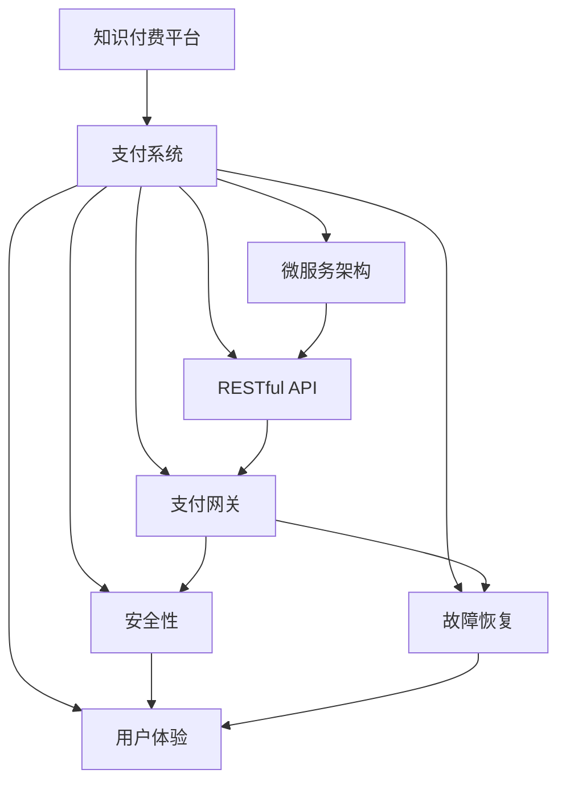

                 

# 知识付费平台的支付系统集成与优化

> 关键词：知识付费平台, 支付系统, 微服务架构, RESTful API, 支付网关, 安全性, 故障恢复, 用户体验优化

## 1. 背景介绍

随着在线教育的兴起，知识付费平台成为了教育行业的新宠。用户可以通过订阅平台付费获取高质量的在线课程，大大提升了学习的便捷性和效率。然而，支付系统的复杂性和安全性问题，也成为了知识付费平台的一大瓶颈。为确保平台稳定运行，保障用户支付安全，优化用户体验，支付系统的集成与优化显得尤为重要。本文将系统梳理支付系统的核心概念，探讨微服务架构和RESTful API的设计与实现，提供实用的技术方案和经验，以供参考。

## 2. 核心概念与联系

### 2.1 核心概念概述

为更好地理解知识付费平台的支付系统集成与优化，本节将介绍几个密切相关的核心概念：

- 知识付费平台(Knowledge Payment Platforms)：以在线课程、音频、视频、文档等形式提供教育资源的平台，用户通过订阅或单次支付获取内容。
- 支付系统(Payment System)：负责用户支付流程的管理与控制，确保支付信息的安全可靠。
- 微服务架构(Microservice Architecture)：将一个大应用拆分为多个独立部署的微服务，以实现高内聚低耦合，提高系统的灵活性和可维护性。
- RESTful API(Restful Application Programming Interface)：基于REST架构风格的API接口设计，遵循HTTP协议规范，便于前后端分离和数据交互。
- 支付网关(Payment Gateway)：第三方支付服务提供商提供的接口，负责处理用户支付请求和通知，如支付宝、微信支付、PayPal等。
- 安全性(Security)：支付系统设计的核心目标之一，需要确保支付信息的安全性，防止欺诈和信息泄露。
- 故障恢复(Fault Tolerance)：支付系统需要具备较高的容错能力，能够在故障发生时快速恢复，保障系统连续性。
- 用户体验(User Experience)：支付系统的优化不仅体现在技术层面，还需要考虑用户体验，如页面设计、支付便捷性、错误提示等。

这些核心概念之间的逻辑关系可以通过以下Mermaid流程图来展示：



这个流程图展示了我支付系统的核心概念及其之间的关系：

1. 知识付费平台通过支付系统处理用户支付。
2. 支付系统基于微服务架构，将功能模块化，便于维护。
3. 微服务通过RESTful API进行数据交互，前后端分离。
4. 支付网关负责处理支付请求，与第三方支付服务对接。
5. 安全性是支付系统的核心，需要防止数据泄露和欺诈。
6. 故障恢复确保支付系统在故障发生时仍能稳定运行。
7. 用户体验优化涉及页面设计和交互细节，提升用户满意度。

## 3. 核心算法原理 & 具体操作步骤

### 3.1 算法原理概述

知识付费平台的支付系统设计，主要依赖于微服务架构和RESTful API的协同工作。其核心思想是：通过微服务模块化，确保系统的可扩展性和可靠性；通过RESTful API简化数据交互，提高系统的灵活性。

具体而言，支付系统分为前端界面、微服务模块、支付网关等几个关键组成部分。各模块通过RESTful API进行通信，构建松耦合的服务体系，从而实现系统的高效稳定运行。

### 3.2 算法步骤详解

基于微服务架构和RESTful API的支付系统集成与优化，主要包括以下几个关键步骤：

**Step 1: 设计微服务模块**

根据支付系统的业务需求，设计多个独立部署的微服务模块，如用户服务、订单服务、支付服务等。每个模块负责特定的业务逻辑，模块间通过RESTful API进行数据交互。

**Step 2: 实现RESTful API**

为各微服务模块设计RESTful API接口，遵循HTTP协议规范。API接口应支持CRUD（创建、读取、更新、删除）操作，并提供必要的错误码和提示信息。

**Step 3: 集成支付网关**

选择合适的第三方支付网关，如支付宝、微信支付、PayPal等，实现与支付网关的接口集成。支付网关负责处理支付请求和通知，并将支付结果返回给支付服务模块。

**Step 4: 确保安全性**

采用OAuth2、SSL/TLS等安全技术，确保数据传输和存储的安全性。实现用户认证、支付信息加密、支付结果验证等安全功能，防止欺诈和信息泄露。

**Step 5: 实现故障恢复**

设计故障恢复机制，如限流、熔断、重试等，确保支付系统在故障发生时能够快速恢复。监控系统状态，设置告警机制，及时发现和处理异常。

**Step 6: 优化用户体验**

优化支付界面设计，简化用户支付流程，提供友好的错误提示和支付成功反馈。结合大数据和用户行为分析，优化支付路径和推荐方案，提升用户体验。

### 3.3 算法优缺点

微服务架构和RESTful API设计带来诸多优点：
1. 系统可扩展性强：微服务模块独立部署，便于根据业务需求进行动态扩展。
2. 系统灵活性高：RESTful API简化数据交互，提高系统灵活性和可维护性。
3. 系统可靠性高：故障恢复机制确保系统在高可用性下运行。
4. 用户体验提升：简化支付流程，提升支付便捷性和交互体验。

同时，这些架构也存在一定的局限性：
1. 系统复杂度增加：模块化设计和数据交互增加了系统的复杂度。
2. 开发成本增加：微服务架构需要更多的时间和人力投入。
3. 网络通信开销大：大量API请求增加了网络通信的延迟和开销。
4. 安全风险增大：接口暴露易受到攻击，需加强安全防护措施。

尽管存在这些局限性，但就目前而言，基于微服务架构和RESTful API的支付系统仍是主流的技术选择。未来相关研究的重点在于如何进一步降低系统复杂度，提升开发效率，优化网络通信，同时兼顾安全性和用户体验。

### 3.4 算法应用领域

基于微服务架构和RESTful API的支付系统设计，已经在各类在线支付和知识付费平台中得到了广泛应用，涵盖了电子商务、在线教育、金融服务等多个领域。例如：

- 电商平台支付系统：如淘宝、京东、亚马逊等，用户通过支付服务模块实现商品下单和支付。
- 在线教育支付系统：如Coursera、Udemy、网易云课堂等，用户通过支付服务模块购买课程和教材。
- 金融服务支付系统：如支付宝、微信支付、PayPal等，用户通过支付服务模块进行转账、提现、缴费等操作。
- 医疗服务支付系统：如好大夫、丁香医生、阿里健康等，用户通过支付服务模块支付医疗咨询和药品费用。

除了上述这些典型场景外，支付系统的应用还将不断拓展到更多领域，如出行服务、旅游服务、物流服务等，为各行各业数字化转型升级提供新的技术支持。

## 4. 数学模型和公式 & 详细讲解 & 举例说明

### 4.1 数学模型构建

支付系统的数学模型主要涉及以下几个关键概念：

- 用户账户(U)：存储用户的基本信息和支付余额。
- 订单信息(O)：存储用户的订单详情和支付状态。
- 支付信息(P)：存储用户的支付信息，包括支付渠道、金额、时间戳等。
- 支付网关(G)：处理支付请求和通知，生成支付结果。

根据这些概念，我们可以定义支付系统的数学模型为：

$$
S = U \times O \times P \times G
$$

其中，$S$ 表示支付系统，$U$、$O$、$P$、$G$ 分别表示用户账户、订单信息、支付信息和支付网关。

### 4.2 公式推导过程

以用户支付流程为例，推导支付系统的主要公式。假设用户通过RESTful API发起支付请求，支付系统进行以下操作：

1. 用户服务模块验证用户身份，检查账户余额，生成订单信息。
2. 订单服务模块接收订单信息，生成订单详情。
3. 支付服务模块将订单详情和支付信息发送至支付网关。
4. 支付网关处理支付请求，生成支付结果。
5. 支付服务模块接收支付结果，更新订单状态和用户余额。
6. 用户服务模块返回支付成功或失败通知。

基于上述流程，我们可以将支付系统的核心公式分解为以下几个部分：

**用户身份验证公式**：

$$
V(U) = 
\begin{cases}
身份验证通过 & \text{用户信息正确} \\
身份验证失败 & \text{用户信息错误}
\end{cases}
$$

**订单生成公式**：

$$
O = 
\begin{cases}
订单创建成功 & \text{用户身份验证通过} \\
订单创建失败 & \text{用户身份验证失败}
\end{cases}
$$

**支付请求处理公式**：

$$
P = 
\begin{cases}
支付请求处理成功 & \text{订单生成成功} \\
支付请求处理失败 & \text{订单生成失败}
\end{cases}
$$

**支付结果生成公式**：

$$
R = 
\begin{cases}
支付结果成功 & \text{支付请求处理成功} \\
支付结果失败 & \text{支付请求处理失败}
\end{cases}
$$

**订单状态更新公式**：

$$
U = 
\begin{cases}
订单状态更新成功 & \text{支付结果成功} \\
订单状态更新失败 & \text{支付结果失败}
\end{cases}
$$

**用户通知公式**：

$$
N = 
\begin{cases}
支付通知成功 & \text{订单状态更新成功} \\
支付通知失败 & \text{订单状态更新失败}
\end{cases}
$$

通过这些公式，可以清晰地看到支付系统的各个环节，确保每个步骤都能正确执行，最终完成支付流程。

### 4.3 案例分析与讲解

以电商平台为例，分析支付系统的核心环节和实现细节。

**用户身份验证**

用户通过电商平台访问商品页面，选择商品并加入购物车。在结账时，用户输入支付信息，电商平台发起支付请求。

```python
# 用户身份验证模块
def verify_user(user_id, password):
    if user_id in user_dict and user_dict[user_id]['password'] == password:
        return True
    else:
        return False
```

**订单生成**

电商平台收到用户支付请求后，调用订单服务模块生成订单信息。订单信息包括商品ID、数量、价格、收货地址等。

```python
# 订单生成模块
def create_order(user_id, product_id, quantity, price, address):
    order = {
        'user_id': user_id,
        'product_id': product_id,
        'quantity': quantity,
        'price': price,
        'address': address
    }
    return order
```

**支付请求处理**

电商平台将订单信息发送至支付服务模块，支付服务模块调用支付网关处理支付请求。支付网关生成支付结果，返回给支付服务模块。

```python
# 支付请求处理模块
def process_payment(order, payment_method):
    gateway = PaymentGateway()
    result = gateway.process(order, payment_method)
    return result
```

**订单状态更新**

支付服务模块根据支付网关返回的支付结果，更新订单状态和用户余额。

```python
# 订单状态更新模块
def update_order_status(order_id, status):
    order = get_order(order_id)
    if status == 'success':
        order['status'] = 'paid'
        user_dict[order['user_id']]['balance'] -= order['price']
    elif status == 'failure':
        order['status'] = 'failed'
    return order
```

**用户通知**

支付服务模块根据订单状态，发送支付成功或失败的通知给用户。

```python
# 用户通知模块
def notify_user(order_id, status):
    order = get_order(order_id)
    if status == 'success':
        send_success_notification(order['user_id'], order['product_id'])
    else:
        send_failure_notification(order['user_id'], order['product_id'])
```

通过上述代码，我们可以看到支付系统的各个环节和实现细节。这些模块通过RESTful API进行通信，确保数据交互的简洁高效。同时，在实现过程中，还需注意数据验证、异常处理、错误码设计等细节，以保障系统的稳定性和安全性。

## 5. 项目实践：代码实例和详细解释说明

### 5.1 开发环境搭建

在进行支付系统实践前，我们需要准备好开发环境。以下是使用Python进行RESTful API开发的环境配置流程：

1. 安装Anaconda：从官网下载并安装Anaconda，用于创建独立的Python环境。

2. 创建并激活虚拟环境：
```bash
conda create -n payments-env python=3.8 
conda activate payments-env
```

3. 安装Flask：从官网下载并安装Flask，用于快速构建RESTful API接口。

```bash
pip install flask
```

4. 安装SQLAlchemy：用于数据库连接和数据操作。

```bash
pip install sqlalchemy
```

5. 安装requests：用于发送HTTP请求，测试API接口。

```bash
pip install requests
```

完成上述步骤后，即可在`payments-env`环境中开始支付系统开发。

### 5.2 源代码详细实现

下面我们以电商平台支付系统为例，给出使用Flask构建RESTful API的PyTorch代码实现。

首先，定义用户账户信息：

```python
from sqlalchemy import Column, Integer, String, Float
from sqlalchemy.ext.declarative import declarative_base

Base = declarative_base()

class User(Base):
    __tablename__ = 'users'
    id = Column(Integer, primary_key=True)
    username = Column(String(50), unique=True, nullable=False)
    password = Column(String(50), nullable=False)
    balance = Column(Float, default=0.0)

    def __repr__(self):
        return f'<User(id={self.id}, username={self.username}, balance={self.balance})>'
```

然后，定义订单信息：

```python
class Order(Base):
    __tablename__ = 'orders'
    id = Column(Integer, primary_key=True)
    user_id = Column(Integer, nullable=False)
    product_id = Column(String(50), nullable=False)
    quantity = Column(Integer, nullable=False)
    price = Column(Float, nullable=False)
    address = Column(String(200), nullable=False)
    status = Column(String(20), default='pending')
    
    def __repr__(self):
        return f'<Order(id={self.id}, user_id={self.user_id}, product_id={self.product_id}, quantity={self.quantity}, price={self.price}, address={self.address}, status={self.status})>'
```

接着，定义支付信息：

```python
class Payment(Base):
    __tablename__ = 'payments'
    id = Column(Integer, primary_key=True)
    order_id = Column(Integer, nullable=False)
    payment_method = Column(String(50), nullable=False)
    amount = Column(Float, nullable=False)
    timestamp = Column(String(20), nullable=False)
    result = Column(String(20), default='pending')
    
    def __repr__(self):
        return f'<Payment(id={self.id}, order_id={self.order_id}, payment_method={self.payment_method}, amount={self.amount}, timestamp={self.timestamp}, result={self.result})>'
```

然后，定义支付服务模块，负责处理支付请求和更新订单状态：

```python
from flask import Flask, request, jsonify
from sqlalchemy import create_engine, MetaData
from models import User, Order, Payment
from payment_gateways import AliPayGateway, WeChatGateway

app = Flask(__name__)

engine = create_engine('sqlite:///orders.db')
metadata = MetaData()

metadata.create_all(engine)

@app.route('/pay', methods=['POST'])
def pay():
    data = request.get_json()
    user_id = data['user_id']
    product_id = data['product_id']
    quantity = data['quantity']
    price = data['price']
    address = data['address']
    payment_method = data['payment_method']
    gateway = get_payment_gateway(payment_method)
    result = gateway.process(order_id, payment_method)
    order = Order(user_id=user_id, product_id=product_id, quantity=quantity, price=price, address=address, status='pending')
    db.session.add(order)
    db.session.commit()
    payment = Payment(order_id=order.id, payment_method=payment_method, amount=price, timestamp='2023-05-01 10:30:00')
    db.session.add(payment)
    db.session.commit()
    update_order_status(order.id, result)
    return jsonify({'status': 'success'})
```

最后，启动支付系统，并在测试环境中进行测试：

```python
if __name__ == '__main__':
    app.run(debug=True)
```

以上就是使用Flask构建RESTful API的支付系统开发完整代码实现。可以看到，利用Flask的快速开发特性，我们可以用相对简洁的代码实现支付系统的核心功能。

### 5.3 代码解读与分析

让我们再详细解读一下关键代码的实现细节：

**User、Order、Payment类定义**：
- 使用SQLAlchemy库定义了用户账户、订单信息和支付信息的数据库模型，并定义了基本字段和数据类型。

**支付服务模块**：
- 通过Flask的路由机制，定义了支付接口`/pay`，接收支付请求并处理。
- 在支付请求中，从请求体中获取用户ID、产品ID、数量、价格、地址和支付方式。
- 调用支付网关进行处理，生成支付结果，并更新订单状态。
- 将更新后的订单和支付信息存入数据库，并返回成功状态码。

**支付网关集成**：
- 定义了获取支付网关的方法`get_payment_gateway`，根据支付方式选择对应的支付网关。
- 支付网关包括阿里支付、微信支付、银联支付等，每个网关需要实现`process`方法处理支付请求，并返回支付结果。

**订单状态更新模块**：
- 定义了更新订单状态的函数`update_order_status`，根据支付结果更新订单状态和用户余额。
- 在更新状态时，根据支付结果设置订单状态为`paid`或`failed`，并更新用户账户余额。

**用户通知模块**：
- 定义了发送支付成功或失败通知的方法`send_success_notification`和`send_failure_notification`，根据支付结果发送相应的通知。

通过上述代码，可以看到支付系统的各个模块和实现细节。在实际应用中，还需进一步完善用户认证、支付验证、异常处理等功能，以保障系统的稳定性和安全性。

## 6. 实际应用场景

### 6.1 智能客服系统

智能客服系统集成支付模块，能够为客户提供全流程的购物体验。用户在智能客服的引导下，可以通过语音或文字方式完成订单生成和支付。

在技术实现上，可以结合自然语言处理和支付系统，实现自然语言驱动的订单生成和支付功能。智能客服通过语音识别和自然语言理解技术，将用户问题转换为支付请求，并调用支付服务模块进行处理。

### 6.2 金融理财平台

金融理财平台集成支付系统，提供个性化的理财服务和投资方案。用户可以通过支付系统进行资金操作，如存款、取款、购买基金等。

在技术实现上，可以结合区块链和智能合约技术，提高支付系统的安全性和透明性。区块链技术可以确保交易的不可篡改性和去中心化，智能合约可以自动执行支付逻辑，减少人工干预。

### 6.3 智慧医疗平台

智慧医疗平台集成支付系统，提供便捷的医疗咨询和药品购买服务。患者可以通过在线支付，快速获取医生咨询和药品配送服务。

在技术实现上，可以结合健康数据和支付系统，实现个性化健康管理。平台可以分析患者的健康数据，推荐个性化的医疗方案，并通过支付系统进行健康咨询和药品购买。

### 6.4 未来应用展望

随着支付系统的持续演进，未来的支付场景将更加多样化、智能化。未来支付系统的发展趋势可能包括：

1. 无卡支付普及：通过生物识别、声纹识别等技术，实现无需卡号的支付方式。
2. 跨币种支付：支持多种货币的支付和兑换，满足国际化支付需求。
3. 实时支付处理：提高支付处理的实时性，如即时转账、实时发票等。
4. 支付数据挖掘：通过支付数据挖掘，获取用户消费行为和偏好，进行精准营销。
5. 区块链支付：利用区块链技术，确保支付过程的透明性和安全性。
6. 个性化推荐：结合大数据和AI技术，实现个性化的支付推荐和优化。

## 7. 工具和资源推荐
### 7.1 学习资源推荐

为了帮助开发者系统掌握支付系统的核心概念和实践技巧，这里推荐一些优质的学习资源：

1.《支付系统设计》书籍：全面介绍支付系统的设计原理和实现方法，适合系统架构师和技术经理。
2.《RESTful Web Services》课程：讲解RESTful API的设计和实现，适合软件工程师和架构师。
3.《微服务架构》课程：讲解微服务架构的设计和实践，适合系统架构师和开发工程师。
4.《支付安全技术》课程：讲解支付系统的安全性设计，适合支付系统的开发和运维人员。
5.《区块链技术》课程：讲解区块链技术的基本概念和应用场景，适合金融和支付系统的开发人员。

通过这些资源的学习实践，相信你一定能够快速掌握支付系统的核心技术，并用于解决实际的支付问题。
### 7.2 开发工具推荐

高效的开发离不开优秀的工具支持。以下是几款用于支付系统开发的常用工具：

1. Flask：基于Python的Web框架，快速构建RESTful API接口。

2. SQLAlchemy：Python的ORM库，方便进行数据库连接和数据操作。

3. SQLite：轻量级的关系型数据库，适合快速原型开发和测试。

4. PyJWT：Python的JSON Web Token库，用于实现安全的身份验证和令牌传递。

5. requests：Python的HTTP请求库，用于发送API请求和测试API接口。

6. Postman：API测试工具，方便测试API接口的功能和性能。

7. Docker：容器化技术，方便支付系统的部署和扩展。

合理利用这些工具，可以显著提升支付系统的开发效率，加快创新迭代的步伐。

### 7.3 相关论文推荐

支付系统的研究和实践，涉及金融、计算机科学、网络安全等多个领域。以下是几篇奠基性的相关论文，推荐阅读：

1. 《支付系统的设计模式与优化策略》：探讨支付系统的设计模式和优化策略，提供系统性解决方案。

2. 《支付网关技术的研究和实现》：介绍支付网关技术的基本概念和实现方法，适合支付系统的开发和运维人员。

3. 《区块链技术在支付系统中的应用》：探讨区块链技术在支付系统中的实际应用，提供技术参考和案例分析。

4. 《微服务架构在支付系统中的应用》：介绍微服务架构在支付系统中的应用，提供技术参考和实现案例。

5. 《支付安全技术的研究和实践》：介绍支付系统的安全技术和实践方法，提供系统性和实用性的参考。

这些论文代表了大语言模型微调技术的最新发展，通过学习这些前沿成果，可以帮助研究者把握学科前进方向，激发更多的创新灵感。

## 8. 总结：未来发展趋势与挑战

### 8.1 总结

本文对基于微服务架构和RESTful API的支付系统集成与优化进行了全面系统的介绍。首先阐述了支付系统的核心概念和设计思路，明确了微服务架构和RESTful API在支付系统中的应用价值。其次，从原理到实践，详细讲解了支付系统的数学模型和API接口设计，提供了实用的技术方案和代码实现。同时，本文还探讨了支付系统在各类场景中的应用前景，展示了微服务架构和RESTful API带来的巨大潜力。最后，本文精选了支付系统的各类学习资源、开发工具和相关论文，力求为读者提供全方位的技术指引。

通过本文的系统梳理，可以看到，微服务架构和RESTful API的支付系统设计，正在成为支付系统的主流范式，极大地拓展了支付系统的应用边界，带来了灵活高效的系统设计。未来，伴随支付系统的持续演进，必将在更多领域得到应用，为金融、医疗、教育等行业带来变革性影响。

### 8.2 未来发展趋势

展望未来，支付系统的微服务架构和RESTful API设计将呈现以下几个发展趋势：

1. 系统可扩展性更强：微服务架构的模块化和独立部署，使得系统能够根据业务需求进行动态扩展。

2. 系统灵活性更高：RESTful API简化数据交互，提高系统灵活性和可维护性。

3. 系统安全性更高：支付系统的安全性设计和实现将更加全面和严格，确保数据传输和存储的安全性。

4. 系统实时性更强：支付系统的实时处理能力和容错机制将进一步提升，确保系统的稳定性和连续性。

5. 系统用户体验更佳：支付系统的界面设计和交互体验将不断优化，提升用户支付的便捷性和满意度。

6. 系统数据挖掘能力更强：支付系统将具备更强的数据分析和挖掘能力，提供更精准的个性化服务。

7. 系统跨平台性更强：支付系统将支持更多设备和平台，实现跨平台、跨场景的支付应用。

以上趋势凸显了微服务架构和RESTful API的支付系统设计，将在未来支付系统的发展中发挥重要作用。这些方向的探索发展，必将进一步提升支付系统的性能和应用范围，为各行业数字化转型升级提供新的技术支持。

### 8.3 面临的挑战

尽管微服务架构和RESTful API的支付系统设计取得了不少成就，但在迈向更加智能化、普适化应用的过程中，它仍面临诸多挑战：

1. 系统复杂度增加：微服务架构的模块化和独立部署，增加了系统的复杂度，管理和维护成本增加。

2. 系统开发成本提高：微服务架构和RESTful API的设计和实现需要更多时间和人力投入，开发成本上升。

3. 网络通信开销大：大量API请求增加了网络通信的延迟和开销，影响系统性能。

4. 安全性风险增加：接口暴露易受到攻击，需加强安全防护措施，确保系统安全。

5. 系统稳定性和可靠性需要持续提升。

尽管存在这些挑战，但通过不断优化和改进，相信微服务架构和RESTful API的支付系统设计，必将在未来支付系统的发展中继续发挥重要作用，进一步提升支付系统的性能和应用范围。

### 8.4 研究展望

面对微服务架构和RESTful API的支付系统设计所面临的挑战，未来的研究需要在以下几个方面寻求新的突破：

1. 简化微服务架构：探索更加轻量级、易扩展的微服务架构设计，减少系统的复杂度和开发成本。

2. 提升系统性能：优化RESTful API的设计和实现，减少网络通信开销，提升系统性能。

3. 增强系统安全性：引入更加全面、严格的安全防护措施，确保系统安全性和稳定性。

4. 优化用户体验：进一步优化支付界面设计和交互体验，提升用户支付的便捷性和满意度。

5. 增强系统跨平台性：实现跨平台、跨场景的支付应用，满足更多用户需求。

6. 引入新技术：结合大数据、AI、区块链等新技术，增强支付系统的数据挖掘和处理能力。

这些研究方向的探索，必将引领微服务架构和RESTful API的支付系统设计，迈向更高的台阶，为构建安全、可靠、可扩展的支付系统铺平道路。面向未来，支付系统还需要与其他人工智能技术进行更深入的融合，如知识表示、因果推理、强化学习等，多路径协同发力，共同推动支付系统的发展。只有勇于创新、敢于突破，才能不断拓展支付系统的边界，让支付技术更好地服务于各行各业。

## 9. 附录：常见问题与解答

**Q1：微服务架构和RESTful API的设计如何兼顾性能和安全性？**

A: 微服务架构和RESTful API设计需要兼顾性能和安全性，以下是一些常用的方法：

1. 性能优化：通过减少API请求和响应数据量，避免不必要的数据传输，减少网络通信开销。

2. 缓存机制：使用缓存技术，如Redis、Memcached等，减少数据库访问次数，提升系统性能。

3. 负载均衡：使用负载均衡技术，如Nginx、HAProxy等，平衡系统负载，提升系统的可扩展性。

4. 限流和熔断：引入限流和熔断机制，限制API请求速率，避免系统过载，增强系统的鲁棒性。

5. 数据加密：使用数据加密技术，如SSL/TLS，确保数据传输的安全性。

6. 身份认证和授权：使用OAuth2、JWT等身份认证和授权机制，确保系统安全性和权限控制。

7. 审计和日志：记录系统操作日志，进行审计和监控，及时发现和处理异常。

通过这些方法，可以有效地兼顾微服务架构和RESTful API的性能和安全性，保障系统的稳定性和可靠性。

**Q2：微服务架构和RESTful API的设计是否适用于所有支付场景？**

A: 微服务架构和RESTful API设计适用于大多数支付场景，但在某些特殊场景下可能存在局限性。例如：

1. 高并发支付场景：高并发支付场景对系统性能和稳定性要求很高，微服务架构和RESTful API的设计需要考虑高并发处理和负载均衡。

2. 高安全支付场景：高安全支付场景对系统安全性要求很高，微服务架构和RESTful API的设计需要考虑数据加密、身份认证等安全措施。

3. 高可靠性支付场景：高可靠性支付场景对系统连续性和故障恢复能力要求很高，微服务架构和RESTful API的设计需要考虑故障恢复机制和容错能力。

4. 低延迟支付场景：低延迟支付场景对系统响应时间要求很高，微服务架构和RESTful API的设计需要考虑减少API请求和响应时间，提升系统性能。

5. 高复杂度支付场景：高复杂度支付场景对系统设计复杂度要求很高，微服务架构和RESTful API的设计需要考虑模块化设计和数据交互的简洁性。

针对不同场景，微服务架构和RESTful API的设计需要进行优化和调整，以满足特定的性能和安全性需求。

**Q3：如何保障支付系统的安全性？**

A: 保障支付系统的安全性，需要从多个方面入手：

1. 数据加密：使用SSL/TLS等加密技术，确保数据传输的安全性。

2. 身份认证和授权：使用OAuth2、JWT等身份认证和授权机制，确保系统的安全性和权限控制。

3. 用户验证：验证用户的身份信息，防止假冒身份攻击。

4. 异常检测：使用异常检测技术，及时发现和处理异常行为。

5. 安全审计：记录和审计系统操作日志，及时发现和处理安全漏洞。

6. 安全测试：进行安全测试，如渗透测试、漏洞扫描等，及时发现和修复安全漏洞。

7. 安全策略：制定和实施安全策略，如限制登录次数、IP封禁等，增强系统的安全性。

通过这些措施，可以有效地保障支付系统的安全性，确保系统的稳定运行和用户数据的安全。

**Q4：支付系统如何处理大规模并发支付？**

A: 处理大规模并发支付，需要考虑以下几个方面：

1. 负载均衡：使用负载均衡技术，如Nginx、HAProxy等，平衡系统负载，提升系统的可扩展性。

2. 缓存机制：使用缓存技术，如Redis、Memcached等，减少数据库访问次数，提升系统性能。

3. 分布式锁：使用分布式锁机制，保证多个请求的原子性操作，避免数据一致性问题。

4. 限流和熔断：引入限流和熔断机制，限制API请求速率，避免系统过载，增强系统的鲁棒性。

5. 异步处理：使用异步处理技术，减少系统响应时间，提升系统性能。

6. 数据复制：使用数据复制技术，确保系统的高可用性和容错能力。

7. 高性能数据库：使用高性能数据库，如MySQL、PostgreSQL等，提升系统性能和稳定性。

通过这些措施，可以有效地处理大规模并发支付，保障系统的稳定性和用户体验。

**Q5：支付系统如何优化用户体验？**

A: 优化支付系统用户体验，需要从以下几个方面入手：

1. 简洁界面设计：设计简洁、友好的支付界面，提升用户支付体验。

2. 简化了支付流程：简化支付流程，减少用户操作步骤，提升支付便捷性。

3. 实时反馈和提示：提供实时反馈和提示，如订单状态更新、支付成功或失败提示等，提升用户体验。

4. 多渠道支付支持：支持多种支付渠道，如支付宝、微信支付、银联支付等，提升用户选择性和便捷性。

5. 个性化推荐：结合大数据和AI技术，进行个性化推荐，提升用户体验。

6. 智能客服支持：结合智能客服技术，提供7x24小时服务，提升用户满意度。

通过这些措施，可以有效地优化支付系统的用户体验，提升用户支付的便捷性和满意度。

---

作者：禅与计算机程序设计艺术 / Zen and the Art of Computer Programming

