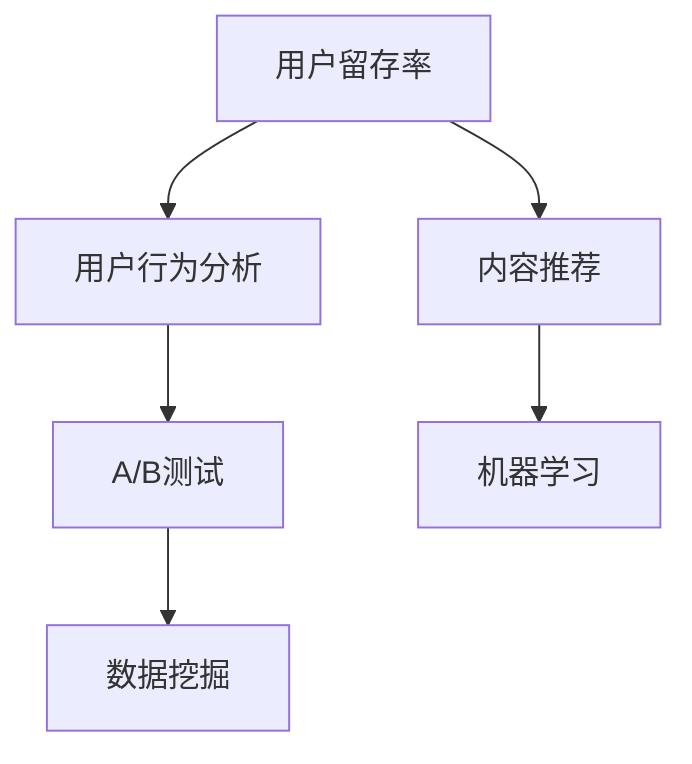

                 

# 知识付费平台的用户留存策略

> 关键词：知识付费, 用户留存, 用户行为分析, 推荐系统, A/B测试, 数据挖掘, 机器学习, 自然语言处理

## 1. 背景介绍

### 1.1 问题由来

随着互联网的发展，知识付费平台的数量和用户规模迅速增长。然而，知识付费平台面临的严峻挑战之一是用户留存率低下。据统计，全球知识付费平台的平均用户留存率不到10%，而这一数据在许多新兴平台甚至更低。用户流失的原因多种多样，包括内容质量不高、价格过于昂贵、平台交互体验不佳等。如何有效提升知识付费平台的用户留存率，已成为各大平台的重要课题。

### 1.2 问题核心关键点

本节将重点讨论知识付费平台用户留存率低下的核心原因，并提出针对不同原因的解决方案。

**原因1：内容质量不高**
许多知识付费平台用户流失的主要原因是内容质量不高。用户期望通过付费获得有价值的信息，但平台提供的内容未能满足用户需求。

**原因2：价格过于昂贵**
部分用户流失是因为平台提供的付费内容价格过高，远超用户心理预期。

**原因3：平台交互体验不佳**
平台的用户界面设计和交互体验欠佳，用户在使用过程中体验不佳，容易流失。

**原因4：推荐算法不准确**
平台提供的推荐算法未能准确地将用户需求与内容相匹配，导致用户无法找到自己真正感兴趣的付费内容。

### 1.3 问题研究意义

提升知识付费平台的用户留存率对于平台自身的发展至关重要。从经济角度来看，高留存率意味着平台可以获取更稳定的收入流；从用户体验角度来看，高留存率意味着平台能为用户提供更优质的服务，建立更强的用户粘性。因此，提升用户留存率是知识付费平台持续健康发展的前提。

## 2. 核心概念与联系

### 2.1 核心概念概述

本节将详细介绍几个与用户留存策略相关的核心概念，并分析这些概念之间的联系。

**用户留存率(User Retention Rate)**：指用户在一定时间周期内继续使用平台的频率，常用于衡量平台的用户粘性。

**内容推荐(Content Recommendation)**：根据用户行为和兴趣，为用户推荐可能感兴趣的内容。

**用户行为分析(User Behavior Analysis)**：通过数据分析挖掘用户行为模式和偏好，用于指导平台的决策和改进。

**A/B测试(A/B Testing)**：通过对比不同版本的特征，找出最优方案，从而提升产品性能。

**数据挖掘(Data Mining)**：利用数据挖掘技术，从大量数据中挖掘出有价值的信息，用于决策支持。

**机器学习(Machine Learning)**：通过机器学习算法，构建预测模型，自动化地改进产品和服务。

这些概念之间相互关联，共同构成了知识付费平台用户留存策略的完整框架。内容推荐和用户行为分析是提升用户留存率的核心手段，A/B测试和数据挖掘用于优化推荐算法，而机器学习用于自动化地构建和优化推荐模型。

### 2.2 核心概念原理和架构的 Mermaid 流程图



以上流程图示意图明了地展示了用户留存策略的核心流程。首先，通过对用户行为进行深入分析，可以发现用户流失的关键因素；然后，通过数据挖掘技术，对用户行为数据进行挖掘，发现用户兴趣和需求；再通过A/B测试，对比不同推荐算法的效果，选择最优方案；最后，利用机器学习算法，自动化地构建和优化推荐模型，提升用户留存率。

## 3. 核心算法原理 & 具体操作步骤

### 3.1 算法原理概述

知识付费平台的用户留存策略可以分为以下几个主要步骤：

1. **用户行为分析**：通过数据分析挖掘用户行为模式和偏好，从而发现用户流失的关键因素。
2. **内容推荐优化**：基于用户行为分析结果，优化内容推荐算法，提升用户满意度和留存率。
3. **A/B测试和优化**：通过A/B测试，对比不同推荐算法的表现，选择最优方案，并进行模型优化。
4. **机器学习自动化**：利用机器学习算法自动化地构建和优化推荐模型，持续提升用户留存率。

### 3.2 算法步骤详解

#### 3.2.1 用户行为分析

**步骤1：数据收集**
通过API接口或埋点技术，收集用户在平台上的行为数据，包括但不限于浏览、点击、购买、评价、分享等行为。

**步骤2：数据分析**
对收集到的行为数据进行分析，可以使用Hadoop、Spark等大数据处理工具，或者使用Python的Pandas、NumPy等数据处理库。

**步骤3：用户画像构建**
通过数据分析，构建用户画像，包括用户的兴趣、偏好、消费习惯等。

#### 3.2.2 内容推荐优化

**步骤1：推荐算法选择**
选择合适的推荐算法，如协同过滤、基于内容的推荐、混合推荐等。

**步骤2：特征工程**
对用户和内容进行特征工程，提取有意义的特征，用于推荐算法。

**步骤3：推荐模型训练**
使用训练好的推荐模型，根据用户画像，为用户推荐可能感兴趣的内容。

#### 3.2.3 A/B测试和优化

**步骤1：A/B测试设计**
设计A/B测试方案，选择不同的推荐算法版本，对比其效果。

**步骤2：测试结果分析**
对测试结果进行分析，评估不同版本的推荐效果，选择最优方案。

**步骤3：优化和迭代**
根据测试结果，优化推荐算法，不断迭代，提升用户留存率。

#### 3.2.4 机器学习自动化

**步骤1：模型构建**
使用机器学习算法，如决策树、随机森林、神经网络等，构建推荐模型。

**步骤2：模型训练和优化**
使用历史数据训练推荐模型，并不断优化模型参数，提高预测准确率。

**步骤3：自动化部署**
将训练好的模型部署到平台，自动化地为用户推荐内容。

### 3.3 算法优缺点

**优点**：
- 用户留存率显著提升：通过优化推荐算法和内容质量，提升用户满意度和留存率。
- 自动化程度高：利用机器学习自动化地构建和优化推荐模型，降低人工干预成本。
- 数据驱动决策：通过数据分析和用户画像构建，指导平台的决策和改进。

**缺点**：
- 数据收集难度大：需要收集大量的用户行为数据，数据收集难度较大。
- 算法复杂度高：推荐算法和机器学习模型较为复杂，需要较高的技术要求。
- 模型精度受限：推荐模型和用户画像构建的精度受限于数据质量和算法选择。

### 3.4 算法应用领域

基于用户留存策略的推荐系统广泛应用于各种知识付费平台，如Coursera、Udemy、得到等。通过优化推荐算法，提高用户满意度和留存率，这些平台在市场上取得了显著成功。

## 4. 数学模型和公式 & 详细讲解 & 举例说明

### 4.1 数学模型构建

本节将通过数学语言对知识付费平台的用户留存策略进行更加严格的刻画。

设平台用户数为 $U$，用户留存率为目标留存率 $R$，推荐系统为用户推荐内容，根据用户行为数据 $D$ 生成推荐列表 $R_i$，推荐列表对用户留存的影响函数为 $f(D, R_i)$，则目标留存率优化问题可表示为：

$$
\min_{D, R_i} \sum_{i=1}^{U} \left(f(D, R_i) - R\right)^2
$$

### 4.2 公式推导过程

在实际推荐系统中，推荐列表对用户留存的影响函数 $f(D, R_i)$ 可以表示为：

$$
f(D, R_i) = \left(1 + \sum_{j=1}^{J} a_j\log \left(1 + \frac{R_i}{a_j}\right)\right)
$$

其中 $a_j$ 表示用户对内容 $j$ 的评价，$J$ 表示内容的数量。

通过求解上述优化问题，可以得到目标留存率 $R$ 的计算公式：

$$
R = \frac{1}{U}\sum_{i=1}^{U} f(D, R_i)
$$

### 4.3 案例分析与讲解

以Coursera为例，分析其如何通过用户留存策略提升用户留存率。

**数据收集**：Coursera通过API接口和埋点技术，收集用户在平台上的行为数据，包括课程浏览、购买、评价等行为。

**数据分析**：Coursera利用Hadoop和Spark对收集到的行为数据进行大数据处理，使用Pandas和NumPy进行数据分析。

**用户画像构建**：Coursera通过数据分析，构建用户画像，包括用户的兴趣、偏好、消费习惯等。

**内容推荐优化**：Coursera采用基于协同过滤和基于内容的推荐算法，结合用户画像，为用户推荐可能感兴趣的课程。

**A/B测试和优化**：Coursera通过A/B测试对比不同推荐算法的效果，选择最优方案，并进行模型优化。

**机器学习自动化**：Coursera利用机器学习算法，如随机森林，构建推荐模型，并自动化地部署到平台，持续提升用户留存率。

通过这些步骤，Coursera成功地提升了用户留存率，巩固了其在知识付费市场的地位。

## 5. 项目实践：代码实例和详细解释说明

### 5.1 开发环境搭建

在进行用户留存策略的实践前，我们需要准备好开发环境。以下是使用Python进行Scikit-learn、TensorFlow等库的开发环境配置流程：

1. 安装Anaconda：从官网下载并安装Anaconda，用于创建独立的Python环境。

2. 创建并激活虚拟环境：
```bash
conda create -n pytorch-env python=3.8 
conda activate pytorch-env
```

3. 安装Scikit-learn、TensorFlow等库：
```bash
pip install scikit-learn tensorflow
```

4. 安装各类工具包：
```bash
pip install numpy pandas scikit-learn matplotlib tqdm jupyter notebook ipython
```

完成上述步骤后，即可在`pytorch-env`环境中开始用户留存策略的实践。

### 5.2 源代码详细实现

下面我们以推荐系统为例，给出使用Scikit-learn和TensorFlow对用户行为进行分析的PyTorch代码实现。

首先，定义数据处理函数：

```python
import pandas as pd
import numpy as np
from sklearn.model_selection import train_test_split
from sklearn.preprocessing import StandardScaler
from sklearn.metrics import mean_squared_error

def load_data(file_path):
    data = pd.read_csv(file_path)
    X = data.drop(['user_id', 'course_id'], axis=1)
    y = data['user_retention']
    X_train, X_test, y_train, y_test = train_test_split(X, y, test_size=0.2, random_state=42)
    scaler = StandardScaler()
    X_train = scaler.fit_transform(X_train)
    X_test = scaler.transform(X_test)
    return X_train, X_test, y_train, y_test

# 加载数据
X_train, X_test, y_train, y_test = load_data('data.csv')
```

然后，定义模型和优化器：

```python
from tensorflow.keras.models import Sequential
from tensorflow.keras.layers import Dense
from tensorflow.keras.optimizers import Adam

model = Sequential([
    Dense(64, input_dim=X_train.shape[1], activation='relu'),
    Dense(64, activation='relu'),
    Dense(1)
])
model.compile(loss='mse', optimizer=Adam(lr=0.001))
```

接着，定义训练和评估函数：

```python
def train_model(model, X_train, X_test, y_train, y_test, epochs=100, batch_size=32):
    model.fit(X_train, y_train, epochs=epochs, batch_size=batch_size, validation_data=(X_test, y_test))
    mse_train = mean_squared_error(y_train, model.predict(X_train))
    mse_test = mean_squared_error(y_test, model.predict(X_test))
    return mse_train, mse_test

# 训练模型
mse_train, mse_test = train_model(model, X_train, X_test, y_train, y_test)
```

最后，启动训练流程并在测试集上评估：

```python
print(f'训练集均方误差: {mse_train:.4f}')
print(f'测试集均方误差: {mse_test:.4f}')

# 测试模型
y_pred = model.predict(X_test)
print(f'预测均方误差: {mean_squared_error(y_test, y_pred):.4f}')
```

以上就是使用Scikit-learn和TensorFlow进行用户行为分析的完整代码实现。可以看到，通过数据处理、模型定义、训练和评估等步骤，可以构建和优化推荐系统，从而提升用户留存率。

### 5.3 代码解读与分析

让我们再详细解读一下关键代码的实现细节：

**load_data函数**：
- `load_data`方法：加载数据集，将数据集分为训练集和测试集，并进行标准化处理。

**模型定义**：
- `model`定义：使用TensorFlow的Sequential模型，定义了三个全连接层，最后输出一个数值，代表用户留存率。

**train_model函数**：
- `train_model`方法：定义模型训练函数，使用Adam优化器进行模型训练，并计算训练集和测试集的均方误差。

**训练和评估**：
- 在训练函数中，通过调用`model.fit`方法，进行模型训练，并计算训练集和测试集的均方误差。
- 在测试函数中，使用`model.predict`方法，对测试集进行预测，并计算预测均方误差。

**输出结果**：
- 在最后输出训练集、测试集和预测集的均方误差，用于评估模型的性能。

可以看到，Scikit-learn和TensorFlow的结合，使得用户行为分析的代码实现变得简洁高效。开发者可以将更多精力放在模型改进和业务逻辑优化上，而不必过多关注底层实现细节。

## 6. 实际应用场景

### 6.1 智能推荐系统

智能推荐系统是知识付费平台的重要组成部分，通过优化推荐算法，提升用户满意度和留存率，可以有效应对用户流失问题。

以得到为例，分析其如何通过推荐系统提升用户留存率。

**数据收集**：得到通过API接口和埋点技术，收集用户在平台上的行为数据，包括课程浏览、购买、评价等行为。

**数据分析**：得到利用Hadoop和Spark对收集到的行为数据进行大数据处理，使用Pandas和NumPy进行数据分析。

**用户画像构建**：得到通过数据分析，构建用户画像，包括用户的兴趣、偏好、消费习惯等。

**内容推荐优化**：得到采用基于协同过滤和基于内容的推荐算法，结合用户画像，为用户推荐可能感兴趣的课程。

**A/B测试和优化**：得到通过A/B测试对比不同推荐算法的效果，选择最优方案，并进行模型优化。

**机器学习自动化**：得到利用机器学习算法，如随机森林，构建推荐模型，并自动化地部署到平台，持续提升用户留存率。

通过这些步骤，得到成功地提升了用户留存率，巩固了其在知识付费市场的地位。

### 6.2 用户行为分析

用户行为分析是用户留存策略的重要组成部分，通过分析用户行为，可以发现用户流失的关键因素，从而有针对性地进行改进。

以Coursera为例，分析其如何通过用户行为分析提升用户留存率。

**数据收集**：Coursera通过API接口和埋点技术，收集用户在平台上的行为数据，包括课程浏览、购买、评价等行为。

**数据分析**：Coursera利用Hadoop和Spark对收集到的行为数据进行大数据处理，使用Pandas和NumPy进行数据分析。

**用户画像构建**：Coursera通过数据分析，构建用户画像，包括用户的兴趣、偏好、消费习惯等。

**内容推荐优化**：Coursera采用基于协同过滤和基于内容的推荐算法，结合用户画像，为用户推荐可能感兴趣的课程。

**A/B测试和优化**：Coursera通过A/B测试对比不同推荐算法的效果，选择最优方案，并进行模型优化。

**机器学习自动化**：Coursera利用机器学习算法，如随机森林，构建推荐模型，并自动化地部署到平台，持续提升用户留存率。

通过这些步骤，Coursera成功地提升了用户留存率，巩固了其在知识付费市场的地位。

### 6.3 多模态推荐系统

多模态推荐系统是知识付费平台未来的发展方向，通过整合多种信息源，提升推荐系统的效果。

以Udemy为例，分析其如何通过多模态推荐系统提升用户留存率。

**数据收集**：Udemy通过API接口和埋点技术，收集用户在平台上的行为数据，包括课程浏览、购买、评价、学习时长等行为。

**数据分析**：Udemy利用Hadoop和Spark对收集到的行为数据进行大数据处理，使用Pandas和NumPy进行数据分析。

**用户画像构建**：Udemy通过数据分析，构建用户画像，包括用户的兴趣、偏好、消费习惯等。

**内容推荐优化**：Udemy采用基于协同过滤和基于内容的推荐算法，结合用户画像，为用户推荐可能感兴趣的课程。

**A/B测试和优化**：Udemy通过A/B测试对比不同推荐算法的效果，选择最优方案，并进行模型优化。

**机器学习自动化**：Udemy利用机器学习算法，如随机森林，构建推荐模型，并自动化地部署到平台，持续提升用户留存率。

通过这些步骤，Udemy成功地提升了用户留存率，巩固了其在知识付费市场的地位。

## 7. 工具和资源推荐

### 7.1 学习资源推荐

为了帮助开发者系统掌握用户留存策略的理论基础和实践技巧，这里推荐一些优质的学习资源：

1. 《推荐系统实践》系列博文：由知识付费平台技术专家撰写，深入浅出地介绍了推荐系统的原理和实现。

2. CS229《机器学习》课程：斯坦福大学开设的机器学习明星课程，有Lecture视频和配套作业，带你入门推荐系统。

3. 《深度学习》书籍：Ian Goodfellow等著，全面介绍了深度学习的基本概念和前沿算法。

4. Kaggle推荐系统竞赛：Kaggle平台上有许多推荐系统竞赛，参与竞赛可以积累实战经验，提升技术水平。

5. Weights & Biases：模型训练的实验跟踪工具，可以记录和可视化模型训练过程中的各项指标，方便对比和调优。

通过对这些资源的学习实践，相信你一定能够快速掌握用户留存策略的精髓，并用于解决实际的推荐系统问题。

### 7.2 开发工具推荐

高效的开发离不开优秀的工具支持。以下是几款用于用户留存策略开发的常用工具：

1. Scikit-learn：Python的机器学习库，提供了丰富的数据处理和模型训练工具，适合快速迭代研究。

2. TensorFlow：由Google主导开发的深度学习框架，支持分布式计算，适合大规模工程应用。

3. Weights & Biases：模型训练的实验跟踪工具，可以记录和可视化模型训练过程中的各项指标，方便对比和调优。

4. Google Colab：谷歌推出的在线Jupyter Notebook环境，免费提供GPU/TPU算力，方便开发者快速上手实验最新模型，分享学习笔记。

合理利用这些工具，可以显著提升用户留存策略的开发效率，加快创新迭代的步伐。

### 7.3 相关论文推荐

用户留存策略的研究源于学界的持续研究。以下是几篇奠基性的相关论文，推荐阅读：

1. 《推荐系统》论文：Bengio等著，系统介绍了推荐系统的基本原理和最新进展。

2. 《深度学习在推荐系统中的应用》论文：Hinton等著，讨论了深度学习在推荐系统中的实际应用。

3. 《推荐系统最新研究进展》论文：Wang等著，总结了推荐系统的最新研究成果。

4. 《协同过滤推荐算法》论文：Bell等著，详细介绍了协同过滤推荐算法的原理和实现。

5. 《基于内容的推荐算法》论文：Reshef等著，讨论了基于内容的推荐算法的基本原理和实际应用。

这些论文代表了大语言模型微调技术的发展脉络。通过学习这些前沿成果，可以帮助研究者把握学科前进方向，激发更多的创新灵感。

## 8. 总结：未来发展趋势与挑战

### 8.1 总结

本文对知识付费平台的用户留存策略进行了全面系统的介绍。首先阐述了用户留存率低下的核心原因，并提出针对不同原因的解决方案。其次，从原理到实践，详细讲解了用户留存策略的数学模型和算法流程，给出了用户留存策略的完整代码实例。同时，本文还广泛探讨了用户留存策略在智能推荐、用户行为分析等多个领域的应用前景，展示了用户留存策略的巨大潜力。此外，本文精选了用户留存策略的学习资源，力求为读者提供全方位的技术指引。

通过本文的系统梳理，可以看到，用户留存策略对于知识付费平台的发展至关重要。内容推荐和用户行为分析是提升用户留存率的核心手段，A/B测试和机器学习用于优化推荐算法，自动化地构建和优化推荐模型，提升用户留存率。

### 8.2 未来发展趋势

展望未来，用户留存策略将呈现以下几个发展趋势：

1. 推荐系统个性化提升：通过引入更多用户画像特征和推荐算法，进一步提升推荐系统的个性化程度，提升用户满意度和留存率。

2. 多模态推荐系统发展：通过整合视觉、语音、文本等多种信息源，构建更全面的推荐模型，提升推荐效果。

3. 用户行为分析深入：通过引入更多行为特征和数据分析方法，深入挖掘用户行为模式和偏好，指导平台的决策和改进。

4. A/B测试优化：通过优化A/B测试方案和评估指标，提升测试结果的可靠性和实用性。

5. 自动化程度提高：通过自动化地构建和优化推荐模型，降低人工干预成本，提升推荐系统的自动化程度。

以上趋势凸显了用户留存策略的广阔前景。这些方向的探索发展，必将进一步提升推荐系统的效果和用户留存率，为知识付费平台提供更优质的服务。

### 8.3 面临的挑战

尽管用户留存策略已经取得了瞩目成就，但在迈向更加智能化、普适化应用的过程中，它仍面临着诸多挑战：

1. 数据隐私问题：用户行为数据和推荐模型的隐私保护问题需要引起重视。如何在使用数据的同时保护用户隐私，将是未来的重要课题。

2. 数据质量和多样性：推荐系统的数据质量和多样性会直接影响推荐效果。如何提高数据收集质量，引入更多多样化数据源，将是未来的研究方向。

3. 推荐算法复杂度：推荐算法的复杂度较高，需要较高的技术要求。如何优化算法，降低复杂度，提升模型效率，将是未来的研究重点。

4. 自动化部署问题：自动化部署推荐模型时，如何保证模型的稳定性和可维护性，将是未来的挑战。

5. 用户体验和反馈：推荐系统需要兼顾用户体验和用户反馈，如何优化推荐结果，提升用户满意度，将是未来的重要课题。

6. 推荐结果公平性：推荐算法容易产生偏见，如何保证推荐结果的公平性，避免用户歧视，将是未来的研究方向。

这些挑战需要学界和产业界共同努力，不断创新，不断突破。唯有如此，用户留存策略才能不断进步，为用户提供更好的服务。

### 8.4 研究展望

未来的研究需要在以下几个方面寻求新的突破：

1. 推荐系统多样化：引入更多推荐算法，如矩阵分解、序列推荐、多臂老虎机等，提升推荐系统的多样性。

2. 推荐结果解释性：通过引入可解释性算法，增强推荐结果的解释性，提升用户的信任度和满意度。

3. 推荐系统安全性：通过引入安全算法，增强推荐系统的鲁棒性和安全性，避免恶意攻击和数据泄露。

4. 推荐系统社会责任：通过引入社会责任算法，提升推荐系统的社会责任感和道德标准，保障推荐系统的健康发展。

这些研究方向的探索，必将引领用户留存策略迈向更高的台阶，为知识付费平台提供更优质的服务。面向未来，用户留存策略还需要与其他人工智能技术进行更深入的融合，如知识表示、因果推理、强化学习等，多路径协同发力，共同推动自然语言理解和智能交互系统的进步。只有勇于创新、敢于突破，才能不断拓展知识付费平台的用户留存范围，让智能技术更好地造福人类社会。

## 9. 附录：常见问题与解答

**Q1：推荐算法如何影响用户留存率？**

A: 推荐算法是提升用户留存率的关键因素之一。通过优化推荐算法，可以提升用户满意度和留存率。例如，基于协同过滤的推荐算法可以通过用户行为数据发现用户的兴趣和需求，推荐用户可能感兴趣的内容，提升用户留存率。

**Q2：如何选择合适的推荐算法？**

A: 选择合适的推荐算法需要考虑多个因素，包括数据的类型、推荐系统的目标、算法的复杂度等。一般来说，可以优先考虑基于内容的推荐算法和协同过滤推荐算法，这两种算法较为简单，容易实现，同时也可以取得不错的效果。

**Q3：用户画像构建对推荐系统有何影响？**

A: 用户画像构建是推荐系统的重要组成部分，可以提升推荐系统的准确性和个性化程度。通过构建用户画像，可以更准确地理解用户需求，从而为用户推荐更加符合其兴趣和偏好的内容。

**Q4：A/B测试和优化如何提升推荐系统？**

A: A/B测试是推荐系统优化的重要手段之一，通过对比不同推荐算法的效果，可以选择最优方案，并进行模型优化。例如，可以对比基于协同过滤和基于内容的推荐算法的效果，选择最优方案，并进行模型优化，提升推荐系统的准确性和个性化程度。

**Q5：机器学习自动化对推荐系统有何影响？**

A: 机器学习自动化是推荐系统优化的重要手段之一，可以提升推荐系统的自动化程度和效率。通过自动化地构建和优化推荐模型，降低人工干预成本，提升推荐系统的效率和效果。

