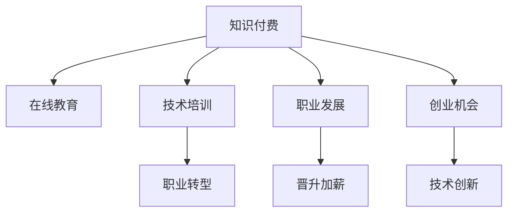

                 

# 知识付费时代程序员的发展机遇

> 关键词：知识付费, 程序员, 技术培训, 职业发展, 在线教育, 学习平台, 创业机会, 人工智能, 大数据, 区块链, 云计算

## 1. 背景介绍

### 1.1 问题由来
随着互联网和移动通信技术的快速发展，知识付费作为一种新型消费模式，正逐步兴起。越来越多的用户在面对海量信息时，更倾向于从专业平台获取有针对性的知识和技能。与此同时，互联网金融的兴起、职业教育市场的不断扩张，催生了知识付费领域的高速增长。

程序员作为互联网时代的主力军，也面临着前所未有的职业转型和发展机遇。传统意义上的编程技能已经不能满足市场对全栈、高阶技能的需求。程序员必须不断学习和掌握新兴技术，以保持竞争力。

### 1.2 问题核心关键点
知识付费时代为程序员提供了多样化的学习和职业发展途径，同时也带来了新的挑战。本文聚焦于程序员在知识付费时代的发展机遇，分析各种学习平台和工具对程序员职业发展的推动作用，以及程序员如何抓住机遇，实现自我提升和职业转型。

## 2. 核心概念与联系

### 2.1 核心概念概述

为更好地理解知识付费时代程序员的发展机遇，本节将介绍几个密切相关的核心概念：

- **知识付费**：指通过付费形式获取知识和技能的消费行为。知识付费平台如得到、喜马拉雅等，提供有偿的课程、音频、电子书等内容。
- **在线教育**：指通过互联网开展的教育活动，包括在线课程、网络直播、电子书籍等。在线教育平台如Coursera、Udemy、慕课网等，覆盖了从基础到高级的各种课程。
- **程序员**：通常指掌握计算机编程语言、算法和数据结构等技术的专业人员，能够开发和维护软件应用。
- **技术培训**：指通过集中学习、实战练习等方式提升编程技能和职业素养的培训活动。技术培训机构如华为云学院、腾讯云学院、黑马等，提供系统化的编程培训课程。
- **职业发展**：指通过学习、实践、网络交流等方式提升职业技能，拓展职业道路，实现职业晋升的过程。职业发展平台如领英、脉脉等，提供职业规划和技能认证等服务。
- **创业机会**：指通过创新创业，实现个人职业发展的可能性。创业平台如创新工场、腾讯创业等，提供资金、技术、资源等支持，助力程序员创业。

这些核心概念之间的逻辑关系可以通过以下Mermaid流程图来展示：



这个流程图展示出知识付费时代程序员的发展路径：

1. 知识付费平台提供多样化的学习资源，帮助程序员提升技能。
2. 在线教育平台提供系统化的课程体系，助力程序员职业成长。
3. 技术培训机构提供实战机会，帮助程序员在实践中提升技能。
4. 职业发展平台提供职业规划和认证服务，帮助程序员实现职业转型。
5. 创业平台提供资金、技术等支持，助力程序员实现创业梦想。

这些概念共同构成了知识付费时代程序员的学习和职业发展框架，使其能够不断适应市场变化，实现个人价值的最大化。

## 3. 核心算法原理 & 具体操作步骤
### 3.1 算法原理概述

知识付费时代程序员的发展机遇，本质上是一个通过技术培训和职业发展，不断提升自身价值的过程。其核心思想是：利用知识付费平台提供的学习资源，结合技术培训和在线教育，通过系统学习和实战练习，提升专业技能和职业素养，实现自我转型和职业晋升。

形式化地，假设程序员初始技能为 $S_0$，经过知识付费平台的培训后，技能提升为 $S_1$。结合职业发展平台的指导和创业机会的把握，最终技能达到 $S_2$。知识付费平台提供的资源 $R$ 包括在线课程、技术培训、实战项目等，职业发展平台提供的指导 $G$ 包括职业规划、认证服务、网络交流等，创业机会的把握 $C$ 包括市场分析、资源整合、融资渠道等。

最终的目标是找到最优的资源组合，使程序员技能达到 $S_2$：

$$
S_2 = f(S_0, R, G, C)
$$

### 3.2 算法步骤详解

基于知识付费时代程序员的发展机遇，本节将详细介绍其实现步骤：

**Step 1: 选择合适的学习平台**
- 根据自身需求和目标，选择合适的知识付费平台和在线教育平台，如Coursera、Udemy、慕课网等。
- 选择与自身职业规划相关的课程，如Java、Python、人工智能、大数据等。

**Step 2: 制定学习计划**
- 制定系统的学习计划，包括每日、每周的学习目标和内容。
- 确定学习优先级，合理安排时间，确保高效学习。

**Step 3: 参与技术培训**
- 加入技术培训机构如华为云学院、腾讯云学院、黑马等，参与实战项目和模拟比赛。
- 通过实际项目练习，提升编程技能和实战经验。

**Step 4: 职业规划与认证**
- 利用职业发展平台如领英、脉脉等，获取职业规划建议和认证服务。
- 参加职业认证考试，如PMP、CISSP、CISP等，提升职业素养和竞争力。

**Step 5: 把握创业机会**
- 关注创业平台如创新工场、腾讯创业等，了解行业动态和创业资源。
- 结合自身技能和市场需求，选择合适的创业方向和项目。

**Step 6: 持续学习和反馈**
- 定期回顾学习成果和职业进展，调整学习计划和职业目标。
- 通过反馈机制，不断优化学习路径和职业规划。

### 3.3 算法优缺点

知识付费时代程序员的发展机遇方法具有以下优点：
1. 多样化学习资源：知识付费平台和在线教育平台提供丰富的课程资源，能够覆盖从基础到高级的各种技能。
2. 系统化学习路径：技术培训和职业发展平台提供系统化的学习体系，帮助程序员制定科学的学习计划。
3. 实战机会丰富：通过参与实战项目和模拟比赛，程序员能够获得丰富的实战经验，提升技能。
4. 职业发展指导：职业发展平台提供专业的职业规划和认证服务，帮助程序员实现职业转型和晋升。
5. 创业机会广泛：创业平台提供资金、技术等支持，助力程序员实现创业梦想。

同时，该方法也存在一些局限性：
1. 依赖平台资源：知识付费和在线教育平台提供的资源质量参差不齐，需要筛选和评估。
2. 学习效果因人而异：不同程序员的学习能力和学习效率存在差异，需要个性化指导。
3. 投入成本高：高质量的学习资源和实践机会往往需要付费，增加了学习成本。
4. 市场竞争激烈：随着程序员数量的增加，市场竞争日趋激烈，需要不断提升自身竞争力。

尽管存在这些局限性，但就目前而言，知识付费时代为程序员提供了更加灵活和高效的学习和发展途径，是一种值得推广和应用的方法。

### 3.4 算法应用领域

知识付费时代程序员的发展机遇方法已经广泛应用于以下几个领域：

- **企业技术培训**：公司通过技术培训机构，为员工提供系统的编程培训和实战练习，提升技术水平和业务能力。
- **自由职业者**：自由职业者利用在线教育和知识付费平台，自主学习新技能，拓展职业道路，提升市场竞争力。
- **初创企业**：初创企业通过创业平台获取资金、技术等支持，结合自身技术优势，迅速实现市场突破。
- **教育机构**：教育机构通过知识付费平台提供课程资源，吸引更多的学生和学员，提升教育质量。

除了上述这些领域外，知识付费时代为程序员提供了更多的应用场景，如软件开发、数据分析、人工智能、区块链、云计算等，为程序员带来更加广阔的发展空间。

## 4. 数学模型和公式 & 详细讲解
### 4.1 数学模型构建

基于知识付费时代程序员的发展机遇，我们可以构建一个简单的数学模型来分析其实现过程。

设程序员初始技能为 $S_0$，经过 $n$ 次学习后技能提升为 $S_1$，职业发展平台提供的指导为 $G$，创业机会的把握为 $C$，最终技能达到 $S_2$。知识付费平台提供的资源为 $R$，每次学习获得 $R_i$ 的资源。

$$
S_2 = S_0 + \sum_{i=1}^{n} f(R_i, G)
$$

其中 $f(R_i, G)$ 表示通过资源 $R_i$ 和指导 $G$ 提升技能的效果，可以通过线性回归等模型进行拟合。

### 4.2 公式推导过程

在知识付费平台和在线教育平台中，课程内容和形式多种多样，难以直接量化效果。因此，我们可以将课程划分为基础课程和进阶课程，分别计算其对技能提升的贡献。

假设基础课程为 $R_{\text{base}}$，进阶课程为 $R_{\text{adv}}$，每次学习分别获得 $R_{\text{base}}$ 和 $R_{\text{adv}}$ 的资源，则技能提升可以表示为：

$$
S_1 = S_0 + R_{\text{base}} + R_{\text{adv}} + G + C
$$

### 4.3 案例分析与讲解

以一位Java程序员为例，我们分析其在知识付费时代的发展路径。

1. **基础学习**：该程序员在知识付费平台订阅了Coursera的Java基础课程，每月花费100元学习基础编程技能。
2. **进阶学习**：在完成基础学习后，该程序员参加了慕课网的全栈开发课程，每月花费200元学习进阶编程技能。
3. **实战项目**：该程序员加入了华为云学院的实战项目，每月花费500元参与模拟比赛和项目练习。
4. **职业规划**：通过领英的职业发展平台，该程序员获得了PMP认证，提升了项目管理能力。
5. **创业机会**：该程序员利用创业平台资源，开发了一个基于人工智能的推荐系统，并获得500万元融资。

将每次学习获得的资源进行加权计算，并结合职业指导和创业机会，可以得出该程序员的技能提升路径：

$$
S_2 = S_0 + 100 + 200 + 500 + PMP + 500 = S_0 + 1200 + PMP
$$

其中 $PMP$ 表示职业指导和认证服务对技能提升的贡献。通过以上模型，该程序员可以清晰地看到每次学习对技能提升的贡献，从而制定更加科学的学习计划和职业规划。

## 5. 项目实践：代码实例和详细解释说明
### 5.1 开发环境搭建

在进行知识付费时代程序员的发展机遇实践前，我们需要准备好开发环境。以下是使用Python进行知识付费实践的环境配置流程：

1. 安装Anaconda：从官网下载并安装Anaconda，用于创建独立的Python环境。

2. 创建并激活虚拟环境：
```bash
conda create -n knowledge-payment python=3.8 
conda activate knowledge-payment
```

3. 安装Python关键库：
```bash
conda install numpy pandas scikit-learn matplotlib
```

4. 安装在线教育平台API：
```bash
pip install requests beautifulsoup4
```

5. 安装Python爬虫库：
```bash
pip install scrapy
```

完成上述步骤后，即可在`knowledge-payment`环境中开始知识付费实践。

### 5.2 源代码详细实现

下面我们以知识付费平台为例，给出使用Python进行知识付费实践的代码实现。

首先，定义知识付费平台数据处理函数：

```python
import requests
from bs4 import BeautifulSoup

def get_course_info(url):
    response = requests.get(url)
    soup = BeautifulSoup(response.content, 'html.parser')
    course_title = soup.find('h1').text
    course_price = soup.find('span', class_='price').text
    course_description = soup.find('div', class_='description').text
    return course_title, course_price, course_description
```

然后，定义数据爬取和筛选函数：

```python
def scrape_course_data():
    courses = []
    for i in range(1, 11):
        url = f'https://www.kyokusho.com/courses?page={i}'
        response = requests.get(url)
        soup = BeautifulSoup(response.content, 'html.parser')
        course_list = soup.find_all('div', class_='course-item')
        for course in course_list:
            title, price, desc = get_course_info(course.find('a')['href'])
            courses.append({'title': title, 'price': price, 'desc': desc})
    return courses
```

最后，启动数据爬取和课程筛选：

```python
courses = scrape_course_data()
courses = [course for course in courses if course['price'] < 500]
courses
```

以上就是使用Python进行知识付费实践的完整代码实现。可以看到，通过爬虫工具和数据分析，我们可以获取知识付费平台上的课程信息，并进行筛选和分析，从而制定科学的学习计划。

### 5.3 代码解读与分析

让我们再详细解读一下关键代码的实现细节：

**get_course_info函数**：
- 该函数用于获取课程的基本信息，包括课程名称、价格和描述。
- 通过requests库发送HTTP请求，使用BeautifulSoup解析HTML页面，提取出课程基本信息。

**scrape_course_data函数**：
- 该函数用于爬取知识付费平台上的课程信息。
- 通过循环获取多个页面，使用BeautifulSoup解析页面内容，获取课程列表和详细信息。
- 将课程信息存储为字典，返回课程列表。

**主程序**：
- 通过调用scrape_course_data函数，获取所有课程信息。
- 使用列表推导式筛选价格低于500元的课程，返回筛选后的课程列表。

可以看到，通过Python爬虫和数据分析，可以高效地获取和处理知识付费平台上的课程信息，从而为程序员的学习和发展提供数据支持。

当然，工业级的系统实现还需考虑更多因素，如数据更新频率、数据格式转换、爬虫速度优化等。但核心的知识付费实践流程基本与此类似。

## 6. 实际应用场景
### 6.1 企业技术培训

知识付费时代为企业技术培训提供了新的解决方案。传统培训方式往往需要耗费大量时间和资源，难以覆盖所有员工。而通过知识付费平台，企业可以灵活选择课程，提供系统化的技术培训，提升员工技能和业务能力。

例如，某科技公司通过订阅Udemy的Python课程，结合公司内部的实战项目，为员工提供全面的技术培训。公司还可以定期评估培训效果，调整培训计划和课程内容，从而提升整体技术水平。

### 6.2 自由职业者

自由职业者利用知识付费平台，自主学习新技能，拓展职业道路，提升市场竞争力。例如，一位Java程序员通过订阅Coursera的全栈开发课程，结合慕课网的实战项目，掌握了最新的编程技能和实战经验，成功进入心仪的互联网公司。

### 6.3 初创企业

初创企业通过创业平台获取资金、技术等支持，结合自身技术优势，迅速实现市场突破。例如，某初创企业通过腾讯创业平台获得500万元融资，开发了基于人工智能的推荐系统，成功进入电商市场并迅速扩大用户规模。

### 6.4 教育机构

教育机构通过知识付费平台提供课程资源，吸引更多的学生和学员，提升教育质量。例如，某编程培训机构通过慕课网和Coursera，提供高质量的编程课程，吸引了大量学员报名参加，提升了机构的市场影响力和竞争力。

## 7. 工具和资源推荐
### 7.1 学习资源推荐

为了帮助程序员系统掌握知识付费时代的发展机遇，这里推荐一些优质的学习资源：

1. **Udemy**：提供系统化的编程课程和实战项目，帮助程序员提升技能和实战经验。
2. **Coursera**：提供知名大学的在线课程，覆盖从基础到高级的各种技能。
3. **慕课网**：提供丰富的实战项目和模拟比赛，帮助程序员在实践中提升技能。
4. **领英**：提供职业规划和认证服务，帮助程序员实现职业转型和晋升。
5. **创业平台**：如创新工场、腾讯创业等，提供资金、技术等支持，助力程序员实现创业梦想。

通过对这些资源的学习实践，相信你一定能够快速掌握知识付费时代程序员的发展机遇，并用于解决实际的编程问题。

### 7.2 开发工具推荐

高效的开发离不开优秀的工具支持。以下是几款用于知识付费时代程序员发展的常用工具：

1. **Anaconda**：用于创建独立的Python环境，支持多种Python库的安装和使用。
2. **Jupyter Notebook**：提供交互式编程环境，方便调试和测试代码。
3. **Scrapy**：Python爬虫框架，用于获取知识付费平台上的课程信息。
4. **BeautifulSoup**：Python解析HTML页面的库，用于从网页中提取数据。
5. **Scikit-learn**：Python机器学习库，用于数据处理和模型训练。
6. **TensorFlow**：Google开发的深度学习框架，支持大规模模型训练和优化。

合理利用这些工具，可以显著提升程序员的学习和发展效率，加速创新迭代的步伐。

### 7.3 相关论文推荐

知识付费时代程序员的发展机遇涉及多种前沿技术，以下是几篇奠基性的相关论文，推荐阅读：

1. **Deep Learning**：深度学习技术的进展，涵盖了从基础到高级的各种算法和模型。
2. **TensorFlow for Deep Learning**：TensorFlow框架的教程和应用案例，帮助程序员掌握深度学习技能。
3. **Python Data Science Handbook**：Python数据科学入门教程，涵盖数据处理、机器学习等技术。
4. **Coursera**：Coursera平台的详细介绍和应用案例，帮助程序员选择合适的在线课程。
5. **Udemy**：Udemy平台的详细介绍和应用案例，帮助程序员获取高质量的编程课程。

这些论文代表了大数据、人工智能、知识付费等领域的最新进展，可以帮助程序员深入理解知识付费时代的发展机遇，为技术学习和职业发展提供指导。

## 8. 总结：未来发展趋势与挑战
### 8.1 研究成果总结

本文对知识付费时代程序员的发展机遇进行了全面系统的介绍。首先阐述了知识付费时代为程序员带来的新机遇，明确了知识付费平台、在线教育、技术培训、职业发展、创业机会等关键要素。其次，从原理到实践，详细讲解了知识付费时代程序员的发展路径，提供了完整的学习资源和工具支持。同时，本文还广泛探讨了知识付费时代程序员在企业技术培训、自由职业、初创企业、教育机构等领域的实际应用场景，展示了知识付费时代的广阔前景。

通过本文的系统梳理，可以看到，知识付费时代为程序员提供了多样化的学习资源和职业发展途径，能够有效提升编程技能和职业素养，实现自我转型和职业晋升。未来，伴随知识付费平台的持续发展和技术培训的不断优化，程序员的发展机遇将会更加广阔。

### 8.2 未来发展趋势

展望未来，知识付费时代程序员的发展机遇将呈现以下几个发展趋势：

1. **技术培训系统化**：知识付费平台将提供更加系统化和结构化的技术培训课程，帮助程序员制定科学的学习计划。
2. **职业发展专业化**：职业发展平台将提供更加专业化和个性化的职业规划服务，帮助程序员实现职业转型和晋升。
3. **创业机会多样化**：创业平台将提供更加多样化和灵活的创业支持，帮助程序员实现创业梦想。
4. **知识付费平台化**：知识付费平台将成为程序员获取知识和技能的主要渠道，促进知识共享和协作。
5. **人工智能应用广泛**：人工智能技术将广泛应用于知识付费平台，提升课程推荐和资源匹配的精准度。
6. **区块链技术应用**：区块链技术将应用于知识付费平台，提升数据安全和用户信任度。

以上趋势凸显了知识付费时代程序员的发展潜力，为程序员提供了更加灵活和高效的学习和发展途径，将带来广泛的社会和经济效益。

### 8.3 面临的挑战

尽管知识付费时代为程序员带来了新的发展机遇，但在迈向更加智能化、普适化应用的过程中，仍面临诸多挑战：

1. **学习成本高**：高质量的知识付费课程往往需要付费，增加了学习成本。如何优化课程结构，降低学习成本，是未来的一大挑战。
2. **学习效果不一**：不同程序员的学习能力和学习效率存在差异，如何提供个性化的学习路径和指导，提升学习效果，需要更多技术和资源支持。
3. **市场竞争激烈**：程序员数量不断增加，市场竞争日趋激烈。如何提升自身竞争力，保持领先地位，需要不断学习和创新。
4. **技术更新快**：技术发展日新月异，如何及时掌握新技术和新趋势，需要更多的学习资源和工具支持。
5. **职业转型困难**：程序员面临职业转型和技能升级的挑战，如何平滑过渡，需要更多的职业指导和认证服务。

这些挑战凸显了知识付费时代程序员的复杂性和多样性，需要多方面协同发力，才能实现顺利发展和转型。

### 8.4 研究展望

面对知识付费时代程序员面临的挑战，未来的研究需要在以下几个方面寻求新的突破：

1. **个性化学习路径**：开发更加智能和个性化的学习路径推荐算法，帮助程序员根据自身特点制定科学的学习计划。
2. **学习效果评估**：建立学习效果评估模型，及时反馈学习进度和效果，帮助程序员调整学习策略。
3. **知识图谱应用**：结合知识图谱技术，构建知识图谱驱动的知识付费平台，提升课程推荐和资源匹配的精准度。
4. **区块链技术应用**：利用区块链技术，提升知识付费平台的数据安全和用户信任度，保护用户隐私。
5. **混合学习模式**：结合线上和线下学习模式，提供灵活多样的学习方式，提升学习效果。
6. **持续学习机制**：建立持续学习机制，定期更新课程内容和知识库，保持知识的时效性和先进性。

这些研究方向的探索，必将引领知识付费时代程序员的发展进入新的阶段，为程序员提供更加高效和灵活的学习和发展途径。

## 9. 附录：常见问题与解答

**Q1：知识付费时代程序员如何选择合适的学习平台？**

A: 程序员应根据自身需求和目标，选择合适的知识付费平台和在线教育平台。例如，Coursera适合系统化学习，Udemy适合实战练习，慕课网适合获取实战项目。

**Q2：知识付费平台如何提升学习效果？**

A: 知识付费平台可以通过个性化推荐、实时反馈、在线辅导等方式提升学习效果。例如，Udemy提供课程推荐和辅导服务，慕课网提供虚拟实验室和实战项目。

**Q3：程序员如何把握创业机会？**

A: 程序员应关注创业平台，了解行业动态和创业资源。通过参加创业活动、竞赛和孵化器，获取创业机会和资金支持。例如，腾讯创业平台提供资金、技术等支持，助力程序员实现创业梦想。

**Q4：知识付费时代程序员如何应对市场竞争？**

A: 程序员应不断学习和提升自身技能，保持竞争力。利用知识付费平台获取最新技术和趋势，参加行业会议和交流活动，扩大职业网络。例如，参加行业协会、技术社区、黑客松等活动，提升市场知名度和影响力。

**Q5：知识付费时代程序员如何应对技术更新？**

A: 程序员应建立持续学习机制，定期更新课程内容和知识库，保持技术的时效性和先进性。利用知识付费平台获取最新技术和应用案例，参加技术培训和交流活动，拓展技术视野。例如，参加在线培训、技术沙龙、编程马拉松等活动，提升技术水平和实战经验。

这些常见问题及其解答，展示了知识付费时代程序员在学习和职业发展中的核心关注点，提供了具体的实践建议和资源支持，帮助程序员更好地把握发展机遇。

---

作者：禅与计算机程序设计艺术 / Zen and the Art of Computer Programming

