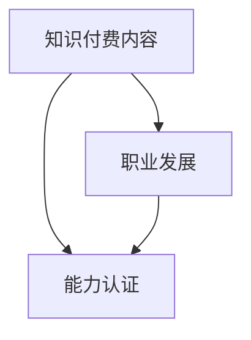

                 

# 知识付费要与职业发展和能力认证相结合

## 1. 背景介绍

### 1.1 问题由来

随着互联网和数字技术的发展，知识付费已经成为了新型的学习和知识传播方式。从在线课程、电子书到专业文章、视频讲座，用户可以轻松获取各种知识和技能，无论是学术研究、职业发展还是个人兴趣，都能找到相应的资源。然而，尽管知识付费市场蓬勃发展，其对职业发展和能力认证的影响仍存在诸多争议。

### 1.2 问题核心关键点

知识付费与职业发展和能力认证的结合，涉及两个核心问题：一是知识付费内容的质量和有效性；二是如何通过认证手段将知识付费成果转化为职业能力和认证资格。前者关乎知识付费的性价比和用户满意度，后者关乎企业和社会对职业能力的认可。

## 2. 核心概念与联系

### 2.1 核心概念概述

为了更好地理解知识付费与职业发展及能力认证的结合，本节将介绍几个密切相关的核心概念：

- **知识付费**：指用户为获取特定知识和技能，通过支付费用获取相应内容和服务的行为。知识付费涵盖了多种形式，如在线课程、电子书、专业文章、视频讲座等。

- **职业发展**：指个人或组织通过获取新的知识和技能，提升自身或组织的竞争力和市场价值的过程。职业发展包括提升技能水平、获取认证资格、增强职业经验等。

- **能力认证**：指通过标准化测试或评估，对个人或组织的能力进行认证，确认其具备从事特定职业或活动所需的技能和知识。能力认证通常由第三方机构或行业协会颁发，具备较高的权威性和可信度。

- **知识付费内容**：指通过知识付费方式获取的知识和技能，包括课程、文章、视频等内容。其质量和有效性直接影响用户的职业发展和能力认证。

- **认证与职业发展结合**：指将知识付费内容与职业发展、能力认证相结合，通过认证手段对知识付费成果进行评估和认可，进一步提升其职业价值和市场竞争力。

### 2.2 核心概念原理和架构的 Mermaid 流程图(Mermaid 流程节点中不要有括号、逗号等特殊字符)



这个流程图展示了几者之间的逻辑关系：

1. **知识付费内容**是职业发展和能力认证的基础，用户通过支付费用获取知识和技能。
2. **职业发展**需要通过学习和应用知识付费内容，提升自身或组织的能力。
3. **能力认证**则是对用户职业能力的评估和认可，进一步提升其市场竞争力。
4. **结合**指将知识付费内容和职业发展、能力认证相结合，形成闭环，提升整体价值。

## 3. 核心算法原理 & 具体操作步骤
### 3.1 算法原理概述

知识付费与职业发展和能力认证的结合，本质上是一种基于内容的学习与认证机制。其核心思想是：通过知识付费获取高质量内容，通过认证手段评估内容对职业发展的贡献，将认证成果转化为职业能力和资格认证。

### 3.2 算法步骤详解

1. **内容选择与学习路径设计**：根据职业发展的需求，选择合适的知识付费内容，设计学习路径和进度计划，确保内容的系统性和相关性。
2. **内容学习与反馈机制**：通过在线课程、视频讲座等方式，学习知识付费内容，同时使用测试和评估工具，实时反馈学习效果和进度。
3. **能力评估与认证申请**：根据职业发展的目标，设计能力评估标准和测试题，评估学习成果。完成评估后，向第三方机构或行业协会提出认证申请，进行资格审核。
4. **认证结果与职业发展**：认证结果的通过与否，直接影响职业发展的进程。通过认证的，可以获得职业资格证书，进一步提升市场价值；未通过的，需继续学习和改进，直至通过。

### 3.3 算法优缺点

**优点**：

1. **内容质量有保障**：通过付费选择高质量的知识付费内容，减少了内容泛泛或无效的困扰。
2. **学习进度可控**：通过设计学习路径和进度计划，提高学习效率和效果，确保职业发展的目标能够按时达成。
3. **认证结果权威**：第三方机构或行业协会颁发的认证证书，具备较高的权威性和可信度，有助于提升职业竞争力和市场认可。

**缺点**：

1. **成本较高**：知识付费和认证申请的费用较高，对部分用户来说可能存在经济压力。
2. **学习效果依赖于内容质量**：内容质量不佳或学习效果不佳，可能导致认证失败，影响职业发展。
3. **认证流程复杂**：认证申请和审核过程可能耗时较长，影响职业发展的时效性。

### 3.4 算法应用领域

知识付费与职业发展和能力认证的结合，在多个领域都得到了广泛应用：

- **IT行业**：通过在线课程、项目实战等方式，学习编程、开发、测试等技术技能，通过认证获得软件开发工程师、系统架构师等职业资格。
- **金融行业**：通过金融分析、投资策略等课程，学习财务分析、风险管理等知识，通过认证获得注册金融分析师、风险管理师等资格。
- **教育行业**：通过教师培训课程，学习教育学、心理学等知识，通过认证获得教师资格。
- **健康行业**：通过医疗技术、护理技能等课程，学习相关知识，通过认证获得执业医师、护理师等资格。

## 4. 数学模型和公式 & 详细讲解 & 举例说明（备注：数学公式请使用latex格式，latex嵌入文中独立段落使用 $$，段落内使用 $)
### 4.1 数学模型构建

设知识付费内容为 $C=\{c_1,c_2,\dots,c_n\}$，用户选择的课程数量为 $k$，每门课程学习进度为 $p_i$，职业发展需求为 $D$。设能力评估标准为 $S$，第三方机构颁发的职业资格为 $Q$。则知识付费与职业发展和能力认证的结合模型为：

$$
\begin{aligned}
&\min_{C,p_i} \sum_{i=1}^{k} p_i \\
&\text{s.t.} \quad \sum_{i=1}^{k} p_i \geq D \\
&\quad \quad C \subseteq S \\
&\quad \quad Q = f(C)
\end{aligned}
$$

其中，$C$ 为选择课程集合，$p_i$ 为课程学习进度，$D$ 为职业发展需求，$S$ 为能力评估标准，$Q$ 为第三方机构颁发的职业资格，$f$ 为认证函数。

### 4.2 公式推导过程

**推导一：学习进度约束**

为了确保职业发展需求 $D$ 得到满足，需满足学习进度约束：

$$
\sum_{i=1}^{k} p_i \geq D
$$

其中，$p_i$ 为课程 $c_i$ 的学习进度，$k$ 为选择的课程数量。

**推导二：能力评估标准**

能力评估标准 $S$ 是知识付费内容与职业发展需求的匹配度。为了确保内容相关性和质量，需满足：

$$
C \subseteq S
$$

其中，$C$ 为选择课程集合，$S$ 为能力评估标准。

**推导三：职业资格认证**

第三方机构颁发的职业资格 $Q$ 是能力评估结果的直接体现。认证函数 $f$ 将能力评估标准 $S$ 映射为职业资格 $Q$，满足：

$$
Q = f(C)
$$

其中，$C$ 为选择课程集合，$Q$ 为第三方机构颁发的职业资格，$f$ 为认证函数。

### 4.3 案例分析与讲解

**案例一：IT行业软件开发工程师认证**

- **内容选择**：选择包含编程语言、软件开发流程、数据结构与算法等课程的组合。
- **学习进度**：设计各课程的学习进度和评估标准，确保掌握核心技能。
- **能力评估**：通过编程测试、项目实战等方式，评估学习成果。
- **职业资格**：通过评估，获得软件开发工程师的职业资格。

**案例二：金融行业注册金融分析师认证**

- **内容选择**：选择包含金融市场分析、投资策略、风险管理等课程的组合。
- **学习进度**：设计各课程的学习进度和评估标准，确保理解金融原理和工具。
- **能力评估**：通过金融分析和模拟考试等方式，评估学习成果。
- **职业资格**：通过评估，获得注册金融分析师的职业资格。

## 5. 项目实践：代码实例和详细解释说明
### 5.1 开发环境搭建

在进行知识付费与职业发展和能力认证结合的项目实践前，我们需要准备好开发环境。以下是使用Python进行相关开发的配置流程：

1. **安装Python环境**：安装最新版本的Python，建议使用虚拟环境管理工具，如Anaconda。
2. **安装依赖库**：安装Python的依赖库，如Pandas、NumPy、SciPy等，用于数据处理和数学计算。
3. **安装Web框架**：安装Flask或Django等Web框架，用于构建在线课程和认证系统。
4. **安装数据库**：安装MySQL或PostgreSQL等数据库，用于存储课程、用户和认证信息。

### 5.2 源代码详细实现

以下是使用Python和Flask框架，实现一个简单的知识付费与职业发展和能力认证结合系统的代码示例：

```python
from flask import Flask, render_template, request
from flask_sqlalchemy import SQLAlchemy
from sqlalchemy import Column, Integer, String
from flask_login import LoginManager, UserMixin, login_user, logout_user, login_required

app = Flask(__name__)
app.config['SQLALCHEMY_DATABASE_URI'] = 'sqlite:///users.db'
db = SQLAlchemy(app)
login_manager = LoginManager()
login_manager.init_app(app)

class User(db.Model, UserMixin):
    id = Column(Integer, primary_key=True)
    username = Column(String(20))
    password = Column(String(20))
    courses = Column(String(200))
    progress = Column(String(200))
    grades = Column(String(200))

@login_manager.user_loader
def load_user(user_id):
    return User.query.get(int(user_id))

@app.route('/')
@login_required
def index():
    user = User.query.get(current_user.id)
    courses = user.courses.split(',')
    progress = user.progress.split(',')
    grades = user.grades.split(',')
    return render_template('index.html', courses=courses, progress=progress, grades=grades)

@app.route('/login', methods=['GET', 'POST'])
def login():
    if request.method == 'POST':
        username = request.form['username']
        password = request.form['password']
        user = User.query.filter_by(username=username, password=password).first()
        login_user(user)
        return redirect('/')
    return render_template('login.html')

@app.route('/logout')
@login_required
def logout():
    logout_user()
    return redirect('/')

@app.route('/register', methods=['GET', 'POST'])
def register():
    if request.method == 'POST':
        username = request.form['username']
        password = request.form['password']
        user = User(username=username, password=password)
        db.session.add(user)
        db.session.commit()
        return redirect('/')
    return render_template('register.html')

@app.route('/take_courses', methods=['GET', 'POST'])
@login_required
def take_courses():
    user = User.query.get(current_user.id)
    courses = []
    for course in user.courses.split(','):
        # 模拟学习进度和评估成绩
        progress = '50%'
        grades = 'B'
        courses.append((course, progress, grades))
    return render_template('courses.html', courses=courses)

@app.route('/submit_course', methods=['POST'])
@login_required
def submit_course():
    user = User.query.get(current_user.id)
    course = request.form['course']
    progress = request.form['progress']
    grades = request.form['grades']
    user.courses += f'{course},'
    user.progress += f'{progress},'
    user.grades += f'{grades},'
    db.session.commit()
    return redirect('/')

if __name__ == '__main__':
    app.run(debug=True)
```

### 5.3 代码解读与分析

**代码解读**：

1. **Flask框架**：使用Flask框架构建Web应用，提供了路由、模板渲染、用户认证等功能。
2. **SQLAlchemy**：使用SQLAlchemy作为ORM，用于管理数据库操作，包括用户、课程和认证信息。
3. **User模型**：定义了用户模型，包含用户名、密码、所选课程、学习进度和评估成绩等字段。
4. **用户认证**：使用Flask-Login扩展，实现用户登录、注销和授权等功能。
5. **路由函数**：定义了登录、注册、课程学习、课程提交和系统首页等路由。

**代码分析**：

1. **用户认证**：实现用户登录、注册和认证功能，确保系统安全。
2. **课程学习**：用户可以查询已选课程、学习进度和评估成绩，提交学习进度和评估成绩。
3. **系统首页**：展示用户所选课程、学习进度和评估成绩，用户可以进一步学习或提交成绩。

### 5.4 运行结果展示

运行上述代码，可以启动Flask应用，访问本地服务器，查看用户所选课程、学习进度和评估成绩。用户可以进行课程选择、学习进度提交和成绩评估，系统自动更新数据库信息。

## 6. 实际应用场景
### 6.1 企业培训系统

知识付费与职业发展和能力认证的结合，在企业培训系统中得到了广泛应用。企业通过在线课程、实战项目等方式，提升员工的技能水平和职业素养。同时，通过认证手段评估员工的学习成果，颁发职业资格证书，增强其市场竞争力。

具体实现上，企业可以开发内部的知识付费和认证平台，将培训课程、实战项目、认证考试等环节有机整合，形成闭环。员工可以在平台上完成课程学习、项目实战和考试认证，逐步提升职业能力，获取职业资格证书。

### 6.2 在线教育平台

在线教育平台通过知识付费与职业发展和能力认证相结合，为学生提供系统的学习和职业指导。平台提供海量高质量的课程资源，涵盖各个领域的知识和技能。学生可以通过付费学习，掌握核心技能，并通过认证考试，获得职业资格证书。

例如，Coursera、edX等在线教育平台，提供了大量认证课程，涵盖计算机科学、商业管理、医学等多个领域。学生通过在线学习课程，参加认证考试，获得相应的职业资格证书，为未来的职业发展奠定基础。

### 6.3 个人职业发展规划

个人职业发展规划中，知识付费与职业发展和能力认证的结合，可以提供更系统、高效的学习路径。个人可以通过知识付费平台，选择与自己职业发展目标相符的课程，进行系统学习和认证，提升职业竞争力。

例如，一个希望成为数据分析师的职场人士，可以通过知识付费平台学习数据分析相关的课程，如Python编程、数据清洗与处理、数据可视化等。通过完成课程学习，参加认证考试，获得数据分析师的职业资格证书，从而提升自己的职业竞争力。

## 7. 工具和资源推荐
### 7.1 学习资源推荐

为了帮助开发者和用户更好地掌握知识付费与职业发展和能力认证的结合，以下是几类推荐的学习资源：

1. **Coursera、edX等在线教育平台**：提供大量高质量的认证课程，涵盖多个领域，适合系统学习和职业发展。
2. **Udacity、Pluralsight等专业技能平台**：提供实战项目和认证考试，通过项目实践提升技能，获得职业资格证书。
3. **Khan Academy等基础教育平台**：提供基础知识和技能的学习资源，适合初学者入门。
4. **LinkedIn Learning等职业发展平台**：提供职业技能和软技能的课程，提升职场竞争力。

这些平台不仅提供了高质量的课程内容，还提供了系统的学习路径和认证机制，帮助用户系统学习和职业发展。

### 7.2 开发工具推荐

知识付费与职业发展和能力认证的结合，需要开发多个模块和功能，以下是几款常用的开发工具：

1. **Flask、Django等Web框架**：用于构建在线课程和认证系统，提供路由、模板渲染、用户认证等功能。
2. **SQLAlchemy等ORM**：用于管理数据库操作，包括用户、课程和认证信息。
3. **Jupyter Notebook**：用于数据分析和模型评估，便于进行课程内容和评估标准的设计。
4. **Python编程语言**：作为开发语言，Python具有丰富的库和框架，便于进行开发和集成。

合理利用这些工具，可以显著提升知识付费与职业发展和能力认证结合的开发效率，加速创新迭代的步伐。

### 7.3 相关论文推荐

知识付费与职业发展和能力认证的结合，是当前教育技术研究的前沿领域，以下是几篇代表性的论文，推荐阅读：

1. "The Future of Work: Job Disruption and the Role of AI and Automation" - World Economic Forum：探讨人工智能和自动化对未来就业的影响，强调终身学习和职业发展的必要性。
2. "Lifelong Learning in the Era of AI: Challenges, Opportunities, and Strategies" - International Journal of Technology in Education：分析人工智能时代终身学习的挑战和策略，强调知识付费和能力认证的重要性。
3. "The Effects of Microcredentials on Employer Perceptions of Applicant Skill" - Journal of Vocational Behavior：研究微认证对雇主对求职者技能评价的影响，探讨微认证的实用性和市场认可度。
4. "Knowledge Economy and Lifelong Learning: A Review of Research" - Journal of Technology and Human Interaction：总结知识经济时代终身学习的理论和实践，强调知识付费和职业发展的必要性。

这些论文代表了大规模知识付费与职业发展和能力认证结合的研究脉络，帮助读者理解这一领域的最新进展和未来趋势。

## 8. 总结：未来发展趋势与挑战
### 8.1 研究成果总结

知识付费与职业发展和能力认证的结合，已经在多个领域得到了广泛应用，并取得了显著的效果。通过系统学习高质量的知识付费内容，并通过认证考试，用户可以提升职业技能，增强职业竞争力。

### 8.2 未来发展趋势

展望未来，知识付费与职业发展和能力认证的结合，将呈现以下几个发展趋势：

1. **个性化学习路径**：根据用户的职业发展需求，推荐个性化的课程和学习路径，提高学习效率和效果。
2. **实时学习反馈**：通过在线学习平台和认证系统，提供实时反馈和评估，帮助用户及时调整学习策略。
3. **跨领域技能认证**：开发跨领域技能认证标准，打破学科和行业的界限，提升职业技能的通用性。
4. **终身学习平台**：构建终身学习平台，提供持续的课程更新和认证服务，支持用户职业发展的全生命周期。
5. **技能共享社区**：建立技能共享社区，鼓励用户分享学习经验和技术知识，促进知识传播和职业发展。

### 8.3 面临的挑战

尽管知识付费与职业发展和能力认证的结合已经取得一定成效，但仍面临诸多挑战：

1. **课程质量和认证标准**：高质量的课程内容和科学的认证标准是用户职业发展的关键。如何确保课程内容的高质量和认证标准的科学性，需要持续改进和完善。
2. **用户参与度和持续性**：用户参与度不高和持续性不足，会影响学习效果和职业发展的进程。如何提高用户参与度和持续性，需要设计和优化用户体验。
3. **市场认可度**：认证结果的市场认可度直接影响用户职业发展的实际效果。如何提高认证结果的市场认可度，需要与行业标准和市场需求紧密结合。
4. **技术和平台稳定**：在线学习平台和认证系统的稳定性和安全性，直接影响用户的学习体验和职业发展的信心。如何提高技术和平台稳定性，需要持续优化和升级。

### 8.4 研究展望

面对知识付费与职业发展和能力认证结合面临的挑战，未来的研究需要在以下几个方面寻求新的突破：

1. **课程内容优化**：开发高质量的课程内容，确保其与职业发展需求相匹配，提升学习效果。
2. **认证机制创新**：探索科学合理的认证机制，结合在线测试、项目评估等多种手段，提升认证结果的权威性和可信度。
3. **技术平台优化**：提升在线学习平台和认证系统的稳定性和安全性，提供实时反馈和数据支持，增强用户的学习体验和职业发展的信心。
4. **跨领域协作**：加强行业协会、教育机构、企业等各方面的协作，建立跨领域技能认证标准，推动知识付费与职业发展相结合的普及和应用。

这些研究方向将有助于进一步提升知识付费与职业发展和能力认证结合的效果，推动教育技术的进步和职业发展的新趋势。

## 9. 附录：常见问题与解答

**Q1：知识付费与职业发展和能力认证结合的优缺点是什么？**

A: **优点**：
1. **系统学习**：通过高质量的知识付费内容，用户可以获得系统性的学习和知识。
2. **职业发展**：通过认证考试，获得职业资格证书，提升职业竞争力。
3. **持续学习**：在线学习平台和认证系统支持终身学习，满足职业发展的全生命周期需求。

**缺点**：
1. **成本较高**：知识付费和认证申请的费用较高，对部分用户来说可能存在经济压力。
2. **学习效果依赖内容质量**：内容质量不佳或学习效果不佳，可能导致认证失败，影响职业发展。
3. **认证流程复杂**：认证申请和审核过程可能耗时较长，影响职业发展的时效性。

**Q2：如何选择合适的知识付费内容？**

A: **选择标准**：
1. **匹配职业需求**：选择与职业发展需求相匹配的课程内容，确保学习的相关性和有效性。
2. **选择权威平台**：选择知名平台提供的高质量课程，确保内容的可靠性和权威性。
3. **参考用户评价**：参考其他用户的学习评价和反馈，选择评价高、口碑好的课程。

**Q3：知识付费与职业发展和能力认证结合的实施步骤是什么？**

A: **实施步骤**：
1. **选择课程**：根据职业发展需求，选择与职业目标相匹配的课程内容。
2. **进行学习**：利用在线课程平台，完成课程学习和实践项目。
3. **参加认证**：完成学习后，参加认证考试，获取职业资格证书。
4. **应用成果**：将认证成果应用于职业发展中，提升市场竞争力。

**Q4：知识付费与职业发展和能力认证结合的案例有哪些？**

A: **案例一**：IT行业软件开发工程师认证
- **课程选择**：选择包含编程语言、软件开发流程、数据结构与算法等课程的组合。
- **学习进度**：设计各课程的学习进度和评估标准，确保掌握核心技能。
- **能力评估**：通过编程测试、项目实战等方式，评估学习成果。
- **职业资格**：通过评估，获得软件开发工程师的职业资格。

**案例二**：金融行业注册金融分析师认证
- **课程选择**：选择包含金融市场分析、投资策略、风险管理等课程的组合。
- **学习进度**：设计各课程的学习进度和评估标准，确保理解金融原理和工具。
- **能力评估**：通过金融分析和模拟考试等方式，评估学习成果。
- **职业资格**：通过评估，获得注册金融分析师的职业资格。

通过上述分析和案例展示，可以更加全面地理解知识付费与职业发展和能力认证相结合的实施路径和效果。相信在未来，这一结合方式将进一步推动教育技术的进步和职业发展的普及。

