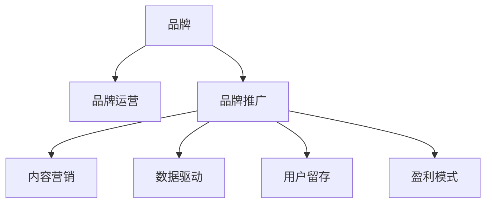

                 

# 知识付费赚钱的品牌品牌运营与品牌推广策略

> 关键词：知识付费,品牌运营,品牌推广,盈利模式,内容营销,用户留存,数据驱动

## 1. 背景介绍

在数字化转型的大背景下，知识付费成为一种新兴的商业模式，吸引了大量用户和资本的关注。与传统的线下培训和教育不同，知识付费以互联网为媒介，将高质量内容打包成课程、电子书、音频、视频等形式，通过付费订阅、单次购买等方式提供给用户。近年来，知识付费市场规模不断扩大，但同时面临着用户流失率高、复购率低等问题。为了提升盈利能力，品牌需要通过有效的品牌运营与品牌推广策略，增强用户粘性，提升市场份额，实现可持续发展。

## 2. 核心概念与联系

### 2.1 核心概念概述

为了更好地理解品牌品牌运营与品牌推广策略，本节将介绍几个关键概念：

- **品牌（Brand）**：是企业或产品特有识别和区分的符号，由名称、标志、设计、口号等多个元素组成。品牌是企业价值和文化的重要体现，对用户购买决策具有显著影响。
- **品牌运营（Brand Operation）**：是品牌从设计、推广、维护到提升的全过程。通过市场调研、用户反馈、竞争对手分析等方式，不断优化品牌策略，确保品牌价值与市场定位一致。
- **品牌推广（Brand Promotion）**：是品牌运营的重要环节，通过多种渠道（如社交媒体、搜索引擎、KOL合作等）传播品牌信息，提升品牌知名度和美誉度。
- **知识付费（Knowledge Pay-to-Access）**：指用户为获取高质量内容而支付费用的商业模式。知识付费依赖于内容质量和用户体验，注重教育与商业的平衡。
- **盈利模式（Revenue Model）**：指企业在运营过程中所采取的盈利方式，如单次付费、订阅制、会员制等。合理的盈利模式能够帮助品牌在市场竞争中保持优势。
- **内容营销（Content Marketing）**：利用高质量内容吸引用户，提升品牌价值和市场影响力。内容营销注重内容的质量、创意和实用性，用户需求导向。
- **用户留存（User Retention）**：指用户持续使用服务或产品的比例。高用户留存率是知识付费品牌长期发展的关键。
- **数据驱动（Data-Driven）**：利用大数据和分析工具，对用户行为、市场趋势等进行科学决策，提升品牌运营效率。

这些概念之间的联系可以通过以下Mermaid流程图来展示：



这个流程图展示了品牌运营与品牌推广的核心流程和各环节之间的关系：品牌运营是品牌推广的基础，通过内容营销和数据驱动实现品牌价值提升，最终达到用户留存和盈利目的。品牌推广则是品牌运营的具体实施，通过多样化的推广渠道提高品牌知名度和美誉度。

## 3. 核心算法原理 & 具体操作步骤

### 3.1 算法原理概述

品牌运营与品牌推广策略的核心在于通过科学的方法和工具，提升品牌价值和市场影响力，实现盈利目标。其算法原理主要包括以下几个方面：

- **用户行为分析（User Behavior Analysis）**：利用数据挖掘技术，对用户行为数据进行建模和分析，了解用户需求和偏好，指导品牌策略的制定。
- **市场趋势预测（Market Trend Prediction）**：通过时间序列分析、回归模型等技术，对市场趋势进行预测，帮助品牌抓住机会，规避风险。
- **内容推荐系统（Content Recommendation System）**：基于用户历史行为数据和内容特征，推荐用户感兴趣的内容，提升用户体验和品牌粘性。
- **广告投放优化（Ad Placement Optimization）**：利用机器学习算法，优化广告投放策略，最大化广告效果和品牌曝光。
- **社交媒体分析（Social Media Analysis）**：通过社交媒体数据挖掘，了解用户对品牌的情感和态度，指导品牌传播策略的调整。

### 3.2 算法步骤详解

品牌运营与品牌推广的算法步骤可以分为以下几个阶段：

**Step 1: 数据收集与预处理**
- 收集用户行为数据、市场数据、社交媒体数据等，形成数据集。
- 清洗和整理数据，去除噪音和异常值，确保数据质量。

**Step 2: 特征提取与建模**
- 提取有价值的用户行为特征和市场特征，如用户浏览记录、购买历史、社交媒体情感等。
- 利用机器学习算法，建立用户行为模型、市场趋势模型等。

**Step 3: 策略制定与执行**
- 根据模型预测结果和市场分析，制定品牌运营和推广策略。
- 执行策略，如调整广告投放计划、优化内容推荐算法等。

**Step 4: 效果评估与优化**
- 定期评估品牌推广效果，如品牌知名度、用户留存率等。
- 根据评估结果，不断优化品牌运营策略，提升品牌竞争力。

### 3.3 算法优缺点

品牌运营与品牌推广策略的算法具有以下优点：
- 数据驱动：通过数据挖掘和分析，指导品牌运营决策，提升决策科学性。
- 精准营销：利用机器学习算法，优化广告投放和内容推荐，提高营销效果。
- 实时响应：算法能够快速响应市场变化，灵活调整品牌策略。

同时，这些算法也存在一些局限性：
- 数据隐私：大量数据收集和分析可能涉及用户隐私，需严格遵守数据保护法规。
- 模型复杂性：高精度模型需要大量的计算资源和数据支持，算法复杂度较高。
- 依赖数据质量：算法结果依赖于数据质量，数据偏差可能影响结果准确性。
- 动态变化：市场环境不断变化，需要持续优化算法，保持品牌竞争力。

### 3.4 算法应用领域

品牌运营与品牌推广策略的算法广泛应用于以下领域：

- **电子商务**：通过分析用户购买行为和偏好，推荐商品，提升转化率和复购率。
- **社交媒体**：通过情感分析和社会网络分析，了解用户对品牌的情感和行为，指导品牌传播策略。
- **在线教育**：利用内容推荐和数据分析，提升学习体验和满意度，提高用户留存率。
- **健康医疗**：通过用户健康数据和医疗信息，提供个性化健康建议和医疗服务。
- **金融服务**：利用市场趋势分析和用户行为数据，提供理财建议和风险管理服务。
- **旅游出行**：通过分析用户旅游偏好和行为数据，推荐旅游路线和目的地，提升用户体验。

## 4. 数学模型和公式 & 详细讲解 & 举例说明

### 4.1 数学模型构建

品牌运营与品牌推广的数学模型主要包括以下几个部分：

- **用户行为模型（User Behavior Model）**：利用时间序列分析、回归模型等，对用户行为进行建模。
- **市场趋势模型（Market Trend Model）**：通过时间序列分析、机器学习等技术，对市场趋势进行预测。
- **内容推荐模型（Content Recommendation Model）**：基于协同过滤、深度学习等算法，推荐用户感兴趣的内容。
- **广告投放模型（Ad Placement Model）**：利用线性回归、逻辑回归等算法，优化广告投放策略。
- **社交媒体情感分析模型（Social Media Sentiment Analysis Model）**：通过文本挖掘、情感分析等技术，了解用户对品牌的情感和态度。

### 4.2 公式推导过程

以用户行为模型为例，假设用户行为数据为 $x_i$，行为标签为 $y_i$，其中 $i$ 表示样本编号。我们利用线性回归模型对用户行为进行预测，模型公式为：

$$
y_i = \beta_0 + \beta_1x_{i1} + \beta_2x_{i2} + ... + \beta_nx_{in}
$$

其中，$\beta_0, \beta_1, ..., \beta_n$ 为模型参数，$x_{i1}, x_{i2}, ..., x_{in}$ 为用户行为特征。利用最小二乘法求解模型参数，公式为：

$$
\beta = (X^TX)^{-1}X^Ty
$$

其中，$X$ 为特征矩阵，$y$ 为目标向量。

### 4.3 案例分析与讲解

假设某知识付费平台希望通过用户行为模型预测用户是否会续费。该平台收集了用户注册时间、购买课程数量、学习时间等行为数据，建立线性回归模型。模型训练数据集为 10000 个用户的行为数据，测试数据集为 5000 个用户的行为数据。使用均方误差（MSE）作为模型评估指标，模型训练过程如下：

1. 数据预处理：对用户行为数据进行归一化和标准化处理。
2. 特征提取：选择注册时间、购买课程数量、学习时间等关键特征。
3. 模型训练：利用训练数据集对模型进行训练，求解模型参数。
4. 模型评估：利用测试数据集对模型进行评估，计算 MSE 指标。

通过不断迭代优化模型，平台最终得到了一个预测准确率较高的用户行为模型。该模型在预测用户续费行为方面，取得了显著效果。

## 5. 项目实践：代码实例和详细解释说明

### 5.1 开发环境搭建

在进行品牌运营与品牌推广策略的开发时，需要准备以下开发环境：

1. Python 3.7 及以上版本。
2. 安装 Pandas、NumPy、Scikit-learn、TensorFlow 等数据处理和机器学习库。
3. 安装 Jupyter Notebook，方便进行数据处理和模型训练。

### 5.2 源代码详细实现

以下是一个简单的品牌运营与品牌推广策略的代码实现示例：

```python
import pandas as pd
from sklearn.linear_model import LinearRegression
from sklearn.metrics import mean_squared_error

# 数据读取
data = pd.read_csv('user_behavior.csv')

# 数据预处理
features = data[['registration_time', 'purchase_course_count', 'study_time']]
labels = data['is_renew']
features = features.fillna(features.mean())
features = (features - features.mean()) / features.std()

# 模型训练
model = LinearRegression()
model.fit(features, labels)

# 模型评估
test_data = pd.read_csv('test_user_behavior.csv')
test_features = test_data[['registration_time', 'purchase_course_count', 'study_time']]
test_features = test_features.fillna(test_features.mean())
test_features = (test_features - test_features.mean()) / test_features.std()
predictions = model.predict(test_features)
mse = mean_squared_error(test_labels, predictions)
print('MSE:', mse)
```

### 5.3 代码解读与分析

该代码实现了一个简单的用户行为模型，具体步骤如下：

1. 数据读取：使用 Pandas 库读取用户行为数据，存储在 DataFrame 对象中。
2. 数据预处理：对特征数据进行归一化和标准化处理，去除噪音和异常值。
3. 模型训练：使用线性回归模型对用户行为进行建模，求解模型参数。
4. 模型评估：对测试数据集进行预测，计算均方误差指标，评估模型性能。

### 5.4 运行结果展示

运行上述代码后，可以得到模型在测试数据集上的均方误差指标，用于评估模型的预测效果。

## 6. 实际应用场景

### 6.1 品牌运营的实际应用场景

在知识付费平台中，品牌运营主要涉及以下几个方面：

- **用户画像分析**：通过用户行为数据，建立用户画像，了解用户特征和需求，指导产品设计和市场推广。
- **用户反馈处理**：收集用户反馈信息，分析用户满意度和不满意度原因，优化产品和服务。
- **竞争对手分析**：分析竞争对手的品牌策略和市场表现，调整自身品牌策略。
- **渠道管理**：优化渠道资源配置，提升渠道效果，拓展新渠道。

### 6.2 品牌推广的实际应用场景

品牌推广是品牌运营的具体实施，通过以下方式提升品牌知名度和美誉度：

- **内容营销**：发布高质量内容，吸引用户关注和参与，提升品牌影响力。
- **社交媒体营销**：利用社交媒体平台，传播品牌信息，增强用户互动。
- **广告投放**：通过精准广告投放，提高品牌曝光和用户转化率。
- **KOL合作**：与知名 KOL 合作，利用其影响力推广品牌。
- **公关活动**：举办品牌活动，提高品牌曝光和用户关注度。

## 7. 工具和资源推荐

### 7.1 学习资源推荐

为了深入理解品牌运营与品牌推广策略，这里推荐一些优质的学习资源：

1. 《数字营销圣经》：一本系统介绍数字营销原理和策略的书籍，涵盖品牌建设、广告投放、内容营销等多个方面。
2. 《品牌运营实战》：一本实战性较强的品牌运营指南，结合实际案例，提供品牌运营的实操建议。
3. 《品牌管理》课程：由知名高校开设的品牌管理课程，提供系统的品牌管理知识和案例分析。
4. 《用户行为分析》课程：介绍用户行为分析的基本原理和应用方法，适合对数据驱动品牌运营感兴趣的用户。
5. 《内容营销》课程：介绍内容营销的基本策略和实施方法，帮助品牌提升用户粘性和市场影响力。

通过这些资源的学习，可以全面掌握品牌运营与品牌推广策略的理论基础和实践技巧。

### 7.2 开发工具推荐

高效的开发离不开优秀的工具支持。以下是几款用于品牌运营与品牌推广策略开发的常用工具：

1. Python：灵活的数据处理和算法实现语言，广泛用于数据科学和机器学习领域。
2. Pandas：强大的数据处理库，提供数据清洗、转换、分析等功能。
3. Scikit-learn：开源机器学习库，提供丰富的算法和工具，方便模型开发和评估。
4. TensorFlow：开源深度学习框架，支持大规模模型训练和部署。
5. Jupyter Notebook：交互式笔记本环境，方便数据处理和模型训练。
6. Tableau：数据可视化工具，帮助品牌管理者直观了解数据和市场表现。
7. Google Analytics：流量分析工具，提供详细的用户行为数据，指导品牌运营。

合理利用这些工具，可以显著提升品牌运营与品牌推广策略的开发效率，加快创新迭代的步伐。

### 7.3 相关论文推荐

品牌运营与品牌推广策略的研究源于学界的持续研究。以下是几篇奠基性的相关论文，推荐阅读：

1. "Brand Equity and Corporate Finance"：探讨品牌价值对企业财务表现的影响，分析品牌运营的重要意义。
2. "Digital Marketing and Brand Management"：分析数字时代品牌运营的挑战和机遇，提出品牌推广的新思路。
3. "User Behavior Modeling in E-commerce"：介绍用户行为建模的基本方法，提供品牌运营的数据支持。
4. "Content Marketing for Brands"：讨论内容营销对品牌价值提升的影响，提供具体实施策略。
5. "Brand Promotion in Social Media"：分析社交媒体平台对品牌推广的影响，提出优化策略。

这些论文代表了大语言模型微调技术的发展脉络。通过学习这些前沿成果，可以帮助研究者把握学科前进方向，激发更多的创新灵感。

## 8. 总结：未来发展趋势与挑战

### 8.1 总结

本文对品牌运营与品牌推广策略进行了全面系统的介绍。首先阐述了知识付费品牌运营与品牌推广的重要性，明确了微调在提升品牌价值和市场影响力方面的独特价值。其次，从原理到实践，详细讲解了品牌运营与品牌推广的数学模型和具体实施步骤，给出了品牌运营与品牌推广策略的完整代码实例。同时，本文还广泛探讨了品牌运营与品牌推广在知识付费领域的应用场景，展示了微调范式的巨大潜力。

通过本文的系统梳理，可以看到，品牌运营与品牌推广策略在大语言模型微调技术的应用中发挥了重要作用。这些方法的引入，使得知识付费品牌能够在市场竞争中占据优势，提升盈利能力和用户满意度。未来，伴随知识付费市场的持续扩大和竞争加剧，品牌运营与品牌推广策略还将迎来更多的发展机遇和挑战。

### 8.2 未来发展趋势

展望未来，品牌运营与品牌推广策略的发展趋势将包括以下几个方面：

1. **个性化推荐系统**：利用深度学习算法，对用户行为进行更精细化的分析，提供个性化的内容和推广方案，提升用户体验和满意度。
2. **实时数据分析**：通过实时数据处理和分析，对市场变化进行快速响应，优化品牌运营策略。
3. **用户情感分析**：利用自然语言处理技术，对用户情感和反馈进行实时监测和分析，指导品牌传播策略的调整。
4. **多渠道融合**：通过跨渠道数据整合和分析，提升品牌信息的一致性和用户粘性。
5. **区块链技术应用**：利用区块链技术，确保品牌数据的透明性和安全性，提升品牌信任度。

### 8.3 面临的挑战

尽管品牌运营与品牌推广策略已经取得了瞩目成就，但在迈向更加智能化、普适化应用的过程中，它仍面临诸多挑战：

1. **数据隐私保护**：品牌运营和推广需要大量用户数据，如何保护用户隐私，避免数据泄露，是一个重要问题。
2. **算法复杂性**：高精度模型需要大量的计算资源和数据支持，如何降低算法复杂性，提高模型效率，是未来研究的重要方向。
3. **市场变化快**：市场环境变化迅速，品牌运营和推广策略需要持续优化和调整，如何应对快速变化的市场环境，是一个难点。
4. **用户粘性不足**：部分用户对品牌缺乏忠诚度，如何提升用户粘性，增加用户生命周期价值，是一个亟待解决的问题。
5. **竞争加剧**：知识付费市场竞争激烈，如何突出品牌差异，建立品牌竞争优势，是一个重要的课题。

### 8.4 研究展望

面对品牌运营与品牌推广策略所面临的种种挑战，未来的研究需要在以下几个方面寻求新的突破：

1. **用户行为分析的新方法**：引入更多先进的数据分析技术，如深度学习、时间序列分析等，提升用户行为模型的准确性。
2. **个性化推荐系统的优化**：探索新的推荐算法和模型结构，提升个性化推荐的效果和速度。
3. **实时数据分析的优化**：引入实时数据处理技术，如流式计算、分布式计算等，提高数据分析的实时性和准确性。
4. **区块链技术在品牌运营中的应用**：探索区块链技术在品牌数据管理和信任构建中的应用，提升品牌信任度和用户满意度。
5. **社交媒体情感分析的深入研究**：利用自然语言处理和情感分析技术，深入分析用户情感和反馈，指导品牌传播策略的调整。

这些研究方向的探索，必将引领品牌运营与品牌推广策略迈向更高的台阶，为构建安全、可靠、可解释、可控的智能品牌运营系统铺平道路。面向未来，品牌运营与品牌推广策略还需要与其他人工智能技术进行更深入的融合，如知识表示、因果推理、强化学习等，多路径协同发力，共同推动品牌运营与品牌推广技术的进步。只有勇于创新、敢于突破，才能不断拓展品牌运营与品牌推广的边界，让智能品牌运营技术更好地造福用户。

## 9. 附录：常见问题与解答

**Q1：品牌运营与品牌推广策略是否适用于所有知识付费品牌？**

A: 品牌运营与品牌推广策略可以在大多数知识付费品牌中应用，特别是那些具有较高市场竞争力和用户粘性的品牌。但需要注意的是，不同品牌的市场定位和用户需求不同，需要针对性地制定品牌运营和推广策略。

**Q2：如何确定品牌运营与品牌推广策略的优先级？**

A: 品牌运营与品牌推广策略的优先级应根据品牌的实际情况和市场环境进行确定。一般来说，对于新兴品牌，品牌推广的优先级更高，以快速提升品牌知名度；而对于已经具有一定市场基础的品牌，品牌运营的优先级则更为关键，以保持用户粘性和品牌竞争力。

**Q3：在品牌运营与品牌推广过程中，如何平衡用户隐私与品牌利益？**

A: 品牌运营与品牌推广需要收集大量用户数据，因此必须严格遵守数据隐私保护法规，如GDPR等。可以通过匿名化处理、去标识化技术等方式，保护用户隐私。同时，也可以与用户建立信任关系，透明化数据使用方式，增强用户对品牌的信任度。

**Q4：如何评估品牌运营与品牌推广策略的效果？**

A: 品牌运营与品牌推广策略的效果评估可以通过多个指标进行，如品牌知名度、用户留存率、市场份额、销售额等。可以通过A/B测试、用户反馈、市场调研等方式进行评估，不断优化策略，提升品牌竞争力。

**Q5：品牌运营与品牌推广策略是否适用于线上线下结合的品牌？**

A: 品牌运营与品牌推广策略同样适用于线上线下结合的品牌。线上品牌推广可以通过社交媒体、搜索引擎、内容营销等方式提升品牌知名度，线下活动则可以通过品牌体验、产品展示等方式增强用户粘性。两者的结合可以实现品牌价值的最大化。

---

作者：禅与计算机程序设计艺术 / Zen and the Art of Computer Programming

