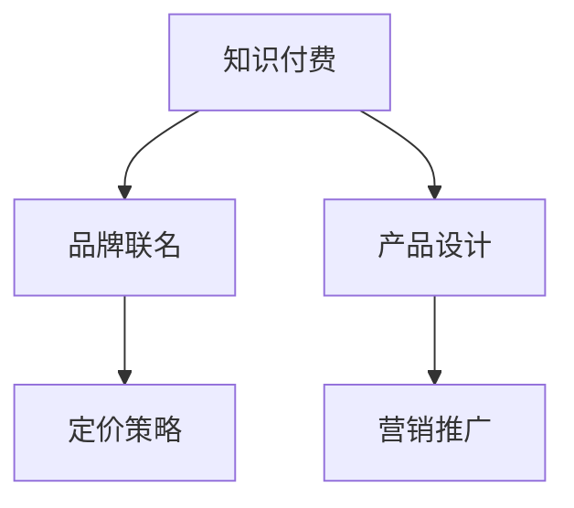

                 

# 知识付费赚钱的品牌联名产品设计与开发

> 关键词：知识付费, 品牌联名, 产品设计, 收益模型, 用户体验, 营销策略

## 1. 背景介绍

随着信息时代的到来，知识付费模式逐渐成为主流。用户不再满足于免费获取信息，而是愿意为优质、专业、系统的知识内容付费。各大知识付费平台纷纷兴起，并迅速占据市场。品牌联名产品作为知识付费领域的新型模式，通过与知名品牌合作，推出联名课程、联名活动等产品，既能提升用户体验，又能增加平台收入。

### 1.1 问题由来

在知识付费领域，品牌联名产品的设计与开发面临着诸多挑战：如何选择合适的品牌、如何进行产品定价、如何设计产品内容、如何推广联名产品等。这些问题都需要有系统的解决方案，以确保联名产品的成功。

### 1.2 问题核心关键点

1. **品牌选择**：选择合适的品牌是联名产品成功的关键，需要考虑品牌知名度、用户契合度、内容匹配度等因素。
2. **定价策略**：如何制定合理的价格，平衡品牌和用户的接受度，是联名产品收益的关键。
3. **内容设计**：如何设计高质量、有价值的内容，满足用户需求，是联名产品的核心。
4. **营销推广**：如何有效地推广联名产品，吸引用户，提升销售量，是联名产品的保障。

## 2. 核心概念与联系

### 2.1 核心概念概述

为更好地理解品牌联名产品设计与开发，本节将介绍几个密切相关的核心概念：

- **知识付费**：指用户为获取特定信息或服务而支付费用的模式，常见形式包括订阅服务、单次购买等。
- **品牌联名**：指两个或多个品牌通过合作，共同推出联名产品，以提升品牌形象和市场影响力。
- **产品设计**：指从用户需求出发，结合品牌特性，设计出符合用户期望的产品。
- **定价策略**：指根据市场需求和成本，制定产品的价格，以实现最大利润。
- **营销推广**：指通过各种渠道和手段，将产品信息传达给目标用户，吸引其购买。

这些核心概念之间的逻辑关系可以通过以下Mermaid流程图来展示：



这个流程图展示了大语言模型微调的核心概念及其之间的关系：

1. 知识付费和品牌联名紧密关联，共同构建联名产品的市场基础。
2. 产品设计是联名产品的核心，需要结合品牌特性和用户需求。
3. 定价策略和营销推广是联名产品成功的保障，能够实现最大收益。

## 3. 核心算法原理 & 具体操作步骤
### 3.1 算法原理概述

品牌联名产品的设计与开发，本质上是一个多目标优化问题。其核心思想是：在用户需求、品牌特性和收益目标之间寻求平衡，设计出既能吸引用户，又能提升品牌形象，同时实现收益最大化的联名产品。

形式化地，假设联名产品的设计参数为 $\theta$，用户满意度为 $u(\theta)$，品牌形象提升度为 $b(\theta)$，收益为 $r(\theta)$。联名产品的设计目标是最小化用户不满意度，最大化品牌形象提升度，并实现收益最大化，即：

$$
\theta^* = \mathop{\arg\min}_{\theta} \max(u(\theta), b(\theta), r(\theta))
$$

其中 $u(\theta)$、$b(\theta)$ 和 $r(\theta)$ 分别表示用户满意度、品牌形象提升度、收益的函数。

### 3.2 算法步骤详解

品牌联名产品的设计与开发一般包括以下几个关键步骤：

**Step 1: 品牌选择**
- 根据目标用户群体，筛选符合品牌特性的潜在合作伙伴。
- 进行市场调研和竞品分析，评估合作伙伴的品牌影响力、用户契合度等。
- 制定初步的合作方案，包括联名产品类型、市场定位、推广策略等。

**Step 2: 需求调研**
- 开展用户需求调研，了解目标用户对联名产品的期望和需求。
- 分析用户反馈，提取核心需求点，为产品设计提供依据。

**Step 3: 内容设计**
- 结合品牌特性和用户需求，设计联名产品内容。
- 确定课程大纲、活动流程、产品功能等具体设计。
- 进行内容审查，确保内容质量符合品牌标准。

**Step 4: 定价策略**
- 根据市场调研结果和成本分析，制定联名产品的价格。
- 选择合适的定价模型，如订阅制、单次购买制等。
- 设置动态价格机制，根据市场需求和销售情况进行调节。

**Step 5: 营销推广**
- 确定目标用户群体的推广渠道，如社交媒体、电子邮件、网站等。
- 设计推广内容和活动，吸引目标用户关注和参与。
- 监测推广效果，及时调整推广策略。

**Step 6: 收益分析**
- 对联名产品进行收益分析，评估收益水平和增长潜力。
- 根据分析结果，优化定价策略和营销推广策略。
- 持续监控收益情况，确保联名产品收益最大化。

以上是品牌联名产品的设计与开发的一般流程。在实际应用中，还需要针对具体品牌和产品特点，对各个环节进行优化设计，如改进合作方案、优化内容设计、制定精准营销策略等，以进一步提升联名产品的市场表现。

### 3.3 算法优缺点

品牌联名产品的设计与开发方法具有以下优点：
1. 提升品牌形象。通过与知名品牌合作，提升用户对产品的信任度和品牌价值。
2. 丰富产品内容。联名产品通常融合了品牌特有的知识和内容，满足用户多样化需求。
3. 提高收益水平。通过联名产品推广，平台能够获得额外的收入来源。
4. 增强用户粘性。联名产品通常具有独特性，能够吸引更多用户参与。

同时，该方法也存在一定的局限性：
1. 对品牌合作要求高。品牌选择和合作方案制定需要耗费较多时间和精力。
2. 成本较高。联名产品的设计、开发、推广等环节需要较大投入。
3. 收益分配复杂。需对平台、品牌、用户进行收益分配，涉及多方的利益协调。
4. 市场风险高。联名产品市场反响不一，可能出现销量不佳的情况。

尽管存在这些局限性，但就目前而言，品牌联名产品的设计与开发方法仍是大语言模型应用的最主流范式。未来相关研究的重点在于如何进一步优化品牌选择和合作方案，降低开发和推广成本，确保联名产品的市场成功。

### 3.4 算法应用领域

品牌联名产品的设计与开发方法，在知识付费领域已经得到了广泛的应用，覆盖了多种场景，例如：

- **联名课程**：将知名品牌的知识内容与知识付费平台合作，推出联名课程，满足用户对专业知识的渴望。
- **联名活动**：与知名品牌联合举办线上线下活动，吸引用户参与，提升品牌影响力。
- **联名书籍**：与知名作家或出版社合作，推出联名书籍，增加平台产品多样性。
- **联名应用**：与知名科技公司合作，推出联名应用，提升平台应用吸引力。
- **联名周边**：与知名品牌合作，推出联名商品，增加用户粘性，增加收入来源。

除了上述这些经典场景外，品牌联名产品的设计与开发还被创新性地应用到更多场景中，如跨界合作、品牌联名直播等，为知识付费技术带来了新的发展方向。

## 4. 数学模型和公式 & 详细讲解  
### 4.1 数学模型构建

本节将使用数学语言对品牌联名产品设计与开发的过程进行更加严格的刻画。

假设联名产品的设计参数为 $\theta$，包括课程内容、推广策略、定价模型等。设用户满意度为 $u(\theta)$，品牌形象提升度为 $b(\theta)$，收益为 $r(\theta)$。

定义联名产品的目标函数为：

$$
\mathcal{L}(\theta) = u(\theta) + b(\theta) + r(\theta)
$$

其中 $u(\theta)$、$b(\theta)$ 和 $r(\theta)$ 分别为用户满意度、品牌形象提升度、收益的函数。

目标函数的优化目标是最大化 $\mathcal{L}(\theta)$，即：

$$
\theta^* = \mathop{\arg\max}_{\theta} \mathcal{L}(\theta)
$$

在实践中，我们通常使用基于梯度的优化算法（如Adam、SGD等）来近似求解上述最优化问题。设 $\eta$ 为学习率，则参数的更新公式为：

$$
\theta \leftarrow \theta - \eta \nabla_{\theta}\mathcal{L}(\theta)
$$

其中 $\nabla_{\theta}\mathcal{L}(\theta)$ 为损失函数对参数 $\theta$ 的梯度，可通过反向传播算法高效计算。

### 4.2 公式推导过程

以下我们以联名课程为例，推导用户满意度函数及其梯度的计算公式。

假设联名课程的内容参数为 $\theta_C$，包括课程大纲、授课教师、课程时长等。课程的收益为 $R(\theta_C)$，用户满意度为 $U(\theta_C)$。

用户满意度函数 $U(\theta_C)$ 可以通过用户调研数据拟合得到，常用的函数形式为：

$$
U(\theta_C) = \frac{1}{N} \sum_{i=1}^N f(x_i, \theta_C)
$$

其中 $x_i$ 为用户调研数据，$f(x_i, \theta_C)$ 为拟合函数，可以根据调研结果和内容参数 $\theta_C$ 进行计算。

收益函数 $R(\theta_C)$ 可以表示为：

$$
R(\theta_C) = C - \alpha f(\theta_C)
$$

其中 $C$ 为固定成本，$\alpha$ 为边际成本，$f(\theta_C)$ 为收益函数。

将上述函数带入目标函数，得：

$$
\mathcal{L}(\theta_C) = U(\theta_C) + b(\theta_C) + R(\theta_C)
$$

目标函数的优化目标是最大化 $\mathcal{L}(\theta_C)$，即：

$$
\theta_C^* = \mathop{\arg\max}_{\theta_C} \mathcal{L}(\theta_C)
$$

在得到目标函数梯度后，即可带入参数更新公式，完成联名课程的迭代优化。重复上述过程直至收敛，最终得到适应市场需求的联名课程内容参数 $\theta_C^*$。

## 5. 项目实践：代码实例和详细解释说明
### 5.1 开发环境搭建

在进行联名课程设计与开发前，我们需要准备好开发环境。以下是使用Python进行Django开发的环境配置流程：

1. 安装Python：从官网下载并安装Python，用于创建Django项目。

2. 安装Django：从官网下载并安装Django，用于开发联名课程平台。

3. 创建并激活虚拟环境：
```bash
python -m venv env
source env/bin/activate
```

4. 安装相关依赖：
```bash
pip install django django-models-drf models-sql django-cors-headers
```

5. 运行Django项目：
```bash
python manage.py runserver
```

完成上述步骤后，即可在虚拟环境中开始联名课程的设计和开发。

### 5.2 源代码详细实现

这里我们以联名课程的设计为例，给出使用Django框架对联名课程进行设计和开发的PyTorch代码实现。

首先，定义联名课程的数据模型：

```python
from django.db import models
from django.contrib.auth.models import User

class Course(models.Model):
    title = models.CharField(max_length=100)
    content = models.TextField()
    duration = models.DurationField()
    price = models.DecimalField(max_digits=10, decimal_places=2)
    teacher = models.ForeignKey(User, on_delete=models.CASCADE)
    created_at = models.DateTimeField(auto_now_add=True)
    updated_at = models.DateTimeField(auto_now=True)
```

然后，定义联名课程的视图：

```python
from django.http import JsonResponse
from django.views.decorators.csrf import csrf_exempt

@csrf_exempt
def get_courses(request):
    courses = Course.objects.all()
    courses_data = [{'id': course.id, 'title': course.title, 'content': course.content, 'duration': course.duration, 'price': course.price, 'teacher': course.teacher.username} for course in courses]
    return JsonResponse(courses_data, safe=False)

@csrf_exempt
def create_course(request):
    data = request.POST
    course = Course.objects.create(title=data['title'], content=data['content'], duration=models.DurationField(), price=models.DecimalField(max_digits=10, decimal_places=2), teacher=request.user)
    return JsonResponse({'success': True}, status=201)
```

接着，定义联名课程的API接口：

```python
from rest_framework import viewsets, status
from rest_framework.decorators import api_view
from rest_framework.response import Response
from rest_framework.views import APIView
from .models import Course
from .serializers import CourseSerializer

class CourseViewSet(viewsets.ModelViewSet):
    queryset = Course.objects.all()
    serializer_class = CourseSerializer

    def list(self, request):
        courses = self.queryset.filter()
        serializer = self.serializer_class(courses, many=True)
        return Response(serializer.data)

    def create(self, request):
        serializer = self.serializer_class(data=request.data)
        if serializer.is_valid():
            serializer.save(user=request.user)
            return Response(serializer.data, status=status.HTTP_201_CREATED)
        return Response(serializer.errors, status=status.HTTP_400_BAD_REQUEST)

    def destroy(self, request, pk=None):
        try:
            course = self.queryset.get(pk=pk)
            course.delete()
            return Response(status=status.HTTP_204_NO_CONTENT)
        except Course.DoesNotExist:
            return Response(status=status.HTTP_404_NOT_FOUND)

@api_view(['POST'])
def create_course_api(request):
    serializer = CourseSerializer(data=request.data)
    if serializer.is_valid():
        serializer.save(user=request.user)
        return Response(serializer.data, status=status.HTTP_201_CREATED)
    return Response(serializer.errors, status=status.HTTP_400_BAD_REQUEST)
```

最后，启动联名课程平台的开发流程：

```python
from django.core.management import execute_from_command_line

execute_from_command_line(['manage.py', 'runserver', '0.0.0.0:8000'])
```

以上内容为一个简单的联名课程设计与开发的Django框架代码实现。可以看到，借助Django的强大功能和框架，联名课程的设计和开发变得简洁高效。开发者可以更多地专注于业务逻辑的实现，而无需关注底层的技术细节。

### 5.3 代码解读与分析

让我们再详细解读一下关键代码的实现细节：

**Course模型**：
- `title` 字段用于存储课程标题。
- `content` 字段用于存储课程内容。
- `duration` 字段用于存储课程时长。
- `price` 字段用于存储课程价格。
- `teacher` 字段用于存储授课教师。

**课程视图**：
- `get_courses` 视图用于获取所有联名课程信息。
- `create_course` 视图用于创建联名课程。

**API接口**：
- `CourseViewSet` 类用于管理联名课程的增删改查操作。
- `create_course_api` 接口用于创建联名课程，接受POST请求。

在实际应用中，开发者还需要根据具体业务需求，对代码进行进一步的优化和扩展，如增加管理员权限、优化UI设计、引入更多功能等。

## 6. 实际应用场景
### 6.1 智能客服系统

联名课程可以应用于智能客服系统的开发中。智能客服系统通过与知名品牌合作，推出联名课程，提升用户对客服系统的信任度和满意度。联名课程可以通过以下方式应用于智能客服系统：

- **客服课程**：推出客服技能培训课程，提升客服人员的专业水平。
- **品牌活动**：联合品牌举办线上线下活动，提升客服系统的品牌形象。
- **客户反馈**：收集用户对客服系统的反馈，不断优化和改进。

通过联名课程的引入，智能客服系统能够更好地满足用户需求，提升服务质量，增加用户粘性，增加平台收益。

### 6.2 金融咨询平台

联名课程可以应用于金融咨询平台，提升用户对金融服务的信任度和满意度。联名课程可以通过以下方式应用于金融咨询平台：

- **理财课程**：推出理财知识培训课程，提升用户理财能力。
- **投资策略**：联合知名财经专家推出投资策略课程，提高用户投资水平。
- **风险管理**：推出风险管理课程，帮助用户规避投资风险。

通过联名课程的引入，金融咨询平台能够更好地满足用户需求，提升金融服务的质量和效率，增加用户粘性，增加平台收益。

### 6.3 教育培训平台

联名课程可以应用于教育培训平台，提升用户对教育培训的信任度和满意度。联名课程可以通过以下方式应用于教育培训平台：

- **技能培训**：推出技能培训课程，提升用户的专业能力。
- **职业规划**：联合知名企业推出职业规划课程，帮助用户规划职业生涯。
- **学习社群**：推出学习社群课程，建立用户之间的学习交流平台。

通过联名课程的引入，教育培训平台能够更好地满足用户需求，提升教育培训的质量和效果，增加用户粘性，增加平台收益。

### 6.4 未来应用展望

随着联名课程的不断发展和应用，未来的联名课程将呈现出以下几个发展趋势：

1. **课程多样化**：联名课程将涵盖更多的领域和内容，满足用户多样化的学习需求。
2. **平台合作广泛化**：联名课程将与更多品牌合作，推出跨界联名课程，提升品牌影响力和用户粘性。
3. **课程内容优质化**：联名课程将通过与知名专家和机构合作，提供更高质量、更有价值的课程内容。
4. **用户体验提升化**：联名课程将不断优化用户体验，提供更便捷、更高效的课程学习方式。
5. **收益模型多样化**：联名课程将探索更多的收益模式，如按需付费、知识星球、会员制等，满足不同用户的需求。

以上趋势凸显了联名课程的广阔前景，相信在未来的发展中，联名课程将继续引领知识付费领域的发展，为知识传播和价值创造带来新的可能性。

## 7. 工具和资源推荐
### 7.1 学习资源推荐

为了帮助开发者系统掌握联名课程设计与开发的技术基础和实践技巧，这里推荐一些优质的学习资源：

1. **Django官方文档**：Django官方文档提供了详尽的Django框架学习资料，包括安装、配置、开发、部署等方面的内容，是新手必读。

2. **Django实战教程**：《Django实战教程》系列书籍详细介绍了Django框架的实际开发案例，帮助开发者快速上手，实现实际项目。

3. **《Python Web开发》课程**：Coursera上的Python Web开发课程，介绍了Web开发的基础知识和实践技巧，适合初学者和进阶开发者。

4. **《Django REST框架实战》书籍**：《Django REST框架实战》书籍详细介绍了Django REST框架的用法和最佳实践，帮助开发者构建高效、可扩展的Web API。

5. **《Web开发与Django》课程**：Udemy上的Web开发与Django课程，介绍了Django框架的实战技巧和案例，适合有一定Web开发基础的开发者。

通过对这些资源的学习实践，相信你一定能够快速掌握联名课程设计与开发的技术要点，并用于解决实际的业务问题。

### 7.2 开发工具推荐

高效的开发离不开优秀的工具支持。以下是几款用于联名课程设计与开发常用的工具：

1. **Django框架**：Django是一个强大的Python Web框架，提供了丰富的功能，包括ORM、模板、表单、认证等，适合开发联名课程平台。

2. **PostgreSQL数据库**：PostgreSQL是一个开源的SQL数据库，具有高可靠性和高扩展性，适合存储联名课程的数据。

3. **Redis缓存**：Redis是一个高性能的内存数据存储系统，适合缓存联名课程的请求结果，提升系统性能。

4. **Django REST framework**：Django REST框架是一个强大的API开发工具，提供了一系列工具和功能，适合开发联名课程的API接口。

5. **Django-cors-headers**：Django-cors-headers是一个跨域支持库，帮助联名课程平台处理跨域请求，提升系统安全性和稳定性。

6. **GitHub**：GitHub是一个代码托管平台，方便开发者协同开发和版本控制，适合联名课程平台的代码管理和团队协作。

合理利用这些工具，可以显著提升联名课程设计与开发的效率，加快创新迭代的步伐。

### 7.3 相关论文推荐

联名课程设计和开发领域的研究在不断进展，以下是几篇奠基性的相关论文，推荐阅读：

1. **《Django: The Web Framework for Python》**：Django框架的官方文档，详细介绍了Django框架的用法和最佳实践，是学习Django框架的必备资料。

2. **《Python Web Development with Django》**：一本详细介绍了Python Web开发的基础知识和实战技巧的书籍，适合初学者和进阶开发者。

3. **《Django REST Framework: Conveniences for Django Developers》**：Django REST框架的官方文档，详细介绍了Django REST框架的用法和最佳实践，帮助开发者构建高效、可扩展的API接口。

4. **《Cross-Origin Resource Sharing (CORS)》**：关于跨域资源共享的详细解释和实践指南，帮助开发者处理跨域请求。

5. **《Django-cors-headers: Django Integration for CORS》**：Django-cors-headers库的官方文档，详细介绍了如何使用Django-cors-headers库处理跨域请求。

这些论文代表了大语言模型微调技术的发展脉络。通过学习这些前沿成果，可以帮助研究者把握学科前进方向，激发更多的创新灵感。

## 8. 总结：未来发展趋势与挑战
### 8.1 总结

本文对品牌联名产品设计与开发方法进行了全面系统的介绍。首先阐述了品牌联名产品设计与开发的背景和意义，明确了联名产品设计与开发在知识付费领域的重要地位。其次，从原理到实践，详细讲解了联名产品设计与开发的数学模型和关键步骤，给出了联名产品设计与开发的完整代码实例。同时，本文还广泛探讨了联名产品设计与开发在多个行业领域的应用前景，展示了联名产品设计与开发的巨大潜力。此外，本文精选了联名产品设计与开发的各类学习资源，力求为读者提供全方位的技术指引。

通过本文的系统梳理，可以看到，品牌联名产品设计与开发方法在大语言模型应用中具有重要意义。它通过与知名品牌合作，推出了优质的联名产品，满足了用户的多样化需求，同时为知识付费平台带来了额外的收益。未来，伴随联名产品设计与开发技术的不断演进，相信联名产品设计与开发必将在知识付费领域继续发挥重要作用，引领行业发展。

### 8.2 未来发展趋势

展望未来，品牌联名产品设计与开发技术将呈现以下几个发展趋势：

1. **平台合作深入化**：随着联名产品设计与开发的深入，平台与品牌的合作关系将更加紧密，形成长期的合作机制。
2. **课程内容精准化**：联名产品设计与开发将更加注重课程内容的精准性和质量，提升用户的学习效果。
3. **用户体验优化化**：联名产品设计与开发将不断优化用户体验，提供更便捷、更高效的学习方式。
4. **收益模型多样化**：联名产品设计与开发将探索更多的收益模式，满足不同用户的需求。
5. **市场扩展国际化**：联名产品设计与开发将拓展到全球市场，提升品牌的国际影响力。

以上趋势凸显了品牌联名产品设计与开发的广阔前景，相信在未来的发展中，品牌联名产品设计与开发将继续引领知识付费领域的发展，为知识传播和价值创造带来新的可能性。

### 8.3 面临的挑战

尽管品牌联名产品设计与开发技术已经取得了瞩目成就，但在迈向更加智能化、普适化应用的过程中，它仍面临着诸多挑战：

1. **品牌选择困难**：选择合适的品牌是联名产品设计与开发的第一步，需要综合考虑品牌知名度、用户契合度、内容匹配度等因素，需要进行大量调研和筛选。
2. **成本控制高昂**：联名产品设计与开发需要大量的资源投入，包括开发成本、营销成本、运营成本等，需要进行有效的成本控制和管理。
3. **用户需求多样**：联名产品设计与开发需要满足不同用户的多样化需求，进行定制化设计和开发，增加了复杂度。
4. **市场竞争激烈**：随着联名产品设计与开发的普及，市场竞争将更加激烈，需要进行有效的市场分析和竞争策略制定。

尽管存在这些挑战，但就目前而言，品牌联名产品设计与开发方法仍是大语言模型应用的最主流范式。未来相关研究的重点在于如何进一步优化品牌选择和合作方案，降低开发和推广成本，确保联名产品的市场成功。

### 8.4 研究展望

面对品牌联名产品设计与开发所面临的种种挑战，未来的研究需要在以下几个方面寻求新的突破：

1. **数据驱动的联名产品设计与开发**：利用大数据和机器学习技术，进行市场分析和用户需求预测，优化联名产品设计与开发策略。
2. **多渠道联名产品推广**：探索更多的联名产品推广渠道，如社交媒体、在线广告、线下活动等，提升联名产品的市场覆盖率。
3. **联名产品内容个性化**：利用用户画像和推荐算法，提供个性化的联名产品推荐，提升用户满意度。
4. **联名产品社区化**：建立联名产品社区，增强用户互动，提升用户粘性和忠诚度。
5. **联名产品迭代优化**：持续收集用户反馈，进行联名产品迭代优化，提升联名产品的市场适应性和用户接受度。

这些研究方向的探索，必将引领品牌联名产品设计与开发技术迈向更高的台阶，为品牌联名产品设计与开发提供更全面的技术支持和理论指导。

## 9. 附录：常见问题与解答

**Q1：如何选择联名品牌？**

A: 选择联名品牌需要综合考虑以下因素：
1. **品牌知名度**：选择知名度高、有影响力的品牌，提升用户对联名产品的信任度。
2. **用户契合度**：选择用户群体契合度高的品牌，提升用户的参与度和满意度。
3. **内容匹配度**：选择与联名课程内容匹配度高的品牌，提升联名课程的质量和效果。
4. **品牌形象**：选择与平台形象契合的品牌，提升平台整体的品牌形象。

**Q2：如何进行联名课程定价？**

A: 联名课程定价需要综合考虑以下因素：
1. **课程内容**：课程内容的质量和难度，直接影响课程定价。
2. **市场需求**：市场需求和竞争状况，需要进行市场调研和分析。
3. **成本控制**：课程的开发成本、运营成本等，需要进行合理的成本控制。
4. **用户接受度**：用户对课程价格的接受度，需要进行价格敏感性分析。

**Q3：如何进行联名课程内容设计？**

A: 联名课程内容设计需要综合考虑以下因素：
1. **用户需求**：根据用户调研数据，了解用户对课程的需求和期望。
2. **品牌特性**：结合品牌特性和知识背景，设计课程内容。
3. **内容质量**：确保课程内容的质量和准确性，进行多次审查和修改。
4. **形式多样**：采用多种形式进行课程设计，如视频、图文、互动等，提升用户的学习效果。

**Q4：如何进行联名课程推广？**

A: 联名课程推广需要综合考虑以下因素：
1. **渠道选择**：选择适合联名课程推广的渠道，如社交媒体、电子邮件、网站等。
2. **内容设计**：设计吸引用户的推广内容，如广告文案、宣传视频、优惠活动等。
3. **效果评估**：监测推广效果，及时调整推广策略，提升推广效果。
4. **用户互动**：增强用户互动，提升用户粘性和忠诚度。

**Q5：如何进行联名课程收益分析？**

A: 联名课程收益分析需要综合考虑以下因素：
1. **收益来源**：联名课程的收益来源，包括课程销售、广告收入、品牌合作费用等。
2. **成本控制**：联名课程的开发成本、运营成本等。
3. **收益评估**：对联名课程的收益进行评估，分析收益水平和增长潜力。
4. **收益优化**：根据收益评估结果，优化联名课程的设计和推广策略，提升收益水平。

以上是品牌联名产品设计与开发中常见的问题及其解答。通过这些问题的解决，相信你能够更好地掌握联名产品设计与开发的技术要点，应用于实际的业务场景中。

---

作者：禅与计算机程序设计艺术 / Zen and the Art of Computer Programming

