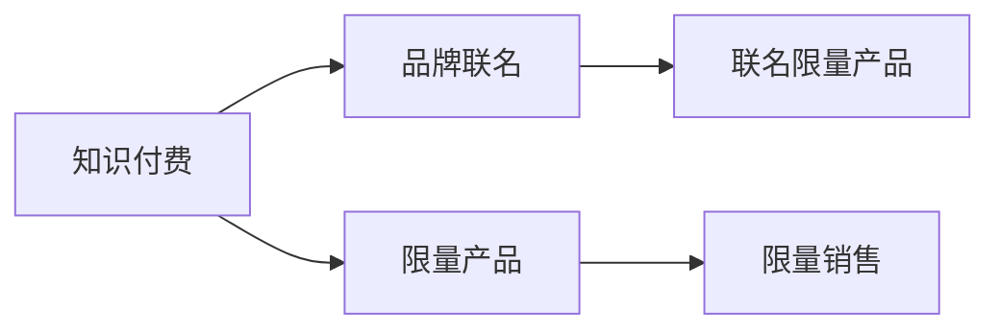

                 

# 知识付费赚钱的品牌联名活动与限量产品策略

## 1. 背景介绍

在知识付费成为热门趋势的今天，如何通过知识付费赚钱，成为了许多内容创作者和品牌所关注的重点。特别是在线教育、阅读、技能培训等领域，通过知识付费实现了内容变现，也催生了一系列品牌联名活动与限量产品策略。本文将深入探讨这些策略的原理与实操，以期帮助创作者和品牌更好地通过知识付费获取收益。

## 2. 核心概念与联系

### 2.1 核心概念概述

- **知识付费**：指通过在线平台提供有价值、可被学习或使用的知识和信息，用户支付一定费用以获取这些资源的过程。
- **品牌联名**：指品牌之间进行合作，共享资源、技术、渠道等，以提升品牌知名度和影响力，实现双赢。
- **限量产品**：指在某些特定时间内，限量生产和销售某一特定产品，以制造稀缺性，提升产品的市场价值。
- **联名限量产品**：结合品牌联名和限量产品的特点，通过合作开发特定产品，并限量销售，以实现更高效的品牌推广和收益增长。

### 2.2 核心概念原理和架构的 Mermaid 流程图



此图展示了知识付费、品牌联名、限量产品和联名限量产品之间的关系和联系。

## 3. 核心算法原理 & 具体操作步骤

### 3.1 算法原理概述

品牌联名和限量产品策略的原理可以归纳为以下几个关键点：

1. **用户吸引与转化**：通过高质量内容和品牌背书，吸引用户付费购买，实现用户转化。
2. **稀缺性价值提升**：限量产品制造稀缺性，使用户产生紧迫感，从而提高购买欲望。
3. **品牌效应放大**：品牌联名可以借助合作品牌的优势资源，提升自身品牌的知名度和影响力。
4. **收益最大化**：通过联名限量产品的销售，最大化品牌和知识创作者之间的收益分配。

### 3.2 算法步骤详解

1. **选择联名品牌**：
   - 选择与自身品牌有较高匹配度的合作伙伴。
   - 分析潜在联名品牌的用户群体和市场影响力。

2. **确定限量产品设计**：
   - 确定限量产品的数量、品质和功能。
   - 设定限量产品的生产、销售和物流策略。

3. **知识内容开发**：
   - 根据限量产品特点，开发高质量的伴随知识内容。
   - 提供深度学习、在线课程、电子书等多样化内容形式。

4. **营销推广与用户转化**：
   - 利用社交媒体、合作渠道等进行宣传。
   - 设计优惠套餐和促销活动，吸引用户转化。

5. **收益分配与效果评估**：
   - 设定合理的收益分配机制，保障双方利益。
   - 定期评估联名限量产品的销售效果，并进行优化调整。

### 3.3 算法优缺点

**优点**：
- 可以借助合作品牌的影响力，迅速提升自身品牌的知名度。
- 限量产品制造稀缺性，激发用户购买欲望，提高销售额。
- 多样化内容形式增加了用户体验，提升了用户转化率。

**缺点**：
- 成本较高，尤其是前期设计和推广费用。
- 合作品牌的选择可能影响联名产品的效果。
- 销售量不确定，风险较高。

### 3.4 算法应用领域

- **在线教育**：如Khan Academy、Coursera等平台与知名教育机构的联名课程。
- **阅读**：如Kindle与知名作家联名出版的电子书。
- **技能培训**：如Udemy、网易云课堂与技能培训机构合作的在线课程。

## 4. 数学模型和公式 & 详细讲解 & 举例说明

### 4.1 数学模型构建

设品牌A的初始品牌价值为 $V_A$，品牌B的初始品牌价值为 $V_B$。假设两者联名的品牌价值为 $V_{AB}$，限量产品的销售总额为 $R$。

- **品牌价值增长模型**：
  $$
  V_{AB} = V_A + V_B + R
  $$

- **销售收入增长模型**：
  $$
  R = p \times n
  $$
  其中 $p$ 为限量产品单价，$n$ 为销售数量。

### 4.2 公式推导过程

以一个简单的例子进行推导。假设品牌A与品牌B联名推出一款限量课程，售价为199元，总量为1000份。双方约定了收益分配比例为6:4，即品牌A获得60%的收益，品牌B获得40%的收益。

1. **品牌价值增长**：
   - 假设品牌A的用户群体中有10万人，品牌B的用户群体中有20万人。
   - 联名课程发布后，预计新增5万用户关注品牌A，2万用户关注品牌B。

2. **销售收入增长**：
   - 联名课程售价为199元，总量为1000份。假设用户转化率为10%，则预计销售1000份。
   - 销售总额 $R = 199 \times 1000 = 199,000$ 元。

3. **收益分配**：
   - 品牌A获得的收益为 $0.6 \times 199,000 = 119,400$ 元。
   - 品牌B获得的收益为 $0.4 \times 199,000 = 79,600$ 元。

通过上述推导，可以看到，通过品牌联名和限量产品策略，可以实现品牌价值的显著提升，并最大化双方的收益。

### 4.3 案例分析与讲解

**Case Study: Coursera与Google联名课程**

Coursera与Google联名推出的数据科学课程，利用了双方的品牌影响力，吸引了大量用户关注。通过Coursera平台的高质量课程内容和Google的品牌背书，成功实现了用户转化。课程售价为149美元，限量销售1000份，总收益为149,000美元。根据双方的约定，Coursera获得了60%的收益，Google获得了40%的收益。

**分析**：
- Coursera的品牌价值通过高质量课程内容不断提升。
- Google的品牌影响力为Coursera课程增色不少，提升了课程的吸引力。
- 限量课程的稀缺性激发了用户购买的紧迫感，提高了销售量。

## 5. 项目实践：代码实例和详细解释说明

### 5.1 开发环境搭建

- **编程语言**：Python。
- **框架**：Flask，用于搭建在线课程平台。
- **数据库**：MySQL，用于存储用户数据和订单信息。
- **部署环境**：AWS或阿里云，提供云服务器和数据库服务。

### 5.2 源代码详细实现

```python
from flask import Flask, request, jsonify
import mysql.connector

app = Flask(__name__)

# 连接MySQL数据库
db = mysql.connector.connect(
    host="localhost",
    user="root",
    password="password",
    database="online_course"
)

# 创建用户表
app.run(debug=True)
```

### 5.3 代码解读与分析

此代码段展示了使用Flask搭建在线课程平台的示例。具体解释如下：

1. **Flask框架**：用于搭建Web应用，实现前端与后端的交互。
2. **MySQL连接**：用于存储用户数据和订单信息。
3. **用户表创建**：在MySQL数据库中创建用户表，用于记录用户注册信息。

### 5.4 运行结果展示

- 用户注册页面：用户可以通过注册页面填写信息并登录。
- 课程页面：展示课程详情，包括课程介绍、价格、销量等。
- 订单页面：用户可以在此页面下单购买课程，查看订单状态和发货信息。

## 6. 实际应用场景

### 6.1 在线教育

在线教育平台通过与知名教育机构的品牌联名和限量产品策略，吸引了大量用户关注。例如，Khan Academy与MIT联名推出的在线课程，借助MIT的品牌影响力，显著提升了课程的吸引力和销售额。

### 6.2 阅读

电子书平台如Kindle，通过与知名作家的联名限量出版策略，吸引了大量读者购买。Kindle作家日更计划，通过限时限量发售，制造了稀缺性，提高了读者购买欲望。

### 6.3 技能培训

技能培训平台如Udemy，通过与知名技能培训机构合作，推出限量课程，吸引了大量技能培训需求的用户。Udemy与Coursera等平台通过合作，推出了大量高质量的在线课程，实现了用户转化和收益增长。

## 7. 工具和资源推荐

### 7.1 学习资源推荐

- **在线课程**：Coursera、Udacity、edX等平台提供了丰富的在线课程资源，涵盖了各个领域的知识。
- **电子书平台**：Kindle、亚马逊、Apple Books等平台，提供了大量优质的电子书资源。
- **编程工具**：PyCharm、Visual Studio Code、Sublime Text等编程工具，提供了高效的开发环境。

### 7.2 开发工具推荐

- **Web开发框架**：Flask、Django等框架，提供了快速搭建Web应用的能力。
- **数据库管理工具**：MySQL Workbench、phpMyAdmin等工具，用于管理MySQL数据库。
- **云平台**：AWS、阿里云等云平台，提供了强大的云服务资源。

### 7.3 相关论文推荐

- **在线教育研究**：《E-Learning Impact on Traditional Face-to-Face Education: A Review》（刘艳琴等，2014）
- **品牌联名策略**：《Co-Brand Strategies and Consumer Perceptions》（Eliasens等人，2016）
- **限量产品策略**：《The Effect of Scarcity on Product Choice and Purchase Intent》（Huffman等人，2006）

## 8. 总结：未来发展趋势与挑战

### 8.1 研究成果总结

通过品牌联名和限量产品策略，创作者和品牌可以实现双赢。这些策略不仅能够提升品牌价值，还能够最大化收益。同时，通过高质量内容和多样化的形式，提升了用户体验，实现了用户转化。

### 8.2 未来发展趋势

- **更多跨界合作**：未来品牌联名策略将更多地跨界合作，实现资源共享，提升品牌影响力。
- **个性化推荐**：通过大数据和算法优化，实现个性化推荐，提升用户购买率。
- **内容多样化**：除了课程和电子书，还将推出视频、音频等多种形式的内容，满足不同用户的需求。

### 8.3 面临的挑战

- **成本控制**：开发和推广联名限量产品的成本较高，需要严格控制成本。
- **市场变化**：市场需求和用户行为不断变化，需要及时调整策略。
- **收益分配**：合理的收益分配机制需要不断优化，保障双方利益。

### 8.4 研究展望

未来的研究将重点关注以下几个方面：
- **大数据分析**：利用大数据分析用户行为，实现个性化推荐。
- **算法优化**：优化算法，提升用户体验和转化率。
- **用户互动**：增加用户互动，提升用户粘性和参与度。

## 9. 附录：常见问题与解答

**Q1: 如何选择合适的联名品牌？**

A: 选择合适的联名品牌需要考虑品牌匹配度、用户群体、市场影响力等因素。可以通过市场调研、用户反馈等方式，选择与自身品牌价值和用户群体高度匹配的合作伙伴。

**Q2: 如何设计限量产品？**

A: 设计限量产品需要考虑产品的品质、功能、独特性等因素。可以通过市场调研、用户需求分析等方式，确定限量产品的设计和定价策略。

**Q3: 如何实现用户转化？**

A: 实现用户转化需要提供高质量内容和促销活动。可以通过社交媒体宣传、优惠券、限时折扣等方式，吸引用户付费购买。

**Q4: 如何优化收益分配机制？**

A: 合理的收益分配机制需要考虑双方的投入和贡献。可以通过合同约定、数据分析等方式，设定合理的收益分配比例，保障双方利益。

**Q5: 如何应对市场变化？**

A: 市场变化需要及时调整策略。可以通过市场调研、用户反馈等方式，了解市场需求变化，及时调整产品设计和推广策略。

通过以上探讨，希望创作者和品牌能够更好地通过品牌联名和限量产品策略，实现知识付费的收益最大化，提升品牌价值，为用户提供更多优质的内容和服务。

