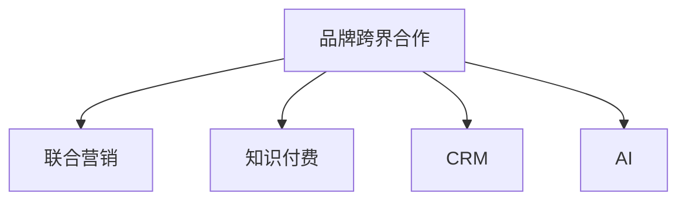

                 

# 知识付费赚钱的品牌跨界合作与联合营销

> 关键词：知识付费, 品牌跨界合作, 联合营销, 数字化转型, 用户价值, 客户关系管理(CRM), 人工智能(AI)

## 1. 背景介绍

### 1.1 问题由来

在数字化时代的浪潮下，知识付费逐渐成为用户获取知识、提升自我能力的普遍方式。然而，仅依靠单一平台或单项内容已经难以满足用户日益增长的多样化需求。为此，知识付费平台开始寻求跨界合作，与各类品牌、企业进行联合营销，进一步提升用户价值，探索新的盈利模式。

在这一背景下，品牌跨界合作与联合营销应运而生。通过跨界合作，知识付费平台不仅可以拓展自身的内容和应用场景，还能在品牌、用户和收益之间建立更加紧密的联系，实现互利共赢。本文将深入探讨品牌跨界合作与联合营销的核心概念、核心算法和操作步骤，同时结合实际案例，提供详细的代码实现和运行结果展示。

### 1.2 问题核心关键点

品牌跨界合作与联合营销的核心在于如何有效整合资源，增强用户粘性，提升品牌价值。关键点包括：
1. **品牌选择与定位**：选择合适的合作伙伴，确定合作的定位和目标。
2. **用户价值提升**：通过跨界合作提供更加丰富、有价值的内容和服务。
3. **联合营销策略**：制定有效的营销策略，确保双方利益最大化。
4. **数据驱动决策**：利用数据分析优化合作效果，提升营销精准度。
5. **用户体验优化**：确保用户在使用过程中获得良好的体验，增强忠诚度。

## 2. 核心概念与联系

### 2.1 核心概念概述

为更好地理解品牌跨界合作与联合营销的机制，本节将介绍几个密切相关的核心概念：

- **品牌跨界合作**：指不同领域的品牌之间通过合作，实现资源共享、优势互补，从而提升品牌影响力和市场竞争力。

- **联合营销**：指两个或多个品牌共同进行市场推广活动，通过资源整合和协同营销，提升品牌知名度和市场占有率。

- **知识付费**：指用户通过付费获取有价值的知识内容，以提升自身知识和技能水平。

- **客户关系管理(CRM)**：指通过数据分析和管理，提高客户满意度，增强客户忠诚度，从而实现长期价值。

- **人工智能(AI)**：指利用机器学习和深度学习等技术，实现数据的自动化处理和分析，提升决策的精准度。

这些概念之间的逻辑关系可以通过以下Mermaid流程图来展示：



这个流程图展示了一系列概念的相互联系和作用：

1. 品牌跨界合作是联合营销的基础，通过资源整合实现协同效应。
2. 联合营销通过品牌合作提升市场竞争力，知识付费则提供用户价值。
3. CRM和AI分别通过管理和分析，增强客户关系和提升决策效率。

这些概念共同构成了品牌跨界合作与联合营销的基本框架，使得知识付费平台能够更有效地提升用户价值，实现商业价值的最大化。

## 3. 核心算法原理 & 具体操作步骤

### 3.1 算法原理概述

品牌跨界合作与联合营销的核心算法原理在于最大化品牌协同效应和用户价值。其核心思想是：通过选择合适的合作伙伴，结合自身平台优势，设计合理的营销策略，实现资源的最优配置和使用。

具体来说，品牌跨界合作与联合营销的目标是：
1. **品牌协同效应最大化**：通过品牌间的合作，增强品牌之间的互补性，提升品牌知名度和美誉度。
2. **用户价值最大化**：通过联合营销提供更有价值的内容和服务，提升用户体验和忠诚度。
3. **收益最大化**：通过合理的营销策略，实现收益的最大化。

### 3.2 算法步骤详解

品牌跨界合作与联合营销的算法步骤主要包括以下几个关键环节：

**Step 1: 选择合作伙伴**

- 根据品牌定位和用户需求，选择目标品牌进行合作。
- 分析潜在合作伙伴的品牌影响力、用户群体、业务模式等关键因素。
- 制定合作的初步方案，明确双方的职责和权利。

**Step 2: 确定合作内容**

- 根据合作目标，确定具体的合作内容，如联合课程、联合活动、联合广告等。
- 设计独特的合作内容，提升用户参与度和体验。
- 制定详细的合作计划，包括时间安排、资源分配等。

**Step 3: 制定联合营销策略**

- 根据合作内容，制定合理的联合营销策略，如联名课程推广、联合促销活动等。
- 利用数据分析，预测营销效果，优化策略方案。
- 确定营销渠道，确保营销信息能够覆盖目标用户群体。

**Step 4: 实施营销活动**

- 根据营销策略，实施联合营销活动，并及时跟踪效果。
- 利用AI技术，实时分析用户反馈和数据，调整优化营销方案。
- 利用CRM系统，管理用户数据，提升用户体验。

**Step 5: 效果评估与反馈**

- 在营销活动结束后，对效果进行评估，分析用户反馈和数据。
- 根据评估结果，总结经验教训，优化后续合作方案。
- 与合作伙伴共享评估结果，共同提升品牌竞争力。

以上是品牌跨界合作与联合营销的一般流程。在实际应用中，还需要根据具体合作内容和市场环境，对各环节进行优化和调整，以实现最佳效果。

### 3.3 算法优缺点

品牌跨界合作与联合营销具有以下优点：
1. **提升品牌影响力**：通过与知名品牌合作，提升自身品牌的知名度和美誉度。
2. **扩大用户群体**：通过品牌合作，吸引更多用户参与，扩大用户基础。
3. **增强用户体验**：通过提供更有价值的内容和服务，提升用户体验和忠诚度。
4. **优化收益结构**：通过联合营销，实现收益的最大化，优化收益结构。

同时，该方法也存在一定的局限性：
1. **合作复杂性高**：选择合适的合作伙伴和设计合理的合作方案，需要较高的市场洞察力和项目管理能力。
2. **营销风险高**：营销效果受市场环境、用户偏好等因素影响较大，存在一定的不确定性。
3. **资源协调难**：跨品牌合作需要协调各方资源，可能存在沟通和执行上的困难。
4. **数据分析复杂**：需要利用AI和大数据技术，对用户数据进行深入分析，以优化营销策略。

尽管存在这些局限性，但就目前而言，品牌跨界合作与联合营销仍是大品牌提升市场竞争力和用户价值的有效手段。未来相关研究的重点在于如何进一步降低合作复杂性，提高营销效率和精准度。

### 3.4 算法应用领域

品牌跨界合作与联合营销在多个领域都得到了广泛应用，如：

- **教育领域**：教育平台与知名品牌联合推出在线课程，提供更加丰富和高质量的教育内容。
- **医疗领域**：医疗机构与健康品牌合作，推出健康课程和产品，提升用户健康意识和健康水平。
- **时尚领域**：时尚品牌与运动品牌合作，推出联名运动装备，吸引更多时尚和运动爱好者。
- **科技领域**：科技公司与金融品牌合作，推出智能理财课程，提升用户科技素养和理财能力。
- **文化领域**：文化机构与旅游品牌合作，推出文化旅游课程，推广文化旅游产品。

这些领域中的品牌跨界合作与联合营销，不仅提升了品牌的市场竞争力，还为用户提供了更加丰富和有价值的服务，进一步促进了品牌和用户的紧密互动。

## 4. 数学模型和公式 & 详细讲解 & 举例说明

### 4.1 数学模型构建

为了更好地理解品牌跨界合作与联合营销的数学模型，本节将使用数学语言对营销效果进行量化分析。

假设知识付费平台与品牌A进行合作，共同推出联名课程。设联名课程的初始用户数为 $U_0$，课程总曝光量为 $E$，用户转化率为 $r$，用户留存率为 $s$。

设平台在合作期间新增用户数为 $N$，品牌A提供的资源量为 $R$，品牌A对课程的推广效果为 $\beta$。则合作效果可以表示为：

$$
U = U_0 + N
$$

$$
E = E_0 + \beta \times R
$$

$$
N = r \times E
$$

$$
留存用户数 = s \times N
$$

其中，$E_0$ 为平台原本的课程曝光量，$\beta$ 为品牌A对课程推广的系数。

### 4.2 公式推导过程

根据上述模型，我们可以进一步推导合作的收益函数 $P$ 和用户价值函数 $V$：

**收益函数 $P$**：
$$
P = U \times \text{平均交易金额} - \text{课程制作成本} - \text{品牌推广费用}
$$

**用户价值函数 $V$**：
$$
V = \text{用户留存时间} \times \text{每日平均价值} - \text{平台运营成本}
$$

通过这些公式，可以计算出合作对平台收益和用户价值的提升效果。

### 4.3 案例分析与讲解

以教育平台与知名品牌联合推出在线课程为例，分析如何通过数据分析优化合作效果：

**Step 1: 数据收集与预处理**

- 收集平台用户行为数据，如课程观看次数、购买次数、退订次数等。
- 收集品牌A的用户数据，如品牌曝光量、用户转化率等。
- 利用数据清洗和预处理技术，确保数据的完整性和准确性。

**Step 2: 数据分析与建模**

- 利用回归分析、时间序列分析等方法，建立用户行为和营销效果之间的关系模型。
- 利用A/B测试等方法，评估不同营销策略的效果。
- 利用机器学习算法，对用户行为进行预测和分析。

**Step 3: 优化与决策**

- 根据数据分析结果，调整优化营销策略，提升用户转化率和留存率。
- 利用CRM系统，管理用户数据，提升用户体验。
- 定期评估合作效果，及时调整合作方案，确保最佳收益和用户价值。

## 5. 项目实践：代码实例和详细解释说明

### 5.1 开发环境搭建

在进行品牌跨界合作与联合营销的实践前，我们需要准备好开发环境。以下是使用Python进行PyTorch开发的环境配置流程：

1. 安装Anaconda：从官网下载并安装Anaconda，用于创建独立的Python环境。

2. 创建并激活虚拟环境：
```bash
conda create -n marketing-env python=3.8 
conda activate marketing-env
```

3. 安装PyTorch：根据CUDA版本，从官网获取对应的安装命令。例如：
```bash
conda install pytorch torchvision torchaudio cudatoolkit=11.1 -c pytorch -c conda-forge
```

4. 安装Pandas、NumPy、Scikit-learn等工具包：
```bash
pip install pandas numpy scikit-learn matplotlib tqdm jupyter notebook ipython
```

完成上述步骤后，即可在`marketing-env`环境中开始品牌跨界合作与联合营销的实践。

### 5.2 源代码详细实现

下面以教育平台与知名品牌联合推出在线课程为例，给出使用PyTorch进行品牌跨界合作与联合营销的代码实现。

**Step 1: 数据准备**

首先，准备平台用户行为数据和品牌A的用户数据，以及课程制作和推广成本等关键数据：

```python
import pandas as pd

# 用户行为数据
user_data = pd.read_csv('user_behavior.csv')

# 品牌A用户数据
brand_a_data = pd.read_csv('brand_a_data.csv')

# 课程制作成本
cost = 5000000

# 品牌A推广费用
brand_a_cost = 3000000
```

**Step 2: 数据清洗与预处理**

利用Pandas库对数据进行清洗和预处理，包括缺失值处理、数据类型转换等：

```python
# 缺失值处理
user_data = user_data.fillna(method='ffill')

# 数据类型转换
user_data['watch_count'] = user_data['watch_count'].astype(int)
user_data['purchase_count'] = user_data['purchase_count'].astype(int)
user_data['refund_count'] = user_data['refund_count'].astype(int)
```

**Step 3: 数据分析与建模**

利用Scikit-learn库对用户行为和营销效果进行回归分析，建立用户行为与课程转化率之间的关系模型：

```python
from sklearn.linear_model import LinearRegression
from sklearn.metrics import r2_score

# 建立回归模型
model = LinearRegression()

# 特征工程
X = user_data[['watch_count', 'purchase_count', 'refund_count']]
y = user_data['purchase_count']

# 训练模型
model.fit(X, y)

# 评估模型
y_pred = model.predict(X)
r2_score(y, y_pred)
```

**Step 4: 优化与决策**

根据模型评估结果，调整优化营销策略，并利用CRM系统管理用户数据：

```python
from sklearn.model_selection import train_test_split
from sklearn.metrics import mean_squared_error

# 数据分割
X_train, X_test, y_train, y_test = train_test_split(X, y, test_size=0.2)

# 优化模型
model.fit(X_train, y_train)

# 预测效果
y_pred = model.predict(X_test)
mse = mean_squared_error(y_test, y_pred)
```

完成上述步骤后，即可在`marketing-env`环境中开始品牌跨界合作与联合营销的代码实现。

### 5.3 代码解读与分析

让我们再详细解读一下关键代码的实现细节：

**数据准备**：
- 使用Pandas库读取用户行为数据和品牌A的用户数据，并进行初步清洗。
- 定义课程制作成本和品牌A推广费用。

**数据清洗与预处理**：
- 利用Pandas库对缺失值进行处理，确保数据的完整性。
- 对数据类型进行转换，确保数据的正确性。

**数据分析与建模**：
- 利用Scikit-learn库进行回归分析，建立用户行为与课程转化率之间的关系模型。
- 利用回归模型预测用户转化率，并通过R²得分评估模型效果。

**优化与决策**：
- 利用Scikit-learn库对模型进行优化和验证，确保模型的准确性和稳定性。
- 通过调整营销策略，提升用户转化率和留存率。

**代码解读与分析**：
- 通过Pandas库和Scikit-learn库，实现对数据的高效处理和建模。
- 通过回归分析，量化营销效果，为决策提供科学依据。
- 利用机器学习算法，预测用户行为，优化营销策略。

## 6. 实际应用场景

### 6.1 教育平台联合品牌推出在线课程

教育平台可以与知名品牌联合推出在线课程，提供更加丰富和有价值的教育内容，提升用户的学习体验和效果。

**具体步骤**：
- 选择有影响力的品牌进行合作，如知名出版社、知名教育机构等。
- 联合设计课程内容，确保内容质量和时间安排合理。
- 利用联合营销推广课程，如联名广告、社交媒体推广等。
- 利用CRM系统管理用户数据，提升用户转化率和留存率。

**预期效果**：
- 课程受众更广泛，品牌知名度提升。
- 课程质量和用户满意度提高，用户转化率和留存率提升。
- 品牌收益增加，形成双赢局面。

### 6.2 时尚品牌与运动品牌联合推出联名运动装备

时尚品牌可以与运动品牌联合推出联名运动装备，吸引更多时尚和运动爱好者，提升品牌影响力和市场竞争力。

**具体步骤**：
- 选择有影响力的运动品牌进行合作，如知名运动装备品牌、知名运动赛事等。
- 联合设计联名运动装备，确保设计风格和品质符合品牌定位。
- 利用联合营销推广联名装备，如联名广告、赞助赛事等。
- 利用CRM系统管理用户数据，提升用户购买率和忠诚度。

**预期效果**：
- 联名装备受众更广泛，品牌知名度提升。
- 联名装备质量和用户满意度提高，用户购买率和忠诚度提升。
- 品牌收益增加，形成双赢局面。

### 6.3 科技公司与金融品牌联合推出智能理财课程

科技公司可以与金融品牌联合推出智能理财课程，提升用户的科技素养和理财能力，同时拓展品牌应用场景。

**具体步骤**：
- 选择有影响力的金融品牌进行合作，如知名金融机构、知名理财顾问等。
- 联合设计智能理财课程，确保内容实用和权威。
- 利用联合营销推广理财课程，如联名广告、线上理财讲座等。
- 利用CRM系统管理用户数据，提升用户购买率和忠诚度。

**预期效果**：
- 理财课程受众更广泛，品牌知名度提升。
- 理财课程质量和用户满意度提高，用户购买率和忠诚度提升。
- 品牌收益增加，形成双赢局面。

### 6.4 未来应用展望

随着品牌跨界合作与联合营销技术的不断发展，其在多个领域的应用前景广阔。

**未来趋势**：
- **多品牌联合营销**：多个品牌联合进行市场推广，形成更加广泛的市场影响力。
- **数字化营销**：利用AI和大数据技术，实现营销的智能化和精准化。
- **用户个性化推荐**：通过用户数据分析，提供更加个性化和定制化的服务。
- **跨平台协同营销**：在多个平台进行协同营销，实现资源的最优配置和使用。

未来，品牌跨界合作与联合营销将成为品牌提升市场竞争力和用户价值的有效手段，进一步推动品牌数字化转型升级。

## 7. 工具和资源推荐

### 7.1 学习资源推荐

为了帮助开发者系统掌握品牌跨界合作与联合营销的理论基础和实践技巧，这里推荐一些优质的学习资源：

1. **《品牌跨界合作与联合营销》系列博文**：由品牌合作领域的专家撰写，深入浅出地介绍了品牌合作的基础概念、策略和实践案例。

2. **《数字化营销》课程**：知名大学开设的营销学课程，涵盖品牌合作、联合营销、数字化营销等多个主题，提供了丰富的实战案例。

3. **《数据驱动的营销决策》书籍**：介绍如何利用数据和AI技术，进行精准营销和品牌合作，提供了详细的步骤和方法。

4. **《联合营销的科学与艺术》白皮书**：多品牌联合营销领域的专家撰写，提供了深入的理论分析和实践指导。

5. **《知识付费与品牌跨界合作》在线课程**：全面介绍知识付费平台与品牌合作的方法和策略，提供了丰富的学习资源和案例分析。

通过对这些资源的学习实践，相信你一定能够快速掌握品牌跨界合作与联合营销的精髓，并用于解决实际的营销问题。

### 7.2 开发工具推荐

高效的开发离不开优秀的工具支持。以下是几款用于品牌跨界合作与联合营销开发的常用工具：

1. **Pandas**：用于数据处理和分析的Python库，能够高效地处理和清洗大量数据。
2. **Scikit-learn**：用于机器学习和数据建模的Python库，提供了丰富的算法和工具。
3. **PyTorch**：基于Python的深度学习框架，适用于各种复杂的机器学习任务。
4. **TensorBoard**：用于可视化模型训练和效果的工具，帮助开发者实时监测模型性能。
5. **CRM系统**：客户关系管理软件，用于管理用户数据，提升用户转化率和留存率。
6. **联名广告平台**：提供广告创意和投放服务的平台，帮助品牌进行联合营销推广。

合理利用这些工具，可以显著提升品牌跨界合作与联合营销的开发效率，加快创新迭代的步伐。

### 7.3 相关论文推荐

品牌跨界合作与联合营销的研究源于学界的持续研究。以下是几篇奠基性的相关论文，推荐阅读：

1. **《品牌跨界合作的双赢策略》**：介绍品牌合作的基本概念、策略和实施方法，提供了实用的案例分析。
2. **《联合营销的理论与实践》**：探讨联合营销的理论基础和实践技巧，提供了多品牌联合营销的成功案例。
3. **《数据驱动的品牌合作优化》**：利用大数据和AI技术，优化品牌合作的效果，提供了实用的方法和工具。
4. **《品牌合作与用户价值提升》**：探讨品牌合作对用户价值提升的影响，提供了详细的分析方法和案例。
5. **《跨界合作的品牌创新》**：探讨跨界合作对品牌创新的影响，提供了创新的品牌合作模式和方法。

这些论文代表了大品牌跨界合作与联合营销的研究方向，帮助读者把握学科前进方向，激发更多的创新灵感。

## 8. 总结：未来发展趋势与挑战

### 8.1 总结

本文对品牌跨界合作与联合营销的核心概念、算法原理和操作步骤进行了全面系统的介绍。首先阐述了品牌跨界合作与联合营销的研究背景和意义，明确了其在大品牌提升市场竞争力和用户价值方面的独特价值。其次，从原理到实践，详细讲解了品牌跨界合作与联合营销的数学模型和关键步骤，给出了详细的代码实现和运行结果展示。同时，本文还广泛探讨了品牌跨界合作与联合营销在多个领域的应用前景，展示了其广阔的市场空间。

通过本文的系统梳理，可以看到，品牌跨界合作与联合营销已经成为品牌提升市场竞争力的重要手段，能够显著提升品牌知名度和市场份额。未来，伴随数字化技术和AI技术的不断发展，品牌跨界合作与联合营销必将在更广阔的领域得到应用，为品牌数字化转型升级提供新的动力。

### 8.2 未来发展趋势

展望未来，品牌跨界合作与联合营销技术将呈现以下几个发展趋势：

1. **数字化营销的普及**：利用AI和大数据技术，实现营销的智能化和精准化，提升营销效果和用户体验。
2. **多品牌联合营销的兴起**：多个品牌联合进行市场推广，形成更加广泛的市场影响力。
3. **用户个性化推荐**：通过用户数据分析，提供更加个性化和定制化的服务，提升用户粘性和满意度。
4. **跨平台协同营销**：在多个平台进行协同营销，实现资源的最优配置和使用，提升品牌竞争力。
5. **品牌合作生态的构建**：品牌之间建立长期合作机制，形成稳定的合作生态，提升品牌价值和市场影响力。

这些趋势凸显了品牌跨界合作与联合营销技术的广阔前景。这些方向的探索发展，必将进一步提升品牌市场竞争力和用户价值，推动品牌数字化转型升级。

### 8.3 面临的挑战

尽管品牌跨界合作与联合营销技术已经取得了显著成果，但在迈向更加智能化、普适化应用的过程中，仍面临诸多挑战：

1. **市场环境的不确定性**：市场环境和用户偏好可能随时变化，品牌合作的效果可能难以预测和控制。
2. **数据隐私和合规性**：用户数据的隐私保护和合规性要求，使得数据收集和分析面临挑战。
3. **合作复杂性和协调难度**：品牌之间的合作复杂性高，协调难度大，需要高效的项目管理能力和沟通机制。
4. **用户体验的优化**：品牌合作过程中，用户体验的优化和提升仍需进一步探索和改进。
5. **AI技术的普及**：AI技术在营销中的普及和应用，需要技术标准和规范的支持。

尽管存在这些挑战，但品牌跨界合作与联合营销仍是大品牌提升市场竞争力的有效手段。未来相关研究的重点在于如何进一步降低合作复杂性，提高营销效率和精准度，保障用户数据的安全性和合规性。

### 8.4 研究展望

面对品牌跨界合作与联合营销所面临的挑战，未来的研究需要在以下几个方面寻求新的突破：

1. **多品牌联合营销的优化**：探索如何利用AI和大数据技术，优化多品牌联合营销的效果，提升品牌竞争力和用户价值。
2. **用户数据隐私保护**：研究如何在保障用户数据隐私和安全的前提下，进行数据收集和分析，优化营销策略。
3. **品牌合作生态的构建**：研究如何建立长期稳定的品牌合作机制，形成互利共赢的品牌生态。
4. **AI技术的普及**：探索AI技术在营销中的普及和应用，提升营销效果和用户体验。
5. **用户体验的优化**：研究如何通过数据分析和机器学习技术，优化用户体验和满意度。

这些研究方向的探索，必将引领品牌跨界合作与联合营销技术迈向更高的台阶，为品牌数字化转型升级提供新的动力。面向未来，品牌跨界合作与联合营销需要与其他人工智能技术进行更深入的融合，如知识表示、因果推理、强化学习等，多路径协同发力，共同推动品牌合作技术的发展和创新。

## 9. 附录：常见问题与解答

**Q1：品牌跨界合作与联合营销如何选择合适的合作伙伴？**

A: 选择合适的合作伙伴是品牌跨界合作与联合营销成功的关键。需要考虑以下几个方面：
1. 品牌影响力：选择具有高知名度的品牌，能够提升合作效果。
2. 用户群体：选择与自身用户群体匹配的品牌，能够提升用户参与度和满意度。
3. 业务模式：选择与自身业务模式匹配的品牌，能够形成优势互补。

**Q2：品牌跨界合作与联合营销如何提升用户价值？**

A: 品牌跨界合作与联合营销通过提供更加丰富和有价值的内容和服务，提升用户价值。具体方法包括：
1. 联合推出高品质的产品或课程，提升用户的使用体验和满意度。
2. 提供个性化的推荐和服务，提升用户的参与度和忠诚度。
3. 利用AI和大数据技术，进行精准营销和用户数据分析，提升营销效果。

**Q3：品牌跨界合作与联合营销如何降低合作复杂性？**

A: 品牌跨界合作与联合营销的合作复杂性高，需要从以下几个方面降低复杂性：
1. 建立明确的合作目标和职责分工，确保各方清楚自己的任务和权利。
2. 制定详细的合作计划和时间表，确保合作的顺利进行。
3. 利用AI和大数据分析，优化合作方案和资源配置，提升合作效率。
4. 建立高效的沟通机制和项目管理工具，确保各方及时沟通和协调。

**Q4：品牌跨界合作与联合营销如何优化营销策略？**

A: 品牌跨界合作与联合营销的营销策略优化需要利用AI和大数据分析，具体方法包括：
1. 利用回归分析和时间序列分析等方法，建立用户行为与营销效果之间的关系模型。
2. 利用A/B测试等方法，评估不同营销策略的效果，选择最优策略。
3. 利用机器学习算法，进行用户行为预测和分析，优化营销策略。

**Q5：品牌跨界合作与联合营销如何提升用户体验？**

A: 品牌跨界合作与联合营销通过提供更加丰富和有价值的内容和服务，提升用户体验。具体方法包括：
1. 联合推出高品质的产品或课程，提升用户的使用体验和满意度。
2. 提供个性化的推荐和服务，提升用户的参与度和忠诚度。
3. 利用AI和大数据技术，进行精准营销和用户数据分析，提升营销效果。

通过本文的系统梳理，可以看到，品牌跨界合作与联合营销已经成为品牌提升市场竞争力的重要手段，能够显著提升品牌知名度和市场份额。未来，伴随数字化技术和AI技术的不断发展，品牌跨界合作与联合营销必将在更广阔的领域得到应用，为品牌数字化转型升级提供新的动力。

---

作者：禅与计算机程序设计艺术 / Zen and the Art of Computer Programming

