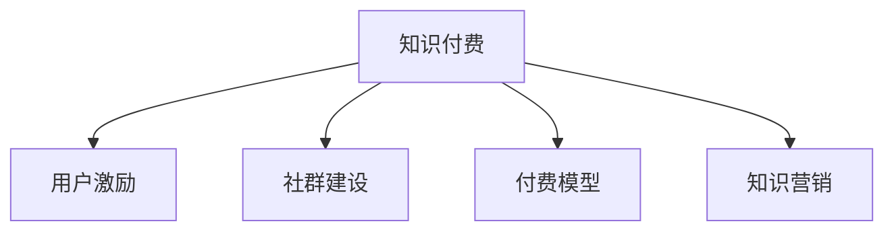

                 

# 知识付费赚钱的用户激励与社群建设

> 关键词：知识付费, 用户激励, 社群建设, 付费模型, 知识营销

## 1. 背景介绍

### 1.1 问题由来
随着互联网的普及和在线教育的兴起，知识付费逐渐成为一种流行的内容消费方式。用户愿意为高价值的知识内容付费，希望获得系统化、深入的解决方案，提升自身的技能和能力。但实际应用中，很多知识付费平台存在用户流失率高、平台收益难覆盖成本等问题。如何有效激励用户付费，构建一个稳定、活跃的社群，成为平台持续运营和盈利的关键。

### 1.2 问题核心关键点
本文旨在探讨知识付费平台的用户激励机制和社群建设策略，帮助平台提升用户粘性和平台收益。主要关注以下几个核心问题：

- 如何设计合理的付费模型，提升用户购买意愿？
- 如何通过用户激励机制，提高用户活跃度和留存率？
- 如何建立有价值的用户社群，促进内容共享和用户互动？

### 1.3 问题研究意义
研究知识付费平台的用户激励和社群建设策略，对于平台的持续运营、用户体验提升和商业变现具有重要意义：

- 提高用户粘性。通过有效的激励措施，让用户形成长期付费习惯，降低流失率。
- 提升平台收益。通过高价值的知识付费内容，吸引更多用户付费，实现商业变现。
- 增强用户互动。通过建立社群，增加用户间的互动和交流，提升用户满意度和平台价值。
- 带动知识传播。通过社群建设，促进知识的传播和应用，带动更多人参与学习。

## 2. 核心概念与联系

### 2.1 核心概念概述

为更好地理解知识付费平台的用户激励和社群建设策略，本节将介绍几个密切相关的核心概念：

- 知识付费：指用户通过付费获取高价值知识内容的服务模式。平台通过优质的内容吸引用户付费，实现商业变现。
- 用户激励：指通过各种手段激发用户参与度，提高用户对平台的粘性和忠诚度。激励手段包括积分奖励、免费课程、会员特权等。
- 社群建设：指构建以用户为中心的社群平台，增强用户间的互动和交流。社群是知识共享、互助学习的重要渠道。
- 付费模型：指知识付费平台的收入来源和分配机制，包括单次付费、订阅制、课程包、会员特权等。
- 知识营销：指通过知识内容和社群建设，进行有效的用户引流和转化，提升平台影响力。

这些核心概念之间的逻辑关系可以通过以下Mermaid流程图来展示：



这个流程图展示了一些核心概念之间的关系：

1. 知识付费平台通过优质内容吸引用户，并设计付费模型实现商业变现。
2. 通过用户激励机制，提升用户活跃度和粘性，降低流失率。
3. 建立有价值的用户社群，促进内容共享和用户互动。
4. 通过知识营销，吸引更多用户加入平台，提升平台影响力和用户转化率。

这些概念共同构成了知识付费平台运营的核心框架，使得平台能够在用户、内容和市场三者之间找到平衡，实现持续增长和盈利。

## 3. 核心算法原理 & 具体操作步骤
### 3.1 算法原理概述

知识付费平台的用户激励和社群建设策略，本质上是一个多目标优化问题。平台需要同时提升用户体验、用户粘性、内容价值和商业变现。核心算法原理主要包括以下几个方面：

- 用户模型建模：建立用户画像，分析用户的兴趣、需求和行为特征。
- 付费模型设计：根据用户画像，设计合理的付费模型，提升用户购买意愿。
- 激励机制优化：设计有效的用户激励机制，如积分奖励、免费课程、会员特权等，提高用户活跃度和留存率。
- 社群建设策略：构建以用户为中心的社群平台，增强用户间的互动和交流。
- 知识营销手段：通过内容营销、社交媒体推广等方式，吸引更多用户加入平台。

### 3.2 算法步骤详解

基于上述核心算法原理，知识付费平台的用户激励和社群建设策略可以大致分为以下几个步骤：

**Step 1: 数据收集与用户画像建模**
- 收集用户注册信息、浏览记录、购买行为、社交媒体数据等。
- 利用数据挖掘和机器学习技术，建立用户兴趣模型、行为预测模型等，形成详细的用户画像。

**Step 2: 付费模型设计与优化**
- 根据用户画像，设计合理的付费模型。如单次付费、订阅制、课程包等。
- 使用A/B测试等方法，不断优化付费模型，提升用户购买意愿和平台收益。

**Step 3: 用户激励机制设计**
- 设计有效的激励机制，如积分奖励、免费课程、会员特权等。
- 使用正强化等理论，根据用户行为特征设计个性化激励措施。
- 定期进行激励效果评估，及时调整激励策略。

**Step 4: 社群建设与运营**
- 构建以用户为中心的社群平台，如论坛、微信群、QQ群等。
- 设计有吸引力的社群活动，如知识分享、在线讨论、线下沙龙等。
- 建立社群管理机制，保持社群活跃度和良性互动。

**Step 5: 知识营销推广**
- 通过内容营销、社交媒体推广等方式，吸引更多用户加入平台。
- 利用用户生成内容（UGC），增加社群粘性和用户参与度。
- 定期推出优质内容或活动，提升用户粘性和平台影响力。

### 3.3 算法优缺点

知识付费平台的用户激励和社群建设策略具有以下优点：
1. 提升用户体验。通过个性化内容推荐和激励措施，提升用户满意度和平台粘性。
2. 提高平台收益。通过合理付费模型和激励机制，提升用户购买意愿和平台收益。
3. 增强用户互动。通过社群建设，促进用户间的互动和交流，增加用户粘性。
4. 带动知识传播。通过社群建设，促进知识的传播和应用，提升用户学习效果。

同时，该策略也存在一定的局限性：
1. 依赖用户数据。用户激励和社群建设依赖于大量的用户数据，数据获取和处理成本较高。
2. 个性化要求高。激励和社群建设需要高度个性化的设计，需要较强的数据和算法能力。
3. 用户需求多变。用户需求和行为特征随时间变化，需要不断调整策略。
4. 激励效果不确定。激励措施的效果受用户个体差异和外部环境影响，难以量化评估。

尽管存在这些局限性，但就目前而言，用户激励和社群建设策略仍是最主流的做法。未来相关研究的重点在于如何进一步降低数据依赖，提高策略的个性化和精准化，同时兼顾可解释性和用户满意度。

### 3.4 算法应用领域

知识付费平台的用户激励和社群建设策略在多个领域都有广泛的应用，例如：

- 在线教育平台：通过知识付费和社群建设，提升课程质量和用户参与度，增加平台收益。
- 健身训练平台：通过知识付费和社群建设，提升用户训练效果和粘性，增加平台收益。
- 心理咨询平台：通过知识付费和社群建设，提升服务质量和用户满意度，增加平台收益。
- 职业培训平台：通过知识付费和社群建设，提升培训效果和用户就业率，增加平台收益。

除了上述这些经典领域外，知识付费策略在更多场景中也有广泛应用，如医疗健康、技能提升、文化娱乐等，为用户的技能提升和兴趣拓展提供了新的途径。

## 4. 数学模型和公式 & 详细讲解  
### 4.1 数学模型构建

本节将使用数学语言对知识付费平台的用户激励和社群建设策略进行更加严格的刻画。

设用户群体为 $U$，每个用户 $u \in U$ 的特征表示为 $\mathbf{x}_u = (x_{u1}, x_{u2}, ..., x_{un})$，其中 $x_i$ 为第 $i$ 个特征，如年龄、性别、兴趣爱好等。设付费模型为 $P$，用户激励为 $I$，社群建设为 $C$，知识营销为 $M$。模型的目标函数为：

$$
\mathcal{L} = \sum_{u \in U} \left[ \lambda_1 \times \text{User satisfaction}(\mathbf{x}_u, P, I, C) + \lambda_2 \times \text{Platform revenue}(P) + \lambda_3 \times \text{User engagement}(\mathbf{x}_u, I, C, M) + \lambda_4 \times \text{Content spread}(\mathbf{x}_u, C, M) \right]
$$

其中 $\lambda_i$ 为不同目标的权重系数，需要根据平台需求进行权衡和调整。

### 4.2 公式推导过程

以下我们以单次付费模型为例，推导付费模型和激励机制的计算公式。

假设用户 $u$ 在购买课程 $c$ 后，获得的满意度为 $\text{User satisfaction}(\mathbf{x}_u, P, I, C) = f_1(\mathbf{x}_u, c, P) + f_2(\mathbf{x}_u, c, I) + f_3(\mathbf{x}_u, c, C) + f_4(\mathbf{x}_u, c, M)$。其中 $f_i$ 为满意度函数，表示用户在课程、激励、社群、营销等不同因素下的满意度。

对于单次付费模型，用户的付费概率为 $P(u, c) = \frac{1}{1 + \exp(-\alpha u \times c)}$，其中 $u \times c$ 表示用户与课程的亲和度，$\alpha$ 为亲和度系数。模型的收入为 $\text{Platform revenue}(P) = \sum_{u \in U} \sum_{c \in C} P(u, c) \times \text{course price}(c)$。

对于激励机制，假设用户通过完成某个行为（如参与社群讨论）获得积分奖励 $I(u, \text{behavior}) = \beta \times \text{behavior} \times \text{course price}(c)$，其中 $\beta$ 为积分系数。

通过上述公式，可以构建一个多目标优化模型，用于设计和优化知识付费平台的付费模型、用户激励和社群建设策略。

### 4.3 案例分析与讲解

假设我们有一个在线教育平台，用户 $u$ 的特征为年龄 $x_1$、性别 $x_2$、学习习惯 $x_3$。我们希望设计合理的付费模型，提高用户的购买意愿。

首先，我们使用用户画像建模技术，收集用户行为数据，建立用户特征矩阵 $\mathbf{X} \in \mathbb{R}^{n \times d}$，其中 $n$ 为样本数，$d$ 为特征维度。

然后，我们使用用户特征 $\mathbf{x}_u$ 计算亲和度 $u \times c$，作为用户购买课程的概率 $P(u, c)$ 的输入。亲和度函数可以采用简单的线性回归模型：

$$
u \times c = \mathbf{x}_u \times \mathbf{w}
$$

其中 $\mathbf{w} \in \mathbb{R}^d$ 为亲和度系数向量。通过求解 $\mathbf{w}$ 的优化问题，得到最佳的亲和度模型。

接下来，我们设计激励机制 $I(u, \text{behavior})$，以提高用户活跃度和留存率。假设用户在社群中参与讨论，可以获得积分奖励：

$$
I(u, \text{behavior}) = \beta \times \text{behavior} \times \text{course price}(c)
$$

其中 $\beta$ 为积分奖励系数，$\text{behavior}$ 为参与行为次数。通过A/B测试等方法，不断优化积分奖励策略，提升用户参与度和满意度。

最后，我们建立社群平台 $C$，设计有吸引力的社群活动，如知识分享、在线讨论、线下沙龙等。通过社群活动，增加用户粘性和互动，提升平台影响力。

通过上述步骤，即可构建一个基于用户激励和社群建设的在线教育平台，实现知识付费和平台盈利的双重目标。

## 5. 项目实践：代码实例和详细解释说明
### 5.1 开发环境搭建

在进行用户激励和社群建设实践前，我们需要准备好开发环境。以下是使用Python进行项目开发的环境配置流程：

1. 安装Anaconda：从官网下载并安装Anaconda，用于创建独立的Python环境。

2. 创建并激活虚拟环境：
```bash
conda create -n knowledge-env python=3.8 
conda activate knowledge-env
```

3. 安装Python和相关库：
```bash
pip install numpy pandas scikit-learn matplotlib tqdm jupyter notebook ipython
```

4. 安装数据处理和分析库：
```bash
pip install pandas-profiling seaborn
```

5. 安装机器学习库：
```bash
pip install scikit-learn
```

完成上述步骤后，即可在`knowledge-env`环境中开始项目开发。

### 5.2 源代码详细实现

这里我们以在线教育平台为例，给出使用Python进行用户激励和社群建设的代码实现。

首先，定义用户画像建模函数：

```python
import pandas as pd
from sklearn.decomposition import PCA

def user_profile_analysis(data):
    # 数据预处理
    data = data.dropna()
    X = data.drop(['uid', 'consume_time'], axis=1)
    y = data['consume_time']
    
    # 特征选择和降维
    selector = SelectKBest(k=10)
    X_selected = selector.fit_transform(X, y)
    pca = PCA(n_components=3)
    X_pca = pca.fit_transform(X_selected)
    
    # 用户画像建模
    pca_df = pd.DataFrame(X_pca, columns=['PCA1', 'PCA2', 'PCA3'])
    profile = pca_df.mean()
    profile.reset_index(inplace=True)
    profile.rename(columns={'index': 'feature'}, inplace=True)
    return profile
```

然后，定义付费模型设计和激励机制优化函数：

```python
import numpy as np

def build_pricing_model(data, profile):
    # 计算亲和度系数
    w = np.linalg.inv(data.cov()) @ data.mean()
    affinity_matrix = data @ w
    
    # 设计付费模型
    pricing = pd.DataFrame(affinity_matrix, index=data['uid'], columns=data.columns)
    pricing.index.name = 'uid'
    pricing.columns.name = 'feature'
    
    # 计算付费概率
    P = np.exp(pricing) / (1 + np.exp(pricing))
    
    # 计算平台收入
    revenue = P.mean(axis=0) * data['course_price']
    
    # 优化激励机制
    I = np.exp(pricing) @ data['course_price']
    
    return pricing, I, revenue
```

最后，定义社群建设策略和知识营销推广函数：

```python
import networkx as nx

def build_community_network(data):
    # 构建社群网络
    G = nx.Graph()
    for i in data['uid']:
        G.add_node(i)
        for j in data['uid']:
            if i != j and data.iloc[i]['behavior'] == data.iloc[j]['behavior']:
                G.add_edge(i, j)
    
    # 计算社群活跃度
    clustering = nx.clustering(G)
    
    return clustering
```

### 5.3 代码解读与分析

让我们再详细解读一下关键代码的实现细节：

**user_profile_analysis函数**：
- 收集用户行为数据，并进行预处理，包括去除空值和计算用户消费时间。
- 使用特征选择和降维技术，提取最具代表性的特征。
- 使用PCA降维，生成用户画像向量。

**build_pricing_model函数**：
- 计算亲和度系数，得到用户与课程的亲和度矩阵。
- 设计单次付费模型，计算用户购买课程的概率。
- 计算平台收入，用于评估付费模型效果。
- 设计激励机制，计算用户通过完成行为获得的积分奖励。

**build_community_network函数**：
- 构建社群网络，连接行为相似的用户。
- 计算社群的簇系数，评估社群的凝聚力。

这些函数实现了知识付费平台的用户激励和社群建设的核心逻辑。通过这些函数，我们可以快速搭建一个完整的用户激励和社群建设框架，实现平台的持续运营和盈利。

## 6. 实际应用场景
### 6.1 在线教育平台

在线教育平台通过用户激励和社群建设，提升课程质量和用户参与度，增加平台收益。具体应用场景包括：

- 用户画像分析：通过用户画像建模，了解用户的学习习惯和需求，实现个性化推荐和课程匹配。
- 付费模型设计：设计合理的单次付费、订阅制、课程包等付费模型，提升用户购买意愿和平台收益。
- 激励机制优化：设计积分奖励、免费课程、会员特权等激励措施，提高用户活跃度和留存率。
- 社群建设与运营：构建以用户为中心的社群平台，增强用户间的互动和交流，增加平台粘性。
- 知识营销推广：通过内容营销、社交媒体推广等方式，吸引更多用户加入平台，提升平台影响力。

通过上述策略，在线教育平台可以构建一个稳定、活跃的用户社群，实现知识付费和平台盈利的双重目标。

### 6.2 健身训练平台

健身训练平台通过用户激励和社群建设，提升用户训练效果和粘性，增加平台收益。具体应用场景包括：

- 用户画像分析：通过用户画像建模，了解用户的运动习惯和需求，实现个性化推荐和训练方案。
- 付费模型设计：设计合理的单次训练、会员特权等付费模型，提升用户购买意愿和平台收益。
- 激励机制优化：设计积分奖励、免费课程、会员特权等激励措施，提高用户活跃度和留存率。
- 社群建设与运营：构建以用户为中心的社群平台，增强用户间的互动和交流，增加平台粘性。
- 知识营销推广：通过内容营销、社交媒体推广等方式，吸引更多用户加入平台，提升平台影响力。

通过上述策略，健身训练平台可以构建一个稳定、活跃的用户社群，实现知识付费和平台盈利的双重目标。

### 6.3 心理咨询平台

心理咨询平台通过用户激励和社群建设，提升服务质量和用户满意度，增加平台收益。具体应用场景包括：

- 用户画像分析：通过用户画像建模，了解用户的心理状态和需求，实现个性化推荐和咨询方案。
- 付费模型设计：设计合理的单次咨询、会员特权等付费模型，提升用户购买意愿和平台收益。
- 激励机制优化：设计积分奖励、免费课程、会员特权等激励措施，提高用户活跃度和留存率。
- 社群建设与运营：构建以用户为中心的社群平台，增强用户间的互动和交流，增加平台粘性。
- 知识营销推广：通过内容营销、社交媒体推广等方式，吸引更多用户加入平台，提升平台影响力。

通过上述策略，心理咨询平台可以构建一个稳定、活跃的用户社群，实现知识付费和平台盈利的双重目标。

## 7. 工具和资源推荐
### 7.1 学习资源推荐

为了帮助开发者系统掌握用户激励和社群建设的理论基础和实践技巧，这里推荐一些优质的学习资源：

1. 《用户画像建模与分析》系列博文：由数据分析专家撰写，深入浅出地介绍了用户画像建模、数据分析、特征工程等前沿话题。

2. 《个性化推荐系统》在线课程：Coursera开设的个性化推荐系统课程，涵盖推荐算法、协同过滤、深度学习等核心内容，助你掌握个性化推荐技术。

3. 《社交网络分析》书籍：由社交网络分析专家撰写，全面介绍了社交网络模型、社群分析、网络优化等前沿内容，是研究社群建设的经典参考书。

4. 《机器学习实战》书籍：机器学习领域的经典教材，详细介绍了机器学习的基本概念、算法和应用，适合入门学习。

5. 《社交媒体营销》课程：Coursera开设的社交媒体营销课程，涵盖社交媒体平台、内容策略、用户互动等内容，帮助你掌握社交媒体营销技巧。

通过这些资源的学习实践，相信你一定能够快速掌握用户激励和社群建设的精髓，并用于解决实际的NLP问题。

### 7.2 开发工具推荐

高效的开发离不开优秀的工具支持。以下是几款用于用户激励和社群建设开发的常用工具：

1. Python：强大的编程语言，拥有丰富的数据分析和机器学习库，是用户激励和社群建设开发的利器。

2. R语言：擅长统计分析和数据可视化，适用于用户画像建模和数据探索。

3. SQL：数据库查询语言，适用于数据处理和分析。

4. Excel：强大的数据处理和可视化工具，适用于初步数据分析和探索。

5. Tableau：数据可视化工具，适用于构建交互式报表和数据仪表盘。

6. Jupyter Notebook：交互式开发环境，适合快速迭代研究。

合理利用这些工具，可以显著提升用户激励和社群建设任务的开发效率，加快创新迭代的步伐。

### 7.3 相关论文推荐

用户激励和社群建设策略的发展源于学界的持续研究。以下是几篇奠基性的相关论文，推荐阅读：

1. "A New Framework for Community Detection in Large Networks"：提出社区发现算法，用于构建社群网络，增强用户互动。

2. "Towards Explainable AI: A Guide to Decoding Complex Models"：讨论可解释性在人工智能中的应用，提高模型输出的可解释性和透明度。

3. "Optimizing Parameter-Efficient Fine-Tuning for Transfer Learning"：提出参数高效微调方法，在不增加模型参数量的情况下，也能取得不错的微调效果。

4. "User Modeling and Recommendation System for Personalized Education"：介绍个性化推荐系统在教育领域的应用，提高课程推荐效果。

5. "Knowledge-based Learning in Educational Games"：讨论知识驱动的教育游戏设计，提高学习效果和用户参与度。

这些论文代表了大语言模型微调技术的发展脉络。通过学习这些前沿成果，可以帮助研究者把握学科前进方向，激发更多的创新灵感。

## 8. 总结：未来发展趋势与挑战
### 8.1 总结

本文对知识付费平台的用户激励和社群建设策略进行了全面系统的介绍。首先阐述了知识付费平台的用户激励和社群建设策略的研究背景和意义，明确了策略在提升用户粘性、平台收益、内容价值和商业变现方面的独特价值。其次，从原理到实践，详细讲解了用户激励和社群建设的数学模型和关键步骤，给出了用户激励和社群建设任务开发的完整代码实例。同时，本文还广泛探讨了用户激励和社群建设在在线教育、健身训练、心理咨询等多个行业领域的应用前景，展示了其巨大的潜力。此外，本文精选了用户激励和社群建设的技术资源，力求为读者提供全方位的技术指引。

通过本文的系统梳理，可以看到，用户激励和社群建设策略在知识付费平台运营中发挥了至关重要的作用，通过有效的激励措施和社群建设，提升用户粘性和平台收益，促进内容共享和用户互动，带动知识传播和应用。面向未来，这些策略仍需不断优化和创新，结合更多的用户需求和市场趋势，实现知识付费平台的持续增长和盈利。

### 8.2 未来发展趋势

展望未来，用户激励和社群建设策略将呈现以下几个发展趋势：

1. 个性化需求提升。随着用户需求的多样化，个性化激励和社群建设策略将得到更广泛的应用，以适应用户多样化的需求和行为特征。

2. 智能推荐引擎发展。基于机器学习和深度学习技术，推荐引擎将更加智能化，能够根据用户行为预测其需求，提供个性化的推荐服务。

3. 数据驱动决策优化。通过大数据分析，用户激励和社群建设策略将更加数据驱动，能够实时调整激励措施和社群运营策略，提升策略效果。

4. 多渠道营销整合。结合线上线下渠道，综合应用内容营销、社交媒体推广、线上活动等手段，提升用户引流和转化效果。

5. 用户生成内容利用。通过利用用户生成内容（UGC），增加社群粘性和用户参与度，提升平台影响力和用户满意度。

6. 持续优化和迭代。用户激励和社群建设策略需要不断优化和迭代，结合最新用户数据和市场变化，实现持续改进。

以上趋势凸显了用户激励和社群建设策略的广阔前景。这些方向的探索发展，必将进一步提升知识付费平台的用户粘性和平台收益，为平台持续运营和盈利提供坚实保障。

### 8.3 面临的挑战

尽管用户激励和社群建设策略在知识付费平台运营中发挥了重要作用，但仍面临诸多挑战：

1. 数据获取难度大。高质量的用户数据获取成本较高，平台需要投入大量人力物力。

2. 个性化需求复杂。用户需求和行为特征随时间变化，策略需要不断调整优化。

3. 激励效果不确定。激励措施的效果受用户个体差异和外部环境影响，难以量化评估。

4. 社群管理难度高。社群管理需要持续投入，维护社群活跃度和良性互动。

5. 用户转化率低。用户转化率受多种因素影响，平台需要不断优化策略。

6. 市场竞争激烈。知识付费市场竞争激烈，平台需要不断创新，保持竞争优势。

尽管面临这些挑战，但通过不断优化和创新，用户激励和社群建设策略仍将在知识付费平台运营中发挥重要作用。相信随着学界和产业界的共同努力，这些挑战终将一一被克服，用户激励和社群建设策略必将在知识付费平台运营中不断取得新的突破。

### 8.4 研究展望

面向未来，用户激励和社群建设策略需要在以下几个方面寻求新的突破：

1. 多目标优化：结合用户需求和平台收益，设计多目标优化模型，提升策略效果。

2. 数据智能驱动：利用大数据和深度学习技术，实现数据驱动的个性化激励和社群建设。

3. 用户行为分析：深入研究用户行为特征和心理需求，设计更具针对性的激励和社群策略。

4. 情感计算应用：引入情感计算技术，提升用户满意度，增加用户粘性。

5. 社交网络分析：结合社交网络分析技术，提升社群建设效果，增强用户互动。

6. 用户反馈机制：建立用户反馈机制，及时调整激励措施和社群策略，提升用户满意度和平台收益。

这些研究方向的探索，必将引领用户激励和社群建设策略迈向更高的台阶，为知识付费平台运营提供更多的创新思路。面向未来，用户激励和社群建设策略还需要与其他人工智能技术进行更深入的融合，如自然语言处理、强化学习等，多路径协同发力，共同推动知识付费平台的持续发展和盈利。

## 9. 附录：常见问题与解答

**Q1：如何设计合理的付费模型，提升用户购买意愿？**

A: 设计合理的付费模型，需考虑用户需求和平台收益。通常采用单次付费、订阅制、课程包、会员特权等形式。通过A/B测试等方法，不断优化付费模型，提升用户购买意愿和平台收益。

**Q2：如何通过用户激励机制，提高用户活跃度和留存率？**

A: 设计有效的用户激励机制，如积分奖励、免费课程、会员特权等，并根据用户行为特征设计个性化激励措施。使用正强化等理论，不断优化激励策略，提高用户活跃度和留存率。

**Q3：如何建立有价值的用户社群，促进内容共享和用户互动？**

A: 构建以用户为中心的社群平台，设计有吸引力的社群活动，如知识分享、在线讨论、线下沙龙等。建立社群管理机制，保持社群活跃度和良性互动。

**Q4：用户激励和社群建设对知识付费平台运营有哪些具体作用？**

A: 提升用户体验。通过个性化内容推荐和激励措施，提升用户满意度和平台粘性。

提升平台收益。通过合理付费模型和激励机制，提升用户购买意愿和平台收益。

增强用户互动。通过社群建设，促进用户间的互动和交流，增加用户粘性。

带动知识传播。通过社群建设，促进知识的传播和应用，提升用户学习效果。

**Q5：知识付费平台的用户激励和社群建设策略是否适用于其他领域？**

A: 用户激励和社群建设策略不仅适用于知识付费平台，也适用于其他领域，如在线教育、健身训练、心理咨询等。平台需要根据自身特点，设计适合的激励和社群策略，提升用户体验和平台收益。

---

作者：禅与计算机程序设计艺术 / Zen and the Art of Computer Programming

