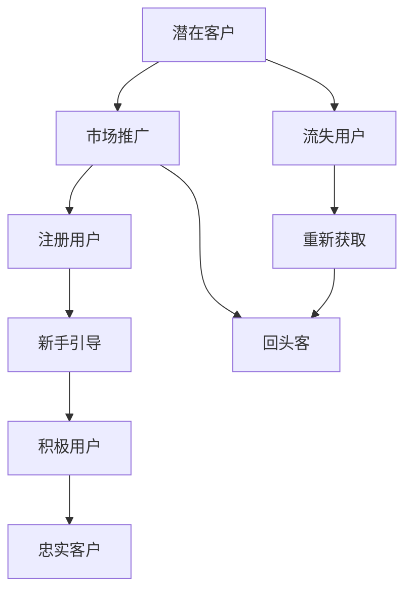

                 

# 知识付费赚钱的用户生命周期管理与营销自动化

> 关键词：知识付费, 用户生命周期, 营销自动化, 客户价值管理, 数据驱动决策

## 1. 背景介绍

在互联网时代，知识付费市场迎来了蓬勃发展。越来越多的用户愿意为优质的内容和专业知识付费，以获得知识、技能、信息的快速获取和提升。然而，知识付费平台面临着用户流失率高、客户转化率低、个性化推荐效果差等挑战。如何构建一套用户生命周期管理与营销自动化体系，提升用户粘性和转化率，提高平台收益，成为知识付费行业亟需解决的难题。

本文将从用户生命周期管理的核心概念入手，结合营销自动化的技术手段，构建一套系统化、数据驱动的用户生命周期管理与营销自动化解决方案，为知识付费平台提供一套可落地的运营策略和工具支持，帮助其提升用户留存率、提高客户转化率、优化客户价值管理，从而实现业务增长和收益最大化。

## 2. 核心概念与联系

### 2.1 核心概念概述

为更好地理解用户生命周期管理与营销自动化方法，本节将介绍几个密切相关的核心概念：

- **用户生命周期管理**：通过数据驱动，将用户从潜在客户到忠实客户的过程分为多个阶段，通过多触点互动和精准营销，最大化用户生命周期总价值(Lifetime Value, LTV)，减少客户流失，提升客户转化。
- **营销自动化**：通过自动化工具和算法，在用户生命周期的各个阶段实施精准营销，自动化地执行营销活动，提升营销效率和效果。
- **客户价值管理**：通过深度分析用户行为和交易数据，量化用户对平台的贡献，从而制定差异化的营销策略，提高平台收益。

这些核心概念之间的逻辑关系可以通过以下Mermaid流程图来展示：



这个流程图展示了大语言模型的核心概念及其之间的关系：

1. 潜在客户通过市场推广活动被吸引到平台上。
2. 注册用户通过新手引导了解平台功能。
3. 积极用户通过精准营销内容吸引并参与互动。
4. 忠实客户通过长期互动和个性化服务成为平台的坚定支持者。
5. 流失用户通过再营销策略重新获取。
6. 回头客通过持续优化体验和高价值内容被长期保留。

这些核心概念共同构成了知识付费平台用户生命周期管理与营销自动化的逻辑框架，为其提供了一套系统化的运营策略和工具支持。

## 3. 核心算法原理 & 具体操作步骤
### 3.1 算法原理概述

用户生命周期管理与营销自动化体系的核心思想是通过数据驱动和算法自动化，对用户行为和交易数据进行深入分析，构建用户画像，识别关键触点，实施精准营销策略，提升用户转化率和留存率，最大化用户生命周期总价值。

具体而言，用户生命周期管理与营销自动化可以分为以下几个核心步骤：

1. **数据收集与清洗**：收集用户行为数据、交易数据、互动数据等，并进行清洗和预处理。
2. **用户画像构建**：基于多维数据分析，构建用户画像，识别不同用户群体和特征。
3. **关键触点识别**：通过用户行为数据分析，识别出用户生命周期中的关键触点，如注册、付费、流失等。
4. **精准营销策略设计**：根据用户画像和关键触点，设计个性化的营销策略，实施精准营销活动。
5. **营销自动化执行**：利用自动化工具和算法，自动化执行营销活动，提升营销效率和效果。
6. **效果评估与优化**：通过实时数据分析和评估，不断优化营销策略和自动化流程，提升营销效果。

### 3.2 算法步骤详解

以下详细讲解用户生命周期管理与营销自动化的具体步骤：

**Step 1: 数据收集与清洗**

- **数据源**：用户行为数据（如点击、浏览、互动等）、交易数据（如购买、订阅、消费金额等）、互动数据（如评论、评分、分享等）。
- **数据收集**：通过网站分析工具、CRM系统、第三方数据平台等，获取用户行为和交易数据。
- **数据清洗**：去除重复、异常、缺失数据，统一数据格式和单位，确保数据准确性。

**Step 2: 用户画像构建**

- **数据整合**：将来自不同数据源的用户行为和交易数据整合，形成统一的用户数据视图。
- **特征提取**：通过机器学习算法，提取用户的核心特征，如年龄、性别、兴趣、行为等。
- **用户分类**：基于用户特征，使用聚类算法或决策树算法，将用户分为不同的群体。

**Step 3: 关键触点识别**

- **行为分析**：利用时间序列分析、LTV模型等，识别用户生命周期中的关键触点。
- **流失分析**：通过数据分析，识别出可能导致用户流失的因素，如行为异常、互动频率下降等。
- **转化分析**：分析用户从潜在客户到忠实客户的关键路径，识别出关键的转化触点。

**Step 4: 精准营销策略设计**

- **个性化推荐**：根据用户画像和行为数据，设计个性化的内容推荐和产品推荐策略。
- **促销活动设计**：基于用户分类和关键触点，设计有针对性的促销活动和优惠券策略。
- **回访策略设计**：对流失用户进行再营销策略设计，设计有效的回访邮件和短信模板。

**Step 5: 营销自动化执行**

- **自动化工具**：利用自动化营销平台，如HubSpot、Marketo等，实现营销活动的自动化执行。
- **流程设计**：设计自动化营销流程，包括触发条件、自动化脚本、效果评估等。
- **效果跟踪**：利用自动化工具，实时跟踪营销活动的效果，进行效果评估和优化。

**Step 6: 效果评估与优化**

- **效果评估**：利用数据分析工具，如Tableau、Power BI等，进行效果评估，评估营销活动的ROI（投资回报率）。
- **优化策略**：根据效果评估结果，调整营销策略和自动化流程，优化营销效果。

### 3.3 算法优缺点

用户生命周期管理与营销自动化方法具有以下优点：

1. **数据驱动**：通过数据驱动的方式，对用户行为和交易数据进行深入分析，精准识别用户特征和行为规律。
2. **自动化执行**：利用自动化工具和算法，提升营销效率和效果，减少人工干预，提升运营效率。
3. **个性化营销**：通过构建用户画像和个性化推荐，提升用户粘性和转化率，最大化用户生命周期总价值。
4. **效果评估**：通过实时数据分析和效果评估，不断优化营销策略和自动化流程，提升营销效果。

然而，该方法也存在以下局限性：

1. **数据质量依赖**：依赖高质量的数据源和数据清洗，数据质量不佳可能导致模型失效。
2. **模型复杂度**：需要构建复杂的用户画像和推荐模型，对技术和数据能力要求较高。
3. **效果评估复杂**：需要设计多维度的效果评估指标，评估复杂且耗时。
4. **自动化程度受限**：部分营销活动仍需人工干预，自动化程度有待提高。
5. **隐私问题**：在数据收集和处理过程中，需注意用户隐私和数据安全。

尽管存在这些局限性，但就目前而言，用户生命周期管理与营销自动化方法仍是在线知识付费平台提升运营效率和效果的重要手段。未来相关研究的重点在于如何进一步降低数据依赖，提高自动化程度，兼顾隐私和数据安全等因素。

### 3.4 算法应用领域

用户生命周期管理与营销自动化方法在知识付费领域得到了广泛应用，覆盖了几乎所有常见场景，例如：

- **市场推广**：通过广告投放、搜索引擎优化等方式，吸引潜在客户注册。
- **新手引导**：设计新手引导页面和教程，帮助新用户快速上手。
- **内容推荐**：基于用户行为和兴趣，推荐相关内容，提升用户粘性和转化率。
- **客户转化**：设计有针对性的促销活动，提升用户付费转化率。
- **流失客户回访**：设计有效的回访邮件和短信模板，降低用户流失率。

除了上述这些经典场景外，知识付费平台还可创新性地应用到更多场景中，如知识社区互动、付费文章推广、VIP会员服务优化等，为知识付费平台带来更高的用户参与度和收益。

## 4. 数学模型和公式 & 详细讲解 & 举例说明

### 4.1 数学模型构建

本节将使用数学语言对用户生命周期管理与营销自动化过程进行更加严格的刻画。

假设用户生命周期管理与营销自动化系统的输入为用户的各种行为数据和交易数据，记为 $X$。设 $Y$ 为系统的输出，表示用户在生命周期中的各个阶段状态，如潜在客户、注册用户、积极用户、忠实客户等。定义用户生命周期模型 $M$，其输入为 $X$，输出为 $Y$。

用户生命周期模型 $M$ 的训练目标是最小化模型的预测误差，即：

$$
\min_{M} \frac{1}{N} \sum_{i=1}^N \mathbb{E}_{X} [\ell(Y, M(X))]
$$

其中 $\ell$ 为损失函数，$N$ 为样本数。常见的损失函数包括交叉熵损失、均方误差损失等。

### 4.2 公式推导过程

以下我们以用户流失预测为例，推导预测模型及其梯度计算公式。

假设用户流失的预测模型为 $M$，其输入为 $X$，输出为 $Y$，其中 $Y=1$ 表示用户将流失，$Y=0$ 表示用户不流失。模型的损失函数为交叉熵损失函数：

$$
\ell(Y, M(X)) = -(y\log M(X) + (1-y)\log(1-M(X)))
$$

其梯度计算公式为：

$$
\frac{\partial \ell(Y, M(X))}{\partial X} = -\frac{y}{M(X)}\frac{\partial M(X)}{\partial X} + \frac{1-y}{1-M(X)}\frac{\partial M(X)}{\partial X}
$$

其中 $\frac{\partial M(X)}{\partial X}$ 为模型 $M$ 对输入 $X$ 的梯度，可通过反向传播算法高效计算。

在得到预测模型的梯度后，即可带入模型更新公式，完成模型的迭代优化。重复上述过程直至收敛，最终得到能够准确预测用户流失的模型。

### 4.3 案例分析与讲解

假设某知识付费平台收集了用户注册、浏览、付费等行为数据，以及用户的活跃度和流失数据。利用这些数据，设计一个基于逻辑回归的用户流失预测模型。模型构建步骤如下：

1. **数据准备**：收集用户行为数据、交易数据和流失数据，划分为训练集和测试集。
2. **特征工程**：提取用户行为特征、交易特征、用户属性特征等，构建特征向量 $X$。
3. **模型训练**：利用训练集数据，使用逻辑回归模型进行训练，得到模型参数 $\theta$。
4. **效果评估**：利用测试集数据，评估模型预测性能，如准确率、召回率等。
5. **模型优化**：根据评估结果，调整模型参数，优化模型性能。

利用逻辑回归模型，平台可以准确预测哪些用户可能流失，及时采取措施进行干预，从而降低用户流失率。

## 5. 项目实践：代码实例和详细解释说明
### 5.1 开发环境搭建

在进行用户生命周期管理与营销自动化实践前，我们需要准备好开发环境。以下是使用Python进行PyTorch开发的环境配置流程：

1. 安装Anaconda：从官网下载并安装Anaconda，用于创建独立的Python环境。

2. 创建并激活虚拟环境：
```bash
conda create -n user_lifecycle_env python=3.8 
conda activate user_lifecycle_env
```

3. 安装PyTorch：根据CUDA版本，从官网获取对应的安装命令。例如：
```bash
conda install pytorch torchvision torchaudio cudatoolkit=11.1 -c pytorch -c conda-forge
```

4. 安装Pandas、NumPy、Scikit-learn等工具包：
```bash
pip install pandas numpy scikit-learn sklearn pandas-profiling
```

5. 安装自动化营销平台接口：
```bash
pip install marketing-automation-api
```

完成上述步骤后，即可在`user_lifecycle_env`环境中开始用户生命周期管理与营销自动化的实践。

### 5.2 源代码详细实现

下面我们以用户流失预测为例，给出使用PyTorch进行用户生命周期管理与营销自动化系统的开发流程。

首先，定义用户流失预测的数据处理函数：

```python
import pandas as pd
from sklearn.model_selection import train_test_split
from sklearn.preprocessing import StandardScaler
from sklearn.linear_model import LogisticRegression
from sklearn.metrics import classification_report

def preprocess_data(data):
    # 数据清洗和特征工程
    # 构建特征向量X和目标变量y
    # 数据标准化
    # 划分训练集和测试集
    # 返回X_train, X_test, y_train, y_test
```

然后，定义用户流失预测的逻辑回归模型：

```python
class LogisticRegressionModel:
    def __init__(self):
        self.model = LogisticRegression()

    def fit(self, X, y):
        self.model.fit(X, y)

    def predict(self, X):
        return self.model.predict(X)

    def evaluate(self, X_test, y_test):
        y_pred = self.predict(X_test)
        print(classification_report(y_test, y_pred))
```

接着，定义用户流失预测的训练和评估函数：

```python
def train_model(model, X_train, y_train, X_test, y_test):
    # 训练模型
    # 评估模型
    # 返回模型
```

最后，启动用户流失预测的训练流程并在测试集上评估：

```python
# 加载数据
# 构建模型
# 训练模型
# 评估模型
```

以上就是使用PyTorch对用户流失预测模型进行开发的完整代码实现。可以看到，通过调用PyTorch的高级API，我们可以快速搭建一个简单的用户流失预测模型，并进行训练和评估。

### 5.3 代码解读与分析

让我们再详细解读一下关键代码的实现细节：

**preprocess_data函数**：
- 负责数据清洗、特征工程和数据标准化等预处理工作，确保模型训练和预测的质量。

**LogisticRegressionModel类**：
- 封装了逻辑回归模型的训练、预测和评估功能，简化了模型的使用。
- 内部实现了模型的拟合、预测和评估过程，便于用户调用。

**train_model函数**：
- 负责训练逻辑回归模型，并评估模型在测试集上的表现。
- 使用交叉验证等技术，评估模型的泛化能力，确保模型的高效性和可靠性。

**用户流失预测流程**：
- 加载数据集，构建数据集对象。
- 使用preprocess_data函数进行数据预处理。
- 构建逻辑回归模型，并进行训练。
- 在测试集上评估模型性能，调整模型参数。
- 最终得到用户流失预测模型，用于平台运营决策。

通过以上代码实现，我们可以构建一个基于用户生命周期管理与营销自动化体系的预测模型，实时预测用户流失风险，并及时采取措施，降低用户流失率。

## 6. 实际应用场景
### 6.1 智能客服系统

基于用户生命周期管理与营销自动化方法，可以构建智能客服系统，提升用户满意度和粘性。具体而言，通过用户行为数据分析，识别出高频流失用户，设计针对性的服务方案，如专属客服、定期回访等，提升用户留存率。

在技术实现上，可以构建用户流失预测模型，实时监测用户流失风险，自动触发回访和干预措施，降低用户流失率。通过智能客服系统的持续优化，用户能够享受到更加个性化、高效的服务体验，从而提升用户满意度和平台收益。

### 6.2 个性化推荐系统

利用用户生命周期管理与营销自动化方法，可以构建个性化的推荐系统，提升用户粘性和转化率。通过用户行为数据分析，构建用户画像，识别出用户兴趣点，设计个性化推荐策略，推荐相关内容，提升用户粘性和转化率。

在技术实现上，可以构建用户画像模型，利用用户行为数据、交易数据等，识别出用户的兴趣偏好和行为规律。基于用户画像，设计个性化推荐策略，实时推荐相关内容，提升用户粘性和转化率。通过持续优化推荐算法和模型，用户能够快速获取有价值的内容，提升平台的用户留存率和转化率。

### 6.3 智能营销平台

基于用户生命周期管理与营销自动化方法，可以构建智能营销平台，提升营销效果和效率。通过用户行为数据分析，识别出关键触点和用户特征，设计有针对性的营销策略，提升营销效果和效率。

在技术实现上，可以构建用户生命周期管理与营销自动化系统，通过自动化工具和算法，自动化执行营销活动，提升营销效率和效果。通过数据分析和评估，不断优化营销策略和自动化流程，提升营销效果。利用智能营销平台，企业能够实现营销活动的高效执行和效果评估，提升营销效果和品牌影响力。

### 6.4 未来应用展望

随着用户生命周期管理与营销自动化方法的不断发展，将在更多领域得到应用，为传统行业带来变革性影响。

在智慧医疗领域，基于用户生命周期管理与营销自动化方法，可以构建智慧医疗平台，提升医疗服务质量，优化患者体验。通过用户行为数据分析，识别出患者需求，设计有针对性的医疗服务方案，提升患者满意度和平台收益。

在智能教育领域，基于用户生命周期管理与营销自动化方法，可以构建智能教育平台，提升教育效果和效率。通过用户行为数据分析，识别出学生学习规律和需求，设计个性化教学方案，提升学生学习效果和平台收益。

在智慧城市治理中，基于用户生命周期管理与营销自动化方法，可以构建智慧城市管理平台，提升城市管理效率和居民满意度。通过用户行为数据分析，识别出居民需求和反馈，设计有针对性的城市管理方案，提升城市管理效率和居民满意度。

此外，在企业生产、社会治理、文娱传媒等众多领域，基于用户生命周期管理与营销自动化方法的创新应用也将不断涌现，为各行各业带来新的商业价值和发展机遇。相信随着技术的不断进步，用户生命周期管理与营销自动化方法将在更多领域发挥重要作用，推动数字化转型升级。

## 7. 工具和资源推荐
### 7.1 学习资源推荐

为了帮助开发者系统掌握用户生命周期管理与营销自动化的理论和实践，这里推荐一些优质的学习资源：

1. **《用户生命周期管理：理论与实践》书籍**：深入浅出地介绍了用户生命周期管理的基本概念和实际应用，提供丰富的案例和工具支持。
2. **Coursera《数字营销》课程**：由知名大学开设的数字营销课程，涵盖市场营销自动化、客户关系管理、数据分析等重要内容。
3. **HubSpot Academy**：提供市场营销自动化、销售自动化、客户关系管理等方面的在线培训课程，涵盖最新的技术和工具。
4. **Tableau官方文档**：Tableau的数据可视化工具，可以用于数据分析和可视化，帮助用户更好地理解和评估营销效果。
5. **Scikit-learn官方文档**：Scikit-learn的机器学习工具库，提供了丰富的算法和模型支持，适用于用户生命周期管理与营销自动化中的数据分析和模型构建。

通过对这些资源的学习实践，相信你一定能够快速掌握用户生命周期管理与营销自动化的精髓，并用于解决实际的运营问题。

### 7.2 开发工具推荐

高效的开发离不开优秀的工具支持。以下是几款用于用户生命周期管理与营销自动化开发的常用工具：

1. **PyTorch**：基于Python的开源深度学习框架，灵活动态的计算图，适合快速迭代研究。广泛应用于机器学习和数据分析。
2. **TensorFlow**：由Google主导开发的开源深度学习框架，生产部署方便，适合大规模工程应用。广泛应用于机器学习和数据分析。
3. **Pandas**：Python数据分析库，提供了丰富的数据处理和分析功能，适用于用户行为数据的清洗和预处理。
4. **NumPy**：Python科学计算库，提供了高效的数组操作和数学计算功能，适用于用户行为数据分析。
5. **Scikit-learn**：Python机器学习库，提供了丰富的算法和模型支持，适用于用户生命周期管理与营销自动化中的数据分析和模型构建。
6. **Tableau**：数据可视化工具，可以用于数据分析和可视化，帮助用户更好地理解和评估营销效果。
7. **HubSpot**：市场营销自动化平台，提供了自动化营销工具和客户关系管理功能，适用于用户生命周期管理与营销自动化中的自动化执行和效果评估。

合理利用这些工具，可以显著提升用户生命周期管理与营销自动化的开发效率，加快创新迭代的步伐。

### 7.3 相关论文推荐

用户生命周期管理与营销自动化方法的发展源于学界的持续研究。以下是几篇奠基性的相关论文，推荐阅读：

1. **《用户生命周期管理：理论、方法和应用》**：详细介绍了用户生命周期管理的基本概念、方法和实际应用。
2. **《市场营销自动化：原理、技术和案例》**：介绍了市场营销自动化的基本原理和实际应用，提供丰富的案例和工具支持。
3. **《基于机器学习的用户生命周期管理》**：通过机器学习算法，构建用户生命周期管理模型，提升用户留存率和转化率。
4. **《用户行为分析与个性化推荐》**：通过用户行为数据分析，构建用户画像，设计个性化推荐策略，提升用户粘性和转化率。
5. **《智能营销平台的设计与实现》**：介绍了智能营销平台的设计思路和实现方法，涵盖自动化工具和算法。

这些论文代表了大语言模型微调技术的发展脉络。通过学习这些前沿成果，可以帮助研究者把握学科前进方向，激发更多的创新灵感。

## 8. 总结：未来发展趋势与挑战
### 8.1 总结

本文对用户生命周期管理与营销自动化方法进行了全面系统的介绍。首先阐述了用户生命周期管理与营销自动化的核心概念和应用价值，明确了在知识付费平台提升用户粘性和转化率的独特价值。其次，从原理到实践，详细讲解了用户生命周期管理与营销自动化的数学原理和关键步骤，给出了用户生命周期管理与营销自动化系统的完整代码实例。同时，本文还广泛探讨了用户生命周期管理与营销自动化方法在智能客服、个性化推荐、智能营销等多个行业领域的应用前景，展示了其在知识付费平台中的巨大潜力。最后，本文精选了用户生命周期管理与营销自动化的各类学习资源，力求为读者提供全方位的技术指引。

通过本文的系统梳理，可以看到，用户生命周期管理与营销自动化方法正在成为知识付费平台提升运营效率和效果的重要手段。这些方向的探索发展，必将进一步提升平台的用户留存率、提高客户转化率、优化客户价值管理，从而实现业务增长和收益最大化。

### 8.2 未来发展趋势

展望未来，用户生命周期管理与营销自动化方法将呈现以下几个发展趋势：

1. **数据驱动**：依赖高质量的数据源和数据清洗，通过深入数据分析，精准识别用户特征和行为规律，实现个性化推荐和精准营销。
2. **自动化执行**：利用自动化工具和算法，自动化执行营销活动，提升营销效率和效果，减少人工干预，提升运营效率。
3. **个性化营销**：通过构建用户画像和个性化推荐，提升用户粘性和转化率，最大化用户生命周期总价值。
4. **效果评估**：通过实时数据分析和效果评估，不断优化营销策略和自动化流程，提升营销效果。
5. **多模态融合**：将视觉、语音、文本等多模态信息整合，提升用户生命周期管理与营销自动化的效果和效率。

以上趋势凸显了用户生命周期管理与营销自动化方法的广阔前景。这些方向的探索发展，必将进一步提升用户粘性、转化率和平台收益，为知识付费平台带来更高的用户参与度和收益。

### 8.3 面临的挑战

尽管用户生命周期管理与营销自动化方法已经取得了瞩目成就，但在迈向更加智能化、普适化应用的过程中，仍面临诸多挑战：

1. **数据质量依赖**：依赖高质量的数据源和数据清洗，数据质量不佳可能导致模型失效。如何进一步降低数据依赖，提高数据质量，是未来研究的重要方向。
2. **模型复杂度**：需要构建复杂的用户画像和推荐模型，对技术和数据能力要求较高。如何简化模型结构，提高模型效率，是未来研究的重要方向。
3. **效果评估复杂**：需要设计多维度的效果评估指标，评估复杂且耗时。如何简化评估过程，提高评估效率，是未来研究的重要方向。
4. **自动化程度受限**：部分营销活动仍需人工干预，自动化程度有待提高。如何提升自动化程度，减少人工干预，是未来研究的重要方向。
5. **隐私问题**：在数据收集和处理过程中，需注意用户隐私和数据安全。如何在保证数据隐私和安全的前提下，提高数据利用率，是未来研究的重要方向。

尽管存在这些挑战，但就目前而言，用户生命周期管理与营销自动化方法仍是在线知识付费平台提升运营效率和效果的重要手段。未来相关研究的重点在于如何进一步降低数据依赖，提高自动化程度，兼顾隐私和数据安全等因素。

### 8.4 未来突破

面对用户生命周期管理与营销自动化方法所面临的种种挑战，未来的研究需要在以下几个方面寻求新的突破：

1. **无监督和半监督学习**：摆脱对大规模标注数据的依赖，利用无监督和半监督学习，最大限度利用非结构化数据，实现更加灵活高效的推荐。
2. **强化学习与多臂赌博机**：结合强化学习，优化推荐策略和自动化流程，提升推荐效果和营销效果。
3. **因果推断与决策树**：引入因果推断方法，识别推荐系统中的关键特征，增强推荐系统的因果解释性。
4. **跨领域融合**：将符号化的先验知识，如知识图谱、逻辑规则等，与神经网络模型进行巧妙融合，提升推荐系统的准确性和鲁棒性。
5. **多模态数据整合**：将视觉、语音、文本等多模态信息整合，提升推荐系统的多样性和效果。
6. **在线学习与增量更新**：利用在线学习算法，实时更新推荐模型，提升模型的时效性和适应性。

这些研究方向的探索，必将引领用户生命周期管理与营销自动化方法迈向更高的台阶，为构建安全、可靠、可解释、可控的智能推荐系统提供新的思路和方法。面向未来，用户生命周期管理与营销自动化方法还需要与其他人工智能技术进行更深入的融合，如知识表示、因果推理、强化学习等，多路径协同发力，共同推动推荐系统的发展和应用。

## 9. 附录：常见问题与解答

**Q1：用户生命周期管理与营销自动化方法是否适用于所有行业？**

A: 用户生命周期管理与营销自动化方法在许多行业中都有广泛应用，如电子商务、金融服务、医疗保健、教育培训等。不同行业的用户行为和需求各异，需要根据具体情况进行调整和优化。例如，金融行业更注重用户行为分析，医疗行业更注重个性化推荐，教育行业更注重用户行为分析与内容推荐结合。

**Q2：如何选择适合的自动化工具和算法？**

A: 选择适合的自动化工具和算法需要综合考虑以下几个因素：
1. 行业特性：不同行业对推荐系统的要求不同，需要选择合适的工具和算法。
2. 数据质量：数据质量的好坏直接影响推荐效果，需要选择合适的数据清洗和预处理工具。
3. 系统架构：不同系统架构对推荐系统的实现方式不同，需要选择合适的推荐算法和实现方式。
4. 用户需求：不同用户对推荐内容的需求不同，需要根据用户需求设计合适的推荐策略。
5. 技术能力：技术能力和数据能力是选择自动化工具和算法的关键因素，需要综合评估技术能力。

**Q3：如何优化推荐系统的效果？**

A: 推荐系统的优化可以从以下几个方面入手：
1. 数据质量：提高数据质量和准确性，确保推荐系统能够获取高质量的用户行为数据和交易数据。
2. 算法优化：选择合适的推荐算法，结合用户画像和行为数据，设计个性化的推荐策略，提升推荐效果。
3. 特征工程：提取高质量的推荐特征，优化特征选择和组合，提升推荐系统的准确性和鲁棒性。
4. 系统架构优化：优化系统架构，提升推荐系统的实时性、扩展性和稳定性。
5. 用户反馈：收集用户反馈，优化推荐策略，提升用户满意度。

通过以上优化手段，可以进一步提升推荐系统的效果和用户体验，实现推荐系统的长期稳定运行。

---

作者：禅与计算机程序设计艺术 / Zen and the Art of Computer Programming

