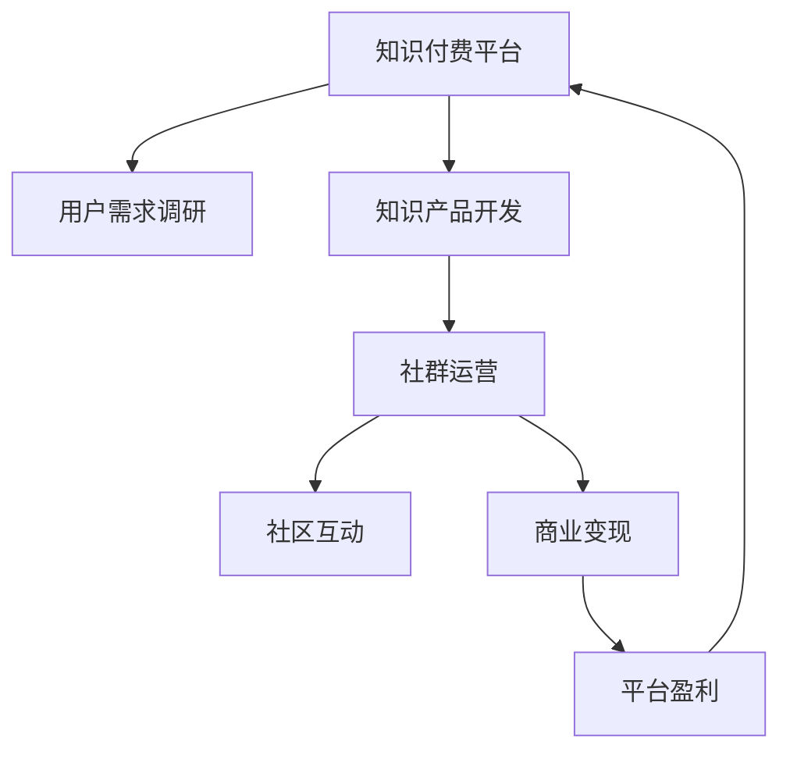

                 

# 知识付费：程序员的社群运营方案

> 关键词：知识付费, 程序员, 社群运营, 社群经济, 用户需求, 商业策略, 平台盈利, 社群互动

## 1. 背景介绍

### 1.1 问题由来
在知识付费的浪潮下，程序员作为高薪技术岗位的代表，成为了知识付费服务的重要受众群体。这一趋势一方面反映了知识经济时代的到来，另一方面也暴露了知识变现路径的单一和用户需求的复杂性。如何构建一个高效、多元、可持续的知识付费平台，满足程序员多层次、个性化的学习需求，成为当前社群运营面临的重要挑战。

### 1.2 问题核心关键点
构建程序员知识付费平台的核心理念可以概括为：

1. **用户需求导向**：通过调研了解程序员的真实学习需求和痛点，为其量身定制知识付费产品。
2. **多样化内容供给**：不仅提供传统的课程、书籍等静态知识，还应引入实时的项目、代码、教程、讨论等动态内容。
3. **互动性增强**：利用社区、论坛等形式增强用户间的互动和交流，形成学习共同体。
4. **商业可持续性**：探索多元化盈利模式，如订阅费、会员制、广告分成等，确保平台的长期运营。

### 1.3 问题研究意义
本文旨在为程序员知识付费平台的构建提供一份全面的社群运营方案。通过系统化分析程序员用户需求和社群经济特征，揭示知识付费平台商业化的可行路径和潜在风险，为行业同仁提供参考。

## 2. 核心概念与联系

### 2.1 核心概念概述

为更好地理解程序员知识付费平台的构建，本节将介绍几个关键概念：

- **知识付费**：指通过付费机制获取有价值的知识、技能、经验等，以减少自学成本和提升学习效率。
- **社群运营**：指通过组织、管理社群内的资源和互动，形成稳定的用户群体，提升用户粘性和参与度。
- **程序员**：指通过编程技能获取职业发展的技术岗位工作者，具有较强的专业性和技术交流需求。
- **社群经济**：指利用社群资源和互动，构建平台盈利模型，实现商业化运营。
- **知识产品**：指通过聚合、加工、展示知识，供用户付费使用的产品形式，如课程、图书、视频等。
- **用户需求**：指程序员在职业发展和技能提升过程中，对知识、技能、经验、工具等的需求和偏好。

这些概念之间的联系紧密，构成了一个动态的知识付费生态系统。知识付费平台通过社群运营，连接知识供给和需求，形成稳定的商业循环，满足程序员用户的多样化需求。

### 2.2 核心概念原理和架构的 Mermaid 流程图



这个流程图展示了知识付费平台的基本架构和运营流程：

1. **知识付费平台**：作为核心枢纽，连接知识产品和用户。
2. **用户需求调研**：通过调研了解程序员的真实需求，为产品设计提供依据。
3. **知识产品开发**：开发满足用户需求的知识产品，如课程、图书、视频等。
4. **社群运营**：通过社区、论坛等形式，促进用户间的互动和交流。
5. **社区互动**：增强用户粘性和参与度，提升平台活跃度。
6. **商业变现**：探索多元化盈利模式，确保平台可持续发展。
7. **平台盈利**：实现商业化运营，回馈知识供给者。

## 3. 核心算法原理 & 具体操作步骤

### 3.1 算法原理概述

构建程序员知识付费平台的社群运营方案，本质上是一个复杂的社会系统工程，涉及知识产品开发、用户需求匹配、社区管理、商业变现等多方面。其核心算法原理可以概括为：

- **需求分析算法**：通过数据分析、问卷调查等方式，全面了解程序员用户的学习需求和痛点。
- **内容推荐算法**：利用协同过滤、深度学习等技术，实现个性化知识产品推荐，提升用户体验。
- **社区互动算法**：设计互动激励机制，如积分、勋章、排行榜等，增强用户互动和平台粘性。
- **商业策略算法**：引入多元化盈利模式，如订阅费、会员制、广告分成等，确保平台的可持续发展。

### 3.2 算法步骤详解

#### 3.2.1 需求分析算法

**步骤1：数据采集**
- 通过问卷调查、论坛讨论、用户反馈等方式，收集程序员用户的需求和痛点数据。
- 使用文本分析、情感分析等技术，从海量数据中提取有用信息。

**步骤2：数据处理**
- 使用数据清洗技术去除无效数据和噪声，确保数据质量和准确性。
- 使用聚类分析、分类分析等技术，对用户需求进行分类和标签化处理。

**步骤3：需求建模**
- 构建用户需求模型，描述不同用户的需求和偏好。
- 使用统计学、机器学习等方法，对需求模型进行建模和验证。

**步骤4：需求匹配**
- 将用户需求与知识产品进行匹配，推荐合适的产品。
- 使用协同过滤、深度学习等技术，实现个性化推荐。

#### 3.2.2 内容推荐算法

**步骤1：数据收集**
- 收集知识产品数据，包括课程、图书、视频等。
- 使用爬虫技术从第三方平台抓取数据，确保资源丰富和时效性。

**步骤2：数据预处理**
- 对知识产品数据进行清洗、整理和标注，构建知识图谱。
- 使用实体识别、关系抽取等技术，提取知识产品的主要特征。

**步骤3：模型训练**
- 使用协同过滤、深度学习等技术，训练内容推荐模型。
- 使用特征工程、模型调优等方法，提升推荐效果。

**步骤4：推荐执行**
- 根据用户历史行为和偏好，推荐合适的知识产品。
- 实时更新推荐模型，确保推荐结果的时效性和准确性。

#### 3.2.3 社区互动算法

**步骤1：互动设计**
- 设计社区互动机制，如积分、勋章、排行榜等。
- 使用社交网络分析、游戏设计等方法，增强互动性。

**步骤2：互动激励**
- 制定互动激励策略，如积分兑换、勋章展示、排行榜排名等。
- 使用区块链、智能合约等技术，保障激励机制的公平和透明。

**步骤3：互动评估**
- 定期评估社区互动效果，了解用户参与度和满意度。
- 使用A/B测试、用户调查等方法，优化互动策略。

#### 3.2.4 商业策略算法

**步骤1：商业模式设计**
- 设计多元化盈利模式，如订阅费、会员制、广告分成等。
- 使用定价策略、营销策略等方法，实现商业化运营。

**步骤2：产品定价**
- 根据知识产品的价值和使用场景，设定合理的定价策略。
- 使用经济学、心理学的理论，提升用户购买意愿。

**步骤3：广告变现**
- 引入广告业务，通过精准投放、定向广告等技术，提升广告收入。
- 使用广告联盟、KOL合作等方法，保障广告效果。

**步骤4：会员服务**
- 推出会员制服务，提供专享内容、优先权限等。
- 使用积分系统、VIP特权等手段，提升会员价值和粘性。

### 3.3 算法优缺点

构建程序员知识付费平台的社群运营方案，具有以下优点：

1. **用户需求导向**：通过用户需求分析，精准定位产品和服务，提升用户满意度和忠诚度。
2. **个性化推荐**：利用推荐算法，实现个性化知识产品推荐，提升用户体验。
3. **增强互动性**：通过社区互动机制，增强用户粘性和平台活跃度。
4. **多元化盈利**：探索多元化盈利模式，确保平台的可持续发展。

同时，该方案也存在一些局限性：

1. **数据隐私**：用户需求分析涉及大量个人信息，需严格遵守隐私保护法规。
2. **技术复杂**：算法涉及数据处理、模型训练、社区互动等复杂环节，实施难度较大。
3. **用户依赖**：过度依赖社区互动机制，可能导致用户流失。
4. **盈利单一**：当前盈利模式较为单一，需探索更多盈利方式以分散风险。

### 3.4 算法应用领域

程序员知识付费平台的社群运营方案，可以在以下领域广泛应用：

1. **教育培训**：为程序员提供技能提升、职业发展等方面的课程和图书。
2. **技术交流**：通过社区、论坛等形式，促进程序员之间的技术交流和知识共享。
3. **企业培训**：为企业提供定制化的编程技能培训和课程，提升员工技术水平。
4. **产品开发**：为开发者提供技术支持、代码示例、项目教程等，促进产品创新和开发。
5. **市场需求分析**：通过数据分析，了解程序员市场的热点和趋势，指导产品开发和市场定位。

## 4. 数学模型和公式 & 详细讲解 & 举例说明

### 4.1 数学模型构建

构建程序员知识付费平台的社群运营方案，涉及到多个数学模型，主要包括用户需求模型、知识产品推荐模型、社区互动模型和商业策略模型。以下简要介绍这些模型的构建过程。

#### 4.1.1 用户需求模型

用户需求模型可以表示为：

$$
\text{需求} = f(\text{历史行为}, \text{偏好}, \text{反馈})
$$

其中 $\text{需求}$ 为程序员用户的具体需求，$ \text{历史行为}$ 为用户的过往学习行为，$ \text{偏好}$ 为用户对知识产品的偏好，$ \text{反馈}$ 为用户的评价和建议。

#### 4.1.2 知识产品推荐模型

知识产品推荐模型可以表示为：

$$
\text{推荐} = g(\text{产品特征}, \text{用户特征}, \text{互动历史})
$$

其中 $\text{推荐}$ 为推荐给用户的知识产品，$ \text{产品特征}$ 为知识产品的属性和特征，$ \text{用户特征}$ 为用户的兴趣和特征，$ \text{互动历史}$ 为用户与知识产品的互动历史。

#### 4.1.3 社区互动模型

社区互动模型可以表示为：

$$
\text{互动} = h(\text{用户特征}, \text{互动机制}, \text{激励策略})
$$

其中 $\text{互动}$ 为用户之间的互动行为，$ \text{用户特征}$ 为用户的属性和特征，$ \text{互动机制}$ 为社区互动的具体机制，$ \text{激励策略}$ 为互动激励的具体策略。

#### 4.1.4 商业策略模型

商业策略模型可以表示为：

$$
\text{盈利} = i(\text{用户特征}, \text{产品定价}, \text{广告策略}, \text{会员策略})
$$

其中 $\text{盈利}$ 为平台的盈利情况，$ \text{用户特征}$ 为用户的属性和特征，$ \text{产品定价}$ 为知识产品的定价策略，$ \text{广告策略}$ 为广告业务的具体策略，$ \text{会员策略}$ 为会员制服务的具体策略。

### 4.2 公式推导过程

#### 4.2.1 用户需求模型

使用统计学方法，可以对用户需求进行建模和推导。例如，通过用户历史行为和反馈数据，可以使用聚类分析技术，将用户分为不同的需求群体。具体步骤如下：

1. **数据预处理**：对用户数据进行清洗和处理，去除无效数据和噪声。
2. **特征提取**：提取用户行为、反馈、偏好等关键特征，用于模型构建。
3. **聚类分析**：使用K-means、层次聚类等算法，将用户分为不同的需求群体。
4. **模型验证**：通过交叉验证等方法，验证聚类模型的准确性和稳定性。

#### 4.2.2 知识产品推荐模型

使用协同过滤算法，可以对知识产品进行推荐。具体步骤如下：

1. **数据收集**：收集知识产品的数据，包括课程、图书、视频等。
2. **数据预处理**：对知识产品数据进行清洗和处理，构建知识图谱。
3. **特征提取**：提取知识产品的主要特征，如课程时长、难度、评价等。
4. **协同过滤**：使用协同过滤算法，计算用户对知识产品的评分。
5. **模型训练**：使用深度学习算法，训练知识产品推荐模型。
6. **推荐执行**：根据用户历史行为和偏好，推荐合适的知识产品。

#### 4.2.3 社区互动模型

使用游戏设计理论，可以设计社区互动机制。具体步骤如下：

1. **互动设计**：设计社区互动机制，如积分、勋章、排行榜等。
2. **激励策略**：制定互动激励策略，如积分兑换、勋章展示、排行榜排名等。
3. **互动评估**：通过用户调查和数据统计，评估社区互动效果。
4. **优化策略**：根据评估结果，优化互动机制和激励策略。

#### 4.2.4 商业策略模型

使用经济学理论，可以设计商业策略模型。具体步骤如下：

1. **商业模式设计**：设计多元化盈利模式，如订阅费、会员制、广告分成等。
2. **产品定价**：根据知识产品的价值和使用场景，设定合理的定价策略。
3. **广告变现**：通过精准投放、定向广告等技术，提升广告收入。
4. **会员服务**：推出会员制服务，提供专享内容、优先权限等。

### 4.3 案例分析与讲解

以一个实际案例来说明如何构建程序员知识付费平台的社群运营方案。

**案例背景**：
某在线编程社区推出了一个程序员知识付费平台，旨在通过提供高质量的知识产品，帮助程序员提升技能和职业发展。平台需要设计一套完整的社群运营方案，以吸引用户、提升粘性并实现商业化运营。

**需求分析**：
- **数据收集**：通过问卷调查、论坛讨论、用户反馈等方式，收集程序员用户的需求和痛点数据。
- **数据处理**：对数据进行清洗和标注，构建用户需求模型。
- **需求匹配**：将用户需求与知识产品进行匹配，推荐合适的产品。

**内容推荐**：
- **数据收集**：收集知识产品数据，包括课程、图书、视频等。
- **数据预处理**：对知识产品数据进行清洗和处理，构建知识图谱。
- **特征提取**：提取知识产品的主要特征，如课程时长、难度、评价等。
- **模型训练**：使用协同过滤、深度学习等技术，训练内容推荐模型。
- **推荐执行**：根据用户历史行为和偏好，推荐合适的知识产品。

**社区互动**：
- **互动设计**：设计社区互动机制，如积分、勋章、排行榜等。
- **激励策略**：制定互动激励策略，如积分兑换、勋章展示、排行榜排名等。
- **互动评估**：通过用户调查和数据统计，评估社区互动效果。
- **优化策略**：根据评估结果，优化互动机制和激励策略。

**商业策略**：
- **商业模式设计**：设计多元化盈利模式，如订阅费、会员制、广告分成等。
- **产品定价**：根据知识产品的价值和使用场景，设定合理的定价策略。
- **广告变现**：通过精准投放、定向广告等技术，提升广告收入。
- **会员服务**：推出会员制服务，提供专享内容、优先权限等。

通过以上步骤，该在线编程社区成功地构建了一个集知识付费、社区互动和商业变现于一体的程序员知识付费平台，用户反馈良好，平台运营稳健。

## 5. 项目实践：代码实例和详细解释说明

### 5.1 开发环境搭建

在构建程序员知识付费平台的社群运营方案时，开发环境搭建至关重要。以下是使用Python进行开发的流程：

1. **环境安装**：
   ```bash
   conda create -n dev python=3.8
   conda activate dev
   ```

2. **依赖安装**：
   ```bash
   pip install tensorflow pandas scikit-learn numpy matplotlib sklearn tqdm jupyter notebook
   ```

3. **数据收集**：
   - 通过问卷调查、论坛讨论、用户反馈等方式，收集程序员用户的需求和痛点数据。
   - 使用爬虫技术从第三方平台抓取知识产品数据。

### 5.2 源代码详细实现

以下是一个简单的Python代码实现，用于构建用户需求模型和知识产品推荐模型。

```python
import pandas as pd
from sklearn.cluster import KMeans
from sklearn.metrics import silhouette_score

# 数据收集
user_data = pd.read_csv('user_data.csv')
product_data = pd.read_csv('product_data.csv')

# 数据预处理
user_data = user_data.dropna()
product_data = product_data.dropna()

# 特征提取
user_features = user_data[['age', 'experience', 'interests']]
product_features = product_data[['name', 'duration', 'price', 'rating']]

# 聚类分析
kmeans = KMeans(n_clusters=3)
user_clusters = kmeans.fit_predict(user_features)
product_clusters = kmeans.fit_predict(product_features)

# 模型评估
silhouette = silhouette_score(user_features, user_clusters)
product_silhouette = silhouette_score(product_features, product_clusters)

# 输出结果
print(f"User cluster silhouette score: {silhouette}")
print(f"Product cluster silhouette score: {product_silhouette}")
```

### 5.3 代码解读与分析

上述代码实现了用户需求模型和知识产品推荐模型的基本流程。以下是对关键代码的解读：

1. **数据收集**：通过读取CSV文件，收集用户需求数据和知识产品数据。
2. **数据预处理**：使用`dropna()`方法，去除无效和缺失数据。
3. **特征提取**：提取用户和产品的关键特征，如年龄、经验、兴趣、名称、时长、价格、评分等。
4. **聚类分析**：使用K-means算法，对用户和产品进行聚类分析，分别得到不同的需求群体和产品类别。
5. **模型评估**：使用轮廓系数（Silhouette Score），评估聚类模型的质量和稳定性。
6. **输出结果**：输出用户和产品的聚类评估结果，供进一步优化和改进。

## 6. 实际应用场景

### 6.1 智能教育平台

程序员知识付费平台的社群运营方案，在智能教育平台上有广泛应用。平台通过社区、论坛等形式，促进教师与学生之间的互动和交流，形成学习共同体，提升教学效果和学习体验。

**应用案例**：
某编程教育平台通过社区互动机制，鼓励学生参与代码提交、问题解答等活动，形成了活跃的学习社区。平台还推出定制化的编程课程和项目，满足不同学习阶段的需求。通过订阅费、广告分成等盈利模式，平台实现了商业化运营。

### 6.2 技术咨询平台

程序员知识付费平台的社群运营方案，在技术咨询平台上有重要应用。平台通过提供技术支持、代码示例、项目教程等，帮助用户解决技术难题，提升技术水平。

**应用案例**：
某技术咨询平台通过社区互动机制，汇集了大量技术专家和开发者，用户可以在平台提问，专家实时解答。平台还推出了技术培训课程和项目开发教程，帮助用户提升技能。通过订阅费、广告分成等盈利模式，平台实现了商业化运营。

### 6.3 企业培训平台

程序员知识付费平台的社群运营方案，在企业培训平台上有广泛应用。平台通过提供定制化的编程技能培训和课程，提升员工技术水平，增强企业竞争力。

**应用案例**：
某企业培训平台通过社区互动机制，促进员工之间的技术交流和知识共享。平台还推出了企业定制化的编程课程和项目开发教程，帮助员工提升技能。通过订阅费、广告分成等盈利模式，平台实现了商业化运营。

### 6.4 未来应用展望

未来，程序员知识付费平台的社群运营方案将不断扩展应用领域，为更多行业带来变革性影响。以下是几个潜在的应用方向：

1. **医疗健康**：通过社区互动机制，促进医生和患者之间的互动和交流，形成健康知识共同体。平台可以提供健康知识、医疗咨询等，帮助用户提升健康水平。
2. **金融投资**：通过社区互动机制，促进投资者和分析师之间的互动和交流，形成金融知识共同体。平台可以提供金融知识、投资策略等，帮助用户提升投资水平。
3. **文化艺术**：通过社区互动机制，促进艺术家和爱好者之间的互动和交流，形成文化艺术知识共同体。平台可以提供文化艺术知识、创作技巧等，帮助用户提升文化艺术水平。
4. **体育健身**：通过社区互动机制，促进健身爱好者和教练之间的互动和交流，形成健身知识共同体。平台可以提供健身知识、训练计划等，帮助用户提升健身水平。

## 7. 工具和资源推荐

### 7.1 学习资源推荐

为了帮助开发者系统掌握程序员知识付费平台的构建技术，以下是一些优质的学习资源：

1. **Python编程语言**：《Python编程：从入门到实践》，由Eric Matthes撰写，适合初学者入门。
2. **数据科学**：《Python数据科学手册》，由Jake VanderPlas撰写，涵盖了数据收集、处理、分析和可视化等关键技术。
3. **机器学习**：《机器学习实战》，由Peter Harrington撰写，提供了大量Python实现机器学习算法的代码示例。
4. **深度学习**：《深度学习入门：基于TensorFlow的实践》，由斋藤康毅撰写，深入浅出地介绍了深度学习的基本原理和实践技巧。
5. **编程社区**：Github、Stack Overflow等编程社区，提供大量开源项目和代码示例，是学习编程和社区运营的宝贵资源。

### 7.2 开发工具推荐

构建程序员知识付费平台的社群运营方案，离不开一系列强大的开发工具。以下是几款常用的开发工具：

1. **Python编程语言**：Python是一门易于学习、灵活高效的编程语言，适合数据处理、机器学习等任务。
2. **TensorFlow**：由Google开发的深度学习框架，支持GPU和TPU加速，适合大规模模型训练。
3. **PyTorch**：由Facebook开发的深度学习框架，适合动态计算图和高效迭代优化。
4. **Jupyter Notebook**：交互式的编程环境，适合数据分析、机器学习等任务。
5. **GitHub**：全球最大的代码托管平台，适合版本控制和协作开发。

### 7.3 相关论文推荐

程序员知识付费平台的社群运营方案，涉及多领域的研究和实践，以下是几篇奠基性的相关论文，推荐阅读：

1. **社区互动模型**：《A Survey of Interactive Systems》，作者：Nicole Bambauer，Nina Mynbaeva
2. **知识推荐模型**：《Collaborative Filtering》，作者：Joseph Liu，David Wang
3. **商业策略模型**：《Platform as a Service: Leveraging Multi-sided Platforms to Promote Health IT Adoption》，作者：Hazim Salam，Robert Emerson
4. **数据分析模型**：《Big Data: Principles and Best Practices of Scalable Realtime Data Systems》，作者：Jay Kreps，Nate McKeown，Brett Bannister

## 8. 总结：未来发展趋势与挑战

### 8.1 研究成果总结

本文通过系统分析程序员知识付费平台的构建技术，揭示了社群运营方案的可行性和应用前景。通过对用户需求分析、知识产品推荐、社区互动设计和商业策略优化的深入探讨，为构建高效、多元、可持续的知识付费平台提供了全面的指导。

### 8.2 未来发展趋势

未来，程序员知识付费平台的社群运营方案将呈现以下几个发展趋势：

1. **智能化推荐**：引入深度学习、自然语言处理等技术，提升知识产品推荐的智能化水平。
2. **个性化服务**：利用大数据分析和用户行为建模，实现个性化服务和精准营销。
3. **社交化互动**：通过社交网络分析、游戏设计等技术，增强社区互动和用户粘性。
4. **多样化盈利**：探索多元化的盈利模式，如订阅费、会员制、广告分成、知识付费等，实现商业化运营。
5. **国际化扩展**：拓展海外市场，引入多语言支持，提升全球影响力。
6. **技术创新**：引入前沿技术，如区块链、智能合约、增强现实等，提升平台的技术水平和用户体验。

### 8.3 面临的挑战

构建程序员知识付费平台的社群运营方案，虽然具有广泛的应用前景，但也面临以下挑战：

1. **数据隐私**：用户需求分析涉及大量个人信息，需严格遵守隐私保护法规。
2. **技术复杂**：算法涉及数据处理、模型训练、社区互动等复杂环节，实施难度较大。
3. **用户依赖**：过度依赖社区互动机制，可能导致用户流失。
4. **盈利单一**：当前盈利模式较为单一，需探索更多盈利方式以分散风险。
5. **技术演进**：需不断跟进技术演进，避免被市场淘汰。
6. **市场竞争**：需面对来自其他平台的竞争，提升自身的市场竞争力。

### 8.4 研究展望

未来，程序员知识付费平台的社群运营方案需要更多关注以下几个方向的研究和探索：

1. **数据隐私保护**：在用户需求分析过程中，引入隐私保护技术，如差分隐私、联邦学习等，保障用户数据的安全和隐私。
2. **算法优化**：通过算法优化，提升知识产品推荐、社区互动和商业策略的效率和效果。
3. **用户体验提升**：通过UI/UX设计、智能推荐等手段，提升用户的使用体验和满意度。
4. **内容创新**：引入更多创新的内容形式，如直播、视频、互动讨论等，提升内容的丰富性和互动性。
5. **市场拓展**：拓展新的市场领域，引入更多用户群体，提升平台的市场影响力。
6. **技术前沿**：跟踪前沿技术，如区块链、AI伦理、增强现实等，提升平台的技术水平和竞争力。

## 9. 附录：常见问题与解答

**Q1：如何构建用户需求模型？**

A: 构建用户需求模型需要以下步骤：
1. **数据收集**：通过问卷调查、论坛讨论、用户反馈等方式，收集程序员用户的需求和痛点数据。
2. **数据预处理**：对数据进行清洗和标注，构建用户需求模型。
3. **特征提取**：提取用户行为、反馈、偏好等关键特征，用于模型构建。
4. **聚类分析**：使用K-means、层次聚类等算法，将用户分为不同的需求群体。
5. **模型验证**：通过交叉验证等方法，验证聚类模型的准确性和稳定性。

**Q2：如何进行知识产品推荐？**

A: 知识产品推荐需要以下步骤：
1. **数据收集**：收集知识产品数据，包括课程、图书、视频等。
2. **数据预处理**：对知识产品数据进行清洗和处理，构建知识图谱。
3. **特征提取**：提取知识产品的主要特征，如课程时长、难度、评价等。
4. **模型训练**：使用协同过滤、深度学习等技术，训练内容推荐模型。
5. **推荐执行**：根据用户历史行为和偏好，推荐合适的知识产品。

**Q3：如何进行社区互动设计？**

A: 社区互动设计需要以下步骤：
1. **互动设计**：设计社区互动机制，如积分、勋章、排行榜等。
2. **激励策略**：制定互动激励策略，如积分兑换、勋章展示、排行榜排名等。
3. **互动评估**：通过用户调查和数据统计，评估社区互动效果。
4. **优化策略**：根据评估结果，优化互动机制和激励策略。

**Q4：如何进行商业策略设计？**

A: 商业策略设计需要以下步骤：
1. **商业模式设计**：设计多元化盈利模式，如订阅费、会员制、广告分成等。
2. **产品定价**：根据知识产品的价值和使用场景，设定合理的定价策略。
3. **广告变现**：通过精准投放、定向广告等技术，提升广告收入。
4. **会员服务**：推出会员制服务，提供专享内容、优先权限等。

**Q5：如何确保数据隐私保护？**

A: 确保数据隐私保护需要以下步骤：
1. **数据匿名化**：使用差分隐私等技术，对用户数据进行匿名化处理。
2. **数据加密**：对用户数据进行加密存储，防止数据泄露。
3. **隐私协议**：制定隐私协议，明确数据使用范围和权限。
4. **用户控制**：提供用户数据控制选项，如数据删除、数据修改等。

**Q6：如何进行商业盈利模式多样化？**

A: 进行商业盈利模式多样化需要以下步骤：
1. **订阅费**：提供多种订阅套餐，满足不同用户需求。
2. **会员制**：推出会员制服务，提供专享内容、优先权限等。
3. **广告分成**：引入广告业务，通过精准投放、定向广告等技术，提升广告收入。
4. **知识付费**：提供付费课程、付费咨询等，获取知识付费收入。

通过以上问题的解答，可以帮助开发者更好地理解和实践程序员知识付费平台的社群运营方案，为构建高效、多元、可持续的知识付费平台提供参考。

---

作者：禅与计算机程序设计艺术 / Zen and the Art of Computer Programming

