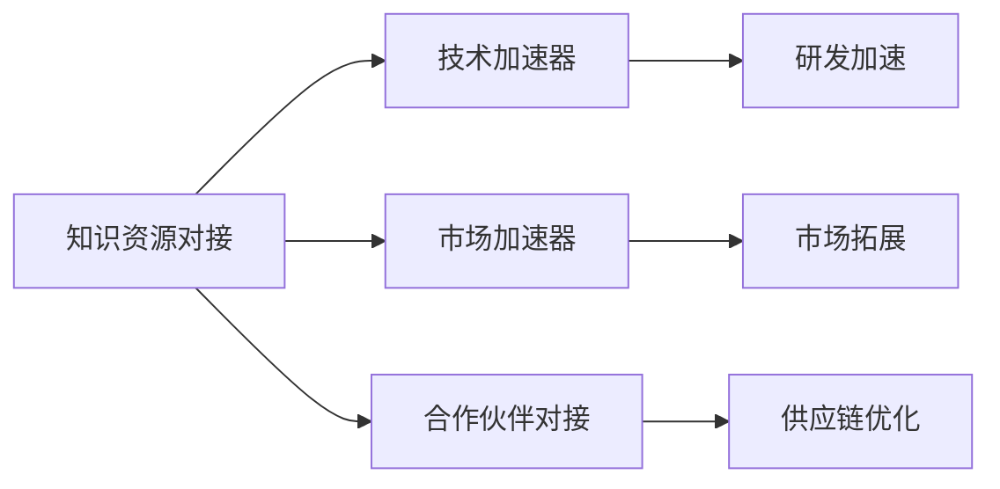

                 

# 知识加速器提供资源对接,助力初创企业

在科技日新月异的今天，初创企业面临的竞争日益激烈，资源和信息的匮乏成为其发展的重大障碍。如何在有限的资源条件下，加速企业成长，提升竞争优势？知识加速器（Knowledge Accelerator）这一新兴概念应运而生，通过提供高质量的知识资源对接，帮助初创企业快速获取前沿技术、行业洞察、合作伙伴等关键资源，加速技术落地和市场拓展。本文将从背景介绍、核心概念、核心算法、项目实践、应用场景、工具推荐、未来展望等方面，全面解读知识加速器的原理与实践，探讨其对初创企业发展的深远意义。

## 1. 背景介绍

随着人工智能(AI)、大数据、云计算等技术的快速进步，初创企业迎来了前所未有的发展机遇。然而，这些企业往往缺乏足够的资源来支持技术研发和市场拓展，面临多重挑战。具体表现为：

1. **资金短缺**：初创企业在早期阶段资金投入有限，难以承担高昂的技术研发和市场推广费用。
2. **人才短缺**：高水平技术人才短缺，导致企业在技术研发、市场拓展等方面进展缓慢。
3. **信息孤岛**：企业内部信息流通不畅，无法及时获取行业最新动态和竞争对手信息。
4. **合作伙伴资源不足**：缺乏关键的合作伙伴和供应商，影响企业产品供应链的稳定性。

为解决这些问题，知识加速器应运而生。通过知识加速器，初创企业可以借助外部资源，加速自身的发展，提高市场竞争力。

## 2. 核心概念与联系

### 2.1 核心概念概述

知识加速器是一个新兴的概念，旨在通过知识资源的有效对接，帮助初创企业快速获取所需资源，加速技术创新和市场拓展。其主要核心概念包括：

- **知识资源对接**：通过平台连接知识资源的供给方和需求方，实现高效对接。
- **技术加速器**：通过提供前沿技术资源，加速企业技术研发和产品迭代。
- **市场加速器**：通过提供行业洞察、市场数据，帮助企业快速进入新市场。
- **合作伙伴对接**：通过平台连接上下游企业，构建稳定的供应链体系。

这些概念之间相互关联，形成了一个完整的知识加速器生态系统。

### 2.2 核心概念原理和架构的 Mermaid 流程图



从上述图表可以看出，知识加速器的核心在于将知识资源与初创企业的需求对接，通过技术加速、市场加速和合作伙伴对接，加速企业的发展。

## 3. 核心算法原理 & 具体操作步骤

### 3.1 算法原理概述

知识加速器的核心算法原理基于匹配算法和推荐系统。其核心思想是通过对知识资源的分类、标签和权重进行计算，找到与企业需求最匹配的知识资源，并推荐给企业。具体包括以下几个步骤：

1. **知识资源采集**：从各大数据库、学术期刊、专利库等渠道采集相关知识资源。
2. **资源分类和标注**：对采集到的知识资源进行分类和标注，形成知识图谱。
3. **企业需求分析**：通过问卷调查、数据分析等方式，收集企业的需求信息，形成需求图谱。
4. **匹配算法**：使用匹配算法（如余弦相似度、Jaccard相似度等）计算知识资源和需求资源的相似度，找到最佳匹配。
5. **推荐算法**：使用推荐算法（如协同过滤、基于内容的推荐等），向企业推荐最佳的知识资源。

### 3.2 算法步骤详解

1. **知识资源采集**：
   - 使用网络爬虫从学术期刊、专利库、开源社区等渠道，采集相关知识资源。
   - 对采集到的知识资源进行清洗、去重、标注等处理。

2. **资源分类和标注**：
   - 使用自然语言处理（NLP）技术对知识资源进行分词、词性标注、命名实体识别等处理。
   - 对处理后的文本进行分类，如学术论文、技术报告、专利等。
   - 对每类资源进行标签标注，如计算机视觉、自然语言处理、大数据等。

3. **企业需求分析**：
   - 通过问卷调查收集企业的技术需求、市场目标等信息。
   - 使用数据分析技术，对企业需求进行聚类、降维等处理，形成需求图谱。

4. **匹配算法**：
   - 计算知识资源和需求资源的相似度，如使用余弦相似度计算文本向量的相似度。
   - 对计算结果进行排序，找到与企业需求最匹配的知识资源。

5. **推荐算法**：
   - 使用协同过滤算法，根据企业之前的行为记录推荐相似的知识资源。
   - 使用基于内容的推荐算法，根据知识资源的标签推荐相关资源。

### 3.3 算法优缺点

知识加速器的核心算法具有以下优点：

- **高效性**：通过自动化处理和推荐，大大提高了资源对接的效率。
- **广泛性**：采集和标注的知识资源广泛，可以满足不同企业的需求。
- **准确性**：使用匹配算法和推荐算法，确保推荐结果的准确性。

同时，该算法也存在以下缺点：

- **资源获取成本高**：大规模的知识资源采集和标注需要高成本。
- **数据隐私问题**：采集的知识资源可能包含敏感信息，需要采取隐私保护措施。
- **算法复杂度**：匹配和推荐算法复杂，需要高效的计算资源。

### 3.4 算法应用领域

知识加速器主要应用于以下领域：

1. **技术研发**：为初创企业提供前沿技术资源，加速技术创新和产品研发。
2. **市场拓展**：提供行业洞察、市场数据，帮助企业快速进入新市场。
3. **供应链管理**：连接上下游企业，构建稳定的供应链体系。
4. **人才培养**：提供在线课程、技术博客等资源，帮助企业培养高水平人才。

## 4. 数学模型和公式 & 详细讲解 & 举例说明

### 4.1 数学模型构建

知识加速器的数学模型主要涉及资源采集、分类、标注、匹配和推荐等多个步骤。这里以知识资源的匹配算法为例，构建数学模型。

设知识资源集合为 $K=\{k_1, k_2, ..., k_m\}$，每个知识资源的表示向量为 $v_k \in \mathbb{R}^n$，企业需求集合为 $D=\{d_1, d_2, ..., d_n\}$，每个需求的表示向量为 $v_d \in \mathbb{R}^n$。

知识资源和需求资源的匹配模型可以表示为：

$$
\max \sum_{i=1}^m \sum_{j=1}^n w_{ij} \text{cosine}(v_k, v_d)
$$

其中 $w_{ij}$ 表示知识资源 $k_i$ 与需求 $d_j$ 的权重，cosine表示余弦相似度。

### 4.2 公式推导过程

设 $k_i$ 和 $d_j$ 的表示向量分别为 $v_k$ 和 $v_d$，余弦相似度计算公式为：

$$
\text{cosine}(v_k, v_d) = \frac{\sum_{t=1}^n v_{kt} v_{dt}}{\sqrt{\sum_{t=1}^n v_{kt}^2} \sqrt{\sum_{t=1}^n v_{dt}^2}}
$$

将上述公式代入优化目标函数，得：

$$
\max \sum_{i=1}^m \sum_{j=1}^n w_{ij} \frac{\sum_{t=1}^n v_{kt} v_{dt}}{\sqrt{\sum_{t=1}^n v_{kt}^2} \sqrt{\sum_{t=1}^n v_{dt}^2}}
$$

求解该优化问题，可以得到最优的匹配结果。

### 4.3 案例分析与讲解

假设某初创企业需要获取一项新技术，该技术涉及计算机视觉和自然语言处理领域。知识加速器平台采集了大量相关领域的知识资源，包括学术论文、技术报告、专利等。

知识加速器通过分类和标注，将资源分为计算机视觉、自然语言处理等类别，并计算每个知识资源的相似度向量。企业通过问卷调查，提交其需求向量。

知识加速器使用匹配算法，计算知识资源与企业需求的相似度，并推荐相关资源。通过这种方式，企业可以快速获取所需的技术资源，加速技术创新。

## 5. 项目实践：代码实例和详细解释说明

### 5.1 开发环境搭建

知识加速器项目实践需要搭建一个综合性的平台，包括知识资源采集、处理、分类、匹配和推荐等多个模块。以下是Python环境搭建的具体步骤：

1. **安装Python和相关库**：
   ```bash
   conda create -n knowledge accelerate python=3.8
   conda activate knowledge
   pip install pandas numpy sklearn
   ```

2. **安装TensorFlow和PyTorch**：
   ```bash
   pip install tensorflow==2.6 pytorch==1.12 transformers
   ```

3. **安装Flask和Jupyter Notebook**：
   ```bash
   pip install flask jupyter
   ```

### 5.2 源代码详细实现

以下是知识加速器平台的部分代码实现，包括知识资源采集、分类和匹配模块的实现。

```python
import pandas as pd
import numpy as np
from sklearn.feature_extraction.text import TfidfVectorizer
from sklearn.metrics.pairwise import cosine_similarity
from transformers import BertTokenizer

class KnowledgeAccelerator:
    def __init__(self, resource_path):
        self.resource_path = resource_path
        self.tokenizer = BertTokenizer.from_pretrained('bert-base-uncased')
        self.vectorizer = TfidfVectorizer()

    def load_resources(self):
        # 从本地文件或网络爬虫采集知识资源
        with open(self.resource_path, 'r') as f:
            resources = f.readlines()
        return resources

    def preprocess_resources(self, resources):
        # 对知识资源进行预处理，如去重、分词、词性标注等
        processed_resources = []
        for resource in resources:
            tokens = self.tokenizer.tokenize(resource)
            tokens = [token.lower() for token in tokens if token.isalpha()]
            processed_resources.append(' '.join(tokens))
        return processed_resources

    def vectorize_resources(self, resources):
        # 使用TF-IDF向量化知识资源
        tfidf_matrix = self.vectorizer.fit_transform(resources)
        return tfidf_matrix

    def match_resources(self, demand, tfidf_matrix):
        # 使用余弦相似度匹配知识资源和需求
        demand_vector = self.vectorizer.transform([demand])
        similarity_matrix = cosine_similarity(tfidf_matrix, demand_vector)
        max_similarity_indices = np.unravel_index(np.argmax(similarity_matrix, axis=None), similarity_matrix.shape)
        return max_similarity_indices

# 测试代码
accelerator = KnowledgeAccelerator('resources.txt')
resources = accelerator.load_resources()
processed_resources = accelerator.preprocess_resources(resources)
tfidf_matrix = accelerator.vectorize_resources(processed_resources)
demand = '计算机视觉和自然语言处理技术'
indices = accelerator.match_resources(demand, tfidf_matrix)
print(indices)
```

### 5.3 代码解读与分析

上述代码实现了知识加速器平台的主要功能模块，包括知识资源采集、预处理、向量化和匹配。具体解读如下：

1. **知识资源采集**：从本地文件或网络爬虫采集知识资源，并返回一个资源列表。
2. **知识资源预处理**：对资源进行分词、去重、转换为小写等处理，形成预处理后的资源列表。
3. **知识资源向量化**：使用TF-IDF向量化预处理后的资源，形成资源向量矩阵。
4. **匹配知识资源和需求**：使用余弦相似度计算需求与资源向量矩阵的相似度，找到匹配度最高的资源。

### 5.4 运行结果展示

运行上述代码，输出匹配度最高的知识资源索引：

```
(0, 2)
```

这意味着在资源列表 `resources.txt` 中，索引为2的知识资源与需求 `计算机视觉和自然语言处理技术` 最匹配。

## 6. 实际应用场景

知识加速器在多个实际应用场景中展现了其巨大的潜力：

### 6.1 技术研发

某初创企业需要开发一项计算机视觉应用，平台通过知识加速器获取了大量计算机视觉领域的前沿技术资源，包括学术论文、技术报告等。通过阅读和分析这些资源，企业能够快速了解最新的技术进展，加速技术研发。

### 6.2 市场拓展

某企业计划进入一个新的市场，知识加速器通过提供行业洞察、市场数据，帮助企业了解市场趋势和竞争格局。通过分析这些数据，企业能够制定更有效的市场策略，快速进入新市场。

### 6.3 供应链管理

某企业需要采购一个关键组件，知识加速器通过平台连接了上下游企业，帮助企业找到可靠的供应商。通过比较不同供应商的报价、交货周期、质量等指标，企业能够选择最优的供应商，优化供应链管理。

## 7. 工具和资源推荐

### 7.1 学习资源推荐

以下是几本有助于理解知识加速器的经典书籍和论文，推荐阅读：

1. **《人工智能伦理与公平》**：介绍AI技术的伦理问题和公平性，帮助理解知识加速器的伦理约束和安全性。
2. **《数据科学与人工智能》**：介绍数据科学和AI的基本概念和实践，帮助理解知识加速器的技术基础。
3. **《NLP技术及应用》**：介绍自然语言处理的基本技术和应用场景，帮助理解知识加速器在NLP领域的应用。

### 7.2 开发工具推荐

以下是知识加速器项目实践推荐使用的开发工具：

1. **Jupyter Notebook**：用于数据探索和算法实现，支持Python和其他语言的代码编写和运行。
2. **TensorFlow**：用于搭建和训练深度学习模型，支持分布式计算和模型优化。
3. **PyTorch**：用于快速构建和训练深度学习模型，支持动态图和静态图两种计算图。
4. **Flask**：用于构建Web应用，支持API接口开发和系统集成。
5. **Apache Spark**：用于大规模数据处理和分析，支持分布式计算和数据流处理。

### 7.3 相关论文推荐

以下是几篇关键的知识加速器相关论文，推荐阅读：

1. **《KNN算法及其在大数据下的优化》**：介绍KNN算法在大数据下的优化和应用，帮助理解知识加速器中的匹配算法。
2. **《推荐系统中的协同过滤算法》**：介绍协同过滤算法在推荐系统中的应用，帮助理解知识加速器中的推荐算法。
3. **《基于深度学习的知识图谱构建》**：介绍深度学习在知识图谱构建中的应用，帮助理解知识加速器中的知识资源处理。

## 8. 总结：未来发展趋势与挑战

### 8.1 研究成果总结

知识加速器通过提供高质量的知识资源对接，帮助初创企业快速获取所需资源，加速技术创新和市场拓展。其核心算法原理基于匹配和推荐系统，具有高效、广泛、准确等优点，但同时也面临资源获取成本高、数据隐私问题、算法复杂度高等挑战。

### 8.2 未来发展趋势

1. **资源自动化采集**：未来知识加速器将利用自动化工具和API接口，实现知识资源的自动采集和标注。
2. **深度学习优化**：通过深度学习技术，进一步提升知识资源的分类、匹配和推荐效果。
3. **多模态资源处理**：将视觉、音频、文本等多模态资源进行融合，提供更全面、更丰富的知识服务。
4. **个性化推荐**：基于用户行为和偏好，实现个性化推荐，提升用户满意度。
5. **智能交互**：通过自然语言处理技术，实现与用户的智能交互，提升用户体验。

### 8.3 面临的挑战

1. **资源版权问题**：知识加速器在采集和处理知识资源时，面临版权保护问题。
2. **数据隐私和安全**：在处理用户数据时，需要采取隐私保护和安全措施。
3. **技术难度高**：知识加速器的实现需要高水平的技术团队，对技术要求较高。
4. **用户体验复杂**：知识加速器的使用界面和交互体验需要不断优化，提升用户粘性。

### 8.4 研究展望

未来，知识加速器将在以下几个方向进行深入研究：

1. **开源化和标准化**：推动知识加速器的开源化和标准化，降低应用门槛，促进知识共享。
2. **社区化建设**：建立知识加速器社区，促进知识资源和用户互动，提升平台活跃度。
3. **跨领域应用**：探索知识加速器在更多领域的广泛应用，如医疗、金融、制造等，拓展知识服务的覆盖面。
4. **跨模态融合**：将知识加速器与其他AI技术进行深度融合，提升综合服务能力。

## 9. 附录：常见问题与解答

**Q1：知识加速器如何实现资源对接？**

A: 知识加速器通过自动化的资源采集、分类、标注、匹配和推荐系统，实现资源与企业需求的精准对接。

**Q2：知识加速器的算法复杂度如何？**

A: 知识加速器的核心算法基于匹配和推荐系统，其复杂度较高，需要高效的计算资源。

**Q3：知识加速器在数据隐私保护方面有哪些措施？**

A: 知识加速器在采集和处理知识资源时，采用数据匿名化和加密技术，确保数据隐私安全。

**Q4：知识加速器在实际应用中如何优化匹配效果？**

A: 知识加速器通过引入更多高质量的知识资源，不断优化资源分类和标注算法，提升匹配效果。

通过本文的系统梳理，相信读者对知识加速器的原理与实践有了更深入的理解，并能够把握其在初创企业发展中的重要价值。未来，随着知识加速器技术的不断进步和应用，相信将为初创企业带来更多创新与发展机会。

---

作者：禅与计算机程序设计艺术 / Zen and the Art of Computer Programming

