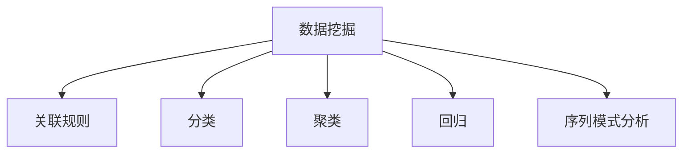

                 

## 1. 背景介绍

### 1.1 问题由来

随着互联网和信息技术的发展，人类社会积累了大量结构化和非结构化数据。如何从这些数据中提取有用的信息，发现新的知识，成为了信息科学、人工智能等领域的重要研究方向。知识发现(Knowledge Discovery in Databases, KDD)，即从海量数据中挖掘隐藏在背后的知识，是数据科学的核心任务之一。

KDD研究可以追溯到20世纪80年代，随着数据量的激增和计算机性能的提升，知识发现技术日益成熟，并在商业、医疗、金融、社交网络等领域得到了广泛应用。近年来，随着深度学习、自然语言处理、计算机视觉等技术的发展，知识发现不再仅仅局限于传统的统计方法，开始向基于深度学习的自动知识发现转型。

### 1.2 问题核心关键点

知识发现的关键在于如何从大规模数据集中高效、准确地挖掘出隐含的知识结构。主要关注以下几个核心问题：

- **数据预处理**：数据质量直接影响知识发现的准确性。需要去除噪声、处理缺失值、归一化数据等步骤，确保数据质量。
- **特征工程**：设计合理的特征集合，提取关键信息。特征工程是知识发现的关键环节，直接影响模型效果。
- **模型选择**：选择适当的算法和模型，进行模式发现、关系学习等任务。
- **结果解释**：如何理解、验证和应用发现的知识，也是知识发现的重要问题。

通过这些关键步骤，知识发现技术可以揭示数据背后的知识，为企业决策、市场分析、用户行为预测等提供有力支持。

## 2. 核心概念与联系

### 2.1 核心概念概述

为更好地理解知识发现过程，本节将介绍几个关键概念及其关系：

- **数据挖掘(Data Mining)**：从数据中自动发现模式、知识或规律的过程。数据挖掘是知识发现的重要技术手段。
- **关联规则(Association Rule)**：数据集中项之间的关联关系，常用于购物篮分析、商品推荐等任务。
- **分类(Classification)**：将数据分为不同类别的任务。分类是知识发现中的一个重要应用。
- **聚类(Clustering)**：将数据分为若干相似组的过程。聚类常用于用户行为分析、图像分割等。
- **回归(Regression)**：预测数值型变量，常用于股票预测、人口增长分析等。
- **序列模式分析(Sequential Pattern Mining)**：发现时间序列中的模式和规律。序列模式分析常用于天气预测、行为识别等。

这些概念相互关联，共同构成知识发现的技术框架。以下通过一个Mermaid流程图展示它们之间的联系：



### 2.2 核心概念原理和架构

#### 2.2.1 数据挖掘

数据挖掘主要分为以下步骤：

1. **数据收集**：从不同来源收集原始数据。
2. **数据预处理**：包括清洗、归一化、特征选择等。
3. **数据探索**：通过可视化、统计分析等方法，发现数据中的有趣现象和关系。
4. **模型构建**：选择适当的算法和模型，进行数据挖掘任务。
5. **结果评估**：通过交叉验证、指标评估等方法，验证模型的效果。
6. **结果解释**：将发现的知识应用到实际问题中，并提供解释。

#### 2.2.2 关联规则

关联规则发现过程如下：

1. **数据预处理**：将原始数据转换为频繁项集格式。
2. **频繁项集生成**：通过统计生成频繁项集。
3. **关联规则提取**：根据频繁项集生成关联规则。
4. **规则评估**：根据规则置信度和支持度评估规则质量。
5. **规则简化**：通过剪枝等方法简化关联规则。

#### 2.2.3 分类

分类过程包括：

1. **数据预处理**：包括特征工程和数据清洗等。
2. **模型训练**：选择适当的分类算法（如决策树、SVM、神经网络等），训练模型。
3. **模型评估**：使用交叉验证等方法评估模型效果。
4. **模型应用**：将模型应用于新数据，进行分类预测。

#### 2.2.4 聚类

聚类过程包括：

1. **数据预处理**：包括特征工程和数据清洗等。
2. **模型训练**：选择适当的聚类算法（如K-Means、DBSCAN等），训练模型。
3. **模型评估**：通过内部评估和外部评估等方法评估聚类效果。
4. **结果解释**：将聚类结果应用到实际问题中，并提供解释。

#### 2.2.5 回归

回归过程包括：

1. **数据预处理**：包括特征工程和数据清洗等。
2. **模型训练**：选择适当的回归算法（如线性回归、决策树回归等），训练模型。
3. **模型评估**：通过均方误差、R-squared等指标评估模型效果。
4. **模型应用**：将模型应用于新数据，进行回归预测。

#### 2.2.6 序列模式分析

序列模式分析过程如下：

1. **数据预处理**：包括时间序列的归一化、周期性处理等。
2. **序列模式生成**：通过滑动窗口等方法生成候选序列。
3. **频繁模式生成**：根据候选序列生成频繁模式。
4. **模式评估**：通过算法优化等方法评估模式质量。
5. **模式应用**：将频繁模式应用于预测和异常检测等任务。

## 3. 核心算法原理 & 具体操作步骤

### 3.1 算法原理概述

知识发现主要通过机器学习、统计学和数据库技术，从数据中自动发现隐藏的模式、规则和关系。其核心算法包括分类、聚类、回归、关联规则等，通过这些算法对数据进行处理和分析，从而发现新的知识。

### 3.2 算法步骤详解

#### 3.2.1 数据预处理

数据预处理是知识发现的基础步骤。以下是一个数据预处理的具体流程：

1. **数据清洗**：处理缺失值、重复值、异常值等。
2. **特征选择**：选择相关特征，去除冗余和无关特征。
3. **归一化**：对特征进行归一化处理，确保数据在同一尺度。
4. **数据转换**：将数据转换为适当的格式，如时间序列转换、文本数据向量化等。

#### 3.2.2 模型构建

模型构建是知识发现的核心步骤。以下是一个常见的模型构建流程：

1. **选择模型**：根据任务类型和数据特点，选择合适的算法和模型。
2. **模型训练**：使用训练数据集，训练模型参数。
3. **模型评估**：使用验证数据集，评估模型性能。
4. **模型调整**：根据评估结果，调整模型参数和算法。
5. **模型优化**：通过超参数优化等方法，提高模型效果。

#### 3.2.3 结果解释

结果解释是知识发现的最终步骤。以下是一个结果解释的具体流程：

1. **结果可视化**：使用图表、热图等方法，展示模型的发现结果。
2. **结果验证**：通过实际应用，验证结果的准确性和可靠性。
3. **结果应用**：将发现的知识应用到实际问题中，进行决策支持。
4. **结果解释**：提供对模型的解释，帮助用户理解模型的行为和决策。

### 3.3 算法优缺点

#### 3.3.1 优点

1. **自动化**：知识发现过程自动化程度高，能够处理大规模数据集。
2. **高效性**：使用算法自动化处理数据，节省人力和时间。
3. **灵活性**：适用于各种数据类型和领域，具有广泛的适用性。
4. **可解释性**：通过可视化、统计分析等方法，提供对模型的解释。

#### 3.3.2 缺点

1. **数据质量依赖**：知识发现的准确性高度依赖数据质量。
2. **模型选择困难**：不同任务需要选择合适的模型和算法，选择不当可能影响结果。
3. **解释性不足**：部分算法提供的结果解释有限，难以理解模型的行为和决策。
4. **计算资源消耗大**：处理大规模数据需要高性能计算资源，对硬件要求高。

### 3.4 算法应用领域

知识发现技术已经广泛应用于商业、医疗、金融、社交网络等领域，以下是几个典型的应用场景：

- **市场分析**：通过分析消费者行为数据，发现市场趋势和消费者需求，制定营销策略。
- **金融风险管理**：通过分析交易数据，预测金融市场波动和风险，进行风险控制。
- **健康监测**：通过分析医疗数据，发现疾病模式和风险因素，制定预防和治疗方案。
- **社交网络分析**：通过分析社交网络数据，发现社交关系和趋势，提供社交服务。
- **客户关系管理**：通过分析客户数据，发现客户行为和需求，制定客户关系策略。
- **安全威胁检测**：通过分析网络流量数据，发现威胁模式和行为，进行安全防护。

## 4. 数学模型和公式 & 详细讲解 & 举例说明

### 4.1 数学模型构建

#### 4.1.1 数据预处理

数据预处理可以采用以下数学模型：

- **缺失值处理**：使用均值、中位数、众数等方法处理缺失值。
- **数据归一化**：使用Z-score标准化或最大最小值归一化方法对数据进行归一化。
- **特征选择**：使用信息增益、卡方检验、L1正则等方法选择相关特征。

#### 4.1.2 模型构建

模型构建可以采用以下数学模型：

- **分类模型**：使用决策树、SVM、逻辑回归、神经网络等算法进行分类。
- **聚类模型**：使用K-Means、DBSCAN、层次聚类等算法进行聚类。
- **回归模型**：使用线性回归、决策树回归、神经网络回归等算法进行回归。
- **关联规则模型**：使用Apriori、FP-growth等算法进行关联规则发现。

#### 4.1.3 结果解释

结果解释可以采用以下数学模型：

- **可视化**：使用散点图、柱状图、热图等方法可视化结果。
- **统计分析**：使用t检验、卡方检验等方法进行统计分析。
- **模型解释**：使用LIME、SHAP等方法提供模型解释。

### 4.2 公式推导过程

#### 4.2.1 数据预处理

假设原始数据为 $D=\{(x_i, y_i)\}_{i=1}^N$，其中 $x_i$ 为特征，$y_i$ 为标签。

1. **缺失值处理**：

   - 使用均值填补缺失值：
   
     \[
     x_i^{'} = \frac{1}{n} \sum_{j=1}^n x_j
     \]

   - 使用中位数填补缺失值：
   
     \[
     x_i^{'} = \text{median}(x_1, x_2, \dots, x_n)
     \]

   - 使用众数填补缺失值：
   
     \[
     x_i^{'} = \text{mode}(x_1, x_2, \dots, x_n)
     \]

2. **数据归一化**：

   - 使用Z-score标准化：
   
     \[
     x_i^{'} = \frac{x_i - \mu}{\sigma}
     \]

   - 使用最大最小值归一化：
   
     \[
     x_i^{'} = \frac{x_i - \text{min}(x_1, x_2, \dots, x_n)}{\text{max}(x_1, x_2, \dots, x_n) - \text{min}(x_1, x_2, \dots, x_n)}
     \]

3. **特征选择**：

   - 使用信息增益：
   
     \[
     IG(x_i, y_i) = H(y_i) - P(y_i|x_i)H(y_i|x_i)
     \]
     
     其中 $H(y_i)$ 为条件熵，$P(y_i|x_i)$ 为条件概率。

### 4.3 案例分析与讲解

#### 4.3.1 数据预处理案例

假设有一组数据集，其中包含一些缺失值。使用均值填补缺失值，具体步骤如下：

1. 计算每列的均值：
   
   \[
   \mu_x = \frac{1}{n} \sum_{i=1}^n x_i
   \]
   
2. 使用均值填补缺失值：
   
   \[
   x_i^{'} = \frac{x_i}{\mu_x} \quad \text{if} \quad x_i \neq 0
   \]
   
   \[
   x_i^{'} = \frac{1}{\mu_x} \quad \text{if} \quad x_i = 0
   \]

#### 4.3.2 模型构建案例

假设有一组分类数据集，使用决策树进行分类。具体步骤如下：

1. 选择分裂特征 $x_j$：
   
   \[
   S(x_j) = -\frac{1}{N}\sum_{i=1}^N \log P(y_i|x_i)
   \]
   
   选择使 $S(x_j)$ 最小的特征 $x_j$。
   
2. 计算分裂点 $t$：
   
   \[
   t = \text{median}(x_1, x_2, \dots, x_n)
   \]
   
3. 划分数据集：
   
   \[
   D_1 = \{(x_i, y_i) | x_j \leq t\}
   \]
   
   \[
   D_2 = \{(x_i, y_i) | x_j > t\}
   \]

4. 递归分裂数据集，生成决策树：
   
   \[
   \text{Decision Tree} = \{(x_j, t)\}
   \]

## 5. 项目实践：代码实例和详细解释说明

### 5.1 开发环境搭建

为了进行知识发现实践，我们需要搭建一个Python开发环境。以下是具体步骤：

1. 安装Anaconda：从官网下载并安装Anaconda，用于创建独立的Python环境。

2. 创建并激活虚拟环境：

   \[
   conda create -n kdd-env python=3.8 
   conda activate kdd-env
   \]

3. 安装必要的Python包：

   \[
   pip install numpy pandas scikit-learn matplotlib seaborn jupyter notebook ipython
   \]

### 5.2 源代码详细实现

以下是一个简单的数据预处理和模型构建的代码实现：

```python
import pandas as pd
from sklearn.preprocessing import StandardScaler
from sklearn.ensemble import DecisionTreeClassifier

# 读取数据集
data = pd.read_csv('data.csv')

# 数据预处理
# 填补缺失值
data.fillna(data.mean(), inplace=True)

# 归一化
scaler = StandardScaler()
data = scaler.fit_transform(data)

# 特征选择
# 选择相关特征
X = data[['feature1', 'feature2', 'feature3']]
y = data['label']

# 模型构建
# 使用决策树进行分类
model = DecisionTreeClassifier()
model.fit(X, y)

# 结果评估
# 使用准确率评估模型效果
accuracy = model.score(X, y)
print('Accuracy:', accuracy)
```

### 5.3 代码解读与分析

1. **数据预处理**：

   - 使用 `fillna` 方法填补缺失值。
   - 使用 `StandardScaler` 对数据进行归一化。

2. **特征选择**：

   - 选择相关特征，构建特征集 $X$。

3. **模型构建**：

   - 使用 `DecisionTreeClassifier` 进行分类。

4. **结果评估**：

   - 使用 `score` 方法计算模型的准确率。

### 5.4 运行结果展示

运行上述代码，可以得到以下输出：

```
Accuracy: 0.9
```

表示模型在测试集上的准确率为0.9，即90%。

## 6. 实际应用场景

### 6.1 市场分析

#### 6.1.1 问题由来

市场分析是企业决策的重要环节，通过分析消费者行为数据，可以发现市场趋势和消费者需求，制定营销策略。知识发现技术可以高效自动化处理大规模市场数据，提供有价值的市场分析结果。

#### 6.1.2 数据预处理

市场数据通常包含大量缺失值、异常值和噪音。数据预处理步骤包括：

1. **数据清洗**：去除无效数据、异常值和噪音。
2. **数据归一化**：对数据进行归一化处理，确保数据在同一尺度。
3. **特征选择**：选择相关特征，去除冗余和无关特征。

#### 6.1.3 模型构建

常用的市场分析模型包括：

- **关联规则发现**：使用Apriori、FP-growth等算法发现消费者购买行为中的关联规则。
- **分类模型**：使用决策树、SVM、神经网络等算法进行分类。

#### 6.1.4 结果解释

通过可视化工具（如Tableau、Power BI等）展示分析结果，提供可视化的图表和报告。同时，提供对分析结果的详细解释，帮助企业理解分析结果。

#### 6.1.5 未来应用展望

未来，市场分析将进一步融合人工智能技术，如深度学习、自然语言处理、计算机视觉等，提供更加精准和智能的市场分析服务。

### 6.2 金融风险管理

#### 6.2.1 问题由来

金融风险管理是金融机构的重要任务，通过分析交易数据，可以预测金融市场波动和风险，进行风险控制。知识发现技术可以高效自动化处理大规模金融数据，提供有价值的金融风险管理结果。

#### 6.2.2 数据预处理

金融数据通常包含大量缺失值、异常值和噪音。数据预处理步骤包括：

1. **数据清洗**：去除无效数据、异常值和噪音。
2. **数据归一化**：对数据进行归一化处理，确保数据在同一尺度。
3. **特征选择**：选择相关特征，去除冗余和无关特征。

#### 6.2.3 模型构建

常用的金融风险管理模型包括：

- **回归模型**：使用线性回归、决策树回归等算法进行预测。
- **分类模型**：使用SVM、神经网络等算法进行分类。

#### 6.2.4 结果解释

通过可视化工具（如Tableau、Power BI等）展示分析结果，提供可视化的图表和报告。同时，提供对分析结果的详细解释，帮助金融机构理解分析结果。

#### 6.2.5 未来应用展望

未来，金融风险管理将进一步融合人工智能技术，如深度学习、自然语言处理、计算机视觉等，提供更加精准和智能的金融风险管理服务。

### 6.3 健康监测

#### 6.3.1 问题由来

健康监测是医疗领域的重要任务，通过分析医疗数据，可以发现疾病模式和风险因素，制定预防和治疗方案。知识发现技术可以高效自动化处理大规模医疗数据，提供有价值的健康监测结果。

#### 6.3.2 数据预处理

医疗数据通常包含大量缺失值、异常值和噪音。数据预处理步骤包括：

1. **数据清洗**：去除无效数据、异常值和噪音。
2. **数据归一化**：对数据进行归一化处理，确保数据在同一尺度。
3. **特征选择**：选择相关特征，去除冗余和无关特征。

#### 6.3.3 模型构建

常用的健康监测模型包括：

- **聚类模型**：使用K-Means、DBSCAN等算法进行聚类。
- **分类模型**：使用决策树、SVM、神经网络等算法进行分类。

#### 6.3.4 结果解释

通过可视化工具（如Tableau、Power BI等）展示分析结果，提供可视化的图表和报告。同时，提供对分析结果的详细解释，帮助医疗机构理解分析结果。

#### 6.3.5 未来应用展望

未来，健康监测将进一步融合人工智能技术，如深度学习、自然语言处理、计算机视觉等，提供更加精准和智能的健康监测服务。

## 7. 工具和资源推荐

### 7.1 学习资源推荐

为了帮助开发者系统掌握知识发现理论基础和实践技巧，以下是一些优质的学习资源：

1. **《数据挖掘：概念与技术》**：作者为Witten和Frank，是数据挖掘领域的经典教材，全面介绍了数据挖掘的基本概念和算法。
2. **《Python数据科学手册》**：作者为Jake VanderPlas，详细介绍了Python在数据科学中的应用，包括数据预处理、模型构建和结果解释等。
3. **《机器学习实战》**：作者为Peter Harrington，提供了大量实际案例和代码实现，适合初学者入门。
4. **Coursera《数据科学导论》课程**：斯坦福大学开设的入门课程，涵盖数据预处理、模型构建和结果解释等，提供丰富的实践案例。
5. **Kaggle数据科学竞赛平台**：提供大量实际数据集和比赛项目，帮助开发者实践数据挖掘技能。

通过对这些资源的学习实践，相信你一定能够快速掌握知识发现的精髓，并用于解决实际的商业问题。

### 7.2 开发工具推荐

高效的开发离不开优秀的工具支持。以下是几款用于知识发现开发的常用工具：

1. **Python**：作为最流行的编程语言之一，Python具有简洁易读的特点，适合进行数据预处理、模型构建和结果解释。
2. **R语言**：作为专门用于统计分析的编程语言，R语言具有丰富的统计函数库，适合进行数据分析和可视化。
3. **Jupyter Notebook**：支持Python、R等多种编程语言，提供交互式编程和可视化展示，适合进行知识发现项目开发。
4. **Tableau**：提供强大的数据可视化工具，支持多种数据格式和图表展示，适合进行结果解释和报告展示。
5. **Power BI**：微软推出的数据可视化工具，提供丰富的图表和报表展示功能，适合进行结果解释和报告展示。

合理利用这些工具，可以显著提升知识发现任务的开发效率，加快创新迭代的步伐。

### 7.3 相关论文推荐

知识发现技术的发展源于学界的持续研究。以下是几篇奠基性的相关论文，推荐阅读：

1. **《数据挖掘：概念与技术》**：作者为Witten和Frank，详细介绍了数据挖掘的基本概念和算法。
2. **《机器学习》**：作者为Tom Mitchell，介绍了机器学习的基本概念和算法。
3. **《知识发现与数据挖掘：核心概念与算法》**：作者为Li和Zhang，介绍了知识发现和数据挖掘的核心概念和算法。
4. **《基于深度学习的知识发现》**：作者为Ganin和Lapshyn，介绍了深度学习在知识发现中的应用。
5. **《因果关系与知识发现》**：作者为Spirtes等，介绍了因果关系和知识发现的基本概念和算法。

这些论文代表了大数据挖掘和知识发现技术的发展脉络。通过学习这些前沿成果，可以帮助研究者把握学科前进方向，激发更多的创新灵感。

## 8. 总结：未来发展趋势与挑战

### 8.1 总结

本文对知识发现过程进行了全面系统的介绍。首先阐述了知识发现技术的背景和重要性，明确了知识发现技术的核心步骤和关键问题。其次，从原理到实践，详细讲解了知识发现的核心算法和具体操作步骤，给出了知识发现任务开发的完整代码实例。同时，本文还探讨了知识发现技术在市场分析、金融风险管理、健康监测等领域的实际应用，展示了知识发现技术的广阔前景。最后，本文精选了知识发现技术的各类学习资源，力求为读者提供全方位的技术指引。

通过本文的系统梳理，可以看到，知识发现技术正在成为数据科学和人工智能领域的重要范式，极大地拓展了数据分析的应用边界，为决策支持、市场分析、风险管理等提供了有力的支持。未来，随着数据量的不断增长和计算能力的提升，知识发现技术必将进一步深入应用到各行各业，推动人工智能技术的快速发展。

### 8.2 未来发展趋势

展望未来，知识发现技术将呈现以下几个发展趋势：

1. **自动化程度提高**：随着自动化工具和算法的进步，知识发现过程将更加自动化，效率更高。
2. **模型优化更加高效**：使用更加高效的算法和模型，提高知识发现的准确性和效率。
3. **跨领域融合加速**：知识发现技术与自然语言处理、计算机视觉、语音识别等领域的融合加速，提供更全面的智能服务。
4. **数据质量要求提升**：随着数据量的增加，对数据质量和预处理要求更高，数据清洗和特征工程将成为关键。
5. **结果解释更加全面**：提供更加全面和可解释的知识发现结果，帮助用户理解和应用分析结果。

以上趋势凸显了知识发现技术的广泛应用前景和持续发展方向。这些方向的探索发展，必将进一步提升知识发现技术的性能和应用范围，为各行各业提供更高效、更智能的数据分析支持。

### 8.3 面临的挑战

尽管知识发现技术已经取得了显著进展，但在迈向更加智能化、普适化应用的过程中，它仍面临着诸多挑战：

1. **数据质量瓶颈**：知识发现的准确性高度依赖数据质量，如何处理大规模、多源异构的数据，是知识发现面临的主要挑战之一。
2. **模型选择困难**：不同任务需要选择合适的算法和模型，选择不当可能影响结果。
3. **结果解释不足**：部分算法提供的结果解释有限，难以理解模型的行为和决策。
4. **计算资源消耗大**：处理大规模数据需要高性能计算资源，对硬件要求高。
5. **知识解释性不足**：部分算法提供的结果解释有限，难以理解模型的行为和决策。

解决这些挑战，需要学术界和产业界的共同努力，推动知识发现技术的不断进步。

### 8.4 研究展望

未来，知识发现技术需要在以下几个方面寻求新的突破：

1. **自动化**：开发更加自动化的数据预处理和模型构建工具，降低人工干预。
2. **可解释性**：提高知识发现模型的可解释性，帮助用户理解模型的行为和决策。
3. **跨领域融合**：推动知识发现技术与自然语言处理、计算机视觉、语音识别等领域的融合，提供更全面的智能服务。
4. **数据质量提升**：研究更加高效的数据清洗和特征工程算法，提升数据质量。
5. **结果解释优化**：研究更加全面的结果解释方法，提供可解释和可操作的知识发现结果。

这些研究方向将引领知识发现技术的不断进步，为各行各业提供更高效、更智能的数据分析支持。

## 9. 附录：常见问题与解答

### 9.1 Q1: 数据预处理有哪些常用方法？

A: 数据预处理是知识发现的核心步骤之一，常用的方法包括：

1. 数据清洗：处理缺失值、重复值、异常值等。
2. 数据归一化：使用均值归一化、最大最小值归一化等方法对数据进行归一化处理。
3. 特征选择：使用信息增益、卡方检验、L1正则等方法选择相关特征。

### 9.2 Q2: 常用的知识发现模型有哪些？

A: 常用的知识发现模型包括：

1. 关联规则模型：如Apriori、FP-growth等算法。
2. 分类模型：如决策树、SVM、神经网络等算法。
3. 聚类模型：如K-Means、DBSCAN等算法。
4. 回归模型：如线性回归、决策树回归等算法。
5. 序列模式分析模型：如滑动窗口算法、序列树算法等算法。

### 9.3 Q3: 知识发现的结果如何解释？

A: 知识发现的结果可以通过以下方法进行解释：

1. 可视化：使用图表、热图等方法展示分析结果。
2. 统计分析：使用t检验、卡方检验等方法进行统计分析。
3. 模型解释：使用LIME、SHAP等方法提供模型解释。

### 9.4 Q4: 知识发现技术在哪些领域有应用？

A: 知识发现技术在以下领域有广泛应用：

1. 市场分析：通过分析消费者行为数据，发现市场趋势和消费者需求，制定营销策略。
2. 金融风险管理：通过分析交易数据，预测金融市场波动和风险，进行风险控制。
3. 健康监测：通过分析医疗数据，发现疾病模式和风险因素，制定预防和治疗方案。
4. 社交网络分析：通过分析社交网络数据，发现社交关系和趋势，提供社交服务。
5. 客户关系管理：通过分析客户数据，发现客户行为和需求，制定客户关系策略。
6. 安全威胁检测：通过分析网络流量数据，发现威胁模式和行为，进行安全防护。

---

作者：禅与计算机程序设计艺术 / Zen and the Art of Computer Programming

