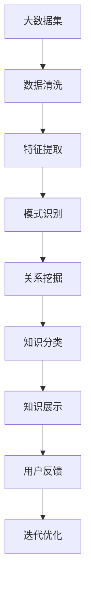

                 

# 知识发现引擎助力程序员快速掌握行业动态

> 关键词：知识发现引擎, 数据挖掘, 大数据分析, 程序员, 行业动态, 机器学习, 自然语言处理(NLP), 数据可视化, 业务智能化

## 1. 背景介绍

在当今飞速发展的IT行业中，程序员必须时刻保持对最新技术、行业动态的敏感，才能在竞争激烈的市场中立于不败之地。然而，面对浩如烟海的技术文献、项目报告和在线讨论，传统的查找和阅读方式已经无法满足需求。知识发现引擎作为一项前沿技术，能够从海量数据中快速发现并总结有价值的信息，为程序员提供精准、高效的知识获取方式。本文将深入探讨知识发现引擎的基本原理和应用实践，展示其如何帮助程序员快速掌握行业动态。

## 2. 核心概念与联系

### 2.1 核心概念概述

知识发现引擎(Knowledge Discovery Engine, KDE)是一种利用数据挖掘、机器学习、自然语言处理(NLP)等技术，从海量数据中挖掘和提炼出有用信息的数据分析工具。其主要功能包括数据清洗、特征提取、模式识别、关系挖掘等。通过对这些信息进行分类、聚类、关联规则分析等处理，知识发现引擎能够帮助用户揭示数据中的潜规律和有价值的知识。

知识发现引擎在多个领域得到广泛应用，如商业智能(BI)、金融分析、生物信息学、社交媒体分析等。在IT行业中，知识发现引擎能够帮助程序员快速掌握最新技术、学习最佳实践、了解行业趋势，从而提升开发效率和项目质量。

### 2.2 核心概念原理和架构的 Mermaid 流程图



这个流程图展示了知识发现引擎的主要工作流程：

1. **数据清洗**：去除重复、噪声和无关数据，确保数据质量。
2. **特征提取**：从数据中提取有意义的特征，供后续处理使用。
3. **模式识别**：发现数据中的模式和趋势，进行分类和聚类。
4. **关系挖掘**：分析数据中的关联和因果关系，形成知识图谱。
5. **知识分类**：将挖掘出的知识分类整理，便于展示和应用。
6. **知识展示**：以图表、报告、摘要等形式展示挖掘出的知识，供用户查看。
7. **用户反馈**：用户对展示的知识进行评价，系统根据反馈进行优化。
8. **迭代优化**：基于用户反馈，不断改进算法和模型，提升挖掘效果。

## 3. 核心算法原理 & 具体操作步骤

### 3.1 算法原理概述

知识发现引擎的核心算法包括数据挖掘算法、机器学习算法、NLP技术等。以下是几种常用的算法及其工作原理：

- **数据挖掘算法**：包括分类、聚类、关联规则分析等，用于从数据中发现规律和模式。
- **机器学习算法**：如决策树、支持向量机(SVM)、随机森林等，用于训练和预测模型。
- **NLP技术**：如词向量表示、命名实体识别、情感分析等，用于处理文本数据，提取有价值的信息。

知识发现引擎通常采用自顶向下的设计思路，即从具体问题出发，利用多种算法和技术，逐步揭示数据的深层含义和潜在规律。

### 3.2 算法步骤详解

知识发现引擎的具体操作步骤如下：

1. **数据预处理**：清洗和整理原始数据，去除噪声和缺失值，确保数据质量。
2. **特征提取**：根据领域知识和任务需求，提取关键特征，如词频、词向量、TF-IDF等。
3. **模型训练**：选择适合的数据挖掘或机器学习算法，对特征进行训练，建立预测模型。
4. **模式识别**：对模型进行测试和评估，识别数据中的模式和趋势，形成有价值的信息。
5. **关系挖掘**：利用图算法、关系型数据库等技术，发现数据之间的关联和因果关系。
6. **知识展示**：将挖掘出的知识进行分类、聚类和关联分析，生成易于理解的报告、图表等。
7. **用户反馈**：通过用户交互和评价，收集反馈信息，优化算法和模型。

### 3.3 算法优缺点

知识发现引擎具有以下优点：

- **自动化高效**：能够自动进行数据清洗、特征提取、模型训练等操作，节省了大量手动工作。
- **精确性高**：通过多种算法和技术的组合，可以发现数据中的深层规律和趋势，准确性较高。
- **可扩展性强**：支持大规模数据的处理和分析，能够适应不断增长的数据需求。

同时，也存在一些缺点：

- **对数据质量依赖高**：需要高质量的原始数据，数据清洗和处理的工作量较大。
- **复杂度高**：多种算法和技术的应用，使得知识发现引擎的设计和实现较为复杂。
- **难以解释**：某些算法的决策过程缺乏可解释性，难以理解其内部工作机制。

### 3.4 算法应用领域

知识发现引擎在多个领域有广泛的应用，以下是一些典型应用场景：

- **商业智能(BI)**：利用数据挖掘技术，从销售数据、客户行为等数据中发现潜在的商业机会和市场趋势。
- **金融分析**：分析交易数据、财务报告等，揭示投资风险和收益规律。
- **生物信息学**：从基因序列、蛋白互作数据中挖掘生物学规律，支持疾病研究和药物开发。
- **社交媒体分析**：分析用户行为、情感倾向等，了解公众情绪和社会动态。
- **智能客服**：利用NLP技术，自动分析客户咨询记录，提升服务质量和效率。
- **在线教育**：分析学生学习行为和成绩数据，提供个性化推荐和学习路径。

在IT行业中，知识发现引擎也被广泛应用于技术趋势分析、代码质量检测、版本迭代管理等场景，帮助程序员快速掌握行业动态，提高开发效率和项目质量。

## 4. 数学模型和公式 & 详细讲解 & 举例说明

### 4.1 数学模型构建

知识发现引擎的数学模型通常包括分类、聚类、关联规则分析等多种模型。以下以分类模型为例，介绍其基本构建过程。

假设数据集为 $D=\{(x_i,y_i)\}_{i=1}^N$，其中 $x_i$ 为输入特征，$y_i$ 为输出标签。分类模型的目标是将输入数据 $x_i$ 映射到输出标签 $y_i$。常用的分类模型包括决策树、支持向量机(SVM)、朴素贝叶斯等。

### 4.2 公式推导过程

以决策树为例，决策树的构建过程如下：

1. **选择最佳划分特征**：对于当前节点，选择能够最大减少不纯度的特征作为划分条件。不纯度可以通过信息熵、基尼指数等指标来衡量。
2. **划分数据集**：根据选择的特征，将数据集划分为多个子集。
3. **递归构建子树**：对每个子集递归构建决策树，直到满足停止条件（如达到最大深度、样本数等）。
4. **剪枝优化**：对构建好的决策树进行剪枝，去除不必要的节点和特征，提高模型的泛化能力。

### 4.3 案例分析与讲解

假设我们有一份包含客户购买行为的数据集，目标是预测客户的忠诚度。以下是一个简单的决策树模型构建过程：

1. **数据清洗**：去除缺失值和异常数据。
2. **特征提取**：提取客户购买次数、购买金额、购买频率等特征。
3. **模型训练**：选择决策树算法，构建模型并进行训练。
4. **模式识别**：对训练好的模型进行测试，评估其准确性和鲁棒性。
5. **关系挖掘**：分析模型的输出，发现购买行为与客户忠诚度之间的关联关系。
6. **知识展示**：将模型输出的决策树图形化展示，便于理解和学习。
7. **用户反馈**：通过用户交互和评价，收集反馈信息，优化模型和算法。

## 5. 项目实践：代码实例和详细解释说明

### 5.1 开发环境搭建

要使用知识发现引擎进行项目实践，首先需要搭建相应的开发环境。以下是一个基本的开发环境搭建步骤：

1. **安装Python**：下载并安装Python 3.8以上版本。
2. **安装Pandas和Scikit-Learn**：
```bash
pip install pandas scikit-learn
```
3. **安装TensorFlow或PyTorch**：
```bash
pip install tensorflow
```
4. **安装KDE库**：
```bash
pip install kde
```

### 5.2 源代码详细实现

以下是一个简单的分类模型构建代码示例：

```python
import pandas as pd
from sklearn.model_selection import train_test_split
from sklearn.tree import DecisionTreeClassifier
from sklearn.metrics import accuracy_score
from kde import KDE

# 加载数据
data = pd.read_csv('customer_purchase.csv')

# 数据清洗和特征提取
# ...

# 划分训练集和测试集
X_train, X_test, y_train, y_test = train_test_split(X, y, test_size=0.3)

# 构建决策树模型
clf = DecisionTreeClassifier()
clf.fit(X_train, y_train)

# 模型评估
y_pred = clf.predict(X_test)
accuracy = accuracy_score(y_test, y_pred)
print('Accuracy:', accuracy)

# 关系挖掘和知识展示
kde = KDE()
kde.fit(X_train, y_train)
kde.visualize()
```

### 5.3 代码解读与分析

以上代码示例展示了如何使用Python和Scikit-Learn构建决策树模型，并使用KDE进行关系挖掘和知识展示。

1. **数据加载和预处理**：使用Pandas加载数据集，并进行数据清洗和特征提取。
2. **模型构建和训练**：使用Scikit-Learn的DecisionTreeClassifier构建决策树模型，并使用训练集进行训练。
3. **模型评估**：使用测试集进行模型评估，计算准确率。
4. **关系挖掘和知识展示**：使用KDE进行关系挖掘，并将结果可视化展示。

## 6. 实际应用场景

### 6.1 商业智能

知识发现引擎在商业智能(BI)中应用广泛，能够帮助企业从海量数据中发现潜在的商业机会和市场趋势。例如，某电商企业使用知识发现引擎分析用户行为数据，发现部分用户存在较高的流失风险，进而设计了针对性营销策略，显著提高了用户留存率。

### 6.2 金融分析

金融分析师利用知识发现引擎分析交易数据、财务报告等，揭示投资风险和收益规律。例如，某基金公司使用知识发现引擎分析历史交易数据，发现了一些隐含的市场规律，从而调整投资策略，提高了收益率。

### 6.3 在线教育

在线教育平台使用知识发现引擎分析学生学习行为和成绩数据，提供个性化推荐和学习路径。例如，某在线教育平台使用知识发现引擎发现部分学生在数学课程中的薄弱环节，设计了针对性的辅导方案，显著提高了学生的学习效果。

### 6.4 智能客服

智能客服系统利用知识发现引擎自动分析客户咨询记录，提升服务质量和效率。例如，某客服系统使用知识发现引擎分析常见问题，设计了自动回复模板，显著提高了客服响应速度和用户满意度。

## 7. 工具和资源推荐

### 7.1 学习资源推荐

为了帮助开发者系统掌握知识发现引擎的基本原理和实践技巧，这里推荐一些优质的学习资源：

1. 《数据挖掘与统计学习》：介绍数据挖掘的基本原理和技术，适合入门学习。
2. 《Python数据科学手册》：详细介绍了Pandas、Scikit-Learn、TensorFlow等工具的使用方法，适合实战练习。
3. 《机器学习实战》：通过大量实际案例，帮助读者掌握机器学习算法的应用。
4. 《深度学习入门》：介绍深度学习的基本概念和算法，适合进一步深造。
5. 《自然语言处理综论》：介绍NLP技术的基本原理和应用，适合NLP领域的学习者。

通过这些资源的学习实践，相信你一定能够快速掌握知识发现引擎的基本原理和应用技巧，并用于解决实际的商业问题。

### 7.2 开发工具推荐

知识发现引擎的开发通常依赖于多种工具和框架，以下是一些常用的工具和框架：

1. Python：作为数据科学和机器学习的主流编程语言，Python拥有丰富的第三方库和工具。
2. Pandas：用于数据清洗和预处理，支持多种数据格式和操作。
3. Scikit-Learn：提供多种机器学习算法，易于上手和使用。
4. TensorFlow或PyTorch：支持深度学习模型的构建和训练，适合复杂任务的处理。
5. KDE：用于关系挖掘和知识展示，支持多种数据源和输出格式。
6. Jupyter Notebook：支持交互式编程和数据可视化，适合数据分析和模型训练。

合理利用这些工具，可以显著提升知识发现引擎的开发效率，加快创新迭代的步伐。

### 7.3 相关论文推荐

知识发现引擎的研究始于数据挖掘和统计学习领域，近年来不断拓展到机器学习和NLP等方向。以下是几篇奠基性的相关论文，推荐阅读：

1. "A Framework for Relational Discovery in Large Databases"：介绍关系发现的基本算法和框架。
2. "The Elements of Statistical Learning"：介绍统计学习的基本理论和应用，适合深入学习。
3. "Deep Learning"：介绍深度学习的基本概念和算法，适合进一步深造。
4. "Knowledge Discovery in Databases"：介绍数据挖掘的基本原理和技术，适合入门学习。
5. "Building Intelligent Tutoring Systems with Machine Learning"：介绍机器学习在教育领域的应用，适合实际应用的学习者。

这些论文代表了大规模数据挖掘技术的发展脉络。通过学习这些前沿成果，可以帮助研究者把握学科前进方向，激发更多的创新灵感。

## 8. 总结：未来发展趋势与挑战

### 8.1 研究成果总结

知识发现引擎作为一项前沿技术，在多个领域得到了广泛应用，为数据分析和智能决策提供了有力支持。通过数据挖掘、机器学习和NLP等技术，知识发现引擎能够快速发现数据中的规律和趋势，生成有价值的知识。

### 8.2 未来发展趋势

知识发现引擎的未来发展趋势主要体现在以下几个方面：

1. **自动化和智能化**：未来的知识发现引擎将更加智能化，能够自动进行数据清洗、特征提取、模型训练等操作，减少人工干预。
2. **多模态分析**：未来的知识发现引擎将支持多种数据源和数据类型的处理，如文本、图像、视频等，提供更加全面的数据分析。
3. **实时处理**：未来的知识发现引擎将支持实时数据处理和分析，适应不断变化的数据环境。
4. **跨领域应用**：未来的知识发现引擎将广泛应用于更多领域，如医疗、金融、教育等，推动各行业的智能化转型。
5. **可解释性和可解释性**：未来的知识发现引擎将更加注重算法的可解释性，帮助用户理解模型的决策过程。
6. **安全性和隐私保护**：未来的知识发现引擎将更加注重数据安全和隐私保护，确保数据使用的合规性和安全性。

### 8.3 面临的挑战

尽管知识发现引擎已经取得了显著成果，但在走向更加智能化、普适化应用的过程中，仍面临诸多挑战：

1. **数据质量和多样性**：知识发现引擎依赖高质量的数据，但数据获取和处理的工作量较大。如何提升数据质量，支持更多数据类型的处理，是未来的挑战之一。
2. **模型复杂性**：知识发现引擎涉及多种算法和技术，模型设计和实现较为复杂。如何简化模型结构，提高模型的可解释性和可维护性，是未来的研究方向。
3. **实时性和延迟**：实时数据处理和分析对系统性能提出了更高要求，如何优化系统架构，降低处理延迟，是未来的技术挑战。
4. **数据安全和隐私**：大规模数据处理和分析涉及数据安全和隐私问题，如何确保数据使用的合规性和安全性，是未来的重要课题。

### 8.4 研究展望

未来的知识发现引擎研究将更加注重以下几个方向：

1. **自动化和智能化**：探索更加智能化的自动化算法和技术，提升知识发现引擎的自动化水平。
2. **多模态和跨领域**：研究和开发支持多模态数据和多领域应用的知识发现引擎，提升其通用性和普适性。
3. **实时和交互式**：探索实时数据处理和交互式知识展示方法，提升知识发现引擎的用户体验。
4. **可解释性和可信度**：研究算法可解释性和模型可信度评估方法，提升知识发现引擎的可信度和可解释性。
5. **隐私保护和安全**：研究和开发隐私保护和安全技术，确保数据使用的合规性和安全性。

这些研究方向将推动知识发现引擎技术不断成熟和完善，为各行各业提供更加智能和可靠的数据分析工具。

## 9. 附录：常见问题与解答

**Q1：如何选择合适的知识发现引擎工具？**

A: 选择合适的知识发现引擎工具需要考虑以下几个方面：
1. **数据类型**：不同的工具支持不同类型的数据，如文本、图像、视频等。
2. **功能和算法**：根据具体需求选择支持的数据挖掘和机器学习算法。
3. **易用性和扩展性**：工具的易用性和扩展性决定了开发效率和维护成本。
4. **社区和支持**：工具的社区活跃度和技术支持决定了使用过程中的便利性和可靠性。

**Q2：知识发现引擎的性能如何衡量？**

A: 知识发现引擎的性能可以通过以下几个指标衡量：
1. **准确率**：分类模型中，正确预测的样本占总样本的比例。
2. **召回率**：分类模型中，被正确预测的正样本占总正样本的比例。
3. **F1值**：综合准确率和召回率的指标，用于衡量分类模型的性能。
4. **运行时间**：知识发现引擎的运行时间和处理速度，反映其效率。
5. **可解释性**：算法的可解释性，反映其透明性和可信度。

**Q3：知识发现引擎在实际应用中如何优化？**

A: 知识发现引擎的优化可以从以下几个方面入手：
1. **数据预处理**：优化数据清洗和特征提取过程，提升数据质量。
2. **模型选择**：根据数据类型和任务需求选择合适的算法和模型。
3. **参数调优**：调整算法的超参数，提升模型性能。
4. **模型压缩**：对模型进行压缩和优化，减少内存和计算资源消耗。
5. **算法融合**：结合多种算法和模型，提升综合性能。

**Q4：知识发现引擎在实际应用中需要注意哪些问题？**

A: 知识发现引擎在实际应用中需要注意以下问题：
1. **数据安全和隐私**：确保数据使用的合规性和安全性，防止数据泄露和滥用。
2. **算法透明性和可解释性**：提升算法的透明性和可解释性，帮助用户理解模型的决策过程。
3. **用户交互和反馈**：设计用户友好的交互界面，收集用户反馈，持续优化系统性能。
4. **业务场景适配**：根据具体的业务场景，调整算法和模型，提升实用性和效果。

总之，知识发现引擎作为一项前沿技术，在多个领域都有广泛的应用前景。通过不断优化和改进，知识发现引擎必将成为数据科学和智能决策的重要工具，助力程序员快速掌握行业动态，推动各行各业的智能化转型。

---

作者：禅与计算机程序设计艺术 / Zen and the Art of Computer Programming

