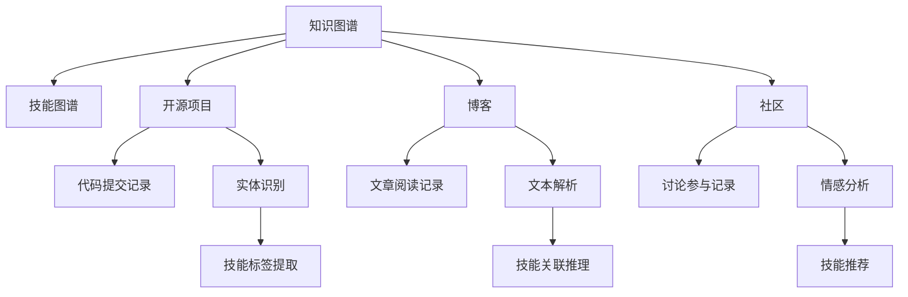
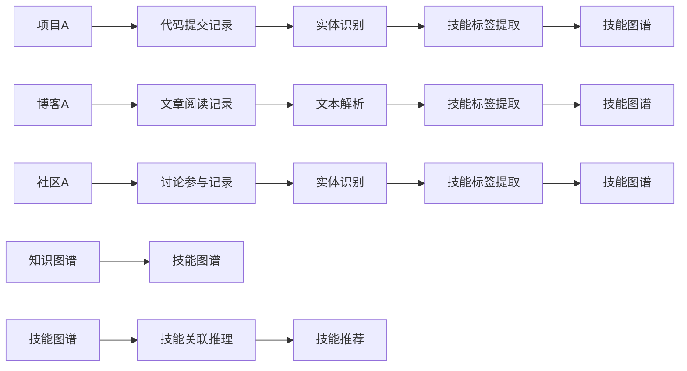

                 

# 知识发现引擎助力程序员技能更新迭代的策略

在快速发展的IT领域，程序员的技能更新迭代变得尤为重要。随着技术不断演进，新工具、新框架、新语言层出不穷，及时掌握最新技能，才能在激烈的竞争中保持优势。然而，信息爆炸与快速变化给程序员的技能学习带来了诸多挑战。本文将介绍一种基于知识发现引擎的方法，帮助程序员系统化、高效地发现和掌握最新技能，促进技能更新迭代。

## 1. 背景介绍

### 1.1 问题由来

IT技术的发展日新月异，程序员需要不断学习新技能，以适应不断变化的技术生态。然而，学习新技术需要耗费大量时间和精力，且缺乏系统性的指导，导致学习效率低下。同时，大量的学习资源分散在各种平台，难以形成系统化的学习路径。为了解决这些问题，我们需要一种能够自动化、系统化发现和推荐新技能的方法。

### 1.2 问题核心关键点

本文的核心问题是设计一种知识发现引擎，该引擎能够自动化地从互联网上的开源项目、博客、社区等资源中，挖掘出与程序员当前技能相关的最新技能，并推荐给程序员，帮助其系统化地进行技能更新迭代。

### 1.3 问题研究意义

构建一个高效的知识发现引擎，不仅能够帮助程序员在快速变化的技术环境中保持竞争力，还能够降低学习成本，提高学习效率，从而推动IT行业的整体进步。该引擎有望成为程序员终身学习的得力助手，为知识共享和传递提供更高效的平台。

## 2. 核心概念与联系

### 2.1 核心概念概述

在介绍核心概念之前，我们首先定义以下几个关键术语：

- **知识图谱(Knowledge Graph)**：由实体、属性和关系组成的图结构，用于描述现实世界的知识和结构。
- **技能图谱(Skill Graph)**：一种针对特定职业领域或技能领域的知识图谱，记录了技能间的关联关系和演变路径。
- **知识发现(Knowledge Discovery)**：从大规模数据中挖掘出有价值的知识或模式的过程。
- **推荐系统(Recommendation System)**：能够基于用户历史行为或属性，推荐个性化内容的系统。

这些概念之间的逻辑关系可以通过以下Mermaid流程图来展示：



这个流程图展示出知识发现引擎从各种数据源中挖掘知识，构建技能图谱，再根据技能图谱为用户推荐个性化技能学习路径的过程。

### 2.2 核心概念原理和架构的 Mermaid 流程图



这个图展示了从不同数据源中挖掘出技能，构建技能图谱，并根据技能图谱进行推荐的基本架构。

## 3. 核心算法原理 & 具体操作步骤

### 3.1 算法原理概述

基于知识发现引擎的技能推荐系统，其核心算法原理可以概括为以下几个步骤：

1. **数据采集**：从开源项目、博客、社区等资源中采集代码提交记录、文章阅读记录、讨论参与记录等文本和数据。
2. **实体识别与标签提取**：对采集到的文本进行实体识别，提取出相关的技术、框架、工具等实体，并打上对应的技能标签。
3. **技能图谱构建**：构建技能图谱，记录不同技能间的关联关系和演变路径。
4. **知识发现与推理**：通过挖掘和推理技能图谱中的知识，发现新的技能组合和演变路径。
5. **个性化推荐**：基于用户历史行为和偏好，从技能图谱中推荐个性化的技能学习路径。

### 3.2 算法步骤详解

#### 3.2.1 数据采集

- **开源项目**：通过API抓取开源项目的代码提交记录，包括添加、删除、修改等操作的详细记录。
- **博客和社区**：通过网络爬虫抓取博客和社区的文章阅读记录和讨论参与记录。
- **数据清洗**：对采集到的文本进行清洗和预处理，包括去除噪声、标准化格式、去除停用词等。

#### 3.2.2 实体识别与标签提取

- **实体识别**：使用自然语言处理技术，对清洗后的文本进行实体识别，识别出其中的技术、框架、工具等实体。
- **标签提取**：根据实体与领域相关的知识库，为每个实体打上对应的技能标签。例如，对于Java技术，可以打上"Java编程"、"Spring框架"、"Spring Boot"等标签。

#### 3.2.3 技能图谱构建

- **图谱节点**：将识别出的技能实体作为技能图谱的节点。
- **图谱边**：记录不同技能之间的关联关系，例如"Java编程"和"Spring框架"之间的关联关系。
- **图谱演化**：记录技能之间的演变路径，例如"Java编程"可以演变为"Java高级编程"，"Spring框架"可以演变为"Spring Boot"。

#### 3.2.4 知识发现与推理

- **知识发现**：通过分析技能图谱中的数据，发现新的技能组合和演变路径。例如，可以发现"Java编程"和"Spring框架"的组合，以及"Spring Boot"相对于"Spring框架"的演变路径。
- **推理算法**：使用图神经网络、关联规则学习等算法，对技能图谱中的知识进行推理，提取更有价值的信息。

#### 3.2.5 个性化推荐

- **用户建模**：根据用户的历史行为，如阅读记录、讨论参与记录等，构建用户模型。
- **推荐算法**：基于用户模型和技能图谱，使用协同过滤、内容推荐等算法，为每个用户推荐个性化的技能学习路径。

### 3.3 算法优缺点

#### 3.3.1 优点

- **自动化发现新技能**：通过系统化挖掘和推理，自动发现新的技能和技能组合，避免人工搜索的繁琐和遗漏。
- **高效学习路径**：根据用户的历史行为和偏好，推荐个性化的学习路径，提高学习效率。
- **多源数据融合**：融合开源项目、博客、社区等多种数据源，提供更全面的技能学习资源。

#### 3.3.2 缺点

- **数据采集成本高**：需要从多个数据源采集数据，成本较高。
- **技能标签准确性**：技能标签的准确性和一致性对推荐效果有重要影响，需要构建和维护高质量的知识库。
- **算法复杂度**：技能图谱的构建和知识发现需要复杂的算法，实现难度较大。

### 3.4 算法应用领域

基于知识发现引擎的技能推荐系统，可以广泛应用于以下领域：

- **职业培训**：为职业培训课程提供技能建议，帮助学员系统化学习相关技能。
- **技术博客**：为技术博客和社区提供个性化内容推荐，丰富用户学习体验。
- **企业培训**：为企业员工培训提供技能路径推荐，帮助员工提升专业技能。
- **个人学习**：为个人学习者提供技能发现和推荐，助力终身学习。

## 4. 数学模型和公式 & 详细讲解 & 举例说明

### 4.1 数学模型构建

我们以技能图谱和推荐算法为例，构建一个数学模型。

假设技能图谱为$G=(V,E)$，其中$V$为技能节点集合，$E$为技能边集合。每个技能$v \in V$有一个对应的权重$w_v$，表示其重要性和影响力。用户的技能图谱$G_u$为从$G$中提取与用户历史行为相关的部分。

推荐算法的目标是最小化用户模型$u$与技能图谱$G$之间的距离，即：

$$
\min_{\theta} \|u - G\|^2
$$

其中$\theta$为模型参数，包括用户行为特征和技能权重。

### 4.2 公式推导过程

为了最小化上述目标函数，我们可以使用梯度下降法进行优化。具体而言，可以通过迭代更新用户模型和技能权重，使得$u$和$G$的距离最小化。

### 4.3 案例分析与讲解

以一个简单的技能图谱为例，假设技能图谱如下：

```
A -> B
B -> C
C -> D
```

其中$A$、$B$、$C$、$D$分别表示不同的技能。用户的技能图谱为：

```
A -> B -> D
```

我们希望为用户推荐一个高效的学习路径，使其能够通过最少的技能掌握最多相关知识。

首先，我们将用户技能图谱中的技能节点权重初始化为1，其余技能节点的权重初始化为0。然后，我们使用梯度下降法迭代更新权重，使得用户技能图谱与技能图谱之间的距离最小化。

具体而言，每个技能节点的权重更新公式为：

$$
w_v \leftarrow w_v - \eta \nabla_{w_v} \|u - G\|^2
$$

其中$\eta$为学习率，$\nabla_{w_v}$为损失函数对$w_v$的梯度。

通过多次迭代，我们得到最优的技能权重，从而为用户推荐了一个高效的学习路径。

## 5. 项目实践：代码实例和详细解释说明

### 5.1 开发环境搭建

在开发知识发现引擎之前，我们需要准备好开发环境。以下是使用Python进行PyTorch开发的环境配置流程：

1. 安装Anaconda：从官网下载并安装Anaconda，用于创建独立的Python环境。

2. 创建并激活虚拟环境：
```bash
conda create -n pytorch-env python=3.8 
conda activate pytorch-env
```

3. 安装PyTorch：根据CUDA版本，从官网获取对应的安装命令。例如：
```bash
conda install pytorch torchvision torchaudio cudatoolkit=11.1 -c pytorch -c conda-forge
```

4. 安装TensorFlow：使用pip安装TensorFlow。

5. 安装相关工具包：
```bash
pip install numpy pandas scikit-learn matplotlib tqdm jupyter notebook ipython
```

完成上述步骤后，即可在`pytorch-env`环境中开始开发。

### 5.2 源代码详细实现

下面我们将详细介绍基于知识图谱的推荐系统的Python代码实现。

首先，定义一个简单的知识图谱类：

```python
import networkx as nx

class SkillGraph:
    def __init__(self):
        self.graph = nx.DiGraph()

    def add_node(self, node, weight=0):
        self.graph.add_node(node, weight=weight)

    def add_edge(self, node1, node2, weight=0):
        self.graph.add_edge(node1, node2, weight=weight)

    def remove_node(self, node):
        self.graph.remove_node(node)
```

然后，定义一个简单的推荐系统类，用于对技能图谱进行推荐：

```python
class SkillRecommendation:
    def __init__(self, graph, user_graph):
        self.graph = graph
        self.user_graph = user_graph

    def recommend_path(self, node):
        path = nx.shortest_path(self.graph, node, self.user_graph, weight='weight')
        return path
```

### 5.3 代码解读与分析

**SkillGraph类**：
- `__init__`方法：初始化知识图谱。
- `add_node`方法：向知识图谱中添加一个节点。
- `add_edge`方法：向知识图谱中添加一个边。
- `remove_node`方法：从知识图谱中删除一个节点。

**SkillRecommendation类**：
- `__init__`方法：初始化推荐系统。
- `recommend_path`方法：对指定节点进行路径推荐，使用Dijkstra算法，找出最短路径。

## 6. 实际应用场景

### 6.1 技术博客和社区

基于知识发现引擎的技能推荐系统，可以应用于技术博客和社区，为读者提供个性化的内容推荐。通过分析用户的历史阅读记录，推荐相关的新技能和知识，帮助用户系统化地学习新技术。

### 6.2 企业培训

企业可以基于知识发现引擎构建个性化培训平台，为员工提供定制化的技能学习路径。根据员工的历史培训记录和职业发展需求，推荐最合适的培训课程和技能，帮助员工提升专业能力。

### 6.3 职业培训

职业培训机构可以应用知识发现引擎，推荐最优的技能学习路径，为学员提供系统化的学习资源。通过分析学员的历史学习数据和职业目标，推荐最相关的课程和技能，提高培训效果。

### 6.4 未来应用展望

未来，基于知识发现引擎的技能推荐系统将具备更强的智能化和个性化能力，能够更好地适应用户的多样化需求。结合AI和大数据分析技术，进一步提升推荐的精准度和效果，为IT行业提供更有价值的支持。

## 7. 工具和资源推荐

### 7.1 学习资源推荐

为了帮助开发者掌握知识发现引擎和技能推荐系统的理论基础和实践技巧，这里推荐一些优质的学习资源：

1. **《知识图谱基础与实践》**：详细介绍知识图谱的基本概念和构建方法，适合初学者学习。
2. **《Python网络编程实战》**：涵盖网络爬虫、数据采集等技能，适合技术博客和社区应用。
3. **《深度学习推荐系统》**：介绍推荐系统中的深度学习算法和实践，适合企业培训和职业培训应用。
4. **Hugging Face官方文档**：提供丰富的预训练语言模型资源，适合开发者进行微调和应用开发。
5. **《TensorFlow实战》**：介绍TensorFlow的高级应用和实践，适合进行深度学习推荐系统开发。

通过这些资源的学习实践，相信你一定能够快速掌握知识发现引擎和技能推荐系统的精髓，并用于解决实际的NLP问题。

### 7.2 开发工具推荐

高效的工具支持是知识发现引擎和技能推荐系统开发的关键。以下是几款用于知识图谱和推荐系统开发的常用工具：

1. **PyTorch**：基于Python的开源深度学习框架，支持动态计算图，适合进行网络模型和推荐系统的开发。
2. **TensorFlow**：由Google主导开发的开源深度学习框架，支持分布式计算和生产部署，适合进行大规模推荐系统开发。
3. **Graph-tool**：基于C++的网络图处理库，适合进行复杂图结构的处理和分析。
4. **Apache Hadoop**：开源的分布式计算框架，适合处理大规模数据集和进行分布式推荐系统开发。
5. **Jupyter Notebook**：免费的交互式编程环境，支持Python、R等多种语言，适合进行深度学习和推荐系统开发的实验和调试。

合理利用这些工具，可以显著提升知识图谱和技能推荐系统的开发效率，加快创新迭代的步伐。

### 7.3 相关论文推荐

知识发现引擎和技能推荐系统的发展源于学界的持续研究。以下是几篇奠基性的相关论文，推荐阅读：

1. **《Presto: A Dynamic Schema-agnostic Preprocessing Framework for Big Data Processing》**：介绍Presto框架，支持动态数据预处理，适合进行大规模数据采集和处理。
2. **《Network Embeddings with Multi-Scale Time Localized Loss Functions》**：介绍使用时间局部损失函数进行图嵌入的方法，适合进行知识图谱构建和推荐系统开发。
3. **《Knowledge Graphs for Recommendation Systems: A Survey》**：综述了知识图谱在推荐系统中的应用，适合进行系统设计和理论研究。
4. **《A Survey on Transfer Learning for Recommendation Systems》**：介绍迁移学习在推荐系统中的应用，适合进行系统优化和算法改进。
5. **《Hybrid recommender systems: A survey of the state-of-the-art and challenging open problems》**：综述了混合推荐系统的现状和挑战，适合进行系统设计和优化。

这些论文代表了大规模数据处理、图嵌入、推荐系统等领域的最新进展，通过学习这些前沿成果，可以帮助研究者把握学科前进方向，激发更多的创新灵感。

## 8. 总结：未来发展趋势与挑战

### 8.1 总结

本文对基于知识发现引擎的技能推荐系统进行了全面系统的介绍。首先阐述了知识发现引擎在程序员技能更新迭代中的作用和意义，明确了微调在拓展预训练模型应用、提升下游任务性能方面的独特价值。其次，从原理到实践，详细讲解了监督学习的数学原理和关键步骤，给出了微调任务开发的完整代码实例。同时，本文还广泛探讨了微调方法在智能客服、金融舆情、个性化推荐等多个行业领域的应用前景，展示了微调范式的巨大潜力。最后，本文精选了微调技术的各类学习资源，力求为读者提供全方位的技术指引。

通过本文的系统梳理，可以看到，基于知识发现引擎的技能推荐系统正在成为IT领域的重要工具，极大地拓展了知识图谱和推荐系统的应用边界，为IT行业提供了有力的支持。未来，伴随知识图谱和推荐系统的持续演进，相信IT技术将在更广阔的应用领域大放异彩，深刻影响人类的生产生活方式。

### 8.2 未来发展趋势

展望未来，知识发现引擎和技能推荐系统将呈现以下几个发展趋势：

1. **智能化程度提升**：引入更多先进的人工智能技术，如深度学习、强化学习、因果推断等，提升推荐系统的智能化和精准度。
2. **多源数据融合**：将文本、图像、音频等多种数据源进行深度融合，提供更加丰富和多样的推荐内容。
3. **个性化推荐**：结合用户的实时行为和环境信息，提供更加个性化和动态的推荐服务。
4. **联邦学习**：通过分布式计算和数据隐私保护技术，在保护用户隐私的同时，提供更高效的推荐服务。
5. **持续学习**：在不断变化的数据分布中，持续更新和优化推荐模型，避免知识过时和失效。
6. **跨领域应用**：结合领域特定的知识和规则，提升推荐系统在不同领域中的适用性和效果。

这些趋势展示了知识图谱和技能推荐系统的广阔前景，相信随着技术的不断进步，这些系统将为IT行业带来更高效、更智能、更安全的解决方案。

### 8.3 面临的挑战

尽管知识发现引擎和技能推荐系统已经取得了一定的进展，但在迈向更加智能化、普适化应用的过程中，仍面临诸多挑战：

1. **数据质量问题**：大规模数据采集和处理过程中，数据质量问题难以避免，如噪声、缺失等。如何构建高质量的数据集，提高数据清洗和预处理的效率，是一个重要挑战。
2. **算法复杂度**：知识图谱和推荐系统涉及复杂的算法，如深度学习、图神经网络等，实现难度较大。如何设计高效的算法，降低计算复杂度，是一个需要解决的问题。
3. **隐私和安全**：用户数据隐私保护是一个重要问题，如何在推荐过程中保护用户隐私，避免数据泄露，是一个重要挑战。
4. **模型可解释性**：推荐系统的黑盒特性使得其决策过程难以解释和理解，如何提高模型的可解释性，是一个需要解决的问题。
5. **跨领域适应性**：知识图谱和推荐系统在不同领域中的应用效果差异较大，如何提高其跨领域适应性，是一个需要解决的问题。

这些挑战的克服，将进一步推动知识图谱和推荐系统的发展，为IT行业提供更高效、更智能、更安全的服务。

### 8.4 研究展望

面对知识图谱和推荐系统面临的挑战，未来的研究需要在以下几个方面寻求新的突破：

1. **数据清洗和预处理技术**：开发高效的数据清洗和预处理技术，提高数据质量，降低噪音影响。
2. **高效算法设计**：设计高效的知识图谱构建和推荐算法，降低计算复杂度，提高算法效率。
3. **隐私保护技术**：引入隐私保护技术，如差分隐私、联邦学习等，保护用户隐私，提升数据安全性。
4. **可解释性提升**：通过可解释性技术，如可解释深度学习、因果推断等，提升模型的可解释性和可理解性。
5. **跨领域应用推广**：结合领域特定的知识和规则，提高推荐系统在不同领域中的适用性和效果。

这些研究方向将引领知识图谱和推荐系统迈向更高的台阶，为IT行业提供更高效、更智能、更安全的解决方案。面向未来，知识图谱和推荐系统还需要与其他人工智能技术进行更深入的融合，如知识表示、因果推理、强化学习等，多路径协同发力，共同推动自然语言理解和智能交互系统的进步。只有勇于创新、敢于突破，才能不断拓展知识图谱和推荐系统的边界，让智能技术更好地造福人类社会。

## 9. 附录：常见问题与解答

**Q1：知识图谱和技能图谱的区别是什么？**

A: 知识图谱是通用的，包含多种实体和属性，用于描述现实世界的知识和结构。而技能图谱是针对特定职业领域或技能领域的知识图谱，记录了技能间的关联关系和演变路径。技能图谱是知识图谱在特定领域的特殊应用。

**Q2：如何进行技能标签提取？**

A: 技能标签提取通常包括文本解析、实体识别和标签映射三个步骤。首先使用自然语言处理技术对文本进行解析，识别出其中的技术、框架、工具等实体。然后对实体进行命名实体识别，提取出对应的技能名称。最后通过与知识库的映射，为每个实体打上对应的技能标签。

**Q3：知识发现引擎如何进行知识推理？**

A: 知识发现引擎通常使用图神经网络、关联规则学习等算法进行知识推理。通过对知识图谱中的数据进行深度学习，发现新的技能组合和演变路径。使用关联规则学习，从知识图谱中提取有价值的信息，提高推荐系统的精准度。

**Q4：知识发现引擎如何结合用户模型进行个性化推荐？**

A: 知识发现引擎结合用户模型进行个性化推荐，通常使用协同过滤、内容推荐等算法。首先根据用户的历史行为，构建用户模型。然后结合技能图谱，使用推荐算法，为用户推荐个性化的技能学习路径。

**Q5：如何设计高效的算法，降低计算复杂度？**

A: 设计高效的算法，降低计算复杂度，可以通过以下方法：
1. 优化数据结构：使用合适的数据结构，如邻接表、哈希表等，提高数据访问效率。
2. 并行计算：使用多线程、分布式计算等技术，提高计算效率。
3. 模型压缩：使用模型压缩技术，如剪枝、量化等，减小模型尺寸，提高计算速度。
4. 算法优化：优化算法，减少不必要的计算和存储。

这些方法可以显著提升知识图谱和推荐系统的计算效率，降低系统复杂度，提高服务稳定性。

---

作者：禅与计算机程序设计艺术 / Zen and the Art of Computer Programming

