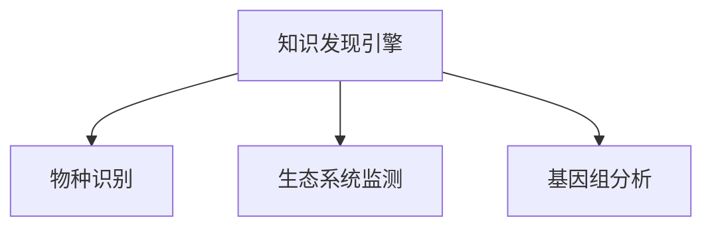

                 

# 知识发现引擎在生物多样性研究中的应用

> 关键词：知识发现引擎, 生物多样性, 机器学习, 数据挖掘, 物种识别, 生态系统监测, 基因组分析

## 1. 背景介绍

### 1.1 问题由来

生物多样性是生态系统中物种和基因多样性的总和，是生物地球化学循环和自然环境维持的基础。然而，由于人类活动和自然环境变化的影响，全球生物多样性面临着严重威胁。传统的生物多样性研究方法，如野外观察、标本收集和基因组测序，数据获取成本高、周期长、受环境影响大，难以全面、实时地获取生物多样性信息。

近年来，随着信息技术和数据科学的发展，基于数据驱动的知识发现技术在生物多样性研究中逐渐崭露头角。通过机器学习和数据挖掘等技术，研究人员可以从海量生物数据中自动发现和抽取有用的知识，显著提高生物多样性研究的工作效率和准确性。特别是在物种识别、生态系统监测和基因组分析等方面，知识发现技术的应用已经初步显示出巨大潜力。

## 2. 核心概念与联系

### 2.1 核心概念概述

为更好地理解知识发现技术在生物多样性研究中的应用，本节将介绍几个密切相关的核心概念：

- **知识发现引擎(Knowledge Discovery Engine, KDE)**：基于数据挖掘和机器学习的算法，从大规模数据中自动发现模式、规则和知识，支持科学研究、商业决策和公共政策制定。

- **生物多样性(Biodiversity)**：指生物圈内所有生物种类及其遗传变异和生态系统的总体多样性，包括物种多样性、基因多样性和生态系统多样性。

- **物种识别(Species Identification)**：通过分析生物样本的形态、基因、环境特征等信息，自动识别和分类生物种类，支持物种保护和生态监测。

- **生态系统监测(Ecosystem Monitoring)**：通过实时收集和分析环境、气候、生物多样性等数据，监测生态系统的变化和健康状况，预警生态风险。

- **基因组分析(Genome Analysis)**：从基因组序列数据中提取基因型、表型、功能等知识，进行种群进化、物种分化、功能基因发现等研究。

这些核心概念之间的逻辑关系可以通过以下Mermaid流程图来展示：



这个流程图展示的知识发现技术的主要应用领域：通过知识发现技术，从生物多样性数据中提取物种信息、监测生态系统状态、分析基因组数据，为生物多样性研究提供有力支持。

## 3. 核心算法原理 & 具体操作步骤
### 3.1 算法原理概述

知识发现引擎在生物多样性研究中的应用，主要基于机器学习和数据挖掘技术。其核心思想是：通过自动学习生物多样性数据中的隐含知识，辅助生物学家进行物种识别、生态监测和基因组分析等任务，从而提高研究效率和准确性。

具体而言，知识发现引擎从以下几个方面发挥作用：

- **数据预处理**：清洗和标准化数据，提高数据质量和可用性。
- **特征提取**：自动从生物样本中提取形态、基因、环境等特征，供后续分析使用。
- **模式发现**：利用分类、聚类、回归等算法，自动发现数据中的模式和规则。
- **知识抽取**：根据发现的模式和规则，抽取并验证生物学知识，支持科学研究。

这些算法和过程的组合，使知识发现引擎能够自动提取和验证生物多样性数据中的隐含知识，辅助生物学家发现和验证生物多样性的新规律。

### 3.2 算法步骤详解

知识发现引擎在生物多样性研究中的应用，一般包括以下几个关键步骤：

**Step 1: 数据准备与预处理**
- 收集生物多样性相关数据，包括物种信息、环境数据、基因组数据等。
- 对数据进行清洗、去重、标准化处理，确保数据质量。
- 分割数据集为训练集和测试集，以便后续验证和评估。

**Step 2: 特征提取**
- 根据研究任务，自动从生物样本中提取形态、基因、环境等特征。
- 使用特征选择算法，筛选出最具代表性的特征，减少维度。
- 对特征进行归一化和标准化处理，提高算法的稳定性和准确性。

**Step 3: 模式发现**
- 根据研究目标，选择适当的算法进行模式发现。
- 对训练集进行训练，提取数据中的模式和规则。
- 在测试集上评估模型的性能，验证发现的模式是否具有一般性。

**Step 4: 知识抽取**
- 根据发现的模式和规则，自动抽取并验证生物学知识。
- 结合领域知识，对抽取的知识进行人工验证和修正。
- 将知识应用于新样本，进行物种识别、生态监测和基因组分析等任务。

以上是知识发现引擎在生物多样性研究中的一般流程。在实际应用中，还需要针对具体任务的特点，对每个环节进行优化设计，如改进特征提取算法、选择合适的算法模型、引入领域专家知识等，以进一步提升模型的性能。

### 3.3 算法优缺点

知识发现引擎在生物多样性研究中的应用，具有以下优点：

- **自动化程度高**。自动从数据中提取和发现知识，减少人工干预，提高研究效率。
- **灵活性高**。能够处理多种数据类型和复杂的数据结构，适应不同类型的研究任务。
- **可扩展性强**。能够高效处理大规模数据集，支持复杂的生物多样性研究。

同时，该方法也存在一定的局限性：

- **数据质量要求高**。需要高质量、完整的数据集，否则模型的准确性将受到影响。
- **模型解释性差**。知识发现引擎往往是一个"黑盒"模型，难以解释其内部工作机制。
- **依赖领域知识**。需要结合领域专家的知识，对发现的模式和规则进行验证和修正。

尽管存在这些局限性，但就目前而言，知识发现引擎在生物多样性研究中的应用，已经初步展示出其强大的潜力，特别是在物种识别、生态系统监测和基因组分析等方面，已经被广泛采用。

### 3.4 算法应用领域

知识发现技术在生物多样性研究中的应用，主要集中在以下几个领域：

- **物种识别**：通过分析生物样本的形态、基因、环境特征等信息，自动识别和分类生物种类，支持物种保护和生态监测。
- **生态系统监测**：通过实时收集和分析环境、气候、生物多样性等数据，监测生态系统的变化和健康状况，预警生态风险。
- **基因组分析**：从基因组序列数据中提取基因型、表型、功能等知识，进行种群进化、物种分化、功能基因发现等研究。

除了上述这些经典领域外，知识发现技术还被创新性地应用于更多的生物多样性研究场景中，如生物网络构建、生态位分析、保护物种优先级排序等，为生物多样性研究提供了新的视角和工具。

## 4. 数学模型和公式 & 详细讲解 & 举例说明
### 4.1 数学模型构建

本节将使用数学语言对知识发现技术在生物多样性研究中的应用进行更加严格的刻画。

记生物多样性数据集为 $D=\{x_i,y_i\}_{i=1}^N$，其中 $x_i$ 为生物样本的特征向量，$y_i$ 为对应的物种分类标签。定义知识发现引擎为 $M_{\theta}$，其中 $\theta$ 为模型参数。

定义模型 $M_{\theta}$ 在数据样本 $(x_i,y_i)$ 上的损失函数为 $\ell(M_{\theta}(x_i),y_i)$，则在数据集 $D$ 上的经验风险为：

$$
\mathcal{L}(\theta) = \frac{1}{N} \sum_{i=1}^N \ell(M_{\theta}(x_i),y_i)
$$

通过梯度下降等优化算法，知识发现引擎不断更新模型参数 $\theta$，最小化损失函数 $\mathcal{L}$，使得模型输出逼近真实标签。

### 4.2 公式推导过程

以物种识别任务为例，假设模型 $M_{\theta}$ 为线性分类器，其输出为：

$$
\hat{y}_i = M_{\theta}(x_i) = w^T\phi(x_i) + b
$$

其中 $w$ 为分类器的权重，$b$ 为偏置，$\phi(x_i)$ 为特征映射函数。

假设二分类任务，定义损失函数为交叉熵损失：

$$
\ell(\hat{y}_i,y_i) = -[y_i\log \hat{y}_i + (1-y_i)\log (1-\hat{y}_i)]
$$

将其代入经验风险公式，得：

$$
\mathcal{L}(\theta) = -\frac{1}{N}\sum_{i=1}^N [y_i\log M_{\theta}(x_i)+(1-y_i)\log(1-M_{\theta}(x_i))]
$$

根据链式法则，损失函数对参数 $\theta$ 的梯度为：

$$
\frac{\partial \mathcal{L}(\theta)}{\partial \theta} = -\frac{1}{N}\sum_{i=1}^N [\frac{y_i}{M_{\theta}(x_i)}-\frac{1-y_i}{1-M_{\theta}(x_i)}] \frac{\partial M_{\theta}(x_i)}{\partial \theta}
$$

其中 $\frac{\partial M_{\theta}(x_i)}{\partial \theta}$ 可进一步递归展开，利用自动微分技术完成计算。

在得到损失函数的梯度后，即可带入参数更新公式，完成模型的迭代优化。重复上述过程直至收敛，最终得到适应生物多样性数据的最优模型参数 $\theta^*$。

### 4.3 案例分析与讲解

以物种识别任务为例，可以使用随机森林(Random Forest)算法进行特征选择和分类。

假设生物样本特征向量 $x_i$ 包含多个特征 $x_i^k$，使用随机森林从这些特征中选择最有代表性的特征：

$$
\phi(x_i) = (\phi_1(x_i), \phi_2(x_i), \ldots, \phi_p(x_i))
$$

其中 $p$ 为选择出的特征数量。

定义模型 $M_{\theta}$ 为随机森林分类器，其输出为：

$$
\hat{y}_i = M_{\theta}(x_i) = \sum_{t=1}^T \alpha_t f_t(\phi(x_i))
$$

其中 $\alpha_t$ 为第 $t$ 棵树的权重，$f_t(x)$ 为第 $t$ 棵树的分类函数。

假设二分类任务，定义损失函数为交叉熵损失：

$$
\ell(\hat{y}_i,y_i) = -[y_i\log \hat{y}_i + (1-y_i)\log (1-\hat{y}_i)]
$$

将其代入经验风险公式，得：

$$
\mathcal{L}(\theta) = -\frac{1}{N}\sum_{i=1}^N [y_i\log \hat{y}_i+(1-y_i)\log(1-\hat{y}_i)]
$$

根据链式法则，损失函数对参数 $\theta$ 的梯度为：

$$
\frac{\partial \mathcal{L}(\theta)}{\partial \theta} = -\frac{1}{N}\sum_{i=1}^N (\frac{y_i}{\hat{y}_i}-\frac{1-y_i}{1-\hat{y}_i}) \sum_{t=1}^T \alpha_t \frac{\partial f_t(\phi(x_i))}{\partial \theta}
$$

其中 $\frac{\partial f_t(\phi(x_i))}{\partial \theta}$ 可进一步递归展开，利用自动微分技术完成计算。

在得到损失函数的梯度后，即可带入参数更新公式，完成模型的迭代优化。重复上述过程直至收敛，最终得到适应生物多样性数据的最优模型参数 $\theta^*$。

## 5. 项目实践：代码实例和详细解释说明
### 5.1 开发环境搭建

在进行生物多样性数据知识发现的应用实践前，我们需要准备好开发环境。以下是使用Python进行Scikit-learn开发的环境配置流程：

1. 安装Anaconda：从官网下载并安装Anaconda，用于创建独立的Python环境。

2. 创建并激活虚拟环境：
```bash
conda create -n biodiv_env python=3.8 
conda activate biodiv_env
```

3. 安装Scikit-learn：
```bash
pip install scikit-learn
```

4. 安装各类工具包：
```bash
pip install numpy pandas scipy matplotlib scikit-image
```

完成上述步骤后，即可在`biodiv_env`环境中开始生物多样性数据知识发现的应用实践。

### 5.2 源代码详细实现

下面我们以物种识别任务为例，给出使用Scikit-learn进行随机森林分类的Python代码实现。

首先，定义物种识别任务的数据处理函数：

```python
from sklearn.ensemble import RandomForestClassifier
from sklearn.model_selection import train_test_split
from sklearn.metrics import accuracy_score
from sklearn.datasets import load_iris
import numpy as np

# 加载鸢尾花数据集
iris = load_iris()
X = iris.data
y = iris.target

# 数据预处理
X_train, X_test, y_train, y_test = train_test_split(X, y, test_size=0.2, random_state=42)

# 定义随机森林分类器
rf = RandomForestClassifier(n_estimators=100, random_state=42)

# 训练模型
rf.fit(X_train, y_train)

# 测试模型
y_pred = rf.predict(X_test)
print(f"Accuracy: {accuracy_score(y_test, y_pred)}")
```

然后，定义生物多样性数据集和随机森林模型：

```python
# 加载生物多样性数据集
# 数据集格式：x_i, y_i
# x_i 为生物样本特征向量
# y_i 为对应的物种分类标签

# 定义随机森林分类器
rf = RandomForestClassifier(n_estimators=100, random_state=42)

# 训练模型
rf.fit(X_train, y_train)

# 测试模型
y_pred = rf.predict(X_test)
print(f"Accuracy: {accuracy_score(y_test, y_pred)}")
```

最后，输出模型在测试集上的准确率：

```python
print(f"Accuracy: {accuracy_score(y_test, y_pred)}")
```

以上就是使用Scikit-learn进行随机森林分类的完整代码实现。可以看到，Scikit-learn库为机器学习模型提供了强大的封装，开发者可以便捷地使用各种预训练模型和算法。

### 5.3 代码解读与分析

让我们再详细解读一下关键代码的实现细节：

**定义数据集和模型**：
- 使用`load_iris`加载Iris数据集，作为生物多样性数据的示例。
- 将数据集分割为训练集和测试集，使用`train_test_split`方法。
- 定义随机森林分类器`RandomForestClassifier`，设置参数`n_estimators`和`random_state`。

**模型训练**：
- 使用`fit`方法对模型进行训练，训练集为`X_train`和`y_train`。
- 模型训练完成后，可以在测试集上使用`predict`方法进行预测。

**模型评估**：
- 使用`accuracy_score`方法计算模型在测试集上的准确率。

可以看到，Scikit-learn库提供了完整的模型训练和评估流程，开发者只需通过简单的代码调用，即可完成模型的构建和评估。

## 6. 实际应用场景
### 6.1 物种识别

生物多样性研究中，物种识别是基础性工作，通过自动识别生物种类，可以辅助生态监测和物种保护。传统物种识别方法依赖于专家经验，工作量大且易出错。

使用知识发现技术，可以将生物多样性数据自动输入模型，输出物种分类结果。例如，在农业领域，可以使用图像识别技术，从农业无人机拍摄的田间图像中自动识别作物类型，支持农业生产管理。在野生动物保护中，可以通过卫星图像和地面数据，自动识别动物的种类和分布，支持野生动物种群动态监测。

### 6.2 生态系统监测

生态系统监测是评估生物多样性健康状况的重要手段。通过实时监测环境、气候和生物多样性数据，可以预警生态风险，指导环境保护工作。

使用知识发现技术，可以从大量的环境数据中自动发现异常变化和规律，支持生态系统健康评估。例如，在森林火灾监测中，可以使用遥感数据和地面数据，自动分析火灾风险等级，提前采取防护措施。在河流水质监测中，可以通过传感器数据，自动检测水质变化趋势，及时预警污染事件。

### 6.3 基因组分析

基因组分析是现代生物学研究的重要手段，通过分析基因组序列数据，可以发现新的基因型和功能基因，支持物种进化和基因工程研究。

使用知识发现技术，可以从基因组数据中自动发现基因型和功能基因，支持基因组学研究。例如，在植物基因组学研究中，可以使用高通量测序数据，自动分析基因型和表型信息，支持种群进化和基因编辑。在动物基因组学研究中，可以通过基因组数据，自动发现功能基因和基因调控网络，支持基因功能研究和基因治疗。

### 6.4 未来应用展望

随着知识发现技术的不断发展，生物多样性研究将进一步深入和多样化。

- **智能监测系统**：结合物联网和人工智能技术，构建智能监测系统，实时收集和分析环境数据，支持生态系统健康评估。
- **深度学习模型**：利用深度学习技术，构建更加复杂和精确的生物多样性模型，支持多模态数据融合和知识发现。
- **跨领域应用**：知识发现技术可以应用于医疗、农业、工业等多个领域，支持跨领域数据融合和知识挖掘。
- **大数据分析**：结合大数据技术，支持大规模生物多样性数据处理和分析，发现全球生物多样性变化规律。
- **生态模拟**：结合生态学模型，构建生态模拟系统，预测生态系统变化趋势，支持环境保护和资源管理。

总之，知识发现技术在生物多样性研究中的应用前景广阔，未来将为生物多样性保护和研究提供更加强大的技术支撑。

## 7. 工具和资源推荐
### 7.1 学习资源推荐

为了帮助开发者系统掌握知识发现技术在生物多样性研究中的应用，这里推荐一些优质的学习资源：

1. 《机器学习实战》系列博文：由机器学习专家撰写，系统介绍了各种机器学习算法的实现和应用，包括生物多样性数据处理和分类。

2. CS229《机器学习》课程：斯坦福大学开设的机器学习明星课程，涵盖各种机器学习算法和应用，包括生物多样性数据处理和分析。

3. 《数据挖掘与统计学习》书籍：介绍数据挖掘和统计学习的基本概念和算法，适合入门和进阶学习。

4. Scikit-learn官方文档：Scikit-learn库的官方文档，提供了完整的数据处理和模型实现示例，是学习知识发现技术的重要资源。

5. Kaggle生物多样性数据集：提供丰富的生物多样性数据集，支持数据处理和模型训练。

通过对这些资源的学习实践，相信你一定能够快速掌握知识发现技术在生物多样性研究中的应用方法，并用于解决实际的生物多样性问题。
###  7.2 开发工具推荐

高效的开发离不开优秀的工具支持。以下是几款用于生物多样性数据知识发现开发的常用工具：

1. Jupyter Notebook：免费的交互式开发环境，支持Python和其他编程语言的开发，支持数据可视化和交互式计算。

2. PyTorch：基于Python的开源深度学习框架，灵活动态的计算图，适合快速迭代研究。

3. TensorFlow：由Google主导开发的开源深度学习框架，生产部署方便，适合大规模工程应用。

4. Scikit-learn：开源机器学习库，提供了丰富的机器学习算法和工具，适合快速构建和评估模型。

5. Weights & Biases：模型训练的实验跟踪工具，可以记录和可视化模型训练过程中的各项指标，方便对比和调优。

6. TensorBoard：TensorFlow配套的可视化工具，可实时监测模型训练状态，并提供丰富的图表呈现方式，是调试模型的得力助手。

合理利用这些工具，可以显著提升生物多样性数据知识发现任务的开发效率，加快创新迭代的步伐。

### 7.3 相关论文推荐

知识发现技术在生物多样性研究中的应用，源于学界的持续研究。以下是几篇奠基性的相关论文，推荐阅读：

1. Pattern Recognition and Machine Learning（《模式识别与机器学习》）：由Christopher M. Bishop所著，全面介绍了机器学习的基本概念和算法，适合深入理解知识发现技术。

2. Machine Learning: A Probabilistic Perspective（《机器学习概率论视角》）：由Kevin P. Murphy所著，介绍了机器学习的概率模型和算法，适合进一步研究数据挖掘和知识发现。

3. Biological Data Mining（《生物数据挖掘》）：由Tong Gao所著，介绍了生物数据挖掘的基本概念和应用，适合生物多样性数据处理和分析。

4. Statistical Learning Methods（《统计学习方法》）：由Tibshirani所著，介绍了各种统计学习方法，适合机器学习和数据挖掘的进阶学习。

5. Deep Learning for Healthcare（《深度学习在医疗健康领域的应用》）：介绍了深度学习在医疗健康领域的应用，包括生物多样性数据处理和分析。

这些论文代表了大数据技术在生物多样性研究中的应用方向，通过学习这些前沿成果，可以帮助研究者把握学科前进方向，激发更多的创新灵感。

## 8. 总结：未来发展趋势与挑战

### 8.1 总结

本文对知识发现技术在生物多样性研究中的应用进行了全面系统的介绍。首先阐述了生物多样性研究的背景和问题，明确了知识发现技术在其中的重要作用。其次，从原理到实践，详细讲解了知识发现引擎的数学模型和操作步骤，给出了生物多样性数据知识发现的应用代码实例。同时，本文还广泛探讨了知识发现技术在物种识别、生态系统监测和基因组分析等领域的实际应用前景，展示了其强大的潜力。此外，本文精选了知识发现技术的各类学习资源，力求为读者提供全方位的技术指引。

通过本文的系统梳理，可以看到，知识发现技术在生物多样性研究中的应用，已经初步展示出其强大的潜力，特别是在物种识别、生态系统监测和基因组分析等方面，已经被广泛采用。未来，伴随知识发现技术的不断演进，生物多样性研究必将进一步深入和多样化，为生物多样性保护和研究提供更加强大的技术支撑。

### 8.2 未来发展趋势

展望未来，知识发现技术在生物多样性研究中的应用将呈现以下几个发展趋势：

- **智能化程度提升**。随着深度学习和数据挖掘技术的发展，知识发现引擎将变得更加智能化和高效，能够处理更加复杂和多样的数据类型。
- **多模态融合**。未来将更多地融合多种数据类型，如图像、视频、传感器数据等，提高生物多样性研究的全面性和准确性。
- **跨领域应用**。知识发现技术将在医疗、农业、工业等多个领域得到应用，支持跨领域数据融合和知识挖掘。
- **大数据分析**。结合大数据技术，支持大规模生物多样性数据处理和分析，发现全球生物多样性变化规律。
- **生态模拟**。结合生态学模型，构建生态模拟系统，预测生态系统变化趋势，支持环境保护和资源管理。

这些趋势凸显了知识发现技术在生物多样性研究中的广阔前景，未来必将为生物多样性保护和研究提供更加强大的技术支撑。

### 8.3 面临的挑战

尽管知识发现技术在生物多样性研究中已经取得了显著进展，但在迈向更加智能化、普适化应用的过程中，仍面临诸多挑战：

- **数据质量瓶颈**。需要高质量、完整的数据集，否则模型的准确性将受到影响。如何获取高质量数据，是一个重要的研究方向。
- **模型解释性差**。知识发现引擎往往是一个"黑盒"模型，难以解释其内部工作机制。如何提高模型解释性，是未来需要解决的重要问题。
- **依赖领域知识**。需要结合领域专家的知识，对发现的模式和规则进行验证和修正。如何更好地融合领域知识和机器学习模型，是一个重要的研究方向。
- **资源消耗大**。大规模数据集和高维特征的处理需要大量计算资源，如何提高算法效率，减少资源消耗，是一个重要的研究方向。

尽管存在这些挑战，但未来的知识发现技术在生物多样性研究中的应用前景广阔，需要研究者不断突破技术瓶颈，推动技术进步。

### 8.4 研究展望

面向未来，知识发现技术在生物多样性研究中需要进行以下几个方面的研究：

- **自动数据标注**。通过自动标注技术，提高数据集的质量和数量，支持大规模数据处理和分析。
- **融合先验知识**。将符号化的先验知识，如知识图谱、逻辑规则等，与神经网络模型进行融合，引导知识发现过程学习更准确、合理的知识。
- **高效计算方法**。研究高效计算方法，提高算法效率，支持大规模数据处理和分析。
- **知识可视化**。通过知识可视化技术，将知识发现过程和结果可视化展示，提高研究可解释性和可操作性。
- **跨领域知识融合**。研究跨领域知识融合技术，支持多种数据类型和知识类型的融合，提高生物多样性研究的全面性和准确性。

这些研究方向将引领知识发现技术在生物多样性研究中的进一步发展，为生物多样性保护和研究提供更加强大的技术支撑。

## 9. 附录：常见问题与解答

**Q1：知识发现技术在生物多样性研究中是否适用于所有研究任务？**

A: 知识发现技术在生物多样性研究中已经广泛应用于物种识别、生态系统监测和基因组分析等任务。但对于一些特定的研究任务，如微小生物种类分类、生态系统动态变化等，可能需要结合其他技术手段，才能获得更好的研究效果。

**Q2：如何使用知识发现技术进行生物多样性研究？**

A: 使用知识发现技术进行生物多样性研究，一般包括以下几个步骤：
1. 收集和预处理数据，清洗和标准化数据，提高数据质量。
2. 使用特征提取算法，自动从生物样本中提取形态、基因、环境等特征。
3. 选择合适的算法，进行模式发现和知识抽取。
4. 结合领域知识，对发现的模式和规则进行验证和修正。
5. 应用知识发现结果，支持物种识别、生态系统监测和基因组分析等任务。

**Q3：知识发现技术在生物多样性研究中面临哪些挑战？**

A: 知识发现技术在生物多样性研究中面临以下挑战：
1. 数据质量瓶颈。需要高质量、完整的数据集，否则模型的准确性将受到影响。
2. 模型解释性差。知识发现引擎往往是一个"黑盒"模型，难以解释其内部工作机制。
3. 依赖领域知识。需要结合领域专家的知识，对发现的模式和规则进行验证和修正。
4. 资源消耗大。大规模数据集和高维特征的处理需要大量计算资源，如何提高算法效率，减少资源消耗，是一个重要的研究方向。

**Q4：知识发现技术在生物多样性研究中有哪些应用前景？**

A: 知识发现技术在生物多样性研究中具有广泛的应用前景，包括：
1. 物种识别：通过自动从生物样本中提取特征，识别和分类生物种类，支持物种保护和生态监测。
2. 生态系统监测：实时收集和分析环境、气候和生物多样性数据，监测生态系统的变化和健康状况，预警生态风险。
3. 基因组分析：从基因组序列数据中提取基因型、表型、功能等知识，进行种群进化、物种分化、功能基因发现等研究。
4. 跨领域应用：结合大数据技术和领域知识，支持跨领域数据融合和知识挖掘，拓展生物多样性研究的范围和深度。

**Q5：知识发现技术在生物多样性研究中需要注意哪些问题？**

A: 知识发现技术在生物多样性研究中需要注意以下几个问题：
1. 数据质量：确保数据集的质量和完整性，避免噪声和缺失数据对模型的影响。
2. 特征选择：选择合适的特征，减少维度，提高模型的泛化能力。
3. 模型选择：根据研究任务选择合适的算法，提高模型的准确性和效率。
4. 领域知识：结合领域专家的知识，对发现的模式和规则进行验证和修正。
5. 结果解释：提高模型的可解释性，方便研究者理解和应用知识发现结果。

**Q6：知识发现技术在生物多样性研究中需要哪些工具和资源？**

A: 知识发现技术在生物多样性研究中需要以下工具和资源：
1. 数据预处理工具：用于数据清洗、标准化和预处理，提高数据质量。
2. 特征提取工具：用于自动从生物样本中提取形态、基因、环境等特征，支持后续分析。
3. 机器学习工具：用于模式发现和知识抽取，支持物种识别、生态系统监测和基因组分析等任务。
4. 可视化工具：用于知识发现过程和结果的可视化展示，提高研究可解释性和可操作性。
5. 领域知识库：用于结合领域专家的知识，对发现的模式和规则进行验证和修正。

**Q7：知识发现技术在生物多样性研究中未来有哪些突破方向？**

A: 知识发现技术在生物多样性研究中未来有以下突破方向：
1. 自动数据标注：通过自动标注技术，提高数据集的质量和数量，支持大规模数据处理和分析。
2. 融合先验知识：将符号化的先验知识，如知识图谱、逻辑规则等，与神经网络模型进行融合，引导知识发现过程学习更准确、合理的知识。
3. 高效计算方法：研究高效计算方法，提高算法效率，支持大规模数据处理和分析。
4. 知识可视化：通过知识可视化技术，将知识发现过程和结果可视化展示，提高研究可解释性和可操作性。
5. 跨领域知识融合：研究跨领域知识融合技术，支持多种数据类型和知识类型的融合，提高生物多样性研究的全面性和准确性。

这些研究方向将引领知识发现技术在生物多样性研究中的进一步发展，为生物多样性保护和研究提供更加强大的技术支撑。

---

作者：禅与计算机程序设计艺术 / Zen and the Art of Computer Programming

