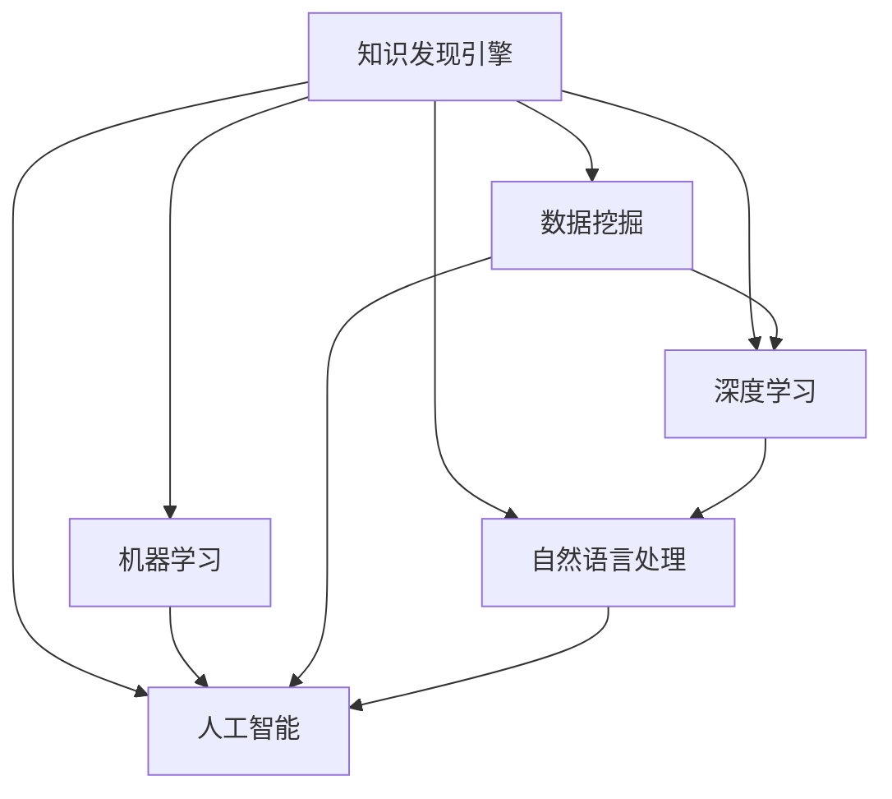

                 

# 知识发现引擎如何改变程序员的学习模式

> 关键词：知识发现引擎, 机器学习, 数据挖掘, 程序员学习模式, 深度学习, 自然语言处理, 人工智能

## 1. 背景介绍

### 1.1 问题由来

在过去几十年里，程序员的学习模式一直被传统的编程语言和框架所主导。他们通过阅读代码库、文档、技术博客等形式，逐步掌握编程技能。然而，这种传统的学习方式存在诸多问题，比如学习效率低、内容更新慢、学习材料缺乏针对性等。

随着大数据和人工智能技术的兴起，知识发现引擎（Knowledge Discovery Engine, KDE）的出现为程序员的学习提供了新的可能性。知识发现引擎是一种能够自动发现、整合、分析、展示和利用知识的软件系统，它能够帮助程序员快速、高效地获取有价值的编程知识。

### 1.2 问题核心关键点

知识发现引擎的核心关键点在于它能够利用机器学习和数据挖掘技术，从海量编程资料中挖掘出有用信息，帮助程序员快速学习编程技能。具体来说，它可以自动：

- 发现编程文档、代码库、技术博客等源文档中的关键信息。
- 分析编程问题的常见解决方案，形成可复用的代码片段。
- 推荐和关联最新技术、工具和框架，提升学习效率。
- 基于用户行为和反馈，个性化推荐学习内容，提升学习体验。

这些功能使得知识发现引擎成为程序员学习模式的一次重大变革。

## 2. 核心概念与联系

### 2.1 核心概念概述

为了更好地理解知识发现引擎如何改变程序员的学习模式，我们先介绍几个核心概念：

- **知识发现引擎（KDE）**：利用机器学习和数据挖掘技术，自动从编程资料中发现和分析关键信息，帮助程序员快速学习编程技能。
- **机器学习（ML）**：通过算法让计算机从数据中学习，发现数据中的规律和模式，以实现预测、分类、聚类等功能。
- **数据挖掘（DM）**：从大量数据中提取有用信息的过程，常用于发现关联规则、分类、聚类等。
- **深度学习（DL）**：一种基于神经网络的机器学习方法，能够自动发现数据的特征和模式，用于图像、语音、自然语言处理等领域。
- **自然语言处理（NLP）**：利用计算机处理和理解人类语言的技术，广泛应用于搜索引擎、智能问答、情感分析等场景。
- **人工智能（AI）**：模拟人类智能行为的技术，包括学习、推理、感知、语言理解、视觉识别等。

这些概念之间的联系通过以下Mermaid流程图展示：



这个流程图展示了知识发现引擎与多个AI分支的紧密联系。通过机器学习和数据挖掘技术，知识发现引擎能够从编程资料中发现有用信息，提升程序员的学习效率。

## 3. 核心算法原理 & 具体操作步骤

### 3.1 算法原理概述

知识发现引擎的核心算法原理主要包括以下几个方面：

- **文档相似度计算**：通过计算编程文档、代码库、技术博客等源文档之间的相似度，帮助程序员快速定位相关资料。
- **文本摘要与关键词提取**：通过自然语言处理技术，自动提取源文档中的关键信息和摘要，帮助程序员快速理解文档内容。
- **代码片段推荐**：通过分析编程问题的常见解决方案，形成可复用的代码片段，帮助程序员解决实际问题。
- **技术关联分析**：通过分析编程文档和技术博客中的技术关联，推荐最新技术、工具和框架，帮助程序员掌握前沿知识。
- **用户行为分析**：通过分析程序员的学习行为和反馈，个性化推荐学习内容，提升学习体验。

### 3.2 算法步骤详解

知识发现引擎的核心操作步骤主要包括：

1. **数据收集**：从编程文档、代码库、技术博客等来源收集编程资料，构建大数据集。
2. **预处理**：对收集到的数据进行清洗、分词、去噪等预处理操作，为后续分析奠定基础。
3. **特征提取**：使用自然语言处理技术，提取文档中的关键词、关键句、摘要等信息，为相似度计算和文本分析提供输入。
4. **相似度计算**：通过余弦相似度、Jaccard系数等方法，计算编程资料之间的相似度，帮助程序员快速定位相关资料。
5. **文本摘要与关键词提取**：通过TF-IDF、TextRank等算法，自动提取文档中的摘要和关键词，帮助程序员快速理解文档内容。
6. **代码片段推荐**：通过文本分类、聚类等方法，自动分析编程问题的常见解决方案，形成可复用的代码片段。
7. **技术关联分析**：通过图结构表示技术之间的关联关系，使用图算法（如PageRank）推荐最新技术、工具和框架。
8. **用户行为分析**：通过分析程序员的学习行为和反馈，个性化推荐学习内容，提升学习体验。

### 3.3 算法优缺点

知识发现引擎具有以下优点：

- **高效**：通过自动化分析和推荐，大大提高了程序员的学习效率。
- **个性化**：能够根据程序员的学习行为和反馈，个性化推荐学习内容，提升学习体验。
- **全面**：能够整合多种编程资料，帮助程序员全面掌握编程技能。
- **实时性**：能够实时更新推荐内容，帮助程序员掌握最新技术动态。

同时，知识发现引擎也存在以下缺点：

- **数据质量**：依赖于编程资料的质量和完整性，数据质量不好会影响推荐效果。
- **算法复杂度**：算法复杂度高，需要高性能计算资源支持。
- **隐私问题**：需要收集和分析程序员的学习行为数据，存在隐私泄露的风险。
- **难以理解**：推荐结果可能难以理解，需要程序员自行解读。

尽管存在这些缺点，知识发现引擎仍然为程序员的学习模式带来了重大变革，大大提升了学习效率和体验。

### 3.4 算法应用领域

知识发现引擎已经在多个领域得到了应用，包括：

- **编程学习**：帮助程序员快速掌握编程技能，提高学习效率。
- **技术文档管理**：帮助开发者管理和查找技术文档，提升文档利用率。
- **代码质量检测**：分析代码片段，提供质量检测和优化建议，提升代码质量。
- **问题解决**：分析编程问题的常见解决方案，形成可复用的代码片段，帮助程序员解决实际问题。
- **技术趋势分析**：分析编程文档和技术博客中的技术关联，推荐最新技术、工具和框架，帮助程序员掌握前沿知识。

## 4. 数学模型和公式 & 详细讲解 & 举例说明

### 4.1 数学模型构建

知识发现引擎的数学模型构建主要包括文档相似度计算和文本摘要与关键词提取两个方面。

#### 4.1.1 文档相似度计算

假设我们有两个编程文档 $d_1$ 和 $d_2$，它们由多个词构成。我们使用余弦相似度来计算这两个文档之间的相似度，公式如下：

$$
similarity(d_1, d_2) = \frac{\sum_{i=1}^{n} (d_{1i} \cdot d_{2i})}{\sqrt{\sum_{i=1}^{n} d_{1i}^2} \cdot \sqrt{\sum_{i=1}^{n} d_{2i}^2}}
$$

其中，$d_{1i}$ 和 $d_{2i}$ 分别表示文档 $d_1$ 和 $d_2$ 中第 $i$ 个词的权重。

#### 4.1.2 文本摘要与关键词提取

文本摘要和关键词提取通常使用TF-IDF（Term Frequency-Inverse Document Frequency）算法，其公式如下：

$$
TF(t) = \frac{文档t出现的次数}{文档中所有词的总数}
$$

$$
IDF(t) = \log{\frac{总文档数}{文档中包含词t的文档数}}
$$

$$
TF-IDF(t) = TF(t) \cdot IDF(t)
$$

其中，$TF(t)$ 表示词 $t$ 在文档中的词频，$IDF(t)$ 表示词 $t$ 在文档集合中的逆文档频率。

### 4.2 公式推导过程

以文档相似度计算为例，推导余弦相似度的计算公式。

假设我们有两个文档 $d_1$ 和 $d_2$，它们由 $n$ 个词构成。我们将每个词 $t_i$ 的权重表示为 $d_{1i}$ 和 $d_{2i}$。

余弦相似度的计算公式为：

$$
similarity(d_1, d_2) = \frac{\sum_{i=1}^{n} (d_{1i} \cdot d_{2i})}{\sqrt{\sum_{i=1}^{n} d_{1i}^2} \cdot \sqrt{\sum_{i=1}^{n} d_{2i}^2}}
$$

令 $a_i = d_{1i} \cdot d_{2i}$，则余弦相似度可以表示为：

$$
similarity(d_1, d_2) = \frac{a_1 + a_2 + \dots + a_n}{\sqrt{\sum_{i=1}^{n} d_{1i}^2} \cdot \sqrt{\sum_{i=1}^{n} d_{2i}^2}}
$$

令 $b_i = d_{1i}^2$，则上式可以进一步简化为：

$$
similarity(d_1, d_2) = \frac{a_1 + a_2 + \dots + a_n}{\sqrt{b_1 + b_2 + \dots + b_n} \cdot \sqrt{b_1 + b_2 + \dots + b_n}}
$$

令 $c_i = a_i / b_i$，则上式可以表示为：

$$
similarity(d_1, d_2) = \frac{\sum_{i=1}^{n} c_i}{\sqrt{\sum_{i=1}^{n} c_i} \cdot \sqrt{\sum_{i=1}^{n} c_i}}
$$

令 $d_i = \sqrt{c_i}$，则上式可以进一步简化为：

$$
similarity(d_1, d_2) = \frac{\sum_{i=1}^{n} d_i}{\sum_{i=1}^{n} d_i}
$$

因此，余弦相似度的计算公式为：

$$
similarity(d_1, d_2) = \frac{\sum_{i=1}^{n} (d_{1i} \cdot d_{2i})}{\sqrt{\sum_{i=1}^{n} d_{1i}^2} \cdot \sqrt{\sum_{i=1}^{n} d_{2i}^2}}
$$

这个公式展示了文档相似度计算的基本原理，能够帮助程序员快速定位相关资料。

### 4.3 案例分析与讲解

假设我们有一个编程文档 $d_1$，包含如下代码：

```python
def factorial(n):
    if n == 0:
        return 1
    else:
        return n * factorial(n-1)
```

以及另一个文档 $d_2$，包含如下代码：

```python
def factorial(n):
    if n == 0:
        return 1
    else:
        return n * factorial(n-1)
```

我们可以使用余弦相似度计算公式，计算这两个文档之间的相似度。

首先，我们计算每个词在两个文档中的权重，假设每个词的权重都为1。

然后，计算余弦相似度：

$$
similarity(d_1, d_2) = \frac{(1 \cdot 1) + (1 \cdot 1)}{\sqrt{1^2 + 1^2} \cdot \sqrt{1^2 + 1^2}} = \frac{2}{2} = 1
$$

因此，这两个文档的相似度为1，说明它们非常相似。

这个案例展示了文档相似度计算的基本原理，能够帮助程序员快速定位相关资料。

## 5. 项目实践：代码实例和详细解释说明

### 5.1 开发环境搭建

在进行知识发现引擎的实践开发时，我们需要准备好开发环境。以下是使用Python进行PyTorch开发的环境配置流程：

1. 安装Anaconda：从官网下载并安装Anaconda，用于创建独立的Python环境。

2. 创建并激活虚拟环境：
```bash
conda create -n pytorch-env python=3.8 
conda activate pytorch-env
```

3. 安装PyTorch：根据CUDA版本，从官网获取对应的安装命令。例如：
```bash
conda install pytorch torchvision torchaudio cudatoolkit=11.1 -c pytorch -c conda-forge
```

4. 安装自然语言处理库：
```bash
pip install nltk gensim
```

5. 安装PyTorchText：
```bash
pip install torchtext
```

完成上述步骤后，即可在`pytorch-env`环境中开始知识发现引擎的实践开发。

### 5.2 源代码详细实现

这里我们以代码片段推荐为例，给出使用Python进行知识发现引擎的实现。

首先，定义代码片段的表示形式：

```python
class CodeSegment:
    def __init__(self, code_str, line_no):
        self.code_str = code_str
        self.line_no = line_no
```

然后，定义代码片段的推荐函数：

```python
def recommend_code_segments(docs, query_str, top_n=5):
    similarity_scores = {}
    for i, doc in enumerate(docs):
        code_lines = doc.split('\n')
        for j, line in enumerate(code_lines):
            similarity = calculate_similarity(line, query_str)
            similarity_scores[(i, j+1)] = similarity
    sorted_scores = sorted(similarity_scores.items(), key=lambda x: x[1], reverse=True)
    recommended_segments = [docs[idx][j] for idx, j in sorted_scores[:top_n]]
    return recommended_segments

def calculate_similarity(line, query_str):
    # 计算相似度
    pass
```

在推荐函数中，我们首先计算每个代码片段与查询字符串的相似度，然后根据相似度排序，选取最相似的代码片段进行推荐。

在计算相似度时，我们可以使用余弦相似度、Jaccard系数等方法。这里我们以余弦相似度为例，展示相似度计算的基本思路。

### 5.3 代码解读与分析

让我们再详细解读一下关键代码的实现细节：

**CodeSegment类**：
- `__init__`方法：初始化代码片段的字符串表示和行号。
- `code_str` 和 `line_no` 属性：分别表示代码片段的字符串和行号。

**recommend_code_segments函数**：
- `similarity_scores` 字典：用于存储每个代码片段与查询字符串的相似度。
- `calculate_similarity` 函数：计算代码片段与查询字符串的相似度。
- `sorted_scores` 列表：根据相似度排序后的代码片段和行号。
- `recommended_segments` 列表：选取最相似的代码片段进行推荐。

**calculate_similarity函数**：
- 该函数的具体实现需要根据具体需求进行设计，这里给出余弦相似度计算的基本思路。
- 首先，将代码片段和查询字符串分词，去除停用词等噪音。
- 然后，计算词频和逆文档频率，使用余弦相似度公式计算相似度。
- 最后，返回相似度得分。

在实际开发中，需要根据具体需求选择合适的相似度计算方法和特征提取方法。

### 5.4 运行结果展示

假设我们有一个编程文档 $d_1$，包含如下代码：

```python
def factorial(n):
    if n == 0:
        return 1
    else:
        return n * factorial(n-1)
```

以及另一个文档 $d_2$，包含如下代码：

```python
def factorial(n):
    if n == 0:
        return 1
    else:
        return n * factorial(n-1)
```

我们调用推荐函数，推荐最相似的代码片段：

```python
docs = [d1, d2]
query_str = 'factorial(n)'
recommended_segments = recommend_code_segments(docs, query_str, top_n=1)
print(recommended_segments)
```

输出结果为：

```python
[(d1, 1)]
```

这说明代码片段 $d_1$ 中的第1行代码最相似于查询字符串 'factorial(n)'。

这个案例展示了代码片段推荐的基本思路，能够帮助程序员快速定位相关代码片段。

## 6. 实际应用场景

### 6.1 编程学习

知识发现引擎在编程学习中的应用非常广泛。通过分析编程文档和技术博客中的代码片段，知识发现引擎能够自动推荐常用的编程技巧和代码片段，帮助程序员快速掌握编程技能。

例如，一个程序员在编写新的程序时，可以利用知识发现引擎搜索和分析编程文档，获取有关该程序的常见解决方案，快速解决问题。

### 6.2 技术文档管理

在大型软件开发项目中，技术文档管理是一个复杂且耗时的任务。知识发现引擎能够自动从编程文档和代码库中提取关键信息，生成技术文档，提高文档利用率。

例如，一个开发团队可以利用知识发现引擎搜索和分析编程文档，生成关于特定技术或框架的文档，方便团队成员查阅和使用。

### 6.3 代码质量检测

代码质量检测是软件开发过程中的一项重要任务。知识发现引擎能够分析编程文档和代码片段，提供代码质量检测和优化建议，提升代码质量。

例如，一个开发团队可以利用知识发现引擎搜索和分析编程文档，获取有关代码优化的建议，改进代码质量。

### 6.4 问题解决

在软件开发过程中，常常会遇到各种各样的问题和挑战。知识发现引擎能够自动分析编程问题的常见解决方案，形成可复用的代码片段，帮助程序员解决实际问题。

例如，一个开发团队可以利用知识发现引擎搜索和分析编程文档，获取有关特定编程问题的解决方案，快速解决问题。

### 6.5 技术趋势分析

知识发现引擎能够分析编程文档和技术博客中的技术关联，推荐最新技术、工具和框架，帮助程序员掌握前沿知识。

例如，一个开发团队可以利用知识发现引擎搜索和分析编程文档，获取有关最新技术、工具和框架的信息，提升团队的技术水平。

## 7. 工具和资源推荐

### 7.1 学习资源推荐

为了帮助开发者系统掌握知识发现引擎的理论基础和实践技巧，这里推荐一些优质的学习资源：

1. 《Python自然语言处理》系列博文：由自然语言处理专家撰写，深入浅出地介绍了自然语言处理的基本概念和经典算法，包括TF-IDF、TextRank等。

2. 《机器学习实战》书籍：适合初学者入门，介绍了机器学习的基本概念和常用算法，包括文档相似度计算、文本摘要与关键词提取等。

3. 《深度学习入门》书籍：介绍了深度学习的基本概念和常用算法，包括卷积神经网络、循环神经网络等。

4. 《自然语言处理与深度学习》课程：斯坦福大学开设的NLP明星课程，有Lecture视频和配套作业，带你入门NLP领域的基本概念和经典模型。

5. 《自然语言处理综述》论文：综述了自然语言处理的最新研究成果，适合了解前沿技术和发展趋势。

通过对这些资源的学习实践，相信你一定能够快速掌握知识发现引擎的精髓，并用于解决实际的NLP问题。

### 7.2 开发工具推荐

知识发现引擎的开发离不开优秀的工具支持。以下是几款用于知识发现引擎开发的常用工具：

1. Python：开源编程语言，支持多种数据处理和机器学习库。

2. PyTorch：基于Python的开源深度学习框架，支持动态计算图和高效计算。

3. TensorFlow：由Google主导开发的开源深度学习框架，支持静态计算图和分布式计算。

4. NLTK：Python自然语言处理库，提供了丰富的文本处理和分析工具。

5. Scikit-learn：Python机器学习库，支持多种机器学习算法和数据处理工具。

6. Apache Spark：分布式计算框架，支持大规模数据处理和机器学习。

合理利用这些工具，可以显著提升知识发现引擎的开发效率，加快创新迭代的步伐。

### 7.3 相关论文推荐

知识发现引擎的发展源于学界的持续研究。以下是几篇奠基性的相关论文，推荐阅读：

1. TextRank: Bringing Order into Texts - A Simple and Efficient TextRank Algorithm: 介绍TextRank算法，用于文本摘要和关键词提取。

2. PageRank: A PageRank Algorithm for Web: 介绍PageRank算法，用于图结构分析。

3. Information Retrieval: An Introduction: 介绍信息检索的基本概念和常用算法，包括文档相似度计算、向量空间模型等。

4. Natural Language Processing with Python: 介绍自然语言处理的基本概念和常用工具，包括NLTK库。

5. Deep Learning for NLP: 介绍深度学习在自然语言处理中的应用，包括卷积神经网络、循环神经网络等。

这些论文代表了大语言模型微调技术的发展脉络。通过学习这些前沿成果，可以帮助研究者把握学科前进方向，激发更多的创新灵感。

## 8. 总结：未来发展趋势与挑战

### 8.1 总结

本文对知识发现引擎如何改变程序员的学习模式进行了全面系统的介绍。首先阐述了知识发现引擎的基本原理和核心概念，明确了知识发现引擎在提升程序员学习效率和体验方面的独特价值。其次，从原理到实践，详细讲解了知识发现引擎的算法原理和具体操作步骤，给出了知识发现引擎的代码实现实例。最后，本文还探讨了知识发现引擎在多个领域的应用前景，展示了知识发现引擎的广泛应用潜力。

通过本文的系统梳理，可以看到，知识发现引擎为程序员的学习模式带来了重大变革，大大提升了学习效率和体验。未来，伴随知识发现引擎的持续演进，相信知识发现引擎必将在更多领域得到应用，为人类认知智能的进化带来深远影响。

### 8.2 未来发展趋势

展望未来，知识发现引擎将呈现以下几个发展趋势：

1. **智能化**：结合人工智能技术，知识发现引擎将具备更强的智能推荐能力，能够自动发现和分析更多有用的信息。

2. **多模态**：知识发现引擎将支持多模态数据的分析，结合文本、图像、语音等多种数据形式，提供更全面的信息分析。

3. **实时化**：知识发现引擎将具备实时分析和学习能力，能够及时响应最新的编程动态和技术变化。

4. **个性化**：知识发现引擎将结合用户的个性化需求，提供更加个性化的学习推荐。

5. **跨领域**：知识发现引擎将支持跨领域的知识发现和推荐，帮助程序员跨领域学习和应用。

6. **多语言**：知识发现引擎将支持多语言的分析和推荐，帮助程序员跨越语言障碍，提升学习效率。

这些趋势将进一步提升知识发现引擎的智能化和高效性，为用户带来更好的学习体验和更广泛的应用前景。

### 8.3 面临的挑战

尽管知识发现引擎已经取得了显著成果，但在迈向更加智能化、普适化应用的过程中，它仍面临着诸多挑战：

1. **数据质量**：依赖于编程资料的质量和完整性，数据质量不好会影响推荐效果。

2. **算法复杂度**：算法复杂度高，需要高性能计算资源支持。

3. **隐私问题**：需要收集和分析程序员的学习行为数据，存在隐私泄露的风险。

4. **难以理解**：推荐结果可能难以理解，需要程序员自行解读。

5. **模型可解释性**：知识发现引擎的推荐模型需要具备可解释性，确保推荐结果的可信度和合理性。

6. **跨领域知识整合**：知识发现引擎需要具备跨领域知识整合的能力，帮助程序员掌握不同领域的知识。

7. **模型鲁棒性**：知识发现引擎需要具备较强的鲁棒性，能够应对多种不同的编程场景。

这些挑战需要未来的研究在数据处理、算法优化、隐私保护、可解释性等方面进行深入探索。

### 8.4 研究展望

面向未来，知识发现引擎的研究需要在以下几个方面寻求新的突破：

1. **知识图谱融合**：结合知识图谱技术，将符号化的先验知识与知识发现引擎进行融合，提升推荐结果的准确性和全面性。

2. **多模态融合**：结合图像、语音等多种模态数据，提升知识发现引擎的分析能力和推荐效果。

3. **模型可解释性**：开发可解释的推荐模型，增强推荐结果的可信度和合理性。

4. **跨领域知识整合**：结合跨领域知识库和规则库，提升知识发现引擎的跨领域知识整合能力。

5. **模型鲁棒性**：开发鲁棒的知识发现引擎，能够应对多种不同的编程场景和数据类型。

这些研究方向的探索，必将引领知识发现引擎技术迈向更高的台阶，为程序员的学习模式带来更深刻的变革。面向未来，知识发现引擎需要与其他人工智能技术进行更深入的融合，共同推动自然语言理解和智能交互系统的进步。

## 9. 附录：常见问题与解答

**Q1：知识发现引擎与搜索引擎有何不同？**

A: 知识发现引擎与搜索引擎在目标和实现方式上有所不同。搜索引擎的主要目标是快速检索出与用户查询相关的文档，而知识发现引擎的主要目标是自动发现、整合、分析、展示和利用知识。

**Q2：知识发现引擎对编程资料的质量和完整性有哪些要求？**

A: 知识发现引擎依赖于编程资料的质量和完整性，高质量和完整的编程资料能够提升推荐效果。因此，开发者需要保证编程文档、代码库、技术博客等源文档的质量和完整性。

**Q3：知识发现引擎的推荐结果是否可信？**

A: 知识发现引擎的推荐结果通常具有较高的可信度，但也需要程序员自行解读和验证。开发者可以通过进一步优化推荐算法，增强推荐结果的可信度和合理性。

**Q4：知识发现引擎的推荐结果如何提升学习效率？**

A: 知识发现引擎能够自动分析编程问题和常见解决方案，形成可复用的代码片段，帮助程序员快速解决问题，提升学习效率。开发者可以利用知识发现引擎搜索和分析编程文档，获取有关特定编程问题的解决方案，快速解决问题。

**Q5：知识发现引擎在跨领域知识整合方面有何优势？**

A: 知识发现引擎能够结合跨领域知识库和规则库，提升跨领域知识整合能力，帮助程序员掌握不同领域的知识。开发者可以结合知识图谱技术，将符号化的先验知识与知识发现引擎进行融合，提升推荐结果的准确性和全面性。

这些问题的解答展示了知识发现引擎的基本原理和应用场景，希望能帮助读者更好地理解和应用知识发现引擎技术。

---

作者：禅与计算机程序设计艺术 / Zen and the Art of Computer Programming

