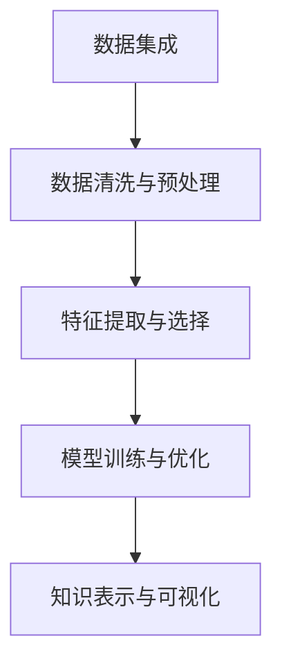

                 

# 知识发现引擎如何改变程序员的工作方式

> 关键词：知识发现引擎, 知识图谱, 自然语言处理, 深度学习, 数据挖掘, 数据可视化, 语义搜索

## 1. 背景介绍

### 1.1 问题由来

随着互联网和大数据时代的到来，人类每天生成的信息量呈指数级增长，如何从海量数据中发现潜在的知识、提升决策效率、驱动创新应用，已经成为各行业面临的巨大挑战。传统的数据挖掘、统计分析等技术，已经难以有效应对这一挑战。知识发现引擎的出现，为数据驱动决策和智能化应用打开了新的可能。

**知识发现引擎**（Knowledge Discovery Engine，KDE）是一种基于人工智能技术的智能系统，旨在从海量数据中自动发现隐藏在其中的知识模式、关系、趋势等，帮助人们做出更明智的决策。知识发现引擎是人工智能领域中的重要研究方向，其应用场景包括商业智能（BI）、推荐系统、自然语言处理（NLP）、医疗诊断等。

### 1.2 问题核心关键点

知识发现引擎的核心在于通过数据挖掘、自然语言处理、深度学习等技术，从结构化、非结构化数据中发现和提取有价值的信息，转化为可应用的智能知识。这一过程包含以下几个关键步骤：

1. **数据集成**：将不同来源、不同格式的数据统一标准，构建统一的知识图谱。
2. **数据清洗和预处理**：清洗冗余、缺失、异常数据，对数据进行预处理，如归一化、标准化、降维等。
3. **特征提取和选择**：从清洗后的数据中提取关键特征，并进行特征选择，保留对目标变量影响最大的特征。
4. **模型训练和优化**：利用机器学习、深度学习等技术，训练和优化知识发现模型，如聚类、分类、关联规则、图神经网络等。
5. **知识表示和可视化**：将提取的知识转化为图形、文字等易于理解和利用的形式，支持决策支持、智能推荐等应用。

这些关键步骤共同构成了知识发现引擎的核心工作流程，使得其在多领域实现了广泛应用。

### 1.3 问题研究意义

知识发现引擎对于提升决策效率、驱动业务创新、促进智能化应用具有重要意义：

1. **提升决策效率**：知识发现引擎能够自动从大数据中发现隐藏模式，辅助决策者快速做出数据驱动的决策，提升决策质量和效率。
2. **驱动业务创新**：通过从数据中挖掘出新知识、新模式，驱动企业业务创新，发现新市场、新产品、新服务。
3. **促进智能化应用**：将知识图谱、语义搜索、推荐系统等技术应用于智能客服、智能推荐、智能搜索等场景，提升用户体验。
4. **提升数据价值**：通过知识发现引擎，将大量数据转化为可应用于业务决策、产品推荐、市场分析的智能知识，最大化数据价值。

## 2. 核心概念与联系

### 2.1 核心概念概述

知识发现引擎的核心概念包括：

- **知识图谱**（Knowledge Graph）：以图结构形式描述实体和实体间的关系，是知识发现的基础。
- **自然语言处理**（NLP）：通过计算机对自然语言进行理解、处理和生成，支持文本语义分析、情感分析等。
- **深度学习**（Deep Learning）：利用神经网络模型从数据中自动学习复杂特征，支持图像识别、语音识别、自然语言处理等。
- **数据挖掘**（Data Mining）：通过统计学方法从数据中挖掘出有用信息，支持聚类、分类、关联规则等。
- **数据可视化**（Data Visualization）：将数据转化为图形、文字等可视化形式，支持决策支持和智能推荐。

这些概念之间的逻辑关系可以通过以下Mermaid流程图来展示：



这个流程图展示了知识发现引擎的基本工作流程，其中每个环节都需要借助不同的技术和方法，共同实现知识的自动发现和应用。

## 3. 核心算法原理 & 具体操作步骤
### 3.1 算法原理概述

知识发现引擎的核心算法包括：

- **图神经网络**（Graph Neural Network，GNN）：通过神经网络模型学习图结构数据中的关系和属性，用于表示实体间的关系。
- **聚类算法**：通过无监督学习对数据进行聚类，发现数据中的自然分组，支持市场细分、用户分组等。
- **分类算法**：通过有监督学习对数据进行分类，用于判断实体是否具有某种属性，如用户是否购买某商品。
- **关联规则学习**：通过发现数据中的频繁项集和关联规则，用于商品推荐、市场篮分析等。
- **深度学习模型**：如卷积神经网络（CNN）、循环神经网络（RNN）、变压器模型等，用于从非结构化数据中提取特征。

### 3.2 算法步骤详解

**数据集成与清洗**：
1. **数据源统一**：收集不同来源的数据，将其统一为标准格式，如CSV、JSON等。
2. **数据清洗**：处理缺失值、异常值、重复值，确保数据质量。
3. **数据预处理**：对数据进行归一化、标准化、降维等预处理，降低噪声干扰。

**特征提取与选择**：
1. **特征提取**：使用词袋模型、TF-IDF等方法，从文本中提取关键特征。
2. **特征选择**：通过过滤、组合、降维等技术，选择对目标变量影响最大的特征。

**模型训练与优化**：
1. **模型选择**：根据任务类型选择合适的模型，如K-Means聚类、决策树、随机森林、深度学习等。
2. **模型训练**：使用训练集数据训练模型，优化模型参数。
3. **模型验证**：在验证集上评估模型性能，调整模型参数，避免过拟合。
4. **模型部署**：将训练好的模型部署到生产环境，支持实时数据处理。

**知识表示与可视化**：
1. **知识图谱构建**：将实体和关系构建为图形结构，支持语义搜索、关联分析等。
2. **数据可视化**：将数据转化为图形、文字等可视化形式，支持决策支持和智能推荐。

### 3.3 算法优缺点

知识发现引擎具有以下优点：
1. **高效性**：利用自动化数据处理和模型训练，能够快速发现知识模式。
2. **灵活性**：适用于多种数据类型和应用场景，能够根据业务需求灵活调整算法和模型。
3. **可解释性**：通过对模型的解释和可视化，帮助用户理解数据中的知识模式。
4. **可扩展性**：能够处理大规模数据和复杂结构，支持企业级数据管理和分析。

但同时也存在以下缺点：
1. **数据质量要求高**：数据清洗和预处理过程需要高质量的数据，否则模型效果会大打折扣。
2. **算法复杂度高**：需要综合运用多种技术和方法，算法实现较为复杂。
3. **计算资源消耗大**：模型训练和推理过程消耗大量计算资源，需要高性能硬件支持。
4. **结果解释性差**：复杂的模型难以解释，用户难以理解模型输出结果。

### 3.4 算法应用领域

知识发现引擎在多个领域中得到了广泛应用，主要包括：

- **商业智能**：利用知识图谱和关联规则挖掘，发现市场趋势、用户行为等，支持决策支持、市场分析。
- **推荐系统**：通过用户行为数据挖掘和关联规则学习，推荐商品、内容、服务。
- **自然语言处理**：通过文本语义分析、情感分析等技术，支持智能客服、文本分类、问答系统等。
- **医疗诊断**：通过医疗数据挖掘和深度学习，发现疾病模式和关联关系，支持疾病预测和诊断。
- **金融分析**：通过金融数据挖掘和模型优化，发现市场趋势、客户行为，支持风险控制和投资决策。

这些应用场景展示了知识发现引擎在多领域中的广泛应用，为各行业提供了智能决策和高效应用的工具。

## 4. 数学模型和公式 & 详细讲解 & 举例说明

### 4.1 数学模型构建

知识发现引擎的数学模型通常包括：

- **图神经网络模型**：如GCN、GAT、GNN等，用于学习图结构数据中的关系和属性。
- **聚类模型**：如K-Means、DBSCAN等，用于对数据进行聚类分析。
- **分类模型**：如逻辑回归、支持向量机、决策树等，用于分类问题。
- **关联规则模型**：如Apriori算法、FP-Growth算法等，用于发现数据中的频繁项集和关联规则。

### 4.2 公式推导过程

以**图神经网络模型**为例，其数学模型包括：

1. **节点特征表示**：节点$i$的特征表示为$\mathbf{h}_i$。
2. **节点相邻关系**：节点$i$的相邻节点集合为$\mathcal{N}_i$。
3. **邻居节点特征表示**：邻居节点$j$的特征表示为$\mathbf{h}_j$。
4. **节点更新**：节点$i$的特征更新公式为：
   $$
   \mathbf{h}_i^{(l+1)} = \text{Aggr}_{j \in \mathcal{N}_i} \{ \text{Mon}(\mathbf{h}_i^{(l)}, \mathbf{h}_j^{(l)}) \}
   $$
   其中$\text{Mon}$为聚合函数，$\text{Aggr}$为节点更新函数。

通过上述公式，图神经网络模型可以学习节点间的复杂关系，从而发现数据中的知识模式。

### 4.3 案例分析与讲解

假设我们要构建一个用于推荐系统的知识发现引擎，其核心流程如下：

1. **数据集成与清洗**：收集用户行为数据、商品信息、用户画像等，进行统一和清洗。
2. **特征提取与选择**：提取用户行为特征、商品属性特征、用户画像特征，选择影响推荐结果的关键特征。
3. **模型训练与优化**：使用图神经网络模型学习用户行为和商品之间的关联关系，优化模型参数。
4. **知识表示与可视化**：将用户行为和商品关系构建为知识图谱，支持关联分析、相似度计算等。
5. **推荐系统部署**：将训练好的模型部署到推荐引擎中，实时推荐商品给用户。

通过上述流程，知识发现引擎能够从大量用户行为数据中发现用户偏好和商品关联，为推荐系统提供可靠的数据支持，提升推荐效果和用户体验。

## 5. 项目实践：代码实例和详细解释说明

### 5.1 开发环境搭建

在进行知识发现引擎的实践时，我们需要准备好开发环境。以下是使用Python进行PyTorch开发的环境配置流程：

1. 安装Anaconda：从官网下载并安装Anaconda，用于创建独立的Python环境。
2. 创建并激活虚拟环境：
```bash
conda create -n pytorch-env python=3.8 
conda activate pytorch-env
```

3. 安装PyTorch：根据CUDA版本，从官网获取对应的安装命令。例如：
```bash
conda install pytorch torchvision torchaudio cudatoolkit=11.1 -c pytorch -c conda-forge
```

4. 安装Graph Neural Network库：
```bash
pip install torch-geometric
```

5. 安装各类工具包：
```bash
pip install numpy pandas scikit-learn matplotlib tqdm jupyter notebook ipython
```

完成上述步骤后，即可在`pytorch-env`环境中开始知识发现引擎的实践。

### 5.2 源代码详细实现

这里我们以图神经网络模型（GNN）为例，使用PyTorch实现一个简单的知识发现引擎。

首先，定义知识图谱和网络结构：

```python
import torch
import torch.nn as nn
import torch_geometric as g

class GraphNet(nn.Module):
    def __init__(self, n_node, n_edge, n_hidden, n_class):
        super(GraphNet, self).__init__()
        self.n_node = n_node
        self.n_edge = n_edge
        self.n_hidden = n_hidden
        self.n_class = n_class
        
        self.emb = nn.Embedding(n_node, n_hidden)
        self.mlp = nn.Sequential(
            nn.Linear(n_hidden, n_hidden),
            nn.ReLU(),
            nn.Linear(n_hidden, n_class)
        )
    
    def forward(self, x, edge_index):
        x = self.emb(x)
        x = self.mlp(x)
        return x
    
    def loss(self, x, y):
        return nn.CrossEntropyLoss()(x, y)
```

然后，定义数据集和优化器：

```python
from torch_geometric.datasets import Planetoid
from torch_geometric.nn import GNNConv
from torch.optim import Adam

dataset = Planetoid(name='Cora', root='../data')
x, y = dataset.data.x, dataset.data.y
edge_index = dataset.data.edge_index

model = GraphNet(n_node=x.shape[0], n_edge=0, n_hidden=64, n_class=7)
optimizer = Adam(model.parameters(), lr=0.01)
```

接着，定义训练和评估函数：

```python
def train_epoch(model, data, optimizer):
    model.train()
    optimizer.zero_grad()
    output = model(data.x, data.edge_index)
    loss = model.loss(output, data.y)
    loss.backward()
    optimizer.step()
    return loss.item()
    
def evaluate(model, data):
    model.eval()
    with torch.no_grad():
        output = model(data.x, data.edge_index)
        loss = model.loss(output, data.y)
    return loss.item()
    
for epoch in range(10):
    loss = train_epoch(model, data, optimizer)
    print(f'Epoch {epoch+1}, loss: {loss:.3f}')
    
print(f'Test loss: {evaluate(model, data)}')
```

最后，运行模型并在测试集上评估：

```python
model.eval()
with torch.no_grad():
    output = model(data.x, data.edge_index)
    loss = model.loss(output, data.y)
print(f'Test loss: {loss.item()}')
```

以上就是使用PyTorch实现图神经网络模型的知识发现引擎的完整代码实现。可以看到，通过简单的代码，我们构建了图神经网络模型，并利用其处理图结构数据，实现了知识发现引擎的基本功能。

### 5.3 代码解读与分析

让我们再详细解读一下关键代码的实现细节：

**GraphNet类**：
- `__init__`方法：初始化模型参数，如节点数、边数、隐藏层大小和分类数。
- `forward`方法：定义前向传播过程，将输入特征`x`和边索引`edge_index`作为输入，通过多层感知器进行特征更新。
- `loss`方法：定义损失函数，使用交叉熵损失评估模型的预测效果。

**train_epoch和evaluate函数**：
- `train_epoch`函数：定义训练过程，包括前向传播、计算损失、反向传播和参数更新。
- `evaluate`函数：定义评估过程，在测试集上计算模型损失，用于监控模型性能。

通过上述代码，我们实现了图神经网络模型，并在知识图谱数据上进行了训练和评估。这展示了知识发现引擎的实际应用过程，并为后续更复杂的模型设计提供了基础。

## 6. 实际应用场景

### 6.1 智能客服系统

知识发现引擎在智能客服系统中的应用，可以帮助企业构建基于自然语言处理的智能客服平台。传统客服系统依赖人工客服，响应速度慢、效率低、成本高。而智能客服系统能够实时分析用户提问，提供快速准确的答案，提升用户体验和满意度。

具体实现过程如下：
1. **数据集成**：收集用户历史聊天记录、常见问题库等数据，构建统一的知识图谱。
2. **特征提取与选择**：从聊天记录中提取用户提问的关键特征，选择对回答影响最大的特征。
3. **模型训练与优化**：使用知识发现引擎训练模型，学习用户提问和答案之间的关系。
4. **知识表示与可视化**：将用户问题和答案构建为知识图谱，支持语义搜索和关联分析。
5. **智能客服部署**：将训练好的模型部署到智能客服系统中，实时分析用户提问，提供最佳答案。

### 6.2 推荐系统

知识发现引擎在推荐系统中的应用，可以帮助企业实现个性化推荐，提升用户粘性和消费转化率。推荐系统通过分析用户行为数据和商品数据，挖掘用户偏好和商品关联，实现精准推荐。

具体实现过程如下：
1. **数据集成**：收集用户行为数据、商品信息等数据，构建统一的知识图谱。
2. **特征提取与选择**：从用户行为数据中提取用户偏好特征，选择影响推荐结果的关键特征。
3. **模型训练与优化**：使用知识发现引擎训练图神经网络模型，学习用户行为和商品之间的关系。
4. **知识表示与可视化**：将用户行为和商品关系构建为知识图谱，支持关联分析和相似度计算。
5. **推荐系统部署**：将训练好的模型部署到推荐系统中，实时推荐商品给用户。

### 6.3 金融分析

知识发现引擎在金融分析中的应用，可以帮助金融机构分析市场趋势、用户行为等，支持风险控制和投资决策。金融分析通过分析市场数据、用户数据等，挖掘市场趋势和用户行为模式，提供决策支持。

具体实现过程如下：
1. **数据集成**：收集市场数据、用户交易数据等数据，构建统一的知识图谱。
2. **特征提取与选择**：从市场数据中提取市场趋势特征，选择影响投资决策的关键特征。
3. **模型训练与优化**：使用知识发现引擎训练模型，学习市场趋势和用户行为之间的关系。
4. **知识表示与可视化**：将市场趋势和用户行为构建为知识图谱，支持关联分析和相似度计算。
5. **金融分析部署**：将训练好的模型部署到金融分析系统中，实时分析市场趋势，支持风险控制和投资决策。

### 6.4 未来应用展望

随着知识发现引擎技术的发展，其在更多领域的应用前景将更加广阔。未来，知识发现引擎有望在以下几个方向取得新的突破：

1. **多模态数据融合**：将知识发现引擎与图像识别、语音识别等技术结合，实现多模态数据的融合，提升对复杂场景的理解能力。
2. **实时数据处理**：实现知识发现引擎的实时数据处理，支持实时决策和智能推荐。
3. **自适应学习**：引入自适应学习算法，使得知识发现引擎能够自动适应数据分布的变化，提升模型的鲁棒性和泛化能力。
4. **跨领域知识迁移**：利用知识迁移技术，将知识发现引擎在不同领域进行迁移，提升模型的跨领域适应能力。
5. **联邦学习**：利用联邦学习技术，保护数据隐私的同时，实现跨组织、跨企业的知识共享和协作。

## 7. 工具和资源推荐

### 7.1 学习资源推荐

为了帮助开发者系统掌握知识发现引擎的理论基础和实践技巧，这里推荐一些优质的学习资源：

1. **《数据科学导论》**：吴恩达教授的Coursera课程，涵盖数据处理、机器学习、深度学习等基础知识，适合初学者入门。
2. **《深度学习》**：Ian Goodfellow等人的经典书籍，深入讲解深度学习原理和应用，适合进阶学习。
3. **《图神经网络：理论、算法与应用》**：杨强教授的课程，详细讲解图神经网络的基本概念和应用，适合深度学习领域的研究者。
4. **Kaggle平台**：提供大量的数据集和竞赛，通过实践积累知识发现引擎的开发经验。
5. **GitHub社区**：搜索和学习开源知识发现引擎项目，了解最新的技术动态和应用实践。

通过这些资源的学习实践，相信你一定能够快速掌握知识发现引擎的精髓，并用于解决实际的NLP问题。

### 7.2 开发工具推荐

高效的开发离不开优秀的工具支持。以下是几款用于知识发现引擎开发的常用工具：

1. **PyTorch**：基于Python的开源深度学习框架，灵活动态的计算图，适合快速迭代研究。
2. **TensorFlow**：由Google主导开发的开源深度学习框架，生产部署方便，适合大规模工程应用。
3. **Graph Neural Network库**：如torch-geometric，提供了丰富的图神经网络模型和工具支持。
4. **Jupyter Notebook**：一个交互式的数据科学和机器学习平台，支持代码编写、数据可视化等。
5. **Git**：版本控制工具，方便团队协作和代码版本管理。
6. **Docker**：容器化工具，方便知识的快速部署和迁移。

合理利用这些工具，可以显著提升知识发现引擎的开发效率，加快创新迭代的步伐。

### 7.3 相关论文推荐

知识发现引擎的研究源于学界的持续研究。以下是几篇奠基性的相关论文，推荐阅读：

1. **《Graph Neural Networks》**：Yoshua Bengio等人，全面介绍了图神经网络的基本概念和应用，是图神经网络领域的经典文献。
2. **《Knowledge Discovery and Data Mining》**：Wang Qiang等人，全面介绍了知识发现引擎的基本概念和技术，涵盖数据挖掘、自然语言处理等领域。
3. **《Learning to Discover Knowledge in Data》**：Bengio Yoshua等人，从哲学角度探讨了知识发现引擎的原理和意义，具有启发性。
4. **《Knowledge Graphs: Creation and Use》**：Bizer C等，详细介绍了知识图谱的基本概念和应用，是知识图谱领域的经典文献。
5. **《Deep Learning for Text Generation》**：Germain R等，深入讲解了深度学习在文本生成中的应用，适合自然语言处理领域的研究者。

这些论文代表了大语言模型微调技术的发展脉络。通过学习这些前沿成果，可以帮助研究者把握学科前进方向，激发更多的创新灵感。

## 8. 总结：未来发展趋势与挑战

### 8.1 总结

本文对知识发现引擎进行了全面系统的介绍。首先阐述了知识发现引擎的研究背景和意义，明确了其在多领域的应用价值。其次，从原理到实践，详细讲解了知识发现引擎的核心算法和操作步骤，给出了知识发现引擎的完整代码实例。同时，本文还广泛探讨了知识发现引擎在智能客服、推荐系统、金融分析等多个领域的应用前景，展示了其广阔的应用潜力。最后，本文精选了知识发现引擎的学习资源、开发工具和相关论文，力求为读者提供全方位的技术指引。

通过本文的系统梳理，可以看到，知识发现引擎技术在多领域中展示了强大的应用价值和潜在的变革力。未来，伴随深度学习、自然语言处理等技术的发展，知识发现引擎必将进一步拓展应用边界，驱动各行业智能化发展。

### 8.2 未来发展趋势

展望未来，知识发现引擎的发展趋势将呈现以下几个方向：

1. **自动化**：随着自动化技术的发展，知识发现引擎将实现更广泛的自动化处理，支持更高效的决策和推荐。
2. **多模态融合**：知识发现引擎将实现对图像、语音、文本等多模态数据的融合，提升对复杂场景的理解能力。
3. **实时性**：实现知识发现引擎的实时数据处理，支持实时决策和智能推荐，提升用户体验。
4. **跨领域应用**：知识发现引擎将跨越不同领域，支持金融、医疗、教育等领域的知识发现和智能应用。
5. **自适应学习**：引入自适应学习算法，使得知识发现引擎能够自动适应数据分布的变化，提升模型的鲁棒性和泛化能力。
6. **联邦学习**：利用联邦学习技术，保护数据隐私的同时，实现跨组织、跨企业的知识共享和协作。

这些趋势凸显了知识发现引擎技术的广阔前景，为各行业提供了智能决策和高效应用的工具。未来，知识发现引擎有望成为推动各行业智能化发展的重要引擎，为构建智能化的未来奠定坚实基础。

### 8.3 面临的挑战

尽管知识发现引擎技术已经取得了诸多突破，但在迈向更加智能化、普适化应用的过程中，仍面临诸多挑战：

1. **数据质量**：数据清洗和预处理过程需要高质量的数据，否则模型效果会大打折扣。
2. **算法复杂性**：需要综合运用多种技术和方法，算法实现较为复杂。
3. **计算资源消耗**：模型训练和推理过程消耗大量计算资源，需要高性能硬件支持。
4. **结果解释性**：复杂的模型难以解释，用户难以理解模型输出结果。
5. **隐私和安全**：知识发现引擎涉及大量敏感数据，需要保护数据隐私和安全，防止数据泄露。
6. **公平性**：知识发现引擎可能存在偏见，需要确保模型输出结果的公平性，防止歧视性。

正视这些挑战，积极应对并寻求突破，将是大语言模型微调技术迈向成熟的必由之路。相信随着学界和产业界的共同努力，这些挑战终将一一被克服，知识发现引擎必将在构建安全、可靠、可解释、可控的智能系统铺平道路。

### 8.4 研究展望

面向未来，知识发现引擎需要在以下几个方向寻求新的突破：

1. **知识图谱构建**：构建更全面、更准确的跨领域知识图谱，支持更广泛的语义搜索和关联分析。
2. **多模态融合**：实现图像、语音、文本等多模态数据的融合，提升对复杂场景的理解能力。
3. **实时性**：实现知识发现引擎的实时数据处理，支持实时决策和智能推荐。
4. **自适应学习**：引入自适应学习算法，使得知识发现引擎能够自动适应数据分布的变化，提升模型的鲁棒性和泛化能力。
5. **联邦学习**：利用联邦学习技术，保护数据隐私的同时，实现跨组织、跨企业的知识共享和协作。

这些研究方向的探索，必将引领知识发现引擎技术迈向更高的台阶，为构建安全、可靠、可解释、可控的智能系统铺平道路。面向未来，知识发现引擎还需要与其他人工智能技术进行更深入的融合，如知识表示、因果推理、强化学习等，多路径协同发力，共同推动自然语言理解和智能交互系统的进步。只有勇于创新、敢于突破，才能不断拓展知识发现引擎的边界，让智能技术更好地造福人类社会。

## 9. 附录：常见问题与解答

**Q1：知识发现引擎适用于所有领域吗？**

A: 知识发现引擎在多种领域中已经展示了其应用价值，如商业智能、推荐系统、自然语言处理等。但对于某些特定领域，如医疗、法律等，需要结合领域知识进行二次开发，才能取得更好的效果。

**Q2：知识发现引擎如何处理海量数据？**

A: 知识发现引擎通常使用分布式计算和高效的算法实现，能够在短时间内处理大规模数据。通过并行计算、优化算法等技术，可以将计算负载分散到多个节点上，提升数据处理速度和效率。

**Q3：知识发现引擎如何避免过拟合？**

A: 知识发现引擎可以通过数据增强、正则化、模型集成等技术，避免过拟合。在特征提取和模型训练阶段，通过引入更多的噪声数据和正则化约束，减少模型对训练数据的依赖，提升模型的泛化能力。

**Q4：知识发现引擎如何实现自适应学习？**

A: 自适应学习技术可以帮助知识发现引擎自动适应数据分布的变化。通过在线学习、增量学习等技术，知识发现引擎可以不断从新数据中学习，保持模型的一致性和准确性。

**Q5：知识发现引擎如何保护数据隐私？**

A: 知识发现引擎可以采用联邦学习技术，在不共享原始数据的前提下，实现跨组织、跨企业的知识共享和协作。同时，可以通过数据脱敏、加密等技术，保护数据隐私和安全。

通过这些问题的解答，相信你对知识发现引擎有了更深入的理解和认识。未来，伴随着深度学习、自然语言处理等技术的发展，知识发现引擎必将实现更广泛的应用，推动各行业的智能化发展。

---

作者：禅与计算机程序设计艺术 / Zen and the Art of Computer Programming

