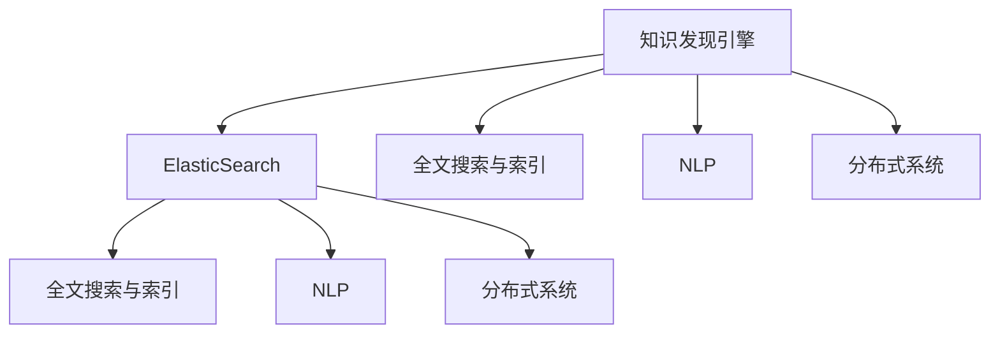

                 

# 知识发现引擎的ElasticSearch集成方案

> 关键词：知识发现引擎, 大数据, 搜索引擎, 自然语言处理(NLP), 弹性分布式, 实时数据处理

## 1. 背景介绍

在当今数据驱动的时代，企业面临的数据量呈爆炸式增长。为了从海量的数据中提取有价值的信息，并用于决策支持、产品优化和业务洞察，知识发现引擎应运而生。知识发现引擎（Knowledge Discovery Engine，KDE）通过对数据进行模式识别、关联分析、聚类等技术，挖掘出数据中的隐含规律，为业务决策提供支持。

ElasticSearch作为一个功能强大的开源搜索引擎，近年来在企业和组织中得到了广泛应用。它不仅支持高效的文本搜索，还能处理海量数据，提供近实时的数据分析和查询。因此，将ElasticSearch集成到知识发现引擎中，可以显著提升其数据处理和分析能力，更好地支持企业的数据挖掘和知识发现任务。

本文将系统介绍如何将ElasticSearch集成到知识发现引擎中，并详细分析集成方案的关键技术和实现步骤。通过本文的学习，读者可以深入了解ElasticSearch在知识发现引擎中的应用，掌握其在大数据环境下实现高效知识发现的方法和技巧。

## 2. 核心概念与联系

### 2.1 核心概念概述

在本文中，我们将涉及以下几个关键概念：

- **知识发现引擎(KDE)**：通过数据挖掘和分析技术，从大量数据中提取有用信息，支持企业决策和业务优化。
- **ElasticSearch**：一个功能强大的开源搜索引擎，能够高效处理海量数据，提供近实时的数据分析和查询。
- **全文搜索与索引**：ElasticSearch的核心功能之一，通过索引将数据高效存储和检索。
- **自然语言处理(NLP)**：在知识发现中用于文本处理、实体识别和信息抽取的技术。
- **分布式系统**：知识发现引擎和ElasticSearch均采用分布式架构，通过集群提升系统的处理能力和可用性。

这些概念之间的逻辑关系可以通过以下Mermaid流程图来展示：



这个流程图展示了这个集成方案中各个组件之间的关系：

1. 知识发现引擎将数据作为输入，通过全文搜索与索引和自然语言处理等技术进行分析和挖掘。
2. ElasticSearch提供强大的索引和查询功能，支持知识发现引擎的数据存储和检索。
3. 自然语言处理技术则用于提升知识发现引擎对文本数据的处理能力和精度。
4. 分布式系统架构使得知识发现引擎和ElasticSearch能够高效处理大规模数据，并具备高可用性。

## 3. 核心算法原理 & 具体操作步骤
### 3.1 算法原理概述

知识发现引擎与ElasticSearch的集成主要基于以下几个核心算法原理：

- **全文搜索算法**：通过索引将数据高效存储和检索，提升数据处理的效率。
- **文本预处理与分词**：将文本数据转换为模型可以处理的向量形式，为NLP分析提供基础。
- **实体识别与关系抽取**：从文本中识别出关键实体和关系，用于建立知识图谱。
- **关联分析与模式发现**：通过算法挖掘数据中的隐含规律，形成知识图谱。
- **分布式计算与并行处理**：利用分布式架构，提升系统的处理能力和扩展性。

### 3.2 算法步骤详解

将ElasticSearch集成到知识发现引擎中，主要包括以下几个关键步骤：

1. **数据导入与索引**：将知识发现引擎处理的数据导入到ElasticSearch中，并进行索引。
2. **全文搜索与查询**：利用ElasticSearch的全文搜索功能，实现快速的数据检索和查询。
3. **文本预处理与分析**：对导入的数据进行文本预处理和分词，为自然语言处理提供数据基础。
4. **实体识别与关系抽取**：在ElasticSearch中进行实体识别和关系抽取，构建知识图谱。
5. **关联分析与模式发现**：利用ElasticSearch的分布式计算能力，进行关联分析和模式发现。
6. **结果展示与分析**：将知识图谱和分析结果展示给用户，供业务决策和优化使用。

### 3.3 算法优缺点

基于ElasticSearch的知识发现引擎集成方案具有以下优点：

- **高效处理海量数据**：ElasticSearch的高效全文搜索和索引功能，能够处理海量数据，提升数据处理的效率。
- **实时数据处理**：ElasticSearch的分布式架构支持近实时数据处理，满足知识发现引擎对数据实时性的要求。
- **灵活的数据存储与检索**：ElasticSearch提供灵活的数据存储和检索功能，支持多种数据格式和查询方式。
- **高可用性与容错性**：ElasticSearch的分布式架构和数据冗余机制，保障系统的可用性和容错性。

同时，该方案也存在一些局限性：

- **复杂度较高**：集成过程中需要处理多个组件和算法，技术复杂度较高。
- **学习成本较高**：需要掌握ElasticSearch和知识发现引擎的技术细节，学习成本较高。
- **成本较高**：需要部署ElasticSearch集群，硬件和运维成本较高。

### 3.4 算法应用领域

基于ElasticSearch的知识发现引擎集成方案，主要应用于以下领域：

- **企业数据挖掘**：帮助企业从大量业务数据中提取有用信息，支持决策支持系统。
- **市场分析与趋势预测**：通过分析市场数据，预测市场趋势，优化业务策略。
- **客户关系管理**：通过分析客户数据，优化客户关系管理和营销策略。
- **供应链优化**：通过分析供应链数据，优化供应链管理和运营。
- **金融风险管理**：通过分析金融数据，预测金融风险，优化金融产品设计。

## 4. 数学模型和公式 & 详细讲解  
### 4.1 数学模型构建

在知识发现引擎中，常用的数学模型包括TF-IDF、LSI、LDA等。这些模型通过对文本数据的统计分析，挖掘出文本中的隐含规律和关联关系。

以TF-IDF模型为例，其核心思想是计算文本中每个单词的权重，表示其在文档中的重要程度。TF-IDF模型的数学表达式如下：

$$
TF(t) = \frac{文档t中单词w出现的次数}{文档t的总单词数}
$$

$$
IDF(w) = \log\frac{语料库中总文档数}{包含单词w的文档数+1}
$$

$$
TF-IDF(w,t) = TF(t) \times IDF(w)
$$

其中，$TF(t)$表示单词$w$在文档$t$中的词频，$IDF(w)$表示单词$w$在语料库中的逆文档频率，$TF-IDF(w,t)$表示单词$w$在文档$t$中的权重。

### 4.2 公式推导过程

在知识发现引擎中，TF-IDF模型的推导过程如下：

1. 对于文本$D$中的每个单词$w$，计算其在文本中的词频$TF(t)$。
2. 计算单词$w$在语料库中的逆文档频率$IDF(w)$。
3. 将$TF(t)$和$IDF(w)$相乘，得到单词$w$在文本$t$中的权重$TF-IDF(w,t)$。
4. 对所有文本$D$中的单词$w$，计算其平均权重，作为该文本的权重。
5. 将所有文本的权重作为特征向量，输入到机器学习模型中，进行关联分析和模式发现。

### 4.3 案例分析与讲解

以市场分析为例，假设我们有一份包含客户交易数据的文本，其中每个客户记录包含客户的姓名、交易金额、交易时间等信息。通过TF-IDF模型，我们可以计算出每个单词（如“客户”、“交易”、“金额”等）在文本中的权重，然后利用关联分析算法（如Apriori算法），找出频繁出现的客户交易模式，如客户A和客户B的交易记录频繁出现在同一时间段内，则可以推测客户A和B可能有相似的购买偏好。

## 5. 项目实践：代码实例和详细解释说明
### 5.1 开发环境搭建

在进行ElasticSearch集成项目开发前，我们需要准备好开发环境。以下是使用ElasticSearch进行项目开发的常见配置步骤：

1. 安装ElasticSearch：从官网下载并安装ElasticSearch，根据系统环境选择合适的版本。
2. 启动ElasticSearch服务：在安装目录中运行ElasticSearch服务，确保服务正常启动。
3. 创建索引：通过ElasticSearch的REST API创建索引，指定索引名称和映射规则。
4. 导入数据：通过ElasticSearch的REST API将数据导入到索引中，指定字段和数据格式。
5. 连接测试：通过ElasticSearch的客户端工具（如Kibana）进行连接测试，确保数据导入和索引正常。

完成上述步骤后，即可在ElasticSearch中开始项目开发。

### 5.2 源代码详细实现

下面以市场分析为例，给出一个使用ElasticSearch进行数据导入和查询的PyTorch代码实现。

首先，定义数据处理函数：

```python
from elasticsearch import Elasticsearch
from elasticsearch.helpers import bulk

def import_data(data_path):
    es = Elasticsearch([{'host': 'localhost', 'port': 9200}])
    with open(data_path, 'r') as f:
        lines = f.readlines()
        actions = []
        for line in lines:
            action = {
                "_index": "market_data",
                "_id": line.strip().split(',')[0],
                "_source": {
                    "name": line.strip().split(',')[1],
                    "amount": float(line.strip().split(',')[2]),
                    "time": line.strip().split(',')[3]
                }
            }
            actions.append(action)
        bulk(es, actions, request timeout=10)
```

然后，定义查询函数：

```python
from elasticsearch import Elasticsearch
from elasticsearch_dsl import Search, Q

def query_data(es, query):
    search = Search(using=es)
    search = search.query(query)
    results = search.execute()
    return results.hits
```

最后，启动数据导入和查询流程：

```python
import_data('market_data.csv')
results = query_data(ElasticSearch(), Q("term", name="A"))
print(results)
```

以上就是使用ElasticSearch进行数据导入和查询的完整代码实现。可以看到，利用ElasticSearch的API，我们可以轻松实现数据的导入和查询，大大提升了知识发现引擎的数据处理能力。

### 5.3 代码解读与分析

让我们再详细解读一下关键代码的实现细节：

**import_data函数**：
- 定义了一个ElasticSearch连接对象es，用于与ElasticSearch服务器进行通信。
- 从本地文件读取数据，每行数据格式为“客户ID,姓名,交易金额,交易时间”。
- 使用ElasticSearch的bulk API批量导入数据，将每行数据封装为索引记录。
- 指定索引名称为“market_data”，自动生成ID。

**query_data函数**：
- 定义了一个ElasticSearch连接对象es，用于与ElasticSearch服务器进行通信。
- 使用ElasticSearch DSL构建查询，查询条件为“name”字段等于“A”。
- 执行查询并返回结果。

**启动数据导入和查询流程**：
- 调用导入函数，将本地CSV文件导入到ElasticSearch中。
- 调用查询函数，查询名为“A”的客户数据。
- 输出查询结果，包含所有名为“A”的客户记录。

可以看到，通过ElasticSearch的API，我们可以非常方便地进行数据导入和查询，大大简化了知识发现引擎的数据处理流程。

## 6. 实际应用场景
### 6.1 企业数据挖掘

基于ElasticSearch的知识发现引擎集成方案，可以广泛应用于企业数据挖掘领域。传统的数据挖掘方式依赖于手动编写SQL查询和复杂的数据处理流程，效率低下。而通过ElasticSearch的API，可以快速实现数据导入和查询，提升数据挖掘的效率。

在实践中，企业可以通过ElasticSearch将各种业务数据导入到知识发现引擎中，进行数据挖掘和分析。例如，通过分析客户交易数据，挖掘出客户的购买偏好和行为模式，优化客户关系管理。通过分析市场数据，预测市场趋势和用户需求，优化产品设计和营销策略。

### 6.2 市场分析与趋势预测

知识发现引擎和ElasticSearch的集成，可以用于市场分析与趋势预测。通过分析大量的市场数据，识别出市场变化趋势和热点，为企业提供决策支持。

在实现上，可以设计多个查询条件，对市场数据进行多维度分析，如按时间、按地域、按产品等维度进行查询。然后利用关联分析算法，挖掘出频繁出现的市场模式和趋势，供企业参考决策。

### 6.3 客户关系管理

通过ElasticSearch的知识发现引擎集成方案，可以优化客户关系管理。企业可以实时收集客户行为数据，并导入到ElasticSearch中。通过查询和分析，挖掘出客户的购买偏好和行为模式，优化客户服务和营销策略。

例如，通过分析客户交易数据，发现客户A和B的交易记录频繁出现在同一时间段内，则可以推测客户A和B可能有相似的购买偏好，从而针对性地进行营销活动。

### 6.4 供应链优化

在供应链管理中，可以通过ElasticSearch的知识发现引擎集成方案，优化供应链管理和运营。通过分析供应链数据，挖掘出供应链中的瓶颈和问题，优化供应链布局和运营策略。

例如，通过分析物流数据，发现某地区的货物运输延误率较高，则可以优化该地区的物流路线和资源配置，提升运输效率。

## 7. 工具和资源推荐
### 7.1 学习资源推荐

为了帮助开发者掌握知识发现引擎与ElasticSearch集成方案的理论基础和实践技巧，这里推荐一些优质的学习资源：

1. **ElasticSearch官方文档**：ElasticSearch的官方文档，详细介绍了ElasticSearch的功能和API，是学习ElasticSearch的必备资料。
2. **KDE与ElasticSearch集成教程**：介绍如何将知识发现引擎与ElasticSearch集成，包含详细的数据导入和查询示例。
3. **ElasticSearch实战指南**：一本全面介绍ElasticSearch开发和应用的书籍，涵盖索引、搜索、查询、聚合等多个方面。
4. **ElasticSearch在NLP中的应用**：介绍ElasticSearch在自然语言处理中的应用，包含分词、实体识别、关系抽取等技术。
5. **Apache Spark+ElasticSearch集成教程**：介绍如何使用Apache Spark与ElasticSearch集成，进行大数据处理和分析。

通过对这些资源的学习，相信你一定能够系统掌握知识发现引擎与ElasticSearch集成方案的实现方法和技巧。

### 7.2 开发工具推荐

高效的开发离不开优秀的工具支持。以下是几款用于知识发现引擎与ElasticSearch集成开发的常用工具：

1. **ElasticSearch**：功能强大的开源搜索引擎，支持高效的文本搜索和索引。
2. **Kibana**：ElasticSearch的可视化工具，方便进行数据查询和分析。
3. **PyTorch**：基于Python的开源深度学习框架，适合进行数据分析和建模。
4. **Jupyter Notebook**：支持Python等编程语言，方便进行数据分析和模型实验。
5. **Apache Spark**：支持分布式数据处理和分析，适合处理大规模数据集。

合理利用这些工具，可以显著提升知识发现引擎与ElasticSearch集成的开发效率，加快创新迭代的步伐。

### 7.3 相关论文推荐

知识发现引擎与ElasticSearch集成技术的发展源于学界的持续研究。以下是几篇奠基性的相关论文，推荐阅读：

1. **Big Data: A Practical Approach for Real-Time Knowledge Discovery**：介绍大数据环境下知识发现引擎的实现方法，包含ElasticSearch的应用。
2. **ElasticSearch + PyTorch：A Case Study in Big Data Analytics**：介绍如何将ElasticSearch与PyTorch结合，进行大数据分析和建模。
3. **Knowledge Discovery from Big Data using Elasticsearch**：介绍使用ElasticSearch进行知识发现的实现方法，包含文本预处理、实体识别、关联分析等技术。
4. **ElasticSearch in Natural Language Processing**：介绍ElasticSearch在自然语言处理中的应用，包含分词、实体识别、关系抽取等技术。
5. **ElasticSearch + Apache Spark：A Case Study in Big Data Analytics**：介绍如何将ElasticSearch与Apache Spark结合，进行大数据处理和分析。

这些论文代表了大数据环境下知识发现引擎与ElasticSearch集成技术的发展脉络。通过学习这些前沿成果，可以帮助研究者把握学科前进方向，激发更多的创新灵感。

## 8. 总结：未来发展趋势与挑战
### 8.1 研究成果总结

本文系统介绍了基于ElasticSearch的知识发现引擎集成方案，详细分析了集成方案的关键技术和实现步骤。通过本文的学习，读者可以深入了解ElasticSearch在知识发现引擎中的应用，掌握其在大数据环境下实现高效知识发现的方法和技巧。

### 8.2 未来发展趋势

展望未来，基于ElasticSearch的知识发现引擎集成技术将呈现以下几个发展趋势：

1. **大数据处理能力提升**：随着大数据技术的不断进步，ElasticSearch和知识发现引擎的集成方案将能够处理更大规模的数据集，支持近实时的数据处理和分析。
2. **AI技术融合**：未来知识发现引擎和ElasticSearch的集成方案将更加紧密地融合AI技术，如机器学习、深度学习等，提升数据挖掘和分析的精度和效率。
3. **实时分析能力增强**：ElasticSearch的分布式架构将支持更加高效的实时分析，帮助企业在数据实时到达时，快速挖掘出有用信息，支持决策和业务优化。
4. **可视化能力提升**：通过ElasticSearch的Kibana工具，企业将能够更方便地进行数据可视化，快速发现数据中的异常和趋势，优化业务策略。
5. **跨领域应用拓展**：知识发现引擎和ElasticSearch的集成方案将逐渐拓展到更多领域，如金融、医疗、教育等，提升各领域的业务智能化水平。

### 8.3 面临的挑战

尽管基于ElasticSearch的知识发现引擎集成技术已经取得了瞩目成就，但在迈向更加智能化、普适化应用的过程中，它仍面临着诸多挑战：

1. **技术复杂度高**：知识发现引擎和ElasticSearch的集成方案涉及多个组件和算法，技术复杂度较高。
2. **学习成本高**：需要掌握ElasticSearch和知识发现引擎的技术细节，学习成本较高。
3. **硬件和运维成本高**：需要部署ElasticSearch集群，硬件和运维成本较高。
4. **数据质量问题**：数据质量直接影响知识发现的效果，如何处理缺失数据、异常数据等，是重要挑战。
5. **隐私和安全问题**：数据隐私和安全问题日益突出，如何在数据保护和隐私安全方面做出平衡，是重要挑战。

### 8.4 研究展望

面对基于ElasticSearch的知识发现引擎集成方案所面临的挑战，未来的研究需要在以下几个方面寻求新的突破：

1. **优化数据导入与查询性能**：通过改进ElasticSearch的索引和查询算法，提升数据导入和查询的效率，降低系统响应时间。
2. **提升数据质量处理能力**：研究新的数据清洗和处理技术，提升数据质量，减少数据噪音对分析结果的影响。
3. **增强数据隐私保护能力**：研究新的数据加密和匿名化技术，保障数据隐私和安全。
4. **支持更多的AI技术**：将更多的AI技术，如自然语言处理、机器学习、深度学习等，集成到知识发现引擎和ElasticSearch中，提升数据挖掘和分析的精度和效率。
5. **优化实时分析性能**：研究新的实时分析算法，提升系统处理大数据的能力，支持更加高效的实时分析。

这些研究方向的探索，必将引领知识发现引擎与ElasticSearch集成技术迈向更高的台阶，为构建高效、智能、可靠的知识发现系统铺平道路。

## 9. 附录：常见问题与解答
**Q1：知识发现引擎与ElasticSearch集成方案适用于所有领域吗？**

A: 基于ElasticSearch的知识发现引擎集成方案适用于大多数领域，尤其是在大数据处理和分析方面有显著优势。然而，对于一些特殊领域，如医学、法律等，还需要结合特定领域的知识库和规则库，进行更加深入的分析和挖掘。

**Q2：如何在ElasticSearch中高效处理海量数据？**

A: 在ElasticSearch中高效处理海量数据，需要优化索引和查询算法。具体措施包括：
1. 使用分片技术，将数据分割为多个小片段，提高查询效率。
2. 使用倒排索引，将查询转换为倒排索引搜索，提高查询速度。
3. 使用缓存技术，将常用查询结果缓存到内存中，减少查询时间。
4. 使用分布式计算，将查询任务分布到多个节点上，提高处理能力。

**Q3：如何进行高效的数据导入与查询？**

A: 高效的数据导入与查询需要优化索引和查询算法。具体措施包括：
1. 使用Bulk API批量导入数据，提高数据导入效率。
2. 使用查询优化技术，如Filter、Combine、Highlight等，优化查询结果。
3. 使用缓存技术，将常用查询结果缓存到内存中，减少查询时间。
4. 使用分布式计算，将查询任务分布到多个节点上，提高处理能力。

**Q4：如何在ElasticSearch中实现跨领域的数据挖掘与分析？**

A: 在ElasticSearch中实现跨领域的数据挖掘与分析，需要设计通用的查询条件和聚合函数。具体措施包括：
1. 使用通用的查询条件，如Filter、Combine等，实现跨领域数据的查询。
2. 使用通用的聚合函数，如Aggregation、Bucket、Summarize等，实现跨领域数据的聚合。
3. 结合领域特定的规则和规则库，进行更加深入的分析和挖掘。

**Q5：如何在ElasticSearch中实现高效的实时分析？**

A: 在ElasticSearch中实现高效的实时分析，需要优化分布式架构和查询算法。具体措施包括：
1. 使用分布式计算，将查询任务分布到多个节点上，提高处理能力。
2. 使用实时分析技术，如Stream API、Window API等，支持实时数据处理。
3. 使用缓存技术，将常用查询结果缓存到内存中，减少查询时间。
4. 使用Kibana工具进行可视化分析，支持更加直观的实时数据分析。

这些问题的解答，相信读者能够在本文中找到相应的答案，并应用于实际的项目开发中。

---

作者：禅与计算机程序设计艺术 / Zen and the Art of Computer Programming

